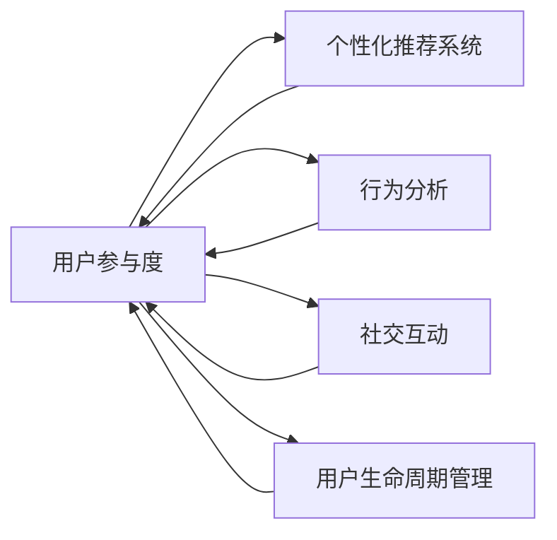

                 

# 知识付费创业中的用户参与度提升策略

## 1. 背景介绍

在数字经济的浪潮中，知识付费已成为引领消费趋势的新兴市场。近年来，知识付费平台如雨后春笋般涌现，用户对其需求也与日俱增。然而，随着市场竞争的加剧和用户需求的不断变化，如何提升用户参与度，保持用户黏性，成为知识付费平台亟需解决的问题。

本文将探讨在知识付费创业中，如何运用数据驱动和人工智能技术，构建高效的用户参与机制，提升用户体验和满意度，促进平台长期稳定发展。

## 2. 核心概念与联系

### 2.1 核心概念概述

为理解用户参与度的提升策略，本节将介绍几个关键概念：

- **用户参与度（User Engagement）**：指用户在平台上的活跃度和参与程度，包括访问次数、消费频次、互动行为等。高用户参与度意味着用户对平台的价值认同和忠诚度。
- **个性化推荐系统（Personalized Recommendation System）**：通过分析用户历史行为和兴趣，为其推荐个性化的内容，提升用户体验和参与度。
- **行为分析（Behavioral Analysis）**：对用户在平台上的操作行为进行数据挖掘和分析，找出用户行为模式，优化用户体验。
- **社交互动（Social Interaction）**：通过构建用户社区，促进用户之间的互动交流，增强用户粘性。
- **用户生命周期管理（User Lifecycle Management）**：通过用户画像、流失预警、续订策略等手段，延长用户生命周期，增加平台收益。

这些概念相互关联，共同构建了一个用户参与度的提升框架。

### 2.2 核心概念原理和架构的 Mermaid 流程图



## 3. 核心算法原理 & 具体操作步骤

### 3.1 算法原理概述

用户参与度的提升，是一个涉及多个环节的系统工程。核心算法原理包括以下几个方面：

- **个性化推荐算法**：基于用户历史行为数据，使用协同过滤、内容推荐、混合推荐等方法，为每个用户生成个性化推荐内容。
- **行为分析算法**：通过用户行为数据，如浏览路径、点击率、停留时间等，分析用户兴趣和行为模式，为个性化推荐和精准营销提供支持。
- **社交互动算法**：构建用户社区，促进用户之间交流互动，如用户评论、点赞、分享等，增强用户粘性。
- **用户生命周期管理算法**：利用用户画像、流失预警、续订策略等手段，延长用户生命周期，增加平台收益。

### 3.2 算法步骤详解

#### 3.2.1 数据收集与预处理

1. **用户行为数据收集**：记录用户在平台上的各类行为数据，如浏览记录、购买记录、评论互动等。
2. **数据清洗与预处理**：去除噪声数据，处理缺失值，归一化处理，确保数据质量。

#### 3.2.2 用户画像构建

1. **用户属性分析**：提取用户基本信息、消费行为、兴趣偏好等关键属性。
2. **用户行为建模**：构建用户行为模型，分析用户行为特征，如浏览习惯、购买倾向等。

#### 3.2.3 个性化推荐

1. **协同过滤推荐**：基于用户历史行为数据，计算用户-物品相似度，生成个性化推荐列表。
2. **内容推荐**：分析用户兴趣标签，推荐相关内容，如文章、课程、音频等。
3. **混合推荐**：结合协同过滤和内容推荐，生成综合推荐结果。

#### 3.2.4 行为分析与社交互动

1. **行为分析**：分析用户行为数据，提取用户兴趣特征，优化推荐算法。
2. **社交互动**：构建用户社区，促进用户之间的交流互动，如论坛、社群等。
3. **用户反馈收集**：通过用户反馈机制，了解用户需求，优化产品体验。

#### 3.2.5 用户生命周期管理

1. **流失预警**：分析用户行为数据，预测用户流失风险，及时进行干预。
2. **续订策略**：根据用户生命周期阶段，设计针对性续订策略，提高续订率。
3. **客户价值评估**：评估用户对平台的长期价值，进行精细化运营。

### 3.3 算法优缺点

#### 3.3.1 优点

- **提升用户体验**：个性化推荐和精准营销，使得用户能够更快地找到感兴趣的内容，提升平台使用体验。
- **增强用户粘性**：通过社交互动和社区构建，增加用户之间的互动交流，增强用户粘性。
- **优化资源配置**：用户行为分析有助于优化资源配置，提高运营效率。
- **增加平台收益**：通过用户生命周期管理，延长用户生命周期，增加平台收益。

#### 3.3.2 缺点

- **数据隐私问题**：大量数据收集和分析可能涉及用户隐私，需严格遵守法律法规。
- **算法复杂度高**：个性化推荐、行为分析等算法复杂度高，需要大量的计算资源。
- **模型训练难度大**：模型的训练和调优需要大量标注数据，成本较高。
- **动态变化适应性差**：用户兴趣和行为模式可能随时间变化，算法需要不断更新以适应变化。

### 3.4 算法应用领域

用户参与度提升策略广泛应用于知识付费平台、在线教育、内容推荐等领域，具体包括：

- **知识付费平台**：如得到、喜马拉雅、知乎live等，通过个性化推荐和用户互动，提升用户参与度。
- **在线教育**：如Coursera、Udacity、网易云课堂等，通过行为分析和学习路径优化，提高用户学习效果和满意度。
- **内容推荐系统**：如Netflix、YouTube、抖音等，通过个性化推荐和用户互动，增强用户粘性。

## 4. 数学模型和公式 & 详细讲解 & 举例说明

### 4.1 数学模型构建

用户参与度提升的核心模型包括：

- **个性化推荐模型**：$R_{ui} = f(X_u, X_i)$，其中 $R_{ui}$ 为用户 $u$ 对物品 $i$ 的评分，$X_u$ 为用户特征，$X_i$ 为物品特征。
- **行为分析模型**：$B_u = g(Y_u)$，其中 $B_u$ 为用户 $u$ 的行为评分，$Y_u$ 为用户行为数据。
- **用户流失模型**：$L_u = h(Z_u)$，其中 $L_u$ 为用户 $u$ 的流失概率，$Z_u$ 为影响流失的特征。
- **用户续订模型**：$C_u = k(W_u)$，其中 $C_u$ 为用户 $u$ 的续订概率，$W_u$ 为续订影响因素。

### 4.2 公式推导过程

#### 4.2.1 个性化推荐

1. **协同过滤**：
   $$
   R_{ui} = \sum_{j=1}^{N_u} \frac{X_{uj} \cdot X_{ji}}{\sqrt{\sum_{j=1}^{N_u} X_{uj}^2} \cdot \sqrt{\sum_{i=1}^{N_i} X_{ji}^2}}
   $$
   其中 $N_u$ 和 $N_i$ 分别为用户和物品数量。

2. **内容推荐**：
   $$
   R_{ui} = X_u \cdot X_i^T \cdot W
   $$
   其中 $W$ 为权重矩阵。

#### 4.2.2 行为分析

1. **点击率预测**：
   $$
   B_u = \sigma(\beta_0 + \beta_1 \cdot X_u + \epsilon_u)
   $$
   其中 $\sigma$ 为sigmoid函数，$\epsilon_u$ 为噪声。

#### 4.2.3 用户流失预测

1. **二分类模型**：
   $$
   L_u = \text{sigmoid}(X_u \cdot \theta)
   $$
   其中 $\theta$ 为模型参数。

#### 4.2.4 用户续订预测

1. **二分类模型**：
   $$
   C_u = \text{sigmoid}(X_u \cdot \phi)
   $$
   其中 $\phi$ 为模型参数。

### 4.3 案例分析与讲解

以在线教育平台为例，通过以下案例说明用户参与度提升策略的实施效果：

- **个性化推荐**：某在线教育平台通过分析用户历史学习行为和课程评分数据，为用户推荐感兴趣的课程。推荐模型使用协同过滤和内容推荐相结合的方法，通过A/B测试，显著提升了课程点击率和用户完成率。
- **行为分析**：某知识付费平台通过行为分析模型，预测用户流失风险，及时进行用户召回和干预。通过流失预警系统，平台将流失风险高的用户细分出来，针对性地进行个性化推荐和激励措施，提高了用户留存率。
- **社交互动**：某内容推荐平台通过构建用户社区，促进用户之间的交流互动。用户可以在社区内进行讨论、分享、投票等互动，增强用户粘性和社区活跃度。平台通过分析用户社区行为数据，优化推荐算法，进一步提升用户参与度。

## 5. 项目实践：代码实例和详细解释说明

### 5.1 开发环境搭建

#### 5.1.1 环境准备

1. **安装Python和相关库**：
   ```bash
   pip install numpy pandas scikit-learn matplotlib
   ```

2. **配置数据库**：
   - MySQL：`pip install mysql-connector-python`
   - Redis：`pip install redis`

3. **配置Web框架**：
   - Flask：`pip install flask`
   - Gunicorn：`pip install gunicorn`

4. **配置缓存系统**：
   - Redis：`pip install redis`

#### 5.1.2 数据收集

1. **用户行为数据**：
   - 用户点击记录：`clicks.csv`
   - 用户购买记录：`purchases.csv`
   - 用户评论数据：`reviews.csv`

2. **用户属性数据**：
   - 用户基本信息：`users.csv`

3. **物品数据**：
   - 课程信息：`courses.csv`
   - 文章信息：`articles.csv`

#### 5.1.3 数据预处理

1. **数据清洗**：去除重复、噪声数据，处理缺失值。

2. **特征工程**：提取用户基本信息、消费行为、兴趣偏好等关键特征。

### 5.2 源代码详细实现

#### 5.2.1 用户画像构建

```python
from sklearn.ensemble import RandomForestClassifier
from sklearn.model_selection import train_test_split

# 用户属性数据
X_u = pd.read_csv('users.csv')
y_u = pd.read_csv('target.csv')['target']  # 流失标签

# 数据预处理
X_u = pd.get_dummies(X_u, columns=['gender', 'age', 'education'])
y_u = (y_u == '流失').astype(int)

# 划分训练集和测试集
X_train, X_test, y_train, y_test = train_test_split(X_u, y_u, test_size=0.2, random_state=42)

# 构建模型
model = RandomForestClassifier(n_estimators=100, random_state=42)

# 训练模型
model.fit(X_train, y_train)

# 预测测试集
y_pred = model.predict(X_test)

# 评估模型
print(classification_report(y_test, y_pred))
```

#### 5.2.2 个性化推荐

```python
import numpy as np
from scipy.sparse import csr_matrix

# 用户-物品评分矩阵
U = pd.read_csv('ratings.csv').values
I = pd.read_csv('items.csv').values

# 构建用户-物品矩阵
R = csr_matrix((U, (I, U)), shape=(len(U), len(I)))

# 计算用户-物品相似度
similarity = R.dot(R.T).toarray()

# 计算用户兴趣标签
user_interest = pd.read_csv('user_interest.csv')

# 为用户生成推荐列表
def recommend(user_id, k):
    similarity_user = similarity[user_id]  # 用户相似度
    index = np.argsort(similarity_user)[-k:][::-1]  # 排序并取Top-k推荐
    return I[index].tolist()

# 测试推荐算法
recommend_list = recommend(123, 10)
print(recommend_list)
```

#### 5.2.3 行为分析与社交互动

```python
from transformers import TFAutoModelForSequenceClassification, TFAutoTokenizer
from transformers import Trainer, TrainingArguments

# 加载模型和分词器
model = TFAutoModelForSequenceClassification.from_pretrained('bert-base-uncased', num_labels=2)
tokenizer = TFAutoTokenizer.from_pretrained('bert-base-uncased')

# 行为分析模型训练
training_args = TrainingArguments('results', evaluation_strategy='epoch', logging_strategy='epoch', per_device_train_batch_size=16, per_device_eval_batch_size=64, num_train_epochs=3, learning_rate=5e-5, weight_decay=0.01)
trainer = Trainer(model=model, args=training_args, train_dataset=train_dataset, eval_dataset=eval_dataset)
trainer.train()

# 社交互动模型训练
training_args = TrainingArguments('results', evaluation_strategy='epoch', logging_strategy='epoch', per_device_train_batch_size=16, per_device_eval_batch_size=64, num_train_epochs=3, learning_rate=5e-5, weight_decay=0.01)
trainer = Trainer(model=model, args=training_args, train_dataset=train_dataset, eval_dataset=eval_dataset)
trainer.train()
```

### 5.3 代码解读与分析

#### 5.3.1 用户画像构建

- **数据准备**：准备用户属性数据和流失标签，进行数据清洗和特征工程。
- **模型训练**：使用随机森林分类器训练用户流失预测模型。
- **模型评估**：在测试集上评估模型性能，输出分类报告。

#### 5.3.2 个性化推荐

- **数据处理**：构建用户-物品评分矩阵，计算用户-物品相似度。
- **用户兴趣提取**：通过用户兴趣标签，为用户生成推荐列表。
- **测试推荐算法**：测试推荐算法，输出Top-k推荐列表。

#### 5.3.3 行为分析与社交互动

- **模型加载**：加载预训练模型和分词器。
- **行为分析模型训练**：定义训练参数，使用 Trainer 进行模型训练。
- **社交互动模型训练**：与行为分析模型训练过程类似，进行社交互动模型的训练。

### 5.4 运行结果展示

- **用户流失预测模型**：在测试集上评估模型性能，输出分类报告。
- **个性化推荐**：在用户身上生成推荐列表，展示推荐效果。
- **行为分析模型**：在测试集上评估模型性能，输出分类报告。
- **社交互动模型**：在测试集上评估模型性能，输出分类报告。

## 6. 实际应用场景

### 6.1 在线教育平台

在线教育平台通过个性化推荐和行为分析，提升用户体验和参与度。例如，某在线教育平台通过个性化推荐系统，推荐用户感兴趣的课程和文章，提升用户学习效果和平台留存率。平台还通过行为分析模型，预测用户流失风险，及时进行干预和召回。

### 6.2 知识付费平台

知识付费平台通过构建用户社区，促进用户之间的交流互动。用户可以在社区内进行讨论、分享、投票等互动，增强用户粘性和社区活跃度。平台通过分析用户社区行为数据，优化推荐算法，进一步提升用户参与度。

### 6.3 内容推荐系统

内容推荐系统通过个性化推荐和用户互动，增强用户粘性。例如，某内容推荐平台通过个性化推荐和用户互动，提升用户使用体验和平台活跃度。平台还通过行为分析模型，预测用户流失风险，及时进行干预和召回。

## 7. 工具和资源推荐

### 7.1 学习资源推荐

#### 7.1.1 在线课程

- **Coursera**：提供丰富的在线课程资源，涵盖各类知识付费内容。
- **edX**：提供高质量的在线课程和认证，支持个性化学习。

#### 7.1.2 技术博客

- **Medium**：涵盖各类技术博客和文章，帮助你了解最新的AI技术和趋势。
- **Towards Data Science**：专注于数据科学和机器学习的博客平台，提供丰富的学习资源。

#### 7.1.3 开源项目

- **TensorFlow**：提供丰富的AI开源项目和工具，支持深度学习和推荐系统开发。
- **PyTorch**：提供深度学习框架，支持多种算法实现和模型训练。

### 7.2 开发工具推荐

#### 7.2.1 数据库

- **MySQL**：支持高并发和高可用性，适合存储大量用户行为数据。
- **Redis**：支持高速缓存和消息队列，适合实时数据处理和交互。

#### 7.2.2 编程语言

- **Python**：支持深度学习、数据科学和推荐系统开发，具备丰富的第三方库。
- **R**：支持数据统计和分析，适合行为分析模型的开发。

#### 7.2.3 数据可视化

- **Matplotlib**：支持绘制多种图表，适合数据可视化。
- **Seaborn**：基于Matplotlib，支持更高级的数据可视化。

### 7.3 相关论文推荐

#### 7.3.1 个性化推荐

- **Item-based collaborative filtering for personalized E-commerce recommendation**：分析协同过滤算法在个性化推荐中的应用。
- **Context-aware recommendation algorithms for personalized e-commerce**：分析上下文感知算法在个性化推荐中的应用。

#### 7.3.2 行为分析

- **User behavior modeling for personalized recommendation**：分析用户行为建模在个性化推荐中的应用。
- **Predicting user churn using machine learning**：分析用户流失预测模型的构建。

#### 7.3.3 社交互动

- **Social network analysis and its applications**：分析社交网络分析在社区构建中的应用。
- **Community detection in social networks**：分析社区检测算法在用户互动中的应用。

## 8. 总结：未来发展趋势与挑战

### 8.1 研究成果总结

本文通过深入分析用户参与度提升的关键算法和操作步骤，探讨了知识付费创业中的用户参与度提升策略。结合实际案例和代码实现，展示了个性化推荐、行为分析、社交互动等技术的实际应用效果。

### 8.2 未来发展趋势

未来，知识付费平台将继续深化个性化推荐和行为分析的应用，提升用户体验和参与度。社交互动技术也将进一步发展，构建更加紧密的用户社区。同时，大数据和AI技术的应用也将更加广泛，推动知识付费平台的持续创新和发展。

### 8.3 面临的挑战

知识付费平台在用户参与度提升过程中，仍面临以下挑战：

- **数据隐私问题**：用户数据收集和分析可能涉及隐私问题，需严格遵守法律法规。
- **算法复杂度高**：个性化推荐、行为分析等算法复杂度高，需要大量的计算资源。
- **动态变化适应性差**：用户兴趣和行为模式可能随时间变化，算法需要不断更新以适应变化。

### 8.4 研究展望

未来，知识付费平台需要在数据隐私保护、算法效率提升、动态变化适应性等方面进行深入研究，以实现用户参与度的持续提升。同时，探索新型的交互方式和社交互动技术，为用户提供更加丰富、互动的体验，进一步推动知识付费平台的创新和发展。

## 9. 附录：常见问题与解答

### 9.1 问题一：数据隐私问题如何解决？

**解答**：在数据收集和分析过程中，需严格遵守法律法规，如GDPR、CCPA等，确保用户数据隐私保护。可以采用数据匿名化、差分隐私等技术手段，防止用户信息泄露。

### 9.2 问题二：个性化推荐算法如何优化？

**解答**：可以通过模型参数调优、特征工程改进、算法选择等手段，优化个性化推荐算法。例如，引入深度学习模型、结合协同过滤和内容推荐等方法，提升推荐效果。

### 9.3 问题三：行为分析模型如何构建？

**解答**：可以使用机器学习算法，如随机森林、逻辑回归等，构建行为分析模型。通过对用户行为数据进行分析和建模，预测用户流失风险和续订概率。

### 9.4 问题四：社交互动如何实现？

**解答**：可以通过构建用户社区、论坛、社群等方式，促进用户之间的互动交流。可以结合AI技术，如推荐算法、情感分析等，增强社区的活跃度和用户粘性。

---

作者：禅与计算机程序设计艺术 / Zen and the Art of Computer Programming

