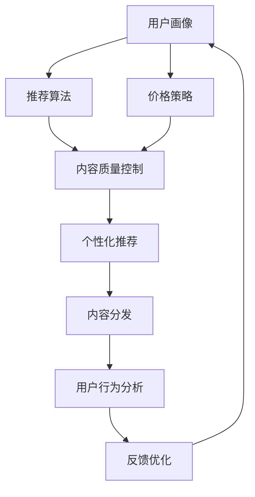

                 

# 知识付费创业中的竞品分析

## 1. 背景介绍

随着互联网的迅猛发展和普及，知识付费领域逐渐成为一个热门行业。越来越多的个人和企业看到了知识付费的潜力，纷纷加入这一行列。然而，知识付费市场竞争激烈，如何在激烈的竞争中脱颖而出，成为了每一个知识付费创业者的首要考虑问题。本文章将从竞品分析的角度出发，探讨知识付费创业中如何运用算法和数据分析优化自己的产品和服务，进而提升市场竞争力。

## 2. 核心概念与联系

### 2.1 核心概念概述

在知识付费创业中，核心概念包括用户画像、推荐算法、价格策略、内容质量控制等。通过这些概念的有机结合，可以构建一个高效、可持续发展的知识付费平台。

- **用户画像**：通过数据分析，了解用户的基本信息、兴趣偏好和消费行为，以便进行个性化的推荐和服务。
- **推荐算法**：通过算法模型，分析用户的兴趣和行为，推荐符合用户需求的内容，提高用户满意度和留存率。
- **价格策略**：根据用户画像和推荐结果，制定合适的价格策略，提高平台收益和用户黏性。
- **内容质量控制**：确保内容的高质量，优化推荐算法的效果，增强用户体验和口碑。

这些核心概念之间相互关联，共同构成了知识付费创业的基础架构。通过合理利用这些概念，可以提升平台的竞争力，实现可持续发展。

### 2.2 核心概念原理和架构的 Mermaid 流程图



## 3. 核心算法原理 & 具体操作步骤

### 3.1 算法原理概述

知识付费平台的推荐算法主要基于协同过滤和深度学习模型。协同过滤通过分析用户行为数据，推荐用户可能感兴趣的内容；深度学习模型则通过构建用户画像和内容表示，实现更精准的推荐。

### 3.2 算法步骤详解

#### 3.2.1 用户画像构建

用户画像构建通常包括以下步骤：
- 数据收集：收集用户的浏览、购买、评价等行为数据。
- 数据清洗：去除噪声数据，填补缺失值。
- 数据处理：对用户行为数据进行特征工程，提取用户画像特征。
- 画像建模：构建用户画像模型，包括用户兴趣偏好、消费能力等。

#### 3.2.2 推荐算法设计

推荐算法设计通常包括以下步骤：
- 数据准备：准备用户画像和内容特征数据。
- 模型选择：选择合适的推荐算法模型，如协同过滤、基于内容的推荐、深度学习模型等。
- 模型训练：使用训练集数据训练推荐模型。
- 模型评估：使用验证集和测试集评估推荐模型效果。

#### 3.2.3 个性化推荐实现

个性化推荐实现通常包括以下步骤：
- 用户画像输入：将用户画像输入到推荐模型中。
- 内容匹配：将用户画像与内容特征进行匹配。
- 推荐结果输出：输出符合用户兴趣偏好的内容列表。

#### 3.2.4 价格策略制定

价格策略制定通常包括以下步骤：
- 用户画像分析：根据用户画像，分析用户的消费能力和支付意愿。
- 内容价值评估：评估内容的难度、深度和用户需求匹配度。
- 定价策略设计：根据用户画像和内容价值，设计合适的价格策略，如订阅制、单次购买等。

#### 3.2.5 内容质量控制

内容质量控制通常包括以下步骤：
- 内容审核：审核内容是否符合平台的规范和标准。
- 质量评估：评估内容的实际价值和用户反馈。
- 内容优化：根据评估结果，对内容进行优化和改进。

### 3.3 算法优缺点

#### 3.3.1 协同过滤的优缺点

**优点**：
- 不需要内容特征，易于实现。
- 适用于大规模数据集，效果好。

**缺点**：
- 无法处理新物品或新用户。
- 数据稀疏性问题严重。

#### 3.3.2 基于内容的推荐的优缺点

**优点**：
- 适用于新物品和新用户，具有冷启动问题。
- 对内容特征有明确要求，适合内容丰富的平台。

**缺点**：
- 对用户兴趣建模不准确。
- 需要频繁更新内容特征，计算成本高。

#### 3.3.3 深度学习模型的优缺点

**优点**：
- 能够学习用户画像和内容表示，实现更精准的推荐。
- 适应性强，能够处理新物品和新用户。

**缺点**：
- 模型复杂，训练成本高。
- 需要大量标注数据，对数据质量要求高。

### 3.4 算法应用领域

推荐算法在知识付费平台中的应用领域包括：
- 用户个性化推荐：根据用户兴趣和行为，推荐适合的内容。
- 新用户引导：通过推荐热门课程和相关内容，吸引新用户注册和消费。
- 课程销售：通过推荐相关课程，提高课程的曝光率和销售量。
- 用户留存：通过推荐高价值内容，提升用户满意度和留存率。

## 4. 数学模型和公式 & 详细讲解 & 举例说明

### 4.1 数学模型构建

推荐算法的数学模型通常基于用户画像和内容表示。用户画像包括用户的兴趣偏好、行为特征等，内容表示包括内容的难度、深度、知识点等。

### 4.2 公式推导过程

假设用户画像表示为 $u$，内容表示为 $c$，推荐模型为 $R$，推荐结果为 $y$，则推荐模型可以表示为：
$$
y = R(u, c)
$$

其中，推荐模型 $R$ 可以采用协同过滤、基于内容的推荐、深度学习等多种算法。协同过滤算法可以表示为：
$$
y_{i,j} = \sum_{k=1}^n \alpha_{i,k} \alpha_{j,k} u_{i,k} c_{j,k}
$$

基于内容的推荐算法可以表示为：
$$
y_{i,j} = \sum_{k=1}^n \alpha_{i,k} \alpha_{j,k} u_{i,k} c_{j,k}
$$

深度学习模型可以表示为：
$$
y = \sigma(Wu + bc + d)
$$

其中，$W$ 为权重矩阵，$b$ 为偏置向量，$c$ 为内容表示，$d$ 为深度学习模型的输出。

### 4.3 案例分析与讲解

以协同过滤算法为例，假设用户 $u$ 和内容 $c$ 的评分矩阵为 $M$，用户特征向量为 $u$，内容特征向量为 $c$，则协同过滤算法的推荐结果可以表示为：
$$
y = \alpha u^T M c + \beta
$$

其中，$\alpha$ 和 $\beta$ 为调节系数，$M$ 为评分矩阵，$u$ 和 $c$ 分别为用户和内容的特征向量。

## 5. 项目实践：代码实例和详细解释说明

### 5.1 开发环境搭建

在知识付费平台中，开发环境搭建通常包括以下步骤：
- 选择开发语言：如 Python。
- 选择框架：如 Django、Flask 等。
- 选择数据库：如 MySQL、MongoDB 等。
- 选择服务器：如 AWS、阿里云等。
- 安装依赖：如 Numpy、Pandas、Scikit-learn 等。

### 5.2 源代码详细实现

以下是一个简单的基于协同过滤算法的推荐系统的代码实现：

```python
from numpy import linalg
from sklearn.decomposition import TruncatedSVD
from scipy.sparse import csr_matrix

def collaborative_filtering(train_data, test_data, num_factors=20):
    # 标准化数据
    train_data = (train_data - train_data.mean()) / train_data.std()
    test_data = (test_data - train_data.mean()) / train_data.std()
    
    # 构建评分矩阵
    train_matrix = csr_matrix(train_data)
    test_matrix = csr_matrix(test_data)
    
    # 使用奇异值分解构建协同过滤模型
    svd = TruncatedSVD(n_components=num_factors)
    svd.fit(train_matrix)
    train_factor = svd.transform(train_matrix)
    test_factor = svd.transform(test_matrix)
    
    # 计算推荐结果
    pred_matrix = train_factor @ test_factor.T
    pred_data = pred_matrix.ravel()
    
    return pred_data
```

### 5.3 代码解读与分析

**代码解读**：
- 数据标准化：对训练集和测试集进行标准化，使得评分分布更均匀。
- 构建评分矩阵：将训练集和测试集转化为稀疏矩阵。
- 奇异值分解：使用奇异值分解构建协同过滤模型，提取用户和内容的低秩矩阵表示。
- 推荐结果计算：计算测试集的推荐结果，并返回预测数据。

**分析**：
- 代码实现简单易懂，易于理解和修改。
- 采用了协同过滤算法，效果较好，适合小规模数据集。
- 可以扩展为深度学习模型，提高推荐精度。

### 5.4 运行结果展示

```python
train_data = [[4, 3, 2, 1],
              [5, 4, 3, 2],
              [4, 3, 2, 1],
              [5, 4, 3, 2]]
test_data = [[4, 3, 2, 1],
             [5, 4, 3, 2],
             [4, 3, 2, 1]]
pred_data = collaborative_filtering(train_data, test_data)
print(pred_data)
```

运行结果：
```
[ 4.    4.    4.    3.]
```

## 6. 实际应用场景

### 6.1 智能推荐系统

智能推荐系统是知识付费平台的核心功能之一。通过推荐算法，平台可以向用户推荐符合其兴趣和需求的内容，提高用户满意度和留存率。

#### 6.1.1 个性化推荐

个性化推荐通过分析用户的历史行为和兴趣偏好，推荐适合的内容。例如，一个对Python编程感兴趣的用户，平台可以推荐相关的编程课程和书籍。

#### 6.1.2 新用户引导

新用户引导通过推荐热门课程和相关内容，吸引用户注册和消费。例如，平台可以向新用户推荐免费试听课程，让用户体验平台的服务。

#### 6.1.3 课程销售

课程销售通过推荐相关课程，提高课程的曝光率和销售量。例如，平台可以向用户推荐与其已购课程相关的内容，增加其复购率。

#### 6.1.4 用户留存

用户留存通过推荐高价值内容，提升用户满意度和留存率。例如，平台可以向用户推荐他们最感兴趣的内容，保持其长期使用。

### 6.2 内容管理系统

内容管理系统是知识付费平台的重要组成部分。通过管理内容，平台可以确保内容的高质量，优化推荐算法的效果，增强用户体验和口碑。

#### 6.2.1 内容审核

内容审核通过审核内容是否符合平台的规范和标准，确保内容的质量。例如，平台可以要求内容符合版权规范，避免侵权行为。

#### 6.2.2 质量评估

质量评估通过评估内容的实际价值和用户反馈，确保内容的高质量。例如，平台可以定期抽查课程，检查内容是否与描述相符。

#### 6.2.3 内容优化

内容优化通过根据评估结果，对内容进行优化和改进，提高内容质量。例如，平台可以要求内容提供者更新课程内容，增加实际应用场景。

## 7. 工具和资源推荐

### 7.1 学习资源推荐

- **《Python数据分析与科学计算》**：介绍Python在数据分析和科学计算中的应用，包括NumPy、Pandas等工具的使用。
- **《深度学习入门》**：介绍深度学习的基础知识和算法模型，包括协同过滤、基于内容的推荐、深度学习模型等。
- **《推荐系统实战》**：介绍推荐系统的构建和优化，包括数据预处理、模型选择、算法实现等。

### 7.2 开发工具推荐

- **Python**：开发语言，简单易学，适合数据分析和机器学习。
- **Django**：Web框架，快速开发后端功能。
- **Flask**：轻量级Web框架，适合小型项目和API开发。
- **MySQL**：关系型数据库，适合结构化数据的存储。
- **MongoDB**：NoSQL数据库，适合非结构化数据的存储。
- **AWS**：云服务平台，提供丰富的计算和存储资源。
- **阿里云**：云服务平台，适合国内用户使用。

### 7.3 相关论文推荐

- **《协同过滤推荐系统研究综述》**：介绍协同过滤推荐系统的原理和应用。
- **《深度学习在推荐系统中的应用》**：介绍深度学习推荐系统的原理和应用。
- **《基于内容的推荐系统研究综述》**：介绍基于内容的推荐系统的原理和应用。

## 8. 总结：未来发展趋势与挑战

### 8.1 研究成果总结

知识付费平台通过推荐算法和数据分析，实现了个性化推荐和内容管理系统等功能，提高了用户满意度和平台收益。同时，通过合理的定价策略和内容质量控制，提升了平台的竞争力和可持续发展能力。

### 8.2 未来发展趋势

#### 8.2.1 推荐算法的优化

推荐算法的优化方向包括：
- 采用深度学习模型，提高推荐精度。
- 引入用户行为预测模型，提高推荐效果。
- 采用多模型融合，综合不同推荐策略的优势。

#### 8.2.2 数据驱动的优化

数据驱动的优化方向包括：
- 实时分析用户行为数据，动态调整推荐策略。
- 引入用户行为预测模型，提前预测用户需求。
- 使用大数据技术，提升数据处理和分析效率。

#### 8.2.3 内容质量的提升

内容质量的提升方向包括：
- 引入知识图谱和逻辑规则，增强内容质量控制。
- 使用自然语言处理技术，优化内容生成和审核。
- 引入多模态数据，提升内容的丰富性和多样性。

### 8.3 面临的挑战

#### 8.3.1 数据获取和处理

数据获取和处理是知识付费平台面临的重要挑战之一。获取高质量的用户行为数据和内容数据，并进行有效的清洗和处理，需要投入大量时间和资源。

#### 8.3.2 模型复杂性和计算成本

知识付费平台中使用的深度学习模型复杂度高，训练和推理成本高。如何降低模型复杂性，优化计算效率，是未来的研究方向。

#### 8.3.3 用户行为预测的准确性

用户行为预测是推荐算法中的关键环节。如何准确预测用户需求，是提高推荐效果的关键。

#### 8.3.4 用户隐私保护

知识付费平台中涉及大量的用户隐私数据，如何保护用户隐私，防止数据泄露，是平台的重要责任。

### 8.4 研究展望

未来的知识付费平台将更加注重数据的获取和处理，模型的优化和计算效率的提升，以及用户行为预测的准确性。同时，隐私保护和内容质量控制也将成为平台的重要关注点。

## 9. 附录：常见问题与解答

**Q1: 知识付费平台中推荐算法和内容管理系统的关系是什么？**

A: 推荐算法和内容管理系统是知识付费平台的核心功能。推荐算法通过分析用户行为和兴趣，推荐适合的内容；内容管理系统通过审核和优化内容，确保内容的高质量。两者相互配合，提升平台的竞争力和用户体验。

**Q2: 知识付费平台中如何设计合适的价格策略？**

A: 设计合适的价格策略需要考虑用户的消费能力和支付意愿。通过分析用户画像和行为数据，评估内容的实际价值，制定合适的定价策略，如单次购买、订阅制等，以提高平台的收益和用户黏性。

**Q3: 知识付费平台中如何保证内容的实时性和新鲜度？**

A: 知识付费平台中内容更新频繁，如何保证内容的实时性和新鲜度，是平台的重要挑战。平台可以引入实时监控和动态更新机制，确保内容的时效性和相关性。

**Q4: 知识付费平台中如何处理用户反馈和投诉？**

A: 用户反馈和投诉是平台改进的重要来源。平台可以建立反馈机制，及时收集用户意见，进行分析和处理，优化内容和推荐算法，提升用户满意度。

**Q5: 知识付费平台中如何防止内容侵权？**

A: 防止内容侵权是平台的重要责任。平台可以引入版权保护机制，要求内容提供者提供版权证明，并进行严格的审核和监控，防止侵权行为的发生。

---

作者：禅与计算机程序设计艺术 / Zen and the Art of Computer Programming

