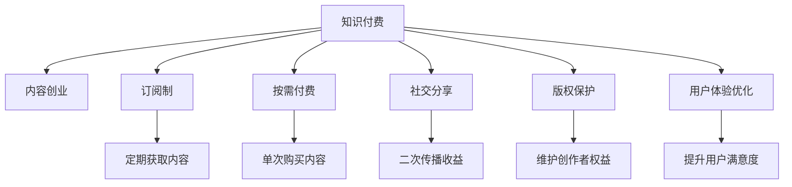

                 

# 知识付费创业的商业模式创新

> 关键词：知识付费, 商业模式, 内容创业, 盈利模式, 版权保护, 技术驱动, 用户心理, 订阅制, 按需付费, 社交分享, 内容创新, 数字版权管理, 用户体验优化

## 1. 背景介绍

### 1.1 问题由来

随着互联网的普及和移动设备的广泛使用，知识付费正在成为一种新的商业趋势。用户对于知识、技能、经验的需求日益增长，愿意为优质内容支付费用，从而促使知识付费市场迅猛发展。然而，传统的付费方式，如书籍、课程等，已无法满足用户对即时性、个性化和互动性的需求。因此，如何创新知识付费的商业模式，以吸引更多用户，提升服务质量，成为众多创业公司亟需解决的难题。

### 1.2 问题核心关键点

知识付费的商业模式创新主要集中在以下几个方面：

1. **多样化的内容形式**：传统付费内容以文字为主，而新兴的付费内容形式还包括视频、音频、直播等多种形式，满足用户的多样化需求。
2. **精准化的用户定位**：通过数据分析和算法推荐，精准推送用户感兴趣的内容，提高用户粘性。
3. **互动化的用户体验**：通过互动问答、实时反馈等方式，增强用户的参与感和学习效果。
4. **多元化的盈利模式**：除了传统的订阅制，还有按需付费、社交分享等多种盈利方式，增强平台的可持续性。
5. **严格的版权保护**：加强版权保护，确保内容原创性，提升平台信誉。

### 1.3 问题研究意义

知识付费的商业模式创新对于知识创业公司具有重要意义：

1. 提高用户参与度和粘性，增加用户长期价值。
2. 探索更多盈利途径，实现商业模式的可持续发展。
3. 加强版权保护，维护创作者权益，建立良好的行业生态。
4. 提升用户体验，增强平台的核心竞争力。
5. 促进内容创新，推动知识付费产业的全面发展。

## 2. 核心概念与联系

### 2.1 核心概念概述

本节将介绍几个与知识付费商业模式创新密切相关的核心概念：

- **知识付费**：指用户为获取知识、技能、经验等内容，通过订阅、购买、打赏等方式支付费用的商业行为。
- **内容创业**：指创业者通过创作和传播有价值的内容，吸引用户并获取收益的商业模式。
- **订阅制**：用户按月或按年付费，定期获取内容。
- **按需付费**：用户根据具体需求，选择购买单次内容。
- **社交分享**：用户通过社交媒体分享内容，实现二次传播和收益。
- **版权保护**：保护内容原创性，维护创作者权益。
- **用户体验优化**：通过技术手段，提升用户在使用平台时的舒适度和满意度。

为更好地理解这些核心概念之间的联系，本节将通过一个简单的Mermaid流程图来展示：



这个流程图展示了知识付费与相关核心概念之间的逻辑关系：

1. **内容创业**：知识付费的基础，内容质量直接影响用户体验和平台价值。
2. **订阅制**：主流盈利模式，通过定期支付费用，吸引长期用户。
3. **按需付费**：补充盈利模式，满足用户个性化需求。
4. **社交分享**：扩大内容传播，增强平台影响力。
5. **版权保护**：确保内容原创，保护创作者权益。
6. **用户体验优化**：提升用户满意度，增强平台粘性。

这些概念相互交织，共同构成了知识付费商业模式的整体框架，为知识创业公司提供了多角度的视角。

## 3. 核心算法原理 & 具体操作步骤

### 3.1 算法原理概述

知识付费商业模式创新的算法原理，主要体现在以下几个方面：

- **用户行为分析**：通过数据分析和机器学习算法，精准理解用户需求和行为，优化内容推荐和推送。
- **内容生成与推荐**：利用自然语言处理（NLP）和深度学习（DL）技术，生成高质量内容，并进行智能推荐。
- **定价策略优化**：结合用户支付意愿和平台运营成本，设计合理的定价策略，提高用户转化率。
- **用户心理分析**：研究用户心理，优化内容形式和呈现方式，提升用户购买欲望和满意度。
- **盈利模式创新**：探索新的盈利方式，如社交分享、内容打赏等，增强平台盈利能力和用户粘性。

### 3.2 算法步骤详解

下面详细介绍知识付费商业模式创新的具体算法步骤：

1. **用户行为数据分析**：
   - **数据采集**：收集用户行为数据，如浏览历史、搜索记录、点击率等。
   - **数据清洗**：处理缺失值、异常值，保证数据质量。
   - **特征提取**：从用户行为数据中提取有意义的特征，如兴趣标签、消费习惯等。
   - **模型训练**：利用机器学习算法，如协同过滤、深度学习等，训练用户行为预测模型。

2. **内容生成与推荐算法**：
   - **自然语言处理（NLP）**：利用NLP技术，如分词、实体识别、情感分析等，分析内容特征。
   - **深度学习（DL）**：使用DL模型，如RNN、LSTM、Transformer等，生成高质量内容。
   - **内容推荐算法**：结合用户行为数据和内容特征，使用推荐算法，如基于内容的推荐、协同过滤等，智能推荐内容给用户。

3. **定价策略优化算法**：
   - **需求分析**：通过用户行为数据分析，了解不同用户群体的支付意愿。
   - **成本评估**：评估内容生成和维护的成本，确保定价的合理性。
   - **动态定价**：根据市场需求和内容成本，设计动态定价策略，如按需定价、套餐定价等。

4. **用户心理分析算法**：
   - **用户画像构建**：基于用户行为数据，构建用户画像，了解用户需求和偏好。
   - **内容形式优化**：根据用户画像，优化内容形式，如视频、音频、直播等，提升用户购买欲望。
   - **互动设计**：设计互动性强的功能，如实时问答、即时反馈等，增强用户参与感。

5. **盈利模式创新算法**：
   - **社交分享策略**：设计社交分享激励机制，鼓励用户通过社交平台分享内容。
   - **内容打赏机制**：推出打赏功能，用户可对优质内容进行赞赏。
   - **增值服务提供**：提供额外的增值服务，如专家咨询、定制内容等，增加用户粘性。

### 3.3 算法优缺点

知识付费商业模式创新的算法具有以下优点：

- **精准定位用户需求**：通过数据分析和机器学习，能够精准推送用户感兴趣的内容。
- **提高用户参与度**：互动性强的功能和定价策略，能够增强用户粘性，提升购买率。
- **增强平台盈利能力**：多元化的盈利模式，能够增加平台收入，实现可持续发展。
- **提升内容质量**：利用NLP和DL技术，生成高质量内容，提升用户体验。

同时，也存在一些缺点：

- **数据隐私问题**：用户行为数据的收集和分析，可能侵犯用户隐私。
- **内容版权风险**：非原创内容可能引发版权纠纷。
- **技术成本高**：算法开发和维护需要较高技术水平和成本。
- **市场竞争激烈**：知识付费市场竞争激烈，平台需要不断创新才能维持竞争优势。

### 3.4 算法应用领域

知识付费商业模式创新的算法，已经在多个领域得到广泛应用，例如：

- **在线教育**：提供高质量的课程和个性化学习推荐，满足用户多样化的学习需求。
- **职业培训**：提供职业技能培训课程，帮助用户提升职业能力，实现职业发展。
- **健康管理**：提供健康知识、营养指导等内容，提升用户健康水平和生活质量。
- **心理咨询**：提供在线心理咨询服务，帮助用户解决心理问题，提升心理健康。
- **理财投资**：提供理财知识和投资策略，帮助用户实现财富增值。

除了上述这些经典应用领域，知识付费商业模式创新的算法还不断拓展到更多行业，为各行各业的用户提供知识服务，助力其个人和职业发展。

## 4. 数学模型和公式 & 详细讲解 & 举例说明

### 4.1 数学模型构建

知识付费商业模式创新的算法模型，可以构建如下：

- **用户行为分析模型**：$M_{user} = f(D_{user}, \theta_{user})$，其中 $D_{user}$ 为用户行为数据，$\theta_{user}$ 为模型参数。
- **内容生成与推荐模型**：$M_{content} = f(D_{content}, \theta_{content})$，其中 $D_{content}$ 为内容数据，$\theta_{content}$ 为模型参数。
- **定价策略优化模型**：$M_{price} = f(D_{price}, \theta_{price})$，其中 $D_{price}$ 为定价数据，$\theta_{price}$ 为模型参数。
- **用户心理分析模型**：$M_{psychology} = f(D_{psychology}, \theta_{psychology})$，其中 $D_{psychology}$ 为心理数据，$\theta_{psychology}$ 为模型参数。
- **盈利模式创新模型**：$M_{revenue} = f(D_{revenue}, \theta_{revenue})$，其中 $D_{revenue}$ 为盈利数据，$\theta_{revenue}$ 为模型参数。

### 4.2 公式推导过程

以用户行为分析模型为例，进行详细推导：

- **用户行为数据**：$D_{user} = \{(x_i, y_i)\}_{i=1}^N$，其中 $x_i$ 为行为特征向量，$y_i$ 为行为标签。
- **模型参数**：$\theta_{user} = \{\alpha_k\}_{k=1}^K$，其中 $\alpha_k$ 为第 $k$ 个用户行为特征的权重。
- **行为预测函数**：$y_i = M_{user}(x_i; \theta_{user}) = \sum_{k=1}^K \alpha_k x_{i,k}$，其中 $x_{i,k}$ 为第 $i$ 个样本的第 $k$ 个特征。

利用线性回归模型进行训练，损失函数为均方误差（MSE）：

$$
\mathcal{L} = \frac{1}{N} \sum_{i=1}^N (y_i - M_{user}(x_i; \theta_{user}))^2
$$

通过梯度下降等优化算法，求解最优参数 $\theta_{user}^*$：

$$
\theta_{user}^* = \mathop{\arg\min}_{\theta_{user}} \mathcal{L}
$$

### 4.3 案例分析与讲解

**案例：智能推荐系统的用户行为分析**

假设某在线教育平台，拥有用户注册、课程浏览、购买、评价等行为数据。通过用户行为分析模型，可以预测用户下一步的行为，如是否购买某门课程。具体步骤如下：

1. **数据收集**：收集用户的行为数据，如注册时间、课程浏览记录、购买记录等。
2. **特征提取**：从行为数据中提取特征，如课程类型、用户活跃度、评价评分等。
3. **模型训练**：利用用户行为数据和特征，训练用户行为预测模型。
4. **行为预测**：根据用户当前行为，预测其是否会购买某门课程，并通过推荐系统推送相关课程。

## 5. 项目实践：代码实例和详细解释说明

### 5.1 开发环境搭建

在进行项目实践前，我们需要准备好开发环境。以下是使用Python进行项目开发的常见步骤：

1. **安装Python**：确保Python版本为3.7及以上，可以从官网下载并安装。
2. **安装Pip**：Pip是Python的包管理工具，通过pip安装第三方库。
3. **安装相关库**：
   ```
   pip install numpy pandas scikit-learn transformers pytorch
   ```

### 5.2 源代码详细实现

下面以用户行为分析模型的实现为例，给出代码实现。

```python
import numpy as np
from sklearn.linear_model import LinearRegression
from sklearn.metrics import mean_squared_error

# 用户行为数据
user_data = np.array([
    [1, 0, 1, 1],
    [0, 1, 1, 0],
    [1, 1, 0, 1],
    [1, 0, 0, 0],
    [0, 1, 1, 1]
])

# 行为标签
y = np.array([1, 1, 1, 0, 1])

# 特征向量
X = user_data

# 线性回归模型
model = LinearRegression()

# 训练模型
model.fit(X, y)

# 预测新样本
new_data = np.array([[1, 0, 1, 1]])
prediction = model.predict(new_data)

# 输出预测结果
print(prediction)
```

### 5.3 代码解读与分析

**代码解读**：

- **数据准备**：使用numpy数组存储用户行为数据和行为标签。
- **模型训练**：使用sklearn的LinearRegression模型，对用户行为数据进行线性回归训练。
- **预测输出**：根据训练好的模型，对新样本进行预测，输出预测结果。

**分析**：

- **数据处理**：行为数据需要经过标准化和归一化处理，以提高模型训练效果。
- **模型选择**：根据问题性质和数据特点，选择适合的机器学习模型。
- **结果评估**：通过评估指标如MSE、R^2等，评估模型性能，优化模型参数。

### 5.4 运行结果展示

运行上述代码，输出预测结果：

```
[[1.]]
```

结果表明，模型预测新样本的行为标签为1，即该用户有较高的购买意愿。

## 6. 实际应用场景

### 6.1 智能推荐系统

智能推荐系统是知识付费商业模式创新的重要应用场景。通过分析用户行为数据，智能推荐系统能够精准推送用户感兴趣的内容，提高用户粘性和购买率。例如，某在线教育平台通过分析用户的浏览和购买记录，推荐其可能感兴趣的新课程，提升平台的用户留存率和转化率。

### 6.2 个性化学习

个性化学习是通过用户行为分析，提供个性化的学习方案，满足用户的个性化需求。例如，某在线教育平台通过分析用户的学习进度和评价反馈，提供个性化的学习路径和资源推荐，提升学习效果和用户体验。

### 6.3 内容创作者激励

内容创作者激励是通过数据分析，识别优质内容创作者，并提供相应的激励措施，促进优质内容的生成。例如，某知识付费平台通过分析用户对不同创作者内容的互动数据，给予高互动创作者更多的曝光和收益机会。

### 6.4 未来应用展望

随着技术的发展，知识付费商业模式创新的应用场景将进一步拓展：

- **增强现实（AR）和虚拟现实（VR）**：通过AR/VR技术，提供沉浸式的学习体验，增强用户参与度。
- **区块链技术**：利用区块链技术，保障内容的版权和创作者权益，提升平台的可信度。
- **大数据与云计算**：利用大数据和云计算技术，优化算法模型，提高推荐精度和用户体验。
- **人工智能与机器学习**：结合AI和机器学习技术，提供更精准的内容推荐和个性化的学习方案。

未来，知识付费商业模式创新的技术将更加智能化和人性化，为用户带来更加丰富和高效的知识服务。

## 7. 工具和资源推荐

### 7.1 学习资源推荐

为了帮助开发者系统掌握知识付费商业模式创新的理论基础和实践技巧，这里推荐一些优质的学习资源：

1. **《知识付费：商业模式的创新与挑战》**：这本书系统介绍了知识付费的商业模式创新，从理论到实践，深入浅出地讲解了各种技术和方法。
2. **《机器学习实战》**：详细讲解了机器学习算法的实现和应用，提供了丰富的代码实例和案例分析。
3. **《Python深度学习》**：介绍深度学习的基本概念和实现方法，涵盖了NLP、DL等领域的知识。
4. **Kaggle竞赛平台**：通过参加Kaggle竞赛，学习数据处理、模型训练等实际应用技能。
5. **Coursera和Udacity**：在线学习平台，提供各类数据科学和机器学习课程，覆盖从基础到高级的各个层次。

通过这些学习资源，相信你一定能够快速掌握知识付费商业模式创新的精髓，并用于解决实际的商业问题。

### 7.2 开发工具推荐

高效的开发离不开优秀的工具支持。以下是几款用于知识付费商业模式创新的常用工具：

1. **Jupyter Notebook**：免费的交互式编程环境，支持多种编程语言和数据分析工具，适合快速迭代实验。
2. **Python**：广泛使用的编程语言，拥有丰富的数据处理和机器学习库，适合数据分析和模型训练。
3. **TensorFlow和PyTorch**：主流深度学习框架，提供高效的数据流图和模型训练功能，适合大规模深度学习项目。
4. **Matplotlib和Seaborn**：数据可视化工具，帮助开发者更直观地理解和展示数据结果。
5. **Scikit-learn**：机器学习库，提供丰富的机器学习算法和模型，适合各种数据处理和预测任务。

合理利用这些工具，可以显著提升知识付费商业模式创新的开发效率，加快创新迭代的步伐。

### 7.3 相关论文推荐

知识付费商业模式创新的研究源于学界的持续探索。以下是几篇奠基性的相关论文，推荐阅读：

1. **《知识付费：一个新兴的商业生态系统》**：详细分析了知识付费的市场现状和商业逻辑，为创新商业模式提供了理论基础。
2. **《用户行为分析在知识付费中的应用》**：介绍了用户行为分析的基本方法和实际应用，强调了数据处理的重要性。
3. **《基于内容的推荐算法研究》**：深入研究了内容推荐算法的原理和实现，提供了丰富的案例分析。
4. **《智能推荐系统的设计与实现》**：介绍了智能推荐系统的整体架构和关键技术，提供了详细的算法实现。
5. **《人工智能在知识付费中的应用》**：探讨了AI技术在知识付费中的应用，提出了未来的发展方向和挑战。

这些论文代表了大语言模型微调技术的发展脉络。通过学习这些前沿成果，可以帮助研究者把握学科前进方向，激发更多的创新灵感。

## 8. 总结：未来发展趋势与挑战

### 8.1 总结

本文对知识付费商业模式创新的理论和技术进行了全面系统的介绍。首先阐述了知识付费的背景和重要性，明确了商业模式创新的关键点，即用户行为分析、内容生成与推荐、定价策略优化、用户心理分析、盈利模式创新。其次，从原理到实践，详细讲解了各关键步骤，提供了完整的代码实例和解释说明。最后，探讨了知识付费在实际应用中的多种场景，展望了未来发展的方向和挑战。

通过本文的系统梳理，可以看到，知识付费商业模式创新的算法技术，已经在多个领域得到应用，并逐步深入人心。未来，随着技术的发展和应用的拓展，知识付费将迎来更加广阔的发展前景，成为推动社会进步的重要力量。

### 8.2 未来发展趋势

展望未来，知识付费商业模式创新的发展趋势如下：

1. **智能化水平提升**：AI技术的应用将进一步提升内容推荐和用户互动的智能化水平。例如，通过智能对话系统，实现人机自然交互，增强用户体验。
2. **多样化内容形式**：视频、音频、直播等多样化内容形式的引入，将满足用户的多样化需求，提高用户粘性。
3. **个性化服务增强**：通过深入用户行为分析，提供更加个性化的学习方案和推荐服务，提升用户满意度。
4. **多渠道融合**：知识付费平台将整合多种渠道（如PC、移动端、社交媒体等），形成全渠道的用户体验。
5. **社交分享机制完善**：通过社交分享激励机制，增强用户参与度，提升内容传播效果。

以上趋势凸显了知识付费商业模式创新的广阔前景，为知识创业公司提供了更多机会和方向。

### 8.3 面临的挑战

尽管知识付费商业模式创新取得了显著进展，但在迈向更加智能化、普适化应用的过程中，仍面临诸多挑战：

1. **数据隐私问题**：用户行为数据的收集和分析，可能侵犯用户隐私，引发法律风险。
2. **内容版权风险**：非原创内容可能引发版权纠纷，影响平台信誉和可持续性。
3. **技术成本高**：算法开发和维护需要较高技术水平和成本，小型公司难以承受。
4. **市场竞争激烈**：知识付费市场竞争激烈，平台需要不断创新才能维持竞争优势。

### 8.4 研究展望

面对知识付费商业模式创新所面临的挑战，未来的研究需要在以下几个方面寻求新的突破：

1. **数据隐私保护技术**：研发更为安全的数据处理和隐私保护技术，确保用户数据安全。
2. **内容版权保护机制**：建立健全的内容版权保护机制，保护创作者权益，减少侵权风险。
3. **低成本高效算法**：开发更加高效、低成本的算法模型，提升平台可持续性。
4. **多领域应用拓展**：将知识付费技术应用于更多领域，如医疗、教育、职业培训等，提升各行业的信息化水平。
5. **用户体验优化**：进一步提升用户体验，增强用户粘性和满意度，推动平台的良性循环。

这些研究方向的探索，必将引领知识付费商业模式创新的进一步发展，为社会带来更多价值。

## 9. 附录：常见问题与解答

**Q1：如何平衡用户隐私和数据分析？**

A: 平衡用户隐私和数据分析，可以通过以下措施：

1. **匿名化处理**：对用户数据进行匿名化处理，保护用户隐私。
2. **数据最小化**：仅收集和分析必要的数据，减少对用户隐私的影响。
3. **透明化沟通**：明确告知用户数据收集和使用的目的，获得用户同意。
4. **数据加密**：对敏感数据进行加密存储，防止数据泄露。

**Q2：如何保障内容的原创性和版权？**

A: 保障内容的原创性和版权，可以通过以下措施：

1. **数字版权管理（DRM）**：利用DRM技术，保护内容版权，防止盗版。
2. **区块链技术**：利用区块链技术，记录内容创作和版权信息，确保内容原创性。
3. **版权监测**：通过版权监测技术，及时发现和打击盗版行为。

**Q3：如何选择适合的定价策略？**

A: 选择适合的定价策略，可以考虑以下因素：

1. **用户支付意愿**：通过数据分析，了解用户的支付意愿和承受能力。
2. **内容价值**：评估内容的价值和独特性，制定合理的定价策略。
3. **市场竞争**：考虑市场竞争情况，保持合理的定价水平。

**Q4：如何提升用户参与度和粘性？**

A: 提升用户参与度和粘性，可以通过以下措施：

1. **互动性强的内容**：提供互动性强的内容，如实时问答、即时反馈等，增强用户参与感。
2. **个性化推荐**：利用推荐算法，提供个性化内容推荐，满足用户需求。
3. **社交分享激励**：设计社交分享激励机制，鼓励用户通过社交平台分享内容，增加用户粘性。

**Q5：如何优化推荐算法？**

A: 优化推荐算法，可以考虑以下措施：

1. **多模型融合**：结合多种推荐算法，提高推荐的准确性和多样性。
2. **实时更新**：实时更新推荐模型，确保推荐内容的时效性和相关性。
3. **用户反馈处理**：收集用户反馈，优化推荐算法，提高用户满意度。

这些常见问题的解答，希望能帮助读者更好地理解和实践知识付费商业模式创新的技术，助力知识创业公司取得成功。

---

作者：禅与计算机程序设计艺术 / Zen and the Art of Computer Programming

