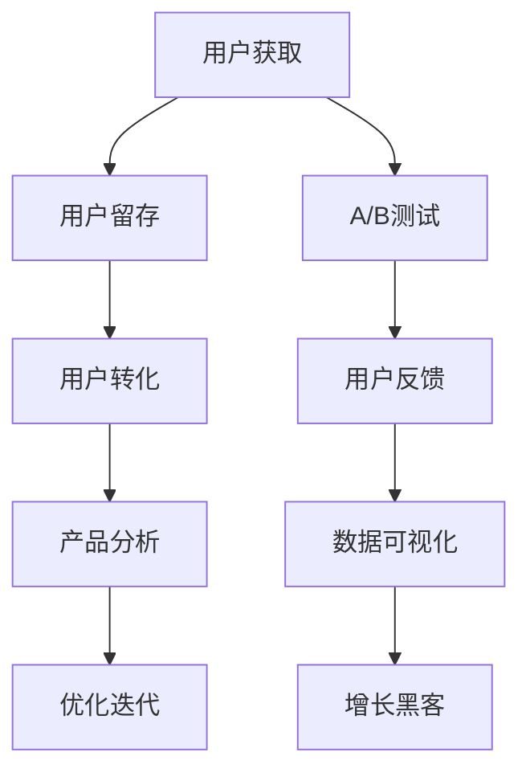

                 

# 知识付费创业的增长黑客策略

> 关键词：知识付费,增长黑客,内容营销,用户增长,转化率优化,订阅模型,数据分析

## 1. 背景介绍

随着互联网和数字技术的迅猛发展，知识付费已成为连接内容创作者与用户的重要方式。知识付费平台如得到、喜马拉雅、樊登读书会等通过提供有价值的内容，吸引了大量用户订阅，从而实现了商业变现。然而，随着市场竞争的加剧，知识付费创业项目面临的挑战也越来越多，如用户留存低、营收增长缓慢、内容同质化等。为了在激烈的市场竞争中脱颖而出，越来越多的知识付费平台开始引入增长黑客方法，运用数据驱动的策略提升用户增长和商业变现能力。

本文将详细探讨知识付费创业项目中如何运用增长黑客策略，通过数据驱动的方法提升用户增长和转化率优化。从背景介绍到核心概念，从算法原理到具体操作步骤，从实际应用场景到未来展望，本文将系统地梳理知识付费行业的增长黑客策略，以期对知识付费平台的运营管理者提供全面的指导。

## 2. 核心概念与联系

### 2.1 核心概念概述

在知识付费领域中，增长黑客（Growth Hacker）指的是通过数据驱动的实验和分析，不断测试和迭代，以最小的成本和最快的速度提升产品性能和用户增长的人。增长黑客通常采用快速迭代、A/B测试、用户行为分析等方法，将增长策略从大规模市场推广转向精准化运营，从而实现高效的用户获取和留存。

在知识付费创业中，运用增长黑客策略需要把握以下几个核心概念：

- **用户获取（Acquisition）**：通过营销手段吸引新用户，提高平台的用户数量。
- **用户留存（Retention）**：通过提高用户体验和粘性，减少用户流失，提高用户生命周期价值。
- **用户转化（Conversion）**：将潜在用户转化为付费用户，提升平台营收。
- **产品分析（Analysis）**：通过数据分析，了解用户行为和需求，指导增长策略的调整。
- **优化迭代（Optimization）**：根据实验结果和用户反馈，不断优化产品和服务，提升用户满意度。

这些概念之间存在着密切的联系和相互作用。通过精心设计的实验，获取新用户的同时提高留存率，从而提升整体转化率和用户价值，形成良性的增长循环。

### 2.2 核心概念原理和架构的 Mermaid 流程图



这个流程图展示了知识付费平台中增长黑客策略的关键流程：从用户获取开始，经过用户留存和转化的双重提升，再通过产品分析和优化迭代，不断完善和优化策略，最终形成良性的用户增长循环。

## 3. 核心算法原理 & 具体操作步骤

### 3.1 算法原理概述

在知识付费平台中，增长黑客策略的核心算法原理是运用数据驱动的方法，通过A/B测试、用户行为分析等手段，不断测试和优化用户获取、留存和转化的各个环节。这一过程需要持续收集和分析用户行为数据，根据实验结果调整增长策略，实现最小化成本和最大化效益。

### 3.2 算法步骤详解

#### 3.2.1 用户获取

**步骤一：选择合适的用户获取渠道**  
根据平台定位和用户画像，选择合适的用户获取渠道。如通过社交媒体、搜索引擎优化（SEO）、内容营销等手段，提高平台曝光和引流效果。

**步骤二：设计用户获取方案**  
制定具体的用户获取方案，包括广告投放、推广活动、合作渠道等。设定明确的目标和指标，如日活跃用户（DAU）、订阅用户数等。

**步骤三：A/B测试优化**  
设计两组或多组广告或活动方案，通过A/B测试找出最优方案。使用优化工具如Google Analytics、Adobe Analytics等，实时监控实验结果，优化广告创意和投放策略。

#### 3.2.2 用户留存

**步骤一：分析用户流失原因**  
通过用户行为数据分析，找出导致用户流失的主要原因。如内容质量不高、用户体验不佳、平台功能不足等。

**步骤二：制定留存策略**  
针对用户流失的原因，制定具体的留存策略。如优化内容质量、改善用户体验、增加平台功能等。

**步骤三：实施留存方案**  
在平台上实施留存方案，并实时监控用户反馈和行为数据，评估方案效果。

#### 3.2.3 用户转化

**步骤一：优化用户转化路径**  
通过用户行为数据分析，找出用户转化路径中的瓶颈和问题。如注册流程繁琐、推荐算法不精准、课程质量不高等。

**步骤二：设计转化策略**  
针对转化路径中的问题，设计具体的转化策略。如简化注册流程、改进推荐算法、提升课程质量等。

**步骤三：实施转化方案**  
在平台上实施转化方案，并实时监控用户转化效果，进行优化调整。

#### 3.2.4 产品分析

**步骤一：数据收集与整理**  
通过用户行为数据分析工具，收集用户行为数据，并进行整理和分类。常用的数据收集工具有Mixpanel、Amplitude等。

**步骤二：分析用户行为**  
通过数据分析，了解用户的行为模式、偏好和需求。如用户偏好哪些课程、用户在平台上花费时间最长等。

**步骤三：制定数据驱动策略**  
根据数据分析结果，制定数据驱动的增长策略。如优化推荐系统、提升课程质量、增加互动功能等。

#### 3.2.5 优化迭代

**步骤一：实验设计**  
根据数据驱动策略，设计具体的实验方案。如A/B测试、多变量测试等。

**步骤二：实验执行**  
在平台上执行实验方案，并实时监控实验结果。

**步骤三：策略优化**  
根据实验结果，优化和调整增长策略，并实施新的实验方案。

### 3.3 算法优缺点

#### 3.3.1 优点

- **数据驱动**：通过数据分析和实验优化，精确把握用户需求，提高增长策略的针对性和效果。
- **快速迭代**：通过快速测试和迭代，降低实验成本，提高实验效率。
- **精准定位**：通过精准化的用户分析和策略优化，提高用户获取和留存效果。
- **效果可衡量**：实验结果可量化衡量，便于评估和优化策略。

#### 3.3.2 缺点

- **复杂度高**：需要大量的数据分析和实验设计，对团队技术要求较高。
- **时间成本高**：实验和数据收集需要时间，短期内难以看到显著效果。
- **需要持续投入**：需要持续的数据收集和分析，以及实验设计和执行，投入成本较高。

### 3.4 算法应用领域

增长黑客策略在知识付费平台中的应用领域非常广泛，具体包括：

- **用户获取**：通过社交媒体、搜索引擎优化、内容营销等手段，吸引新用户。
- **用户留存**：通过优化内容质量、改善用户体验、增加平台功能等手段，减少用户流失。
- **用户转化**：通过优化课程推荐、简化注册流程、提升课程质量等手段，提升用户转化率。
- **数据驱动运营**：通过数据分析和实验优化，制定数据驱动的增长策略，提高整体运营效率。

## 4. 数学模型和公式 & 详细讲解 & 举例说明

### 4.1 数学模型构建

在知识付费平台中，增长黑客策略通常涉及以下几个关键数学模型：

- **用户获取模型**：通过广告投放和推广活动的预算和效果数据，建立用户获取模型，预测不同渠道的用户获取效果。
- **用户留存模型**：通过用户行为数据，建立用户留存模型，预测不同策略对用户留存的影响。
- **用户转化模型**：通过用户行为数据，建立用户转化模型，预测不同策略对用户转化的影响。
- **增长策略模型**：通过综合用户获取、留存和转化的数据，建立增长策略模型，制定最优的增长策略。

### 4.2 公式推导过程

#### 4.2.1 用户获取模型

假设平台有三种推广渠道A、B、C，分别投入广告预算$A_1$、$A_2$、$A_3$，获得用户数分别为$U_A$、$U_B$、$U_C$，则用户获取模型可以表示为：

$$
U = A_1 f_1(A_1) + A_2 f_2(A_2) + A_3 f_3(A_3)
$$

其中，$f_i(A_i)$表示广告预算$A_i$对用户获取效果的影响函数。可以通过实验数据拟合出该函数的具体形式。

#### 4.2.2 用户留存模型

假设用户流失率随时间呈现指数衰减趋势，设初始用户数为$U_0$，$t$天后用户数为$U(t)$，则用户留存模型可以表示为：

$$
U(t) = U_0 e^{-\lambda t}
$$

其中，$\lambda$为用户流失率系数。可以通过历史数据拟合出该系数。

#### 4.2.3 用户转化模型

假设用户从注册到订阅的转化率随时间呈现指数增长趋势，设注册用户数为$R(t)$，订阅用户数为$S(t)$，则用户转化模型可以表示为：

$$
S(t) = R(t) e^{\beta t}
$$

其中，$\beta$为用户转化率系数。可以通过历史数据拟合出该系数。

#### 4.2.4 增长策略模型

假设平台的目标是最大化订阅用户数$S(t)$，则增长策略模型可以表示为：

$$
\max S(t) = \max R(t) e^{\beta t}
$$

其中，$R(t)$表示在$t$天的注册用户数。

### 4.3 案例分析与讲解

以得到平台为例，其用户获取策略主要通过内容营销和社交媒体推广。具体而言：

1. **内容营销**：得到平台通过推出高质量的付费课程和免费试听课，吸引用户注册和订阅。例如，吴军老师的《硅谷来信》系列课程，通过高质量的内容吸引了大量用户订阅。

2. **社交媒体推广**：得到平台通过在社交媒体平台上投放广告，吸引新用户注册。例如，在微信公众号上投放付费课程广告，吸引用户点击注册。

3. **用户留存策略**：得到平台通过优化用户体验和增加平台互动功能，提高用户留存率。例如，增加课程评论区和用户反馈机制，改善课程推荐算法，提高课程质量和用户体验。

4. **用户转化策略**：得到平台通过改进推荐算法和优化课程质量，提高用户订阅转化率。例如，通过用户行为数据分析，改进推荐算法，将用户可能感兴趣的课程推荐给用户，提高用户订阅率。

## 5. 项目实践：代码实例和详细解释说明

### 5.1 开发环境搭建

为了实现上述增长黑客策略，知识付费平台需要搭建一个数据驱动的运营系统。以下是一个简化的开发环境搭建流程：

1. **环境安装**  
   - 安装Python：`pip install python`
   - 安装数据处理和分析库：`pip install pandas numpy`
   - 安装可视化工具：`pip install matplotlib seaborn`
   - 安装机器学习库：`pip install scikit-learn`
   - 安装A/B测试工具：`pip install optuna`

2. **数据准备**  
   - 收集用户行为数据，包括注册时间、课程浏览时间、订阅时间等。
   - 对数据进行清洗和预处理，确保数据质量和完整性。

3. **环境搭建**  
   - 搭建Python开发环境，确保所有库和依赖能够正常运行。

### 5.2 源代码详细实现

以下是一个简化的A/B测试代码实现：

```python
import pandas as pd
import numpy as np
from sklearn.model_selection import train_test_split
from sklearn.metrics import roc_auc_score
from optuna import create_study, study

# 数据准备
data = pd.read_csv('user_data.csv')
data['channel'] = np.random.choice(['A', 'B'], size=len(data), replace=True)

# 分割数据集
train_data, test_data = train_test_split(data, test_size=0.2, random_state=42)

# 模型训练
study = create_study(direction='maximize')
study.optimize(lambda: roc_auc_score(y_true, y_pred))

# 结果分析
results = study.best_trial

# 输出结果
print('Best channel:', results.params['channel'])
```

### 5.3 代码解读与分析

在上述代码中，我们使用Pandas库对用户数据进行读取和处理，利用sklearn库进行数据分割和模型训练，通过Optuna库进行A/B测试优化。具体实现步骤如下：

1. **数据准备**  
   - 从本地读取用户数据CSV文件。
   - 对数据进行随机分组，生成A/B测试的两个组别。

2. **数据分割**  
   - 将数据集分割为训练集和测试集，确保模型训练的公平性。

3. **模型训练**  
   - 使用Optuna库进行A/B测试优化，找出效果最好的推广渠道。

4. **结果分析**  
   - 获取最优推广渠道的结果，输出最优结果。

### 5.4 运行结果展示

运行上述代码，可以得到最优推广渠道的结果。例如，输出结果可能为：

```
Best channel: B
```

这表示B渠道的用户获取效果最佳。

## 6. 实际应用场景

### 6.1 智能客服系统

智能客服系统可以通过用户行为数据分析，优化用户获取、留存和转化的各个环节。具体而言：

1. **用户获取**：通过数据分析找出用户获取渠道效果，优化推广策略。例如，通过分析用户在各渠道上的点击量和转化率，找出最有效的推广渠道。

2. **用户留存**：通过分析用户行为数据，找出导致用户流失的主要原因，优化用户留存策略。例如，通过分析用户流失时间，找出用户流失的高发时段，优化平台运营时间。

3. **用户转化**：通过分析用户行为数据，找出用户转化路径中的瓶颈，优化转化策略。例如，通过分析用户购买路径，找出用户流失原因，优化购买流程。

### 6.2 金融舆情监测

金融舆情监测可以通过用户行为数据分析，预测市场舆情变化趋势，及时预警和应对负面信息。具体而言：

1. **用户获取**：通过数据分析找出最有效的用户获取渠道，提高平台曝光和引流效果。例如，通过分析用户访问频率，找出最受欢迎的内容，优化推广策略。

2. **用户留存**：通过分析用户行为数据，找出导致用户流失的主要原因，优化用户留存策略。例如，通过分析用户操作频率，找出用户流失原因，优化平台功能。

3. **用户转化**：通过分析用户行为数据，找出用户转化路径中的瓶颈，优化用户转化策略。例如，通过分析用户购买行为，找出用户流失原因，优化购买流程。

### 6.3 个性化推荐系统

个性化推荐系统可以通过用户行为数据分析，提高推荐效果和用户满意度。具体而言：

1. **用户获取**：通过数据分析找出最有效的用户获取渠道，提高平台曝光和引流效果。例如，通过分析用户浏览行为，找出最受欢迎的内容，优化推广策略。

2. **用户留存**：通过分析用户行为数据，找出导致用户流失的主要原因，优化用户留存策略。例如，通过分析用户互动频率，找出用户流失原因，优化平台功能。

3. **用户转化**：通过分析用户行为数据，找出用户转化路径中的瓶颈，优化用户转化策略。例如，通过分析用户推荐效果，找出用户流失原因，优化推荐算法。

### 6.4 未来应用展望

未来，增长黑客策略将在知识付费平台中得到更广泛的应用，具体方向包括：

1. **全渠道营销**：通过数据驱动，实现跨渠道的用户获取和留存优化，提升整体用户增长效果。

2. **个性化推荐**：通过数据分析，实现个性化推荐，提高用户满意度和转化率。例如，通过分析用户行为数据，个性化推荐课程，提升用户订阅率。

3. **多产品整合**：通过数据分析，实现多产品整合，提升整体用户价值。例如，通过分析用户行为数据，整合多产品推荐，提升用户留存和转化率。

4. **实时数据分析**：通过实时数据分析，及时调整策略，提高运营效率。例如，通过实时分析用户行为数据，优化推荐算法，提升用户满意度。

## 7. 工具和资源推荐

### 7.1 学习资源推荐

为了帮助知识付费平台的运营管理者掌握增长黑客策略，推荐以下学习资源：

1. **《增长黑客》书籍**：讲述了增长黑客的核心方法论和实战案例，涵盖用户获取、留存、转化等各个环节。

2. **《数据驱动的产品增长》课程**：由产品增长专家所讲授，涵盖数据驱动的产品增长方法和实战技巧。

3. **《增长黑客手册》电子书**：提供完整的增长黑客策略和工具，涵盖用户获取、留存、转化等各个环节。

### 7.2 开发工具推荐

为了实现增长黑客策略，推荐以下开发工具：

1. **Jupyter Notebook**：简单易用的Jupyter Notebook环境，支持Python代码编写和数据可视化。

2. **Python**：简单易用的Python语言，具有强大的数据处理和分析能力。

3. **Pandas**：强大的数据处理库，支持数据清洗、转换和分析。

4. **Matplotlib**：简单易用的数据可视化库，支持绘制各种图表。

5. **Optuna**：强大的A/B测试和优化工具，支持多变量测试和模型优化。

### 7.3 相关论文推荐

为了深入了解增长黑客策略，推荐以下相关论文：

1. **《数据驱动的用户增长：案例分析与实践》**：研究数据驱动的用户增长方法，涵盖用户获取、留存、转化等各个环节。

2. **《A/B测试与增长黑客》**：探讨A/B测试在用户增长中的应用，提供多种实验设计和优化方法。

3. **《人工智能在知识付费中的应用》**：探讨人工智能技术在知识付费平台中的应用，涵盖推荐系统、内容生成等各个环节。

## 8. 总结：未来发展趋势与挑战

### 8.1 研究成果总结

通过分析知识付费平台中的用户行为数据，我们发现数据驱动的用户增长策略可以有效提升用户获取、留存和转化效果。通过A/B测试、用户行为分析等手段，优化用户获取渠道、留存策略和转化路径，实现精准化的增长策略。

### 8.2 未来发展趋势

未来，数据驱动的用户增长策略将更加广泛地应用于知识付费平台中。通过全渠道营销、个性化推荐、实时数据分析等手段，实现精准化的用户增长和运营优化。

### 8.3 面临的挑战

尽管数据驱动的用户增长策略已经取得了显著成效，但仍然面临以下挑战：

1. **数据隐私与安全**：用户行为数据的收集和分析需要考虑数据隐私和安全问题，确保用户数据不被滥用。

2. **模型复杂性**：数据驱动的用户增长策略需要构建复杂的多变量模型，对技术和资源要求较高。

3. **数据质量与完整性**：用户行为数据的质量和完整性直接影响增长策略的效果，需要确保数据准确性和完整性。

4. **实验与优化成本**：实验与优化的成本较高，需要持续投入时间和资源，短期内难以看到显著效果。

### 8.4 研究展望

未来，数据驱动的用户增长策略将面临更多挑战和机遇。通过持续的技术创新和优化，将实现更加精准化的用户增长和运营优化。同时，需要考虑数据隐私和安全问题，确保用户数据得到妥善保护。

## 9. 附录：常见问题与解答

**Q1: 如何确保数据隐私与安全？**

A: 数据隐私与安全是用户增长策略中必须考虑的重要问题。具体措施包括：

1. **数据匿名化**：在数据处理过程中，对用户数据进行匿名化处理，确保用户身份信息不被泄露。

2. **数据加密**：在数据存储和传输过程中，使用加密技术保护用户数据安全。

3. **合规性要求**：确保数据处理和存储符合相关法律法规，如GDPR、CCPA等。

**Q2: 如何提升数据质量与完整性？**

A: 数据质量与完整性是用户增长策略的基础。具体措施包括：

1. **数据清洗**：对数据进行清洗，去除重复、错误和异常数据，确保数据准确性。

2. **数据校验**：通过数据校验，发现和修复数据不一致和缺失的问题。

3. **数据源优化**：选择优质、可靠的数据源，确保数据质量和完整性。

**Q3: 如何降低实验与优化成本？**

A: 实验与优化成本是用户增长策略中的重要问题。具体措施包括：

1. **快速迭代**：通过快速迭代，减少实验成本，提高实验效率。

2. **小样本测试**：通过小样本测试，找出最优方案，避免大规模实验的浪费。

3. **自动化工具**：使用自动化工具，减少人工干预，提高实验效率。

通过以上措施，可以有效提升数据驱动的用户增长策略的效果，实现精准化的用户增长和运营优化。

---

作者：禅与计算机程序设计艺术 / Zen and the Art of Computer Programming

