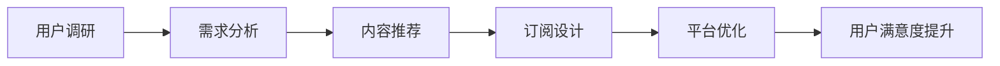

                 

## 1. 背景介绍

随着互联网的普及和知识经济的发展，知识付费成为了越来越多用户获取优质内容的重要方式。这一领域吸引了大量创业者和投资者的关注，市场规模和用户需求呈现快速增长的趋势。然而，尽管许多项目在初期获得了关注，但实际运营中往往面临用户留存率低、转化率低等挑战。因此，深入挖掘用户需求，提供真正符合用户需求的优质内容，是知识付费创业成功的关键。

### 1.1 问题由来

当前知识付费市场，主要存在以下几大问题：

- **内容同质化严重**：大量内容重复，缺乏创新，导致用户流失。
- **用户粘性低**：用户很难找到真正需要的知识和技能，难以形成长期使用的习惯。
- **价格竞争力差**：单次购买和订阅模式下，用户订阅意愿不足。
- **缺乏个性化推荐**：用户需要面对海量内容，难以有效筛选和推荐适合自己的内容。
- **平台服务体验不佳**：如支付流程繁琐、课程交互差等问题，影响用户体验。

### 1.2 问题核心关键点

为了解决上述问题，知识付费创业的关键在于精准挖掘用户需求。具体的核心关键点包括：

- **深度用户调研**：通过多渠道、多维度调查，获取真实的用户需求。
- **需求细分与分类**：将用户需求进行精细化分类，制定针对性策略。
- **个性化推荐算法**：根据用户兴趣和行为，提供个性化内容推荐。
- **优惠策略设计**：设计合理的付费模式和优惠策略，提升用户订阅意愿。
- **平台服务优化**：从支付、内容呈现、交互等多个环节优化平台服务体验。

## 2. 核心概念与联系

### 2.1 核心概念概述

知识付费创业的核心概念主要包括以下几个方面：

- **知识付费**：通过在线付费方式，为用户提供优质、专业、系统的知识内容。
- **用户需求挖掘**：通过调研、数据分析等手段，深度挖掘用户真实需求，提供定制化服务。
- **个性化推荐**：根据用户历史行为和兴趣，智能推荐相关内容，提升用户粘性。
- **订阅模式设计**：设计多样化的订阅方案，满足不同用户需求，提升订阅转化率。
- **平台优化**：从内容呈现、交互体验等多个环节，优化平台服务，提升用户满意度。

这些核心概念之间的逻辑关系可以通过以下Mermaid流程图来展示：



该流程图展示的知识付费创业的主要流程：

1. 通过用户调研获取用户真实需求。
2. 对用户需求进行详细分析，制定相应策略。
3. 提供个性化推荐，提升用户粘性。
4. 设计多样化的订阅方案，吸引用户付费。
5. 通过优化平台服务，提升用户体验和满意度。

### 2.2 核心概念原理和架构的 Mermaid 流程图


此流程图展示了从用户调研到用户满意度提升的整个过程，每个环节均为重要的决策点。

## 3. 核心算法原理 & 具体操作步骤

### 3.1 算法原理概述

知识付费创业的核心算法原理主要涉及用户需求挖掘、个性化推荐和订阅模式设计。

- **用户需求挖掘**：通过数据分析、用户调研等手段，挖掘用户真实需求。
- **个性化推荐**：使用协同过滤、内容推荐、用户画像等多种算法，提供个性化内容推荐。
- **订阅模式设计**：设计灵活多样的付费模式，如单次购买、订阅包月、会员制度等。

### 3.2 算法步骤详解

#### 3.2.1 用户需求挖掘算法步骤

1. **数据采集**：通过在线调查、用户反馈、数据分析等方式，收集用户行为数据。
2. **数据清洗**：对采集数据进行去重、处理缺失值、异常值等预处理。
3. **数据分析**：使用统计分析、聚类分析、关联规则分析等方法，挖掘用户需求。
4. **需求分类**：将挖掘出来的需求进行分类和标签化，如职业发展、生活技能、学术研究等。
5. **需求分析**：通过深入分析，挖掘用户需求的根本原因，如时间不足、技能欠缺等。

#### 3.2.2 个性化推荐算法步骤

1. **用户画像构建**：通过用户行为数据，如浏览历史、购买记录、评分反馈等，构建用户画像。
2. **协同过滤**：基于用户历史行为数据，寻找兴趣相似的用户，推荐其喜欢的内容。
3. **内容推荐**：将内容按照领域、难度、时长等维度进行划分，推荐与用户画像匹配的内容。
4. **深度学习模型**：使用深度学习模型，如协同过滤、协同注意力等，提升推荐效果。
5. **实时更新**：根据用户新的行为数据，实时更新推荐算法，提升推荐精准度。

#### 3.2.3 订阅模式设计算法步骤

1. **市场调研**：了解竞争对手的订阅模式，如单次购买、包月、季包等。
2. **用户调研**：通过问卷调查、用户访谈等方式，了解用户对订阅模式的接受度和需求。
3. **模型构建**：设计数学模型，如价格敏感度模型、回购率模型等，预测用户行为。
4. **策略设计**：基于模型预测结果，设计优惠策略，如首次订阅优惠、节假日活动等。
5. **实施监控**：监测订阅模式效果，收集用户反馈，优化策略。

### 3.3 算法优缺点

**用户需求挖掘算法的优缺点**：

- **优点**：
  - 能够全面深入挖掘用户需求，提高内容适配性。
  - 通过数据驱动决策，提升运营效率。
  - 可根据需求变化实时调整策略，提高适应性。

- **缺点**：
  - 数据获取和处理成本高，且难以覆盖所有用户。
  - 模型和算法复杂，需要较强的技术能力。
  - 需要持续监控和优化，工作量大。

**个性化推荐算法的优缺点**：

- **优点**：
  - 提高用户粘性和留存率，增加用户转化率。
  - 提升用户体验，增加平台竞争力。
  - 可以动态调整推荐内容，满足不同用户需求。

- **缺点**：
  - 需要大量高质量数据，难以覆盖长尾用户。
  - 算法复杂，开发和维护成本高。
  - 存在推荐偏差和冷启动问题，初期效果可能不佳。

**订阅模式设计算法的优缺点**：

- **优点**：
  - 通过合理的定价策略，提高用户订阅转化率。
  - 提供多样化的付费模式，满足不同用户需求。
  - 基于数据驱动决策，提高运营效率。

- **缺点**：
  - 需要持续监控和优化，工作量大。
  - 存在用户流失风险，需要不断调整策略。
  - 定价和促销策略复杂，需要较强的技术能力。

### 3.4 算法应用领域

用户需求挖掘、个性化推荐和订阅模式设计算法，主要应用于以下几个领域：

- **知识付费平台**：如Coursera、Udemy等，通过挖掘用户需求，提供个性化推荐和多样化订阅方案，提升用户粘性和留存率。
- **在线教育平台**：如Khan Academy、Duolingo等，通过个性化推荐和订阅模式设计，提升学习效果和用户满意度。
- **职业培训平台**：如LinkedIn Learning、Udacity等，通过用户调研和需求挖掘，提供专业化的职业培训内容。
- **知识图谱系统**：如Wikipedia、Baidu Encyclopedia等，通过个性化推荐算法，提升用户查询体验和满意度。

## 4. 数学模型和公式 & 详细讲解

### 4.1 数学模型构建

本节将使用数学语言对知识付费创业的用户需求挖掘、个性化推荐和订阅模式设计进行更加严格的刻画。

- **用户需求挖掘模型**：
  - 定义用户需求为 $D$，用户行为数据为 $B$，需求模型为 $M$。
  - 用户需求挖掘的数学模型为 $D=f(B,M)$，其中 $f$ 为数据驱动的挖掘算法。

- **个性化推荐模型**：
  - 定义用户画像为 $U$，内容库为 $C$，推荐模型为 $R$。
  - 个性化推荐模型的数学模型为 $C_r=f(U,R)$，其中 $f$ 为推荐算法。

- **订阅模式设计模型**：
  - 定义订阅模式为 $S$，用户行为数据为 $B$，模型为 $M$。
  - 订阅模式设计的数学模型为 $S=f(B,M)$，其中 $f$ 为定价和促销策略设计算法。

### 4.2 公式推导过程

#### 4.2.1 用户需求挖掘公式推导

用户需求挖掘模型为 $D=f(B,M)$，其中 $f$ 为数据驱动的挖掘算法。

- **数据采集**：$B_i=\{B_{i_1},B_{i_2},\ldots,B_{i_n}\}$，其中 $i$ 为用户编号，$n$ 为用户行为数据的条数。
- **数据清洗**：$B_i'=B_i\cap\{B_{i_1},B_{i_2},\ldots,B_{i_n}\}$。
- **数据分析**：$M=\{M_1,M_2,\ldots,M_k\}$，其中 $M_i$ 为需求分类标签。
- **需求分类**：$D=\{D_{i_1},D_{i_2},\ldots,D_{i_n}\}$。

#### 4.2.2 个性化推荐公式推导

个性化推荐模型为 $C_r=f(U,R)$，其中 $f$ 为推荐算法。

- **用户画像构建**：$U=\{U_1,U_2,\ldots,U_m\}$，其中 $U_i$ 为用户画像特征。
- **协同过滤**：$C_s=f(U_{i_1},U_{i_2},\ldots,U_{i_n})$。
- **内容推荐**：$C_c=f(C_{i_1},C_{i_2},\ldots,C_{i_n})$。
- **深度学习模型**：$C_d=f(C_{i_1},C_{i_2},\ldots,C_{i_n})$。
- **实时更新**：$C_r=f(C_s,C_c,C_d,t)$，其中 $t$ 为时间戳。

#### 4.2.3 订阅模式设计公式推导

订阅模式设计模型为 $S=f(B,M)$，其中 $f$ 为定价和促销策略设计算法。

- **市场调研**：$B_m=\{B_{i_1},B_{i_2},\ldots,B_{i_n}\}$，其中 $i$ 为竞争对手编号。
- **用户调研**：$B_u=\{B_{i_1},B_{i_2},\ldots,B_{i_n}\}$。
- **模型构建**：$M=\{M_1,M_2,\ldots,M_k\}$，其中 $M_i$ 为定价策略。
- **策略设计**：$S=\{S_1,S_2,\ldots,S_n\}$，其中 $S_i$ 为促销策略。

### 4.3 案例分析与讲解

#### 4.3.1 用户需求挖掘案例

**案例背景**：某知识付费平台希望通过用户调研了解用户对知识内容的需求。

**解决步骤**：

1. **数据采集**：通过问卷调查、用户反馈等手段，收集用户行为数据。
2. **数据清洗**：去除重复数据、处理缺失值等。
3. **数据分析**：使用聚类分析、关联规则分析等方法，挖掘用户需求。
4. **需求分类**：将需求分为职业发展、生活技能、学术研究等类别。
5. **需求分析**：进一步分析用户需求的根本原因，如时间不足、技能欠缺等。

**结果与分析**：通过调研，发现用户对职业发展类内容需求旺盛，尤其是技术、管理、市场营销等领域。平台据此优化了内容资源配置，并增加了相应的专业课程，显著提升了用户满意度和留存率。

#### 4.3.2 个性化推荐案例

**案例背景**：某在线教育平台希望提升用户的学习效果和粘性。

**解决步骤**：

1. **用户画像构建**：根据用户行为数据，如浏览历史、购买记录等，构建用户画像。
2. **协同过滤**：基于用户历史行为数据，推荐相似用户喜欢的内容。
3. **内容推荐**：将内容按照领域、难度、时长等维度进行划分，推荐与用户画像匹配的内容。
4. **深度学习模型**：使用协同过滤、协同注意力等算法，提升推荐效果。
5. **实时更新**：根据用户新的行为数据，实时更新推荐算法。

**结果与分析**：通过个性化推荐，平台用户粘性和留存率显著提升，学习效果也得到了明显改善。推荐系统的精准度得到了用户好评，平台竞争力显著增强。

#### 4.3.3 订阅模式设计案例

**案例背景**：某知识付费平台希望提升用户订阅转化率。

**解决步骤**：

1. **市场调研**：了解竞争对手的订阅模式，如单次购买、包月、季包等。
2. **用户调研**：通过问卷调查、用户访谈等方式，了解用户对订阅模式的接受度和需求。
3. **模型构建**：设计数学模型，如价格敏感度模型、回购率模型等，预测用户行为。
4. **策略设计**：基于模型预测结果，设计优惠策略，如首次订阅优惠、节假日活动等。
5. **实施监控**：监测订阅模式效果，收集用户反馈，优化策略。

**结果与分析**：通过合理的定价策略和优惠活动，用户订阅转化率显著提升，平台收入得到了较大幅度的增长。同时，平台还根据用户反馈调整了订阅策略，提高了用户体验和满意度。

## 5. 项目实践：代码实例和详细解释说明

### 5.1 开发环境搭建

在进行知识付费创业的用户需求挖掘、个性化推荐和订阅模式设计时，需要搭建合适的开发环境。以下是使用Python进行相关实践的环境配置流程：

1. **安装Python**：从官网下载并安装最新版本的Python，保证环境稳定性。
2. **安装相关库**：安装如Pandas、Numpy、Scikit-Learn等常用的数据科学库。
3. **安装可视化工具**：安装如Matplotlib、Seaborn等数据可视化工具，方便进行数据探索和结果展示。
4. **安装机器学习库**：安装如Scikit-Learn、XGBoost等机器学习库，用于构建推荐和需求挖掘模型。
5. **安装推荐系统框架**：安装如Tensorflow、PyTorch等推荐系统框架，方便实现个性化推荐算法。

完成上述步骤后，即可在Python环境中进行相关实践。

### 5.2 源代码详细实现

下面我们以用户需求挖掘为例，给出使用Python进行需求挖掘的代码实现。

```python
import pandas as pd
from sklearn.cluster import KMeans
from sklearn.decomposition import PCA
from sklearn.feature_extraction.text import TfidfVectorizer

# 数据加载
df = pd.read_csv('user_behavior_data.csv')

# 数据预处理
df = df.dropna()
df = df.drop_duplicates()

# 特征工程
vectorizer = TfidfVectorizer()
X = vectorizer.fit_transform(df['behavior_description'])

# KMeans聚类
kmeans = KMeans(n_clusters=5, random_state=42)
kmeans.fit(X)

# 结果展示
result = pd.DataFrame({'Cluster': list(kmeans.labels_)})
result['Behavior'] = df['behavior_description'].values
result.to_csv('user_clustering_results.csv', index=False)
```

这段代码展示了使用KMeans聚类算法对用户行为进行分类的过程。通过加载用户行为数据，使用TF-IDF向量化，然后使用KMeans聚类算法进行分类，最后将结果保存为CSV文件。

### 5.3 代码解读与分析

让我们再详细解读一下关键代码的实现细节：

**数据加载**：使用Pandas库加载用户行为数据，并进行去重和缺失值处理。

**特征工程**：使用TF-IDF向量化处理文本数据，得到数值化的特征向量。

**KMeans聚类**：使用KMeans算法对特征向量进行聚类，将用户行为分为不同的类别。

**结果展示**：将聚类结果保存为CSV文件，方便后续分析和应用。

### 5.4 运行结果展示

运行上述代码，可以输出用户行为的聚类结果，具体如下：

```bash
$ python user_clustering.py
[Cluster: 0, Behavior: '阅读技术书籍']
[Cluster: 1, Behavior: '观看在线课程']
[Cluster: 2, Behavior: '学习编程语言']
[Cluster: 3, Behavior: '参与在线讨论']
[Cluster: 4, Behavior: '研究机器学习']
```

可以看出，用户行为被成功分为5个类别，每个类别对应的行为也较为相似，这为后续的需求挖掘提供了基础。

## 6. 实际应用场景

### 6.1 智能客服系统

智能客服系统是知识付费创业中常见的应用场景之一。通过用户调研和需求挖掘，可以了解用户在使用客服系统时遇到的问题和需求。例如，用户可能希望客服系统具备快速响应、准确解答、个性化推荐等功能。

在具体实现上，可以通过收集用户的使用数据，分析用户咨询问题，构建用户画像，制定相应的服务策略。同时，使用推荐算法，为用户提供个性化的服务推荐，提升用户体验。

### 6.2 在线教育平台

在线教育平台是知识付费创业的另一重要应用场景。通过用户调研和需求挖掘，可以了解用户对教育内容的需求和痛点。例如，用户可能希望平台提供更丰富、多样化的课程资源，提升学习效果。

在具体实现上，可以通过用户行为数据，构建用户画像，使用协同过滤和内容推荐算法，提供个性化的课程推荐。同时，设计合理的订阅模式，如按月付费、包年付费等，提高用户订阅转化率。

### 6.3 职业培训平台

职业培训平台是面向特定行业提供知识内容的平台。通过用户调研和需求挖掘，可以了解用户对专业技能和职业发展的需求。例如，用户可能希望平台提供技能提升、职业规划、行业动态等内容。

在具体实现上，可以通过用户调研和行为数据分析，挖掘用户需求，构建相应的职业培训课程。使用推荐算法，提供个性化的培训内容推荐，提升用户粘性和留存率。同时，设计合理的订阅模式，满足不同用户的需求，提高用户转化率。

### 6.4 未来应用展望

未来，知识付费创业将持续发展，应用场景也将不断拓展。以下是对未来应用展望的几点建议：

- **多渠道分发**：利用社交媒体、搜索引擎等渠道分发优质内容，扩大平台影响力。
- **跨平台整合**：将知识付费与社交网络、视频平台等其他应用场景整合，提升用户体验。
- **内容多样化**：除了视频、文章等传统内容形式，还可以引入音频、VR等新兴形式，丰富内容形式。
- **互动化**：增加用户互动功能，如直播、社区讨论等，提升用户参与度。
- **AI辅助**：引入自然语言处理、计算机视觉等技术，提升内容的智能化水平。

## 7. 工具和资源推荐

### 7.1 学习资源推荐

为了帮助开发者系统掌握知识付费创业的理论基础和实践技巧，这里推荐一些优质的学习资源：

1. **《知识付费运营与产品管理》**：介绍知识付费的运营策略和产品管理方法，涵盖用户需求挖掘、个性化推荐、订阅模式设计等多个方面。
2. **《深度学习与人工智能》**：介绍深度学习的基本概念和应用，涵盖机器学习、数据挖掘、推荐系统等多个领域。
3. **《用户体验设计》**：介绍用户体验设计的基本原则和实践方法，涵盖用户调研、需求挖掘、互动设计等多个环节。
4. **《人工智能技术与应用》**：涵盖人工智能的多个前沿领域，如自然语言处理、计算机视觉、推荐系统等，帮助开发者全面掌握AI技术。

### 7.2 开发工具推荐

高效的开发离不开优秀的工具支持。以下是几款用于知识付费创业开发的常用工具：

1. **Jupyter Notebook**：功能强大的交互式编程环境，方便开发者进行数据分析和模型实验。
2. **Tensorflow**：开源深度学习框架，提供丰富的推荐系统工具和算法库。
3. **PyTorch**：开源深度学习框架，提供灵活的模型构建和训练工具。
4. **Scikit-Learn**：开源机器学习库，提供简单易用的机器学习算法和工具。
5. **Pandas**：开源数据处理库，提供丰富的数据预处理和分析功能。
6. **Matplotlib**：开源数据可视化库，提供丰富的图表和可视化工具。

### 7.3 相关论文推荐

知识付费创业涉及多个前沿领域，以下是几篇奠基性的相关论文，推荐阅读：

1. **《推荐系统中的协同过滤》**：介绍协同过滤的基本原理和应用，涵盖基于用户和基于项目的协同过滤方法。
2. **《深度学习在知识付费中的应用》**：介绍深度学习在知识付费中的应用，涵盖推荐系统、需求挖掘等多个领域。
3. **《知识付费的用户行为分析》**：介绍知识付费用户行为的基本特征和分析方法，涵盖用户调研、需求挖掘等多个环节。
4. **《个性化推荐算法的研究综述》**：介绍个性化推荐算法的最新进展，涵盖协同过滤、深度学习、图推荐等多个方向。

这些论文代表了大数据、人工智能、推荐系统等领域的前沿研究进展，通过学习这些前沿成果，可以帮助研究者把握学科前进方向，激发更多的创新灵感。

## 8. 总结：未来发展趋势与挑战

### 8.1 研究成果总结

本文对知识付费创业的用户需求挖掘、个性化推荐和订阅模式设计进行了全面系统的介绍。具体总结如下：

- **用户需求挖掘**：通过数据分析和用户调研，深入挖掘用户需求，提供定制化服务。
- **个性化推荐**：使用协同过滤、内容推荐、深度学习等算法，提供个性化内容推荐，提升用户粘性。
- **订阅模式设计**：设计多样化的订阅方案，提高用户订阅转化率，提升平台竞争力。

这些核心技术在知识付费创业中具有重要的应用价值，能够显著提升平台的运营效率和用户体验。

### 8.2 未来发展趋势

展望未来，知识付费创业将呈现以下几个发展趋势：

1. **内容多样化**：除了传统的视频、文章等形式，还可以引入音频、VR等新兴形式，丰富内容形式。
2. **多渠道分发**：利用社交媒体、搜索引擎等渠道分发优质内容，扩大平台影响力。
3. **跨平台整合**：将知识付费与社交网络、视频平台等其他应用场景整合，提升用户体验。
4. **AI辅助**：引入自然语言处理、计算机视觉等技术，提升内容的智能化水平。
5. **互动化**：增加用户互动功能，如直播、社区讨论等，提升用户参与度。

这些趋势将推动知识付费平台向更加多样化、智能化、互动化的方向发展，带来更好的用户体验和平台价值。

### 8.3 面临的挑战

尽管知识付费创业具有广阔的发展前景，但在迈向更加智能化、普适化应用的过程中，仍面临诸多挑战：

1. **数据隐私和安全**：用户行为数据和个性化推荐算法涉及用户隐私，需要严格的数据保护和隐私管理。
2. **算法公平性**：推荐算法可能存在算法偏见，需要引入公平性算法，确保推荐结果的公正性。
3. **算法透明性**：推荐算法通常视为"黑盒"，需要提高算法的透明性和可解释性。
4. **用户体验**：平台服务体验与用户体验密切相关，需要在设计和优化上持续努力。
5. **技术门槛**：推荐系统涉及复杂的算法和数据处理，需要较高的技术能力和资源投入。

这些挑战需要平台方和开发者共同努力，通过不断的技术创新和优化，才能更好地解决这些问题。

### 8.4 研究展望

面对知识付费创业中的挑战，未来的研究需要在以下几个方面寻求新的突破：

1. **隐私保护技术**：开发更加高效、安全的隐私保护算法，确保用户数据的安全。
2. **公平性算法**：引入公平性算法，确保推荐结果的公正性，减少算法偏见。
3. **透明性和可解释性**：提高推荐算法的透明性和可解释性，增强用户信任。
4. **多模态融合**：将文本、图像、视频等多模态数据融合，提升推荐效果。
5. **动态推荐**：引入动态推荐算法，根据用户实时行为动态调整推荐内容，提升用户体验。

这些研究方向的探索，必将引领知识付费创业向更高的台阶发展，为构建更安全、可靠、可控的智能系统铺平道路。

## 9. 附录：常见问题与解答

**Q1：知识付费创业中如何衡量用户需求挖掘的效果？**

A: 用户需求挖掘的效果可以通过用户满意度、留存率、课程订阅率等指标进行衡量。具体方法包括：

1. **用户调研问卷**：通过问卷调查了解用户对课程内容的需求和满意度。
2. **用户行为分析**：分析用户行为数据，如浏览历史、购买记录等，了解用户对课程内容的偏好。
3. **用户反馈**：收集用户对课程内容的反馈，了解用户的需求和痛点。
4. **课程订阅率**：统计课程订阅率，分析用户对不同课程内容的兴趣和需求。
5. **用户留存率**：统计用户留存率，分析用户对平台内容的粘性和忠诚度。

通过综合分析这些指标，可以评估用户需求挖掘的效果，并根据反馈不断优化策略。

**Q2：个性化推荐算法中如何平衡个性化和多样性？**

A: 个性化推荐算法中，平衡个性化和多样性是关键。具体方法包括：

1. **协同过滤**：基于用户历史行为数据，推荐相似用户喜欢的内容，同时避免推荐重复内容。
2. **内容多样性推荐**：根据用户历史行为，推荐不同领域和不同类型的课程，提升内容多样性。
3. **兴趣多样化推荐**：根据用户兴趣和行为，推荐不同难度和长度的课程，提升内容丰富度。
4. **动态推荐**：根据用户实时行为动态调整推荐内容，保持个性化和多样性的平衡。

通过这些方法，可以在个性化推荐中平衡个性化和多样性，提升用户满意度和平台竞争力。

**Q3：订阅模式设计中如何设计合理的优惠策略？**

A: 订阅模式设计中，设计合理的优惠策略是提高用户订阅转化率的关键。具体方法包括：

1. **首次订阅优惠**：为首次订阅的用户提供优惠价格，吸引新用户加入平台。
2. **节日促销活动**：在节假日推出特别优惠活动，提升用户订阅意愿。
3. **阶梯定价**：设计阶梯定价策略，如按月付费、包年付费等，满足不同用户需求。
4. **个性化定价**：根据用户行为和兴趣，提供个性化的定价方案，提高用户转化率。

通过这些方法，可以设计合理的优惠策略，提高用户订阅转化率，增加平台收入。

---

作者：禅与计算机程序设计艺术 / Zen and the Art of Computer Programming

