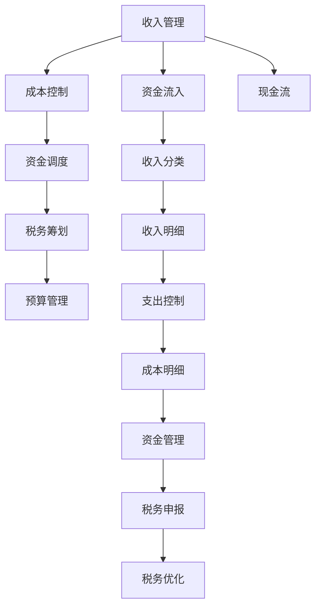

                 

## 1. 背景介绍

### 1.1 问题由来
在知识付费领域，一个关键且复杂的问题是财务管理。由于知识付费平台涉及的业务模式多样，包括内容制作、课程销售、用户订阅、广告等，如何有效地管理和使用这些业务带来的资金流，成为每个知识付费创业公司都必须面对的挑战。

近年来，随着知识付费市场的快速扩张，越来越多的企业投入其中。然而，财务管理的不规范、成本管理不精细、资金调度不科学等问题普遍存在，导致很多初创公司难以实现盈利，甚至面临资金链断裂的风险。因此，掌握财务管理技巧，特别是在知识付费创业的特定场景下，是公司成功的重要保障。

### 1.2 问题核心关键点
知识付费创业的财务管理主要包括收入管理、成本控制、资金调度、税务筹划等关键环节。成功的财务管理不仅能够有效提高资金使用效率，还能帮助公司规避财务风险，提升企业价值。

具体来说，财务管理的关键点如下：

- **收入管理**：如何准确、及时地记录和管理收入，是财务管理的核心之一。需要确保收入来源清晰，收入分类合理，并能及时转化为现金流。
- **成本控制**：控制和优化运营成本，减少不必要的开支，提高资金使用效率。合理划分固定成本和变动成本，制定有效的成本控制策略。
- **资金调度**：科学管理现金流，确保资金链的稳健。通过合理的资金调度策略，既能满足公司的日常运营需求，又能保证资金流动性。
- **税务筹划**：合法合规地进行税务筹划，合理规划税负，优化税收结构，避免不必要的税收损失。

## 2. 核心概念与联系

### 2.1 核心概念概述

为了更好地理解知识付费创业的财务管理技巧，本节将介绍几个密切相关的核心概念：

- **收入管理**：确保收入来源的准确性和完整性，合理分类和管理收入。
- **成本控制**：通过精细化管理，优化成本结构，提升资金使用效率。
- **资金调度**：确保资金流的健康稳定，科学管理现金流，防范资金风险。
- **税务筹划**：合理规划税务，合法合规地进行税务优化，降低税负。
- **预算管理**：制定详细的财务预算，对收入、支出、利润等进行科学预测和管理。

这些核心概念之间的逻辑关系可以通过以下Mermaid流程图来展示：



这个流程图展示了几大财务管理关键环节及其之间的关系：

1. 收入管理确保资金流入的准确性和分类合理性。
2. 成本控制优化成本结构，提高资金使用效率。
3. 资金调度科学管理现金流，防范资金风险。
4. 税务筹划合理规划税务，降低税负。
5. 预算管理制定详细的财务预算，进行科学预测和管理。

## 3. 核心算法原理 & 具体操作步骤

### 3.1 算法原理概述

知识付费创业的财务管理核心算法主要围绕资金的流向、流动性和财务风险管理进行优化。其核心思想是：通过科学规划和高效管理，确保资金流入与流出的平衡，最大程度地提升资金使用效率，同时防范财务风险。

形式化地，假设知识付费创业公司的收入为 $R$，支出为 $C$，税率为 $t$，则公司净收入 $N$ 为：

$$
N = R - C - R \times t
$$

财务管理的目标是最大化净收入 $N$，因此关键在于合理规划收入、支出和税务，进行有效的资金调度。

### 3.2 算法步骤详解

知识付费创业的财务管理主要包括以下几个关键步骤：

**Step 1: 收入管理**

1. **收入分类**：将各种收入来源进行分类，如课程销售收入、订阅费用、广告收入等。
2. **收入记录**：确保每笔收入都能准确、及时地记录在系统中，包括收入来源、金额、日期等信息。
3. **收入分析**：定期分析收入数据，识别收入来源和变化趋势，为决策提供依据。

**Step 2: 成本控制**

1. **成本分类**：将各种成本进行分类，如固定成本（如办公场所租赁、设备购置等）、变动成本（如内容制作、推广费用等）。
2. **成本控制**：定期审查成本支出，识别可优化的部分，采用成本控制策略（如谈判优惠、使用共享资源等）。
3. **成本优化**：采用成本效益分析方法，选择性价比最高的供应商和服务提供商，优化采购和资源分配。

**Step 3: 资金调度**

1. **现金流预测**：制定详细的现金流预测模型，预测未来的现金流入和流出。
2. **资金调度策略**：根据现金流预测结果，制定合理的资金调度策略，确保资金链的稳健。
3. **风险管理**：建立资金风险预警机制，提前识别并应对可能的资金风险。

**Step 4: 税务筹划**

1. **税务合规**：确保所有税务申报合规，避免税务风险。
2. **税务优化**：通过合法合规的税务筹划，优化税收结构，减少不必要的税负。
3. **税收预测**：利用历史数据和行业标准，预测未来的税收变化，制定相应的税务策略。

**Step 5: 预算管理**

1. **财务预算**：制定详细的财务预算，包括收入预算、支出预算和利润预算等。
2. **预算执行**：根据预算执行情况，及时调整预算，确保财务目标的实现。
3. **预算分析**：定期分析预算执行情况，识别偏差原因，制定改进措施。

### 3.3 算法优缺点

知识付费创业的财务管理方法具有以下优点：

1. **系统化管理**：通过科学规划和精细化管理，能够有效提升资金使用效率，避免资金浪费。
2. **风险防范**：合理的资金调度和税务筹划能够有效防范财务风险，保障公司财务健康。
3. **决策支持**：通过收入和成本分析，能够提供有力的决策支持，优化运营策略。

同时，该方法也存在一定的局限性：

1. **复杂性高**：涉及多环节、多部门的管理，需要协调和配合，管理复杂。
2. **依赖数据质量**：财务数据的准确性和完整性直接影响管理效果。
3. **需专业人才**：需要专业的财务人员和管理人员，团队建设成本较高。

尽管存在这些局限性，但就目前而言，系统化的财务管理方法是知识付费创业公司的首选方案，有助于提升企业整体的财务管理水平和竞争力。

### 3.4 算法应用领域

知识付费创业的财务管理方法在多个领域得到了广泛的应用，包括但不限于：

- **内容制作和版权管理**：管理内容制作成本和版权费用，确保内容品质和合规性。
- **课程销售和订阅**：管理课程销售收入和订阅费用，进行精准的收入预测和成本控制。
- **广告和营销**：管理广告费用和营销支出，进行广告效果评估和优化。
- **运营和维护**：管理日常运营和设备维护成本，优化资源配置。
- **税务和合规**：管理税务申报和合规事项，降低税务风险。

## 4. 数学模型和公式 & 详细讲解 & 举例说明

### 4.1 数学模型构建

本节将使用数学语言对知识付费创业的财务管理过程进行更加严格的刻画。

假设知识付费创业公司年收入为 $R$，支出为 $C$，税率为 $t$，净利润为 $P$。财务管理的目标是最大化净利润 $P$，即：

$$
P = R - C - R \times t
$$

在财务管理中，常用的财务指标包括：

- **毛利润率**：$毛利润率 = \frac{毛利润}{收入} = \frac{R - C}{R}$
- **净利润率**：$净利润率 = \frac{净利润}{收入} = \frac{P}{R}$
- **资产负债率**：$资产负债率 = \frac{负债}{资产}$
- **现金流率**：$现金流率 = \frac{经营现金流}{净利润}$

通过这些指标，可以对公司的财务状况进行全面的评估和预测。

### 4.2 公式推导过程

以下是几个常见财务指标的公式推导过程：

**毛利润率**：

$$
毛利润率 = \frac{R - C}{R} = 1 - \frac{C}{R}
$$

**净利润率**：

$$
净利润率 = \frac{P}{R} = 1 - t - \frac{C}{R}
$$

**资产负债率**：

$$
资产负债率 = \frac{负债}{资产} = \frac{L}{A}
$$

**现金流率**：

$$
现金流率 = \frac{经营现金流}{净利润} = \frac{OCF}{P}
$$

其中 $OCF$ 表示经营现金流，$L$ 表示负债，$A$ 表示资产。

通过这些公式，可以更加清晰地理解知识付费创业公司在不同环节的财务表现和潜在风险。

### 4.3 案例分析与讲解

以一家知识付费创业公司为例，其年收入为 $100,000$ 元，支出为 $60,000$ 元，税率为 $20\%$。

1. **收入分析**：
   - 主要收入来源为课程销售和订阅费用，其中课程销售收入为 $70,000$ 元，订阅收入为 $30,000$ 元。
   - 收入分类明确，有助于成本控制和预算管理。

2. **成本控制**：
   - 主要成本包括内容制作、广告推广、人员工资等，其中内容制作成本为 $40,000$ 元，广告推广成本为 $10,000$ 元。
   - 通过优化采购和资源分配，能够有效控制成本，提升资金使用效率。

3. **资金调度**：
   - 预计下季度现金流入 $80,000$ 元，现金流出 $50,000$ 元。
   - 制定资金调度策略，确保资金链的稳健。

4. **税务筹划**：
   - 年收入为 $100,000$ 元，按 $20\%$ 的税率计算，应缴税款为 $20,000$ 元。
   - 通过合法合规的税务筹划，可以优化税收结构，减少不必要的税负。

5. **预算管理**：
   - 制定详细的财务预算，确保财务目标的实现。
   - 定期分析预算执行情况，识别偏差原因，制定改进措施。

通过这些分析，可以更好地掌握公司的财务状况，制定合理的财务管理策略，确保公司健康发展。

## 5. 项目实践：代码实例和详细解释说明

### 5.1 开发环境搭建

在进行财务管理实践前，我们需要准备好开发环境。以下是使用Python进行财务管理开发的环境配置流程：

1. 安装Anaconda：从官网下载并安装Anaconda，用于创建独立的Python环境。

2. 创建并激活虚拟环境：
```bash
conda create -n finance-env python=3.8 
conda activate finance-env
```

3. 安装必要的Python库：
```bash
pip install pandas numpy matplotlib
```

完成上述步骤后，即可在`finance-env`环境中开始财务管理实践。

### 5.2 源代码详细实现

下面是使用Python进行财务管理的样例代码实现。

```python
import pandas as pd
import numpy as np
import matplotlib.pyplot as plt

# 定义财务数据
income = pd.DataFrame({
    '收入来源': ['课程销售', '订阅费用', '广告收入'],
    '收入金额': [70000, 30000, 5000],
    '时间': ['2022Q1', '2022Q2', '2022Q3']
})

cost = pd.DataFrame({
    '成本项目': ['内容制作', '广告推广', '人员工资'],
    '成本金额': [40000, 10000, 20000],
    '时间': ['2022Q1', '2022Q2', '2022Q3']
})

tax_rate = 0.2  # 税率

# 计算毛利润率和净利润率
income['毛利润率'] = (income['收入金额'] - cost['成本金额']) / income['收入金额']
income['净利润率'] = (income['收入金额'] - cost['成本金额'] - income['收入金额'] * tax_rate) / income['收入金额']

# 绘制收入和成本条形图
plt.bar(income['时间'], income['收入金额'], color='blue', label='收入')
plt.bar(cost['时间'], cost['成本金额'], color='red', label='成本')
plt.legend()
plt.title('收入和成本对比')
plt.xlabel('时间')
plt.ylabel('金额')
plt.show()

# 计算资产负债率
assets = 100000  # 资产总额
liabilities = 50000  # 负债总额
asset负债率 = liabilities / assets

# 绘制资产负债率饼图
plt.pie([assets, liabilities], labels=['资产', '负债'], autopct='%1.1f%%')
plt.title('资产负债率')
plt.show()
```

### 5.3 代码解读与分析

让我们再详细解读一下关键代码的实现细节：

**财务数据定义**：
- 使用Pandas库定义收入和成本数据表，包含来源、金额和时间等信息。
- 通过时间序列数据，可以直观地展示收入和成本的变化趋势。

**毛利润率和净利润率计算**：
- 通过收入和成本数据，计算毛利润率和净利润率，直观反映公司的盈利情况。
- 毛利润率是净利润率的基准，净利润率则进一步考虑了税负的影响。

**图表绘制**：
- 使用Matplotlib库绘制收入和成本的条形图，直观展示两者变化。
- 通过饼图展示资产负债率，直观展示公司财务结构。

**资产负债率计算**：
- 定义资产和负债数据，计算资产负债率。
- 资产负债率是公司财务健康的重要指标，通过饼图直观展示。

以上代码展示了基本的财务管理功能，包括收入和成本分析、毛利润率和净利润率计算、资产负债率展示等。在实际应用中，可以根据具体需求进行扩展，如引入现金流预测、资金调度、税务筹划等功能。

## 6. 实际应用场景

### 6.1 知识付费平台的运营管理

在知识付费平台中，财务管理对运营管理的支持至关重要。通过财务管理，可以及时掌握平台的收入和成本情况，进行精准的收入预测和成本控制。

**案例分析**：
- **收入预测**：根据历史数据和市场趋势，预测未来的课程销售和订阅收入。
- **成本控制**：通过分析内容制作、广告推广等支出，优化资源配置，降低成本。
- **资金调度**：根据现金流预测，合理安排资金调度，确保平台资金链的稳健。

### 6.2 内容制作和版权管理

内容制作和版权管理是知识付费创业公司的核心环节。通过财务管理，可以准确计算内容制作的成本，确保内容品质和版权合规性。

**案例分析**：
- **内容成本管理**：根据不同课程的制作需求，合理规划内容制作成本，避免资源浪费。
- **版权费用支付**：及时支付版权费用，确保内容版权的合法合规性。

### 6.3 广告和营销策略

广告和营销是知识付费平台的重要收入来源。通过财务管理，可以合理评估广告和营销效果，优化投放策略。

**案例分析**：
- **广告费用控制**：根据广告效果和预算，优化广告投放策略，确保广告费用的高效使用。
- **营销效果分析**：通过分析广告和营销数据的投入产出比，优化营销策略。

### 6.4 未来应用展望

随着知识付费市场的发展，财务管理将面临更多挑战，同时也将迎来新的机遇。未来，财务管理在知识付费创业中的应用将更加广泛和深入。

1. **大数据分析**：通过大数据分析，可以更准确地预测收入和成本变化，优化财务决策。
2. **AI技术应用**：引入AI技术进行财务预测和优化，提升财务管理效率和准确性。
3. **区块链应用**：利用区块链技术进行资金管理和税务优化，提升财务透明度和安全性。
4. **智能合约**：引入智能合约进行自动化资金管理，提升财务管理的智能化水平。

## 7. 工具和资源推荐

### 7.1 学习资源推荐

为了帮助开发者系统掌握知识付费创业的财务管理技巧，这里推荐一些优质的学习资源：

1. 《财务分析与管理》课程：由知名大学开设的财务管理课程，涵盖财务管理的基本概念和方法。
2. 《财务管理实战指南》书籍：系统介绍财务管理的各个环节和实践技巧，适合实际操作。
3. 《财务报表分析与解读》书籍：帮助理解财务报表中的关键指标和分析方法，提升财务分析能力。
4. 《财务决策分析》课程：学习如何利用财务数据进行科学决策，提升财务决策能力。

通过对这些资源的学习实践，相信你一定能够快速掌握知识付费创业的财务管理技巧，并应用于实际业务中。

### 7.2 开发工具推荐

高效的开发离不开优秀的工具支持。以下是几款用于财务管理开发的常用工具：

1. Excel：用于数据处理和分析，支持多种财务报表的创建和展示。
2. Tableau：用于数据可视化，支持复杂数据报表和分析，适合财务报表的展示。
3. Power BI：用于数据报表和分析，支持实时数据更新和可视化。
4. Python：用于财务数据分析和建模，支持Pandas、NumPy等库进行数据处理。

合理利用这些工具，可以显著提升财务管理任务的开发效率，加快创新迭代的步伐。

### 7.3 相关论文推荐

知识付费创业的财务管理技术的发展源于学界的持续研究。以下是几篇奠基性的相关论文，推荐阅读：

1. 《财务管理的数学模型研究》：讨论了财务管理中的各种数学模型及其应用。
2. 《知识付费平台的财务优化策略》：研究了知识付费平台中的财务优化策略，提出了多种优化方案。
3. 《大数据在财务管理中的应用》：介绍了大数据技术在财务管理中的实际应用，提升了财务管理效率。
4. 《AI在财务决策中的应用》：讨论了AI技术在财务决策中的实际应用，提升了财务决策的准确性。

这些论文代表了大数据财务管理技术的发展脉络。通过学习这些前沿成果，可以帮助研究者把握学科前进方向，激发更多的创新灵感。

## 8. 总结：未来发展趋势与挑战

### 8.1 总结

本文对知识付费创业的财务管理技巧进行了全面系统的介绍。首先阐述了知识付费创业中财务管理的重要性，明确了财务管理在收入管理、成本控制、资金调度、税务筹划等环节的关键作用。其次，从原理到实践，详细讲解了财务管理的数学模型和操作步骤，给出了财务管理的完整代码实例。同时，本文还广泛探讨了财务管理在知识付费创业中的实际应用场景，展示了财务管理的广泛应用前景。

通过本文的系统梳理，可以看到，财务管理在大数据和AI技术的支持下，能够更精准、更高效地支持知识付费创业的运营和发展。未来，伴随大数据和AI技术的持续演进，财务管理将更加智能化和精细化，为知识付费创业提供更有力的支持。

### 8.2 未来发展趋势

展望未来，知识付费创业的财务管理将呈现以下几个发展趋势：

1. **智能化管理**：引入大数据和AI技术，提升财务管理效率和精度。
2. **全面化管理**：涵盖财务管理的各个环节，从收入预测到税务筹划，形成闭环管理。
3. **透明化管理**：利用区块链等技术，提升财务管理的透明度和安全性。
4. **精细化管理**：通过精细化成本控制和资金调度，提升资金使用效率。
5. **绿色化管理**：引入绿色财务管理理念，提升企业的社会责任感和可持续发展能力。

以上趋势凸显了知识付费创业中财务管理的广阔前景。这些方向的探索发展，必将进一步提升财务管理的效果和水平，为知识付费创业提供更为坚实的财务保障。

### 8.3 面临的挑战

尽管知识付费创业的财务管理技术已经取得了不少进步，但在迈向更加智能化、全面化管理的过程中，仍面临诸多挑战：

1. **数据质量问题**：数据收集和处理是财务管理的基础，如何保证数据的质量和完整性，是未来的一大挑战。
2. **技术融合难题**：大数据和AI技术的应用，需要与现有财务系统进行深度融合，面临一定的技术难度。
3. **法规合规问题**：财务管理的法规和标准不断变化，如何在变化中保持合规，是一大挑战。
4. **人才短缺问题**：财务管理的智能化和精细化，需要具备大数据和AI知识的专业人才，但相关人才较为稀缺。
5. **资金风险管理**：复杂多变的市场环境，如何有效防范资金风险，是一大挑战。

尽管存在这些挑战，但通过不断优化财务管理技术，引入先进的管理理念和方法，知识付费创业的财务管理水平将不断提升，为公司的健康发展提供坚实的基础。

### 8.4 研究展望

未来，财务管理的研究将更加注重智能化、全面化和绿色化的方向，探索更多前沿技术和管理方法，提升知识付费创业的财务管理水平。通过理论与实践的结合，实现财务管理的高效、精准和智能化，为知识付费创业提供更为有力的支持。

## 9. 附录：常见问题与解答

**Q1：知识付费创业的财务管理有哪些关键点？**

A: 知识付费创业的财务管理关键点包括收入管理、成本控制、资金调度、税务筹划等。其中，收入管理确保收入来源的准确性和完整性，成本控制优化成本结构，资金调度科学管理现金流，税务筹划合理规划税务，共同确保公司财务健康。

**Q2：如何降低知识付费创业的财务风险？**

A: 降低知识付费创业的财务风险，可以从以下几个方面入手：
1. 收入管理：确保收入来源明确，收入分类合理。
2. 成本控制：优化成本结构，控制不必要开支。
3. 资金调度：科学管理现金流，确保资金链稳健。
4. 税务筹划：合理规划税务，降低税负。
5. 预算管理：制定详细的财务预算，进行科学预测和管理。

**Q3：知识付费创业的财务管理与传统财务管理有哪些不同？**

A: 知识付费创业的财务管理与传统财务管理有以下不同：
1. 数据来源不同：知识付费创业需要处理大量在线交易数据，传统财务管理更侧重于线下交易数据。
2. 数据处理方式不同：知识付费创业需要处理大量的非结构化数据，传统财务管理更侧重于结构化数据。
3. 技术要求不同：知识付费创业需要引入大数据和AI技术，传统财务管理更侧重于手工处理和财务软件。
4. 管理目标不同：知识付费创业需要更关注用户获取、内容制作、广告投放等业务目标，传统财务管理更侧重于财务健康、合规性等目标。

这些差异要求知识付费创业的财务管理在方法、工具和理念上做出相应的调整。

**Q4：知识付费创业的财务数据如何处理？**

A: 知识付费创业的财务数据处理主要包括以下步骤：
1. 数据收集：从课程销售、订阅费用、广告收入等渠道收集财务数据。
2. 数据清洗：处理缺失数据、异常数据等，确保数据质量。
3. 数据存储：使用数据库等工具，进行数据存储和管理。
4. 数据分析：使用Pandas、NumPy等工具，进行数据分析和处理。
5. 数据可视化：使用Tableau、Power BI等工具，进行数据可视化展示。

通过数据处理，可以更好地掌握财务数据，进行科学决策。

**Q5：知识付费创业的财务管理如何进行智能化管理？**

A: 知识付费创业的财务管理智能化主要通过以下方法实现：
1. 引入大数据技术：利用大数据分析，进行收入预测和成本控制。
2. 引入AI技术：利用机器学习算法，进行财务预测和优化。
3. 引入区块链技术：利用区块链技术，提升财务管理的透明度和安全性。
4. 引入智能合约：利用智能合约，进行自动化资金管理和税务优化。

通过引入先进技术，可以实现财务管理的智能化和精细化，提升财务管理效率和效果。

---

作者：禅与计算机程序设计艺术 / Zen and the Art of Computer Programming

