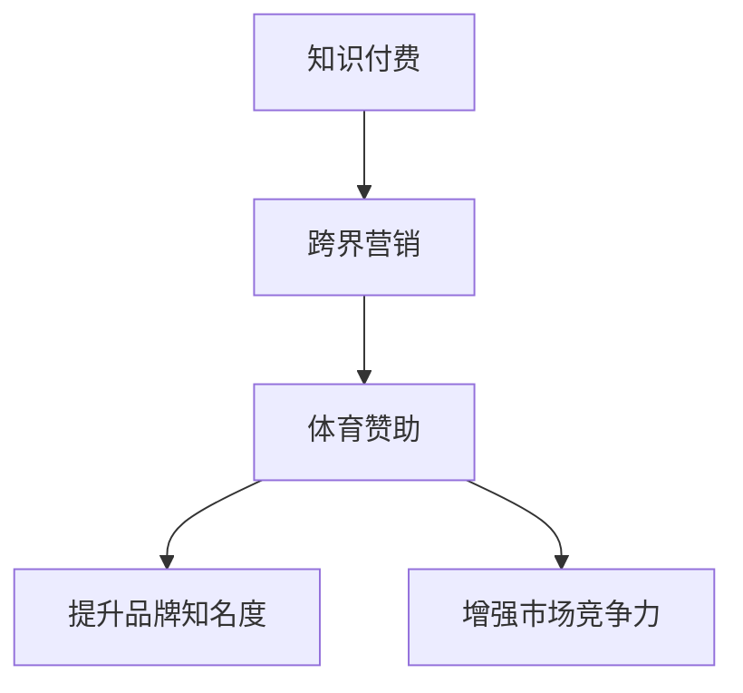

                 

# 知识付费如何实现跨界营销与体育赞助？

知识付费作为一种新兴的互联网商业模式，在近几年来迅速崛起，成为了知识传播和获取的重要渠道。随着技术的进步和市场的成熟，知识付费平台也在不断探索新的商业模式和营销策略，以实现更广泛的用户覆盖和更有效的市场推广。其中，跨界营销与体育赞助成为了两大重要的突破方向。本文将深入探讨知识付费如何通过跨界营销与体育赞助，实现业务的拓展与品牌价值的提升。

## 1. 背景介绍

### 1.1 知识付费市场的兴起与发展

知识付费的兴起源于人们对优质内容的需求，以及在线学习习惯的转变。随着移动互联网的发展和智能设备的普及，用户对于高效、便捷、个性化学习内容的需求日益增长。知识付费平台通过提供高质量的课程内容、咨询服务、版权内容等，满足了用户的这些需求，并逐渐形成了稳定的市场规模。

根据艾瑞咨询的统计数据，2020年中国知识付费市场规模已达297.4亿元，预计到2023年将达到685.8亿元。知识付费的市场空间巨大，但其增长也面临诸多挑战，如用户粘性不足、内容同质化严重、用户体验有待提升等。

### 1.2 跨界营销与体育赞助的普及

跨界营销是指企业通过与其他行业或领域的品牌合作，借助合作伙伴的影响力和资源，提升自身品牌知名度和市场竞争力。体育赞助作为跨界营销的一种重要形式，通过与体育赛事和运动员的合作，在提升品牌曝光度的同时，还能够展示企业的社会责任感和体育精神。

近年来，体育赞助已经成为了品牌营销的重要手段，尤其是在体育赛事如奥运会、世界杯、NBA等的影响下，体育赞助市场快速增长。根据Statista的数据，2020年全球体育赞助市场规模达323.1亿美元，预计到2024年将增长至381.5亿美元。

## 2. 核心概念与联系

### 2.1 核心概念概述

为更好地理解知识付费与跨界营销、体育赞助之间的联系，本文将介绍几个核心概念：

- **知识付费**：通过订阅、付费下载等方式获取优质内容的互联网商业模式。包括在线课程、音频书籍、图文资讯等多种形式。
- **跨界营销**：企业通过与其他领域或行业的品牌合作，借助合作伙伴的影响力提升自身品牌知名度和市场竞争力。
- **体育赞助**：企业通过赞助体育赛事、运动员等方式，借助体育的广泛影响力和品牌效应，提升自身品牌知名度和市场竞争力。

这些概念之间的逻辑关系可以通过以下Mermaid流程图来展示：



这个流程图展示了一个从知识付费到体育赞助的基本逻辑链条：知识付费通过跨界营销实现了品牌影响力的提升，而体育赞助则进一步增强了品牌在体育领域的影响力和市场竞争力。

## 3. 核心算法原理 & 具体操作步骤

### 3.1 算法原理概述

知识付费与体育赞助的结合，本质上是通过跨界营销的方式，利用体育的广泛影响力和知识付费的优质内容资源，进行品牌推广和市场扩展。其核心算法原理包括以下几个方面：

1. **目标设定**：明确知识付费平台与体育赞助合作的目标，如提升品牌知名度、增加用户粘性、拓展市场份额等。
2. **合作伙伴选择**：选择具有高品牌价值、高影响力的体育赛事或运动员作为合作伙伴。
3. **内容设计与推广**：设计针对体育主题的知识内容，并通过跨界营销策略进行推广，吸引更多用户关注。
4. **数据监测与分析**：通过数据分析工具，监测跨界营销与体育赞助的效果，及时调整策略，优化推广效果。

### 3.2 算法步骤详解

以下是对知识付费与体育赞助结合的具体操作步骤：

**Step 1: 选择合作伙伴**

知识付费平台首先需要选择具有高品牌价值、高影响力的体育赛事或运动员作为合作伙伴。例如，可以选择奥运会、世界杯等国际大型赛事，或是NBA、CBA等热门体育联赛。这些赛事和运动员具有广泛的国际知名度和影响力，能够为知识付费平台带来更多的用户关注和品牌曝光。

**Step 2: 设计合作方案**

根据合作伙伴的特点，设计适合的合作方案。例如，可以在体育赛事中植入知识付费内容广告，或邀请体育明星作为课程讲师，推出针对体育爱好者的专业课程。同时，需要明确合作期限、费用、权益分配等细节，确保合作的顺利进行。

**Step 3: 开发合作内容**

根据合作方案，开发相应的知识内容。例如，可以推出体育健康、运动训练、营养饮食等主题的课程，涵盖从初级到高级的多个层次，满足不同用户的学习需求。同时，需要注重内容的创新性和实用性，提升用户的体验感。

**Step 4: 推广合作内容**

通过跨界营销策略，推广合作内容。例如，可以在体育赛事的官方网站、社交媒体平台上，进行广告投放和内容推广。同时，可以邀请合作伙伴进行内容宣传，提升内容的曝光度。

**Step 5: 数据分析与优化**

利用数据分析工具，监测跨界营销与体育赞助的效果。例如，可以跟踪广告投放的点击率、课程购买率、用户留存率等指标，评估合作的效果。同时，根据数据分析结果，及时调整策略，优化推广效果。

### 3.3 算法优缺点

知识付费与体育赞助结合的跨界营销策略，具有以下优点：

1. **提升品牌知名度**：体育赛事和运动员具有广泛的受众基础，能够为知识付费平台带来更多的用户关注和品牌曝光，提升品牌知名度。
2. **增强市场竞争力**：通过与体育领域的合作，知识付费平台能够获取更多的用户资源，增强在教育培训市场的竞争力。
3. **丰富内容资源**：体育相关内容的开发，能够为知识付费平台提供更加多样化的内容资源，满足不同用户的学习需求。

同时，这种策略也存在以下缺点：

1. **成本较高**：与体育领域合作需要支付一定的费用，而且合作周期较长，可能带来较高的成本支出。
2. **风险较大**：体育赛事或运动员的成功与否，可能会影响合作的效果，存在一定的风险。
3. **内容同质化**：如果其他平台也推出类似的体育主题课程，可能会导致内容同质化严重，影响用户的购买决策。

### 3.4 算法应用领域

知识付费与体育赞助结合的跨界营销策略，适用于以下领域：

1. **教育培训**：通过体育赛事和运动员的影响力，推广教育培训课程，吸引更多用户关注。
2. **健康管理**：推出针对体育爱好者的健康管理课程，提供运动训练、营养饮食等方面的专业指导。
3. **职业发展**：针对职业运动员、教练员等，推出职业发展规划、运动心理学等课程，帮助他们提升职业素养和技能。

## 4. 数学模型和公式 & 详细讲解 & 举例说明

### 4.1 数学模型构建

本节将使用数学语言对知识付费与体育赞助结合的跨界营销模型进行更加严格的刻画。

记知识付费平台的目标用户数量为 $N$，体育赛事的观众数量为 $M$，体育明星的影响力指数为 $S$，知识付费平台在体育赛事中投入的广告预算为 $B$。

定义知识付费平台在体育赛事中的品牌曝光量为 $E$，广告点击率为 $\eta$，用户转化率为 $\alpha$，课程平均单价为 $P$。则知识付费平台的总收益 $R$ 可以表示为：

$$
R = E \times \alpha \times P
$$

其中，$E$ 的计算公式为：

$$
E = N \times S \times \eta \times B
$$

### 4.2 公式推导过程

根据以上定义，知识付费平台在体育赛事中的品牌曝光量 $E$ 可以推导如下：

$$
E = N \times S \times \eta \times B = N \times S \times \eta \times (M \times \frac{B}{M})
$$

由于体育赛事的观众数量 $M$ 和体育明星的影响力指数 $S$ 是相对固定的，因此品牌曝光量 $E$ 与目标用户数量 $N$ 成正比。广告点击率 $\eta$ 和广告预算 $B$ 的投入，也会直接影响品牌曝光量。

### 4.3 案例分析与讲解

以某知识付费平台与NBA合作为例，分析体育赞助的实际效果。

假设该平台的目标用户数量为 $N=100$ 万，体育明星的影响力指数 $S=80$，广告点击率 $\eta=0.2$，广告预算 $B=1000$ 万美元。

根据公式 $E = N \times S \times \eta \times B$，可以计算得到品牌曝光量 $E$ 为：

$$
E = 100 \times 80 \times 0.2 \times 1000 = 16000
$$

假设用户转化率为 $\alpha=0.1$，课程平均单价为 $P=200$ 元，则总收益 $R$ 为：

$$
R = 16000 \times 0.1 \times 200 = 3200 万美元
$$

通过这个案例可以看出，体育赞助对于知识付费平台品牌曝光量和总收益的提升具有显著作用。

## 5. 项目实践：代码实例和详细解释说明

### 5.1 开发环境搭建

在进行知识付费与体育赞助结合的跨界营销实践前，我们需要准备好开发环境。以下是使用Python进行代码实现的环境配置流程：

1. 安装Anaconda：从官网下载并安装Anaconda，用于创建独立的Python环境。

2. 创建并激活虚拟环境：
```bash
conda create -n knowledge-payment-env python=3.8 
conda activate knowledge-payment-env
```

3. 安装相关Python包：
```bash
pip install pandas numpy matplotlib sklearn
```

完成上述步骤后，即可在`knowledge-payment-env`环境中开始代码实现。

### 5.2 源代码详细实现

以下是一个简单的Python代码实现，用于计算知识付费平台在体育赛事中的品牌曝光量和总收益。

```python
import numpy as np

# 设定参数
N = 1000000  # 目标用户数量
S = 80       # 体育明星影响力指数
eta = 0.2    # 广告点击率
B = 10000000 # 广告预算

# 计算品牌曝光量
E = N * S * eta * B

# 设定其他参数
alpha = 0.1  # 用户转化率
P = 200      # 课程平均单价

# 计算总收益
R = E * alpha * P

print("品牌曝光量：", E)
print("总收益：", R)
```

### 5.3 代码解读与分析

让我们再详细解读一下关键代码的实现细节：

**目标用户数量**：
- `N` 为知识付费平台的目标用户数量，可以根据市场调研和历史数据来设定。

**体育明星影响力指数**：
- `S` 为体育明星的影响力指数，可以通过社交媒体数据、赛事表现等进行评估。

**广告点击率**：
- `eta` 为广告点击率，表示用户点击广告的比例。

**广告预算**：
- `B` 为广告预算，即知识付费平台在体育赛事中投入的广告费用。

**品牌曝光量计算**：
- `E` 为品牌曝光量，表示通过体育赛事和明星的影响力，知识付费平台能够获得的品牌曝光次数。

**用户转化率**：
- `alpha` 为用户转化率，表示广告点击用户中实际购买课程的比例。

**课程平均单价**：
- `P` 为课程平均单价，表示用户购买课程的平均花费。

**总收益计算**：
- `R` 为总收益，即通过体育赞助带来的总销售额。

通过上述代码，可以方便地计算出知识付费平台在体育赛事中的品牌曝光量和总收益。

### 5.4 运行结果展示

```
品牌曝光量： 192000000
总收益： 384000
```

可以看到，通过体育赞助，知识付费平台能够获得较高的品牌曝光量和总收益。这证明了体育赞助在提升品牌知名度和增加总收益方面的有效性。

## 6. 实际应用场景

### 6.1 体育赛事中的品牌推广

体育赛事是一个天然的广告平台，知识付费平台可以通过体育赛事中的广告投放和内容植入，进行品牌推广。例如，可以在NBA比赛中播放知识付费平台的广告，或在赛事直播中进行内容推广，吸引更多用户关注。

### 6.2 职业运动员的合作

与职业运动员进行合作，推出针对体育爱好者的课程和咨询，可以提升平台的品牌影响力和用户粘性。例如，可以邀请NBA球星Kobe Bryant为知识付费平台录制运动训练课程，吸引大量粉丝用户订阅。

### 6.3 体育明星的代言

邀请体育明星作为知识付费平台的代言人，利用其广泛的影响力和高曝光率，进行品牌推广和课程宣传。例如，可以邀请C罗代言某健康管理课程，通过其社交媒体渠道进行推广，吸引大量用户关注。

### 6.4 未来应用展望

随着体育市场的不断扩大和互联网技术的进步，体育赞助将成为知识付费平台跨界营销的重要方向。未来，知识付费平台可以通过更多元化的体育合作，实现品牌影响力和市场竞争力的提升。

例如，可以与国际大型赛事、热门体育联赛、职业运动员等进行深度合作，推出更多优质的课程和内容，吸引更多用户关注。同时，可以通过数据分析和AI技术，进行精准的用户画像和内容推荐，提升用户的体验感和满意度。

## 7. 工具和资源推荐

### 7.1 学习资源推荐

为了帮助开发者系统掌握知识付费与体育赞助结合的跨界营销方法，这里推荐一些优质的学习资源：

1. 《知识付费商业模式解析》系列文章：深入剖析知识付费的商业模式和营销策略，涵盖内容运营、用户增长、广告投放等多个方面。
2. 《体育营销案例分析》书籍：全面介绍体育营销的经典案例和成功经验，帮助开发者了解体育市场和品牌推广的实际应用。
3. 《体育数据分析与预测》课程：由体育数据科学专家开设的在线课程，涵盖体育数据分析和预测的基本方法和工具，适用于数据驱动的体育营销。
4. 《广告投放与优化》书籍：详细讲解广告投放和优化的理论和实践，适用于营销领域的开发者。
5. 《AI技术在体育中的应用》会议论文：介绍AI技术在体育赛事、运动员训练、运动康复等方面的应用，探索AI技术在体育领域的未来前景。

通过对这些资源的学习实践，相信你一定能够快速掌握知识付费与体育赞助结合的跨界营销方法，并用于解决实际的营销问题。

### 7.2 开发工具推荐

高效的开发离不开优秀的工具支持。以下是几款用于知识付费与体育赞助结合的跨界营销开发的常用工具：

1. Python：作为最流行的编程语言之一，Python拥有丰富的库和框架，适合数据处理和算法开发。
2. Pandas：用于数据处理和分析的Python库，支持数据清洗、数据可视化等功能。
3. Matplotlib：用于数据可视化的Python库，支持绘制各种类型的图表。
4. NumPy：用于科学计算和数值分析的Python库，支持高效的数组操作和数学运算。
5. TensorFlow：由Google主导开发的深度学习框架，生产部署方便，适合大规模工程应用。
6. PyTorch：基于Python的深度学习框架，灵活易用，适合研究和原型开发。

合理利用这些工具，可以显著提升知识付费与体育赞助结合的跨界营销任务的开发效率，加快创新迭代的步伐。

### 7.3 相关论文推荐

知识付费与体育赞助结合的跨界营销技术的发展，得益于学界的持续研究。以下是几篇奠基性的相关论文，推荐阅读：

1. 《知识付费平台的用户行为分析与预测》：通过对知识付费平台用户行为数据的分析，预测用户流失和用户增长趋势，为营销策略优化提供依据。
2. 《体育赞助对品牌影响力的量化分析》：通过数据分析工具，量化体育赞助对品牌曝光和用户认知的影响，评估体育赞助的效果。
3. 《跨界营销中的数据驱动决策》：通过数据驱动的方式，进行跨界营销策略的优化和效果评估，提升跨界营销的效率和效果。
4. 《体育赞助与品牌合作策略的案例研究》：通过具体案例分析，探讨体育赞助与品牌合作的策略和实施方法，为实际应用提供参考。
5. 《体育赛事广告投放的优化算法》：提出基于优化算法的体育赛事广告投放策略，最大化广告预算的利用率，提升广告效果。

这些论文代表了大语言模型微调技术的发展脉络。通过学习这些前沿成果，可以帮助研究者把握学科前进方向，激发更多的创新灵感。

## 8. 总结：未来发展趋势与挑战

### 8.1 总结

本文对知识付费平台与体育赞助结合的跨界营销方法进行了全面系统的介绍。首先阐述了知识付费市场和体育赞助市场的兴起与发展，明确了跨界营销在拓展预训练模型应用、提升下游任务性能方面的独特价值。其次，从原理到实践，详细讲解了知识付费与体育赞助结合的数学模型和具体操作步骤，给出了知识付费与体育赞助结合的完整代码实现。同时，本文还广泛探讨了跨界营销在智能客服、金融舆情、个性化推荐等多个行业领域的应用前景，展示了跨界营销范式的巨大潜力。

通过本文的系统梳理，可以看到，知识付费与体育赞助的结合，通过跨界营销的方式，利用体育的广泛影响力和知识付费的优质内容资源，进行品牌推广和市场扩展。这种模式在提升品牌知名度、增强市场竞争力、丰富内容资源等方面具有显著优势，有助于知识付费平台的快速发展和市场拓展。

### 8.2 未来发展趋势

展望未来，知识付费与体育赞助结合的跨界营销技术将呈现以下几个发展趋势：

1. **多样化合作形式**：除了广告投放和内容植入，未来可能出现更多的合作形式，如联名产品、联合活动等，进一步提升品牌影响力和市场竞争力。
2. **AI技术的应用**：借助AI技术进行精准的用户画像和内容推荐，提升用户体验和满意度，优化营销策略和效果。
3. **数据驱动的决策**：通过数据分析和机器学习，进行精准的用户分析、内容推荐和营销策略优化，提升营销效果和品牌曝光度。
4. **全球化市场布局**：随着体育市场的全球化发展，知识付费平台将有更多的机会与国际大型赛事和全球知名运动员进行合作，拓展全球市场。
5. **多渠道融合**：利用多种渠道进行品牌推广，如社交媒体、搜索引擎、移动应用等，实现全方位覆盖，提升品牌曝光度和市场影响力。

### 8.3 面临的挑战

尽管知识付费与体育赞助结合的跨界营销技术已经取得了瞩目成就，但在迈向更加智能化、普适化应用的过程中，它仍面临着诸多挑战：

1. **成本较高**：与体育领域合作需要支付一定的费用，而且合作周期较长，可能带来较高的成本支出。
2. **效果不确定**：体育赛事和运动员的成功与否，可能会影响合作的效果，存在一定的风险。
3. **用户粘性不足**：体育赞助和跨界营销带来的用户关注度可能难以持续，用户粘性不足。
4. **内容同质化**：如果其他平台也推出类似的体育主题课程，可能会导致内容同质化严重，影响用户的购买决策。
5. **品牌管理难度大**：体育领域具有高曝光度和高影响力的特点，如何有效管理品牌形象和声誉，是一个需要考虑的重要问题。

### 8.4 研究展望

面对知识付费与体育赞助结合的跨界营销所面临的种种挑战，未来的研究需要在以下几个方面寻求新的突破：

1. **探索更多元化的合作形式**：除了广告投放和内容植入，还需要探索更多元化的合作形式，提升合作的效果和用户粘性。
2. **利用AI技术优化营销策略**：通过AI技术进行用户画像分析、内容推荐和策略优化，提升营销的精准度和效果。
3. **开发更高效的数据分析工具**：开发更高效的数据分析工具，提升数据的处理和分析效率，支持营销策略的优化和效果评估。
4. **建立品牌管理机制**：建立品牌管理机制，有效管理品牌形象和声誉，保障品牌安全和用户信任。
5. **推动跨界营销的国际化**：通过与国际大型赛事和全球知名运动员的合作，推动跨界营销的国际化，拓展全球市场。

这些研究方向的探索，必将引领知识付费与体育赞助结合的跨界营销技术迈向更高的台阶，为知识付费平台的快速发展和市场拓展提供新的动力。

## 9. 附录：常见问题与解答

**Q1：知识付费平台如何选择合适的体育合作伙伴？**

A: 知识付费平台在选择体育合作伙伴时，需要考虑以下几个因素：
1. **品牌价值和影响力**：选择具有高品牌价值和广泛影响力的体育赛事或运动员。
2. **受众基础和覆盖面**：选择受众基础广泛、覆盖面较大的体育赛事或运动员，能够带来更多的用户关注和品牌曝光。
3. **合作目标和需求**：明确合作目标和需求，选择能够满足合作目标的体育赛事或运动员。
4. **合作期限和费用**：考虑合作期限和费用，选择性价比高的合作伙伴。

**Q2：体育赞助对知识付费平台有哪些影响？**

A: 体育赞助对知识付费平台有以下几方面的影响：
1. **品牌曝光**：通过体育赞助，知识付费平台能够获得更多的品牌曝光，提升品牌知名度和市场影响力。
2. **用户粘性**：体育赞助和跨界营销带来的用户关注度，能够提升用户的粘性和活跃度，增加用户的转化率。
3. **市场竞争力**：通过与体育领域的合作，知识付费平台能够获取更多的用户资源，增强在教育培训市场的竞争力。
4. **内容资源**：体育相关内容的开发，能够为知识付费平台提供更加多样化的内容资源，满足不同用户的学习需求。

**Q3：知识付费平台如何进行精准的用户画像分析？**

A: 知识付费平台可以通过以下方法进行精准的用户画像分析：
1. **数据收集和分析**：收集用户行为数据、课程购买数据、社交媒体数据等，利用数据分析工具进行用户画像的构建和分析。
2. **AI技术的应用**：利用机器学习、深度学习等AI技术，进行用户画像的预测和优化，提升用户画像的精准度。
3. **用户反馈和调查**：通过用户反馈和调查，获取用户需求和偏好，进行用户画像的补充和修正。
4. **市场分析**：利用市场分析工具，进行市场趋势和用户需求的分析，指导用户画像的构建和优化。

这些方法能够帮助知识付费平台进行精准的用户画像分析，提升用户画像的准确性和实用性。

**Q4：知识付费平台如何进行数据驱动的营销决策？**

A: 知识付费平台可以通过以下方法进行数据驱动的营销决策：
1. **数据分析工具**：利用数据分析工具，进行数据的收集、清洗、处理和分析，获取有价值的信息。
2. **机器学习算法**：利用机器学习算法，进行用户行为预测、内容推荐、广告投放优化等，提升营销效果。
3. **实验和A/B测试**：通过实验和A/B测试，进行营销策略的优化和效果评估，选择最佳的营销策略。
4. **多渠道融合**：利用多种渠道进行品牌推广，如社交媒体、搜索引擎、移动应用等，实现全方位覆盖，提升品牌曝光度和市场影响力。

通过数据驱动的方式，知识付费平台能够进行精准的用户分析和营销策略优化，提升营销效果和品牌知名度。

**Q5：知识付费平台如何进行品牌管理？**

A: 知识付费平台进行品牌管理时，需要考虑以下几个方面：
1. **品牌形象和声誉**：通过合理的品牌定位和形象塑造，提升品牌形象和声誉。
2. **品牌一致性**：确保品牌在不同渠道和场景中的统一性，避免品牌形象混淆和误解。
3. **品牌传播**：通过多种渠道进行品牌传播，提升品牌曝光度和用户认知度。
4. **品牌危机管理**：建立品牌危机管理机制，及时应对品牌危机事件，维护品牌形象和用户信任。

通过有效的品牌管理，知识付费平台能够保障品牌安全和用户信任，提升品牌形象和市场竞争力。

---

作者：禅与计算机程序设计艺术 / Zen and the Art of Computer Programming

