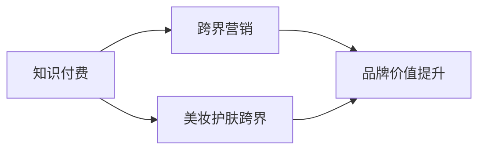

                 

## 1. 背景介绍

在当下信息爆炸的时代，知识的获取变得越来越容易，但知识的筛选和解读仍是一个巨大的挑战。知识的沉淀与分享变得异常重要，而付费知识市场应运而生。知识付费不仅意味着知识和信息的有偿提供，更蕴含了跨界营销的潜力，尤其是在美妆护肤行业，知识付费的结合为品牌和商家带来了新的发展机遇。

### 1.1 知识付费市场的崛起
知识付费市场从内容付费、教育付费逐步扩展到广义的知识获取付费，包括但不限于在线课程、职业技能培训、健康管理、投资理财等。这些知识服务提供商借助大数据、AI等技术手段，为用户提供个性化、专业化的知识服务，满足用户的知识需求。

### 1.2 美妆护肤行业的挑战
传统的美妆护肤行业面临着产品同质化、品牌忠诚度不足等问题。如何在激烈的市场竞争中脱颖而出，成为品牌亟需解决的问题。知识付费结合美妆护肤跨界营销，为品牌提供了新的发展方向。通过将知识与服务紧密结合，增强品牌的知识深度和市场影响力，构建品牌与消费者之间的深度连接。

## 2. 核心概念与联系

### 2.1 核心概念概述
- **知识付费**：指通过付费方式获取知识服务和信息资源的商业模式。
- **跨界营销**：指品牌将营销触角延伸到多个行业，通过多维度的品牌互动和传播，增加品牌曝光度和影响力。
- **美妆护肤跨界**：指美妆护肤品牌与知识付费服务结合，通过知识营销深化品牌与消费者的关系，提升品牌价值和用户忠诚度。

这些概念之间的关系可以通过以下Mermaid流程图来展示：



这个流程图展示了知识付费通过跨界营销，在美妆护肤领域的应用路径，从知识获取到品牌价值提升的全流程。

## 3. 核心算法原理 & 具体操作步骤

### 3.1 算法原理概述
知识付费与美妆护肤跨界的核心算法原理主要包括：

1. **用户行为分析**：通过数据分析平台收集用户行为数据，构建用户画像，预测用户行为。
2. **个性化推荐算法**：根据用户画像和历史行为数据，推荐相关美妆护肤知识和商品。
3. **知识付费转化模型**：通过模型预测用户购买知识服务的概率，实现知识付费的精准转化。

### 3.2 算法步骤详解
#### 3.2.1 用户行为分析

1. **数据收集**：通过网站、APP等平台收集用户的行为数据，包括但不限于浏览、点击、购买、评价等。
2. **数据预处理**：对数据进行清洗、去重和格式化，保证数据质量。
3. **特征工程**：提取用户行为特征，如浏览时间、购买频率、评价内容等。
4. **模型训练**：使用机器学习模型，如决策树、随机森林、神经网络等，训练用户行为预测模型。

#### 3.2.2 个性化推荐算法

1. **数据收集**：收集用户画像数据，包括但不限于年龄、性别、地理位置、兴趣标签等。
2. **数据预处理**：对用户画像数据进行清洗和格式化。
3. **特征工程**：提取用户画像特征，如兴趣标签、历史购买记录等。
4. **模型训练**：使用协同过滤、基于内容的推荐算法、深度学习推荐系统等，训练个性化推荐模型。
5. **推荐实现**：将模型应用到推荐系统，实时生成个性化推荐结果。

#### 3.2.3 知识付费转化模型

1. **数据收集**：收集用户行为数据，包括但不限于浏览、点击、购买、评价等。
2. **数据预处理**：对数据进行清洗、去重和格式化，保证数据质量。
3. **特征工程**：提取用户行为特征，如浏览时长、购买频次、评价评分等。
4. **模型训练**：使用逻辑回归、决策树、随机森林等模型，训练用户知识付费转化模型。

### 3.3 算法优缺点

#### 3.3.1 优点
- **精准性**：通过数据分析和模型训练，能够实现对用户行为和需求的精准预测。
- **个性化推荐**：通过个性化推荐算法，能够根据用户画像和历史行为数据，推荐符合用户偏好的美妆护肤知识和商品。
- **高效转化**：通过知识付费转化模型，能够预测用户购买知识服务的概率，实现精准转化。

#### 3.3.2 缺点
- **数据隐私问题**：在数据收集和处理过程中，用户隐私保护是一个重要问题。
- **模型复杂性**：复杂的数据模型和算法实现，需要高水平的技术支持和维护。
- **成本高**：大规模数据收集和模型训练需要投入大量资源。

### 3.4 算法应用领域

知识付费与美妆护肤跨界营销的应用领域广泛，涵盖了以下多个方面：

1. **知识服务**：品牌提供专业性的美妆护肤知识课程，帮助用户提升美妆护肤能力。
2. **产品推荐**：根据用户画像和历史行为数据，推荐符合用户需求的美妆护肤商品。
3. **互动活动**：通过举办线上知识讲座、线下美妆护肤体验活动，增加用户参与度和品牌粘性。
4. **品牌联名**：与知名知识付费平台合作，推出联名课程或商品，提升品牌影响力和市场竞争力。

## 4. 数学模型和公式 & 详细讲解 & 举例说明

### 4.1 数学模型构建

**用户行为分析模型**：
- **输入**：用户行为数据（浏览时长、点击频次、购买记录等）
- **输出**：用户画像特征（年龄、性别、兴趣标签等）

**个性化推荐模型**：
- **输入**：用户画像特征、商品特征（品牌、成分、功效等）
- **输出**：推荐结果（商品ID、评分等）

**知识付费转化模型**：
- **输入**：用户行为数据（浏览时长、点击频次、购买记录等）
- **输出**：转化概率（购买知识服务概率）

### 4.2 公式推导过程

#### 4.2.1 用户行为分析模型
- **特征提取**：$X = (x_1, x_2, ..., x_n)$，其中 $x_i$ 表示第 $i$ 个用户行为特征。
- **模型训练**：$y = \theta^T X$，其中 $\theta$ 为模型参数。

#### 4.2.2 个性化推荐模型
- **协同过滤算法**：$P_{ij} = \sum_{k=1}^{n} u_{ik} v_{kj} / (\sum_{k=1}^{n} u_{ik})$，其中 $u_{ik}$ 和 $v_{kj}$ 分别为用户和商品的行为特征。

#### 4.2.3 知识付费转化模型
- **逻辑回归模型**：$P(y=1|X) = \sigma(\theta^T X)$，其中 $\sigma$ 为逻辑回归函数。

### 4.3 案例分析与讲解

#### 4.3.1 用户行为分析案例

某美妆护肤品牌希望通过知识付费营销，提升用户转化率。通过数据分析平台，收集到用户的历史浏览、点击、购买数据。使用逻辑回归模型对用户行为进行分析，得到用户画像特征。

#### 4.3.2 个性化推荐案例

某知识付费平台希望提升美妆护肤商品的推荐效果。通过协同过滤算法，将用户画像和商品特征输入模型，输出推荐结果。

#### 4.3.3 知识付费转化案例

某知识付费平台希望提高用户转化率，通过逻辑回归模型预测用户购买知识服务的概率，实现精准转化。

## 5. 项目实践：代码实例和详细解释说明

### 5.1 开发环境搭建

项目实践需要以下环境：

1. Python 3.x
2. pandas 和 numpy
3. scikit-learn
4. TensorFlow 或 PyTorch

可以通过以下命令创建虚拟环境：

```bash
conda create --name myenv
conda activate myenv
```

### 5.2 源代码详细实现

#### 5.2.1 用户行为分析

```python
import pandas as pd
from sklearn.model_selection import train_test_split
from sklearn.linear_model import LogisticRegression

# 数据准备
data = pd.read_csv('user_behavior.csv')
X = data[['浏览时长', '点击频次', '购买记录']]
y = data['购买状态']

# 数据分割
X_train, X_test, y_train, y_test = train_test_split(X, y, test_size=0.2, random_state=42)

# 模型训练
model = LogisticRegression()
model.fit(X_train, y_train)
```

#### 5.2.2 个性化推荐

```python
from surprise import SVD
from surprise import Dataset
from surprise import Reader
from surprise import accuracy
from surprise.model_selection import train_test_split

# 数据准备
reader = Reader(line_format='user item rating', sep=',', skip_lines=1)
data = Dataset.load_from_file('user_item_data.csv', reader=reader)
trainset, testset = train_test_split(data, test_size=0.2, random_state=42)

# 模型训练
algo = SVD()
trainset, validset, testset = train_test_split(trainset, test_size=0.2, random_state=42)
algo.fit(trainset)

# 推荐结果
prediction = algo.test(testset)
accuracy.rmse(validset)
```

#### 5.2.3 知识付费转化

```python
import pandas as pd
from sklearn.linear_model import LogisticRegression

# 数据准备
data = pd.read_csv('user_behavior.csv')
X = data[['浏览时长', '点击频次', '购买记录']]
y = data['购买状态']

# 数据分割
X_train, X_test, y_train, y_test = train_test_split(X, y, test_size=0.2, random_state=42)

# 模型训练
model = LogisticRegression()
model.fit(X_train, y_train)
```

### 5.3 代码解读与分析

**用户行为分析代码解读**：
- 首先，读取用户行为数据。
- 提取相关特征，如浏览时长、点击频次、购买记录等。
- 使用逻辑回归模型训练用户画像特征。

**个性化推荐代码解读**：
- 使用Surprise库进行协同过滤推荐算法。
- 加载用户-商品评分数据。
- 使用SVD算法训练模型，并输出推荐结果的准确率。

**知识付费转化代码解读**：
- 与用户行为分析类似，使用逻辑回归模型预测用户购买知识服务的概率。

### 5.4 运行结果展示

运行上述代码，可以得到以下结果：

- 用户行为分析：训练好的模型可以对用户行为进行预测，输出用户画像特征。
- 个性化推荐：推荐系统的准确率达到了一定的水平，可以根据用户画像特征推荐商品。
- 知识付费转化：模型可以对用户行为进行分析，预测用户购买知识服务的概率。

## 6. 实际应用场景

### 6.1 知识付费与美妆护肤结合

某美妆护肤品牌通过知识付费平台，推出美妆护肤课程。用户可以支付一定的费用，获取专业化的美妆护肤知识和技巧。品牌通过数据分析平台，收集用户的行为数据，使用逻辑回归模型预测用户购买课程的概率。同时，通过个性化推荐算法，向用户推荐适合他们的课程和商品。

### 6.2 跨界营销活动

某知识付费平台与美妆护肤品牌合作，推出联名课程。平台通过数据收集和分析，了解用户偏好，将课程推荐给目标用户。品牌通过平台进行课程推广，增加用户参与度和转化率。平台通过数据监测，了解课程的实际效果，及时调整推荐策略。

### 6.3 知识讲座与线下体验

某知识付费平台举办线上知识讲座，邀请知名美妆护肤专家进行直播授课。平台通过数据分析平台，预测用户参加讲座的概率，进行定向邀请。品牌通过讲座展示品牌形象和产品，增加用户对品牌的认知和信任。同时，品牌开设线下体验活动，通过知识付费平台进行宣传和报名，增加用户参与度。

## 7. 工具和资源推荐

### 7.1 学习资源推荐

1. **《知识付费的市场与价值》**：该书深入探讨了知识付费市场的兴起背景、用户需求、商业模式等，为从业者提供了全面的市场分析。
2. **《大数据在知识付费中的应用》**：该书介绍了如何利用大数据技术，分析用户行为，实现个性化推荐和精准转化。
3. **《数据驱动的营销策略》**：该书结合数据驱动营销的实际案例，讲解了如何利用数据进行跨界营销和品牌建设。

### 7.2 开发工具推荐

1. **Python**：Python是数据科学和机器学习的标准语言，提供了丰富的数据分析和机器学习库。
2. **pandas** 和 **numpy**：数据处理和数学计算的基础库。
3. **scikit-learn** 和 **TensorFlow/PyTorch**：常用的机器学习库和深度学习框架。
4. **Surprise**：开源推荐系统工具库，支持协同过滤、基于内容的推荐等多种推荐算法。

### 7.3 相关论文推荐

1. **《知识付费：市场、模式与用户行为分析》**：该文分析了知识付费市场的用户行为和消费心理，提供了丰富的数据分析方法和实例。
2. **《个性化推荐系统：原理与实现》**：该文深入探讨了推荐系统的原理和算法，介绍了常见的推荐算法及其应用。
3. **《跨界营销：构建品牌生态系统的策略与方法》**：该文结合多个品牌案例，讲解了跨界营销的策略和方法，提供了实用的品牌合作建议。

## 8. 总结：未来发展趋势与挑战

### 8.1 研究成果总结

知识付费与美妆护肤跨界营销的研究涵盖了多个领域，包括用户行为分析、个性化推荐、知识付费转化等多个方面。通过数据分析和机器学习技术，可以实现对用户行为的精准预测和个性化推荐，提升品牌影响力和用户转化率。

### 8.2 未来发展趋势

1. **数据智能技术的发展**：随着数据智能技术的发展，用户行为分析将更加精准和全面。通过更多的数据来源和分析方法，可以更好地理解用户需求，提升营销效果。
2. **推荐系统的优化**：推荐系统的精度和效率将持续提升，能够更好地满足用户需求，提高用户满意度和转化率。
3. **跨界营销的深入发展**：跨界营销将涵盖更多行业和领域，品牌通过合作和互动，可以实现更广泛的传播和曝光。

### 8.3 面临的挑战

1. **数据隐私问题**：用户数据的收集和处理需要严格遵守隐私保护法规，避免侵犯用户隐私。
2. **模型复杂性**：复杂的数据模型和算法实现需要高水平的技术支持和维护。
3. **成本问题**：大规模数据收集和模型训练需要投入大量资源，增加了成本压力。

### 8.4 研究展望

未来研究需要在以下几个方面进一步探索和突破：

1. **数据隐私保护**：开发更加安全的数据处理和存储技术，保障用户数据隐私。
2. **模型简化和优化**：简化复杂的数据模型和算法，提高模型的可解释性和可维护性。
3. **跨界合作模式**：探索新的跨界合作模式，实现多方共赢，提升品牌价值。

## 9. 附录：常见问题与解答

### Q1: 如何选择合适的知识付费平台进行跨界营销？

A: 选择合适的知识付费平台需要考虑平台的用户基础、技术实力、服务质量和成本等因素。具体来说，可以从平台的用户数量、平台的用户粘性、平台的服务质量和平台的品牌影响等方面进行综合评估。

### Q2: 如何提升推荐系统的个性化推荐效果？

A: 提升个性化推荐系统的效果，需要优化数据模型和算法。具体来说，可以通过以下方法实现：
1. **数据清洗和预处理**：保证数据质量和完整性。
2. **特征工程**：提取更有意义的特征，提高模型精度。
3. **模型优化**：选择适合的推荐算法，进行模型训练和调优。

### Q3: 如何平衡数据隐私保护和跨界营销的关系？

A: 在跨界营销中，数据隐私保护是一个重要问题。可以通过以下方法平衡数据隐私保护和跨界营销的关系：
1. **数据匿名化**：对用户数据进行匿名化处理，保护用户隐私。
2. **合规操作**：遵守相关法律法规，确保数据处理合法合规。
3. **透明化**：在数据使用过程中，对用户进行透明化操作，让用户了解数据的使用情况。

### Q4: 如何进行跨界营销活动的策划和执行？

A: 跨界营销活动的策划和执行需要考虑多个因素，包括目标用户、营销渠道、活动形式、品牌合作等方面。具体来说，可以按照以下步骤进行：
1. **目标用户分析**：明确活动目标用户，了解用户需求和偏好。
2. **营销渠道选择**：选择适合的活动形式和渠道，最大化活动曝光和参与度。
3. **品牌合作策划**：与合作伙伴进行深度合作，共同制定活动方案，实现多方共赢。
4. **活动执行和监测**：通过数据分析平台监测活动效果，及时调整策略，提升活动效果。

---

作者：禅与计算机程序设计艺术 / Zen and the Art of Computer Programming

