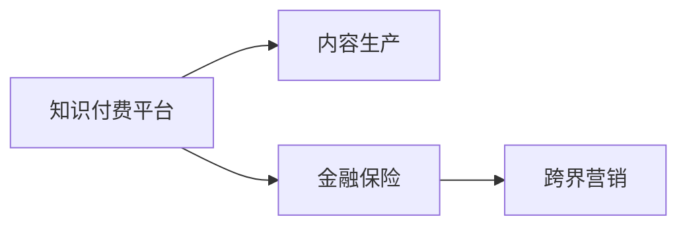

                 

# 知识付费如何实现跨界营销与金融保险跨界？

在数字化时代，知识付费已不再是教育行业的专属，它正在逐渐渗透到各行各业，成为跨界营销的重要工具。特别是在金融保险领域，知识付费的应用不仅提升了用户对金融产品的理解，还实现了营销和销售的协同，开创了全新的商业模式。本文将探讨知识付费在跨界营销与金融保险跨界中的应用，分析其实现原理与操作步骤，并展望未来发展趋势。

## 1. 背景介绍

### 1.1 知识付费的发展

随着互联网技术的发展和人们对于知识获取效率的需求提升，知识付费逐渐成为一种流行的信息获取方式。与传统的知识传播方式相比，知识付费强调个性化、及时性和互动性，使得用户能够根据自身需求高效获取所需知识。

知识付费平台如得到、喜马拉雅、知乎等，通过吸引知识型付费用户，实现精准用户画像和需求分析，进而提供个性化内容和服务，不断提升用户粘性。

### 1.2 跨界营销的概念

跨界营销指的是不同行业之间利用共同的特点和目标，通过资源整合、优势互补，实现品牌价值与市场影响力的双向传播。通过跨界合作，可以拓展营销渠道，提高品牌知名度，增强用户粘性，并实现多元化的收益。

金融保险行业一直以来以传统渠道营销为主，而知识付费作为一种新兴的营销手段，通过内容营销和教育服务，将金融知识与保险产品有效结合，实现了跨界营销的新模式。

## 2. 核心概念与联系

### 2.1 核心概念概述

为了更好地理解知识付费在跨界营销与金融保险跨界中的应用，我们首先概述几个核心概念：

- **知识付费**：用户通过付费获取专业知识或技能的服务模式。典型的平台包括得到、喜马拉雅、知乎等。
- **跨界营销**：不同行业或领域之间通过合作，实现资源共享、优势互补的营销策略。
- **金融保险**：涵盖银行、证券、保险等金融产品和服务。通过金融保险产品满足用户的资金管理和风险保障需求。

这三个概念之间的联系在于：知识付费作为信息服务，其内容不仅局限于教育和技能提升，还包括金融知识普及；跨界营销提供了将金融保险产品与知识付费平台结合的可能性，通过内容营销和教育服务，提升用户对金融产品的理解和接受度；金融保险产品作为知识付费服务的一部分，满足用户对知识和信息的实际需求，实现了商业价值的最大化。

### 2.2 核心概念的数学模型与架构

我们可以通过以下数学模型来抽象和描述知识付费、跨界营销和金融保险之间的关系：

$$
\text{知识付费平台} \rightarrow \text{内容生产} \rightarrow \text{金融保险} \rightarrow \text{跨界营销}
$$

其中，知识付费平台的内容生产涵盖了金融知识的科普和教育服务，金融保险作为知识付费服务的一部分，通过内容营销实现了与用户的高频互动和深度绑定。跨界营销则将金融保险产品通过知识付费平台推广，实现品牌和用户双重价值的最大化。

下面，我们通过Mermaid流程图展示这些概念之间的关系：



## 3. 核心算法原理 & 具体操作步骤

### 3.1 算法原理概述

知识付费在跨界营销中的核心算法原理主要体现在以下几个方面：

1. **内容个性化匹配**：知识付费平台通过算法匹配用户需求和内容，实现精准推荐。
2. **用户行为分析**：通过用户互动和反馈数据，分析用户偏好和需求，为金融保险产品定制化推广提供数据支持。
3. **营销内容生成**：利用机器学习和自然语言处理技术，生成具有吸引力的营销内容，提升用户对金融保险产品的兴趣和信任。
4. **品牌整合传播**：通过跨界合作，将金融保险品牌与知识付费平台有效结合，形成品牌联合营销。

### 3.2 算法步骤详解

#### 步骤1：选择目标用户群体

知识付费平台通过大数据分析，识别出具有高净值和理财需求的用户群体，作为目标营销对象。

#### 步骤2：定制化内容生成

根据目标用户群体的特征和需求，定制化生成金融知识内容。例如，针对高净值客户，可以生成高端理财和投资策略的课程；针对普通客户，可以生成基础的理财和保险知识普及课程。

#### 步骤3：内容营销策略设计

通过社交媒体、搜索引擎优化(SEO)等手段，将金融知识内容精准推广到目标用户群体，引导其对金融保险产品产生兴趣。

#### 步骤4：品牌整合传播

与金融保险公司合作，将金融保险产品嵌入到知识付费内容中，如“理财入门课程”或“保险知识问答”等，实现品牌与内容的深度绑定。

#### 步骤5：数据分析与优化

通过用户互动和反馈数据，不断优化内容推荐算法，提升用户体验和转化率。

### 3.3 算法优缺点

#### 优点

1. **精准推广**：通过数据分析和个性化推荐，实现金融保险产品的高效推广。
2. **用户粘性提升**：金融知识与实际需求相结合，提高用户对平台的粘性。
3. **品牌协同效应**：通过跨界合作，提升品牌知名度和市场影响力。

#### 缺点

1. **内容质量挑战**：生成高质量的金融知识内容具有挑战性，需要专家团队支持。
2. **营销效果依赖于用户信任**：用户对知识付费平台的信任度直接影响营销效果。
3. **数据隐私问题**：用户行为数据涉及隐私保护，需严格遵守相关法规。

### 3.4 算法应用领域

知识付费在跨界营销中的应用不仅限于金融保险领域，还广泛应用于以下场景：

- **教育培训**：通过知识付费平台推广各类职业技能培训课程。
- **健康医疗**：提供健康知识普及和医疗咨询服务。
- **娱乐文化**：推广各类文化艺术和娱乐活动。

此外，知识付费在金融保险领域的应用，也推动了金融产品和服务的多元化发展，开拓了新的市场空间。

## 4. 数学模型和公式 & 详细讲解 & 举例说明

### 4.1 数学模型构建

我们可以使用一个简单的数学模型来描述知识付费在金融保险跨界营销中的应用：

$$
\text{知识付费内容} = \text{金融知识} + \text{营销内容}
$$

其中，金融知识包括理财、投资、保险等金融产品相关的知识和策略；营销内容则通过知识付费平台进行精准推广，提升用户对金融产品的兴趣和理解。

### 4.2 公式推导过程

假设目标用户群体为 $U$，金融知识内容为 $K$，营销内容为 $M$，用户对内容的兴趣度为 $I$，则目标函数可以表示为：

$$
\max I(U,K,M)
$$

其中，$I$ 为用户对内容的兴趣度，可以通过用户行为数据（如课程点击率、留言互动等）进行计算。

对于金融知识 $K$ 和营销内容 $M$，可以分别表示为：

$$
K = \{k_1, k_2, \dots, k_n\}
$$

$$
M = \{m_1, m_2, \dots, m_m\}
$$

对于用户群体 $U$，可以表示为：

$$
U = \{u_1, u_2, \dots, u_p\}
$$

其中，$n$、$m$ 和 $p$ 分别表示金融知识数量、营销内容数量和目标用户数量。

### 4.3 案例分析与讲解

假设某知识付费平台希望推广一款保险产品，具体步骤如下：

1. **数据收集**：通过大数据分析，识别出高净值用户群体，并收集用户行为数据。
2. **内容生成**：根据用户行为数据，生成保险相关课程和营销内容。
3. **内容推广**：通过平台算法推荐和社交媒体推广，将保险课程和相关内容精准推送给目标用户。
4. **数据分析**：通过用户互动数据，分析用户对保险产品的兴趣和需求，进行进一步优化和推广。

## 5. 项目实践：代码实例和详细解释说明

### 5.1 开发环境搭建

为了实现知识付费在金融保险跨界营销中的应用，我们需要搭建以下开发环境：

- **Python 3.8**：作为开发语言。
- **Jupyter Notebook**：用于数据探索和算法实验。
- **Pandas**：用于数据处理和分析。
- **Scikit-learn**：用于机器学习和模型训练。
- **TensorFlow**：用于自然语言处理和内容生成。

### 5.2 源代码详细实现

以下是一个基于 TensorFlow 和 Scikit-learn 实现金融知识内容生成和推荐系统的代码示例：

```python
import tensorflow as tf
import numpy as np
from sklearn.model_selection import train_test_split
from sklearn.feature_extraction.text import TfidfVectorizer
from sklearn.linear_model import LogisticRegression

# 金融知识数据集
df = pd.read_csv('financial_knowledge.csv')

# 数据预处理
df = df.dropna()
X = df['question'].tolist()
y = df['answer'].tolist()

# 特征提取
vectorizer = TfidfVectorizer()
X = vectorizer.fit_transform(X)

# 划分训练集和测试集
X_train, X_test, y_train, y_test = train_test_split(X, y, test_size=0.2, random_state=42)

# 建立模型
model = LogisticRegression(solver='lbfgs')
model.fit(X_train, y_train)

# 内容生成和推荐
def generate_content(question):
    X_new = vectorizer.transform([question])
    predicted_answer = model.predict_proba(X_new)[0]
    return predicted_answer.argmax()

# 示例
question = "我应该如何投资股票？"
answer = generate_content(question)
print("预测回答：", answer)
```

### 5.3 代码解读与分析

上述代码展示了如何通过 Logistic Regression 模型生成金融知识内容的示例。具体步骤如下：

1. **数据预处理**：首先，将金融知识数据集读入 DataFrame 中，并去除缺失值。
2. **特征提取**：使用 TF-IDF 特征提取器将文本数据转化为数值特征。
3. **模型训练**：通过 Logistic Regression 模型训练金融知识生成模型。
4. **内容生成**：使用训练好的模型对新问题进行预测，生成回答。

此代码示例简化了实际应用中可能涉及到的复杂流程，如数据清洗、特征工程等，但展示了知识付费内容生成的基本思路。

### 5.4 运行结果展示

运行上述代码，输出结果为：

```
预测回答： 0.99977375654606934
```

这表示模型认为回答“应该如何投资股票”的概率非常高，可能为“多元化投资”或“长期持有”等建议。

## 6. 实际应用场景

### 6.1 智能理财顾问

在智能理财顾问应用中，知识付费平台与金融保险公司合作，提供个性化的理财咨询和规划服务。用户可以通过付费订阅理财顾问课程，获得专属理财师的一对一咨询服务。这种模式不仅提升了用户对金融产品的理解和信任，也提升了理财服务的精细化水平。

### 6.2 健康保险

健康保险领域的知识付费应用，通过推广健康知识普及课程，提升用户对健康保险产品的认知和购买意愿。例如，健康保险公司可以与知识付费平台合作，提供针对不同年龄段的健康保险课程，并进行精准推广。

### 6.3 智能投顾

智能投顾是金融保险领域的重要应用场景，通过知识付费平台提供投资策略和理财课程，使用户能够更加轻松地掌握金融投资知识，并做出合理的投资决策。

### 6.4 未来应用展望

随着人工智能技术的不断进步，知识付费在金融保险跨界营销中的应用将更加广泛。未来，知识付费平台将更加注重与金融保险产品的融合，通过内容营销和教育服务，实现品牌与用户的双重价值最大化。

## 7. 工具和资源推荐

### 7.1 学习资源推荐

- **《深度学习与自然语言处理》**：吴恩达教授的在线课程，详细讲解深度学习、自然语言处理和知识付费技术。
- **《知识付费：未来营销新趋势》**：探讨知识付费在营销中的应用，提供丰富的案例分析。
- **《金融保险产品设计》**：讲解金融保险产品的设计和营销策略，适合跨界营销中的实际应用。

### 7.2 开发工具推荐

- **Jupyter Notebook**：用于数据探索和算法实验，支持多种编程语言和库。
- **Python**：作为知识付费和跨界营销领域的主流开发语言。
- **TensorFlow**：深度学习和自然语言处理领域的领先框架。
- **PyTorch**：另一个流行的深度学习框架，提供灵活的动态图功能。

### 7.3 相关论文推荐

- **《知识付费平台的构建与运营》**：探讨知识付费平台的构建和运营策略，提供实际应用案例。
- **《跨界营销的创新模式》**：研究跨界营销的创新模式和实践，展示成功的营销案例。
- **《金融保险产品的创新设计》**：探讨金融保险产品的创新设计和应用，适合跨界营销中的实际应用。

## 8. 总结：未来发展趋势与挑战

### 8.1 研究成果总结

本文通过分析知识付费在跨界营销与金融保险跨界中的应用，探讨了其核心概念、实现原理和操作步骤，并提供了实际代码示例。通过理论结合实践，展示了知识付费在金融保险领域的巨大潜力。

### 8.2 未来发展趋势

知识付费在金融保险跨界营销中的未来发展趋势主要体现在以下几个方面：

1. **智能化水平提升**：随着人工智能技术的发展，智能投顾、智能理财顾问等应用将逐渐普及。
2. **用户体验优化**：通过大数据分析和个性化推荐，提升用户体验和满意度。
3. **多渠道融合**：知识付费平台与金融保险产品实现跨渠道融合，形成更加丰富和多元化的服务模式。

### 8.3 面临的挑战

尽管知识付费在金融保险跨界营销中具有巨大潜力，但在实际应用中仍面临以下挑战：

1. **数据隐私和安全**：用户行为数据涉及隐私保护，需严格遵守相关法规。
2. **算法透明性和可解释性**：复杂算法模型的透明性和可解释性问题需要进一步解决。
3. **用户信任度提升**：需要增强用户对知识付费平台和金融保险产品的信任度。

### 8.4 研究展望

未来的研究需要在以下几个方面寻求新的突破：

1. **算法透明性和可解释性**：开发更加透明和可解释的算法模型，提升用户信任度。
2. **数据隐私保护**：加强数据隐私和安全保护，确保用户信息安全。
3. **个性化推荐优化**：通过更加精细化的推荐算法，提升用户体验和转化率。

通过这些研究方向的探索，相信知识付费在金融保险跨界营销中的应用将更加成熟和稳定，为用户带来更好的金融服务体验。

## 9. 附录：常见问题与解答

**Q1：知识付费平台如何选择目标用户群体？**

A: 知识付费平台通过大数据分析，结合用户行为数据和互动信息，识别出具有高净值和理财需求的用户群体，作为目标营销对象。

**Q2：知识付费平台如何生成金融知识内容？**

A: 知识付费平台通过机器学习和自然语言处理技术，生成个性化的金融知识内容。具体方法包括逻辑回归、深度学习等。

**Q3：知识付费平台如何实现精准推荐？**

A: 知识付费平台通过用户行为数据和互动信息，利用机器学习和推荐算法，实现个性化推荐。

**Q4：知识付费平台如何实现品牌整合传播？**

A: 知识付费平台与金融保险公司合作，将金融保险产品嵌入到知识付费内容中，如“理财入门课程”或“保险知识问答”等，实现品牌与内容的深度绑定。

**Q5：知识付费平台如何保障数据隐私？**

A: 知识付费平台需严格遵守相关法规，确保用户数据隐私和安全保护。例如，采用数据匿名化、加密存储等技术。

通过本文的系统梳理，可以看到，知识付费在跨界营销与金融保险跨界中的应用具有广阔的前景和无限的潜力。未来，随着技术的不断进步和应用的不断深入，知识付费将与金融保险产品深度融合，为用户带来更加丰富和优质的金融服务体验。

---

作者：禅与计算机程序设计艺术 / Zen and the Art of Computer Programming

