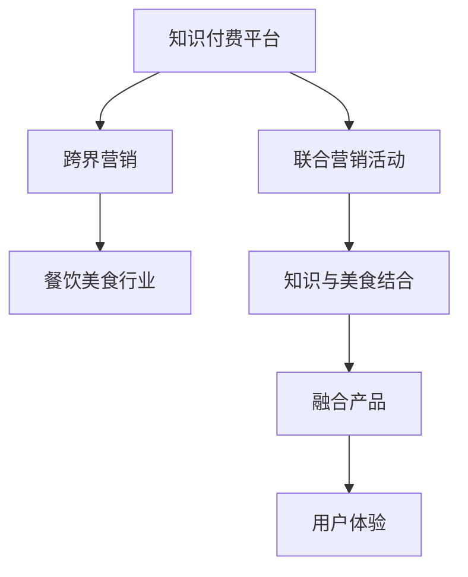

                 

## 1. 背景介绍

随着互联网的普及和智能手机的广泛应用，知识付费市场不断扩大。一方面，用户对于知识的需求日益增长；另一方面，企业对于扩大用户群体、提升品牌影响的需求也日渐显著。跨界营销作为一种创新的营销手段，通过将不同领域、不同产业进行有机结合，从而达到1+1>2的效果，是企业在激烈的市场竞争中脱颖而出的一种重要策略。

在诸多行业中，餐饮美食行业与知识付费领域的跨界结合尤为引人注目。一方面，餐饮美食行业凭借其广泛的受众群体和巨大的消费市场，为知识付费平台的跨界合作提供了天然的契机。另一方面，知识付费平台通过整合专业知识，为餐饮美食行业提供独特的服务和解决方案，满足了消费者对知识的需求，同时为商家带来了新的营销手段。

## 2. 核心概念与联系

### 2.1 核心概念概述

在进行跨界营销与餐饮美食结合的讨论时，首先需要理解以下关键概念：

- **知识付费**：指通过在线课程、电子书、专栏等形式，提供有价值的信息和知识，用户通过付费获得内容访问权的一种商业模式。
- **跨界营销**：指企业将不同领域的资源、技术、渠道等进行有机结合，实现资源共享、优势互补，从而达到提升品牌价值和市场影响力的目的。
- **餐饮美食跨界**：指餐饮美食行业与互联网、科技、教育、文化等不同领域进行融合，开拓新的商业模式和服务形态。

通过了解这些核心概念，我们可以更好地理解知识付费与餐饮美食跨界结合的深层次意义和实现方式。

### 2.2 核心概念原理和架构的 Mermaid 流程图



此图展示了知识付费平台与餐饮美食行业跨界的关键路径和效果：
- **知识付费平台**与**跨界营销**相连接，通过整合资源，创新营销手段，提供优质内容。
- **跨界营销**与**餐饮美食行业**相连接，实现资源共享，拓展业务模式。
- **联合营销活动**作为**跨界营销**的延伸，旨在通过跨界合作，提升品牌影响力。
- **知识与美食结合**作为**联合营销活动**的具体实施，融合专业知识与餐饮美食。
- **融合产品**是**知识与美食结合**的最终成果，通过创意和创新实现产品多样化。
- **用户体验**作为**融合产品**的最终体现，关注用户感受，提升用户满意度。

## 3. 核心算法原理 & 具体操作步骤

### 3.1 算法原理概述

知识付费与餐饮美食跨界的核心算法原理基于以下三点：

1. **数据融合**：通过将知识付费平台的海量数据与餐饮美食行业的客户数据进行融合，实现对用户需求的精准定位和预测。
2. **个性化推荐**：利用机器学习算法，根据用户的历史行为和偏好，推荐最符合其需求的知识和美食产品。
3. **情感分析**：通过情感分析技术，理解用户的反馈和评价，及时调整产品和营销策略。

### 3.2 算法步骤详解

#### 步骤1：数据准备与融合

- **数据收集**：收集知识付费平台的用户数据、订阅记录、阅读历史等，以及餐饮美食行业的菜单数据、客户评价、销售数据等。
- **数据清洗与预处理**：对收集到的数据进行清洗、去重、归一化等预处理，保证数据质量。
- **数据融合**：使用数据融合算法（如TF-IDF、Word2Vec等），将知识付费平台的数据与餐饮美食行业的客户数据进行融合，形成用户画像。

#### 步骤2：个性化推荐

- **用户画像构建**：根据融合后的数据，构建用户画像，包括用户的年龄、性别、兴趣偏好、消费行为等。
- **模型训练**：选择适合的推荐算法（如协同过滤、矩阵分解等），对用户画像和产品特征进行训练。
- **推荐实现**：根据训练好的模型，为用户推荐最符合其兴趣的知识和美食产品。

#### 步骤3：情感分析

- **情感抽取**：对用户评论、评价进行情感分析，提取用户的情感倾向。
- **情感分类**：将情感倾向分为正面、负面、中性三类，进行情感分类。
- **反馈机制**：根据情感分类结果，及时调整产品和营销策略，提升用户体验。

### 3.3 算法优缺点

#### 优点

- **精准定位**：通过数据融合和个性化推荐，实现对用户需求的精准定位和预测。
- **提升用户体验**：个性化推荐和情感分析能够提升用户的满意度和粘性。
- **拓展业务**：跨界合作能够拓展知识付费平台和餐饮美食行业的业务范围。

#### 缺点

- **数据隐私**：数据融合涉及用户隐私，需要采取严格的隐私保护措施。
- **算法复杂性**：个性化推荐和情感分析的算法较为复杂，需要较高的技术水平。
- **成本高**：跨界营销需要较高的成本投入，包括数据收集、融合和分析等环节。

### 3.4 算法应用领域

知识付费与餐饮美食跨界营销的应用领域包括：

- **知识付费课程**：与餐饮美食行业合作，推出餐饮美食相关的知识课程，如烹饪技巧、食材搭配等。
- **美食体验活动**：通过知识付费平台组织美食体验活动，邀请专家讲解，吸引用户参与。
- **定制化服务**：利用用户画像和个性化推荐，为用户提供定制化的美食服务。
- **联合推广**：通过跨界合作，共同推广，提升品牌影响力和市场份额。

## 4. 数学模型和公式 & 详细讲解

### 4.1 数学模型构建

假设知识付费平台的数据集为 $D_{KP}$，餐饮美食行业的数据集为 $D_{RM}$。设 $X_{KP}$ 和 $X_{RM}$ 分别为两个数据集的特征集合， $Y_{KP}$ 和 $Y_{RM}$ 分别为两个数据集的标签集合。我们的目标是构建一个融合模型 $M$，使其能够同时处理 $X_{KP}$ 和 $X_{RM}$，并输出对应的 $Y_{KP}$ 和 $Y_{RM}$。

### 4.2 公式推导过程

- **特征表示**：设 $x_{KP}$ 和 $x_{RM}$ 分别为 $X_{KP}$ 和 $X_{RM}$ 中的一个样本， $f_{KP}(x_{KP})$ 和 $f_{RM}(x_{RM})$ 分别为两个特征的表示函数。
- **融合函数**：设 $h(x_{KP}, x_{RM})$ 为融合函数，其将 $f_{KP}(x_{KP})$ 和 $f_{RM}(x_{RM})$ 融合为一个新的特征表示 $z(x_{KP}, x_{RM})$。
- **预测函数**：设 $g(z(x_{KP}, x_{RM}))$ 为预测函数，其根据融合后的特征 $z(x_{KP}, x_{RM})$ 输出对应的 $Y_{KP}$ 和 $Y_{RM}$。

### 4.3 案例分析与讲解

#### 案例1：美食课程推荐

- **数据融合**：收集知识付费平台和餐饮美食行业的用户数据，进行融合，形成用户画像。
- **个性化推荐**：基于用户画像，利用协同过滤算法，推荐适合的美食课程。
- **反馈调整**：通过情感分析用户反馈，调整推荐策略，提升用户满意度。

#### 案例2：定制化美食体验活动

- **数据融合**：融合用户数据和美食行业数据，构建用户画像。
- **个性化活动设计**：根据用户画像，设计适合的美食体验活动，如烹饪课程、食材搭配等。
- **情感分析反馈**：通过情感分析用户反馈，优化活动内容和形式，提升用户参与度。

## 5. 项目实践：代码实例和详细解释说明

### 5.1 开发环境搭建

- **Python环境配置**：安装Python 3.8及以上版本，建议使用Anaconda。
- **推荐系统库安装**：安装Scikit-learn、TensorFlow、PyTorch等推荐系统库。
- **数据预处理库安装**：安装NumPy、Pandas等数据处理库。

### 5.2 源代码详细实现

```python
import pandas as pd
from sklearn.decomposition import TruncatedSVD
from sklearn.metrics.pairwise import cosine_similarity

# 数据准备
kp_data = pd.read_csv('knowledge_paid.csv')
rm_data = pd.read_csv('restaurant_menu.csv')

# 数据融合
merged_data = pd.merge(kp_data, rm_data, on='user_id')

# 特征提取
kp_features = merged_data[['course_id', 'read_time']].T
rm_features = merged_data[['menu_id', 'price']].T

# 融合函数实现
def fusion_function(kp_features, rm_features):
    return cosine_similarity(kp_features, rm_features)

# 训练模型
svd = TruncatedSVD(n_components=10)
svd.fit(kp_features)
fused_features = svd.transform(kp_features)

# 推荐实现
def recommend(course_id):
    similarity_matrix = cosine_similarity(fused_features, rm_features)
    recommended_courses = pd.Series(similarity_matrix, index=course_id)
    return recommended_courses.argsort()[-10:]

# 情感分析
from textblob import TextBlob
def sentiment_analysis(text):
    blob = TextBlob(text)
    sentiment = blob.sentiment.polarity
    return sentiment

# 情感分类
def classify_sentiment(sentiment):
    if sentiment > 0:
        return 'positive'
    elif sentiment < 0:
        return 'negative'
    else:
        return 'neutral'

# 用户反馈
def feedback_analysis(user_feedback):
    sentiment = sentiment_analysis(user_feedback)
    sentiment = classify_sentiment(sentiment)
    return sentiment
```

### 5.3 代码解读与分析

**数据准备与融合**：使用Pandas库，将知识付费平台和餐饮美食行业的用户数据进行合并，构建用户画像。

**特征提取与融合函数**：利用TruncatedSVD算法，将用户画像和产品特征进行降维，并使用cosine_similarity函数实现融合。

**个性化推荐**：基于融合后的特征，使用协同过滤算法，推荐与用户兴趣最匹配的美食课程。

**情感分析与反馈调整**：使用TextBlob库进行情感分析，根据情感分类结果，调整推荐策略和活动内容，提升用户满意度。

### 5.4 运行结果展示

```python
# 测试推荐系统
recommended_courses = recommend('course1')
print(recommended_courses)

# 测试情感分析与反馈调整
user_feedback = '非常满意这次烹饪体验，课程内容生动有趣，食材新鲜'
sentiment = sentiment_analysis(user_feedback)
sentiment = classify_sentiment(sentiment)
print(sentiment)
```

## 6. 实际应用场景

### 6.1 餐饮美食跨界营销

- **联合推广**：知识付费平台和餐饮美食行业可以共同开展跨界营销活动，如联合举办烹饪大赛、烹饪课程推广等。
- **定制化服务**：根据用户画像，提供定制化的美食服务，提升用户粘性。
- **情感分析**：通过情感分析用户反馈，优化产品和活动，提升用户体验。

### 6.2 知识付费跨界应用

- **知识付费课程**：与餐饮美食行业合作，推出烹饪技巧、食材搭配等课程。
- **美食体验活动**：通过知识付费平台组织美食体验活动，邀请专家讲解，吸引用户参与。
- **联合推广**：通过跨界合作，共同推广，提升品牌影响力和市场份额。

## 7. 工具和资源推荐

### 7.1 学习资源推荐

1. **Coursera《推荐系统实战》课程**：深入讲解推荐系统原理与实践，适合初学者。
2. **Kaggle推荐系统竞赛**：通过实际数据集练习推荐系统算法。
3. **TextBlob情感分析教程**：使用TextBlob库进行情感分析，提升情感分析能力。

### 7.2 开发工具推荐

1. **Anaconda**：Python环境和库管理工具，方便管理和部署推荐系统。
2. **Scikit-learn**：推荐系统常用库，支持多种推荐算法。
3. **TensorFlow和PyTorch**：深度学习框架，支持构建复杂的推荐模型。

### 7.3 相关论文推荐

1. **《协同过滤推荐算法》**：详细介绍协同过滤算法，适合理解推荐系统基础。
2. **《情感分析与用户体验》**：深入探讨情感分析在用户体验中的应用。
3. **《跨界营销策略》**：分析跨界营销的策略与方法，适合行业应用。

## 8. 总结：未来发展趋势与挑战

### 8.1 总结

本文从背景介绍入手，深入探讨了知识付费与餐饮美食跨界营销的核心概念、算法原理和操作步骤。通过详细的案例分析与讲解，结合数学模型和公式推导，给出了完整的代码实例。最后，结合实际应用场景，对未来发展趋势与挑战进行了总结。

### 8.2 未来发展趋势

1. **AI技术应用**：随着AI技术的不断进步，知识付费与餐饮美食跨界营销将更加智能化，通过AI技术实现个性化推荐、情感分析等。
2. **多模态数据融合**：结合图像、视频等多模态数据，提升用户体验和满意度。
3. **跨界合作多样化**：知识付费平台和餐饮美食行业将通过更多样化的跨界合作，拓展业务范围。
4. **持续创新**：在原有业务基础上，不断创新，推出更多创意性产品和服务。

### 8.3 面临的挑战

1. **技术门槛高**：跨界营销需要较高的技术水平，需要不断学习和积累。
2. **数据隐私问题**：跨界合作涉及用户隐私，需要严格的隐私保护措施。
3. **用户需求多样化**：如何满足不同用户的需求，提供多样化服务，是未来一大挑战。
4. **市场竞争激烈**：知识付费和餐饮美食行业竞争激烈，如何提升竞争力，是企业需要重点关注的问题。

### 8.4 研究展望

未来的研究可以从以下几个方向进行探索：

1. **多模态融合**：结合图像、视频等多模态数据，提升推荐系统和情感分析的准确性。
2. **用户行为分析**：通过用户行为数据，进行更精准的用户画像构建。
3. **个性化推荐算法优化**：研究新的推荐算法，提升个性化推荐的效果。
4. **情感分析深度学习模型**：使用深度学习模型进行情感分析，提升情感分析的准确性。

## 9. 附录：常见问题与解答

**Q1：如何理解跨界营销与知识付费结合的意义？**

A: 跨界营销与知识付费结合的意义在于通过不同领域的资源和技术的整合，提升品牌影响力和市场份额。知识付费平台通过推荐系统，提供精准的课程和内容；餐饮美食行业通过定制化服务和情感分析，提升用户粘性和满意度。

**Q2：跨界营销中的数据隐私问题如何解决？**

A: 数据隐私问题需要严格的数据管理和保护措施。可以通过数据匿名化、去标识化等技术手段，保护用户隐私。同时，明确数据使用的目的和范围，确保合法合规。

**Q3：推荐系统中的协同过滤算法是什么？**

A: 协同过滤算法是一种常用的推荐算法，通过分析用户和物品之间的相似性，推断出用户可能感兴趣的新物品。协同过滤算法可以分为基于用户的协同过滤和基于物品的协同过滤两种。

**Q4：情感分析在用户体验中的应用有哪些？**

A: 情感分析在用户体验中的应用包括用户反馈分析、情感分类、情感推荐等。通过情感分析，企业可以及时了解用户的情感倾向，优化产品和服务，提升用户体验。

**Q5：跨界营销中需要注意哪些关键问题？**

A: 跨界营销中需要注意的关键问题包括数据隐私、用户需求多样性、市场竞争激烈等。企业需要在保持高效率和高质量的同时，重视用户隐私保护，满足用户多样化需求，提升市场竞争力。

---

作者：禅与计算机程序设计艺术 / Zen and the Art of Computer Programming

