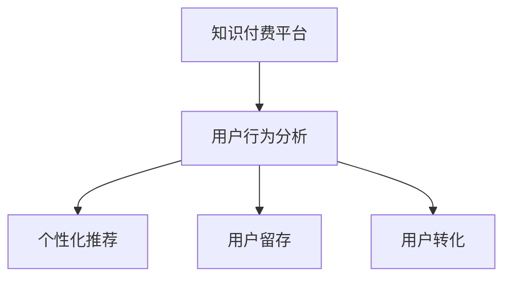

                 

# 知识付费平台的用户行为分析与应用

> 关键词：知识付费平台,用户行为分析,应用场景,个性化推荐,用户留存,用户转化

## 1. 背景介绍

### 1.1 问题由来

随着互联网和移动互联网的发展，知识付费市场逐渐兴起，涌现出如得到、知乎live、喜马拉雅FM等众多知识付费平台。这些平台不仅提供了丰富的课程和讲座资源，还通过订阅、单次付费、免费试用等多样化模式吸引用户，满足不同用户的学习需求。

然而，知识付费平台面临着一个重要问题：如何精准定位用户需求，提升用户体验和满意度，实现平台收入最大化？用户行为分析作为一种有效的用户画像构建手段，能够帮助知识付费平台更好地理解用户需求，优化内容推荐策略，提升用户留存率和转化率，从而实现商业目标。

### 1.2 问题核心关键点

知识付费平台用户行为分析的核心关键点主要包括：

- 用户行为数据收集：收集用户在平台上的行为数据，如浏览课程、购买课程、听课进度、互动评论等。
- 用户画像构建：利用机器学习技术，对用户行为数据进行分析建模，构建用户画像，了解用户兴趣和需求。
- 个性化推荐：根据用户画像和历史行为数据，为用户推荐最适合的课程内容，提升用户体验和满意度。
- 用户留存与转化：通过精准推荐和个性化服务，提升用户粘性和付费意愿，实现平台收入增长。

## 2. 核心概念与联系

### 2.1 核心概念概述

为更好地理解知识付费平台用户行为分析方法，本节将介绍几个密切相关的核心概念：

- 知识付费平台(Knowledge PaaS Platform)：提供知识内容的订阅、购买和分发服务，帮助用户高效获取和利用知识。
- 用户行为分析(User Behavior Analysis)：通过收集和分析用户行为数据，了解用户需求和行为模式，构建用户画像，从而优化用户体验和平台策略。
- 个性化推荐(Personalized Recommendation)：利用用户画像和行为数据，为用户推荐最符合其兴趣和需求的课程内容，提升用户满意度。
- 用户留存(User Retention)：通过精准推荐和优质服务，吸引并留住用户，减少用户流失率。
- 用户转化(User Conversion)：通过个性化营销和精准推荐，将潜在用户转化为付费用户，实现平台收入增长。

这些核心概念之间的逻辑关系可以通过以下Mermaid流程图来展示：



这个流程图展示了这个体系的核心概念及其之间的关系：

1. 知识付费平台通过用户行为分析，了解用户需求。
2. 用户画像和行为数据被用于个性化推荐，提升用户满意度和留存率。
3. 个性化推荐有助于用户转化，实现平台收入增长。

## 3. 核心算法原理 & 具体操作步骤
### 3.1 算法原理概述

知识付费平台用户行为分析的本质是通过机器学习技术，对用户行为数据进行建模和分析，构建用户画像。个性化推荐和用户留存、转化优化都是基于用户画像的进一步应用。

### 3.2 算法步骤详解

基于机器学习的用户行为分析大致可以分为以下步骤：

**Step 1: 数据收集与清洗**
- 从知识付费平台的用户行为数据中收集用户浏览、购买、听课等行为数据。
- 对数据进行去重、去噪、缺失值处理等清洗操作，保证数据质量。

**Step 2: 特征工程**
- 根据业务需求，选择或构造出能够反映用户兴趣和行为特征的关键特征。
- 常见的用户行为特征包括浏览时长、浏览课程数、购买课程数、互动评论数等。
- 通过特征选择和特征变换，构建出用于机器学习建模的高质量特征集。

**Step 3: 用户画像构建**
- 选择合适的机器学习模型，如决策树、随机森林、K近邻、协同过滤、神经网络等，对用户行为数据进行建模。
- 通过模型训练，得到用户画像，即对用户行为和兴趣的预测和分类。
- 常见的用户画像模型包括用户兴趣聚类、用户行为预测、用户标签分类等。

**Step 4: 个性化推荐**
- 将用户画像和历史行为数据输入推荐算法，如协同过滤、基于内容的推荐、深度学习推荐等。
- 根据推荐算法输出，为用户生成个性化课程推荐列表。
- 常见的推荐算法包括基于用户的协同过滤、基于物品的协同过滤、矩阵分解等。

**Step 5: 用户留存与转化优化**
- 利用用户画像和推荐结果，对用户的留存和转化行为进行分析。
- 通过A/B测试和行为数据分析，优化推荐策略和平台运营策略。
- 常见的优化手段包括增量更新、在线学习、多臂老虎机等。

### 3.3 算法优缺点

基于机器学习的用户行为分析方法具有以下优点：

1. 精准度较高：通过数据分析和建模，可以较为准确地预测用户行为和兴趣。
2. 实时性较好：可以通过在线学习等技术，实时更新用户画像和推荐结果。
3. 可扩展性强：模型可以根据需要动态扩展，适应大规模数据处理。

同时，该方法也存在一些局限性：

1. 数据质量要求高：数据收集和清洗需要精细化操作，保证数据质量和完整性。
2. 特征工程复杂：需要选择合适的特征和特征组合方式，构造高质量特征集。
3. 模型复杂度高：可能需要构建复杂的机器学习模型，增加计算复杂度。
4. 实时性能要求高：需要高效的数据处理和模型计算，确保推荐结果实时性。

尽管存在这些局限性，基于机器学习的用户行为分析方法仍是目前最广泛应用和效果显著的方案，能够帮助知识付费平台优化用户体验和提升商业价值。

### 3.4 算法应用领域

基于用户行为分析的机器学习模型，在知识付费平台中的应用非常广泛，具体包括：

- 课程推荐：根据用户行为数据，为每位用户推荐最相关的课程。
- 用户画像：对用户进行分群和标签分类，了解用户兴趣和行为模式。
- 用户流失预测：利用历史数据，预测用户流失概率，提前采取挽留措施。
- 个性化营销：通过用户画像和行为数据，设计有针对性的营销活动，提升用户转化率。
- 用户满意度评估：通过用户反馈和行为数据，评估用户对课程和平台的满意度，进行持续改进。

## 4. 数学模型和公式 & 详细讲解 & 举例说明

### 4.1 数学模型构建

基于机器学习的用户行为分析通常采用协同过滤和深度学习两种模型进行建模。协同过滤模型通过用户-物品交互矩阵进行推荐，深度学习模型通过神经网络对用户行为数据进行特征提取和分类。

### 4.2 公式推导过程

以协同过滤模型为例，用户行为矩阵$U \times I$表示$U$个用户与$I$个物品之间的交互行为，具体形式如下：

$$
U \times I = \begin{bmatrix}
u_1 \\
u_2 \\
\vdots \\
u_U \\
\end{bmatrix}
\begin{bmatrix}
i_1 & i_2 & \cdots & i_I \\
0 & r_{u_1,i_1} & \cdots & 0 \\
0 & r_{u_1,i_2} & \cdots & 0 \\
\vdots & \vdots & \ddots & \vdots \\
0 & r_{u_U,i_I} & \cdots & 0 \\
\end{bmatrix}
$$

其中$r_{u_i,j}$表示用户$u_i$对物品$j$的评分，可以是购买次数、浏览次数、互动评论数等。

协同过滤模型的推荐公式为：

$$
\hat{r}_{u_i,i_j} = \frac{\sum_{i_k \in N(u_i)} r_{u_i,i_k} r_{u_k,i_j}}{\sqrt{\sum_{i_k \in N(u_i)} r_{u_i,i_k}^2} \sqrt{\sum_{u_l \in N(i_j)} r_{u_l,i_j}^2}}
$$

其中$N(u_i)$表示用户$u_i$的邻居集合，$N(i_j)$表示物品$i_j$的邻居集合。$\hat{r}_{u_i,i_j}$表示用户$u_i$对物品$i_j$的预测评分，$r_{u_k,i_j}$表示邻居用户$u_k$对物品$i_j$的评分，$\sqrt{...}$表示归一化处理。

### 4.3 案例分析与讲解

以某知识付费平台的推荐系统为例，通过用户行为数据构建协同过滤模型：

- 收集用户浏览课程、购买课程、听课进度等行为数据。
- 构建用户-课程行为矩阵$U \times C$，其中$C$表示课程集合。
- 使用余弦相似度计算用户$u_i$和用户$u_j$的相似度，筛选出与用户$u_i$最相似的$k$个邻居用户。
- 根据邻居用户对课程的评分，预测用户$u_i$对课程的评分，生成推荐列表。

例如，某用户$u_i$的邻居用户$u_j$对其最推荐的课程$j_1$评分$0.8$，用户$u_i$对$j_1$的预测评分为$0.6$，因此课程$j_1$被推荐给用户$u_i$。

## 5. 项目实践：代码实例和详细解释说明
### 5.1 开发环境搭建

在进行推荐系统开发前，我们需要准备好开发环境。以下是使用Python进行PyTorch开发的环境配置流程：

1. 安装Anaconda：从官网下载并安装Anaconda，用于创建独立的Python环境。

2. 创建并激活虚拟环境：
```bash
conda create -n pytorch-env python=3.8 
conda activate pytorch-env
```

3. 安装PyTorch：根据CUDA版本，从官网获取对应的安装命令。例如：
```bash
conda install pytorch torchvision torchaudio cudatoolkit=11.1 -c pytorch -c conda-forge
```

4. 安装相关库：
```bash
pip install pandas numpy scikit-learn sklearn
```

5. 安装PyTorch库：
```bash
pip install torch torchtext transformers
```

完成上述步骤后，即可在`pytorch-env`环境中开始推荐系统开发。

### 5.2 源代码详细实现

下面我们以协同过滤推荐系统为例，给出使用PyTorch和Transformers库的推荐系统代码实现。

首先，定义用户行为数据类：

```python
import pandas as pd
from torch.utils.data import Dataset
from sklearn.preprocessing import StandardScaler

class UserBehaviorData(Dataset):
    def __init__(self, data_path):
        self.data = pd.read_csv(data_path)
        self.scaler = StandardScaler()
        self.user_behaviors = self.data[['user_id', 'course_id', 'interaction_time']].copy()
        self.item_behaviors = self.data[['course_id', 'user_id', 'interaction_time']].copy()
        
        # 特征标准化
        self.user_behaviors = self.scaler.fit_transform(self.user_behaviors)
        self.item_behaviors = self.scaler.fit_transform(self.item_behaviors)
        
    def __len__(self):
        return len(self.user_behaviors)
    
    def __getitem__(self, item):
        user_id, course_id = self.data.iloc[item]['user_id'], self.data.iloc[item]['course_id']
        user_behavior = self.user_behaviors[item]
        item_behavior = self.item_behaviors[item]
        return user_id, course_id, user_behavior, item_behavior
```

然后，定义协同过滤推荐模型类：

```python
import torch
import torch.nn as nn
import torch.nn.functional as F
from torch import nn

class CollaborativeFiltering(nn.Module):
    def __init__(self, n_users, n_items, n_factors, learning_rate=0.01, device='cpu'):
        super(CollaborativeFiltering, self).__init__()
        self.n_users = n_users
        self.n_items = n_items
        self.n_factors = n_factors
        
        self.user_factors = nn.Embedding(n_users, n_factors).to(device)
        self.item_factors = nn.Embedding(n_items, n_factors).to(device)
        self.bias = nn.Parameter(torch.randn(n_items, 1).to(device))
        self.learning_rate = learning_rate
        
    def forward(self, user_id, course_id):
        user_factors = self.user_factors(user_id)
        item_factors = self.item_factors(course_id)
        bias = self.bias[course_id]
        
        prediction = torch.matmul(user_factors, item_factors.T) + bias
        prediction = F.softmax(prediction, dim=-1)
        return prediction
    
    def train(self, data_loader, n_epochs):
        optimizer = torch.optim.Adam(self.parameters(), lr=self.learning_rate)
        
        for epoch in range(n_epochs):
            for user_id, course_id, user_behavior, item_behavior in data_loader:
                optimizer.zero_grad()
                prediction = self.forward(user_id, course_id)
                loss = F.binary_cross_entropy(prediction, item_behavior)
                loss.backward()
                optimizer.step()
                
        return self
    
    def predict(self, user_id, course_id):
        prediction = self.forward(user_id, course_id)
        return prediction.argmax(dim=-1)
```

最后，定义数据加载和模型训练函数：

```python
from torch.utils.data import DataLoader
from tqdm import tqdm

def train_model(model, data_loader, n_epochs, device):
    model.train(device)
    optimizer = torch.optim.Adam(model.parameters(), lr=0.001)
    for epoch in range(n_epochs):
        for user_id, course_id, user_behavior, item_behavior in tqdm(data_loader, desc='Epoch %d' % epoch):
            optimizer.zero_grad()
            prediction = model.forward(user_id, course_id)
            loss = F.binary_cross_entropy(prediction, item_behavior)
            loss.backward()
            optimizer.step()
    return model
```

以上就是使用PyTorch和Transformers库构建协同过滤推荐系统的完整代码实现。可以看到，利用PyTorch和Transformers库，我们可以用相对简洁的代码完成协同过滤推荐系统的开发。

### 5.3 代码解读与分析

让我们再详细解读一下关键代码的实现细节：

**UserBehaviorData类**：
- `__init__`方法：初始化数据集，并进行特征标准化处理。
- `__len__`方法：返回数据集的样本数量。
- `__getitem__`方法：对单个样本进行处理，返回用户ID、课程ID、用户行为向量、物品行为向量。

**CollaborativeFiltering类**：
- `__init__`方法：初始化协同过滤模型的用户项因素、物品项因素和偏置项，并设置超参数。
- `forward`方法：前向传播计算预测值。
- `train`方法：训练模型，采用随机梯度下降优化。
- `predict`方法：使用训练好的模型进行预测。

**train_model函数**：
- 定义训练迭代过程，通过Adam优化器更新模型参数。
- 每个epoch内，在数据加载器上遍历所有样本，计算预测值与真实值的交叉熵损失，并进行反向传播和参数更新。

可以看到，代码的实现较为简洁高效，充分利用了PyTorch和Transformers库的强大封装功能，可以方便地扩展和优化。

## 6. 实际应用场景

### 6.1 智能推荐系统

智能推荐系统是知识付费平台的核心功能之一，通过精准的推荐算法，为用户提供个性化的课程内容。用户可以在浏览课程时，系统根据其行为数据进行实时推荐，提升用户体验和满意度。

例如，某用户在平台中浏览了多个科技课程，系统可以通过协同过滤算法，推荐相关领域的其他科技课程，甚至推荐该用户的其他课程内容。

### 6.2 用户流失预测

知识付费平台希望用户能够长期留存，平台可以定期对用户行为数据进行分析，预测用户流失概率。通过分析用户的行为特征和流失历史，系统可以提前采取措施，如发送优惠券、推送相关课程等，降低用户流失率。

例如，某用户在过去一个月内浏览和互动明显减少，系统会预测其可能流失，提前进行挽留操作。

### 6.3 个性化营销

知识付费平台可以通过个性化营销活动，提升用户转化率和平台收入。系统可以根据用户画像和行为数据，设计有针对性的营销方案，如通过邮件、短信等方式，向用户推荐新课程或优惠活动，提升用户付费意愿。

例如，某用户主要关注技术领域，系统会推送相关领域的新课程和优惠活动，增加用户购买意愿。

## 7. 工具和资源推荐

### 7.1 学习资源推荐

为了帮助开发者系统掌握推荐系统理论基础和实践技巧，这里推荐一些优质的学习资源：

1. 《推荐系统实战》：阮行止老师的经典著作，详细介绍了推荐系统的发展历程和各类推荐算法。

2. 《机器学习实战》：Wes McKinney的实用指南，涵盖多种机器学习算法和工具，适合快速上手实践。

3. 《深度学习》：Ian Goodfellow的经典教材，全面介绍了深度学习的基础理论和应用。

4. CS224W《深度学习与自然语言处理》课程：斯坦福大学开设的推荐系统课程，有Lecture视频和配套作业，适合深入学习。

5. 《推荐系统》课程：Coursera上的推荐系统课程，由UC Berkeley的教授讲授，内容全面、深入。

通过对这些资源的学习实践，相信你一定能够快速掌握推荐系统的精髓，并用于解决实际的业务问题。

### 7.2 开发工具推荐

高效的开发离不开优秀的工具支持。以下是几款用于推荐系统开发的常用工具：

1. PyTorch：基于Python的开源深度学习框架，灵活易用，适合快速迭代研究。

2. TensorFlow：由Google主导开发的开源深度学习框架，生产部署方便，适合大规模工程应用。

3. TensorBoard：TensorFlow配套的可视化工具，可以实时监测模型训练状态，提供丰富的图表呈现方式。

4. H2O：Apache的机器学习平台，提供简单易用的API，支持多种机器学习算法。

5. Scikit-learn：Python的机器学习库，提供了丰富的算法和工具，适合快速原型开发。

6. Weights & Biases：模型训练的实验跟踪工具，可以记录和可视化模型训练过程中的各项指标，方便对比和调优。

合理利用这些工具，可以显著提升推荐系统开发效率，加快创新迭代的步伐。

### 7.3 相关论文推荐

推荐系统的发展源于学界的持续研究。以下是几篇奠基性的相关论文，推荐阅读：

1. 《Amazon: Recommenders at Scale》：介绍了亚马逊推荐系统的架构和算法，展示了实际应用中的高效推荐。

2. 《BPR: Bayesian Personalized Ranking from Log-by-Log Data》：提出基于隐式反馈的推荐算法，显著提升了推荐效果。

3. 《Factorization Machines》：提出基于矩阵分解的推荐算法，适用于大规模稀疏数据。

4. 《Deep Recurrent Neural Networks for Sequences with Continuous and Discrete Outputs》：介绍基于LSTM的序列推荐算法，适用于时序数据。

5. 《Neural Networks for Click Prediction》：提出基于深度神经网络的点击预测算法，取得了优异的效果。

这些论文代表了大规模推荐系统的发展脉络，通过学习这些前沿成果，可以帮助研究者把握学科前进方向，激发更多的创新灵感。

## 8. 总结：未来发展趋势与挑战

### 8.1 总结

本文对基于机器学习的知识付费平台用户行为分析方法进行了全面系统的介绍。首先阐述了知识付费平台用户行为分析的研究背景和意义，明确了用户画像构建、个性化推荐、用户留存和转化优化等关键环节的作用。其次，从原理到实践，详细讲解了推荐算法的数学模型和具体实现，给出了推荐系统开发的完整代码实例。同时，本文还广泛探讨了推荐系统在知识付费平台中的应用前景，展示了其广阔的应用前景。

通过本文的系统梳理，可以看到，基于机器学习的推荐系统正在成为知识付费平台的重要支撑，极大地提升了用户体验和平台收入。未来，伴随推荐算法的持续演进和模型技术的深入发展，相信知识付费平台将在更广阔的领域获得突破，为社会教育和文化产业带来更多积极影响。

### 8.2 未来发展趋势

展望未来，推荐系统将呈现以下几个发展趋势：

1. 个性化推荐更精准：随着用户画像和行为数据的不断丰富，推荐算法将更加精准，能够更好地预测用户需求和兴趣。

2. 多模态数据融合：推荐系统将更多地融合多模态数据，如视频、音频、图片等，提升推荐质量和用户满意度。

3. 实时性要求更高：推荐系统需要实时处理和推荐数据，支持快速响应用户需求，提升用户体验。

4. 自动化推荐系统：推荐系统将更多地依赖自动化算法和机器学习，减少人工干预和优化。

5. 深度学习技术更广泛应用：深度神经网络、强化学习等技术将更多地应用于推荐系统，提升推荐效果。

以上趋势凸显了推荐系统的广阔前景。这些方向的探索发展，必将进一步提升知识付费平台的用户体验和平台收入，为社会教育和信息产业带来更多创新和突破。

### 8.3 面临的挑战

尽管推荐系统已经取得了瞩目成就，但在迈向更加智能化、普适化应用的过程中，它仍面临诸多挑战：

1. 数据稀疏性问题：推荐系统通常面临数据稀疏性问题，用户行为数据和物品特征数据往往不足，影响推荐效果。

2. 冷启动问题：新用户或新物品缺乏足够的历史数据，推荐系统难以准确预测其兴趣和行为。

3. 模型复杂性：深度学习推荐系统往往需要构建复杂的神经网络模型，计算资源消耗大。

4. 推荐结果多样性：推荐系统需要平衡推荐结果的多样性和个性化，避免过度同质化。

5. 用户隐私保护：推荐系统需要保护用户隐私，避免数据泄露和滥用。

6. 算法公平性：推荐系统需要避免算法偏见，确保推荐结果的公平性和公正性。

这些挑战亟需研究者深入探索，通过算法优化、数据扩充、模型简化等手段，不断提升推荐系统的性能和用户体验。

### 8.4 研究展望

面向未来，推荐系统的研究需要在以下几个方面寻求新的突破：

1. 探索更高效的数据获取和处理方式：通过社交网络、搜索行为等数据来源，补充用户行为数据，缓解数据稀疏性问题。

2. 研究多模态数据融合和跨领域推荐：通过融合多模态数据，提升推荐系统的泛化能力和适应性。

3. 开发高效的推荐算法：通过深度学习、强化学习等技术，提升推荐算法的计算效率和推荐效果。

4. 提升推荐系统的公平性和透明性：通过引入公平性约束和可解释性方法，提升推荐系统的公平性和透明性。

5. 融合跨领域推荐和个性化推荐：通过融合跨领域推荐和个性化推荐，实现更加全面和精准的推荐。

这些研究方向将推动推荐系统向更高层次发展，为知识付费平台和其他智能推荐应用带来更多创新和突破。相信通过不断探索和优化，推荐系统必将进一步提升用户体验和平台收入，为社会教育和信息产业带来更多积极影响。

## 9. 附录：常见问题与解答

**Q1：推荐系统如何处理数据稀疏性问题？**

A: 推荐系统通常面临数据稀疏性问题，即用户行为数据和物品特征数据往往不足。为了缓解这一问题，推荐系统通常采用以下方法：

1. 矩阵分解：通过矩阵分解技术，如奇异值分解(SVD)、矩阵分解因子化(MF)等，将稀疏矩阵分解为低秩矩阵，减少数据稀疏性影响。

2. 模型融合：通过融合多个推荐模型，如协同过滤、基于内容的推荐、深度学习等，提升推荐效果。

3. 数据扩充：通过社交网络、搜索行为等数据来源，补充用户行为数据，缓解数据稀疏性问题。

4. 冷启动策略：对于新用户或新物品，采用基于内容的推荐、协同过滤等方法，根据其初始特征进行推荐。

**Q2：推荐系统如何处理冷启动问题？**

A: 冷启动问题是推荐系统面临的一个重要问题，即新用户或新物品缺乏足够的历史数据，推荐系统难以准确预测其兴趣和行为。为了解决这一问题，推荐系统通常采用以下方法：

1. 基于内容的推荐：根据物品的特征信息，如标签、分类等，为用户推荐相关物品。

2. 协同过滤：通过分析已有用户的相似性，推荐其他用户喜欢的物品。

3. 模型初始化：通过随机初始化、KNN等方法，为物品和用户分配初始评分，减少冷启动问题影响。

4. 用户反馈收集：通过用户主动反馈和在线推荐，收集更多数据，优化推荐效果。

**Q3：推荐系统如何平衡推荐结果的多样性和个性化？**

A: 推荐系统需要平衡推荐结果的多样性和个性化，避免过度同质化。为了实现这一目标，推荐系统通常采用以下方法：

1. 模型融合：通过融合多个推荐模型，如协同过滤、基于内容的推荐、深度学习等，提升推荐效果的多样性。

2. 多臂老虎机算法：通过多臂老虎机算法，优化推荐结果的多样性和个性化，避免过度同质化。

3. 阈值调节：通过调节推荐阈值，控制推荐结果的多样性和个性化，避免过度同质化。

4. 推荐多样性算法：通过推荐多样性算法，如潜在物品多样性、用户-物品多样性等，提升推荐结果的多样性。

这些方法能够有效平衡推荐结果的多样性和个性化，提升用户体验和满意度。

**Q4：推荐系统如何保护用户隐私？**

A: 推荐系统需要保护用户隐私，避免数据泄露和滥用。为了实现这一目标，推荐系统通常采用以下方法：

1. 匿名化处理：通过匿名化处理，去除用户个人信息，保护用户隐私。

2. 差分隐私：通过差分隐私技术，保护用户隐私，避免数据泄露。

3. 数据加密：通过数据加密技术，保护用户隐私，避免数据泄露。

4. 用户控制：通过用户控制，让用户自主决定是否分享其数据，保护用户隐私。

5. 法律法规遵守：遵守相关的法律法规，如GDPR、CCPA等，保护用户隐私。

这些方法能够有效保护用户隐私，提升推荐系统的可信度和用户满意度。

**Q5：推荐系统如何提升公平性和透明性？**

A: 推荐系统需要提升公平性和透明性，避免算法偏见，确保推荐结果的公平性和公正性。为了实现这一目标，推荐系统通常采用以下方法：

1. 公平性约束：引入公平性约束，如公平性指标、公平性惩罚等，确保推荐结果的公平性。

2. 可解释性方法：引入可解释性方法，如特征重要性分析、模型可视化等，提升推荐系统的透明度。

3. 用户反馈收集：通过用户反馈和投诉机制，及时发现和解决推荐系统中的偏见和问题。

4. 算法优化：通过优化推荐算法，减少算法偏见，提升推荐系统的公平性和公正性。

这些方法能够有效提升推荐系统的公平性和透明性，提升用户满意度和社会认可度。

---

作者：禅与计算机程序设计艺术 / Zen and the Art of Computer Programming

