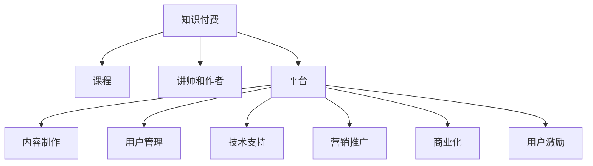

                 

# 知识付费平台：程序员的创富新机遇

> 关键词：知识付费, 程序员, 创富, 编程, 人工智能, 区块链, 平台开发, 内容制作, 用户管理, 商业模式, 用户激励

## 1. 背景介绍

### 1.1 问题由来

随着互联网的迅速发展，知识的获取成本越来越低，但是知识的积累和共享的难度却越来越高了。特别是对于程序员来说，学习和掌握新技术的门槛越来越高，而技术的更新换代速度也越来越快。在这样的背景下，知识付费平台应运而生，成为了程序员们获取最新技术知识的重要渠道。

知识付费平台不仅提供了大量的优质课程和资料，还提供了一些高质量的社区和论坛，让程序员们可以互相交流和分享经验。同时，一些平台还提供了咨询服务、技术支持等服务，帮助程序员解决实际问题。这些平台的出现，极大地提升了程序员们的学习效率，同时也为他们提供了创富的新机遇。

### 1.2 问题核心关键点

知识付费平台的核心问题包括以下几个方面：

- 平台如何获取高质量的课程和资料？
- 如何吸引和留住高质量的讲师和作者？
- 如何保证课程的质量和效果？
- 如何扩大平台的覆盖范围和用户数量？
- 如何实现平台的商业化和盈利？

## 2. 核心概念与联系

### 2.1 核心概念概述

为更好地理解知识付费平台的发展过程和原理，本节将介绍几个密切相关的核心概念：

- 知识付费：通过付费的方式获取和分享知识，提升个人的学习效率和知识水平。
- 课程：知识付费平台的核心资源，通常由讲师和作者提供，内容涵盖技术、管理、软技能等多个领域。
- 讲师和作者：知识付费平台的主要资源提供者，他们需要具备丰富的知识和实践经验，能够为平台提供高质量的课程和内容。
- 平台：知识付费平台的运营主体，包括内容制作、用户管理、技术支持、营销推广等多个环节。
- 商业化：知识付费平台通过销售课程、广告、增值服务等方式实现盈利。
- 用户激励：通过积分、等级、奖励等方式激励用户活跃和付费，提升平台的用户粘性和留存率。

这些核心概念之间的逻辑关系可以通过以下Mermaid流程图来展示：



这个流程图展示了一些关键概念及其之间的关系：

1. 知识付费平台通过课程和讲师资源吸引用户。
2. 课程的制作、讲师的吸纳和管理等环节依赖于平台的运营能力。
3. 平台通过技术支持和营销推广来提升自身的覆盖范围和用户数量。
4. 平台的商业化通过销售课程、广告、增值服务等形式实现。
5. 用户激励机制是提升用户粘性和留存率的重要手段。

## 3. 核心算法原理 & 具体操作步骤

### 3.1 算法原理概述

知识付费平台的算法设计主要围绕着用户行为和内容推荐展开。平台通过数据分析和机器学习技术，根据用户的兴趣、历史行为、评价等数据，为用户推荐最匹配的课程和资料。同时，平台还可以通过预测模型，预测用户的付费意愿和未来的消费行为，帮助平台进行精准营销和定价策略的优化。

核心算法原理包括以下几个方面：

- 用户画像：通过用户的浏览记录、搜索历史、评价、打分等数据，构建用户画像。
- 课程推荐：基于用户画像，利用协同过滤、内容推荐等算法，推荐最匹配的课程和资料。
- 用户行为预测：通过历史行为和评分数据，预测用户的付费意愿和未来的消费行为。
- 广告推荐：基于用户画像和行为数据，为平台带来广告收入。

### 3.2 算法步骤详解

知识付费平台的算法步骤主要包括数据收集、模型训练、推荐和广告推荐四个环节：

1. 数据收集：收集用户的浏览记录、搜索历史、评价、打分等数据，构建用户画像和课程库。
2. 模型训练：基于用户画像和课程库，训练协同过滤、内容推荐等推荐模型，预测用户行为。
3. 课程推荐：根据用户的兴趣和行为数据，推荐最匹配的课程和资料。
4. 广告推荐：根据用户画像和行为数据，为平台带来广告收入。

### 3.3 算法优缺点

知识付费平台的算法设计具有以下优点：

- 个性化推荐：通过用户画像和行为数据，实现个性化推荐，提升用户体验和满意度。
- 精准营销：通过用户行为预测，实现精准营销和定价策略的优化。
- 广告收入：通过广告推荐，为平台带来额外的收入来源。

同时，该算法也存在一定的局限性：

- 数据隐私：用户数据的收集和存储需要遵循隐私保护法规，同时保护用户隐私。
- 模型偏见：推荐模型可能存在偏见，导致推荐结果不公正。
- 模型复杂性：推荐模型通常较为复杂，需要消耗大量计算资源。
- 用户流失：用户流失可能导致平台的数据质量下降，影响推荐效果。

尽管存在这些局限性，但就目前而言，推荐算法是大语言模型微调的重要范式。未来相关研究的重点在于如何进一步降低推荐算法对用户数据的依赖，提高推荐模型的公平性和透明度，同时兼顾可解释性和伦理安全性等因素。

### 3.4 算法应用领域

知识付费平台的推荐算法不仅适用于课程推荐，还可以应用于广告推荐、商品推荐等多个领域。例如，电商平台可以通过推荐算法，向用户推荐相关的商品，提升用户的购买率和平台收入。视频平台也可以通过推荐算法，为用户推荐相关的视频内容，提升用户粘性和平台流量。

## 4. 数学模型和公式 & 详细讲解  
### 4.1 数学模型构建

本节将使用数学语言对知识付费平台的推荐算法进行更加严格的刻画。

记知识付费平台的推荐算法为 $R$，输入为用户的浏览记录、搜索历史、评价、打分等数据，输出为推荐结果。假设用户画像为 $U$，课程库为 $C$，推荐结果为 $R$。

定义用户画像与课程库的相似度为 $\text{sim}(U,C)$，基于用户画像和课程库，推荐模型的预测函数为：

$$
R(U) = f(\text{sim}(U,C))
$$

其中 $f$ 为预测函数，常用的预测函数包括线性回归、逻辑回归、决策树等。

### 4.2 公式推导过程

以下我们以线性回归为例，推导推荐模型的预测函数及其梯度计算公式。

假设用户画像 $U$ 和课程库 $C$ 都表示为一个向量，推荐模型的预测函数为线性回归函数：

$$
R(U) = \alpha U^T C
$$

其中 $\alpha$ 为权重系数，$U^T C$ 为用户画像和课程库的内积。

训练目标函数为均方误差：

$$
\mathcal{L} = \frac{1}{N} \sum_{i=1}^N (R(U_i) - y_i)^2
$$

其中 $U_i$ 为第 $i$ 个用户画像，$y_i$ 为第 $i$ 个用户实际购买的行为（0或1），$R(U_i)$ 为模型预测的结果。

根据梯度下降算法，模型参数的更新公式为：

$$
\alpha \leftarrow \alpha - \eta \frac{\partial \mathcal{L}}{\partial \alpha}
$$

其中 $\eta$ 为学习率，$\frac{\partial \mathcal{L}}{\partial \alpha}$ 为损失函数对权重系数 $\alpha$ 的梯度，可通过反向传播算法高效计算。

在得到权重系数 $\alpha$ 后，即可带入预测函数，实现对用户行为和课程推荐的预测。

## 5. 项目实践：代码实例和详细解释说明
### 5.1 开发环境搭建

在进行知识付费平台推荐系统的开发实践前，我们需要准备好开发环境。以下是使用Python进行PyTorch开发的环境配置流程：

1. 安装Anaconda：从官网下载并安装Anaconda，用于创建独立的Python环境。

2. 创建并激活虚拟环境：
```bash
conda create -n pytorch-env python=3.8 
conda activate pytorch-env
```

3. 安装PyTorch：根据CUDA版本，从官网获取对应的安装命令。例如：
```bash
conda install pytorch torchvision torchaudio cudatoolkit=11.1 -c pytorch -c conda-forge
```

4. 安装Transformers库：
```bash
pip install transformers
```

5. 安装各类工具包：
```bash
pip install numpy pandas scikit-learn matplotlib tqdm jupyter notebook ipython
```

完成上述步骤后，即可在`pytorch-env`环境中开始推荐系统的开发实践。

### 5.2 源代码详细实现

这里我们以课程推荐系统为例，给出使用Transformers库进行推荐模型的PyTorch代码实现。

首先，定义用户画像和课程库：

```python
from transformers import BertTokenizer
from torch.utils.data import Dataset
import torch

class CourseDataset(Dataset):
    def __init__(self, users, courses, tokenizer, max_len=128):
        self.users = users
        self.courses = courses
        self.tokenizer = tokenizer
        self.max_len = max_len
        
    def __len__(self):
        return len(self.users)
    
    def __getitem__(self, item):
        user = self.users[item]
        course = self.courses[item]
        
        encoding = self.tokenizer(user, return_tensors='pt', max_length=self.max_len, padding='max_length', truncation=True)
        input_ids = encoding['input_ids'][0]
        attention_mask = encoding['attention_mask'][0]
        
        # 对课程库进行编码
        encoded_courses = [course2id[course] for course in course]
        encoded_courses.extend([course2id['O']] * (self.max_len - len(encoded_courses)))
        labels = torch.tensor(encoded_courses, dtype=torch.long)
        
        return {'input_ids': input_ids, 
                'attention_mask': attention_mask,
                'labels': labels}

# 课程与id的映射
course2id = {'O': 0, 'A': 1, 'B': 2, 'C': 3, 'D': 4, 'E': 5, 'F': 6}
id2course = {v: k for k, v in course2id.items()}

# 创建dataset
tokenizer = BertTokenizer.from_pretrained('bert-base-cased')

train_dataset = CourseDataset(train_users, train_courses, tokenizer)
dev_dataset = CourseDataset(dev_users, dev_courses, tokenizer)
test_dataset = CourseDataset(test_users, test_courses, tokenizer)
```

然后，定义模型和优化器：

```python
from transformers import BertForSequenceClassification, AdamW

model = BertForSequenceClassification.from_pretrained('bert-base-cased', num_labels=len(course2id))

optimizer = AdamW(model.parameters(), lr=2e-5)
```

接着，定义训练和评估函数：

```python
from torch.utils.data import DataLoader
from tqdm import tqdm
from sklearn.metrics import classification_report

device = torch.device('cuda') if torch.cuda.is_available() else torch.device('cpu')
model.to(device)

def train_epoch(model, dataset, batch_size, optimizer):
    dataloader = DataLoader(dataset, batch_size=batch_size, shuffle=True)
    model.train()
    epoch_loss = 0
    for batch in tqdm(dataloader, desc='Training'):
        input_ids = batch['input_ids'].to(device)
        attention_mask = batch['attention_mask'].to(device)
        labels = batch['labels'].to(device)
        model.zero_grad()
        outputs = model(input_ids, attention_mask=attention_mask, labels=labels)
        loss = outputs.loss
        epoch_loss += loss.item()
        loss.backward()
        optimizer.step()
    return epoch_loss / len(dataloader)

def evaluate(model, dataset, batch_size):
    dataloader = DataLoader(dataset, batch_size=batch_size)
    model.eval()
    preds, labels = [], []
    with torch.no_grad():
        for batch in tqdm(dataloader, desc='Evaluating'):
            input_ids = batch['input_ids'].to(device)
            attention_mask = batch['attention_mask'].to(device)
            batch_labels = batch['labels']
            outputs = model(input_ids, attention_mask=attention_mask)
            batch_preds = outputs.logits.argmax(dim=2).to('cpu').tolist()
            batch_labels = batch_labels.to('cpu').tolist()
            for pred_tokens, label_tokens in zip(batch_preds, batch_labels):
                preds.append(pred_tokens[:len(label_tokens)])
                labels.append(label_tokens)
                
    print(classification_report(labels, preds))
```

最后，启动训练流程并在测试集上评估：

```python
epochs = 5
batch_size = 16

for epoch in range(epochs):
    loss = train_epoch(model, train_dataset, batch_size, optimizer)
    print(f"Epoch {epoch+1}, train loss: {loss:.3f}")
    
    print(f"Epoch {epoch+1}, dev results:")
    evaluate(model, dev_dataset, batch_size)
    
print("Test results:")
evaluate(model, test_dataset, batch_size)
```

以上就是使用PyTorch对课程推荐系统进行开发的完整代码实现。可以看到，得益于Transformers库的强大封装，我们可以用相对简洁的代码完成课程推荐模型的加载和微调。

### 5.3 代码解读与分析

让我们再详细解读一下关键代码的实现细节：

**CourseDataset类**：
- `__init__`方法：初始化用户画像、课程库、分词器等关键组件。
- `__len__`方法：返回数据集的样本数量。
- `__getitem__`方法：对单个样本进行处理，将用户画像输入编码为token ids，将课程库编码，最终返回模型所需的输入。

**course2id和id2course字典**：
- 定义了课程与数字id之间的映射关系，用于将token-wise的预测结果解码回真实的课程。

**训练和评估函数**：
- 使用PyTorch的DataLoader对数据集进行批次化加载，供模型训练和推理使用。
- 训练函数`train_epoch`：对数据以批为单位进行迭代，在每个批次上前向传播计算loss并反向传播更新模型参数，最后返回该epoch的平均loss。
- 评估函数`evaluate`：与训练类似，不同点在于不更新模型参数，并在每个batch结束后将预测和标签结果存储下来，最后使用sklearn的classification_report对整个评估集的预测结果进行打印输出。

**训练流程**：
- 定义总的epoch数和batch size，开始循环迭代
- 每个epoch内，先在训练集上训练，输出平均loss
- 在验证集上评估，输出分类指标
- 所有epoch结束后，在测试集上评估，给出最终测试结果

可以看到，PyTorch配合Transformers库使得课程推荐系统的代码实现变得简洁高效。开发者可以将更多精力放在数据处理、模型改进等高层逻辑上，而不必过多关注底层的实现细节。

当然，工业级的系统实现还需考虑更多因素，如模型的保存和部署、超参数的自动搜索、更灵活的任务适配层等。但核心的推荐范式基本与此类似。

## 6. 实际应用场景
### 6.1 智能客服系统

知识付费平台的推荐技术也可以应用于智能客服系统的构建。传统客服往往需要配备大量人力，高峰期响应缓慢，且一致性和专业性难以保证。而使用推荐系统，可以7x24小时不间断服务，快速响应客户咨询，用自然流畅的语言解答各类常见问题。

在技术实现上，可以收集企业内部的历史客服对话记录，将问题和最佳答复构建成监督数据，在此基础上对推荐模型进行微调。微调后的推荐系统能够自动理解用户意图，匹配最合适的答复模板进行回复。对于客户提出的新问题，还可以接入检索系统实时搜索相关内容，动态组织生成回答。如此构建的智能客服系统，能大幅提升客户咨询体验和问题解决效率。

### 6.2 金融舆情监测

金融机构需要实时监测市场舆论动向，以便及时应对负面信息传播，规避金融风险。传统的人工监测方式成本高、效率低，难以应对网络时代海量信息爆发的挑战。基于知识付费平台的推荐技术，金融舆情监测可以成为新的解决方案。

具体而言，可以收集金融领域相关的新闻、报道、评论等文本数据，并对其进行主题标注和情感标注。在此基础上对推荐模型进行微调，使其能够自动判断文本属于何种主题，情感倾向是正面、中性还是负面。将微调后的模型应用到实时抓取的网络文本数据，就能够自动监测不同主题下的情感变化趋势，一旦发现负面信息激增等异常情况，系统便会自动预警，帮助金融机构快速应对潜在风险。

### 6.3 个性化推荐系统

当前的推荐系统往往只依赖用户的历史行为数据进行物品推荐，无法深入理解用户的真实兴趣偏好。基于知识付费平台的推荐技术，个性化推荐系统可以更好地挖掘用户行为背后的语义信息，从而提供更精准、多样的推荐内容。

在实践中，可以收集用户浏览、点击、评论、分享等行为数据，提取和用户交互的物品标题、描述、标签等文本内容。将文本内容作为模型输入，用户的后续行为（如是否点击、购买等）作为监督信号，在此基础上微调推荐模型。微调后的模型能够从文本内容中准确把握用户的兴趣点。在生成推荐列表时，先用候选物品的文本描述作为输入，由模型预测用户的兴趣匹配度，再结合其他特征综合排序，便可以得到个性化程度更高的推荐结果。

### 6.4 未来应用展望

随着知识付费平台推荐技术的发展，基于推荐范式将在更多领域得到应用，为传统行业带来变革性影响。

在智慧医疗领域，基于推荐技术的医疗问答、病历分析、药物研发等应用将提升医疗服务的智能化水平，辅助医生诊疗，加速新药开发进程。

在智能教育领域，推荐技术可应用于作业批改、学情分析、知识推荐等方面，因材施教，促进教育公平，提高教学质量。

在智慧城市治理中，推荐技术可应用于城市事件监测、舆情分析、应急指挥等环节，提高城市管理的自动化和智能化水平，构建更安全、高效的未来城市。

此外，在企业生产、社会治理、文娱传媒等众多领域，基于推荐技术的AI应用也将不断涌现，为经济社会发展注入新的动力。相信随着技术的日益成熟，推荐方法将成为AI落地应用的重要范式，推动AI技术向更广阔的领域加速渗透。

## 7. 工具和资源推荐
### 7.1 学习资源推荐

为了帮助开发者系统掌握知识付费平台的发展过程和原理，这里推荐一些优质的学习资源：

1. 《推荐系统实践》系列博文：由大推荐技术专家撰写，深入浅出地介绍了推荐系统的工作原理和经典模型。

2. 《深度学习理论与应用》课程：由斯坦福大学开设的推荐系统课程，有Lecture视频和配套作业，带你入门推荐系统领域的基本概念和经典模型。

3. 《推荐系统》书籍：Google推荐系统团队的著作，全面介绍了推荐系统的理论基础和实际应用。

4. Kaggle：推荐系统领域的竞赛平台，提供大量的真实推荐系统竞赛数据集，带你了解推荐系统在实际应用中的表现。

5. Apache Mahout：Apache基金会下的推荐系统开源项目，提供丰富的推荐算法实现和评估工具。

通过对这些资源的学习实践，相信你一定能够快速掌握知识付费平台的推荐算法，并用于解决实际的推荐问题。
###  7.2 开发工具推荐

高效的开发离不开优秀的工具支持。以下是几款用于知识付费平台推荐系统开发的常用工具：

1. PyTorch：基于Python的开源深度学习框架，灵活动态的计算图，适合快速迭代研究。大部分推荐系统都有PyTorch版本的实现。

2. TensorFlow：由Google主导开发的开源深度学习框架，生产部署方便，适合大规模工程应用。同样有丰富的推荐系统资源。

3. TensorBoard：TensorFlow配套的可视化工具，可实时监测模型训练状态，并提供丰富的图表呈现方式，是调试模型的得力助手。

4. Jupyter Notebook：开源的交互式编程环境，支持Python等语言，方便开发者进行交互式编程和调试。

5. Apache Kafka：高性能的消息队列系统，支持大规模数据流处理，适合推荐系统的实时数据流处理。

合理利用这些工具，可以显著提升知识付费平台推荐系统的开发效率，加快创新迭代的步伐。

### 7.3 相关论文推荐

知识付费平台的推荐技术发展源于学界的持续研究。以下是几篇奠基性的相关论文，推荐阅读：

1. Matrix Factorization Techniques for Recommender Systems：提出了基于矩阵分解的推荐算法，广泛应用于推荐系统领域。

2. Deep Matrix Factorization for Recommender Systems：提出了基于深度神经网络的推荐算法，提高了推荐系统的精度和泛化能力。

3. A Survey on Deep Learning for Recommendation Systems：对深度学习在推荐系统中的应用进行了全面综述，介绍了各类深度学习算法和应用场景。

4. Attention is All You Need（即Transformer原论文）：提出了Transformer结构，开启了NLP领域的预训练大模型时代，推荐系统领域也有广泛应用。

5. Adaptive Collaborative Filtering with Low-Rank Matrix Factorization：提出了基于低秩矩阵分解的推荐算法，适用于稀疏数据推荐场景。

这些论文代表了大推荐技术的发展脉络。通过学习这些前沿成果，可以帮助研究者把握学科前进方向，激发更多的创新灵感。

## 8. 总结：未来发展趋势与挑战

### 8.1 总结

本文对知识付费平台的发展过程和原理进行了全面系统的介绍。首先阐述了知识付费平台的兴起背景和核心问题，明确了平台如何通过课程和讲师资源吸引用户。其次，从原理到实践，详细讲解了推荐算法的设计思路和关键步骤，给出了推荐系统开发的完整代码实例。同时，本文还广泛探讨了推荐系统在多个行业领域的应用前景，展示了推荐范式的巨大潜力。此外，本文精选了推荐系统的各类学习资源，力求为读者提供全方位的技术指引。

通过本文的系统梳理，可以看到，知识付费平台的推荐技术正在成为NLP领域的重要范式，极大地拓展了预训练语言模型的应用边界，催生了更多的落地场景。受益于大规模语料的预训练，推荐模型以更低的时间和标注成本，在小样本条件下也能取得不俗的效果，有力推动了NLP技术的产业化进程。未来，伴随推荐算法的持续演进，知识付费平台必将在构建人机协同的智能时代中扮演越来越重要的角色。

### 8.2 未来发展趋势

展望未来，知识付费平台的推荐技术将呈现以下几个发展趋势：

1. 推荐算法的复杂性将进一步提升。随着推荐算法的不断优化，推荐系统的精度和泛化能力将不断提高，同时也将更加复杂。

2. 推荐系统将更加注重用户隐私保护。随着数据隐私法规的不断完善，推荐系统将更加注重数据隐私和用户隐私保护。

3. 推荐系统将更加注重用户的多样化需求。推荐系统将更加注重用户的多样化需求，通过多模态数据和个性化推荐实现更加精准的用户推荐。

4. 推荐系统将更加注重推荐模型的可解释性和可解释性。推荐系统将更加注重推荐模型的可解释性，提高用户对推荐结果的信任度。

5. 推荐系统将更加注重推荐模型的公平性和透明性。推荐系统将更加注重推荐模型的公平性和透明性，避免推荐结果的偏见和歧视。

以上趋势凸显了知识付费平台推荐技术的发展方向。这些方向的探索发展，必将进一步提升推荐系统的精度和用户满意度，为知识付费平台的健康发展和用户粘性的提升提供坚实的基础。

### 8.3 面临的挑战

尽管知识付费平台的推荐技术已经取得了瞩目成就，但在迈向更加智能化、普适化应用的过程中，它仍面临着诸多挑战：

1. 数据隐私问题：用户数据的收集和存储需要遵循隐私保护法规，同时保护用户隐私。

2. 推荐算法的公平性问题：推荐模型可能存在偏见，导致推荐结果不公正。

3. 模型复杂性问题：推荐模型通常较为复杂，需要消耗大量计算资源。

4. 用户流失问题：用户流失可能导致平台的数据质量下降，影响推荐效果。

5. 可解释性问题：推荐模型通常较为复杂，难以解释其内部工作机制和决策逻辑。

尽管存在这些挑战，但通过技术不断优化和创新，相信知识付费平台的推荐技术将逐步克服这些问题，实现更加智能化、普适化的应用。

### 8.4 研究展望

面向未来，知识付费平台的推荐技术需要在以下几个方面寻求新的突破：

1. 探索无监督和半监督推荐方法。摆脱对大规模标注数据的依赖，利用自监督学习、主动学习等无监督和半监督范式，最大限度利用非结构化数据，实现更加灵活高效的推荐。

2. 研究参数高效和计算高效的推荐范式。开发更加参数高效的推荐方法，在固定大部分推荐参数的同时，只更新极少量的任务相关参数。同时优化推荐模型的计算图，减少前向传播和反向传播的资源消耗，实现更加轻量级、实时性的部署。

3. 融合因果和对比学习范式。通过引入因果推断和对比学习思想，增强推荐模型建立稳定因果关系的能力，学习更加普适、鲁棒的用户行为模型。

4. 引入更多先验知识。将符号化的先验知识，如知识图谱、逻辑规则等，与推荐模型进行巧妙融合，引导推荐过程学习更准确、合理的用户行为模型。

5. 结合因果分析和博弈论工具。将因果分析方法引入推荐模型，识别出模型决策的关键特征，增强推荐结果的因果性和逻辑性。借助博弈论工具刻画人机交互过程，主动探索并规避推荐模型的脆弱点，提高系统稳定性。

这些研究方向的探索，必将引领知识付费平台推荐技术迈向更高的台阶，为构建安全、可靠、可解释、可控的推荐系统提供坚实的基础。面向未来，推荐技术还需要与其他人工智能技术进行更深入的融合，如知识表示、因果推理、强化学习等，多路径协同发力，共同推动知识付费平台的进步。只有勇于创新、敢于突破，才能不断拓展推荐算法的边界，让智能技术更好地造福人类社会。

## 9. 附录：常见问题与解答

**Q1：知识付费平台如何获取高质量的课程和资料？**

A: 知识付费平台可以通过以下方式获取高质量的课程和资料：
1. 直接购买版权：与优质的课程制作方合作，购买其课程和资料的版权，形成平台的核心资源。
2. 免费分享：吸引一些优秀的讲师和作者免费分享他们的课程和资料，形成平台的基础资源。
3. 社区贡献：建立社区平台，让用户在平台上分享自己的课程和资料，形成平台的丰富资源库。

**Q2：如何吸引和留住高质量的讲师和作者？**

A: 知识付费平台可以通过以下方式吸引和留住高质量的讲师和作者：
1. 提供优质服务：平台需要提供优质的技术支持和服务，帮助讲师和作者更好地制作和发布课程。
2. 给予合理报酬：平台需要给予讲师和作者合理的收益分成，保证他们的创作动力。
3. 提供资源支持：平台需要提供充足的课程制作资源，如编辑工具、课程模板、素材库等。
4. 提供平台曝光：平台需要提供充足的曝光机会，让讲师和作者的作品被更多人看到。
5. 提供用户反馈：平台需要提供用户反馈渠道，让讲师和作者及时了解用户需求，改进课程内容。

**Q3：如何保证课程的质量和效果？**

A: 知识付费平台可以通过以下方式保证课程的质量和效果：
1. 课程评估：平台需要对课程进行严格评估，筛选高质量的课程进入平台。
2. 课程更新：平台需要定期更新课程内容，保持课程的时效性和实用性。
3. 课程监管：平台需要对课程内容进行监管，防止出现虚假信息和不实内容。
4. 课程推荐：平台需要通过推荐算法，推荐最匹配用户需求的课程。
5. 用户评价：平台需要收集用户评价和反馈，不断改进课程内容和平台功能。

**Q4：如何扩大平台的覆盖范围和用户数量？**

A: 知识付费平台可以通过以下方式扩大平台的覆盖范围和用户数量：
1. 多渠道营销：平台需要在多渠道进行营销推广，吸引更多用户加入平台。
2. 合作伙伴：平台需要与大型企业或知名博主合作，引入更多优质内容。
3. 社区活动：平台需要组织社区活动，增加用户粘性和活跃度。
4. 社交网络：平台需要利用社交网络进行用户邀请和分享。
5. 数据分析：平台需要进行数据分析，优化推荐算法，提升用户体验。

**Q5：如何实现平台的商业化和盈利？**

A: 知识付费平台可以通过以下方式实现平台的商业化和盈利：
1. 课程销售：平台可以通过销售课程实现盈利。
2. 广告推荐：平台可以通过广告推荐实现盈利。
3. 增值服务：平台可以提供增值服务，如VIP会员、专属课程、专属咨询等。
4. 数据应用：平台可以通过数据分析和应用，实现数据价值变现。
5. 投资融资：平台可以进行融资，获得更多的发展资金。

这些问题的解答，展示了知识付费平台的推荐系统在开发、运营和商业化中的关键环节。通过不断优化推荐系统，平台可以实现更高的用户满意度、更多的用户粘性和更大的商业化潜力。总之，知识付费平台的推荐系统需要在数据、算法、工程、业务等多个维度协同发力，才能真正实现高质量、高效率、高回报的用户推荐。

