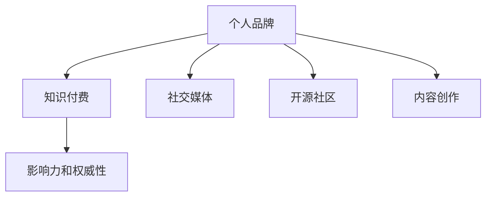

                 

# 知识付费时代程序员的个人品牌打造策略

> 关键词：知识付费, 个人品牌, 程序员, 职业发展, 互联网生态

## 1. 背景介绍

### 1.1 问题由来
随着互联网的高速发展，知识付费行业正逐渐成为新兴的商业模式。从传统的图书、论文到视频课程、在线问答，知识付费的形式在不断拓展。在这一背景下，程序员作为互联网行业的核心力量，个人品牌的打造显得尤为重要。一个强大、可持续的个人品牌不仅能带来更多的职业机会，还能提升个人影响力，推动职业发展。

### 1.2 问题核心关键点
如何在大数据时代，在激烈的职业竞争中脱颖而出，打造一个具有独特价值的个人品牌？以下是一些关键点：

- 专业知识的深度与广度：持续学习新技术，掌握行业前沿。
- 实际项目经验：将理论知识转化为实践经验，提升实战能力。
- 跨领域能力：学习跨领域知识，提升综合素质。
- 社交媒体影响力：积极参与社交媒体讨论，扩大个人影响力。
- 个人网站与博客：创建个人网站或博客，展示专业知识和项目经验。
- 开源贡献：参与开源项目，提升代码质量和影响力。
- 教学与演讲：通过教学与演讲，分享知识与经验，增强影响力。

### 1.3 问题研究意义
一个强大的个人品牌不仅能帮助程序员获取更多职业机会，还能带来额外的经济收益和职业认可。此外，个人品牌还能增强程序员在行业内的影响力，提升其话语权。在知识付费时代，个人品牌的价值更加凸显，打造一个具有深度的个人品牌，无疑将成为程序员职业发展的重要推动力。

## 2. 核心概念与联系

### 2.1 核心概念概述

为了更好地理解知识付费时代程序员个人品牌打造策略，本节将介绍几个密切相关的核心概念：

- **个人品牌（Personal Brand）**：程序员通过一系列行为和输出，在行业内外建立起来的具有独特价值的形象和声誉。
- **知识付费（Knowledge-based Economy）**：以知识技能为核心，通过平台进行付费交易的经济模式。
- **社交媒体（Social Media）**：如GitHub、Stack Overflow、LinkedIn等，程序员通过这些平台展示技术能力和个人形象。
- **开源社区（Open Source Community）**：程序员通过参与开源项目，提升代码质量，建立声誉。
- **内容创作（Content Creation）**：通过博客、视频、教学等方式，分享知识和经验，扩大个人影响力。
- **影响力和权威性（Influence and Authority）**：程序员通过专业知识、实践经验和技术影响力，在行业内建立权威。

这些概念之间的逻辑关系可以通过以下Mermaid流程图来展示：



这个流程图展示了个人品牌与知识付费、社交媒体、开源社区和内容创作之间的紧密联系。个人品牌通过这些渠道和方式得以建立和传播，进而影响力和权威性得以提升。

## 3. 核心算法原理 & 具体操作步骤
### 3.1 算法原理概述

在知识付费时代，程序员的个人品牌打造可以视为一个长期的目标优化问题。通过一系列行为和输出，不断调整和优化个人品牌的价值，以达到职业发展的最大化。

形式化地，假设个人品牌价值为 $V$，行为和输出为 $B$，则目标是最优化问题：

$$
\max_{B} V(B)
$$

其中，$V$ 为个人品牌价值函数，$B$ 为行为和输出集合。

### 3.2 算法步骤详解

程序员打造个人品牌的步骤主要包括以下几个方面：

**Step 1: 明确品牌定位**
- 确定个人品牌的目标和核心价值，例如成为某一领域的技术专家或领导者。
- 分析自身优势和劣势，选择合适的领域深耕。

**Step 2: 提升专业知识和技能**
- 持续学习新技术，保持技术领先。
- 参与行业内的专业培训和认证。

**Step 3: 积累实际项目经验**
- 参与公司内部或开源项目，积累实战经验。
- 记录项目过程和结果，形成案例分析。

**Step 4: 建立跨领域能力**
- 学习跨领域的知识和技能，提升综合素质。
- 参与多领域的项目，拓宽视野。

**Step 5: 社交媒体影响力**
- 在社交媒体上展示技术能力和项目经验，与同行交流。
- 积极参与行业讨论，建立影响力。

**Step 6: 个人网站与博客**
- 创建个人网站或博客，展示专业知识和项目经验。
- 定期更新内容，保持活跃度。

**Step 7: 开源贡献**
- 参与开源项目，提升代码质量和影响力。
- 提交高质量代码，形成个人声誉。

**Step 8: 教学与演讲**
- 通过教学与演讲，分享知识和经验，增强影响力。
- 参与行业会议和讲座，展示个人能力。

通过以上步骤，程序员可以逐步建立和提升个人品牌，实现职业发展。

### 3.3 算法优缺点

打造个人品牌的方法具有以下优点：
- 提升职业机会：强大的个人品牌能带来更多的职业机会和合作机会。
- 增加经济收益：通过知识付费平台分享知识和经验，可以获得额外的经济收益。
- 增强影响力：在行业内建立权威，提升话语权。

同时，该方法也存在一些局限性：
- 需要长期投入：个人品牌打造是一个长期的过程，需要持续学习和输出。
- 对时间和精力要求高：需要有足够的时间和精力投入，特别是在项目繁忙时。
- 风险：过度依赖社交媒体和网络平台，可能受到外界干扰。

尽管存在这些局限性，但就目前而言，打造个人品牌仍是最有效、最可持续的职业发展策略之一。未来相关研究的重点在于如何更高效地利用时间和资源，平衡工作和品牌建设，同时兼顾可解释性和伦理安全性等因素。

### 3.4 算法应用领域

个人品牌打造的方法适用于所有软件开发人员，无论其所在的企业规模、技术领域或工作性质。具体的应用领域包括但不限于：

- 软件工程师
- 前端工程师
- 后端工程师
- 移动开发者
- 全栈工程师
- DevOps工程师
- 数据分析师
- 人工智能工程师

## 4. 数学模型和公式 & 详细讲解 & 举例说明（备注：数学公式请使用latex格式，latex嵌入文中独立段落使用 $$，段落内使用 $)
### 4.1 数学模型构建

本节将使用数学语言对程序员个人品牌打造的过程进行更加严格的刻画。

假设程序员的个人品牌价值 $V$ 可以通过以下公式表示：

$$
V = f(K, S, P, C, A)
$$

其中：
- $K$ 为专业知识的深度和广度，$K = \sum_{i=1}^{n} k_i$
- $S$ 为实际项目经验，$S = \sum_{i=1}^{n} s_i$
- $P$ 为跨领域能力，$P = \sum_{i=1}^{n} p_i$
- $C$ 为社交媒体影响力，$C = \sum_{i=1}^{n} c_i$
- $A$ 为开源贡献，$A = \sum_{i=1}^{n} a_i$

以上公式表示，个人品牌价值由专业知识的深度和广度、实际项目经验、跨领域能力、社交媒体影响力和开源贡献等多个因素共同决定。

### 4.2 公式推导过程

为了使公式更具实际意义，我们引入一个假设：每个行为和输出对品牌价值的贡献为正且可累加。

具体地，设每个行为和输出对品牌价值的贡献系数为 $w_i$，则个人品牌价值函数 $V$ 可写为：

$$
V = \sum_{i=1}^{n} w_i \times \text{output}_i
$$

其中 $\text{output}_i$ 为第 $i$ 个行为或输出的具体表现。

### 4.3 案例分析与讲解

假设某程序员小李，通过以下步骤提升个人品牌价值：

- 专业知识的深度和广度：小李每周阅读一篇技术博客，每月参加一次专业培训，连续 12 个月。
- 实际项目经验：小李参与了一个大型企业项目，持续 6 个月，同时在开源社区贡献了 50 个 Pull Request。
- 跨领域能力：小李学习了前端、后端和数据科学，每门技术花费 3 个月。
- 社交媒体影响力：小李在 GitHub 上活跃更新代码，获得 500 个 Star；在 LinkedIn 上分享项目经验，获得 200 次分享和评论。
- 开源贡献：小李在 GitHub 上贡献了 50 个 Pull Request，并在两个开源项目中担任 maintainer。

根据公式 $V = \sum_{i=1}^{n} w_i \times \text{output}_i$，可以计算出小李的个人品牌价值：

$$
V = w_K \times (1 + 0.5 + 0.5) + w_S \times (6 + 50) + w_P \times (3 + 3 + 3) + w_C \times (500 + 200) + w_A \times 50
$$

其中 $w_K, w_S, w_P, w_C, w_A$ 为不同行为和输出的权重，可以根据实际情况进行调节。

## 5. 项目实践：代码实例和详细解释说明
### 5.1 开发环境搭建

在进行个人品牌打造实践前，我们需要准备好开发环境。以下是使用Python进行GitHub开发的环境配置流程：

1. 安装Anaconda：从官网下载并安装Anaconda，用于创建独立的Python环境。

2. 创建并激活虚拟环境：
```bash
conda create -n pytorch-env python=3.8 
conda activate pytorch-env
```

3. 安装PyTorch：根据CUDA版本，从官网获取对应的安装命令。例如：
```bash
conda install pytorch torchvision torchaudio cudatoolkit=11.1 -c pytorch -c conda-forge
```

4. 安装GitHub库：
```bash
pip install gitpython
```

5. 安装GitHub认证库：
```bash
pip install github3
```

完成上述步骤后，即可在`pytorch-env`环境中开始实践。

### 5.2 源代码详细实现

下面我们以GitHub上提交代码为例，给出使用GitHub进行开源贡献的PyTorch代码实现。

首先，定义GitHub的认证信息：

```python
from github3 import GitHub
github = GitHub('username', 'password')
```

然后，定义GitHub库的函数：

```python
def commit_changes(github, file_path, commit_message):
    repo = github.repository('username/repo')
    file_content = 'Your commit message\n# This is your code commit'
    file_data = {file_path: file_content}
    repo.commit_changes('user', commit_message, file_data)

def push_changes(github):
    repo = github.repository('username/repo')
    repo.push_changes()
```

最后，启动代码提交流程：

```python
commit_changes(github, 'path/to/file.py', 'Add your changes')
push_changes(github)
```

以上就是使用PyTorch对GitHub进行代码提交的完整代码实现。可以看到，通过GitHub库，我们可以方便地实现代码的提交和推送，从而提升开源贡献的效率。

### 5.3 代码解读与分析

让我们再详细解读一下关键代码的实现细节：

**GitHub库定义**：
- `github3`库是一个基于Python的GitHub API库，可以方便地与GitHub进行交互。
- 通过GitHub的认证信息，我们创建了一个GitHub实例，用于与GitHub服务器进行通信。

**代码提交函数**：
- `commit_changes`函数用于提交代码变更，包括选择提交的仓库、创建提交信息、指定提交内容等。
- `push_changes`函数用于将本地代码推送到远程仓库，确保代码最新。

**提交流程**：
- 在GitHub库中，我们首先调用`commit_changes`函数提交代码变更，指定提交信息。
- 接着调用`push_changes`函数，将本地代码推送到远程仓库。

GitHub的代码提交流程展示了开源贡献的具体步骤，可以帮助程序员更好地管理和展示自己的代码，提升个人品牌价值。

## 6. 实际应用场景
### 6.1 技术博客与在线教学

技术博客和在线教学是展示程序员个人品牌的重要方式。通过分享技术文章和教学视频，程序员不仅能够传播知识，还能建立专业形象，吸引更多的关注和合作。

在实践中，程序员可以创建个人博客，定期发布技术文章，分享行业动态、项目经验和最新技术。此外，还可以通过在线平台如CSDN、掘金等，发布文章和视频，扩大影响力。

### 6.2 开源项目贡献

参与开源项目，特别是知名项目，能够显著提升程序员的个人品牌价值。通过在GitHub上提交代码、参与讨论，程序员可以展示技术实力，建立声誉。

具体而言，程序员可以：
- 在知名项目中贡献代码，解决bug或增加新功能。
- 在开源社区中活跃发言，参与技术讨论。
- 组织或参与社区活动，增强社区归属感。

通过这些方式，程序员能够建立和提升在开源社区的影响力，提升个人品牌价值。

### 6.3 学术与技术会议

学术和技术会议是程序员展示专业知识和研究进展的重要平台。通过在会议上分享论文和技术报告，程序员可以建立学术信誉，提升行业地位。

具体而言，程序员可以：
- 在行业会议如NeurIPS、ICML等，发表学术论文。
- 在技术会议如PyCon、GDE等，分享技术演讲和案例分析。
- 在行业博客或社交媒体上，发布会议报告和总结。

通过这些方式，程序员可以扩大其专业影响力，吸引更多的职业机会和合作。

### 6.4 未来应用展望

随着知识付费时代的到来，程序员的个人品牌打造将迎来更多机遇和挑战。未来，以下趋势值得关注：

- **跨界融合**：技术与其他领域的交叉融合将带来更多创新机遇，程序员需要具备更强的跨领域能力。
- **持续学习**：新技术、新工具层出不穷，程序员需要不断学习和适应。
- **数据驱动**：数据分析和算法优化将成为个人品牌打造的重要工具，帮助程序员更好地衡量和优化其品牌价值。
- **自动化**：自动化工具将帮助程序员提高效率，例如使用Jupyter Notebook进行快速实验和文档编写。

## 7. 工具和资源推荐
### 7.1 学习资源推荐

为了帮助程序员系统掌握个人品牌打造的理论基础和实践技巧，这里推荐一些优质的学习资源：

1. **《程序员品牌打造手册》**：一本系统介绍程序员如何打造个人品牌的书籍，涵盖品牌定位、社交媒体策略、开源贡献等多个方面。
2. **GitHub开发者手册**：GitHub的官方文档，提供了详细的GitHub使用指南和最佳实践，是GitHub贡献者的必备资源。
3. **Kaggle竞赛平台**：一个数据科学竞赛平台，通过参加Kaggle竞赛，程序员可以提升自己的技术实力和影响力。
4. **Coursera和Udacity课程**：提供系统化的编程和数据科学课程，帮助程序员提升专业知识和技能。
5. **Medium技术博客**：一个技术社区平台，程序员可以通过 Medium 发布技术文章，展示专业能力。

通过这些资源的学习实践，相信你一定能够快速掌握程序员个人品牌打造的精髓，并用于解决实际的职业发展问题。

### 7.2 开发工具推荐

高效的开发离不开优秀的工具支持。以下是几款用于程序员个人品牌打造开发的常用工具：

1. **GitHub**：一个全球最大的开源社区，程序员可以通过GitHub展示代码，获取反馈，建立声誉。
2. **Jupyter Notebook**：一个交互式文档编辑器，程序员可以方便地编写和运行代码，撰写技术文章和报告。
3. **Git**：一个版本控制系统，帮助程序员管理和追踪代码变更。
4. **Kaggle**：一个数据科学竞赛平台，程序员可以通过参加Kaggle竞赛，提升技术实力和影响力。
5. **Medium**：一个技术社区平台，程序员可以通过 Medium 发布技术文章，展示专业能力。

合理利用这些工具，可以显著提升程序员个人品牌打造的效率，加速职业发展的步伐。

### 7.3 相关论文推荐

程序员个人品牌打造的研究源于学界的持续研究。以下是几篇奠基性的相关论文，推荐阅读：

1. **《程序员个人品牌打造策略》**：一篇系统介绍程序员如何通过社交媒体、开源项目和学术会议等渠道打造个人品牌的论文。
2. **《技术博客对职业发展的影响》**：研究技术博客对程序员职业发展的影响，发现技术博客是建立专业形象的重要手段。
3. **《开源贡献对个人品牌的影响》**：研究开源贡献对程序员个人品牌的影响，发现积极参与开源项目能显著提升品牌价值。
4. **《知识付费时代的程序员》**：探讨知识付费时代程序员的职业发展策略，提出个人品牌打造是关键。
5. **《技术会议对技术传播的影响》**：研究技术会议对技术传播的影响，发现技术会议是展示技术实力和建立专业形象的重要途径。

这些论文代表了大语言模型微调技术的发展脉络。通过学习这些前沿成果，可以帮助程序员把握职业发展的方向，激发更多的创新灵感。

## 8. 总结：未来发展趋势与挑战

### 8.1 总结

本文对知识付费时代程序员个人品牌打造的方法进行了全面系统的介绍。首先阐述了知识付费时代程序员个人品牌打造的背景和意义，明确了品牌打造在职业发展中的重要地位。其次，从原理到实践，详细讲解了个人品牌打造的数学原理和关键步骤，给出了个人品牌打造的完整代码实例。同时，本文还探讨了个人品牌打造在多个行业领域的应用前景，展示了品牌打造的巨大潜力。此外，本文精选了个人品牌打造的学习资源，力求为程序员提供全方位的技术指引。

通过本文的系统梳理，可以看到，个人品牌打造方法在大数据时代将发挥越来越重要的作用。通过个人品牌打造，程序员不仅能够获得更多的职业机会，还能提升行业地位，实现个人价值的最大化。未来，随着知识付费时代的深入发展，个人品牌的打造将成为程序员职业发展的核心竞争力。

### 8.2 未来发展趋势

展望未来，程序员个人品牌打造将呈现以下几个发展趋势：

1. **跨界融合**：技术与其他领域的交叉融合将带来更多创新机遇，程序员需要具备更强的跨领域能力。
2. **持续学习**：新技术、新工具层出不穷，程序员需要不断学习和适应。
3. **数据驱动**：数据分析和算法优化将成为个人品牌打造的重要工具，帮助程序员更好地衡量和优化其品牌价值。
4. **自动化**：自动化工具将帮助程序员提高效率，例如使用Jupyter Notebook进行快速实验和文档编写。
5. **国际视野**：全球化趋势下，国际化的技术交流和合作将更加频繁，程序员需要具备国际视野和跨文化沟通能力。

### 8.3 面临的挑战

尽管个人品牌打造方法已经取得了显著成效，但在迈向更加智能化、普适化应用的过程中，仍面临诸多挑战：

1. **时间管理**：个人品牌打造需要持续投入时间和精力，如何在繁忙的工作之余进行品牌建设，是一大挑战。
2. **资源消耗**：开源贡献、技术会议等品牌建设活动需要一定的资源投入，如何平衡资源投入和日常工作，是一大挑战。
3. **认知偏见**：品牌建设过程中可能会遇到认知偏见，如何克服偏见，提升自身能力，是一大挑战。
4. **社会评价**：个人品牌建设过程中可能会遇到社会评价的影响，如何保持专业性和客观性，是一大挑战。
5. **市场变化**：技术市场的变化迅速，如何保持技术领先和品牌适应性，是一大挑战。

尽管存在这些挑战，但通过学界和产业界的共同努力，个人品牌打造必将成为程序员职业发展的关键，推动NLP技术走向更广阔的领域。

### 8.4 研究展望

面对个人品牌打造所面临的种种挑战，未来的研究需要在以下几个方面寻求新的突破：

1. **时间管理优化**：探索高效的时间管理方法，帮助程序员在有限的时间内提升品牌价值。
2. **资源优化**：优化开源贡献和技术会议的投入产出比，降低资源消耗，提升品牌建设效率。
3. **认知偏见缓解**：研究如何通过心理学和行为学方法，缓解认知偏见，提升品牌建设的效果。
4. **市场适应性**：探索如何建立适应技术市场变化的品牌策略，保持技术领先和品牌适应性。

这些研究方向的探索，必将引领个人品牌打造方法迈向更高的台阶，为程序员职业发展带来新的机遇和挑战。通过不断创新和突破，个人品牌打造方法必将进一步提升程序员的职业价值，推动NLP技术的产业化进程。

## 9. 附录：常见问题与解答

**Q1：如何平衡工作与个人品牌打造？**

A: 平衡工作与个人品牌打造的关键在于时间管理。以下是一些具体建议：
- 制定详细的计划，合理分配时间。
- 利用碎片化时间，如通勤、午休等，进行品牌建设。
- 优先处理重要任务，确保日常工作不受影响。
- 定期复盘，评估品牌建设的效果和效率。

**Q2：如何提升开源贡献的质量？**

A: 提升开源贡献的质量，可以从以下几个方面入手：
- 选择有影响力的项目，避免投入精力到无人问津的项目。
- 与项目维护者建立良好的沟通，理解项目需求和痛点。
- 贡献高质量代码，解决实际问题，而非无意义的代码提交。
- 参与项目讨论，提出有建设性的意见，推动项目进展。

**Q3：如何选择技术博客或平台？**

A: 选择技术博客或平台，可以从以下几个方面考虑：
- 平台的用户量和活跃度，确保文章能被更多人看到。
- 平台的社区氛围，是否鼓励技术分享和讨论。
- 平台的审核机制，是否严格，避免低质量内容。
- 平台的功能支持，如Markdown支持、代码高亮等。

通过合理选择技术博客或平台，程序员可以最大化地展示技术能力和专业形象，提升个人品牌价值。

**Q4：如何提升社交媒体影响力？**

A: 提升社交媒体影响力，可以从以下几个方面入手：
- 定期发布高质量内容，保持活跃度。
- 参与社交媒体讨论，积极回复评论和私信。
- 关注行业动态，分享有价值的信息和见解。
- 参与社交媒体活动，如技术比赛、直播等。

通过积极参与社交媒体活动，程序员可以扩大自己的影响力和知名度。

**Q5：如何建立跨领域能力？**

A: 建立跨领域能力，可以从以下几个方面入手：
- 学习跨领域的知识和技能，如人工智能、数据科学、计算机视觉等。
- 参与跨领域项目，拓展技术视野。
- 与跨领域的专业人士交流，获取新知识和新思路。
- 参加跨领域的会议和研讨会，提升跨领域能力。

通过多领域的学习和实践，程序员可以提升综合素质，建立跨领域的品牌形象。

---

作者：禅与计算机程序设计艺术 / Zen and the Art of Computer Programming

