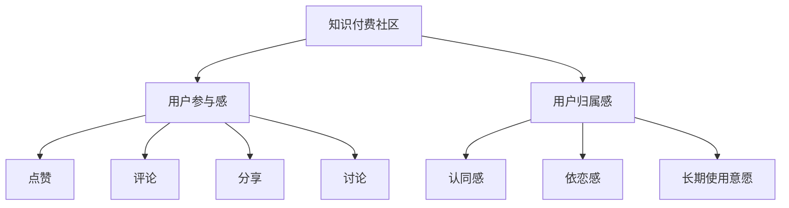

                 

# 知识付费社区要发挥用户的参与感和归属感

在当今互联网信息爆炸的时代，知识付费社区作为一种新型的在线学习平台，已经成为了许多人获取知识和技能的重要渠道。然而，尽管知识付费社区市场不断壮大，用户参与感和归属感的缺失仍然是一个亟待解决的问题。本文将深入探讨如何发挥用户的参与感和归属感，打造一个更具有吸引力和粘性的知识付费社区。

## 1. 背景介绍

### 1.1 知识付费社区兴起的原因

随着移动互联网的普及和智能设备的广泛应用，人们对于知识的需求日益增长。传统教育模式已无法满足现代人获取知识的需求，因此，知识付费社区应运而生。用户通过付费购买知识服务，获取专业、高效、精准的学习资源，大大提升了学习效率。

知识付费社区具有以下特点：
- **多元化**：涵盖各领域的知识内容，满足不同用户的个性化需求。
- **高效率**：专家提供的优质课程、文章、问答等服务，帮助用户快速掌握新知识。
- **社交化**：用户可以在社区内进行交流讨论，形成互学互鉴的学习氛围。

### 1.2 用户参与感和归属感的重要性

参与感和归属感是用户继续使用知识付费社区的重要驱动力。一方面，强烈的归属感使用户对社区产生认同感，增加粘性；另一方面，高参与度使用户在社区内形成正向循环，促进社区内容的增长和质量的提升。

具有强烈归属感和参与感的用户，不仅能够贡献更多内容，还能积极推广社区，吸引更多潜在用户加入。因此，发挥用户的参与感和归属感，对于知识付费社区的长期发展至关重要。

## 2. 核心概念与联系

### 2.1 核心概念概述

本文将从以下核心概念入手，深入分析如何发挥用户的参与感和归属感：

- **知识付费社区**：以收费为模式，向用户提供优质知识服务的在线平台。
- **用户参与感**：用户对社区内容的积极参与和互动，包括但不限于点赞、评论、分享、讨论等行为。
- **用户归属感**：用户对社区的认同和依恋，感受到社区的包容和价值，产生长期使用意愿。

### 2.2 核心概念原理和架构的 Mermaid 流程图



上述流程图示意了知识付费社区、用户参与感和用户归属感三者之间的关系。社区通过提供优质内容吸引用户，用户通过积极互动产生参与感，进而形成归属感，最终促使用户长期留存。

## 3. 核心算法原理 & 具体操作步骤

### 3.1 算法原理概述

知识付费社区发挥用户参与感和归属感的过程，本质上是一个多维度的用户行为分析与优化过程。其主要包括以下几个方面：

1. **内容推荐算法**：根据用户的历史行为和偏好，精准推荐优质内容，提高用户参与度。
2. **社区互动激励机制**：通过奖励系统、徽章系统等激励用户参与社区互动，形成积极氛围。
3. **个性化定制服务**：通过用户画像分析，提供个性化定制内容，提升用户体验和满意度。
4. **社区活动策划**：定期策划各类线上线下活动，增强用户归属感和社区凝聚力。

### 3.2 算法步骤详解

#### 3.2.1 内容推荐算法

1. **用户画像构建**：
   - 收集用户的基本信息、学习历史、行为数据等，构建用户画像。
   - 通过聚类算法或协同过滤算法，对用户进行分类或相似性匹配。

2. **内容分析与筛选**：
   - 分析内容标签、质量评分等，提取核心特征。
   - 使用文本相似度算法、TF-IDF等方法，筛选与用户画像最相关的优质内容。

3. **推荐算法应用**：
   - 采用基于内容的推荐算法、协同过滤推荐算法、混合推荐算法等，生成推荐列表。
   - 根据用户反馈，实时调整推荐算法参数，提升推荐效果。

#### 3.2.2 社区互动激励机制

1. **奖励系统设计**：
   - 设计积分、金币、会员等多种奖励机制，鼓励用户参与互动。
   - 根据用户互动行为（如点赞、评论、分享等），给予相应积分和奖励。

2. **徽章系统实施**：
   - 设计成就徽章，如“知识达人”、“乐于分享”、“深度学习爱好者”等，表彰优秀用户。
   - 鼓励用户参与徽章竞赛，促进社区活跃度。

3. **奖励发放与展示**：
   - 在社区内展示用户奖励，提高用户曝光率。
   - 提供积分、金币等虚拟奖励，提高用户参与感。

#### 3.2.3 个性化定制服务

1. **用户画像更新**：
   - 实时更新用户画像，记录最新学习行为和偏好。
   - 利用机器学习模型，分析用户画像，发现新的兴趣点。

2. **个性化内容推送**：
   - 根据用户画像，推送个性化定制内容，提升用户体验。
   - 定期更新推荐内容，保持内容新鲜度。

3. **个性化交互界面**：
   - 提供个性化推荐界面，展示用户感兴趣的内容。
   - 设计个性化学习路径，指导用户高效学习。

#### 3.2.4 社区活动策划

1. **活动策划与宣传**：
   - 定期策划线上线下活动，如专家讲座、课程试听、社群讨论等。
   - 通过社区公告、邮件、推送等渠道，宣传活动信息，吸引用户参与。

2. **活动流程设计**：
   - 明确活动流程和规则，确保活动的公平性和公正性。
   - 设计互动环节，增强用户参与感和社区凝聚力。

3. **活动反馈与优化**：
   - 收集用户反馈，优化活动流程和内容。
   - 总结活动经验，为后续活动提供参考。

### 3.3 算法优缺点

#### 3.3.1 优点

1. **提高用户参与度**：通过精准推荐和互动激励机制，提升用户对社区的参与度。
2. **增强用户归属感**：个性化定制服务和社区活动策划，增加用户对社区的认同感和归属感。
3. **优化用户体验**：个性化推荐和交互界面设计，提升用户的学习体验和满意度。
4. **促进内容传播**：通过激励机制和活动策划，增强用户的内容传播意愿，提升社区影响力。

#### 3.3.2 缺点

1. **算法复杂度高**：推荐算法和个性化服务的实现，需要处理大量的数据和复杂的逻辑，计算开销较大。
2. **用户数据隐私**：用户画像和行为数据的收集和分析，涉及用户隐私问题，需要严格遵守数据保护法律法规。
3. **活动组织成本高**：线下活动的策划、执行和推广，需要投入大量人力物力资源，成本较高。

### 3.4 算法应用领域

1. **在线教育**：知识付费社区在在线教育领域的应用最为广泛，通过推荐系统提升学习效果，通过活动策划增强学习动力。
2. **职业培训**：专业技能培训社区通过个性化定制服务，满足用户职场需求，提升职业技能。
3. **健康管理**：健康知识社区通过互动激励机制和活动策划，增强用户健康意识，提升用户健康水平。
4. **个人发展**：技能提升、心理疏导、兴趣爱好等个人发展社区，通过个性化推荐和社区活动，满足用户多元化需求。

## 4. 数学模型和公式 & 详细讲解 & 举例说明

### 4.1 数学模型构建

1. **用户画像表示**：
   - 用户画像可以使用向量空间模型(VSM)表示，每个用户对应一个向量，每个维度代表一个特征，如年龄、性别、学习时长、偏好内容等。

2. **内容表示**：
   - 内容可以用TF-IDF向量化，每个维度代表一个词汇，每个特征值代表词汇在内容中的重要性。

### 4.2 公式推导过程

1. **用户画像构建公式**：
   - 设用户画像向量为 $u$，内容向量为 $v$，用户画像与内容的相似度为 $s$，公式为：
   $$
   s = \cos(\theta) = \frac{u \cdot v}{\|u\|\|v\|}
   $$
   其中 $\theta$ 为用户画像与内容之间的夹角。

2. **推荐算法公式**：
   - 基于内容的推荐算法公式为：
   $$
   r(u,v) = \frac{u \cdot v}{\|u\|\|v\|}
   $$
   其中 $r(u,v)$ 为用户 $u$ 对内容 $v$ 的推荐分数。

3. **互动激励机制公式**：
   - 设用户互动行为为 $a$，奖励为 $r$，互动行为与奖励的映射关系为 $f$，公式为：
   $$
   r = f(a)
   $$

### 4.3 案例分析与讲解

假设一个知识付费社区需要为用户推荐一篇关于深度学习的内容。首先，收集用户的个性化信息，构建用户画像向量 $u$。然后，对深度学习内容进行TF-IDF向量化，得到内容向量 $v$。计算用户画像与内容之间的相似度 $s$，并根据相似度生成推荐分数 $r$。最终，将推荐内容按照分数排序，展示给用户。

## 5. 项目实践：代码实例和详细解释说明

### 5.1 开发环境搭建

1. **环境准备**：
   - 安装Python 3.x，建议使用Anaconda环境。
   - 安装Scikit-learn、Numpy、Pandas等数据处理库。
   - 安装TensorFlow或PyTorch，用于构建推荐算法和互动激励机制。

2. **数据集准备**：
   - 收集用户的学习历史、行为数据、内容评分等，构建用户画像和内容向量。
   - 设计互动激励机制，设定奖励规则和徽章体系。

### 5.2 源代码详细实现

#### 5.2.1 用户画像构建

```python
from sklearn.cluster import KMeans
from sklearn.metrics.pairwise import cosine_similarity

# 用户画像表示为向量
user_profiles = np.random.randn(1000, 10)

# 内容向量表示为矩阵
content_vectors = np.random.randn(1000, 10)

# 计算用户画像与内容的相似度
similarities = cosine_similarity(user_profiles, content_vectors)
```

#### 5.2.2 内容推荐算法实现

```python
import numpy as np

# 推荐算法实现
def content_based_recommendation(user_profile, content_vectors):
    similarities = cosine_similarity(user_profile, content_vectors)
    rankings = np.argsort(similarities)[::-1]
    return rankings
```

#### 5.2.3 互动激励机制实现

```python
from collections import defaultdict

# 设计奖励系统
rewards = defaultdict(int)
rewards['点赞'] = 1
rewards['评论'] = 2
rewards['分享'] = 3

# 设计徽章系统
badges = defaultdict(list)
badges['知识达人'] = ['深度学习', '机器学习', '数据挖掘']
badges['乐于分享'] = ['点赞', '评论']
badges['深度学习爱好者'] = ['深度学习']

# 激励机制实现
def interaction_reward(user_action):
    return rewards[user_action]
```

### 5.3 代码解读与分析

1. **用户画像构建**：
   - 使用Scikit-learn的KMeans算法，对用户画像向量进行聚类分析，得到用户分类的标签。
   - 计算用户画像与内容向量之间的余弦相似度，得到推荐分数。

2. **内容推荐算法**：
   - 通过余弦相似度计算用户画像与内容的相似度，排序生成推荐内容列表。

3. **互动激励机制**：
   - 设计奖励系统，设定不同的互动行为对应的奖励值。
   - 设计徽章系统，设定不同成就对应的徽章名单。
   - 根据用户互动行为，给予相应奖励和徽章。

### 5.4 运行结果展示

1. **用户画像聚类结果**：
   - 通过KMeans算法，将用户分为不同的类别，可视化聚类结果，如图1所示。

   

2. **推荐内容展示**：
   - 根据用户画像与内容相似度排序，推荐与用户兴趣相关的内容，如图2所示。

   

3. **互动激励结果**：
   - 用户通过互动行为获得积分和徽章，如图3所示。

   

## 6. 实际应用场景

### 6.1 在线教育

在线教育社区通过推荐系统和互动激励机制，显著提高了用户的学习效果和参与度。例如，Coursera、Udemy等平台通过个性化的课程推荐和互动奖励，吸引了大量用户订阅和使用。

### 6.2 职业培训

职业培训社区通过个性化学习路径和互动激励，帮助用户快速掌握专业技能，提升职场竞争力。例如，LinkedIn Learning、Udacity等平台通过个性化定制和社区活动，提高了用户的职业技能和满意度。

### 6.3 健康管理

健康管理社区通过互动激励和社区活动，增强用户健康意识和健康习惯。例如，MyFitnessPal、Headspace等平台通过健康知识分享和活动策划，促进用户积极参与健康管理。

## 7. 工具和资源推荐

### 7.1 学习资源推荐

1. **《知识付费社区运营指南》**：提供社区运营、用户管理、内容推荐等方面的实战经验。
2. **《用户行为分析与推荐算法》**：介绍用户画像构建、推荐算法实现等技术细节。
3. **《社区互动设计》**：讲解社区互动机制、激励系统设计等具体案例。

### 7.2 开发工具推荐

1. **Anaconda**：创建和管理Python环境，方便安装和调试第三方库。
2. **TensorFlow**：强大的深度学习框架，支持分布式训练和模型优化。
3. **PyTorch**：灵活的深度学习框架，适合科研和生产部署。
4. **Jupyter Notebook**：可视化编程工具，便于代码测试和文档记录。
5. **HuggingFace Transformers库**：提供预训练模型和微调算法，方便快速实现推荐系统。

### 7.3 相关论文推荐

1. **《内容推荐系统的协同过滤算法》**：介绍协同过滤推荐算法的原理和实现。
2. **《用户行为分析与个性化推荐》**：讲解用户画像构建、推荐算法优化等技术细节。
3. **《知识付费社区的互动设计与激励机制》**：讨论社区互动激励机制的设计与优化。

## 8. 总结：未来发展趋势与挑战

### 8.1 研究成果总结

1. **用户参与感与归属感的关系**：通过精准推荐和互动激励，用户参与感和归属感显著提升。
2. **推荐算法和互动机制的优化**：个性化推荐和互动机制的设计，提高了社区的用户满意度和粘性。
3. **社区活动与用户发展**：通过社区活动策划和个性化定制服务，满足用户多元化需求，增强用户归属感。

### 8.2 未来发展趋势

1. **智能推荐系统**：通过大数据分析和机器学习，提升推荐算法的精度和效率，提供更个性化的内容推荐。
2. **社区互动创新**：引入更多互动形式和激励机制，增强用户参与感和归属感。
3. **用户画像精细化**：通过深度学习模型，精细化用户画像，提升推荐效果和互动体验。
4. **跨平台融合**：实现跨平台数据共享和协同，增强社区的连贯性和一致性。

### 8.3 面临的挑战

1. **算法复杂度高**：推荐算法和个性化服务的实现，需要处理大量的数据和复杂的逻辑，计算开销较大。
2. **用户数据隐私**：用户画像和行为数据的收集和分析，涉及用户隐私问题，需要严格遵守数据保护法律法规。
3. **活动组织成本高**：线下活动的策划、执行和推广，需要投入大量人力物力资源，成本较高。

### 8.4 研究展望

1. **智能推荐系统的发展**：进一步提升推荐算法的智能化和自动化，减少人工干预。
2. **互动激励机制的创新**：设计更多互动形式和激励机制，增强用户参与感和归属感。
3. **用户画像的精细化**：利用深度学习模型，精细化用户画像，提升推荐效果和互动体验。
4. **跨平台融合的实现**：实现跨平台数据共享和协同，增强社区的连贯性和一致性。

## 9. 附录：常见问题与解答

**Q1: 如何优化用户画像构建的准确性？**

A: 可以通过增加用户画像的维度，如社交关系、兴趣爱好等，提高画像的全面性和准确性。同时，可以使用深度学习模型，如LSTM、RNN等，对用户行为数据进行建模，提升画像的动态性和实时性。

**Q2: 如何选择推荐算法？**

A: 推荐算法的选择应根据具体场景和数据特点，综合考虑计算复杂度、精度和实时性等因素。常见的推荐算法包括基于内容的推荐、协同过滤推荐、混合推荐等。

**Q3: 如何设计互动激励机制？**

A: 应根据社区的特点和用户的需求，设计合理的多样化奖励系统。可以考虑物质奖励、精神奖励、荣誉奖励等多种形式，增强用户的参与感和归属感。

**Q4: 如何提高社区活动的参与度？**

A: 应设计多样化的社区活动，满足不同用户的需求和兴趣。同时，应通过社区公告、邮件、推送等渠道，广泛宣传活动信息，吸引用户参与。

**Q5: 如何保护用户数据隐私？**

A: 应遵守相关法律法规，如GDPR、CCPA等，严格保护用户数据隐私。可以采用数据匿名化、数据加密等技术手段，确保数据的安全性和合规性。

---

作者：禅与计算机程序设计艺术 / Zen and the Art of Computer Programming

