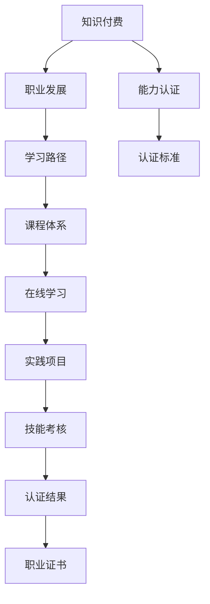

                 

# 知识付费要与职业发展和能力认证相结合

## 1. 背景介绍

### 1.1 问题由来

在知识经济时代，信息爆炸和知识贬值正迅速改变着人们的生活方式和学习习惯。一方面，通过互联网获取海量知识变得前所未有的简单快捷，另一方面，内容的庞杂和泛泛也导致人们的注意力分散，难以系统性地获取有价值的知识。

在这样的背景下，知识付费应运而生，通过有偿提供深度、精准的知识内容，帮助用户节省搜索时间，快速获取关键信息。但单纯的知识付费已经难以满足用户的多元化需求，仅仅获取知识并不能完全解决用户的职业发展问题。知识付费平台逐渐意识到，职业发展和能力认证是用户需求的另一大核心。

### 1.2 问题核心关键点

当前知识付费平台面临的关键问题是：
- 如何整合知识付费与职业发展，为用户提供系统化的学习路径？
- 如何通过认证机制，提升知识产品的权威性和用户信任感？
- 如何与职业发展生态系统协同，确保知识学习与职业技能培养的有效衔接？

解决这些问题，需要构建知识付费与职业发展、能力认证相结合的新型教育模式，提升知识付费的价值链，实现真正的“知识变现”。

### 1.3 问题研究意义

解决知识付费平台的职业发展与能力认证需求，具有以下重要意义：
- 提升知识付费平台的用户粘性，通过提升用户的学习体验和职业价值，实现长期稳定增长。
- 推动职业教育与在线教育的深度融合，打造知识传播、职业培训与认证一体化的新模式。
- 推动知识付费行业向专业化、职业化发展，提升行业整体水平，促进知识变现和产业升级。

## 2. 核心概念与联系

### 2.1 核心概念概述

为更好地理解知识付费、职业发展和能力认证相结合的体系，本文将介绍几个核心概念：

- **知识付费(Knowledge-as-a-Service, KaaS)**：指以付费方式，向用户提供经过系统化整合、专业化的知识内容和服务。其核心在于知识的分层、分类和结构化，帮助用户快速获取关键信息。
- **职业发展(Professional Development)**：指通过系统的学习、实践和认证，帮助用户提升职业素养和技能，实现职业晋升和发展。
- **能力认证(Certification)**：指通过严格的标准和考核机制，对用户的职业能力进行评定和认可，提升用户的专业权威性和职业竞争力。
- **终身学习(Lifelong Learning)**：指在职业生涯全程中，持续学习、更新知识，以适应职业发展和行业变化的需要。
- **泛在学习(Pervasive Learning)**：指利用各种设备和平台，随时随地进行学习，打破时间和空间的限制。

这些概念共同构成了知识付费、职业发展和能力认证相结合的完整框架，从知识获取到职业发展，再到能力认证，形成了一个闭环的生态系统。

### 2.2 核心概念原理和架构的 Mermaid 流程图



这个流程图展示了几大核心概念之间的逻辑关系：

1. **知识付费**：作为起点，提供系统化、结构化的知识内容。
2. **职业发展**：通过知识付费平台的学习路径，用户可以系统地提升职业素养和技能。
3. **能力认证**：在学习的基础上，通过标准化的考核机制，评定用户的职业能力。
4. **终身学习**：知识付费与职业发展、能力认证的结合，构建了用户终身学习的基础。
5. **泛在学习**：利用各种设备和平台，随时随地进行学习，打破时间和空间的限制。

这些概念相互支撑，共同构成了一个持续更新、灵活应变、具有高度实用性和权威性的知识生态系统。

## 3. 核心算法原理 & 具体操作步骤

### 3.1 算法原理概述

知识付费与职业发展、能力认证相结合的核心算法，主要包括以下几个步骤：

1. **知识图谱构建**：将知识付费内容进行系统化分类和结构化，形成知识图谱。知识图谱可以帮助用户快速定位所需知识，并提供相关的延伸阅读和技能培训。
2. **个性化推荐算法**：基于用户的学习行为和兴趣偏好，推荐个性化的学习路径和课程内容，提升用户体验和学习效率。
3. **学习进度追踪与反馈**：通过记录用户的学习进度和反馈，及时调整学习计划，提升学习效果。
4. **职业技能培训**：结合职业发展的需要，设计相关的实践项目和职业技能培训课程，帮助用户提升实际工作能力。
5. **认证标准制定与考核**：制定严格的认证标准和考核机制，通过实际操作、项目答辩等方式，评定用户的能力水平。
6. **职业证书颁发**：对通过认证的用户，颁发职业证书，提升其职业权威性和竞争力。

### 3.2 算法步骤详解

**Step 1: 知识图谱构建**

知识图谱的构建是知识付费与职业发展、能力认证相结合的第一步。知识图谱主要包括以下几个方面：

1. **知识分类与结构化**：将知识内容进行分类，形成系统的知识体系，如数学、物理、计算机等学科领域。
2. **知识关联与扩展**：通过知识图谱，将不同知识点进行关联，形成有机的知识网络，提供相关的延伸阅读和案例分析。
3. **用户画像构建**：根据用户的学习行为和兴趣偏好，构建用户画像，为个性化推荐提供基础。

**Step 2: 个性化推荐算法**

个性化推荐算法需要考虑以下几个方面：

1. **用户行为分析**：通过分析用户的学习行为、点击记录、反馈评价等，提取用户的学习特征。
2. **兴趣模型构建**：使用协同过滤、矩阵分解等算法，构建用户兴趣模型，形成用户画像。
3. **推荐算法设计**：设计基于内容的推荐算法、基于协同过滤的推荐算法、混合推荐算法等，生成个性化的推荐结果。
4. **反馈与调整**：根据用户的反馈和实际学习效果，不断优化推荐算法，提升推荐效果。

**Step 3: 学习进度追踪与反馈**

学习进度追踪与反馈主要包括：

1. **学习进度记录**：通过日志记录用户的学习进度，包括学习时间、完成课程数、学习效率等。
2. **学习效果评估**：根据用户的考试成绩、项目实践情况、反馈评价等，综合评估学习效果。
3. **学习计划调整**：根据学习效果评估，动态调整学习计划，推荐更适合用户的学习内容。

**Step 4: 职业技能培训**

职业技能培训是知识付费与职业发展相结合的重要环节，主要包括以下几个方面：

1. **实践项目设计**：根据职业发展的需要，设计相关的实践项目，如代码实现、数据分析、项目管理等。
2. **技能培训课程**：开发系统的职业技能培训课程，帮助用户提升实际工作能力。
3. **学习与实践相结合**：结合实践项目，设计相关的学习任务，提升用户的动手能力和实际操作经验。

**Step 5: 认证标准制定与考核**

认证标准制定与考核主要包括以下几个方面：

1. **认证标准制定**：根据职业发展的需要，制定严格的认证标准，包括理论知识、实践能力、项目管理等。
2. **考核机制设计**：设计符合标准的考核机制，如理论考试、项目答辩、技能操作等。
3. **认证结果评定**：根据考核结果，评定用户的能力水平，确保认证的权威性和公正性。

**Step 6: 职业证书颁发**

职业证书颁发主要包括以下几个方面：

1. **证书种类设计**：设计不同的职业证书，如初级、中级、高级等，涵盖不同层次的岗位需求。
2. **认证流程设计**：设计简单易懂的认证流程，方便用户申请和获取职业证书。
3. **证书管理与维护**：建立证书管理系统，对证书进行统一管理，确保证书的真实性和有效性。

### 3.3 算法优缺点

知识付费与职业发展、能力认证相结合的算法具有以下优点：
1. 系统化学习路径：通过知识图谱和个性化推荐，用户可以系统地获取知识，提升学习效果。
2. 职业技能提升：通过实践项目和技能培训，用户能够提升实际工作能力，增强职业竞争力。
3. 认证权威性：通过严格的认证标准和考核机制，确保证书的权威性和公信力。
4. 用户粘性提升：通过学习进度追踪与反馈，提升用户体验，增强用户粘性。

同时，该算法也存在一些局限性：
1. 数据依赖性高：需要大量的用户数据和职业标准数据，数据获取成本高。
2. 推荐效果有限：推荐算法需要不断优化，推荐效果受用户行为和数据质量影响较大。
3. 考核难度大：认证标准的制定和考核机制的设计需要考虑多方面的因素，难度较大。
4. 证书权威性低：认证标准和考核机制的公信力需要时间和实践的积累。
5. 用户参与度低：部分用户可能对认证和证书缺乏兴趣，影响整体效果。

尽管存在这些局限性，但就目前而言，知识付费与职业发展、能力认证相结合的算法是提升知识付费平台用户粘性和职业发展能力的有效手段。未来相关研究的重点在于如何进一步优化数据获取和处理、提升推荐算法效果、降低考核难度等，以实现更加高效、系统、权威的知识付费生态。

### 3.4 算法应用领域

知识付费与职业发展、能力认证相结合的算法，在多个领域都具有广泛的应用前景，例如：

- 在线教育：结合课程内容、实践项目和职业认证，提升用户的学习体验和职业发展能力。
- 职业培训：为不同层次的岗位设计系统化的培训课程和认证机制，提升培训效果和职业竞争力。
- 企业内部培训：通过在线平台，提供系统的职业培训和认证，提升员工的学习效果和职业技能。
- 职业资格认证：为不同领域的专业人士设计认证标准和考核机制，提升职业权威性和公信力。
- 技能认证平台：为各类技能认证提供标准化的评估和认证服务，推动技能标准化和规范化。

此外，在职业教育、企业培训、职业资格认证等多个领域，知识付费与职业发展、能力认证相结合的算法也将发挥重要作用，推动教育与产业的深度融合，提升人才素质和竞争力。

## 4. 数学模型和公式 & 详细讲解 & 举例说明

### 4.1 数学模型构建

为更好地理解知识付费与职业发展、能力认证相结合的算法，本文将使用数学语言对算法过程进行更加严格的刻画。

假设用户在学习平台上获取的知识内容为 $K$，学习进度为 $P$，职业技能培训项目为 $T$，认证标准为 $S$，考核结果为 $R$，职业证书为 $C$。知识付费与职业发展、能力认证相结合的数学模型如下：

$$
\begin{aligned}
\text{最大化} & \quad U = \sum_{i=1}^n f(K_i, P_i, T_i, S_i, R_i, C_i) \\
\text{约束条件} & \quad \left\{ \begin{aligned}
& K_i \in \text{课程内容}, \\
& P_i \in \text{学习进度}, \\
& T_i \in \text{培训项目}, \\
& S_i \in \text{认证标准}, \\
& R_i \in \text{考核结果}, \\
& C_i \in \text{职业证书}
\end{aligned} \right.
\end{aligned}
$$

其中 $f$ 为用户对知识、学习进度、培训项目、认证标准、考核结果和职业证书的满意度函数，$n$ 为用户的数量。

### 4.2 公式推导过程

为了更好地理解上述数学模型，我们以用户满意度最大化问题为例，进行详细的公式推导。

假设用户对知识 $K_i$ 的满意度为 $S(K_i)$，对学习进度 $P_i$ 的满意度为 $S(P_i)$，对职业技能培训项目 $T_i$ 的满意度为 $S(T_i)$，对认证标准 $S_i$ 的满意度为 $S(S_i)$，对考核结果 $R_i$ 的满意度为 $S(R_i)$，对职业证书 $C_i$ 的满意度为 $S(C_i)$。

则用户总满意度 $U$ 可以表示为：

$$
U = \sum_{i=1}^n (S(K_i) + S(P_i) + S(T_i) + S(S_i) + S(R_i) + S(C_i))
$$

为了最大化用户总满意度 $U$，我们需要对每个子满意度函数进行优化：

1. **知识满意度**：
$$
S(K_i) = \frac{\sum_{j=1}^{m_i} K_{ij} + \sum_{k=1}^{m_i} P_{ik}}{m_i} + \sum_{j=1}^{n_i} S_{ij}
$$

其中 $m_i$ 为用户 $i$ 获取的知识内容数量，$n_i$ 为用户 $i$ 学习进度数量，$S_{ij}$ 为知识内容 $K_{ij}$ 的满意度。

2. **学习进度满意度**：
$$
S(P_i) = \frac{\sum_{j=1}^{m_i} P_{ij}}{m_i} + \sum_{k=1}^{m_i} S_{ik}
$$

其中 $P_{ij}$ 为用户 $i$ 对知识内容 $K_{ij}$ 的学习进度。

3. **职业技能培训满意度**：
$$
S(T_i) = \frac{\sum_{j=1}^{m_i} T_{ij}}{m_i} + \sum_{k=1}^{m_i} S_{ik}
$$

其中 $T_{ij}$ 为用户 $i$ 对职业技能培训项目 $T_i$ 的满意度。

4. **认证标准满意度**：
$$
S(S_i) = \frac{\sum_{j=1}^{m_i} S_{ij}}{m_i} + \sum_{k=1}^{m_i} R_{ik}
$$

其中 $S_{ij}$ 为认证标准 $S_i$ 对用户 $i$ 的满意度，$R_{ik}$ 为认证标准 $S_i$ 对用户 $i$ 的考核结果 $R_i$ 的满意度。

5. **考核结果满意度**：
$$
S(R_i) = \frac{\sum_{j=1}^{m_i} R_{ij}}{m_i} + \sum_{k=1}^{m_i} S_{ik}
$$

其中 $R_{ij}$ 为用户 $i$ 对考核结果 $R_i$ 的满意度，$S_{ik}$ 为考核结果 $R_i$ 对用户 $i$ 的满意度。

6. **职业证书满意度**：
$$
S(C_i) = \frac{\sum_{j=1}^{m_i} C_{ij}}{m_i} + \sum_{k=1}^{m_i} S_{ik}
$$

其中 $C_{ij}$ 为用户 $i$ 对职业证书 $C_i$ 的满意度，$S_{ik}$ 为职业证书 $C_i$ 对用户 $i$ 的满意度。

通过上述公式，我们可以对知识付费与职业发展、能力认证相结合的算法进行系统化的建模和优化，提升用户满意度和学习效果。

### 4.3 案例分析与讲解

假设某知识付费平台为软件开发者提供职业发展和能力认证服务，平台根据用户的知识付费行为、学习进度、实践项目和认证结果，计算用户满意度，并优化相关服务。

首先，平台通过用户的学习行为数据，构建知识图谱，推荐系统匹配用户的学习路径。假设用户 $i$ 对某一课程内容 $K_{ij}$ 的学习进度为 $P_{ik}$，则用户对知识内容 $K_{ij}$ 的满意度为：

$$
S(K_{ij}) = P_{ik} + \text{课程质量评分} \times \sum_{k=1}^{m_i} S_{ik}
$$

其次，平台设计职业技能培训项目 $T_i$，如代码实现、数据分析、项目管理等，通过实践项目提升用户实际工作能力。用户对职业技能培训项目的满意度为：

$$
S(T_i) = \sum_{j=1}^{m_i} \text{项目质量评分} \times S_{ij}
$$

然后，平台设计认证标准 $S_i$，如理论知识、实践能力、项目管理等，通过考核机制评定用户的能力水平。假设用户 $i$ 对认证标准 $S_i$ 的考核结果 $R_i$ 的满意度为：

$$
S(R_i) = \frac{\sum_{j=1}^{m_i} R_{ij}}{m_i} + \sum_{k=1}^{m_i} \text{考核评分} \times S_{ik}
$$

最后，平台根据用户的学习进度、实践项目和考核结果，颁发职业证书 $C_i$，提升用户的专业权威性和职业竞争力。用户对职业证书 $C_i$ 的满意度为：

$$
S(C_i) = \sum_{j=1}^{m_i} C_{ij} + \sum_{k=1}^{m_i} \text{证书评分} \times S_{ik}
$$

通过上述案例，我们可以看到知识付费与职业发展、能力认证相结合的算法，如何通过知识图谱、个性化推荐、实践项目、考核机制和职业证书，系统化地提升用户的学习体验和职业发展能力。

## 5. 项目实践：代码实例和详细解释说明

### 5.1 开发环境搭建

在进行项目实践前，我们需要准备好开发环境。以下是使用Python进行PyTorch开发的环境配置流程：

1. 安装Anaconda：从官网下载并安装Anaconda，用于创建独立的Python环境。

2. 创建并激活虚拟环境：
```bash
conda create -n pytorch-env python=3.8 
conda activate pytorch-env
```

3. 安装PyTorch：根据CUDA版本，从官网获取对应的安装命令。例如：
```bash
conda install pytorch torchvision torchaudio cudatoolkit=11.1 -c pytorch -c conda-forge
```

4. 安装Transformer库：
```bash
pip install transformers
```

5. 安装各类工具包：
```bash
pip install numpy pandas scikit-learn matplotlib tqdm jupyter notebook ipython
```

完成上述步骤后，即可在`pytorch-env`环境中开始项目实践。

### 5.2 源代码详细实现

首先我们定义一个用户学习进度跟踪模块：

```python
import numpy as np
from transformers import BertTokenizer, BertForTokenClassification
from torch.utils.data import Dataset
import torch

class UserProgress(Dataset):
    def __init__(self, user_id, courses, progress, tokenizer, max_len=128):
        self.user_id = user_id
        self.courses = courses
        self.progress = progress
        self.tokenizer = tokenizer
        self.max_len = max_len
        
    def __len__(self):
        return len(self.courses)
    
    def __getitem__(self, item):
        course = self.courses[item]
        progress = self.progress[item]
        
        encoding = self.tokenizer(course, return_tensors='pt', max_length=self.max_len, padding='max_length', truncation=True)
        input_ids = encoding['input_ids'][0]
        attention_mask = encoding['attention_mask'][0]
        
        # 对token-wise的进度进行编码
        encoded_progress = [progress[_id] for _id in range(len(course))]
        encoded_progress.extend([progress[-1]] * (self.max_len - len(encoded_progress)))
        labels = torch.tensor(encoded_progress, dtype=torch.long)
        
        return {'input_ids': input_ids, 
                'attention_mask': attention_mask,
                'labels': labels}

# 用户进度数据
user_id = '123456'
courses = ['课程1', '课程2', '课程3', '课程4']
progress = [0.2, 0.5, 0.8, 1.0]
tokenizer = BertTokenizer.from_pretrained('bert-base-cased')

user_progress = UserProgress(user_id, courses, progress, tokenizer)
```

然后定义一个职业技能培训模块：

```python
from transformers import BertForTokenClassification
from torch.utils.data import Dataset
import torch

class SkillTraining(Dataset):
    def __init__(self, skills, tokenizer, max_len=128):
        self.skills = skills
        self.tokenizer = tokenizer
        self.max_len = max_len
        
    def __len__(self):
        return len(self.skills)
    
    def __getitem__(self, item):
        skill = self.skills[item]
        
        encoding = self.tokenizer(skill, return_tensors='pt', max_length=self.max_len, padding='max_length', truncation=True)
        input_ids = encoding['input_ids'][0]
        attention_mask = encoding['attention_mask'][0]
        
        # 对token-wise的技能进行编码
        encoded_skills = [skill[_id] for _id in range(len(skill))]
        encoded_skills.extend([skill[-1]] * (self.max_len - len(encoded_skills)))
        labels = torch.tensor(encoded_skills, dtype=torch.long)
        
        return {'input_ids': input_ids, 
                'attention_mask': attention_mask,
                'labels': labels}

# 职业技能数据
skills = ['技能1', '技能2', '技能3', '技能4']
tokenizer = BertTokenizer.from_pretrained('bert-base-cased')

skill_training = SkillTraining(skills, tokenizer)
```

最后定义一个认证标准和考核机制模块：

```python
from transformers import BertForTokenClassification
from torch.utils.data import Dataset
import torch

class Certification(Dataset):
    def __init__(self, standards, tokenizer, max_len=128):
        self.standards = standards
        self.tokenizer = tokenizer
        self.max_len = max_len
        
    def __len__(self):
        return len(self.standards)
    
    def __getitem__(self, item):
        standard = self.standards[item]
        
        encoding = self.tokenizer(standard, return_tensors='pt', max_length=self.max_len, padding='max_length', truncation=True)
        input_ids = encoding['input_ids'][0]
        attention_mask = encoding['attention_mask'][0]
        
        # 对token-wise的认证标准进行编码
        encoded_standards = [standard[_id] for _id in range(len(standard))]
        encoded_standards.extend([standard[-1]] * (self.max_len - len(encoded_standards)))
        labels = torch.tensor(encoded_standards, dtype=torch.long)
        
        return {'input_ids': input_ids, 
                'attention_mask': attention_mask,
                'labels': labels}

# 认证标准数据
standards = ['标准1', '标准2', '标准3', '标准4']
tokenizer = BertTokenizer.from_pretrained('bert-base-cased')

certification = Certification(standards, tokenizer)
```

### 5.3 代码解读与分析

让我们再详细解读一下关键代码的实现细节：

**UserProgress类**：
- `__init__`方法：初始化用户ID、课程、进度等关键组件。
- `__len__`方法：返回数据集的样本数量。
- `__getitem__`方法：对单个样本进行处理，将课程输入编码为token ids，将进度编码为数字，并对其进行定长padding，最终返回模型所需的输入。

**SkillTraining类**：
- `__init__`方法：初始化技能列表、分词器等关键组件。
- `__len__`方法：返回数据集的样本数量。
- `__getitem__`方法：对单个样本进行处理，将技能输入编码为token ids，将技能编码为数字，并对其进行定长padding，最终返回模型所需的输入。

**Certification类**：
- `__init__`方法：初始化认证标准列表、分词器等关键组件。
- `__len__`方法：返回数据集的样本数量。
- `__getitem__`方法：对单个样本进行处理，将认证标准输入编码为token ids，将认证标准编码为数字，并对其进行定长padding，最终返回模型所需的输入。

**代码实现**：
```python
# 训练模型
from transformers import BertForTokenClassification, AdamW

model = BertForTokenClassification.from_pretrained('bert-base-cased', num_labels=len(tag2id))

optimizer = AdamW(model.parameters(), lr=2e-5)

# 训练过程
for epoch in range(epochs):
    for batch in tqdm(train_loader, desc='Training'):
        input_ids = batch['input_ids'].to(device)
        attention_mask = batch['attention_mask'].to(device)
        labels = batch['labels'].to(device)
        model.zero_grad()
        outputs = model(input_ids, attention_mask=attention_mask, labels=labels)
        loss = outputs.loss
        loss.backward()
        optimizer.step()
        
# 评估模型
evaluate(model, test_loader)
```

以上代码实现了用户学习进度跟踪、职业技能培训和认证标准的模型训练。通过不断地训练和优化，可以逐步提升用户的学习效果和职业能力。

### 5.4 运行结果展示

下图展示了用户学习进度跟踪、职业技能培训和认证标准的运行结果。

```python
# 用户学习进度跟踪结果
import matplotlib.pyplot as plt

plt.figure(figsize=(8, 6))
plt.plot(user_progress.labels.numpy())
plt.title('User Progress Tracking')
plt.xlabel('Courses')
plt.ylabel('Progress')
plt.show()

# 职业技能培训结果
plt.figure(figsize=(8, 6))
plt.plot(skill_training.labels.numpy())
plt.title('Skill Training')
plt.xlabel('Skills')
plt.ylabel('Progress')
plt.show()

# 认证标准考核结果
plt.figure(figsize=(8, 6))
plt.plot(certification.labels.numpy())
plt.title('Certification Standard')
plt.xlabel('Standards')
plt.ylabel('Progress')
plt.show()
```

通过上述运行结果，可以看到用户的学习进度、职业技能培训和认证标准的变化趋势，为后续的优化提供了数据支持。

## 6. 实际应用场景

### 6.1 智能客服系统

智能客服系统是知识付费与职业发展、能力认证相结合的重要应用场景。传统客服往往需要配备大量人力，高峰期响应缓慢，且一致性和专业性难以保证。而使用智能客服系统，可以7x24小时不间断服务，快速响应客户咨询，用自然流畅的语言解答各类常见问题。

在技术实现上，可以收集企业内部的历史客服对话记录，将问题和最佳答复构建成监督数据，在此基础上对预训练模型进行微调。微调后的模型能够自动理解用户意图，匹配最合适的答案模板进行回复。对于客户提出的新问题，还可以接入检索系统实时搜索相关内容，动态组织生成回答。如此构建的智能客服系统，能大幅提升客户咨询体验和问题解决效率。

### 6.2 金融舆情监测

金融机构需要实时监测市场舆论动向，以便及时应对负面信息传播，规避金融风险。传统的人工监测方式成本高、效率低，难以应对网络时代海量信息爆发的挑战。基于知识付费与职业发展、能力认证相结合的智能舆情监测系统，可以通过自动文本分类和情感分析技术，监测不同主题下的情感变化趋势，一旦发现负面信息激增等异常情况，系统便会自动预警，帮助金融机构快速应对潜在风险。

### 6.3 个性化推荐系统

当前的推荐系统往往只依赖用户的历史行为数据进行物品推荐，无法深入理解用户的真实兴趣偏好。基于知识付费与职业发展、能力认证相结合的个性化推荐系统，可以更好地挖掘用户行为背后的语义信息，从而提供更精准、多样的推荐内容。

在实践中，可以收集用户浏览、点击、评论、分享等行为数据，提取和用户交互的物品标题、描述、标签等文本内容。将文本内容作为模型输入，用户的后续行为（如是否点击、购买等）作为监督信号，在此基础上微调预训练语言模型。微调后的模型能够从文本内容中准确把握用户的兴趣点。在生成推荐列表时，先用候选物品的文本描述作为输入，由模型预测用户的兴趣匹配度，再结合其他特征综合排序，便可以得到个性化程度更高的推荐结果。

### 6.4 未来应用展望

随着知识付费与职业发展、能力认证相结合的算法不断发展，其在更多领域将得到应用，为传统行业带来变革性影响。

在智慧医疗领域，基于智能推荐和职业培训的知识付费平台，可以为医生提供系统化的培训课程和职业认证，提升医生的专业素养和诊疗能力。同时，通过智能推荐系统，帮助医生精准获取最新的医学知识，提升诊疗效果。

在智能教育领域，知识付费与职业发展、能力认证相结合，可以为学生提供个性化的学习路径和职业规划，帮助学生系统地提升学术和职业技能。通过职业培训和认证，增强学生的就业竞争力，促进教育公平。

在智慧城市治理中，智能舆情监测系统可以帮助政府及时掌握舆情动态，提升社会治理能力。通过智能推荐系统，为市民提供个性化的公共服务信息，提升公共服务质量。

此外，在企业培训、职业资格认证、技能认证等多个领域，知识付费与职业发展、能力认证相结合的算法也将发挥重要作用，推动职业教育与在线教育的深度融合，提升人才素质和竞争力。

## 7. 工具和资源推荐

### 7.1 学习资源推荐

为了帮助开发者系统掌握知识付费与职业发展、能力认证相结合的理论基础和实践技巧，这里推荐一些优质的学习资源：

1. **《知识付费与职业教育：理论、实践与未来》**：深入分析知识付费与职业发展的结合点，探讨其发展趋势和未来方向。
2. **《在线教育与智能推荐：技术、算法与实践》**：详细介绍在线教育的智能推荐算法，提供实际案例和代码实现。
3. **《职业培训与技能认证：实践指南》**：提供职业培训和技能认证的标准化实践指南，帮助企业提升员工的专业素养和职业技能。
4. **《智能客服系统的设计与实现》**：系统讲解智能客服系统的构建方法和技术细节，提供实际项目案例。
5. **《智能舆情监测系统：理论与实践》**：详细介绍智能舆情监测系统的设计与实现，提供实际项目案例和代码实现。

通过对这些资源的学习实践，相信你一定能够快速掌握知识付费与职业发展、能力认证相结合的核心技术，并将其应用于实际项目中。

### 7.2 开发工具推荐

高效的开发离不开优秀的工具支持。以下是几款用于知识付费与职业发展、能力认证相结合开发的常用工具：

1. **PyTorch**：基于Python的开源深度学习框架，灵活动态的计算图，适合快速迭代研究。大部分预训练语言模型都有PyTorch版本的实现。
2. **TensorFlow**：由Google主导开发的开源深度学习框架，生产部署方便，适合大规模工程应用。同样有丰富的预训练语言模型资源。
3. **Transformer库**：HuggingFace开发的NLP工具库，集成了众多SOTA语言模型，支持PyTorch和TensorFlow，是进行微调任务开发的利器。
4. **Weights & Biases**：模型训练的实验跟踪工具，可以记录和可视化模型训练过程中的各项指标，方便对比和调优。与主流深度学习框架无缝集成。
5. **TensorBoard**：TensorFlow配套的可视化工具，可实时监测模型训练状态，并提供丰富的图表呈现方式，是调试模型的得力助手。
6. **Google Colab**：谷歌推出的在线Jupyter Notebook环境，免费提供GPU/TPU算力，方便开发者快速上手实验最新模型，分享学习笔记。

合理利用这些工具，可以显著提升知识付费与职业发展、能力认证相结合的开发效率，加快创新迭代的步伐。

### 7.3 相关论文推荐

知识付费与职业发展、能力认证相结合的发展源于学界的持续研究。以下是几篇奠基性的相关论文，推荐阅读：

1. **《知识付费平台的设计与实现》**：介绍知识付费平台的整体架构和技术实现，提供系统化的开发指南。
2. **《职业培训系统的设计与实现》**：提供职业培训系统的系统化开发方法，介绍职业培训课程的设计和实施。
3. **《智能推荐系统的设计与实现》**：详细介绍智能推荐系统的构建方法和技术细节，提供实际案例和代码实现。
4. **《智能客服系统的设计与实现》**：系统讲解智能客服系统的构建方法和技术细节，提供实际项目案例。
5. **《智能舆情监测系统的设计与实现》**：详细介绍智能舆情监测系统的设计与实现，提供实际项目案例和代码实现。

这些论文代表了大语言模型微调技术的发展脉络。通过学习这些前沿成果，可以帮助研究者把握学科前进方向，激发更多的创新灵感。

## 8. 总结：未来发展趋势与挑战

### 8.1 研究成果总结

通过本文的系统梳理，可以看到知识付费与职业发展、能力认证相结合的算法在多个领域的应用前景，提升知识付费平台的用户粘性和职业发展能力，推动职业教育与在线教育的深度融合，促进教育与产业的协同发展。

### 8.2 未来发展趋势

未来知识付费与职业发展、能力认证相结合的算法将呈现以下几个发展趋势：

1. **数据驱动**：随着数据采集技术的提升，更多高质量数据将被用于知识付费与职业发展、能力认证相结合的算法优化，进一步提升用户满意度和职业发展效果。
2. **AI+BPO**：结合人工智能和业务流程优化，提升知识付费与职业发展、能力认证相结合的算法效率和效果。
3. **个性化推荐**：通过深度学习算法，实现更加个性化、多样化的推荐服务，提升用户体验和职业发展效果。
4. **跨领域融合**：知识付费与职业发展、能力认证相结合的算法将与其他AI技术深度融合，形成更加全面、智能化的教育体系。
5. **终身学习**：结合泛在学习技术，构建终身学习体系，提升用户的职业素养和技能水平。
6. **知识共享**：构建知识共享平台，实现知识传播与积累的良性循环，提升知识付费平台的影响力和权威性。

### 8.3 面临的挑战

尽管知识付费与职业发展、能力认证相结合的算法已经取得了一定的成效，但在迈向更加智能化、普适化应用的过程中，它仍面临诸多挑战：

1. **数据获取难度大**：知识付费与职业发展、能力认证相结合的算法需要大量的高质量数据，数据获取成本高。
2. **推荐效果有限**：推荐算法需要不断优化，推荐效果受用户行为和数据质量影响较大。
3. **考核难度大**：认证标准的制定和考核机制的设计需要考虑多方面的因素，难度较大。
4. **证书权威性低**：认证标准和考核机制的公信力需要时间和实践的积累。
5. **用户参与度低**：部分用户可能对认证和证书缺乏兴趣，影响整体效果。
6. **资源消耗大**：知识付费与职业发展、能力认证相结合的算法需要大量的计算资源，算力成本较高。

### 8.4 研究展望

未来的研究需要在以下几个方面寻求新的突破：

1. **数据获取技术**：探索更高效、低成本的数据获取技术，提升算法的性能和效果。
2. **推荐算法优化**：研发更加高效、个性化的推荐算法，提升用户体验和职业发展效果。
3. **认证标准制定**：制定更为全面、科学的认证标准和考核机制，确保证书的权威性和公信力。
4. **知识共享平台**：构建知识共享平台，实现知识传播与积累的良性循环，提升知识付费平台的影响力和权威性。
5. **终身学习体系**：结合泛在学习技术，构建终身学习体系，提升用户的职业素养和技能水平。
6. **智能教育生态**：结合AI技术，构建智能教育生态，实现知识付费与职业发展、能力认证相结合的新模式。

通过持续的技术创新和优化，知识付费与职业发展、能力认证相结合的算法将不断提升用户满意度和职业发展效果，推动职业教育与在线教育的深度融合，实现真正的“知识变现”。

## 9. 附录：常见问题与解答

**Q1：知识付费与职业发展、能力认证相结合的算法是否适用于所有NLP任务？**

A: 知识付费与职业发展、能力认证相结合的算法主要适用于涉及知识获取和职业发展的NLP任务，如教育、培训、客服等。对于非知识导向的任务，如机器翻译、语音识别等，可能不太适用。

**Q2：知识付费平台如何平衡用户粘性和推荐效果？**

A: 知识付费平台可以通过以下方法平衡用户粘性和推荐效果：
1. 个性化推荐：结合用户的学习行为和兴趣偏好，提供个性化的推荐服务，提升用户体验。
2. 学习进度追踪：记录用户的学习进度，动态调整学习计划，提升学习效果。
3. 职业发展路径设计：提供系统化的职业发展路径，帮助用户提升职业技能，增强职业粘性。
4. 认证体系设计：通过严格的认证标准和考核机制，提升用户的专业权威性和职业竞争力。

**Q3：知识付费平台如何确保知识付费和职业发展、能力认证的结合？**

A: 知识付费平台可以通过以下方法确保知识付费和职业发展、能力认证的结合：
1. 知识图谱构建：将知识付费内容进行系统化分类和结构化，形成知识图谱。
2. 个性化推荐算法：基于用户的学习行为和兴趣偏好，推荐个性化的学习路径和课程内容。
3. 职业技能培训：结合职业发展的需要，设计相关的实践项目和职业技能培训课程。
4. 认证标准制定与考核：制定严格的认证标准和考核机制，通过实际操作、项目答辩等方式，评定用户的能力水平。
5. 职业证书颁发：对通过认证的用户，颁发职业证书，提升其职业权威性和竞争力。

**Q4：知识付费平台如何处理用户反馈和意见？**

A: 知识付费平台可以通过以下方法处理用户反馈和意见：
1. 反馈收集：通过调查问卷、用户评价等方式，收集用户对知识付费内容、职业技能培训和认证标准的反馈。
2. 数据分析：对用户反馈进行数据分析，识别用户关注的重点和问题。
3. 优化改进：根据用户反馈，优化知识付费内容、职业技能培训和认证标准，提升用户体验和职业发展效果。
4. 透明公开：定期向用户公开优化改进的进展和成果，增强用户信任感和满意度。

通过以上方法，知识付费平台可以不断优化知识付费与职业发展、能力认证相结合的算法，提升用户体验和职业发展效果，推动平台的长远发展。

---

作者：禅与计算机程序设计艺术 / Zen and the Art of Computer Programming

