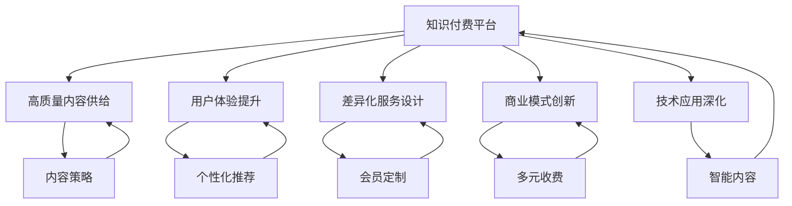

                 

# 知识付费要实现差异化发展,把握市场机会

> 关键词：知识付费,差异化发展,市场机会,用户需求,内容策略,商业模式,技术应用

## 1. 背景介绍

### 1.1 问题由来

随着互联网的普及和智能设备的广泛应用，知识的获取和分享方式正在发生深刻变革。以往通过书籍、报纸、电视等传统媒介传播知识的方式已经不再满足现代用户对信息的海量需求，用户更倾向于通过便捷高效的方式获取信息。同时，知识付费作为一种新兴的商业模式，日益成为教育和文化领域的重要组成部分。

知识付费平台通过提供高价值的知识内容，满足用户快速学习、提升技能的需求。但随着知识付费市场的快速扩展，同质化内容、价格战、用户体验差等问题也逐渐暴露。如何在竞争激烈的行业中实现差异化发展，把握市场机会，成为平台生存和发展的关键。

### 1.2 问题核心关键点

知识付费平台要实现差异化发展，主要需要解决以下几个核心问题：

1. **高质量内容的供给**：内容是知识付费平台的核心，如何持续提供高质量、有价值的内容是平台长期发展的关键。
2. **用户体验的提升**：如何提升用户的使用体验，增强用户的粘性和忠诚度。
3. **差异化服务的设计**：如何设计差异化的服务模式，满足不同用户群体的需求。
4. **商业模式的创新**：如何通过创新的商业模式，提高平台的盈利能力和市场竞争力。
5. **技术应用的深化**：如何结合技术手段，提升内容生产、分发、推荐的效率和效果。

本文将围绕上述核心问题，深入分析知识付费行业面临的挑战和机遇，提出差异化发展的策略和建议。

## 2. 核心概念与联系

### 2.1 核心概念概述

为更好地理解知识付费平台的差异化发展，本节将介绍几个关键概念：

- **知识付费平台(Knowledge-Pay Platforms, KPPs)**：基于互联网技术的知识付费平台，通过订阅、单次付费、包月等多种方式，向用户提供高价值的知识内容。
- **差异化发展(Differentiated Development)**：在激烈的市场竞争中，通过创新内容和产品设计，提供独特且有价值的服务，以满足特定用户群体的需求，实现市场差异化和竞争优势。
- **用户需求(User Needs)**：知识付费平台的核心是用户，了解用户需求并满足其需求是平台成功的基础。
- **内容策略(Content Strategy)**：如何规划和优化内容生产、分发和推荐流程，提升内容质量和用户体验。
- **商业模式(Business Model)**：如何设计合理的收费方式和收益结构，实现平台的可持续发展和盈利。
- **技术应用(Technology Application)**：如何结合先进的技术手段，如大数据、人工智能、区块链等，提高平台的运营效率和安全性。

这些概念之间的逻辑关系可以通过以下Mermaid流程图来展示：



这个流程图展示的知识付费平台的关键概念及其之间的关系：

1. 平台通过高质量内容供给，满足用户学习需求。
2. 通过用户体验提升，增强用户粘性和忠诚度。
3. 设计差异化服务，满足不同用户群体的需求。
4. 通过商业模式创新，实现盈利和持续发展。
5. 结合技术应用，提升运营效率和安全性。

这些概念共同构成了知识付费平台的运营框架，使其能够持续提供有价值的服务，在竞争中脱颖而出。

## 3. 核心算法原理 & 具体操作步骤

### 3.1 算法原理概述

知识付费平台的差异化发展，本质上是一个复杂的系统工程，涉及内容、技术、商业等多个方面的综合优化。其核心思想是：通过构建一个差异化的运营模式，实现对用户需求的高效响应和满足，从而在激烈的市场竞争中取得优势。

形式化地，假设知识付费平台的用户需求为 $U$，平台提供的内容质量为 $C$，用户体验为 $E$，差异化服务为 $S$，商业模式为 $M$，技术应用为 $T$。知识付费平台的差异化发展目标是最小化用户需求与平台供给之间的差异：

$$
\min_{U,C,E,S,M,T} |U-C| + |U-E| + |U-S| + |U-M| + |U-T|
$$

通过上述优化目标，平台可以在内容、技术、商业等多个维度进行全面的优化和创新，从而提升用户的满意度和忠诚度，实现平台的长期发展。

### 3.2 算法步骤详解

基于上述优化目标，知识付费平台的差异化发展可以分为以下几个关键步骤：

**Step 1: 用户需求调研**
- 通过问卷调查、用户反馈、行为数据分析等手段，收集用户需求和痛点。
- 对用户需求进行分类和优先级排序，确定平台的主要目标用户群体。

**Step 2: 内容质量优化**
- 结合用户需求，策划和组织高质量内容生产，引入领域专家和知名作者，提升内容的权威性和可信度。
- 建立内容质量评估体系，通过用户评价和专家评审，筛选和优化内容。

**Step 3: 用户体验提升**
- 对平台界面进行优化，设计简洁、易用、美观的用户界面。
- 引入个性化推荐算法，根据用户的历史行为和偏好，推荐相关内容，提升用户体验。

**Step 4: 差异化服务设计**
- 根据用户需求设计多样化的服务模式，如付费会员、免费公开课、直播课程等，满足不同用户群体的需求。
- 引入多渠道分发，如APP、网页、社交媒体等，提升内容的覆盖面和曝光率。

**Step 5: 商业模式创新**
- 设计多元化的收费模式，如单次付费、包月订阅、众筹等，满足用户不同的付费习惯和需求。
- 引入跨界合作，如与企业、教育机构等合作，共同开发和推广知识内容。

**Step 6: 技术应用深化**
- 引入大数据、人工智能等技术，提升内容的推荐和分发效率，提高运营的自动化水平。
- 采用区块链等技术手段，提升内容的版权保护和交易透明性。

### 3.3 算法优缺点

知识付费平台的差异化发展方法具有以下优点：

1. **用户需求导向**：通过深入调研用户需求，能够提供更加贴近用户实际需求的高质量内容和服务。
2. **市场竞争力强**：通过多维度的差异化设计，能够在激烈的市场竞争中脱颖而出，提升品牌影响力和市场份额。
3. **用户粘性高**：通过提升用户体验和服务质量，增强用户的满意度和忠诚度，提升平台的长期价值。

同时，该方法也存在一定的局限性：

1. **资源投入大**：在内容质量提升、用户体验优化、技术应用深化等方面需要大量资源投入。
2. **市场风险高**：创新内容和商业模式存在不确定性，可能面临市场接受度和用户认可度不足的问题。
3. **技术要求高**：结合技术手段提升运营效率和安全性，需要较高的技术能力和资金支持。

尽管存在这些局限性，但就目前而言，差异化发展策略仍然是知识付费平台在激烈的市场竞争中实现长期发展的关键。

### 3.4 算法应用领域

知识付费平台的差异化发展方法在多个领域得到了广泛应用，例如：

- **教育培训**：通过引入名师讲授、互动直播、个性化学习推荐等差异化服务，提升在线教育的效果和用户满意度。
- **职业技能培训**：提供行业前沿、实战经验丰富的课程内容，帮助用户提升职业技能。
- **文化娱乐**：提供深度解读、幕后花絮、互动问答等差异化内容，提升用户的娱乐体验和文化素养。
- **健康医疗**：提供权威健康知识、医生在线咨询、个性化健康管理等服务，满足用户对健康知识的渴求。
- **科技知识**：提供前沿科技动态、专家解读、技术应用案例等差异化内容，提升用户的科技素养和创新能力。

除了上述这些经典应用领域外，知识付费平台的差异化发展策略还将拓展到更多场景中，如企业内训、旅游攻略、法律咨询等，为各行各业带来新的服务模式和价值提升。

## 4. 数学模型和公式 & 详细讲解 & 举例说明

### 4.1 数学模型构建

本节将使用数学语言对知识付费平台的差异化发展进行更加严格的刻画。

假设知识付费平台的用户需求为 $U$，平台提供的内容质量为 $C$，用户体验为 $E$，差异化服务为 $S$，商业模式为 $M$，技术应用为 $T$。我们定义平台的目标函数为：

$$
\mathcal{L}(U,C,E,S,M,T) = \alpha \cdot |U-C| + \beta \cdot |U-E| + \gamma \cdot |U-S| + \delta \cdot |U-M| + \epsilon \cdot |U-T|
$$

其中 $\alpha,\beta,\gamma,\delta,\epsilon$ 为不同的权重系数，用于平衡不同维度的重要性。

### 4.2 公式推导过程

为了更好地理解上述目标函数，我们可以将其分解为五个部分：

1. **内容质量优化**：

$$
|U-C| = \sum_{i=1}^{n} |U_i - C_i|
$$

其中 $U_i$ 和 $C_i$ 分别表示第 $i$ 个用户需求和平台提供的内容质量，$n$ 表示用户需求的数量。

2. **用户体验提升**：

$$
|U-E| = \sum_{i=1}^{n} |U_i - E_i|
$$

其中 $E_i$ 表示第 $i$ 个用户需求对应的用户体验，$n$ 表示用户需求的数量。

3. **差异化服务设计**：

$$
|U-S| = \sum_{i=1}^{n} |U_i - S_i|
$$

其中 $S_i$ 表示第 $i$ 个用户需求对应的差异化服务，$n$ 表示用户需求的数量。

4. **商业模式创新**：

$$
|U-M| = \sum_{i=1}^{n} |U_i - M_i|
$$

其中 $M_i$ 表示第 $i$ 个用户需求对应的商业模式，$n$ 表示用户需求的数量。

5. **技术应用深化**：

$$
|U-T| = \sum_{i=1}^{n} |U_i - T_i|
$$

其中 $T_i$ 表示第 $i$ 个用户需求对应的技术应用，$n$ 表示用户需求的数量。

### 4.3 案例分析与讲解

以某知识付费平台为例，分析其通过差异化发展策略提升用户满意度和忠诚度的过程：

- **用户调研**：平台通过问卷调查收集了1000名用户的反馈，发现用户最关心的是内容的权威性和实用性。
- **内容优化**：平台邀请10位行业专家，策划并制作了20个高质量视频课程，提升了内容的权威性和实用性。
- **用户体验**：平台优化了用户界面设计，引入个性化推荐算法，提升了用户的使用体验。
- **差异化服务**：平台推出了付费会员制度，提供专属内容推荐和客服支持，增强了用户的粘性。
- **商业模式**：平台设计了多元化的收费模式，包括单次付费、包月订阅、直播课程等，满足不同用户群体的需求。
- **技术应用**：平台引入大数据分析技术，提升内容的推荐效率，并采用区块链技术保护内容版权。

通过上述差异化发展策略，平台显著提升了用户满意度和忠诚度，市场份额和收入也显著增长。

## 5. 项目实践：代码实例和详细解释说明

### 5.1 开发环境搭建

在进行知识付费平台开发前，我们需要准备好开发环境。以下是使用Python进行Django开发的环境配置流程：

1. 安装Anaconda：从官网下载并安装Anaconda，用于创建独立的Python环境。

2. 创建并激活虚拟环境：
```bash
conda create -n django-env python=3.8 
conda activate django-env
```

3. 安装Django：
```bash
pip install django
```

4. 安装其他必要的库：
```bash
pip install django-crispy-forms django-ckeditor-django 
```

5. 安装SQLite数据库：
```bash
pip install django-db-backend-sqlite3
```

完成上述步骤后，即可在`django-env`环境中开始知识付费平台的开发。

### 5.2 源代码详细实现

下面是一个简单的知识付费平台用户注册功能实现，代码使用Python和Django框架。

首先，定义User模型和注册表单：

```python
from django.contrib.auth.models import AbstractUser
from django import forms

class User(AbstractUser):
    pass

class RegistrationForm(forms.ModelForm):
    password1 = forms.CharField(label='Password', widget=forms.PasswordInput)
    password2 = forms.CharField(label='Password Confirmation', widget=forms.PasswordInput)

    class Meta:
        model = User
        fields = ['email', 'password1', 'password2']
```

然后，定义用户注册视图和模板：

```python
from django.shortcuts import render, redirect
from django.contrib.auth.forms import UserCreationForm
from django.contrib.auth import login

def register(request):
    if request.method == 'POST':
        form = UserCreationForm(request.POST)
        if form.is_valid():
            user = form.save()
            login(request, user)
            return redirect('home')
    else:
        form = UserCreationForm()

    return render(request, 'registration/register.html', {'form': form})
```

最后，编写用户注册视图和模板：

```html
<!-- registration/register.html -->
<form method="post">
    
    {{ form.as_p }}
    <button type="submit">Register</button>
</form>
```

### 5.3 代码解读与分析

让我们再详细解读一下关键代码的实现细节：

**User模型**：
- 继承自Django自带的`AbstractUser`模型，可以自定义用户属性和行为。

**注册表单**：
- 定义了两个密码字段，用于验证用户输入的密码是否一致。
- 使用`forms.ModelForm`封装用户注册数据，通过`Meta`类指定模型和字段。

**注册视图**：
- 判断请求方法，如果是POST请求，则创建用户并登录。
- 如果是GET请求，则渲染注册表单页面。

**注册模板**：
- 使用``标签防止CSRF攻击。
- 通过`form.as_p`渲染表单，方便展示。

通过上述代码实现，用户注册功能得以完成。可以看到，Django框架提供了强大的工具和模板引擎，可以大大简化Web应用的开发过程。

当然，实际应用中还需要考虑更多因素，如用户认证、权限管理、数据存储等。但核心的差异化发展策略可以从中得到借鉴。

## 6. 实际应用场景

### 6.1 智能培训平台

知识付费平台在教育培训领域的应用非常广泛。传统的培训方式往往依赖于线下教学，受时间和空间的限制，难以满足用户的学习需求。智能培训平台通过提供高质量的在线课程、互动直播、个性化推荐等功能，使得学习更加灵活高效。

以某在线教育平台为例，通过引入名师讲授、互动直播、个性化学习推荐等差异化服务，显著提升了用户的参与度和满意度。平台通过用户调研和数据分析，不断优化内容质量和用户体验，实现了平台的快速增长和品牌影响力的提升。

### 6.2 企业内训系统

企业内训系统是知识付费平台在企业内训领域的典型应用。传统内训往往需要高昂的成本和复杂的管理，且效果难以量化评估。通过知识付费平台，企业可以快速搭建内训系统，引入行业专家和先进理念，提升员工技能和企业的竞争力。

某大型企业通过引入知识付费平台的差异化服务，提供在线课程、专家咨询、内部交流等功能，显著提升了员工的学习效果和企业的运营效率。平台通过数据驱动的个性化推荐，确保了培训内容的精准性和有效性。

### 6.3 健康管理平台

健康管理平台是知识付费平台在健康医疗领域的创新应用。传统健康管理往往依赖于线下的医疗机构和专业人员，难以实现个性化和动态化的管理。通过知识付费平台，用户可以获取权威的健康知识、在线咨询和个性化健康管理方案。

某健康管理平台通过引入医生在线咨询、个性化健康管理等服务，显著提升了用户的健康意识和健康管理能力。平台通过用户调研和数据分析，不断优化内容和推荐算法，确保了平台服务的质量和用户满意度。

### 6.4 未来应用展望

随着知识付费平台的发展，未来其在更多领域的创新应用也将不断涌现。以下是几个具有潜力的应用场景：

1. **职业发展**：知识付费平台可以通过提供职业规划、技能培训、职场沟通技巧等服务，帮助用户实现职业发展。

2. **家庭生活**：平台可以通过提供育儿指导、健康生活、家庭理财等服务，帮助用户提升生活质量。

3. **旅行探险**：平台可以通过提供目的地介绍、旅游攻略、语言学习等服务，帮助用户实现旅行梦想。

4. **文化娱乐**：平台可以通过提供电影评论、音乐赏析、艺术导览等服务，丰富用户的文化生活。

5. **科技创新**：平台可以通过提供前沿科技动态、技术应用案例等服务，提升用户的科技素养和创新能力。

总之，知识付费平台作为一种新兴的商业模式，其应用领域和价值将随着技术的发展和社会的进步而不断扩展。

## 7. 工具和资源推荐

### 7.1 学习资源推荐

为了帮助开发者系统掌握知识付费平台的差异化发展，这里推荐一些优质的学习资源：

1. **《知识付费平台实战》系列博文**：由知识付费平台技术专家撰写，深入浅出地介绍了知识付费平台的技术架构和实现细节。

2. **Coursera《知识付费平台设计与运营》课程**：由知名教育机构开设的课程，系统讲解了知识付费平台的运营策略和商业模式。

3. **《知识付费平台：创新与实践》书籍**：介绍知识付费平台的核心技术和商业模式，结合实际案例进行讲解。

4. **Medium《知识付费平台的崛起与挑战》系列文章**：通过作者的实际经验，分享了知识付费平台的发展历程和未来趋势。

5. **LinkedIn《知识付费平台的成功要素》文章**：文章总结了知识付费平台的成功要素和关键策略，值得借鉴。

通过对这些资源的学习实践，相信你一定能够全面掌握知识付费平台的差异化发展策略，并将其应用于实际项目中。

### 7.2 开发工具推荐

高效的开发离不开优秀的工具支持。以下是几款用于知识付费平台开发的常用工具：

1. Django：基于Python的开源Web框架，功能强大，易于扩展，适合快速迭代和开发。

2. Flask：基于Python的开源Web框架，轻量级且灵活，适合小型应用和微服务架构。

3. PyCharm：专业的Python IDE，支持代码高亮、调试、测试等功能，适合Python开发。

4. Visual Studio Code：开源的跨平台编辑器，支持多种编程语言和扩展，适合快速开发。

5. Git：版本控制系统，支持协作开发和代码版本管理，适合团队开发。

合理利用这些工具，可以显著提升知识付费平台的开发效率，加快创新迭代的步伐。

### 7.3 相关论文推荐

知识付费平台的发展源于学界的持续研究。以下是几篇奠基性的相关论文，推荐阅读：

1. **《知识付费平台的用户行为研究》**：研究知识付费平台用户的行为模式和需求，为平台内容优化提供了理论基础。

2. **《知识付费平台的内容推荐算法》**：介绍了一种基于协同过滤的个性化推荐算法，用于提升平台的用户体验和粘性。

3. **《知识付费平台的商业模式创新》**：分析了知识付费平台的多种收费模式和收益结构，为平台商业策略提供了指导。

4. **《知识付费平台的技术应用》**：介绍了知识付费平台在数据处理、人工智能、区块链等技术方面的应用，为平台的运营效率和安全保障提供了保障。

这些论文代表了大语言模型微调技术的发展脉络。通过学习这些前沿成果，可以帮助研究者把握学科前进方向，激发更多的创新灵感。

## 8. 总结：未来发展趋势与挑战

### 8.1 总结

本文对知识付费平台的差异化发展方法进行了全面系统的介绍。首先阐述了知识付费平台在激烈的市场竞争中面临的挑战和机遇，明确了平台成功发展的关键要素。其次，从原理到实践，详细讲解了差异化发展的数学模型和关键步骤，给出了平台开发的完整代码实例。同时，本文还广泛探讨了知识付费平台在多个领域的应用前景，展示了其广阔的发展空间。

通过本文的系统梳理，可以看到，知识付费平台作为一种新兴的商业模式，通过差异化发展策略在多个行业领域实现了快速发展和创新应用。未来，随着技术的发展和社会的进步，知识付费平台将迎来更加广阔的应用场景，为用户的知识获取和技能提升提供更加便捷高效的服务。

### 8.2 未来发展趋势

展望未来，知识付费平台的差异化发展将呈现以下几个趋势：

1. **技术融合**：知识付费平台将与其他人工智能技术进行更深层次的融合，如语音识别、自然语言处理、增强现实等，提升用户体验和内容质量。

2. **数据驱动**：平台将更加依赖数据驱动的决策，通过大数据分析、机器学习等技术手段，实现内容推荐、用户画像、市场预测等功能。

3. **服务多样**：平台将提供更加多样化的服务模式，如虚拟导师、社交互动、共享经济等，满足不同用户群体的需求。

4. **平台合作**：平台将加强与其他企业和机构的合作，通过内容共享、技术合作等方式，扩大服务的覆盖范围和影响力。

5. **国际化**：平台将面向全球用户提供服务，通过本地化内容和国际化运营，拓展国际市场和用户群体。

这些趋势将推动知识付费平台向更加智能化、个性化和全球化的方向发展，为用户带来更加丰富和便捷的服务体验。

### 8.3 面临的挑战

尽管知识付费平台的发展前景广阔，但在迈向更加智能化、普适化应用的过程中，它仍面临着诸多挑战：

1. **内容质量控制**：如何确保内容的质量和真实性，避免虚假信息和低质量内容对用户造成误导。

2. **用户体验提升**：如何提升平台的用户体验，尤其是在多终端、多设备环境下，保证良好的用户体验。

3. **市场竞争激烈**：如何在激烈的市场竞争中脱颖而出，通过差异化策略和创新内容赢得用户。

4. **商业模式可持续**：如何设计可持续的商业模式，避免过度依赖单一收入来源，确保平台的长期发展。

5. **技术安全性**：如何保障平台的数据安全和用户隐私，防止数据泄露和网络攻击。

6. **政策法规合规**：如何在政策法规框架内运营，避免违规操作和法律风险。

解决这些挑战，需要平台在技术、市场、法律等多方面进行全面优化和创新。

### 8.4 研究展望

面对知识付费平台面临的诸多挑战，未来的研究需要在以下几个方面寻求新的突破：

1. **内容质量保障**：引入内容审核机制和社区监管机制，提升内容质量，增强用户信任。

2. **用户体验优化**：引入用户体验设计（UX）理念，设计更加友好、高效的用户界面和交互体验。

3. **商业模式的创新**：探索新的商业模式，如订阅+增值服务、众筹+版权分成等，提升平台的盈利能力和用户粘性。

4. **技术应用的深化**：引入先进的技术手段，如大数据分析、人工智能、区块链等，提升平台的运营效率和安全性。

5. **市场推广策略**：制定精准的市场推广策略，通过社交媒体、口碑营销等方式，提升平台知名度和用户增长率。

6. **政策法规的遵守**：加强政策法规的遵守，确保平台的合法合规运营，避免法律风险。

这些研究方向将推动知识付费平台向更加成熟和稳健的方向发展，为用户的知识获取和技能提升提供更加稳定和可靠的服务。总之，知识付费平台作为一种新兴的商业模式，其差异化发展策略在未来将持续发挥重要作用，推动教育和文化产业的创新和进步。

## 9. 附录：常见问题与解答

**Q1：知识付费平台如何设计合理的收费模式？**

A: 知识付费平台的收费模式设计需要考虑用户的多样化需求和平台的盈利目标。常见的收费模式包括：

1. **单次付费**：用户支付单次费用获取课程内容，适合价格较低、一次性需求的课程。
2. **包月订阅**：用户按月支付固定费用获取所有课程内容，适合价格较高、长期需求的课程。
3. **单课付费**：用户根据具体课程支付费用，适合优质课程和长尾需求。
4. **会员制**：用户支付会员费，获取所有课程和增值服务，适合平台盈利能力较强的情况。
5. **众筹模式**：用户共同出资支持某课程的制作和推广，适合长周期、高成本的课程开发。

选择合适的收费模式需要根据平台定位、课程特点和用户需求进行综合考虑，并不断优化和调整。

**Q2：知识付费平台如何进行用户行为分析？**

A: 知识付费平台可以通过以下方法进行用户行为分析：

1. **数据收集**：通过平台日志、用户注册信息、学习记录等数据，收集用户行为数据。
2. **数据清洗**：对收集的数据进行清洗和预处理，去除噪音和异常数据。
3. **数据分析**：使用数据挖掘和机器学习技术，对用户行为数据进行分析，发现用户兴趣和需求。
4. **用户画像**：根据分析结果，建立用户画像，描述用户的基本特征和行为偏好。
5. **个性化推荐**：基于用户画像，设计个性化推荐算法，提升用户粘性和满意度。

通过系统化的用户行为分析，知识付费平台可以更好地了解用户需求，优化内容质量和用户体验，提升平台的市场竞争力。

**Q3：知识付费平台如何进行内容质量控制？**

A: 知识付费平台可以通过以下方法进行内容质量控制：

1. **专家评审**：邀请行业专家对内容进行评审，确保内容的权威性和准确性。
2. **用户评价**：通过用户评价系统，收集用户对内容的反馈，及时发现和解决质量问题。
3. **内容审核**：建立内容审核机制，对内容进行审核，防止虚假信息和低质量内容。
4. **版权保护**：采用版权保护技术，如数字水印、区块链等，确保内容版权和传播安全。
5. **社区监管**：建立社区监管机制，通过用户举报和社区审核，确保内容质量。

通过多层次的内容质量控制措施，知识付费平台可以确保内容的真实性和高质量，增强用户信任和平台声誉。

**Q4：知识付费平台如何进行技术应用深化？**

A: 知识付费平台可以通过以下方法进行技术应用深化：

1. **大数据分析**：利用大数据技术，对用户行为和市场数据进行分析，优化内容推荐和市场策略。
2. **人工智能**：引入人工智能技术，提升内容的生成和推荐效果，如自然语言处理、计算机视觉等。
3. **区块链**：采用区块链技术，保护内容的版权和交易透明性，确保内容安全和可靠。
4. **云计算**：利用云计算技术，提升平台的计算和存储能力，实现高可扩展性。
5. **边缘计算**：引入边缘计算技术，提升内容的实时处理和分发效率，减少延迟和带宽压力。

通过深度结合先进技术，知识付费平台可以实现运营效率和用户满意度的双提升。

这些研究方向将推动知识付费平台向更加成熟和稳健的方向发展，为用户的知识获取和技能提升提供更加稳定和可靠的服务。总之，知识付费平台作为一种新兴的商业模式，其差异化发展策略在未来将持续发挥重要作用，推动教育和文化产业的创新和进步。

---

作者：禅与计算机程序设计艺术 / Zen and the Art of Computer Programming

