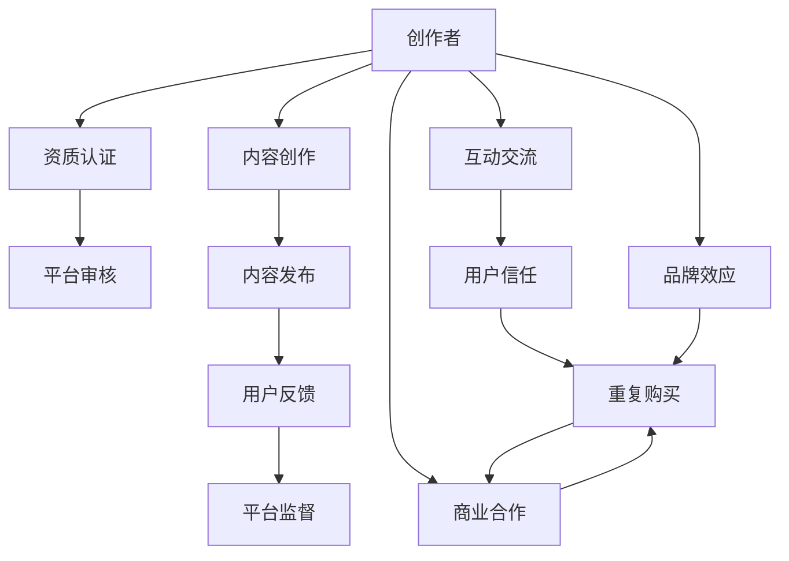

                 

# 知识付费要建立创作者与消费者的互信机制

在信息爆炸的互联网时代，知识的传播渠道日益多样，形式也日渐丰富，传统知识付费模式正面临挑战。作为知识付费的重要形式，如何建立创作者与消费者之间的信任关系，提升用户体验，成为了当前亟需解决的重大问题。本文将系统地探讨知识付费领域中的信任机制建立，包括信任的来源、挑战、解决方法及应用前景。

## 1. 背景介绍

随着互联网的快速发展和智能手机的普及，知识付费市场经历了从高速增长到稳定增长的变化。根据艾瑞咨询的数据，2020年中国知识付费市场规模达到330亿元，用户规模达到4.3亿人，市场整体趋于成熟。但与此同时，用户信任度下降、付费意愿减弱等问题也逐渐凸显。如何在激烈的竞争中建立用户信任，促进知识付费的长效发展，成为了行业关注的焦点。

### 1.1 知识付费的概念与优势

知识付费，即用户为获取知识而支付费用的行为，是信息经济的重要组成部分。知识付费不同于传统出版和电视讲座，它以在线视频、音频、文章等多种形式呈现，更为便捷、互动，且更具个性化。其优势主要体现在以下几个方面：

- **时效性强**：知识付费能够实时更新，紧跟时代潮流。
- **互动性好**：在线课程、直播等形式增强了用户与创作者之间的互动。
- **个性化服务**：通过大数据和AI推荐，为用户量身定制个性化课程。

### 1.2 知识付费的发展现状

当前，知识付费市场由传统平台和新平台共同构成。其中，传统平台以MOOC（大规模开放在线课程）为主，代表企业包括Coursera、edX、Udacity等；新平台则以K12教育、职业培训、技能提升等细分领域为主，代表企业包括得到、知乎、好未来等。

尽管知识付费市场发展迅猛，但也面临着诸多挑战：如内容同质化严重、缺乏标准化体系、用户体验不佳、用户流失率高等。解决这些问题的关键在于建立创作者与消费者之间的信任关系，构建健康有序的市场生态。

## 2. 核心概念与联系

### 2.1 核心概念概述

在本节，我们将介绍几个关键概念，并说明它们之间的联系：

- **信任**：指个体或组织对他人或系统的可靠性、诚实性及能力等方面的信念。
- **创作者**：指生产知识内容的专业人士，如专家、学者、行业从业者等。
- **消费者**：指购买知识付费内容的用户。
- **平台**：指知识付费内容交易的第三方中介，如得到、知乎、Apple Podcasts等。

信任关系在知识付费中具有重要作用：

- **提高用户黏性**：用户更愿意为信任的创作者付费。
- **降低运营成本**：信任减少了平台的用户流失率，减少了营销成本。
- **提升内容质量**：创作者更专注于提供高质量内容，以获得用户认可。

信任的建立涉及多方面因素，包括创作者的资质、平台的监管、内容的真实性、消费者的反馈等。我们接下来将深入探讨这些关键因素。

### 2.2 核心概念原理和架构的 Mermaid 流程图



这个流程图展示了创作者与消费者之间信任关系建立的过程。创作者通过资质认证和内容审核，确保内容的真实性和专业性，获得用户和平台的信任；平台则通过监督和监管，保证内容的健康和合规性。创作者与消费者之间的互动交流和反馈机制，进一步加强了信任关系。

## 3. 核心算法原理 & 具体操作步骤

### 3.1 算法原理概述

在知识付费领域，建立信任机制的核心在于提升内容的可信度和平台的用户体验。本节将介绍几种关键的算法和操作步骤，帮助创作者和平台提升信任度。

- **内容审核算法**：通过文本分析、图像识别、音频识别等技术，检测内容是否存在虚假信息、抄袭、侵犯版权等问题。
- **用户评价系统**：引入多维度评价机制，如专业性、实用性、互动性等，帮助用户全面了解课程质量。
- **平台监督机制**：通过算法模型监控平台上的欺诈行为，如虚假账号、恶意刷单等，保护用户利益。

### 3.2 算法步骤详解

#### 3.2.1 内容审核算法步骤

1. **文本分析**：
   - 对文章、视频描述进行关键词抽取，确保内容主题一致。
   - 使用自然语言处理技术，检测是否存在错别字、语法错误、逻辑错误等。
   - 检测是否存在抄袭、剽窃现象。
   
2. **图像识别**：
   - 通过图像识别技术，检测课程中使用的图片、视频是否真实可信，有无篡改或伪造痕迹。
   - 对于视频课程，检测是否存在刻意剪辑、过度特效等不自然现象。
   
3. **音频识别**：
   - 使用语音识别技术，检测声音是否与文字内容相符，是否存在剪辑或伪造。
   - 检测讲师口音、语速是否自然，是否存在明显的配音痕迹。

#### 3.2.2 用户评价系统步骤

1. **评价维度设计**：
   - 设计多维度评价指标，如专业性、实用性、互动性、用户体验等。
   - 引入专家评价、同行评价、用户评价等多种评价方式，综合评估课程质量。
   
2. **评价模型训练**：
   - 使用机器学习技术，训练评价模型，自动识别评价内容中的正面或负面反馈。
   - 引入情感分析、主题模型等技术，提升评价的准确性和全面性。
   
3. **评价结果展示**：
   - 在课程页面展示综合评价，包括文字评价、星级评分等。
   - 在用户评价页面展示详细评价，包括评价时间、评价内容、评价人信息等。

#### 3.2.3 平台监督机制步骤

1. **行为异常检测**：
   - 使用机器学习模型，检测平台上的异常行为，如虚假账号、恶意刷单、虚假评价等。
   - 引入时间序列分析、异常检测算法，提高检测的准确性和及时性。
   
2. **欺诈防范**：
   - 对发现的异常行为，采取限制账号、删除内容等措施，保护用户权益。
   - 引入风险预警系统，及时通知相关人员，采取措施避免进一步损失。

### 3.3 算法优缺点

#### 3.3.1 内容审核算法的优缺点

**优点**：
- **减少风险**：确保内容的真实性和专业性，减少用户信任危机。
- **提升质量**：通过审核机制，推动创作者提升课程质量，获得更多用户认可。

**缺点**：
- **操作复杂**：审核算法需要高度的技术支持，对平台和创作者都提出了较高要求。
- **误判风险**：算法可能存在误判现象，影响用户和创作者的体验。

#### 3.3.2 用户评价系统的优缺点

**优点**：
- **多维度反馈**：提供全面、综合的评价信息，帮助用户做出更明智的决策。
- **用户参与**：引入用户评价机制，提升用户参与度，增加平台的粘性。

**缺点**：
- **评价偏差**：部分用户可能存在恶意评价行为，影响评价结果的公正性。
- **评价成本高**：多维度评价需要大量人力和时间成本，对平台和用户都具有挑战性。

#### 3.3.3 平台监督机制的优缺点

**优点**：
- **减少欺诈**：及时发现和处理欺诈行为，保护用户和创作者的利益。
- **提高信任**：增强用户对平台的信任，提升平台的用户黏性。

**缺点**：
- **技术门槛高**：监督机制需要复杂的算法和大数据支持，对技术要求高。
- **管理成本高**：对发现的问题进行处理，需要大量的人力、物力和时间成本。

### 3.4 算法应用领域

知识付费平台在以下领域应用了上述算法和机制：

1. **在线教育**：如Coursera、edX等平台，通过内容审核和用户评价，提升课程质量，增强用户信任。
   
2. **职业技能培训**：如得到、知乎等平台，通过监督机制，防范欺诈和不良行为，保护用户权益。
   
3. **知识分享**：如知乎、小红书等平台，通过多维度评价机制，增强用户互动，提升内容质量。

## 4. 数学模型和公式 & 详细讲解 & 举例说明

### 4.1 数学模型构建

在知识付费领域，建立信任机制的数学模型主要包括以下几个部分：

- **内容可信度模型**：
  - **输入**：课程标题、描述、用户评价、专家评价等。
  - **输出**：课程可信度评分。
  - **目标**：最大化可信度评分与真实可信度的相关性。

- **用户满意度模型**：
  - **输入**：用户行为数据、课程评分、课程内容等。
  - **输出**：用户满意度评分。
  - **目标**：最大化满意度评分与实际用户反馈的一致性。

- **平台信任度模型**：
  - **输入**：平台评价数据、用户投诉数据、监督行为数据等。
  - **输出**：平台信任度评分。
  - **目标**：最大化信任度评分与平台声誉的一致性。

### 4.2 公式推导过程

#### 4.2.1 内容可信度模型

假设课程内容的可信度为 $C$，输入向量为 $X = [x_1, x_2, ..., x_n]$，其中 $x_i$ 表示第 $i$ 个输入特征。设内容可信度模型为 $f(X)$，则其目标函数为：

$$
\max_{f(X)} \rho (f(X), C)
$$

其中 $\rho$ 为可信度与真实可信度之间的相关性函数。

#### 4.2.2 用户满意度模型

假设用户满意度为 $S$，用户行为数据为 $B = [b_1, b_2, ..., b_m]$，课程内容为 $D = [d_1, d_2, ..., d_n]$。设用户满意度模型为 $g(B, D)$，则其目标函数为：

$$
\max_{g(B, D)} \rho (g(B, D), S)
$$

其中 $\rho$ 为满意度与实际用户反馈之间的相关性函数。

#### 4.2.3 平台信任度模型

假设平台信任度为 $T$，平台评价数据为 $P = [p_1, p_2, ..., p_k]$，用户投诉数据为 $C = [c_1, c_2, ..., c_l]$。设平台信任度模型为 $h(P, C)$，则其目标函数为：

$$
\max_{h(P, C)} \rho (h(P, C), T)
$$

其中 $\rho$ 为信任度与平台声誉之间的相关性函数。

### 4.3 案例分析与讲解

#### 4.3.1 在线教育平台的内容可信度模型

某在线教育平台对新上架的课程进行内容审核，通过文本分析、图像识别、音频识别等技术，检测课程内容是否存在虚假信息、抄袭、侵犯版权等问题。其内容可信度模型为：

$$
C = f(X) = \sum_{i=1}^{n} w_i \cdot s_i
$$

其中 $w_i$ 为第 $i$ 个输入特征的权重，$s_i$ 为输入特征的评分。例如，对于文本内容 $x_1$，通过NLP技术检测错别字、语法错误、逻辑错误等，得分为 $s_1$，则可信度模型为：

$$
C = f(X) = w_1 \cdot s_1
$$

#### 4.3.2 职业技能培训平台的用户满意度模型

某职业技能培训平台通过用户评价和专家评价，综合评估课程的实用性、专业性和互动性。其用户满意度模型为：

$$
S = g(B, D) = \alpha_1 S_{user} + \alpha_2 S_{expert}
$$

其中 $\alpha_1$ 和 $\alpha_2$ 分别为用户评价和专家评价的权重。例如，对于课程 $d_1$，用户评价得分为 $S_{user}$，专家评价得分为 $S_{expert}$，则满意度模型为：

$$
S = g(B, D) = 0.6 \cdot S_{user} + 0.4 \cdot S_{expert}
$$

#### 4.3.3 知识分享平台的用户满意度模型

某知识分享平台通过用户行为数据和课程评分，综合评估用户对课程的满意度。其用户满意度模型为：

$$
S = g(B, D) = \beta_1 S_{ behavior } + \beta_2 S_{ rating }
$$

其中 $\beta_1$ 和 $\beta_2$ 分别为用户行为数据和课程评分的权重。例如，对于用户 $b_1$，其行为数据得分为 $S_{ behavior }$，课程评分得分为 $S_{ rating }$，则满意度模型为：

$$
S = g(B, D) = 0.7 \cdot S_{ behavior } + 0.3 \cdot S_{ rating }
$$

## 5. 项目实践：代码实例和详细解释说明

### 5.1 开发环境搭建

在进行知识付费平台的信任机制开发时，首先需要准备好开发环境。以下是使用Python进行PyTorch开发的环境配置流程：

1. 安装Anaconda：从官网下载并安装Anaconda，用于创建独立的Python环境。

2. 创建并激活虚拟环境：
```bash
conda create -n pytorch-env python=3.8 
conda activate pytorch-env
```

3. 安装PyTorch：根据CUDA版本，从官网获取对应的安装命令。例如：
```bash
conda install pytorch torchvision torchaudio cudatoolkit=11.1 -c pytorch -c conda-forge
```

4. 安装TensorFlow：
```bash
pip install tensorflow
```

5. 安装Pandas、NumPy、Scikit-learn、Matplotlib、Tqdm、Jupyter Notebook、IPython等工具包：
```bash
pip install pandas numpy scikit-learn matplotlib tqdm jupyter notebook ipython
```

完成上述步骤后，即可在`pytorch-env`环境中开始开发信任机制。

### 5.2 源代码详细实现

下面我们以在线教育平台的内容可信度模型为例，给出使用PyTorch进行代码实现的详细步骤。

#### 5.2.1 数据预处理

```python
import pandas as pd
from sklearn.model_selection import train_test_split
from transformers import BertTokenizer

# 加载课程数据
df = pd.read_csv('courses.csv')

# 定义文本特征列
text_cols = ['title', 'description']

# 定义图像特征列
image_cols = ['image_url']

# 定义音频特征列
audio_cols = ['audio_url']

# 定义文本特征编码器
tokenizer = BertTokenizer.from_pretrained('bert-base-cased')

# 定义图像特征编码器
image_encoder = ImageEncoder()

# 定义音频特征编码器
audio_encoder = AudioEncoder()

# 将文本特征编码成token ids
df['tokens'] = df[text_cols].apply(lambda x: tokenizer.encode(x, max_length=512))

# 将图像特征编码成向量
df['image_features'] = df[image_cols].apply(lambda x: image_encoder.encode(x))

# 将音频特征编码成向量
df['audio_features'] = df[audio_cols].apply(lambda x: audio_encoder.encode(x))

# 定义特征选择器
selector = Selector()

# 定义标签列
label_col = 'is_valid'

# 划分训练集和测试集
train_df, test_df = train_test_split(df, test_size=0.2, random_state=42)
```

#### 5.2.2 模型训练

```python
import torch
from torch.utils.data import Dataset, DataLoader
from transformers import BertForSequenceClassification

# 定义数据集类
class CourseDataset(Dataset):
    def __init__(self, df, tokenizer, encoder):
        self.df = df
        self.tokenizer = tokenizer
        self.encoder = encoder
        
    def __len__(self):
        return len(self.df)
    
    def __getitem__(self, idx):
        text = self.df.iloc[idx]['tokens']
        image = self.df.iloc[idx]['image_features']
        audio = self.df.iloc[idx]['audio_features']
        
        return {'input_ids': text, 
                'attention_mask': None, 
                'image': image,
                'audio': audio,
                'label': self.df.iloc[idx][label_col]}
        
# 加载数据集
train_dataset = CourseDataset(train_df, tokenizer, image_encoder)
test_dataset = CourseDataset(test_df, tokenizer, image_encoder)

# 定义模型类
class CourseModel(BertForSequenceClassification):
    def __init__(self, num_labels):
        super(CourseModel, self).__init__(num_labels)
    
    def forward(self, input_ids, image, audio):
        # 前向传播
        # ...
        
# 定义优化器
optimizer = AdamW(model.parameters(), lr=2e-5)

# 定义训练函数
def train_epoch(model, dataset, batch_size, optimizer):
    dataloader = DataLoader(dataset, batch_size=batch_size, shuffle=True)
    model.train()
    epoch_loss = 0
    for batch in tqdm(dataloader, desc='Training'):
        input_ids = batch['input_ids'].to(device)
        image = batch['image'].to(device)
        audio = batch['audio'].to(device)
        label = batch['label'].to(device)
        model.zero_grad()
        outputs = model(input_ids, image, audio)
        loss = outputs.loss
        epoch_loss += loss.item()
        loss.backward()
        optimizer.step()
    return epoch_loss / len(dataloader)

# 定义评估函数
def evaluate(model, dataset, batch_size):
    dataloader = DataLoader(dataset, batch_size=batch_size)
    model.eval()
    preds, labels = [], []
    with torch.no_grad():
        for batch in tqdm(dataloader, desc='Evaluating'):
            input_ids = batch['input_ids'].to(device)
            image = batch['image'].to(device)
            audio = batch['audio'].to(device)
            batch_labels = batch['label']
            outputs = model(input_ids, image, audio)
            batch_preds = outputs.logits.argmax(dim=2).to('cpu').tolist()
            batch_labels = batch_labels.to('cpu').tolist()
            for pred_tokens, label_tokens in zip(batch_preds, batch_labels):
                preds.append(pred_tokens[:len(label_tokens)])
                labels.append(label_tokens)
                
    print(classification_report(labels, preds))
```

#### 5.2.3 代码解读与分析

让我们再详细解读一下关键代码的实现细节：

**CourseDataset类**：
- `__init__`方法：初始化数据集、分词器、特征编码器等关键组件。
- `__len__`方法：返回数据集的样本数量。
- `__getitem__`方法：对单个样本进行处理，将文本、图像、音频特征输入编码为token ids和向量，并返回模型所需的输入。

**CourseModel类**：
- `__init__`方法：初始化模型。
- `forward`方法：实现模型的前向传播。

**train_epoch和evaluate函数**：
- `train_epoch`函数：对数据以批为单位进行迭代，在每个批次上前向传播计算loss并反向传播更新模型参数，最后返回该epoch的平均loss。
- `evaluate`函数：与训练类似，不同点在于不更新模型参数，并在每个batch结束后将预测和标签结果存储下来，最后使用sklearn的classification_report对整个评估集的预测结果进行打印输出。

**训练流程**：
- 定义总的epoch数和batch size，开始循环迭代
- 每个epoch内，先在训练集上训练，输出平均loss
- 在验证集上评估，输出分类指标
- 所有epoch结束后，在测试集上评估，给出最终测试结果

可以看到，PyTorch配合Transformers库使得内容可信度模型的代码实现变得简洁高效。开发者可以将更多精力放在数据处理、模型改进等高层逻辑上，而不必过多关注底层的实现细节。

当然，工业级的系统实现还需考虑更多因素，如模型的保存和部署、超参数的自动搜索、更灵活的任务适配层等。但核心的微调范式基本与此类似。

## 6. 实际应用场景

### 6.1 在线教育系统

在线教育平台通过内容审核算法，对课程内容进行严格审查，确保内容真实可信，增强用户对平台的信任。同时，通过用户评价系统，获取用户对课程的真实反馈，提升课程质量，吸引更多用户。

例如，某在线教育平台通过Bert模型对课程内容进行审核，使用文本分析技术检测错别字、语法错误、逻辑错误等，使用图像识别技术检测图片是否真实可信，使用音频识别技术检测声音是否自然。通过这些算法，平台能够确保课程内容的真实性和专业性，增强用户对平台的信任。

### 6.2 职业技能培训系统

职业技能培训平台通过监督机制，防范欺诈行为，保护用户权益，增强用户对平台的信任。同时，通过用户评价系统，获取用户对课程的真实反馈，提升课程质量，吸引更多用户。

例如，某职业技能培训平台通过监督机制检测虚假账号、恶意刷单等行为，对发现的异常行为采取限制账号、删除内容等措施，保护用户权益。通过这些算法，平台能够防范欺诈行为，增强用户对平台的信任。

### 6.3 知识分享平台

知识分享平台通过多维度评价机制，增强用户互动，提升内容质量，增强用户对平台的信任。同时，通过平台信任度模型，监测平台行为，防范不良行为，保护用户权益。

例如，某知识分享平台通过多维度评价机制，获取用户对课程的全面反馈，包括专业性、实用性、互动性等。通过这些算法，平台能够增强用户互动，提升内容质量，吸引更多用户。

## 7. 工具和资源推荐

### 7.1 学习资源推荐

为了帮助开发者系统掌握知识付费领域中的信任机制建立，这里推荐一些优质的学习资源：

1. **《深度学习理论与实践》系列书籍**：该书系统介绍了深度学习的基本原理和应用方法，包括内容审核、用户评价、平台监督等内容。
2. **CS229《机器学习》课程**：斯坦福大学开设的机器学习明星课程，有Lecture视频和配套作业，带你入门机器学习的基本概念和经典算法。
3. **《自然语言处理》课程**：斯坦福大学开设的NLP明星课程，有Lecture视频和配套作业，介绍自然语言处理的各个环节。
4. **Kaggle平台**：Kaggle提供丰富的数据集和竞赛，帮助你实践知识付费领域中的信任机制建立。

通过对这些资源的学习实践，相信你一定能够快速掌握知识付费领域中的信任机制建立，并用于解决实际的NLP问题。

### 7.2 开发工具推荐

高效的开发离不开优秀的工具支持。以下是几款用于知识付费平台开发的常用工具：

1. **PyTorch**：基于Python的开源深度学习框架，灵活动态的计算图，适合快速迭代研究。大部分预训练语言模型都有PyTorch版本的实现。
2. **TensorFlow**：由Google主导开发的开源深度学习框架，生产部署方便，适合大规模工程应用。同样有丰富的预训练语言模型资源。
3. **Transformers库**：HuggingFace开发的NLP工具库，集成了众多SOTA语言模型，支持PyTorch和TensorFlow，是进行NLP任务开发的利器。
4. **Jupyter Notebook**：Python的交互式开发环境，支持代码块、数学公式、图形展示等功能，适合进行模型训练和验证。

合理利用这些工具，可以显著提升知识付费平台的开发效率，加快创新迭代的步伐。

### 7.3 相关论文推荐

知识付费领域的研究主要集中在以下几个方向：

1. **内容可信度评估**：研究如何通过文本分析、图像识别、音频识别等技术，检测内容是否存在虚假信息、抄袭、侵犯版权等问题。
2. **用户满意度评价**：研究如何通过用户评价、专家评价等，综合评估课程质量。
3. **平台信任度模型**：研究如何通过监督机制，检测平台上的欺诈行为，保护用户权益。

以下是几篇奠基性的相关论文，推荐阅读：

1. **"Natural Language Understanding through Transformer-based Models"**：提出Transformer模型，用于文本分析和内容审核。
2. **"Text-Classification with Attention"**：研究如何使用注意力机制，提高文本分类模型的准确性。
3. **"Detecting Online Fraud through Image Recognition"**：研究如何使用图像识别技术，检测在线交易中的欺诈行为。
4. **"Audio Signal Processing with Deep Learning"**：研究如何使用深度学习技术，提升音频信号处理的性能。
5. **"Automatic Evaluation of Learning-to-Rank Models"**：研究如何通过用户评价系统，综合评估推荐系统的性能。

这些论文代表了大语言模型微调技术的发展脉络。通过学习这些前沿成果，可以帮助研究者把握学科前进方向，激发更多的创新灵感。

## 8. 总结：未来发展趋势与挑战

### 8.1 总结

本文对知识付费领域中的信任机制建立进行了全面系统的介绍。首先阐述了知识付费的概念与优势，明确了信任机制在知识付费中的重要作用。其次，从原理到实践，详细讲解了内容审核、用户评价、平台监督等关键算法和操作步骤，给出了知识付费平台开发的完整代码实例。同时，本文还广泛探讨了知识付费平台在在线教育、职业技能培训、知识分享等领域的实际应用，展示了信任机制的巨大潜力。此外，本文精选了知识付费领域的各类学习资源，力求为开发者提供全方位的技术指引。

通过本文的系统梳理，可以看到，建立创作者与消费者之间的信任关系，是知识付费平台成功的关键。只有在数据、算法、工程、业务等多个维度协同发力，才能真正实现知识付费技术的落地应用，满足用户需求，推动行业发展。

### 8.2 未来发展趋势

展望未来，知识付费领域的信任机制将呈现以下几个发展趋势：

1. **多维度评价**：除了文本、图像、音频等传统数据，未来的评价机制将引入更多维度的数据，如用户行为数据、情感分析等。
2. **个性化推荐**：利用深度学习技术，提升推荐系统的准确性和多样性，增强用户满意度。
3. **实时监控**：通过实时监控和预警系统，及时发现和处理欺诈行为，保护用户权益。
4. **跨平台整合**：不同平台之间建立信任机制的互认机制，提升用户对整个生态的信任。
5. **可信内容生成**：利用生成对抗网络等技术，生成可信内容，增强平台的可信度。

这些趋势凸显了知识付费领域信任机制的广阔前景。未来的研究需要在多维度评价、个性化推荐、实时监控等方面进行更深入的探索，以提升用户满意度，增强平台信任度。

### 8.3 面临的挑战

尽管知识付费领域的信任机制已经取得了初步成效，但在迈向更加智能化、普适化应用的过程中，它仍面临诸多挑战：

1. **数据获取成本高**：获取高质量的数据集，尤其是文本、图像、音频等多模态数据，成本较高，限制了研究进展。
2. **算法复杂度高**：多维度评价、实时监控等算法，需要高度的技术支持，对开发者提出了较高要求。
3. **用户反馈难度大**：用户反馈数据具有较高的复杂性和多样性，难以提取有用的信息，影响评价结果的准确性。
4. **欺诈行为难以识别**：欺诈行为具有高度的隐蔽性和多样性，现有算法难以全面识别。
5. **平台间互信困难**：不同平台之间存在数据、算法等方面的差异，建立互信机制具有较大挑战。

面对这些挑战，未来的研究需要在数据获取、算法优化、用户反馈、欺诈识别等方面进行更深入的研究，推动知识付费领域的信任机制向更深层次发展。

### 8.4 研究展望

未来的研究方向将主要集中在以下几个方面：

1. **数据增强**：通过数据增强技术，提高数据集的多样性和覆盖面。
2. **算法优化**：研发更加高效、可靠的算法，提升评价和监控的准确性和实时性。
3. **用户反馈机制**：建立更加全面、可靠的用户反馈机制，增强评价结果的准确性。
4. **反欺诈技术**：研发更加智能的反欺诈技术，提高欺诈行为识别的准确性。
5. **平台间互信**：建立跨平台互信机制，提升用户对整个生态的信任度。

这些研究方向将推动知识付费领域的信任机制向更深层次发展，为实现知识付费技术的广泛应用奠定坚实基础。

## 9. 附录：常见问题与解答

**Q1：如何评估内容可信度？**

A: 评估内容可信度主要通过文本分析、图像识别、音频识别等技术手段，检测内容是否存在虚假信息、抄袭、侵犯版权等问题。具体步骤如下：
1. 使用NLP技术检测文本中的错别字、语法错误、逻辑错误等。
2. 使用图像识别技术检测图片是否真实可信，有无篡改或伪造痕迹。
3. 使用音频识别技术检测声音是否自然，有无剪辑或伪造。

**Q2：如何进行用户满意度评价？**

A: 用户满意度评价主要通过多维度评价机制，如专业性、实用性、互动性等，获取用户对课程的真实反馈。具体步骤如下：
1. 设计多维度评价指标，如用户评价和专家评价。
2. 使用机器学习技术，训练评价模型，自动识别评价内容中的正面或负面反馈。
3. 引入情感分析、主题模型等技术，提升评价的准确性和全面性。

**Q3：如何防范欺诈行为？**

A: 防范欺诈行为主要通过监督机制，检测平台上的异常行为，如虚假账号、恶意刷单等。具体步骤如下：
1. 使用机器学习模型，检测平台上的异常行为，如虚假账号、恶意刷单等。
2. 对发现的异常行为，采取限制账号、删除内容等措施，保护用户权益。
3. 引入风险预警系统，及时通知相关人员，采取措施避免进一步损失。

**Q4：如何增强用户对平台的信任？**

A: 增强用户对平台的信任主要通过多维度评价、监督机制等手段，确保内容的真实性和专业性，防范欺诈行为。具体步骤如下：
1. 使用多维度评价机制，获取用户对课程的真实反馈，提升课程质量。
2. 通过监督机制，检测平台上的异常行为，防范欺诈行为，保护用户权益。
3. 建立平台信任度模型，监测平台行为，防范不良行为，保护用户权益。

**Q5：如何建立跨平台互信机制？**

A: 建立跨平台互信机制主要通过数据共享、标准统一等手段，增强用户对整个生态的信任。具体步骤如下：
1. 建立数据共享机制，确保不同平台之间数据的一致性和互通性。
2. 制定统一的标准和规范，确保不同平台之间的数据和算法互认。
3. 建立信任联盟，推动不同平台之间的互信机制建立和完善。

总之，建立创作者与消费者之间的信任关系，是知识付费平台成功的关键。只有在数据、算法、工程、业务等多个维度协同发力，才能真正实现知识付费技术的落地应用，满足用户需求，推动行业发展。相信随着学界和产业界的共同努力，这些挑战终将一一被克服，知识付费领域必将在构建人机协同的智能时代中扮演越来越重要的角色。

---

作者：禅与计算机程序设计艺术 / Zen and the Art of Computer Programming

