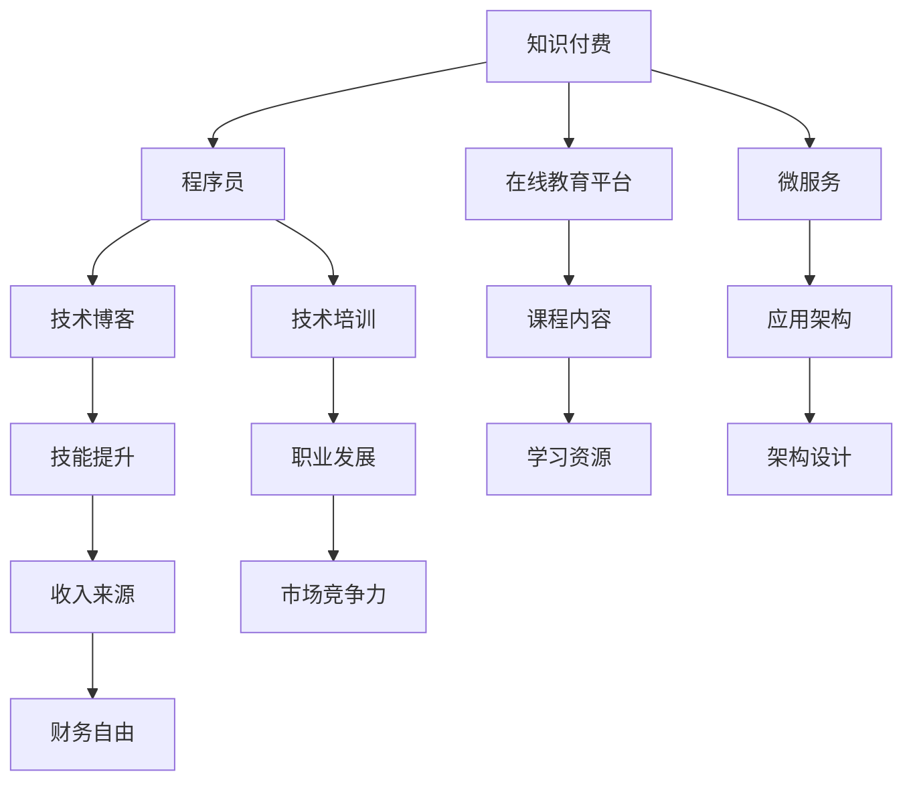

                 

# 知识付费让程序员实现财富自由的途径

## 1. 背景介绍

随着互联网的普及和技术的不断发展，程序员这一职业正在经历一场前所未有的变革。无论是薪资待遇、职业发展空间，还是社会地位，程序员的职业前景都令人欣喜。然而，与此同时，程序员面临的竞争压力和挑战也在不断增加。如何在这个充满挑战的行业中找到自己的立足之地，并实现财务自由，成为了众多程序员面临的重要课题。

在这个背景下，知识付费的出现，为程序员提供了一种全新的财富增长方式。它不仅为程序员提供了获取知识、提升技能的机会，也成为了一种可行的收入来源。本文将深入探讨知识付费的原理和实践，帮助程序员更好地把握这一机会，实现自己的财富梦想。

## 2. 核心概念与联系

### 2.1 核心概念概述

为了更好地理解知识付费这一概念，我们需要先了解几个相关的核心概念：

- **知识付费**：指的是用户为获取特定的知识和技能，而支付相应费用的行为。这包括了在线课程、专栏文章、技术博客、培训视频等多种形式。

- **程序员**：指的是在计算机科学领域工作的人员，包括软件开发者、系统分析师、IT项目经理等。程序员的工作涉及到软件开发、系统维护、技术支持等各个方面。

- **财富自由**：指的是个人或家庭的年收入能够覆盖其所有支出，无需依赖他人的资助或工作。

- **技术博客**：指的是程序员通过写作分享自己在技术领域的经验和见解，以达到知识传播和技能提升的目的。

- **在线教育平台**：指的是提供各类在线课程和培训的互联网平台，如Coursera、Udacity、EdX等。

- **微服务**：指的是将一个复杂的应用系统拆分成多个小服务，每个服务独立部署、独立运行、独立扩展的技术架构。

这些概念之间的关系可以通过以下Mermaid流程图来展示：



这个流程图展示了知识付费如何通过技术博客、在线教育平台、微服务等途径，为程序员提供技能提升、职业发展、财务自由等多方面的帮助。

## 3. 核心算法原理 & 具体操作步骤

### 3.1 算法原理概述

知识付费的本质是一种通过提供有价值的学习内容来吸引用户支付的行为。这种模式的核心在于内容的价值和用户的支付意愿之间的平衡。具体来说，它包括以下几个关键步骤：

1. **内容创作**：程序员通过写作、录制视频、开发在线课程等形式，创作出有价值的技术内容。
2. **平台展示**：创作者将内容上传至知识付费平台，供用户浏览、购买和使用。
3. **用户支付**：用户通过购买课程或订阅专栏等方式，支付相应的费用。
4. **收益分配**：知识付费平台根据创作者的内容质量、用户支付金额等因素，进行收益分配。

### 3.2 算法步骤详解

下面是知识付费的详细步骤：

**Step 1: 内容创作**
- 确定内容主题：选择程序员关心的技术领域，如Python、Java、数据结构与算法、软件工程等。
- 规划内容结构：设计课程大纲或博客文章结构，确定每个部分的内容和深度。
- 创作内容：撰写技术文章、录制课程视频、开发在线课程等，确保内容具有高价值性和可操作性。

**Step 2: 平台展示**
- 选择合适的平台：根据内容形式和目标用户群体，选择适合的在线教育平台或技术博客平台。
- 上传内容：将创作好的内容上传到平台，填写详细描述和标签，确保内容易被发现和理解。
- 进行市场推广：利用社交媒体、技术社区、论坛等渠道进行内容推广，吸引更多用户关注和购买。

**Step 3: 用户支付**
- 设置付费机制：根据内容价值和平台政策，设置合理的价格，并制定优惠策略吸引新用户。
- 用户支付：用户通过平台提供的支付方式进行支付，获取对内容的访问权。
- 确认交易：平台确认交易成功后，创作者收到支付款项。

**Step 4: 收益分配**
- 收益分配算法：平台根据内容价值、用户数量、访问时长等因素，计算创作者的收益。
- 收益发放：平台将收益支付给创作者，创作者可以进行二次分配，如生活开销、继续创作等。

### 3.3 算法优缺点

知识付费模式具有以下优点：
1. 低成本高收益：创作者只需要创作有价值的内容，平台和用户将为其付出相应的费用。
2. 灵活性强：创作者可以根据市场需求和个人兴趣选择创作方向，灵活调整内容策略。
3. 影响力大：通过在线平台，创作者的作品可以被更多用户看到，提高其社会影响力。

同时，知识付费也存在以下缺点：
1. 内容质量要求高：创作者需要具备高水平的技术知识和写作能力，才能创作出有吸引力的内容。
2. 市场竞争激烈：在线平台和创作者众多，需要具备一定的市场竞争力和创新能力。
3. 平台依赖性强：创作者高度依赖在线平台，平台政策的变化可能会对其收益产生影响。

### 3.4 算法应用领域

知识付费已经在多个领域得到了广泛应用，包括但不限于：

- **在线教育**：如Coursera、Udemy、Udacity等平台提供的各类编程课程、数据科学课程等。
- **技术博客**：如CSDN、博客园、知乎等平台上的技术文章、教程、课程等。
- **专业培训**：如腾讯云、阿里云等云平台提供的云服务、DevOps等培训课程。
- **软件开发**：如Github上的开源项目、技术讨论组等，通过提供高质量的代码和分享技术经验获取回报。

这些应用领域展示了知识付费的强大生命力和广泛应用前景。

## 4. 数学模型和公式 & 详细讲解 & 举例说明

### 4.1 数学模型构建

为了更精确地分析知识付费模式，我们可以构建一个简单的数学模型：

设 $C$ 为内容创作者，$P$ 为知识付费平台，$U$ 为用户群体。平台的收益 $R$ 由内容价值 $V$、用户数量 $N$、访问时长 $T$ 等因素决定。

$$
R = f(V, N, T)
$$

内容价值 $V$ 可以通过用户评价、平台评分、点击量等指标来衡量。用户数量 $N$ 和访问时长 $T$ 可以通过平台数据分析获得。

### 4.2 公式推导过程

根据以上定义，我们可以进一步推导收益 $R$ 的表达式：

$$
R = V \times N \times T
$$

其中，$V$ 表示每单位内容价值带来的收益，$N$ 表示平台上的用户数量，$T$ 表示用户对内容的平均访问时长。

### 4.3 案例分析与讲解

假设一个平台上有 $N=10000$ 个用户，内容价值 $V=10$ 元/小时，用户平均访问时长 $T=2$ 小时。那么平台的总收益 $R$ 为：

$$
R = 10 \times 10000 \times 2 = 200000 \text{元}
$$

这意味着，平台通过内容创作者提供的价值内容，实现了可观的收益。创作者的个人收益则取决于平台的具体分配政策。

## 5. 项目实践：代码实例和详细解释说明

### 5.1 开发环境搭建

为了实践知识付费模式，我们需要搭建一个简单的开发环境。以下是详细的步骤：

1. 选择一个知识付费平台：如Udemy、Coursera、CSDN等。
2. 创建一个账户：按照平台的指南，创建账号并上传验证信息。
3. 选择合适的编辑器：如Visual Studio Code、Atom等，编写和编辑代码。
4. 搭建服务器：可以使用AWS、阿里云等云服务搭建服务器，部署网站和应用程序。

### 5.2 源代码详细实现

下面是一个简单的技术博客网站搭建示例，用Python和Flask框架实现：

```python
from flask import Flask, render_template

app = Flask(__name__)

@app.route('/')
def index():
    return render_template('index.html')

if __name__ == '__main__':
    app.run(debug=True)
```

这个示例网站可以展示一个简单的技术博客首页。创作者可以通过添加更多路由和模板，实现更丰富的功能，如文章展示、用户评论、订阅等功能。

### 5.3 代码解读与分析

这个示例网站的代码非常简单，包含了Flask框架的基本用法：

- `Flask`：Python Web应用框架，用于快速搭建Web网站。
- `route`：Flask的路由装饰器，用于定义Web应用的接口。
- `render_template`：Flask的模板渲染函数，用于展示HTML页面。

整个网站的核心功能是通过路由和模板实现的，创建者可以灵活添加更多功能和优化页面布局。

### 5.4 运行结果展示

创建一个简单的技术博客，可以为创作者提供一个展示平台，吸引更多用户访问和订阅。通过不断更新内容，创作者可以逐步积累更多的用户和收益，实现财务自由。

## 6. 实际应用场景

### 6.1 在线教育平台

在线教育平台如Udemy、Coursera等，为程序员提供了广阔的市场机会。通过在这些平台上创建和推广课程，程序员可以获取丰厚收入，并提升职业竞争力。

### 6.2 技术博客平台

技术博客平台如CSDN、博客园、知乎等，为程序员提供了分享技术经验、展示个人能力的平台。通过撰写技术文章、开发开源项目等方式，程序员可以获得关注和支持，实现财务自由。

### 6.3 软件开发

软件开发平台如Github、GitLab等，为程序员提供了展示代码和分享技术的平台。通过开发高质量的开源项目，程序员可以吸引社区关注，并通过广告和赞助获得收入。

### 6.4 未来应用展望

未来，知识付费模式将继续发展，为程序员带来更多的机遇和挑战。

1. **内容多样化**：知识付费平台将提供更多样化的内容形式，如直播、视频、互动课程等，满足不同用户的需求。
2. **社区化**：知识付费平台将逐步社区化，用户可以互相交流、互相学习，提升整个社区的学习氛围和知识水平。
3. **技术创新**：知识付费模式将不断创新，结合区块链、人工智能等技术，提升平台的运营效率和内容质量。
4. **全球化**：知识付费平台将拓展全球市场，为程序员提供更多的机会和挑战，提升全球知识共享和合作水平。

## 7. 工具和资源推荐

### 7.1 学习资源推荐

为了帮助程序员更好地掌握知识付费的原理和实践，这里推荐一些优质的学习资源：

1. **《知识付费：如何通过内容创造实现财富自由》**：详细介绍知识付费的原理和实践，提供实用的案例和技巧。
2. **《知识付费课程设计》**：由知名教育平台讲师讲解，提供课程设计、市场推广、收益分配等实用技巧。
3. **《知识付费平台技术开发》**：讲解如何搭建知识付费平台，包括服务器搭建、网站开发、数据分析等技术。
4. **《知识付费社交化网络》**：介绍知识付费平台社区化的实现方法，提升平台的用户粘性和学习氛围。

### 7.2 开发工具推荐

高效的开发离不开优秀的工具支持。以下是几款用于知识付费开发常用的工具：

1. **Visual Studio Code**：轻量级的代码编辑器，支持多种编程语言和扩展，方便程序员开发和测试。
2. **Git**：版本控制系统，支持代码的协作和版本管理，适用于知识付费平台的多人协作开发。
3. **Flask**：Python Web应用框架，简单易用，适合快速搭建Web网站和API。
4. **AWS**：亚马逊云服务平台，提供丰富的云服务，支持知识付费平台的快速部署和扩展。
5. **Udemy**：全球知名的在线教育平台，为程序员提供课程开发和市场推广的机会。

### 7.3 相关论文推荐

知识付费模式的研究源于学界的持续探索。以下是几篇奠基性的相关论文，推荐阅读：

1. **《知识付费：新兴的经济模式》**：详细探讨知识付费的原理和市场机制，为程序员提供参考。
2. **《在线教育平台的经济学》**：分析在线教育平台的商业模式和收益模型，提供实用的市场策略。
3. **《区块链在知识付费中的应用》**：介绍区块链技术在知识付费平台中的实现方法，提升平台的信任度和安全性。
4. **《知识付费平台的用户行为分析》**：通过数据分析，揭示用户行为和需求，为知识付费创作者提供指导。

这些论文展示了知识付费模式的研究进展和应用前景，为程序员提供了宝贵的理论支持。

## 8. 总结：未来发展趋势与挑战

### 8.1 研究成果总结

本文详细介绍了知识付费的原理和实践，帮助程序员更好地把握这一机会，实现自己的财富梦想。知识付费模式为程序员提供了全新的收入来源，通过内容创作和市场推广，可以实现财务自由。

### 8.2 未来发展趋势

展望未来，知识付费模式将继续发展，为程序员带来更多的机遇和挑战：

1. **内容多样化**：知识付费平台将提供更多样化的内容形式，如直播、视频、互动课程等，满足不同用户的需求。
2. **社区化**：知识付费平台将逐步社区化，用户可以互相交流、互相学习，提升整个社区的学习氛围和知识水平。
3. **技术创新**：知识付费模式将不断创新，结合区块链、人工智能等技术，提升平台的运营效率和内容质量。
4. **全球化**：知识付费平台将拓展全球市场，为程序员提供更多的机会和挑战，提升全球知识共享和合作水平。

### 8.3 面临的挑战

尽管知识付费模式前景广阔，但在实际应用中也面临一些挑战：

1. **内容质量要求高**：创作者需要具备高水平的技术知识和写作能力，才能创作出有吸引力的内容。
2. **市场竞争激烈**：在线平台和创作者众多，需要具备一定的市场竞争力和创新能力。
3. **平台依赖性强**：创作者高度依赖在线平台，平台政策的变化可能会对其收益产生影响。
4. **用户需求变化快**：用户需求和市场趋势快速变化，创作者需要不断调整内容策略，保持市场竞争力。

### 8.4 研究展望

未来的研究需要在以下几个方面寻求新的突破：

1. **内容个性化**：通过用户行为分析，提供个性化推荐和内容定制，提升用户体验和满意度。
2. **技术自动化**：引入AI技术，自动化生成课程内容、优化学习路径，提升内容创作的效率和质量。
3. **市场策略优化**：通过数据分析，优化定价策略、市场推广方案，提升创作者的收益。
4. **用户参与度提升**：通过互动机制、社区活动等，提升用户的参与度和粘性，增加平台的活跃度。

## 9. 附录：常见问题与解答

**Q1: 知识付费是否适用于所有程序员？**

A: 知识付费模式适用于有技术积累和创作能力的程序员。对于初学者和初级开发者，可能需要更多的实际工作经验来支撑内容创作。

**Q2: 如何选择合适的知识付费平台？**

A: 选择合适的平台需要考虑内容形式、目标用户、收益分配等因素。程序员可以通过调研市场、分析用户反馈来选择最适合的平台。

**Q3: 如何提升内容的吸引力？**

A: 提升内容吸引力的方法包括增加互动元素、引入用户评论、优化用户体验等。同时，创作者可以通过社交媒体、技术社区进行推广，吸引更多用户关注和订阅。

**Q4: 如何应对市场竞争？**

A: 面对市场竞争，创作者需要不断提升自身技能、创新内容形式、优化营销策略。同时，通过合作和联合推广，可以提高自身的市场竞争力。

**Q5: 如何保持内容更新？**

A: 保持内容更新需要定期调研市场、分析用户需求、不断学习新技术。同时，可以建立社群，与用户保持互动，获取反馈和建议。

---

作者：禅与计算机程序设计艺术 / Zen and the Art of Computer Programming

