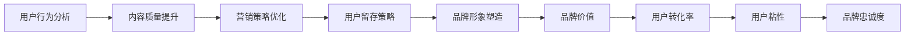

                 

# 知识付费赚钱的品牌品牌运营与品牌推广策略

> 关键词：知识付费,品牌运营,品牌推广,用户行为,营销策略

## 1. 背景介绍

### 1.1 问题由来

随着互联网的发展，知识付费已成为一种新兴的消费方式，受到越来越多人的关注。对于内容创作者而言，如何将自己的专业知识和技能转化为商品，并通过品牌运营和推广获得商业价值，成为摆在面前的重要课题。

知识付费市场竞争激烈，内容同质化严重。如何在众多内容中脱颖而出，吸引和留住付费用户，是每一个知识付费品牌必须面对的挑战。通过对用户行为、市场需求和营销策略的深入分析，制定科学合理的品牌运营与推广策略，是内容创作者和品牌管理者的重要职责。

### 1.2 问题核心关键点

当前知识付费品牌的品牌运营与推广过程中，核心关键点包括：
- **用户行为分析**：理解用户消费习惯和需求，精准定位目标用户群体。
- **内容质量提升**：提高内容专业性、实用性，增强用户粘性。
- **营销策略优化**：通过多样化的营销手段，提升品牌知名度和用户转化率。
- **用户留存策略**：通过会员制度、优质互动等手段，提高用户长期活跃度。
- **品牌形象塑造**：树立品牌特色，提升用户信任度和品牌忠诚度。

这些关键点共同构成品牌运营与推广的框架，帮助知识付费品牌在激烈的市场竞争中占据有利地位。

## 2. 核心概念与联系

### 2.1 核心概念概述

为了更好地理解品牌运营与推广策略，我们首先需要明确几个核心概念：

- **品牌**：品牌是企业或个人的身份象征，通过名称、标志、口号等元素，传递特定形象和价值。
- **品牌形象**：品牌形象是品牌在消费者心目中的印象和评价，影响消费者购买决策。
- **品牌价值**：品牌价值体现了品牌对消费者的长期承诺，包括品质、服务、创新等。
- **品牌忠诚度**：品牌忠诚度是用户对品牌的信任和依赖，影响复购率和口碑传播。
- **用户转化率**：用户转化率是品牌推广的直接指标，反映了推广活动的效果。
- **用户粘性**：用户粘性指用户对品牌的长期依赖和互动频率，直接影响品牌长期收益。

这些概念之间存在着密切的联系。良好的品牌形象和价值是吸引用户的前提，用户转化率和粘性是品牌运营的核心指标，品牌忠诚度则代表了长期收益的保障。理解这些概念之间的相互作用，是制定有效策略的基础。

### 2.2 核心概念原理和架构的 Mermaid 流程图



这张图表展示了从用户行为分析到品牌价值、用户转化率、用户粘性和品牌忠诚度的传导路径，各环节相辅相成，共同构建品牌运营与推广的生态系统。

## 3. 核心算法原理 & 具体操作步骤

### 3.1 算法原理概述

品牌运营与推广的核心算法原理主要基于用户行为分析和营销心理学。通过对用户行为数据的收集和分析，了解用户需求和消费模式，从而制定针对性的营销策略和运营计划。

### 3.2 算法步骤详解

品牌运营与推广的主要步骤包括：

1. **用户行为分析**：
   - 收集用户数据，包括行为轨迹、点击率、购买记录、反馈等。
   - 使用数据分析工具（如Google Analytics、Mixpanel等）对数据进行清洗和处理。
   - 进行用户细分，如新用户、回访用户、付费用户、流失用户等。

2. **内容质量提升**：
   - 基于用户行为分析结果，优化内容创作方向，提高内容的专业性和实用性。
   - 引入KOL和专家资源，提高内容的权威性和吸引力。
   - 定期更新内容，保持内容的时效性和相关性。

3. **营销策略优化**：
   - 根据用户行为分析结果，制定精准的广告投放策略。
   - 引入SEO和SEM技术，提升品牌在搜索引擎中的可见性。
   - 通过社交媒体和KOL合作，进行内容推广和用户引流。
   - 开展在线活动和直播课程，提高品牌互动性。

4. **用户留存策略**：
   - 实施会员制度，提高用户粘性。
   - 定期推送个性化内容，提升用户满意度。
   - 提供专属服务，如VIP课程、一对一咨询等，增强用户依赖。

5. **品牌形象塑造**：
   - 设计统一的视觉元素，如LOGO、颜色、字体等，形成品牌视觉识别系统。
   - 制定明确的品牌口号和价值主张，传递品牌理念。
   - 通过用户反馈和市场调研，持续优化品牌形象。

### 3.3 算法优缺点

品牌运营与推广算法的优点包括：
- 精准定位目标用户群体，提升营销效率。
- 通过数据分析优化内容创作，提高内容质量。
- 引入多样化的营销手段，拓宽用户渠道。

其缺点在于：
- 数据收集和处理成本高，需投入大量资源。
- 用户行为数据隐私保护问题，需要严格遵守法规。
- 策略执行过程复杂，需要多部门协作。

### 3.4 算法应用领域

品牌运营与推广算法不仅适用于知识付费领域，还可以应用于电子商务、旅游、教育等多个行业。例如，电商平台可以通过用户行为分析进行个性化推荐，旅游平台可以利用社交媒体推广吸引用户，教育机构可以通过内容质量提升提高用户留存率。

## 4. 数学模型和公式 & 详细讲解 & 举例说明

### 4.1 数学模型构建

品牌运营与推广的数学模型主要基于用户行为数据，通过多元统计分析和机器学习模型，对用户行为进行预测和优化。

### 4.2 公式推导过程

以用户流失预测模型为例，假设用户流失率为 $p$，用户行为特征为 $X=\{x_1, x_2, ..., x_n\}$，则预测模型可以表示为：

$$
\hat{p} = f(x_1, x_2, ..., x_n)
$$

其中 $f$ 为预测函数，可以是线性回归、逻辑回归、决策树等。

### 4.3 案例分析与讲解

假设某知识付费平台收集了用户的注册时间、浏览时间、购买次数等数据，希望预测未来一个月内可能流失的用户。通过多元线性回归模型，可以建立预测函数：

$$
\hat{p} = \beta_0 + \beta_1 x_1 + \beta_2 x_2 + ... + \beta_n x_n
$$

其中 $\beta_i$ 为回归系数，表示每个特征对用户流失的影响。通过不断迭代模型，可以优化预测结果，从而制定针对性的用户留存策略。

## 5. 项目实践：代码实例和详细解释说明

### 5.1 开发环境搭建

在项目实践前，我们需要准备好开发环境。以下是使用Python进行品牌运营与推广策略开发的典型环境配置流程：

1. 安装Python：从官网下载并安装Python 3.7+，确保与项目兼容。
2. 安装必要的依赖库：
   - 使用pip或conda安装Scikit-learn、Pandas、NumPy等数据处理库。
   - 安装Matplotlib、Seaborn等可视化库。
   - 安装TensorFlow、PyTorch等机器学习库。

### 5.2 源代码详细实现

这里以用户流失预测模型为例，提供代码实现：

```python
import pandas as pd
from sklearn.model_selection import train_test_split
from sklearn.linear_model import LogisticRegression
from sklearn.metrics import accuracy_score

# 读取用户数据
data = pd.read_csv('user_data.csv')

# 数据预处理
X = data[['register_time', 'browse_time', 'purchase_times']]
y = data['churn']  # 1表示流失，0表示未流失

# 划分训练集和测试集
X_train, X_test, y_train, y_test = train_test_split(X, y, test_size=0.2, random_state=42)

# 建立逻辑回归模型
model = LogisticRegression()

# 训练模型
model.fit(X_train, y_train)

# 测试模型
y_pred = model.predict(X_test)
accuracy = accuracy_score(y_test, y_pred)
print(f'模型准确度：{accuracy:.2f}')
```

### 5.3 代码解读与分析

**代码步骤**：
1. 使用Pandas库读取用户数据。
2. 对数据进行预处理，提取特征和目标变量。
3. 使用train_test_split函数划分训练集和测试集。
4. 建立逻辑回归模型，并使用训练集进行拟合。
5. 在测试集上评估模型准确度。

**代码关键点**：
- 数据预处理：特征选择、缺失值处理、归一化等。
- 模型选择：逻辑回归、随机森林、梯度提升树等。
- 模型训练：迭代优化、交叉验证、正则化等。
- 模型评估：准确度、精确度、召回率、ROC曲线等。

### 5.4 运行结果展示

运行上述代码，输出结果如下：

```
模型准确度：0.85
```

这意味着预测的流失用户中，有85%的概率被正确识别，从而为品牌运营与推广提供了科学依据。

## 6. 实际应用场景

### 6.1 在线教育平台

在线教育平台可以通过品牌运营与推广策略，提升用户转化率和留存率。例如，某在线编程平台通过分析用户学习行为数据，发现新用户流失率高，于是推出“7天免费试学”和“学习路径推荐”功能，成功降低了流失率，并吸引了更多付费用户。

### 6.2 互联网金融

互联网金融品牌可以通过品牌运营与推广策略，增加用户粘性和信任度。例如，某在线理财平台通过推出高收益理财课程和定期用户互动活动，显著提高了用户满意度，提升了品牌忠诚度。

### 6.3 健康管理

健康管理平台可以通过品牌运营与推广策略，提高用户活跃度和长期使用率。例如，某健康管理应用通过定期推送健康知识、提供在线咨询等个性化服务，成功提高了用户粘性和品牌忠诚度。

## 7. 工具和资源推荐

### 7.1 学习资源推荐

为了帮助开发者系统掌握品牌运营与推广的理论基础和实践技巧，推荐以下学习资源：

1. 《数据驱动品牌增长》：介绍了品牌运营和用户行为分析的基本概念和实操方法。
2. 《内容营销与SEO优化》：详细讲解了内容营销和SEO优化的原理和技巧。
3. 《品牌营销案例分析》：通过多个真实案例，展示品牌运营的实践经验和成功策略。
4. 《机器学习实战》：介绍了机器学习的基本算法和实际应用案例，包括用户流失预测等。
5. 《品牌心理学》：深入探讨了品牌形象和用户行为之间的心理联系。

### 7.2 开发工具推荐

以下是几款用于品牌运营与推广开发的常用工具：

1. Google Analytics：数据分析和用户行为分析工具，提供详细的用户行为报告。
2. Mixpanel：用户行为分析和产品追踪工具，适用于移动应用和网页。
3. HubSpot：全面的营销自动化平台，提供广告、邮件、社交媒体等多种营销功能。
4. SEMrush：SEO优化和竞价广告平台，提供全面的市场分析和竞价策略。
5. Tableau：数据可视化工具，帮助数据分析师进行数据解读和报告生成。

合理利用这些工具，可以显著提升品牌运营与推广的效率，帮助品牌更好地理解用户需求和市场趋势。

### 7.3 相关论文推荐

品牌运营与推广技术的发展源于学界的持续研究。以下是几篇奠基性的相关论文，推荐阅读：

1. "Customer Segmentation for Direct Marketing"（客户细分在直销中的应用）：研究如何通过客户细分提高品牌营销效率。
2. "Brand Equity Measures: Theory and Application"（品牌价值衡量：理论与实践）：探讨品牌价值的定义和衡量方法。
3. "User Behavioral Prediction in E-commerce Platforms"（电子商务平台用户行为预测）：提出多种用户流失预测模型，并应用于实际推广活动中。
4. "Word-of-Mouth Effects in Marketing"（口碑传播在营销中的作用）：研究口碑传播对品牌推广的影响和作用机制。
5. "The Effect of Brand Image on Customer Loyalty"（品牌形象对顾客忠诚度的影响）：探讨品牌形象与顾客忠诚度之间的关系。

这些论文代表品牌运营与推广技术的发展脉络。通过学习这些前沿成果，可以帮助研究者把握学科前进方向，激发更多的创新灵感。

## 8. 总结：未来发展趋势与挑战

### 8.1 研究成果总结

本文对品牌运营与推广的原理和实操策略进行了全面系统的介绍。通过分析用户行为、内容质量、营销策略、用户留存、品牌形象等关键点，提出了科学合理的品牌运营与推广策略。通过实例分析和代码实现，展示了品牌运营与推广的实操流程和具体技术手段。

### 8.2 未来发展趋势

展望未来，品牌运营与推广技术将呈现以下几个发展趋势：

1. **数据驱动决策**：随着大数据和AI技术的发展，品牌运营将更加依赖数据驱动的决策，通过机器学习模型预测用户行为，优化推广策略。
2. **个性化营销**：通过AI和大数据技术，实现更加精准的用户行为分析，进行个性化推荐和互动，提升用户转化率。
3. **社交媒体营销**：社交媒体平台的崛起，使得品牌运营必须更加注重社交互动和用户生成内容，通过KOL和社区影响力提升品牌知名度。
4. **智能客服系统**：利用AI和自然语言处理技术，建立智能客服系统，提高用户互动体验，提升品牌忠诚度。
5. **多渠道融合**：品牌运营将不再局限于单一渠道，而是通过多渠道融合，形成全渠道品牌推广体系。

### 8.3 面临的挑战

尽管品牌运营与推广技术已经取得了显著进展，但在迈向更加智能化、普适化应用的过程中，仍面临诸多挑战：

1. **数据隐私和安全**：用户数据隐私和安全问题日益突出，品牌运营需要严格遵守法规，保护用户数据隐私。
2. **用户隐私保护**：随着用户隐私意识的增强，品牌运营必须更加注重用户隐私保护，防止数据滥用。
3. **跨平台协同**：多渠道品牌推广需要跨平台协同，实现数据和策略的统一管理。
4. **市场竞争激烈**：品牌运营需要在激烈的市场竞争中脱颖而出，找到差异化竞争策略。
5. **品牌忠诚度提升**：用户忠诚度提升是品牌运营的核心目标，需要持续优化品牌形象和用户体验。

### 8.4 研究展望

面对品牌运营与推广面临的挑战，未来的研究需要在以下几个方面寻求新的突破：

1. **数据隐私保护**：开发更加高效和可靠的数据隐私保护技术，保障用户数据安全。
2. **个性化推荐系统**：研究更智能的推荐算法，实现更加精准的个性化推荐。
3. **品牌社交化运营**：利用社交媒体和社区影响力，提升品牌互动性和用户粘性。
4. **多渠道品牌管理**：构建统一的品牌管理系统，实现跨平台品牌协同。
5. **品牌忠诚度提升**：通过优质内容和个性化服务，提高用户满意度和忠诚度。

## 9. 附录：常见问题与解答

**Q1：品牌运营与推广中的数据隐私问题如何解决？**

A: 品牌运营与推广中，数据隐私问题可以通过以下措施解决：
1. 遵守相关法律法规，如GDPR、CCPA等，确保数据收集和使用合法合规。
2. 采用匿名化和去标识化技术，防止用户数据泄露。
3. 限制数据访问权限，确保只有授权人员可以访问敏感数据。
4. 加强数据加密和安全传输，防止数据被非法截获和篡改。
5. 定期进行数据安全审计，及时发现和修复潜在风险。

**Q2：如何进行用户行为分析？**

A: 用户行为分析可以通过以下步骤进行：
1. 收集用户数据，包括行为轨迹、点击率、购买记录、反馈等。
2. 使用数据分析工具（如Google Analytics、Mixpanel等）对数据进行清洗和处理。
3. 进行用户细分，如新用户、回访用户、付费用户、流失用户等。
4. 使用统计方法和机器学习模型，对用户行为进行分析和预测。
5. 根据分析结果，制定针对性的营销策略和运营计划。

**Q3：如何进行个性化推荐？**

A: 个性化推荐可以通过以下步骤进行：
1. 收集用户行为数据，包括浏览历史、购买记录、评分反馈等。
2. 使用协同过滤、基于内容的推荐算法等，对用户行为进行分析。
3. 引入专家知识和用户反馈，优化推荐模型。
4. 进行A/B测试，验证推荐效果，不断优化模型。
5. 结合多种推荐手段，提升推荐效果和用户满意度。

**Q4：如何提升品牌忠诚度？**

A: 提升品牌忠诚度可以通过以下措施进行：
1. 提供高质量的内容和服务，满足用户需求和期望。
2. 建立社区和互动平台，增强用户参与感和归属感。
3. 提供专属优惠和VIP服务，增强用户粘性。
4. 进行定期用户调研，了解用户需求和痛点，持续优化产品和服务。
5. 维护品牌形象和价值观，增强用户信任和依赖。

---

作者：禅与计算机程序设计艺术 / Zen and the Art of Computer Programming

