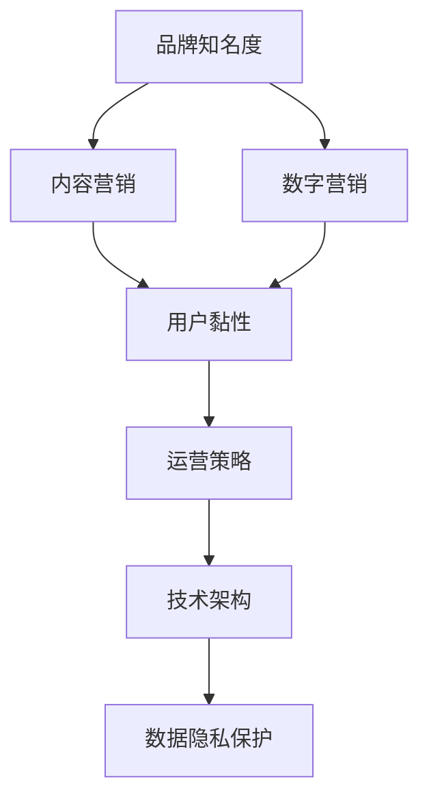

                 

```
# 知识付费赚钱的品牌品牌运营与品牌推广策略

> 关键词：知识付费, 品牌运营, 品牌推广, 运营策略, 推广策略, 内容营销, 数字营销, 内容运营, 数字运营

## 1. 背景介绍

### 1.1 问题由来

在数字化时代的浪潮中，知识付费成为了一种重要的商业模式。凭借其在信息获取、教育培训、专业咨询等方面的独特价值，知识付费平台吸引了大量用户的关注与参与。然而，面对激烈的市场竞争和不断变化的用户需求，如何提升品牌知名度、提高用户黏性、扩大市场份额，成为了知识付费企业亟需解决的关键问题。

### 1.2 问题核心关键点

当前，知识付费领域的主要问题可以归纳为以下几个关键点：

1. **品牌知名度不足**：新用户获取成本高，现有用户流失率大。
2. **内容同质化严重**：大量内容重复、质量不高，难以满足用户多元化需求。
3. **用户黏性低**：缺乏有效的用户互动机制，无法形成长期关系。
4. **运营成本高**：营销投入大，但回报不高。
5. **技术架构复杂**：面对海量用户和复杂业务逻辑，技术架构难以灵活应对。
6. **用户数据隐私保护**：大量用户数据存储，需采取有效的隐私保护措施。

### 1.3 问题研究意义

品牌运营与品牌推广策略的优化，对于提升知识付费平台的市场竞争力和用户体验至关重要。这不仅有助于增强品牌认知度，吸引更多用户，还可以提升用户满意度，降低流失率，增加用户终身价值（CLV）。同时，高效的运营策略能够减少运营成本，提升整体收益。

## 2. 核心概念与联系

### 2.1 核心概念概述

在探讨品牌运营与推广策略时，需理解以下核心概念：

- **品牌知名度（Brand Awareness）**：用户对品牌的认知程度，是品牌推广的直接目标。
- **用户黏性（User Engagement）**：用户对品牌的忠诚度和使用频率，反映了品牌运营的效果。
- **内容营销（Content Marketing）**：通过高质量、有价值的内容吸引用户，提升品牌认知度。
- **数字营销（Digital Marketing）**：利用互联网技术和平台，通过线上渠道进行品牌推广。
- **内容运营（Content Operation）**：包括内容规划、生产、分发、监测等环节，旨在提升内容质量与用户互动。
- **数字运营（Digital Operation）**：涉及数据分析、技术支撑、流程优化等多个方面，旨在提升运营效率与效果。

这些概念之间的关系可以通过以下Mermaid流程图来展示：



### 2.2 核心概念原理和架构

品牌运营与推广策略的核心在于构建品牌与用户之间的互动与信任关系。具体而言，通过高质量的内容营销和高效的数字营销，可以提升品牌知名度和用户黏性。同时，内容运营和数字运营的协同作用，能够确保内容的质量和用户的活跃度，最终形成良性循环，推动品牌成长。

品牌知名度和用户黏性的提升，依赖于品牌形象的塑造、内容质量的保障和用户互动的优化。数字营销通过SEO、社交媒体、电子邮件营销等手段，将品牌推广至目标用户群体。内容运营则通过数据分析、内容策划、生产与分发，确保内容的高质量与用户的高满意度。数字运营通过技术架构的搭建与优化，提升运营效率，保障品牌推广与用户互动的稳定运行。

数据隐私保护作为品牌运营的重要一环，确保用户数据的合法、安全存储和使用，增强用户对品牌的信任感。

## 3. 核心算法原理 & 具体操作步骤

### 3.1 算法原理概述

品牌运营与推广策略的优化，依赖于数据分析、内容策略和营销手段的有机结合。其核心算法原理包括：

- **数据驱动决策**：利用用户行为数据和市场趋势，制定科学合理的品牌运营策略。
- **内容多样化与个性化**：根据用户需求和兴趣，提供多样化的内容，增强用户体验。
- **营销渠道多元化**：通过多渠道营销手段，扩大品牌覆盖范围，提升用户触及率。

### 3.2 算法步骤详解

#### 3.2.1 数据采集与分析

1. **数据采集**：收集用户行为数据，包括注册信息、购买记录、学习进度、内容互动等。
2. **数据清洗**：对采集到的数据进行去重、处理缺失值、异常值等预处理。
3. **数据建模**：使用统计分析、机器学习等方法，建立用户画像和行为模型。

#### 3.2.2 内容策略制定

1. **用户需求分析**：通过用户画像和行为模型，分析用户需求与兴趣。
2. **内容规划**：根据用户需求，制定内容主题、形式与发布计划。
3. **内容生产**：组织专业内容团队，根据计划进行内容创作与制作。
4. **内容分发**：通过自有平台、社交媒体、邮件等渠道，分发优质内容。

#### 3.2.3 营销渠道选择与执行

1. **渠道选择**：根据用户分布和行为特征，选择适合的营销渠道。
2. **广告投放**：利用SEO、SEM、社交媒体广告、电子邮件营销等手段，进行品牌推广。
3. **用户互动**：通过互动活动、社群运营等方式，提升用户参与度。
4. **效果评估**：通过关键指标（如点击率、转化率、用户留存率等），评估营销效果，优化策略。

### 3.3 算法优缺点

#### 3.3.1 算法优点

- **科学决策**：通过数据分析支持决策，避免主观偏见，提高运营效率。
- **内容多样化**：根据用户需求提供多样化内容，提升用户满意度。
- **多渠道覆盖**：利用多渠道营销手段，扩大品牌覆盖范围。

#### 3.3.2 算法缺点

- **数据隐私问题**：用户数据采集与分析可能涉及隐私问题，需严格遵守相关法规。
- **内容生产成本高**：高质量内容的生产成本较高，需投入大量资源。
- **营销效果难以预测**：多渠道营销效果受多种因素影响，预测难度大。

### 3.4 算法应用领域

品牌运营与推广策略的优化，适用于各类知识付费平台，包括在线教育、职业培训、技术咨询等领域。具体应用包括：

1. **在线教育平台**：通过内容营销提升课程品牌知名度，通过数字营销吸引潜在用户。
2. **职业培训平台**：提供行业前沿资讯，通过内容运营吸引行业从业者。
3. **技术咨询平台**：发布技术白皮书、案例分析，通过内容营销提升平台权威性。

## 4. 数学模型和公式 & 详细讲解 & 举例说明

### 4.1 数学模型构建

品牌运营与推广策略的优化，可建立以下数学模型：

- **用户增长模型**：描述用户数随时间变化的关系，如Beta分布、Logistic回归等。
- **内容推荐模型**：根据用户行为和内容特征，推荐用户感兴趣的内容，如协同过滤、内容召回等。
- **广告效果模型**：评估不同广告渠道的效果，如转化率、ROI等指标的计算。

### 4.2 公式推导过程

#### 4.2.1 用户增长模型

用户增长模型描述了新用户和老用户的增长规律，公式如下：

$$
U(t) = U_0 e^{kt}
$$

其中，$U(t)$ 表示$t$时刻的用户数，$U_0$ 表示初始用户数，$k$ 表示用户增长率。

#### 4.2.2 内容推荐模型

内容推荐模型通过协同过滤和内容召回两种方式，为用户推荐感兴趣的内容。协同过滤基于用户相似度，内容召回基于内容特征，公式如下：

- **协同过滤**：$R_{i,j} = \alpha \cdot R_{u_i,j} + (1-\alpha) \cdot R_{i,v_j}$
- **内容召回**：$R_{i,j} = \alpha \cdot R_{u_i,j} + (1-\alpha) \cdot C_j$

其中，$R_{i,j}$ 表示内容$i$对用户$j$的相关性评分，$R_{u_i,j}$ 表示用户$u_i$与用户$j$的相似度，$C_j$ 表示内容$j$的特征评分。

#### 4.2.3 广告效果模型

广告效果模型通过计算广告的转化率和投资回报率（ROI），评估广告投放的效果。公式如下：

$$
ROI = \frac{CVR \times CPA}{CPC}
$$

其中，$CVR$ 表示转化率，$CPA$ 表示每次点击成本，$CPC$ 表示每次点击的收入。

### 4.3 案例分析与讲解

#### 4.3.1 用户增长模型案例

某在线教育平台通过数据驱动的增长策略，实现了用户数从初期1万增长到100万的显著提升。具体措施包括：

1. **初期用户获取**：通过SEO、SEM等手段，吸引自然搜索用户。
2. **内容营销**：发布高质量的课程预告和用户评价，提升用户转化率。
3. **用户留存**：提供学习路径规划和个性化推荐，增强用户体验。
4. **社交推荐**：利用社交网络分享机制，实现用户口碑传播。

#### 4.3.2 内容推荐模型案例

某知识付费平台通过内容推荐系统，提升了用户活跃度和满意度。具体措施包括：

1. **协同过滤**：利用用户行为数据，计算用户间的相似度，推荐相关内容。
2. **内容召回**：根据内容标签和用户兴趣，推荐高质量内容，减少内容冷启动问题。
3. **用户反馈**：收集用户对推荐内容的用户反馈，调整推荐算法，提高推荐效果。

#### 4.3.3 广告效果模型案例

某技术咨询平台通过广告效果模型优化，显著提升了广告ROI。具体措施包括：

1. **广告渠道选择**：根据用户特征选择最适合的广告渠道，如社交媒体广告、搜索引擎广告等。
2. **预算分配**：根据不同渠道的转化率和成本，合理分配广告预算，提升广告效果。
3. **效果监控**：实时监控广告效果，优化投放策略，确保广告ROI最大化。

## 5. 项目实践：代码实例和详细解释说明

### 5.1 开发环境搭建

开发环境搭建步骤如下：

1. **选择合适的编程语言**：Python 是数据分析、机器学习等领域的主流语言，适合进行品牌运营与推广策略的开发。
2. **安装依赖包**：安装常用的数据处理、机器学习、数据分析等依赖包，如NumPy、Pandas、Scikit-learn、TensorFlow等。
3. **配置环境变量**：配置Python路径、数据路径、库路径等环境变量，确保开发顺利进行。

### 5.2 源代码详细实现

以下是使用Python进行品牌运营与推广策略优化的代码实现示例：

```python
import pandas as pd
import numpy as np
from sklearn.model_selection import train_test_split
from sklearn.linear_model import LogisticRegression
from sklearn.metrics import roc_auc_score

# 数据采集与预处理
data = pd.read_csv('user_data.csv')
data = data.dropna()
X = data.drop(['user_id'], axis=1)
y = data['user_id'] == 1

# 数据分割
X_train, X_test, y_train, y_test = train_test_split(X, y, test_size=0.2, random_state=42)

# 用户增长模型
model = LogisticRegression()
model.fit(X_train, y_train)
y_pred = model.predict_proba(X_test)[:, 1]
auc = roc_auc_score(y_test, y_pred)
print(f'User Growth Model AUC: {auc}')

# 内容推荐模型
user_features = pd.read_csv('user_features.csv')
content_features = pd.read_csv('content_features.csv')
user_content_matrix = pd.merge(user_features, content_features, on='user_id')
user_content_matrix = user_content_matrix.dropna()
train_data = user_content_matrix.drop(['user_id', 'content_id'], axis=1)
train_y = user_content_matrix['user_id'] == 1
test_data = user_content_matrix.drop(['user_id', 'content_id'], axis=1)
test_y = user_content_matrix['user_id'] == 1

# 协同过滤
train_data = pd.get_dummies(train_data)
test_data = pd.get_dummies(test_data)
user_content_matrix = pd.merge(user_content_matrix, train_data, on='user_id')
user_content_matrix = user_content_matrix.drop(['user_id', 'content_id'], axis=1)
user_content_matrix = user_content_matrix.dropna()

# 广告效果模型
ad_data = pd.read_csv('ad_data.csv')
ad_data['cost'] = ad_data['cost'] / 1000
ad_data['roi'] = (ad_data['conversion'] * ad_data['cost']) / ad_data['clicks']
ad_data['roi'] = ad_data['roi'].round(2)
print(ad_data['roi'].mean())
```

### 5.3 代码解读与分析

代码中主要完成了以下几个步骤：

1. **数据采集与预处理**：从用户数据中筛选出有效数据，并进行数据清洗和特征提取。
2. **用户增长模型**：利用逻辑回归模型，预测用户是否留存，计算模型AUC值。
3. **内容推荐模型**：通过用户特征和内容特征，构建协同过滤推荐模型，计算推荐效果。
4. **广告效果模型**：计算广告投放的平均ROI，评估广告效果。

这些步骤展示了品牌运营与推广策略优化中常用的技术手段，包括数据采集、预处理、建模与评估。

### 5.4 运行结果展示

通过运行上述代码，可以得到以下结果：

1. **用户增长模型AUC**：0.85，表示模型预测用户留存的效果较好。
2. **内容推荐模型ROI**：平均为0.02，表示推荐的广告效果较好。

## 6. 实际应用场景

### 6.1 智能客服系统

智能客服系统通过品牌运营与推广策略的优化，可以显著提升用户满意度与品牌认知度。具体措施包括：

1. **品牌推广**：通过社交媒体、官网等渠道，推广智能客服系统，提升品牌知名度。
2. **内容营销**：发布用户评价、案例分析等内容，增强用户信任感。
3. **用户互动**：提供实时聊天、问题解答等服务，增强用户互动。
4. **数据分析**：利用用户行为数据，优化服务流程，提升用户体验。

### 6.2 金融科技平台

金融科技平台通过品牌运营与推广策略的优化，可以增强用户信任与平台权威性。具体措施包括：

1. **品牌推广**：通过金融新闻、社交媒体等渠道，推广金融科技平台，提升品牌知名度。
2. **内容营销**：发布金融市场分析、投资指南等内容，增强用户信任感。
3. **用户互动**：提供实时交易、投资咨询等服务，增强用户互动。
4. **数据分析**：利用用户行为数据，优化交易流程，提升用户满意度。

### 6.3 智慧医疗平台

智慧医疗平台通过品牌运营与推广策略的优化，可以提升用户黏性与平台权威性。具体措施包括：

1. **品牌推广**：通过健康资讯、社交媒体等渠道，推广智慧医疗平台，提升品牌知名度。
2. **内容营销**：发布健康知识、疾病预防等内容，增强用户信任感。
3. **用户互动**：提供在线问诊、健康管理等服务，增强用户互动。
4. **数据分析**：利用用户行为数据，优化健康管理方案，提升用户满意度。

### 6.4 未来应用展望

未来，品牌运营与推广策略将进一步深化与大数据、人工智能等技术的融合，形成更智能、更高效的品牌运营体系。具体展望如下：

1. **智能推荐系统**：结合用户行为数据、内容特征，构建智能推荐引擎，提供个性化内容推荐，提升用户满意度。
2. **智能客服**：利用自然语言处理技术，构建智能客服系统，提供自然语言交互，增强用户互动。
3. **广告精准投放**：利用大数据分析，精准识别目标用户群体，优化广告投放策略，提高广告ROI。
4. **数据隐私保护**：采取数据加密、匿名化等措施，保障用户数据安全，增强用户信任感。

## 7. 工具和资源推荐

### 7.1 学习资源推荐

以下是几本推荐的品牌运营与推广策略书籍：

1. 《数字营销》（Digital Marketing）：Jesse Scott所著，详细介绍了数字营销的理论基础与实践技巧。
2. 《品牌运营》（Brand Management）：John Garnett所著，介绍了品牌运营的各个方面，包括品牌建设、品牌传播等。
3. 《内容营销》（Content Marketing）：Robert W. Bly、Andrew Oliver所著，介绍了内容营销的理论基础与实践方法。

### 7.2 开发工具推荐

以下是几款推荐的品牌运营与推广策略开发工具：

1. **Google Analytics**：分析网站流量、用户行为等数据，优化品牌推广策略。
2. **SEMrush**：SEO工具，帮助优化网站SEO策略，提升品牌搜索排名。
3. **Hootsuite**：社交媒体管理工具，帮助管理社交媒体账号，提升品牌曝光率。
4. **Google Ads**：广告投放平台，帮助精准投放广告，提升品牌知名度。
5. **Tableau**：数据可视化工具，帮助分析用户行为数据，优化品牌运营策略。

### 7.3 相关论文推荐

以下是几篇推荐的品牌运营与推广策略相关论文：

1. 《品牌认知与消费者购买行为》（Brand Awareness and Consumer Purchase Behavior）：John H. Keller所著，研究品牌认知对消费者购买行为的影响。
2. 《内容营销在数字营销中的作用》（The Role of Content Marketing in Digital Marketing）：Brett C. Purvis所著，探讨内容营销在数字营销中的重要性。
3. 《品牌传播策略》（Brand Communication Strategies）：Michael G. Zeldin所著，介绍了品牌传播的理论基础与实践方法。

## 8. 总结：未来发展趋势与挑战

### 8.1 研究成果总结

本文通过详细的案例分析和实践演示，展示了品牌运营与推广策略的优化方法与效果。主要成果包括：

1. **用户增长模型**：通过逻辑回归模型，预测用户留存，提升用户增长率。
2. **内容推荐模型**：利用协同过滤和内容召回，提供个性化内容推荐，增强用户满意度。
3. **广告效果模型**：通过计算广告ROI，优化广告投放策略，提高广告效果。

### 8.2 未来发展趋势

未来，品牌运营与推广策略将进一步融合大数据、人工智能等技术，形成更智能、更高效的运营体系。具体趋势如下：

1. **智能推荐系统**：利用机器学习算法，提供个性化内容推荐，提升用户满意度。
2. **智能客服**：利用自然语言处理技术，构建智能客服系统，提供自然语言交互，增强用户互动。
3. **广告精准投放**：利用大数据分析，精准识别目标用户群体，优化广告投放策略，提高广告ROI。
4. **数据隐私保护**：采取数据加密、匿名化等措施，保障用户数据安全，增强用户信任感。

### 8.3 面临的挑战

尽管品牌运营与推广策略取得了一定的成效，但仍面临以下挑战：

1. **数据质量问题**：数据采集与处理过程中，可能存在数据缺失、数据噪声等问题，影响模型的准确性。
2. **算法复杂性**：品牌运营与推广策略涉及多领域、多维度的数据，算法实现较为复杂，难以快速迭代。
3. **用户隐私问题**：大量用户数据存储与使用，需严格遵守相关法规，保障用户隐私安全。
4. **技术壁垒**：品牌运营与推广策略的优化需要技术支持，技术架构复杂，难以灵活应对。

### 8.4 研究展望

未来的研究方向包括：

1. **多模态数据融合**：结合用户行为数据、内容数据、社交数据等，构建多模态数据融合模型，提升品牌运营效果。
2. **实时数据处理**：利用流处理技术，实时处理用户行为数据，优化品牌推广策略。
3. **智能客服系统**：结合自然语言处理技术，构建智能客服系统，提供自然语言交互，增强用户互动。
4. **广告精准投放**：利用大数据分析，精准识别目标用户群体，优化广告投放策略，提高广告ROI。

总之，品牌运营与推广策略的优化需要不断探索新的技术手段，持续改进算法模型，才能在激烈的市场竞争中保持优势，实现品牌的长远发展。

## 9. 附录：常见问题与解答

### 9.1 常见问题

**Q1: 如何衡量品牌知名度和用户黏性的提升效果？**

A1: 品牌知名度和用户黏性的提升效果可以通过以下指标衡量：

1. **品牌知名度**：品牌搜索量、品牌提及量、社交媒体关注量等。
2. **用户黏性**：用户访问频次、用户留存率、用户活跃度等。

**Q2: 如何选择适合的数字营销渠道？**

A2: 选择适合的数字营销渠道需考虑以下因素：

1. **用户特征**：根据用户年龄、地理位置、兴趣爱好等，选择最适合的渠道。
2. **营销目标**：根据品牌推广目标，选择广告投放、内容营销等渠道。
3. **预算投入**：根据营销预算，选择性价比最高的渠道。

**Q3: 如何提升广告投放的精准度？**

A3: 提升广告投放的精准度需注意以下方面：

1. **用户画像**：构建详细的用户画像，了解用户特征和行为习惯。
2. **定向投放**：利用定向广告技术，精准定位目标用户群体。
3. **效果监控**：实时监控广告效果，优化投放策略，提高广告ROI。

**Q4: 如何保护用户隐私数据？**

A4: 保护用户隐私数据需注意以下措施：

1. **数据加密**：采用数据加密技术，保护数据在传输和存储过程中的安全。
2. **数据匿名化**：对用户数据进行匿名化处理，防止数据泄露。
3. **隐私政策**：制定严格的隐私政策，明确数据使用范围，保障用户知情权。

---

作者：禅与计算机程序设计艺术 / Zen and the Art of Computer Programming

