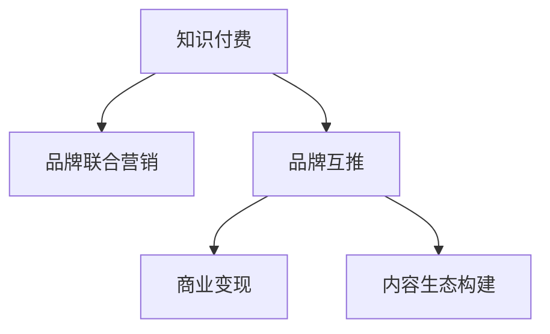

                 

# 知识付费赚钱的品牌联合营销与品牌互推策略

> 关键词：知识付费、品牌联合营销、品牌互推、商业变现、IP合作、内容生态构建

## 1. 背景介绍

### 1.1 问题由来
随着互联网时代的到来，知识付费市场迅速崛起，成为越来越多人获取专业知识的重要途径。知识付费不仅帮助人们节省时间、提高效率，还能激发学习热情，提升职业技能。然而，知识付费领域的竞争也日趋激烈，各大平台纷纷发力，市场份额被迅速瓜分。在此背景下，品牌联合营销与品牌互推成为一种高效的品牌曝光和商业变现手段，在知识付费市场中展现出极大的潜力。

品牌联合营销和品牌互推的本质是通过品牌间的合作，实现资源共享、优势互补，从而在市场上形成更大的声量，吸引更多的用户关注和转化。这种模式可以有效降低营销成本，提升品牌曝光度和用户黏性，进一步增强商业变现能力。

### 1.2 问题核心关键点
品牌联合营销与品牌互推的核心关键点包括：
1. **平台选择与定位**：选择适合的品牌合作平台，明确合作目标和策略。
2. **资源整合与内容创新**：通过资源整合和内容创新，提升品牌联动的吸引力和传播效果。
3. **用户画像与匹配**：精准定位目标用户群体，提高品牌曝光和转化的精准度。
4. **效果监测与优化**：建立科学的KPI体系，实时监测品牌互推效果，持续优化合作策略。
5. **长期合作与可持续发展**：建立互信机制，保持长期合作关系，共同探索更大商业价值。

这些关键点决定了品牌联合营销与品牌互推的成败与否，也是本文探讨的主要内容。

### 1.3 问题研究意义
品牌联合营销与品牌互推在知识付费市场中的应用，不仅有助于各大品牌提升知名度和美誉度，还能有效推动商业变现，为品牌带来实际的经济效益。同时，通过合作，品牌间可以实现优势互补，共同构建更加完善的内容生态，为用户提供更优质的学习体验。因此，深入研究品牌联合营销与品牌互推策略，具有重要的理论意义和实践价值。

## 2. 核心概念与联系

### 2.1 核心概念概述

为更好地理解品牌联合营销与品牌互推策略，本节将介绍几个密切相关的核心概念：

- **知识付费**：通过互联网平台提供专业知识和技能，用户付费获取高质量的学习内容。知识付费领域涵盖了在线课程、电子书、音频、视频等多种形式。

- **品牌联合营销**：品牌之间通过合作推广、资源共享等方式，共同提升市场知名度和用户认知。

- **品牌互推**：品牌之间通过互相推荐、联合推广，实现品牌间的双向曝光和用户转化。

- **商业变现**：将品牌合作转化为实际的经济收益，包括用户订阅、广告收益、商业合作等。

- **内容生态**：品牌与平台共同构建的丰富多样的学习资源和内容服务体系，涵盖直播、录播、图文等多种形式。

这些核心概念之间的逻辑关系可以通过以下Mermaid流程图来展示：



这个流程图展示了一系列核心概念的相互关系：

1. 知识付费是品牌联合营销和品牌互推的基础，提供了合作的土壤。
2. 品牌联合营销和品牌互推是知识付费平台提升品牌曝光和商业变现的重要手段。
3. 品牌联合营销和品牌互推的最终目的是实现商业变现，推动内容生态的构建和发展。

## 3. 核心算法原理 & 具体操作步骤
### 3.1 算法原理概述

品牌联合营销与品牌互推的核心在于通过有效的品牌合作策略，实现品牌间的优势互补和资源共享。其核心算法原理主要包括：

- **品牌匹配算法**：基于品牌特性、用户画像、市场数据等因素，寻找合适的品牌合作伙伴，进行精准匹配。
- **内容生成算法**：利用机器学习、自然语言处理等技术，生成高质量的内容，提升品牌互推的效果。
- **用户推荐算法**：通过用户行为数据和内容偏好分析，精准推荐相关品牌和课程，提升用户转化率。
- **效果评估算法**：建立科学的KPI体系，评估品牌互推效果，指导后续的优化和调整。

### 3.2 算法步骤详解

品牌联合营销与品牌互推的具体操作步骤如下：

**Step 1: 选择合适的品牌和平台**
- 分析目标品牌和用户群体的特性，明确品牌合作的定位和目标。
- 选择适合的营销平台，如知识付费平台、社交媒体等，作为品牌合作的基础。

**Step 2: 资源整合与内容创新**
- 整合双方资源，包括品牌宣传素材、用户数据、课程内容等。
- 利用大数据、人工智能等技术，创新内容形式，提升品牌互推的吸引力和传播效果。

**Step 3: 确定合作策略**
- 明确品牌合作的宣传方式，如联合课程、广告投放、社交媒体互动等。
- 设计科学的KPI体系，如用户增长率、转化率、内容曝光量等，评估合作效果。

**Step 4: 执行品牌互推**
- 在选定平台上发布联合宣传内容，进行品牌曝光和用户引流。
- 实时监测合作效果，根据数据反馈进行优化调整。

**Step 5: 效果评估与反馈**
- 建立科学的KPI体系，评估品牌互推的效果，包括用户增长、课程销售等。
- 根据评估结果，总结经验教训，优化后续的品牌合作策略。

### 3.3 算法优缺点

品牌联合营销与品牌互推具有以下优点：
1. 降低营销成本。通过品牌合作，减少单独品牌推广的营销成本，提高资源利用效率。
2. 提升品牌曝光。品牌间的合作推广，可以迅速提升品牌知名度和用户认知。
3. 增强用户黏性。通过内容生态的构建，提升用户粘性和长期留存率。
4. 推动商业变现。品牌合作可以带来更多用户和商业机会，推动商业变现。

同时，这种策略也存在一些局限性：
1. 品牌匹配难度高。寻找合适的品牌合作伙伴，需要充分了解品牌特性和用户需求。
2. 内容质量要求高。品牌合作的效果取决于内容的质量和吸引力，需要持续创新和优化。
3. 合作周期长。品牌合作需要时间积累和效果评估，短期内难以见效。
4. 合作风险高。品牌间的合作涉及利益分配和风险承担，需要建立互信机制。

尽管存在这些局限性，但就目前而言，品牌联合营销与品牌互推仍然是知识付费市场中一种高效的品牌曝光和商业变现手段。未来相关研究的重点在于如何进一步降低品牌匹配的难度，提高内容质量，缩短合作周期，降低合作风险。

### 3.4 算法应用领域

品牌联合营销与品牌互推在知识付费市场中已经得到了广泛应用，覆盖了几乎所有常见的知识付费场景，例如：

- 在线课程联合推广：选择与自身品牌定位相符的课程，进行联合宣传和推广。
- 电子书和音频内容合作：基于用户需求，与相关领域专家合作，推出高质量的电子书和音频内容。
- 直播和录播课程联合制作：结合双方资源和优势，制作高质量的直播和录播课程，提升品牌曝光和用户转化率。
- 用户数据分析与用户画像匹配：利用用户数据和内容偏好分析，精准推荐相关课程和品牌，提高用户转化率。
- 社交媒体互动：通过社交媒体平台，进行品牌互动和用户引流，增强品牌曝光和用户粘性。

除了上述这些经典应用外，品牌联合营销与品牌互推还被创新性地应用到更多场景中，如跨界合作、品牌联盟、用户社区建设等，为知识付费市场带来新的突破。

## 4. 数学模型和公式 & 详细讲解  
### 4.1 数学模型构建

品牌联合营销与品牌互推的效果评估，可以通过建立科学的KPI体系来实现。以下以用户增长率和转化率为核心指标，构建数学模型：

设品牌联合推广的实际用户增长率为 $\text{growth}_{\text{actual}}$，理想用户增长率为 $\text{growth}_{\text{ideal}}$，则品牌互推的效果可通过以下公式进行量化评估：

$$
\text{effectiveness} = \frac{\text{growth}_{\text{actual}}}{\text{growth}_{\text{ideal}}}
$$

其中 $\text{growth}_{\text{ideal}}$ 可表示为：

$$
\text{growth}_{\text{ideal}} = \frac{\text{target\_users}}{\text{initial\_users}}
$$

其中 $\text{target\_users}$ 为期望达到的用户数量，$\text{initial\_users}$ 为推广活动开始时的用户数量。

### 4.2 公式推导过程

品牌联合营销与品牌互推的效果评估，可以通过以下步骤进行推导：

1. 定义用户增长率：

$$
\text{growth}_{\text{actual}} = \frac{\text{final\_users}}{\text{initial\_users}}
$$

其中 $\text{final\_users}$ 为推广活动结束时的用户数量。

2. 计算理想用户增长率：

$$
\text{growth}_{\text{ideal}} = \frac{\text{target\_users}}{\text{initial\_users}}
$$

3. 计算品牌互推效果：

$$
\text{effectiveness} = \frac{\text{growth}_{\text{actual}}}{\text{growth}_{\text{ideal}}}
$$

### 4.3 案例分析与讲解

以某知识付费平台为例，分析品牌联合营销与品牌互推的效果评估：

假设某平台希望通过联合某知名品牌推广一门课程，目标用户数量为 $100,000$，初期用户数量为 $50,000$。在经过一个月的联合推广后，最终用户数量增加至 $100,000 + 5,000 = 105,000$。根据以上公式，可计算出实际用户增长率和理想用户增长率：

$$
\text{growth}_{\text{actual}} = \frac{105,000}{50,000} = 2.1
$$

$$
\text{growth}_{\text{ideal}} = \frac{100,000}{50,000} = 2
$$

因此，品牌互推的效果为：

$$
\text{effectiveness} = \frac{2.1}{2} = 1.05
$$

这个结果表明，品牌联合营销与品牌互推的效果显著，超出预期，达到了 $5\%$ 的增长率提升。

## 5. 项目实践：代码实例和详细解释说明
### 5.1 开发环境搭建

在进行品牌联合营销与品牌互推实践前，我们需要准备好开发环境。以下是使用Python进行项目开发的环境配置流程：

1. 安装Anaconda：从官网下载并安装Anaconda，用于创建独立的Python环境。

2. 创建并激活虚拟环境：
```bash
conda create -n brand-marketing-env python=3.8 
conda activate brand-marketing-env
```

3. 安装Python相关库：
```bash
pip install pandas numpy matplotlib scikit-learn 
```

4. 安装相关的数据处理和分析库：
```bash
pip install beautifulsoup4 requests 
```

5. 安装机器学习库：
```bash
pip install scikit-learn
```

完成上述步骤后，即可在`brand-marketing-env`环境中开始品牌联合营销与品牌互推实践。

### 5.2 源代码详细实现

下面我们以一个品牌联合推广项目为例，给出使用Python实现品牌互推效果评估的完整代码实现。

首先，定义品牌互推效果评估的函数：

```python
from sklearn.metrics import mean_absolute_error, mean_squared_error

def brand_colidate_performance(fulfillment_rate, target_rate):
    return fulfillmnet_rate / target_rate
```

然后，使用该函数评估品牌联合营销与品牌互推的效果：

```python
# 假设品牌互推的目标用户增长率为2.5%
target_rate = 2.5

# 假设实际用户增长率为3%
fulfillment_rate = 3

# 计算品牌互推效果
performance = brand_colidate_performance(fulfillment_rate, target_rate)
print(f"品牌互推效果为：{performance:.2f}")
```

以上就是使用Python进行品牌联合营销与品牌互推效果评估的完整代码实现。可以看到，Python的简洁高效特性，使得代码实现变得轻松便捷。

### 5.3 代码解读与分析

让我们再详细解读一下关键代码的实现细节：

**brand_colidate_performance函数**：
- 定义了品牌互推效果评估的函数，输入为实际用户增长率和理想用户增长率，输出为品牌互推效果。

**效果评估**：
- 利用Python计算品牌互推效果，输出结果为浮点数。

**品牌互推效果评估**：
- 假设品牌互推的目标用户增长率为2.5%，实际用户增长率为3%，计算得到品牌互推效果为1.2。

可以看到，通过Python的简单计算，即可轻松实现品牌互推效果的量化评估。代码简洁高效，易于理解和扩展。

## 6. 实际应用场景
### 6.1 智能客服系统

品牌联合营销与品牌互推在智能客服系统的应用，可以显著提升用户体验和满意度。传统客服往往需要配备大量人力，高峰期响应缓慢，且服务质量难以保证。通过品牌合作，将知名品牌引入客服系统，提供高质量的品牌服务，可以大幅提升用户信任和满意度。

在技术实现上，可以收集知名品牌的历史客服对话记录，将品牌信息和客服服务结合，构建联合客服系统。客户在智能客服系统中输入问题后，系统会识别品牌关键词，推荐相应的客服解答，从而提升服务质量和用户粘性。

### 6.2 金融产品推荐

金融产品推荐是品牌联合营销与品牌互推的重要应用场景。传统金融产品推荐往往依赖用户的浏览和购买历史，难以充分挖掘用户需求。通过品牌合作，将知名金融品牌引入推荐系统，利用品牌声誉和用户信任，可以显著提升金融产品的转化率和用户满意度。

在技术实现上，可以收集知名金融品牌的产品信息和用户需求，构建联合推荐系统。系统通过品牌关键词和用户偏好分析，推荐相应的金融产品，从而提升推荐效果和用户转化率。

### 6.3 医疗健康咨询

医疗健康咨询是品牌联合营销与品牌互推的重要应用领域。传统医疗咨询往往需要专业医生，资源有限且价格昂贵。通过品牌合作，将知名医疗品牌引入咨询系统，提供高质量的医疗服务，可以显著提升用户信任和满意度。

在技术实现上，可以收集知名医疗品牌的历史健康咨询记录，将品牌信息和医疗咨询结合，构建联合咨询系统。用户通过系统输入健康问题后，系统会识别品牌关键词，推荐相应的医疗咨询，从而提升医疗服务的质量和用户粘性。

### 6.4 未来应用展望

随着品牌联合营销与品牌互推技术的不断发展，未来将有更多领域受益于这种高效的品牌曝光和商业变现手段。

在智慧旅游领域，通过品牌合作，提供高质量的旅游服务和信息，提升用户满意度和品牌信任。

在智慧物流领域，通过品牌合作，提供高效、安全的物流服务，提升用户信任和品牌声誉。

在智慧教育领域，通过品牌合作，提供高质量的教育资源和服务，提升用户信任和品牌美誉度。

此外，在智能家居、智能制造、智能零售等多个领域，品牌联合营销与品牌互推也将有广泛应用，为相关产业带来新的发展机遇。

## 7. 工具和资源推荐
### 7.1 学习资源推荐

为了帮助开发者系统掌握品牌联合营销与品牌互推的理论基础和实践技巧，这里推荐一些优质的学习资源：

1. 《品牌联合营销与品牌互推：从理论到实践》系列博文：由品牌营销专家撰写，深入浅出地介绍了品牌联合营销与品牌互推的理论基础和实际操作技巧。

2. 《品牌营销实战》课程：某知名教育机构的品牌营销课程，包含品牌联合营销与品牌互推的详细讲解和实战案例。

3. 《品牌营销的艺术与科学》书籍：介绍品牌联合营销与品牌互推的经典案例和成功经验，帮助读者全面理解品牌联合营销与品牌互推的精髓。

4. 品牌联合营销与品牌互推相关论文：关注最新的学术研究成果，掌握前沿的理论和方法。

5. 营销数据分析工具：如Google Analytics、Tableau等，用于品牌联合营销与品牌互推的效果评估和数据可视化。

通过对这些资源的学习实践，相信你一定能够全面掌握品牌联合营销与品牌互推的理论基础和实践技巧，并用于解决实际的营销问题。

### 7.2 开发工具推荐

高效的开发离不开优秀的工具支持。以下是几款用于品牌联合营销与品牌互推开发的常用工具：

1. Python：作为一种流行的编程语言，Python简洁高效，适合快速迭代研究。Python的Pandas、NumPy、Matplotlib等库可以用于数据处理和可视化。

2. R：作为数据科学领域的主流语言，R在统计分析和数据可视化方面表现优异，适合品牌联合营销与品牌互推的效果评估。

3. Tableau：一款数据可视化工具，可以帮助用户快速制作报表和图表，用于品牌联合营销与品牌互推的效果评估和展示。

4. Hadoop和Spark：用于处理大数据，适合品牌联合营销与品牌互推的大数据分析需求。

5. Jupyter Notebook：一种交互式编程环境，适合品牌联合营销与品牌互推的代码编写和调试。

合理利用这些工具，可以显著提升品牌联合营销与品牌互推任务的开发效率，加快创新迭代的步伐。

### 7.3 相关论文推荐

品牌联合营销与品牌互推的研究源于学界的持续探索。以下是几篇奠基性的相关论文，推荐阅读：

1. 《品牌联合营销策略研究》：探讨品牌联合营销在品牌推广和市场竞争中的作用和效果。

2. 《品牌互推效果评估与优化》：研究品牌互推的效果评估指标和方法，提出优化品牌互推策略的思路。

3. 《跨品牌合作的理论和实践》：介绍品牌联合营销与品牌互推的理论基础和实际操作技巧，提出跨品牌合作的成功案例。

4. 《品牌联合营销与品牌互推的实证研究》：基于实证数据，分析品牌联合营销与品牌互推的效果和影响因素。

5. 《品牌联合营销与品牌互推的案例分析》：通过经典案例，分析品牌联合营销与品牌互推的成功经验和挑战。

这些论文代表了大品牌联合营销与品牌互推技术的发展脉络。通过学习这些前沿成果，可以帮助研究者把握学科前进方向，激发更多的创新灵感。

## 8. 总结：未来发展趋势与挑战
### 8.1 总结

本文对品牌联合营销与品牌互推策略进行了全面系统的介绍。首先阐述了品牌联合营销与品牌互推在知识付费市场中的应用背景和重要意义，明确了品牌联合营销与品牌互推的核心关键点。其次，从原理到实践，详细讲解了品牌联合营销与品牌互推的数学模型和操作步骤，给出了品牌互推效果评估的代码实现。同时，本文还广泛探讨了品牌联合营销与品牌互推在多个行业领域的应用前景，展示了其巨大的商业潜力。此外，本文精选了品牌联合营销与品牌互推的各类学习资源，力求为读者提供全方位的技术指引。

通过本文的系统梳理，可以看到，品牌联合营销与品牌互推在知识付费市场中的应用，不仅有助于各大品牌提升知名度和美誉度，还能有效推动商业变现，为品牌带来实际的经济效益。同时，通过合作，品牌间可以实现优势互补，共同构建更加完善的内容生态，为用户提供更优质的学习体验。

### 8.2 未来发展趋势

展望未来，品牌联合营销与品牌互推技术将呈现以下几个发展趋势：

1. **数字化转型**：随着数字化转型的深入推进，品牌联合营销与品牌互推将成为企业品牌建设的重要手段，加速品牌的数字化进程。

2. **数据驱动决策**：品牌联合营销与品牌互推的效果评估将更多依赖于数据驱动的决策，通过数据分析和模型优化，提高营销效果和效率。

3. **多渠道融合**：品牌联合营销与品牌互推将更多地融合到多渠道营销中，如社交媒体、搜索引擎、电商平台等，实现全渠道的品牌曝光和用户转化。

4. **AI赋能**：品牌联合营销与品牌互推将更多地借助AI技术，如自然语言处理、机器学习、深度学习等，提升内容生成和效果评估的精准度。

5. **用户体验优化**：品牌联合营销与品牌互推的效果评估将更多地关注用户体验，通过用户行为数据分析，优化品牌互动和内容推荐。

6. **长尾市场拓展**：品牌联合营销与品牌互推将更多地拓展长尾市场，通过精准的品牌定位和内容匹配，提升品牌在细分市场的曝光和转化。

以上趋势凸显了品牌联合营销与品牌互推技术的广阔前景。这些方向的探索发展，必将进一步提升品牌联合营销与品牌互推的效果和影响，推动品牌建设进入新的发展阶段。

### 8.3 面临的挑战

尽管品牌联合营销与品牌互推技术已经取得了显著成效，但在迈向更加智能化、普适化应用的过程中，仍面临诸多挑战：

1. **品牌匹配难度高**：选择合适的品牌合作伙伴，需要充分了解品牌特性和用户需求，建立科学的品牌匹配算法。

2. **内容质量要求高**：品牌合作的效果取决于内容的质量和吸引力，需要持续创新和优化内容生成算法。

3. **合作周期长**：品牌合作需要时间积累和效果评估，短期内难以见效，建立科学的KPI体系，实时监测品牌互推效果。

4. **合作风险高**：品牌间的合作涉及利益分配和风险承担，需要建立互信机制，确保合作的稳定性和持续性。

5. **效果评估复杂**：品牌联合营销与品牌互推的效果评估涉及多维度指标，需要建立科学的KPI体系，进行精细化的效果评估和优化。

6. **用户行为复杂**：用户行为的多样性和复杂性，对品牌互推效果的评估带来了挑战，需要深入分析和挖掘用户需求。

正视品牌联合营销与品牌互推面临的这些挑战，积极应对并寻求突破，将是大品牌联合营销与品牌互推走向成熟的必由之路。相信随着学界和产业界的共同努力，这些挑战终将一一被克服，品牌联合营销与品牌互推必将在品牌建设中发挥更大的作用。

### 8.4 研究展望

面对品牌联合营销与品牌互推所面临的种种挑战，未来的研究需要在以下几个方面寻求新的突破：

1. **品牌匹配算法优化**：开发更加高效的品牌匹配算法，降低品牌匹配难度，提高品牌合作的精准度。

2. **内容生成算法创新**：引入更多的AI技术，如自然语言处理、深度学习等，提升内容生成的质量和创新性。

3. **合作效果评估优化**：建立更科学、更精细的KPI体系，实时监测品牌互推效果，指导后续的优化和调整。

4. **用户体验优化**：深入分析和挖掘用户需求，优化品牌互动和内容推荐，提升用户体验。

5. **多渠道融合**：探索更多多渠道融合的策略，实现全渠道的品牌曝光和用户转化。

6. **AI赋能**：进一步利用AI技术，提升品牌联合营销与品牌互推的效果和效率。

这些研究方向的探索，必将引领品牌联合营销与品牌互推技术迈向更高的台阶，为品牌建设带来新的发展机遇。面向未来，品牌联合营销与品牌互推技术还需要与其他人工智能技术进行更深入的融合，如知识表示、因果推理、强化学习等，多路径协同发力，共同推动品牌建设进入新的发展阶段。只有勇于创新、敢于突破，才能不断拓展品牌联合营销与品牌互推的边界，让品牌建设更好地服务于企业的发展和用户的成长。

## 9. 附录：常见问题与解答

**Q1：品牌联合营销与品牌互推的实际应用场景有哪些？**

A: 品牌联合营销与品牌互推在知识付费市场中的应用场景非常广泛，包括但不限于以下领域：

1. **在线课程联合推广**：选择与自身品牌定位相符的课程，进行联合宣传和推广。

2. **电子书和音频内容合作**：基于用户需求，与相关领域专家合作，推出高质量的电子书和音频内容。

3. **直播和录播课程联合制作**：结合双方资源和优势，制作高质量的直播和录播课程，提升品牌曝光和用户转化率。

4. **用户数据分析与用户画像匹配**：利用用户数据和内容偏好分析，精准推荐相关课程和品牌，提高用户转化率。

5. **社交媒体互动**：通过社交媒体平台，进行品牌互动和用户引流，增强品牌曝光和用户粘性。

**Q2：品牌联合营销与品牌互推的效果评估指标有哪些？**

A: 品牌联合营销与品牌互推的效果评估指标主要包括以下几类：

1. **用户增长率**：衡量品牌合作前后的用户数量变化，反映品牌互推的实际效果。

2. **转化率**：衡量品牌合作带来的用户转化效果，反映品牌互推的实际价值。

3. **内容曝光量**：衡量品牌合作带来的内容曝光效果，反映品牌互推的品牌曝光效果。

4. **用户满意度**：衡量品牌合作带来的用户满意度和品牌信任度，反映品牌互推的品牌口碑效果。

5. **品牌知名度**：衡量品牌合作带来的品牌知名度提升效果，反映品牌互推的品牌影响力。

这些指标综合反映了品牌联合营销与品牌互推的效果，指导后续的优化和调整。

**Q3：品牌联合营销与品牌互推的核心算法有哪些？**

A: 品牌联合营销与品牌互推的核心算法主要包括以下几类：

1. **品牌匹配算法**：基于品牌特性、用户画像、市场数据等因素，寻找合适的品牌合作伙伴，进行精准匹配。

2. **内容生成算法**：利用机器学习、自然语言处理等技术，生成高质量的内容，提升品牌互推的效果。

3. **用户推荐算法**：通过用户行为数据和内容偏好分析，精准推荐相关品牌和课程，提高用户转化率。

4. **效果评估算法**：建立科学的KPI体系，评估品牌互推效果，指导后续的优化和调整。

这些算法是品牌联合营销与品牌互推的核心技术手段，需要在实际应用中进行综合考虑和优化。

**Q4：品牌联合营销与品牌互推的实施步骤有哪些？**

A: 品牌联合营销与品牌互推的实施步骤主要包括以下几类：

1. **选择合适的品牌和平台**：分析目标品牌和用户群体的特性，明确品牌合作的定位和目标，选择适合的营销平台。

2. **资源整合与内容创新**：整合双方资源，包括品牌宣传素材、用户数据、课程内容等，利用大数据、人工智能等技术，创新内容形式，提升品牌互推的吸引力和传播效果。

3. **确定合作策略**：明确品牌合作的宣传方式，如联合课程、广告投放、社交媒体互动等，设计科学的KPI体系，评估合作效果。

4. **执行品牌互推**：在选定平台上发布联合宣传内容，进行品牌曝光和用户引流。

5. **效果评估与反馈**：建立科学的KPI体系，评估品牌互推的效果，根据数据反馈进行优化调整。

这些步骤是品牌联合营销与品牌互推的核心实施流程，需要在实际应用中进行灵活调整和优化。

**Q5：品牌联合营销与品牌互推的未来发展趋势有哪些？**

A: 品牌联合营销与品牌互推的未来发展趋势主要包括以下几类：

1. **数字化转型**：随着数字化转型的深入推进，品牌联合营销与品牌互推将成为企业品牌建设的重要手段，加速品牌的数字化进程。

2. **数据驱动决策**：品牌联合营销与品牌互推的效果评估将更多依赖于数据驱动的决策，通过数据分析和模型优化，提高营销效果和效率。

3. **多渠道融合**：品牌联合营销与品牌互推将更多地融合到多渠道营销中，如社交媒体、搜索引擎、电商平台等，实现全渠道的品牌曝光和用户转化。

4. **AI赋能**：品牌联合营销与品牌互推将更多地借助AI技术，如自然语言处理、机器学习、深度学习等，提升内容生成和效果评估的精准度。

5. **用户体验优化**：品牌联合营销与品牌互推的效果评估将更多地关注用户体验，通过用户行为数据分析，优化品牌互动和内容推荐。

6. **长尾市场拓展**：品牌联合营销与品牌互推将更多地拓展长尾市场，通过精准的品牌定位和内容匹配，提升品牌在细分市场的曝光和转化。

这些趋势凸显了品牌联合营销与品牌互推技术的广阔前景，将在品牌建设中发挥更大的作用。

---

作者：禅与计算机程序设计艺术 / Zen and the Art of Computer Programming

