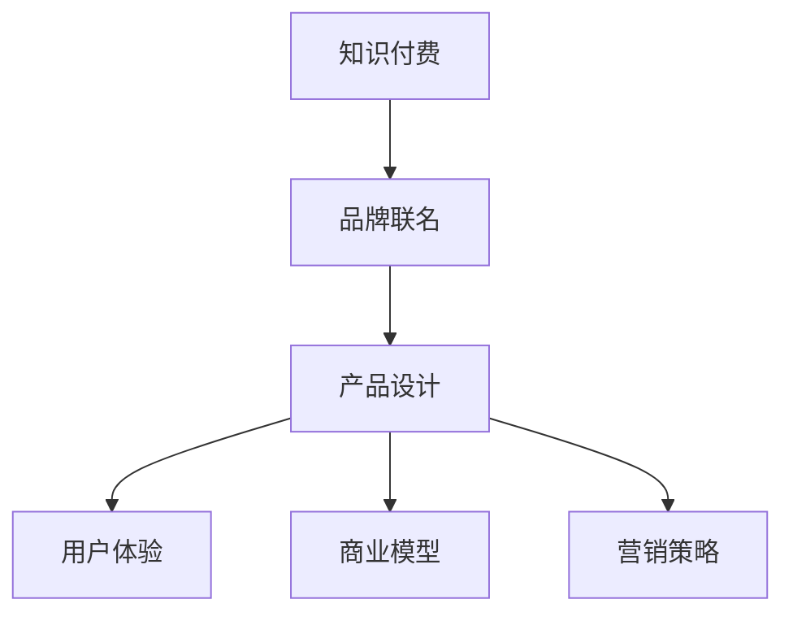

                 

# 知识付费赚钱的品牌联名产品设计与开发

> 关键词：知识付费,品牌联名,产品设计,商业模型,用户体验,营销策略

## 1. 背景介绍

### 1.1 问题由来
随着知识经济的兴起，在线知识付费市场逐步成熟，越来越多用户愿意为获取高质量知识付费。同时，各大品牌也希望能够通过与优质内容合作，提升品牌知名度和市场影响力。然而，如何将知识付费与品牌联名完美结合，同时确保产品设计贴合用户需求，实现盈利，是一个复杂而多维的问题。

### 1.2 问题核心关键点
如何结合知识付费和品牌联名，设计出既受欢迎又能实现商业价值的产品，是此领域的关键问题。核心在于：
- 精选内容：挑选高质量、符合用户兴趣的课程内容。
- 品牌适配：确定与课程内容适配的品牌联名方案。
- 用户体验：设计无缝的用户体验，提升用户满意度和留存率。
- 商业模型：构建可持续的商业盈利模式。
- 营销策略：制定精准的营销策略，吸引更多用户。

## 2. 核心概念与联系

### 2.1 核心概念概述

为更好地理解知识付费与品牌联名产品的设计与开发，本节将介绍几个密切相关的核心概念：

- 知识付费：用户为获取特定知识内容而支付费用的模式。平台提供优质课程内容，用户通过购买课程进行学习。
- 品牌联名：品牌与产品或服务进行合作，共同推出联名产品，提升品牌影响力和市场占有率。
- 产品设计：结合市场调研、用户反馈，设计满足用户需求、具有市场竞争力的产品。
- 用户体验：设计良好的用户体验，使用户在使用产品时感到满意和愉悦。
- 商业模型：通过产品设计，制定可持续的盈利模式，确保平台和品牌都能从中获利。
- 营销策略：通过市场分析，制定有效的营销方案，提升产品知名度和用户覆盖面。

这些概念之间通过以下Mermaid流程图展现：



这个流程图展示了知识付费、品牌联名、产品设计、用户体验、商业模型和营销策略之间的逻辑关系：

1. 知识付费是基础，提供优质内容吸引用户付费。
2. 品牌联名是手段，通过与品牌合作，提升产品附加值。
3. 产品设计是核心，确保产品符合用户需求，具有市场竞争力。
4. 用户体验是关键，提升用户满意度和留存率。
5. 商业模型是目标，实现平台和品牌的多赢局面。
6. 营销策略是手段，提升产品知名度和市场占有率。

## 3. 核心算法原理 & 具体操作步骤

### 3.1 算法原理概述

知识付费与品牌联名产品的设计与开发，本质上是一个市场驱动的产品创新过程。其核心在于通过数据驱动和用户反馈，不断迭代优化产品设计，同时与品牌联名提升品牌价值和产品竞争力。

### 3.2 算法步骤详解

1. **市场调研与用户画像构建**：
   - 收集用户需求和行为数据，构建用户画像。
   - 分析市场趋势和竞争对手情况，明确产品定位和竞争策略。

2. **内容筛选与品牌适配**：
   - 根据用户画像和市场趋势，筛选出高质量、符合用户兴趣的课程内容。
   - 与品牌合作，选择与其形象和用户群体适配的品牌联名。

3. **产品设计与用户体验优化**：
   - 设计简洁直观的产品界面，确保用户能轻松浏览和购买课程。
   - 优化用户体验，如视频质量、学习互动、社群交流等。

4. **商业模型制定**：
   - 设计合理的付费机制，如单次购买、月度/年度订阅、课程包等。
   - 考虑品牌联名的盈利模式，如联名课程、联名周边等。

5. **营销策略制定与执行**：
   - 制定精准的市场推广策略，通过社交媒体、内容营销、KOL合作等手段推广产品。
   - 持续监测市场反馈，根据数据调整营销策略。

### 3.3 算法优缺点

知识付费与品牌联名产品的设计与开发，具有以下优点：
- 用户粘性强：通过优质内容和品牌联名，提升用户满意度和留存率。
- 盈利模式多样：单次购买、订阅、联名周边等，多种盈利途径。
- 品牌价值提升：通过与知名品牌合作，提升产品附加值和市场影响力。

同时，也存在一些缺点：
- 内容质量要求高：优质内容是基础，需投入大量资源进行筛选和制作。
- 市场竞争激烈：需要不断创新和优化产品设计，才能在市场竞争中保持优势。
- 营销成本高：推广策略需精准，投入成本较高。

### 3.4 算法应用领域

知识付费与品牌联名产品的设计与开发，主要应用于以下几个领域：

- 在线教育：平台与优质课程内容合作，推出联名课程，提升用户购买率和满意度。
- 企业培训：企业与培训机构合作，提供定制化培训课程，提升员工技能。
- 品牌合作：品牌通过联名课程或周边产品，推广品牌理念，提升市场影响力。
- 内容变现：创作者与品牌合作，推出联名课程或产品，实现内容变现。
- 社交媒体：通过KOL合作，推出联名课程或产品，吸引更多用户关注和互动。

## 4. 数学模型和公式 & 详细讲解 & 举例说明

### 4.1 数学模型构建

知识付费与品牌联名产品的设计与开发，涉及多个维度的数据建模。这里以课程订阅率优化为例，构建数学模型：

假设课程订阅率为 $P$，影响因素包括课程质量 $Q$、品牌影响力 $B$、营销投入 $M$、用户反馈 $F$ 等。构建模型为：

$$
P = f(Q, B, M, F)
$$

### 4.2 公式推导过程

为了最大化订阅率 $P$，需要对模型进行优化。考虑用户行为和市场反馈，可以构建以下优化模型：

$$
\max P = \max f(Q, B, M, F)
$$

假设 $f(Q, B, M, F)$ 为非线性函数，可以通过梯度下降等优化算法，不断迭代调整 $Q, B, M, F$，使得 $P$ 最大化。

### 4.3 案例分析与讲解

以某在线教育平台与知名品牌合作推出联名课程为例：

- **课程质量**：选择行业专家设计高质量课程，包括视频讲解、练习题、案例分析等。
- **品牌影响力**：选择与品牌形象契合的课程内容，如某知名IT公司推出的编程基础课程。
- **营销投入**：通过社交媒体、内容营销、KOL合作等方式，提升课程曝光率。
- **用户反馈**：收集用户反馈，优化课程内容和用户体验。

## 5. 项目实践：代码实例和详细解释说明

### 5.1 开发环境搭建

要进行知识付费与品牌联名产品的设计与开发，首先需要搭建开发环境。以下是一个基于Python的开发环境配置流程：

1. 安装Python：
   ```bash
   python3 -m pip install --upgrade pip
   ```

2. 安装相关库：
   ```bash
   pip install numpy pandas sklearn tensorflow scikit-learn jupyter notebook
   ```

3. 创建虚拟环境：
   ```bash
   python -m venv venv
   source venv/bin/activate
   ```

### 5.2 源代码详细实现

以下是一个基于Python的知识付费平台开发的简单代码实现。

首先，定义课程订阅率的优化模型：

```python
import numpy as np
from sklearn.ensemble import RandomForestRegressor

def optimize_subscription_rate(Q, B, M, F):
    X = np.array([Q, B, M, F])
    y = np.array([P])
    model = RandomForestRegressor()
    model.fit(X, y)
    return model.predict(X)
```

接着，使用梯度下降算法优化模型参数：

```python
learning_rate = 0.01
num_iterations = 1000

for i in range(num_iterations):
    P = optimize_subscription_rate(Q, B, M, F)
    P_gradient = optimize_subscription_rate(Q + 0.01, B + 0.01, M + 0.01, F)
    Q -= learning_rate * (P_gradient - P)
    B -= learning_rate * (P_gradient - P)
    M -= learning_rate * (P_gradient - P)
    F -= learning_rate * (P_gradient - P)
```

最后，运行代码，监测订阅率变化：

```python
for i in range(num_iterations):
    P = optimize_subscription_rate(Q, B, M, F)
    print("Iteration %d, P = %f" % (i, P))
```

### 5.3 代码解读与分析

以上代码展示了基于Python的知识付费平台订阅率优化模型的实现。

- `optimize_subscription_rate` 函数：使用随机森林回归模型，构建订阅率与各影响因素之间的映射关系。
- 梯度下降算法：通过不断迭代，调整各影响因素的值，最大化订阅率。

## 6. 实际应用场景

### 6.1 在线教育

知识付费与品牌联名产品，在线教育是一个典型应用场景。平台与知名品牌合作，推出联名课程，提升课程吸引力，吸引更多用户订阅。

### 6.2 企业培训

企业通过与培训机构合作，提供定制化联名课程，提升员工技能，同时增强品牌影响力。

### 6.3 品牌合作

品牌通过联名课程或周边产品，推广品牌理念，提升市场影响力。

### 6.4 未来应用展望

未来，随着知识付费和品牌联名合作的深入，市场应用将更加广泛。

- 个性化推荐：通过大数据分析，提供个性化课程推荐，提升用户购买率。
- 动态定价：根据市场需求和用户行为，动态调整课程价格。
- 社交互动：通过社群交流、KOL合作，提升用户参与度和满意度。

## 7. 工具和资源推荐

### 7.1 学习资源推荐

为了更好地掌握知识付费与品牌联名产品的设计与开发，推荐以下学习资源：

1. 《知识付费营销》系列书籍：系统介绍知识付费市场现状、用户需求、内容制作、品牌合作等，提供实战经验和方法。

2. 《用户体验设计》课程：详细讲解用户体验设计的基本原理和具体方法，通过实战项目提升设计能力。

3. 《数据驱动产品开发》书籍：介绍数据驱动产品开发的全流程，从市场调研到产品迭代优化，提供全面的方法论。

4. 《品牌联名营销》文章：分享品牌联名营销的成功案例，分析背后的策略和执行细节。

5. 《知识付费平台案例》：展示知识付费平台的设计和开发案例，提供实操经验和启发。

### 7.2 开发工具推荐

为了提高开发效率，推荐以下开发工具：

1. Jupyter Notebook：提供交互式编程环境，便于快速迭代和实验。

2. GitHub：代码托管平台，便于协作开发和版本控制。

3. Docker：容器化工具，方便开发和部署环境的一致性。

4. Apache Kafka：消息队列系统，支持高吞吐量的数据处理和实时消息推送。

5. Apache Flink：流处理框架，支持大规模数据的实时处理和分析。

### 7.3 相关论文推荐

知识付费与品牌联名产品的设计与开发，涉及多个前沿研究领域。以下是几篇经典论文推荐：

1. A/B测试：《A/B Testing with Confidence》论文，介绍A/B测试的理论基础和应用方法。

2. 个性化推荐：《Personalized Recommendation Algorithms》论文，详细介绍个性化推荐算法的设计和实现。

3. 品牌联名营销：《Brand Collaboration in Marketing》文章，分享品牌联名营销的成功案例和策略。

4. 数据驱动产品开发：《Data-Driven Product Development》论文，介绍数据驱动产品开发的理论和方法。

5. 用户体验设计：《User Experience Design》书籍，系统介绍用户体验设计的理论和实践。

## 8. 总结：未来发展趋势与挑战

### 8.1 总结

本文对知识付费与品牌联名产品的设计与开发进行了全面系统的介绍。首先，阐述了知识付费与品牌联名技术的研究背景和意义，明确了该技术在拓展知识付费应用、提升用户满意度方面的独特价值。其次，从原理到实践，详细讲解了知识付费与品牌联名产品的数学模型和优化方法，给出了产品设计与开发的完整代码实现。同时，本文还广泛探讨了知识付费与品牌联名技术在在线教育、企业培训、品牌合作等多个行业领域的应用前景，展示了该技术的巨大潜力。此外，本文精选了技术开发所需的各类学习资源，力求为读者提供全方位的技术指引。

通过本文的系统梳理，可以看到，知识付费与品牌联名产品的设计与开发技术，正在成为知识付费市场的重要范式，极大地拓展了知识付费产品的应用边界，催生了更多的落地场景。伴随知识付费市场的持续扩大，品牌联名技术的不断成熟，相信知识付费与品牌联名技术将在更多领域得到应用，为知识经济和品牌经济发展提供新的动力。

### 8.2 未来发展趋势

展望未来，知识付费与品牌联名技术将呈现以下几个发展趋势：

1. 技术驱动创新：大数据、人工智能等技术的持续发展，将推动知识付费与品牌联名技术的不断创新。
2. 用户中心设计：以用户需求为导向，通过用户调研和反馈，不断优化产品设计和用户体验。
3. 动态定价策略：基于市场需求和用户行为，动态调整课程价格，实现收益最大化。
4. 品牌合作多样化：通过多品牌合作，提供更多元化的课程和周边产品，提升品牌影响力和用户粘性。
5. 营销策略精准化：通过精准的市场分析和个性化推荐，提升营销效果，吸引更多用户。
6. 社会责任强化：知识付费与品牌联名技术在推动知识普及、提升用户素养的同时，需注意社会责任和伦理问题。

以上趋势凸显了知识付费与品牌联名技术的广阔前景。这些方向的探索发展，必将进一步推动知识付费市场的成熟，为品牌经济发展注入新的活力。

### 8.3 面临的挑战

尽管知识付费与品牌联名技术已经取得了显著成果，但在迈向更加智能化、普适化应用的过程中，它仍面临着诸多挑战：

1. 内容质量瓶颈：如何保证高质量课程内容的持续供应，成为制约知识付费市场发展的关键。
2. 市场竞争激烈：随着越来越多的平台和企业进入知识付费市场，竞争将更加激烈。
3. 用户付费意愿：如何提升用户对知识付费的认知和接受度，需要更多的教育和引导。
4. 技术实现难度：知识付费与品牌联名技术涉及多领域知识，需综合运用多种技术手段。
5. 营销成本高：精准的营销策略需要投入大量资源，营销成本较高。
6. 社会责任问题：知识付费与品牌联名技术需注意避免误导性内容，确保社会责任和伦理安全。

正视知识付费与品牌联名技术面临的这些挑战，积极应对并寻求突破，将是大规模知识付费市场发展的重要保障。相信随着知识付费市场的持续发展和品牌联名技术的不断优化，知识付费与品牌联名技术必将在推动知识普及和品牌经济发展中发挥更大的作用。

### 8.4 研究展望

面对知识付费与品牌联名技术面临的挑战，未来的研究需要在以下几个方面寻求新的突破：

1. 知识图谱应用：利用知识图谱技术，提供更全面、准确的知识关联，增强课程内容和品牌联名的关联度。
2. 强化学习优化：引入强化学习算法，通过不断迭代优化产品设计，提升用户体验和课程质量。
3. 推荐系统优化：基于推荐系统算法，提供个性化推荐，提升用户满意度和购买率。
4. 实时互动优化：通过实时互动技术，增强课程互动性，提升用户参与度和学习效果。
5. 多模态融合：融合视觉、音频等多模态信息，提升课程和品牌联名的表现力和吸引力。
6. 社会责任体系：建立知识付费与品牌联名技术的社会责任体系，确保内容的合规性和伦理安全。

这些研究方向的探索，将引领知识付费与品牌联名技术的不断进步，为知识普及和品牌经济发展提供更加强大的技术支撑。面向未来，知识付费与品牌联名技术必将与更多领域的技术进行深度融合，共同推动社会经济的持续发展。

## 9. 附录：常见问题与解答

**Q1：知识付费与品牌联名产品如何提高用户参与度？**

A: 提高用户参与度需要多维度优化：
1. 内容质量：提供高质量、有趣且实用的课程内容，满足用户需求。
2. 互动设计：设计多种互动形式，如在线讨论、社群交流、KOL互动等，增强用户参与感。
3. 奖励机制：设置课程勋章、积分、排名等奖励机制，激励用户积极参与。
4. 实时反馈：通过用户反馈机制，及时了解用户需求和满意度，优化课程设计。

**Q2：如何设计合理的知识付费商业模式？**

A: 设计合理的知识付费商业模式，需要综合考虑以下几个因素：
1. 定价策略：根据课程成本和市场需求，设计合理的单次购买、订阅、联名周边等定价策略。
2. 盈利模式：多元化的盈利模式，如广告、联名合作、课程周边等，确保平台和品牌的多赢局面。
3. 用户体验：优化用户体验，提升用户满意度和留存率，从而实现收益最大化。
4. 数据分析：通过数据分析，及时调整商业模式和运营策略，确保可持续增长。

**Q3：如何实现品牌联名的精准营销？**

A: 实现品牌联名的精准营销，需要多渠道、多方法综合运用：
1. 目标群体分析：通过大数据分析，明确目标用户群体，制定精准的营销策略。
2. 渠道选择：选择目标用户常用的社交媒体、内容平台等渠道，进行精准推广。
3. KOL合作：通过KOL合作，扩大品牌联名影响力，吸引更多目标用户关注。
4. 广告投放：精准投放广告，提升品牌联名课程的曝光率。
5. 用户反馈：通过用户反馈，不断优化营销策略，提升效果。

**Q4：知识付费平台如何提升课程质量？**

A: 提升课程质量需要从多个方面进行优化：
1. 专家合作：邀请行业专家、知名讲师进行课程设计，确保内容质量。
2. 用户反馈：收集用户反馈，不断优化课程内容和形式。
3. 持续更新：定期更新课程内容，保持课程的实用性和时效性。
4. 课程认证：设置课程认证机制，确保课程的权威性和专业性。
5. 实时互动：通过实时互动技术，增强课程互动性，提升学习效果。

**Q5：知识付费与品牌联名产品的设计与开发有哪些工具和技术支持？**

A: 知识付费与品牌联名产品的设计与开发，需使用多种工具和技术支持：
1. 大数据分析：利用大数据分析工具，进行市场趋势分析和用户画像构建。
2. 人工智能：通过AI技术，进行课程推荐、用户画像构建等。
3. 用户体验设计：使用用户体验设计工具，优化产品界面和用户体验。
4. 数据可视化：使用数据可视化工具，进行数据分析和呈现。
5. 协作开发工具：使用协作开发工具，进行团队协作和版本控制。

这些工具和技术支持，将大大提升知识付费与品牌联名产品的设计与开发效率和质量。

---

作者：禅与计算机程序设计艺术 / Zen and the Art of Computer Programming

