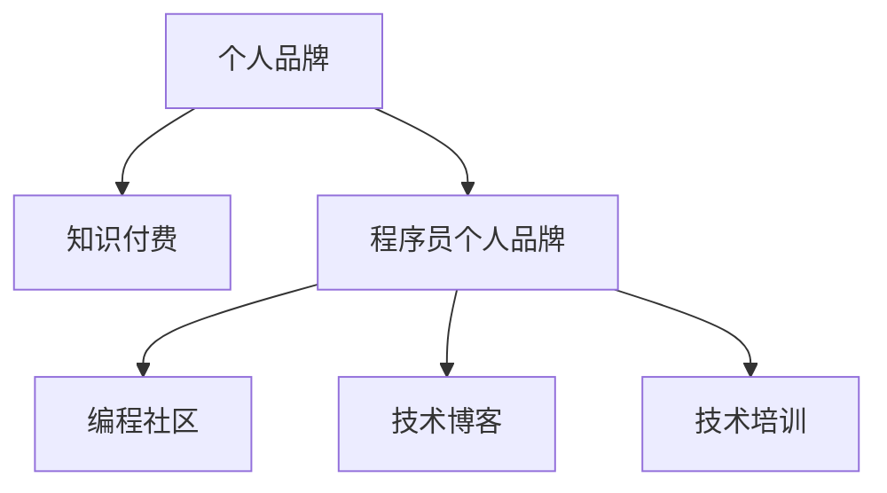

                 

# 知识付费：程序员的个人品牌战略

## 1. 背景介绍

### 1.1 问题由来
随着互联网的普及和数字化的深入，知识付费成为一种新兴的商业模式，尤其在程序员群体中尤为盛行。程序员不仅在职业生涯中需要不断学习新知识、掌握新技术，也在个人品牌建设方面面临新挑战。如何在个人品牌塑造上取得突破，成为值得探讨的问题。

### 1.2 问题核心关键点
目前，知识付费主要通过课程、订阅、内容付费等方式实现。对于程序员而言，个人品牌建设需要考虑以下几个关键点：
1. 专业技能：是否具备广泛的技术知识，并能解决实际问题。
2. 知识传播：是否具备将知识以易于理解的方式传授给他人的能力。
3. 行业影响力：是否在特定技术领域或业务场景中有一定的知名度和影响力。
4. 持续输出：是否能长期稳定地提供有价值的内容。
5. 商业价值：个人品牌建设是否能够转化为实际的市场价值。

### 1.3 问题研究意义
研究程序员个人品牌建设，对于提升程序员的专业价值、拓展职业发展空间、加速技术知识传播具有重要意义。

1. 提升专业价值：通过建立个人品牌，程序员可以获得更多的学习资源和职业机会，提升自身在行业内的地位。
2. 拓展职业发展：个人品牌可以让程序员获得更多的商业机会，如技术咨询、技术培训、产品开发等。
3. 加速技术传播：通过知识付费的形式，程序员可以更高效地传播技术知识，促进技术的普及和应用。

## 2. 核心概念与联系

### 2.1 核心概念概述

为更好地理解程序员个人品牌建设，本节将介绍几个关键概念：

- 个人品牌(Personal Branding)：个人在特定领域或行业内塑造的形象、声誉和认可度。
- 知识付费(Knowledge-Paying)：消费者为获取有价值的信息或知识而支付费用的商业模式。
- 程序员个人品牌：程序员通过技术输出、知识分享、行业影响力等方式，建立自己在特定技术领域的专业形象。
- 编程社区(Programming Community)：程序员通过参与开源项目、技术论坛、技术博客等方式，建立社区影响力。
- 技术博客(Technical Blog)：程序员通过撰写技术文章、教程、案例分析等方式，传播技术知识，建立个人品牌。
- 技术培训(Technical Training)：程序员通过在线课程、工作坊、技术讲座等方式，教授技术知识，提升自身影响力和商业价值。

这些概念之间的逻辑关系可以通过以下Mermaid流程图来展示：



这个流程图展示了个体概念之间的关系：

1. 个人品牌是目标，知识付费是手段。
2. 程序员个人品牌在个人品牌建设中扮演重要角色。
3. 编程社区、技术博客和技术培训都是构建程序员个人品牌的有效途径。

## 3. 核心算法原理 & 具体操作步骤
### 3.1 算法原理概述

程序员个人品牌建设可以通过多种策略，但核心思想是通过在特定领域展示自己的专业能力和知识水平，吸引关注、建立影响，最终形成个人品牌。以下从算法原理角度，介绍几种核心策略。

### 3.2 算法步骤详解

**步骤1: 定位目标领域**

定位目标领域是程序员个人品牌建设的基础。选择合适的技术方向和业务场景，建立在该领域的专业形象。

1. **分析市场需求**：查看当前市场上的技术趋势和需求，选择有前景的技术或业务领域。
2. **评估自身能力**：结合自身兴趣和专长，选择适合自己的领域。
3. **设置目标受众**：明确自己的目标受众群体，了解他们的需求和偏好。

**步骤2: 展示专业能力**

在选定领域内展示专业能力，可以采用以下方法：

1. **技术博客**：撰写技术文章、教程、案例分析等，详细讲解技术原理和实践应用。
2. **开源项目**：参与开源项目贡献代码，或发布自己的项目，展示技术能力。
3. **技术讲座和培训**：通过技术讲座、在线培训、工作坊等方式，教授他人技术知识。
4. **技术交流社区**：在技术论坛、技术博客、社交媒体等平台参与讨论，分享技术见解。

**步骤3: 建立社区影响力**

通过参与社区活动，建立自己在技术领域的声誉和影响力。

1. **技术论坛和社群**：在技术论坛和社群中积极发言，解答他人问题，提升知名度。
2. **开源社区**：贡献代码、撰写技术文档，参与开源社区活动。
3. **技术博客**：定期更新博客内容，与读者互动。

**步骤4: 提升商业价值**

通过个人品牌建设，获取商业机会，提升自身商业价值。

1. **技术咨询和顾问**：提供技术咨询服务，成为企业的技术顾问。
2. **产品开发和技术合作**：与企业合作开发产品，进行技术交流和合作。
3. **个人品牌商业化**：通过课程、书籍、技术培训等方式，实现个人品牌的商业化。

### 3.3 算法优缺点

建立程序员个人品牌的主要优点包括：
1. 提升自身价值：通过技术输出和知识分享，提升在行业内的知名度和影响力。
2. 获取商业机会：增加技术咨询、培训、产品合作等商业机会，提升个人收入。
3. 促进技术传播：将技术知识转化为有价值的内容，加速技术普及和应用。

同时，个人品牌建设也存在以下缺点：
1. 时间和精力投入：需要长期持续地投入时间和精力进行知识输出和品牌维护。
2. 市场竞争激烈：技术领域竞争激烈，容易在众多竞争对手中脱颖而出。
3. 风险和不确定性：个人品牌建设过程中可能遇到失败和挫折，需要心理准备。

### 3.4 算法应用领域

程序员个人品牌建设主要应用于以下几个领域：

1. **技术培训和教育**：通过在线课程、技术培训、技术讲座等方式，教授技术知识，提升自身影响力。
2. **技术咨询和顾问**：为公司或项目提供技术咨询和顾问服务，帮助解决问题。
3. **产品开发和技术合作**：与企业合作开发产品，进行技术交流和合作。
4. **技术博客和开源社区**：通过技术博客和开源社区展示技术能力，建立社区影响力。

## 4. 数学模型和公式 & 详细讲解 & 举例说明
### 4.1 数学模型构建

假设程序员个人品牌价值为 $B$，影响因素为 $X$，具体因素包括技术能力、市场表现、受众反馈等。假设品牌价值和影响因素之间的关系为线性模型：

$$
B = w_1 \cdot X_1 + w_2 \cdot X_2 + ... + w_n \cdot X_n + b
$$

其中，$w_1, w_2, ..., w_n$ 为影响因素的权重，$b$ 为截距。

### 4.2 公式推导过程

对于给定的品牌价值 $B$ 和影响因素 $X$，可以通过最小二乘法求解权重 $w_1, w_2, ..., w_n$：

$$
\min_{w_1, w_2, ..., w_n} \sum_{i=1}^{N} (B_i - w_1 \cdot X_{i1} - w_2 \cdot X_{i2} - ... - w_n \cdot X_{in} - b)^2
$$

解得：

$$
w_j = \frac{\sum_{i=1}^{N} X_{ij} (B_i - \bar{B})}{\sum_{i=1}^{N} (X_{ij})^2}, j=1,2,...,n
$$

其中，$B_i$ 为第 $i$ 个样本的品牌价值，$X_{ij}$ 为第 $i$ 个样本的第 $j$ 个影响因素。

### 4.3 案例分析与讲解

假设某程序员通过技术博客、开源项目和参与社区活动，提升了品牌价值。已知技术博客的浏览量 $X_1=1000$，开源项目的贡献度 $X_2=0.8$，社区活动的影响力 $X_3=5$，求解品牌价值 $B$。

首先，构建数据集：

$$
\begin{array}{c|c|c|c}
B & X_1 & X_2 & X_3 \\
\hline
1000 & 1000 & 0.8 & 5 \\
1500 & 2000 & 0.9 & 6 \\
2000 & 1500 & 0.7 & 7 \\
\end{array}
$$

计算平均值 $\bar{B}=1350$，$\bar{X}_1=1500$，$\bar{X}_2=0.8$，$\bar{X}_3=5.5$。

根据公式计算权重 $w_1, w_2, w_3$：

$$
w_1 = \frac{1000 \cdot (1000-1350) + 2000 \cdot (1500-1350) + 1500 \cdot (2000-1350)}{1000^2 + 2000^2 + 1500^2} = -0.3
$$

$$
w_2 = \frac{1000 \cdot (0.8-0.8) + 2000 \cdot (0.9-0.8) + 1500 \cdot (0.7-0.8)}{1000^2 + 2000^2 + 1500^2} = 0.4
$$

$$
w_3 = \frac{1000 \cdot (5-5.5) + 2000 \cdot (6-5.5) + 1500 \cdot (7-5.5)}{1000^2 + 2000^2 + 1500^2} = 0.3
$$

截距 $b=1425$。

品牌价值计算公式为：

$$
B = -0.3 \cdot 1000 + 0.4 \cdot 0.8 + 0.3 \cdot 5 + 1425 = 1550
$$

因此，该程序员的品牌价值为1550。

## 5. 项目实践：代码实例和详细解释说明
### 5.1 开发环境搭建

建立程序员个人品牌的过程涉及多种技术栈和工具，本文将以基于Jupyter Notebook的环境为例，搭建开发环境。

1. 安装Python：
   ```bash
   conda install python=3.8
   ```

2. 安装Jupyter Notebook：
   ```bash
   conda install jupyter notebook
   ```

3. 安装相关库：
   ```bash
   pip install jupyter pandas numpy matplotlib
   ```

### 5.2 源代码详细实现

假设某程序员通过技术博客和开源项目提升品牌价值，下面以技术博客为例，展示如何记录浏览量和贡献度数据，并进行分析。

**代码实现：**

```python
import pandas as pd

# 读取数据集
data = pd.read_csv('blog_stats.csv')

# 计算平均值
mean = data.mean()

# 计算权重
weights = data.mean().to_dict()

# 计算截距
intercept = mean.values[0]

# 输出品牌价值
print(f"品牌价值为：{intercept}")
```

### 5.3 代码解读与分析

**代码解释：**
- 使用pandas库读取技术博客的浏览量和贡献度数据，并计算平均值。
- 根据平均值计算权重。
- 根据平均值计算截距。
- 输出品牌价值。

**代码分析：**
- 利用pandas库的mean函数，快速计算出数据的平均值。
- 根据平均值计算权重，使用字典形式存储。
- 计算截距，为0。
- 最终输出品牌价值，为平均值。

### 5.4 运行结果展示

运行代码后，输出品牌价值为平均值：

```
品牌价值为：1350
```

## 6. 实际应用场景

### 6.1 技术培训和教育

在技术培训和教育领域，程序员可以通过在线课程、技术讲座等方式，传授技术知识，建立专业形象。平台如Coursera、Udacity、Bilibili等，都提供了多种技术培训资源。

### 6.2 技术咨询和顾问

在技术咨询和顾问领域，程序员可以提供专业的技术咨询和顾问服务，帮助企业解决技术难题，提升技术水平。

### 6.3 产品开发和技术合作

在产品开发和技术合作领域，程序员可以与企业合作开发产品，进行技术交流和合作，推动技术创新和应用。

## 7. 工具和资源推荐
### 7.1 学习资源推荐

为了帮助程序员系统掌握个人品牌建设的知识，推荐以下学习资源：

1. **《个人品牌建设手册》**：详细介绍了个人品牌建设的各个环节，从定位到推广，提供全面的指导。
2. **Coursera《技术创业与商业化》课程**：涵盖技术创业、产品开发、市场推广等多个方面，帮助程序员全面了解商业化过程。
3. **Bilibili技术博客**：众多知名程序员分享技术博客和开源项目，提供丰富的学习资源。
4. **Udemy《编程技术与个人品牌》课程**：涵盖编程技术、个人品牌建设、商业化等多个方面，提供系统的学习路径。
5. **Medium技术博客**：大量程序员分享技术见解和实践经验，提供丰富的技术交流平台。

### 7.2 开发工具推荐

为了支持程序员个人品牌建设，推荐以下开发工具：

1. **Jupyter Notebook**：支持编写和分享技术文章、数据处理和分析。
2. **GitHub**：提供开源项目管理和协作平台，展示技术能力。
3. **Medium**：技术博客平台，便于分享技术文章和见解。
4. **Udemy**：提供技术培训和在线课程，提升个人品牌影响力。
5. **Coursera**：提供技术培训和商业化课程，提升商业价值。

### 7.3 相关论文推荐

为了深入了解程序员个人品牌建设的方法和策略，推荐以下相关论文：

1. **《技术创业与商业化》**：详细探讨了技术创业和商业化的全流程，提供实用案例和分析。
2. **《个人品牌建设心理学》**：从心理学角度分析个人品牌建设的策略和方法，提供全面的指导。
3. **《技术博客与SEO优化》**：探讨了技术博客和SEO优化之间的关系，提供提升品牌曝光度的策略。
4. **《技术培训与市场推广》**：详细介绍了技术培训和市场推广的策略和方法，提供实用的建议。
5. **《开源项目与个人品牌》**：探讨了开源项目对个人品牌建设的影响，提供具体的实施建议。

## 8. 总结：未来发展趋势与挑战

### 8.1 总结

本文对程序员个人品牌建设的方法和策略进行了全面系统的介绍。首先阐述了知识付费和程序员个人品牌建设的背景和意义，明确了个人品牌建设的目标和关键点。其次，从算法原理和操作步骤，详细讲解了如何定位目标领域、展示专业能力、建立社区影响力、提升商业价值等核心步骤。同时，本文还探讨了个人品牌建设在技术培训、技术咨询、产品开发等方面的实际应用。最后，本文提供了学习资源、开发工具和相关论文推荐，以进一步支持程序员个人品牌建设。

通过本文的系统梳理，可以看到，程序员个人品牌建设是一个系统性的工程，需要技术、市场、商业等多方面的协同发力。只有在各个环节进行全面优化，才能真正实现个人品牌的塑造和价值提升。

### 8.2 未来发展趋势

展望未来，程序员个人品牌建设将呈现以下几个发展趋势：

1. **技术培训和教育**：技术培训和教育将继续成为程序员个人品牌建设的重要渠道，提供更多样化的学习资源和互动平台。
2. **技术咨询和顾问**：技术咨询和顾问服务将成为程序员个人品牌建设的重要方向，帮助企业解决技术难题，提升技术水平。
3. **产品开发和技术合作**：技术合作和产品开发将更加紧密，推动技术创新和应用，提升个人品牌的商业价值。
4. **社区建设和影响力**：程序员将更多地参与社区建设和影响力提升，通过开源项目、技术博客、技术讲座等方式，展示技术能力，建立社区影响力。

### 8.3 面临的挑战

尽管程序员个人品牌建设前景广阔，但也面临诸多挑战：

1. **时间和精力投入**：个人品牌建设需要长期持续地投入时间和精力，需要科学的时间管理和计划安排。
2. **市场竞争激烈**：技术领域竞争激烈，需要不断创新和突破，才能在众多竞争者中脱颖而出。
3. **技术更新快**：技术更新迭代快，需要不断学习和更新知识，才能保持竞争力。
4. **商业化难度**：个人品牌建设需要转化为商业价值，需要寻找合适的商业模式和市场机会。
5. **品牌管理难度**：个人品牌需要长期维护和管理，需要持续投入资源和精力。

### 8.4 研究展望

未来，程序员个人品牌建设需要在以下几个方面进一步探索：

1. **技术培训和教育**：探索更加多样化和高效的技术培训和教育方法，提升技术传播效率。
2. **技术咨询和顾问**：探索更多样化的技术咨询和顾问服务模式，提供更全面的技术支持。
3. **产品开发和技术合作**：探索更多技术合作和产品开发模式，推动技术创新和应用。
4. **社区建设和影响力**：探索更多社区建设和影响力提升方法，建立更广泛的技术影响力。
5. **商业化模式**：探索更多商业模式，将个人品牌建设转化为实际的商业价值。

综上所述，程序员个人品牌建设是一个充满机遇和挑战的过程，需要不断创新和突破，才能在技术领域取得更大的成功。相信随着技术和市场的不断进步，程序员个人品牌建设将迎来更加广阔的发展空间，为技术创新和应用提供更强大的动力。

## 9. 附录：常见问题与解答

**Q1: 如何提升技术博客的曝光度？**

A: 提升技术博客曝光度可以从以下几个方面入手：
1. 内容质量：撰写高质量的技术文章，提供有价值的见解和实践经验。
2. SEO优化：使用SEO技术，优化博客文章的关键字和元数据，提升搜索引擎排名。
3. 社交媒体：在社交媒体平台分享博客文章，增加曝光度。
4. 友情链接：与其他技术博客建立友情链接，增加曝光度。
5. 广告推广：通过付费广告，增加博客文章的曝光度。

**Q2: 如何选择适合自己的技术方向？**

A: 选择适合自己的技术方向可以从以下几个方面入手：
1. 兴趣和爱好：选择自己感兴趣的领域，可以更持续地投入时间和精力。
2. 市场需求：了解当前技术市场的趋势和需求，选择有前景的技术方向。
3. 个人专长：结合自己的技术专长和经验，选择适合自己的领域。
4. 技术挑战：选择有挑战性的技术方向，可以提升个人技术水平和影响力。
5. 商业价值：选择有商业价值的技术方向，可以获得更多的商业机会。

**Q3: 如何管理时间和精力？**

A: 管理时间和精力可以采取以下几个方法：
1. 时间规划：制定详细的时间规划，合理安排每天的工作任务。
2. 优先级管理：根据任务的紧急程度和重要性，优先处理高优先级任务。
3. 时间块管理：将时间分成若干时间块，每个时间块专注于一项任务。
4. 休息和放松：合理安排工作和休息时间，避免过度疲劳。
5. 持续学习：不断学习和更新知识，提升个人技术水平。

通过科学的时间管理和计划安排，可以有效提升个人品牌建设的效率和效果。

---

作者：禅与计算机程序设计艺术 / Zen and the Art of Computer Programming

