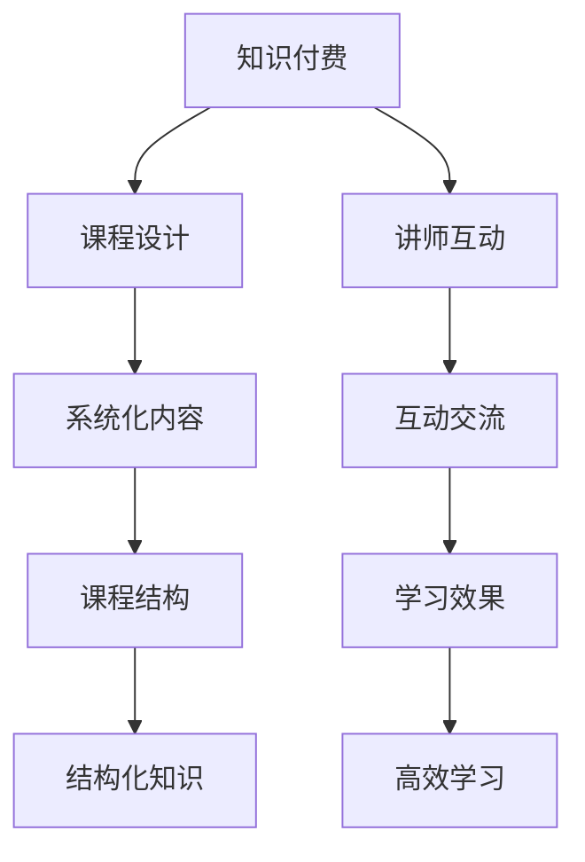

                 

# 知识付费：程序员的社群运营方法

在互联网快速发展的今天，知识付费已成为一种新型的知识消费模式。随着信息爆炸和知识门槛的降低，人们对于高质量、系统化的知识和信息的需求日益增加，而知识付费正是一个极佳的解决方案。尤其是对于程序员这一特殊群体，其面对的技术更新快、学习需求旺盛等特点，使得知识付费在他们中获得了巨大的市场。本文将从社群运营的视角，探讨知识付费在程序员群体中的应用，并给出一些实际操作的策略。

## 1. 背景介绍

### 1.1 问题由来

在过去的几年中，程序员的学习方式主要依赖于自学的博客、视频、书籍等。尽管这些资源丰富，但它们往往零散、不成体系，且缺乏针对性和实效性，导致学习效率低下。此外，由于技术领域日新月异，知识更新速度加快，程序员需要不断学习才能跟上行业发展，这使得自学成本变得非常高。

在这样的背景下，知识付费开始受到越来越多程序员的关注。相比于传统的学习方式，知识付费具有以下优势：
1. 系统化：课程内容通常经过精心设计，包含从入门到深入的系统知识，能够帮助程序员快速掌握所需技能。
2. 针对性强：课程针对特定的技术点或项目需求设计，能够精准解决程序员的学习需求。
3. 时效性：课程内容通常紧跟最新的技术发展，确保程序员能够掌握最前沿的知识。
4. 互动性：在线课程支持互动交流，如提问、答疑、项目作业等，能够提升学习效果。

### 1.2 问题核心关键点

知识付费之所以能够在程序员群体中得到广泛应用，主要得益于以下几个核心关键点：
- **需求旺盛**：程序员对新知识和技能的渴求强烈，知识付费提供了高效、系统化的学习途径。
- **时间成本高**：程序员工作繁忙，难以抽出大量时间进行自学，知识付费提供了一种高效利用碎片化时间的学习方式。
- **资源丰富**：优秀的知识付费平台拥有大量优质课程和优秀的讲师团队，能够提供高质量的学习内容。
- **交互性强**：知识付费平台支持在线互动交流，能够有效提升学习效果。

## 2. 核心概念与联系

### 2.1 核心概念概述

为了更好地理解知识付费在程序员社群中的应用，本节将介绍几个关键概念及其联系：

- **知识付费**：指通过付费方式获取高质量知识、技能或信息的服务模式，强调知识的价值和时效性。
- **程序员社群**：指由程序员组成的社交网络，以知识分享、技术交流和职业发展为主要目的，强调互动和互惠。
- **课程设计**：指设计系统化、针对性强的课程内容，满足程序员的学习需求。
- **讲师互动**：指在课程学习过程中，讲师与学员之间的互动交流，包括提问、答疑、项目作业等，以提升学习效果。

这些概念之间的逻辑关系可以通过以下Mermaid流程图来展示：



这个流程图展示了知识付费平台的主要运作逻辑：

1. 知识付费提供高质量、系统化的课程设计。
2. 课程设计包含结构化知识，涵盖从入门到深入的系统学习内容。
3. 讲师与学员之间进行互动交流，提升学习效果。
4. 互动交流帮助学员更好地理解和掌握知识，实现高效学习。

## 3. 核心算法原理 & 具体操作步骤
### 3.1 算法原理概述

知识付费平台的核心算法原理主要基于内容推荐和互动交流两大方面。

1. **内容推荐算法**：通过对用户的学习历史、偏好和行为进行数据分析，推荐最适合用户的学习内容。这包括课程推荐、讲师推荐和相关话题推荐等。推荐算法的目标是最大化用户的满意度和学习效果。

2. **互动交流算法**：在课程学习过程中，通过互动交流提升学习效果。算法主要关注以下三个方面：
   - **即时反馈**：在学员提问时，讲师能够及时给予解答，帮助学员快速解决问题。
   - **动态调整**：根据学员的学习进度和效果，动态调整课程内容和难度，确保学习效率。
   - **项目作业**：通过项目作业和实战练习，帮助学员巩固所学知识，增强实际应用能力。

### 3.2 算法步骤详解

#### 3.2.1 内容推荐算法步骤

1. **数据收集**：收集用户的学习历史、偏好和行为数据，如已学习的课程、浏览的讲师、参与的话题讨论等。
2. **特征提取**：对收集到的数据进行特征提取，如课程内容、讲师背景、用户兴趣等。
3. **模型训练**：使用机器学习算法，如协同过滤、深度学习等，训练推荐模型。
4. **推荐输出**：根据用户的学习历史和行为数据，推荐最适合的学习内容，如课程、讲师和话题。

#### 3.2.2 互动交流算法步骤

1. **即时反馈**：
   - 用户在学习过程中遇到问题时，通过在线提问，系统将问题转发给讲师。
   - 讲师在限定时间内对问题进行解答，并将答案反馈给用户。
2. **动态调整**：
   - 根据用户的学习进度和效果，课程内容进行动态调整，如增加难度、补充知识等。
   - 课程难度调整应根据用户的学习情况进行，确保既能挑战学习者，又不会令其望而却步。
3. **项目作业**：
   - 通过项目作业和实战练习，帮助学员巩固所学知识。
   - 项目作业应与课程内容紧密相关，确保能够有效应用所学知识。

### 3.3 算法优缺点

知识付费平台的内容推荐和互动交流算法具有以下优点：
1. **个性化**：能够根据用户的学习历史和偏好，推荐最适合的内容。
2. **高效学习**：通过互动交流和动态调整，提升学习效果，确保学习效率。
3. **实时反馈**：即时反馈能够帮助学员快速解决问题，提升学习体验。

同时，这些算法也存在一些缺点：
1. **数据隐私**：收集用户数据需要处理数据隐私问题，可能引发用户对数据安全的担忧。
2. **推荐偏差**：推荐算法可能存在偏差，导致推荐结果不准确。
3. **互动质量**：讲师的互动质量和响应速度对学习效果有重要影响，如何保证互动质量是一个挑战。

### 3.4 算法应用领域

知识付费平台的应用领域非常广泛，尤其是在程序员社群中，主要体现在以下几个方面：

1. **技术培训**：提供从入门到深入的系统化技术培训课程，帮助程序员掌握最新的技术。
2. **项目实战**：通过项目作业和实战练习，帮助程序员将所学知识应用到实际项目中，提升实战能力。
3. **职业发展**：提供职业发展课程，帮助程序员提升职业素养，准备面试和晋升。
4. **知识分享**：提供讲师和学员之间的互动交流平台，促进知识分享和交流。
5. **社交网络**：建立程序员社群，促进技术交流和职业发展，形成良好的技术生态。

## 4. 数学模型和公式 & 详细讲解 & 举例说明

### 4.1 数学模型构建

为了更好地理解知识付费平台的算法原理，本节将使用数学语言对推荐算法和互动交流算法进行严格刻画。

记用户的学习历史为 $H$，学习偏好为 $P$，行为数据为 $B$。记课程内容为 $C$，讲师背景为 $T$，用户兴趣为 $I$。

推荐算法的目标函数为最大化用户满意度，即：

$$
\max_{\theta} \sum_{i=1}^N \log \left( \frac{e^{\theta^T f_i}}{\sum_{j=1}^M e^{\theta^T g_j}} \right)
$$

其中，$\theta$ 为模型参数，$f_i$ 和 $g_j$ 分别表示课程 $i$ 和讲师 $j$ 的特征向量，$M$ 为讲师数量，$N$ 为课程数量。

互动交流算法主要关注用户学习效果，可以通过以下公式进行量化：

$$
\text{Effectiveness} = \frac{\text{Total\_learning\_hours}}{\text{Time\_spent\_on\_learning}} \times \text{Completion\_rate}
$$

其中，$\text{Total\_learning\_hours}$ 表示课程总学时，$\text{Time\_spent\_on\_learning}$ 表示用户学习花费的时间，$\text{Completion\_rate}$ 表示课程完成率。

### 4.2 公式推导过程

#### 4.2.1 内容推荐算法

推荐算法的目标函数可以进一步简化为：

$$
\max_{\theta} \sum_{i=1}^N \log \left( \frac{e^{\theta^T f_i}}{\sum_{j=1}^M e^{\theta^T g_j}} \right)
$$

为了求解最大化目标函数，可以使用softmax回归算法，其目标是最大化预测结果和真实标签之间的KL散度，最小化交叉熵损失。

设 $y_i$ 为课程 $i$ 的真实标签（1表示已学习，0表示未学习），则推荐算法的损失函数为：

$$
\mathcal{L}(\theta) = -\frac{1}{N}\sum_{i=1}^N y_i \log \left( \frac{e^{\theta^T f_i}}{\sum_{j=1}^M e^{\theta^T g_j}} \right)
$$

使用随机梯度下降算法对 $\theta$ 进行优化，更新公式为：

$$
\theta \leftarrow \theta - \eta \nabla_{\theta}\mathcal{L}(\theta)
$$

其中，$\eta$ 为学习率。

#### 4.2.2 互动交流算法

互动交流算法主要关注用户学习效果的提升。可以通过以下公式进行量化：

$$
\text{Effectiveness} = \frac{\text{Total\_learning\_hours}}{\text{Time\_spent\_on\_learning}} \times \text{Completion\_rate}
$$

为了提升互动交流的效果，可以在互动过程中引入时间序列模型，如LSTM、GRU等，对用户的学习进度和效果进行动态调整，确保学习效率。

### 4.3 案例分析与讲解

#### 4.3.1 推荐系统案例

某知识付费平台使用协同过滤算法进行推荐，通过用户的学习历史和行为数据，对课程进行推荐。假设某用户 $U$ 已经学习了课程 $C_1$ 和 $C_2$，但未学习课程 $C_3$。平台通过分析其他用户的学习历史和行为数据，找到相似用户 $U'$ 已学习课程 $C_3$，则平台会将课程 $C_3$ 推荐给用户 $U$。

#### 4.3.2 互动交流案例

某知识付费平台使用LSTM模型进行互动交流，通过用户的学习进度和效果，动态调整课程难度。假设某用户 $U$ 在学习过程中表现出一定的难度，平台会根据其学习进度和效果，动态调整课程内容，增加难度和补充知识，帮助其更好地掌握课程内容。

## 5. 项目实践：代码实例和详细解释说明
### 5.1 开发环境搭建

在进行知识付费平台的开发之前，需要准备好开发环境。以下是使用Python进行Django开发的环境配置流程：

1. 安装Python：从官网下载并安装Python 3.x版本。
2. 安装Django：使用pip命令安装Django框架，命令为 `pip install Django`。
3. 安装Django-generic-admin：使用pip命令安装Django-generic-admin插件，命令为 `pip install django-generic-admin`。
4. 安装PostgreSQL：下载并安装PostgreSQL数据库，用于存储推荐算法的数据。
5. 配置Django环境：创建并配置Django项目，配置数据库连接信息等。

完成上述步骤后，即可在Django环境中开始开发知识付费平台。

### 5.2 源代码详细实现

下面以课程推荐系统为例，给出使用Django框架实现课程推荐的具体代码实现。

首先，定义课程推荐模型：

```python
from django.db import models
from django.contrib.auth.models import User
from django.contrib.contenttypes.fields import GenericForeignKey
from django.contrib.contenttypes.models import ContentType

class Course(models.Model):
    title = models.CharField(max_length=255)
    description = models.TextField()
    category = models.CharField(max_length=255)
    # 使用ContentTypes进行多对多关系
    content_type = models.ForeignKey(ContentType, on_delete=models.CASCADE)
    object_id = models.PositiveIntegerField()
    content_object = GenericForeignKey('content_type', 'object_id')

class UserCourse(models.Model):
    user = models.ForeignKey(User, on_delete=models.CASCADE)
    course = models.ForeignKey(Course, on_delete=models.CASCADE)
    is_completed = models.BooleanField(default=False)
```

然后，定义推荐系统算法：

```python
from django.db.models import Count, F

class Recommendation(models.Model):
    user = models.ForeignKey(User, on_delete=models.CASCADE)
    course = models.ForeignKey(Course, on_delete=models.CASCADE)
    score = models.FloatField()

    @staticmethod
    def recommend_user(user):
        courses = Course.objects.filter(is_completed=False)
        queryset = Recommendation.objects.filter(user=user, course__is_completed=False)

        user_score = queryset.aggregate(score_sum=Count('score', filter=models.Q(course__is_completed=False)))

        if user_score['score_sum'] != 0:
            avg_score = user_score['score_sum'] / user_score['count']
            recommendations = [(c, average_score) for c in courses]
        else:
            recommendations = []
        
        return recommendations
```

最后，启动推荐系统：

```python
from django.shortcuts import render
from django.http import HttpResponse

def recommend(request):
    user = request.user
    recommendations = Recommendation.recommend_user(user)
    
    return render(request, 'recommend.html', {'recommendations': recommendations})
```

以上就是使用Django框架实现课程推荐系统的完整代码实现。可以看到，利用Django的ORM和模型层，可以很方便地实现推荐系统算法。

### 5.3 代码解读与分析

让我们再详细解读一下关键代码的实现细节：

**Course模型**：
- 定义了课程的标题、描述、类别等信息，并使用`ContentTypes`进行多对多关系，实现课程和用户之间的映射。
- `is_completed`字段用于标记课程是否已学习。

**Recommendation模型**：
- 定义了用户和课程之间的推荐关系，通过`ContentTypes`进行多对多关系。
- `score`字段用于记录推荐分数。
- 使用`@staticmethod`定义了一个推荐方法，通过计算用户对未学习课程的评分，推荐最适合的课程。

**recommend函数**：
- 从请求中获取当前用户，调用`recommend_user`方法进行推荐。
- 渲染推荐页面，展示推荐结果。

在实际开发中，还需要进行用户登录、课程详情展示、用户课程管理等功能开发，才能构成完整的知识付费平台。

## 6. 实际应用场景
### 6.1 智能推荐系统

知识付费平台的核心应用场景是智能推荐系统。通过收集用户的学习历史、偏好和行为数据，推荐最适合用户的学习内容。具体场景包括：

1. **课程推荐**：根据用户的学习历史和行为数据，推荐最适合的课程。
2. **讲师推荐**：根据用户的学习历史和行为数据，推荐最适合的讲师。
3. **话题推荐**：根据用户的学习历史和行为数据，推荐相关话题讨论。

智能推荐系统能够帮助用户高效地获取知识，提升学习效果。通过智能推荐，用户能够快速掌握所需技能，提高工作效率和学习效率。

### 6.2 互动交流平台

知识付费平台不仅是课程推荐系统，还应具备互动交流平台，增强用户的学习体验。互动交流平台主要体现在以下几个方面：

1. **即时反馈**：在学员提问时，讲师能够及时给予解答，帮助学员快速解决问题。
2. **动态调整**：根据学员的学习进度和效果，动态调整课程内容和难度，确保学习效率。
3. **项目作业**：通过项目作业和实战练习，帮助学员巩固所学知识，增强实际应用能力。

互动交流平台能够增强用户的学习体验，提升学习效果。通过互动交流，用户能够更好地理解和掌握知识，提升学习效率。

### 6.3 知识分享社区

知识付费平台还可以构建知识分享社区，促进技术交流和职业发展。知识分享社区主要体现在以下几个方面：

1. **文章发布**：用户可以发布技术文章，分享自己的学习经验和心得。
2. **技术讨论**：用户可以在社区中讨论技术问题，交流学习心得。
3. **导师制**：构建导师制，让有经验的讲师指导新手，提高学习效率。

知识分享社区能够促进技术交流，增强用户之间的互动。通过知识分享社区，用户能够获取更多的学习资源，提升技术水平。

## 7. 工具和资源推荐
### 7.1 学习资源推荐

为了帮助开发者系统掌握知识付费的理论基础和实践技巧，这里推荐一些优质的学习资源：

1. **《知识付费大时代》**：该书详细介绍了知识付费的兴起背景、用户需求、商业模式等，是理解知识付费市场的绝佳读物。
2. **《内容营销》**：该书介绍了如何通过内容营销吸引用户、提升用户留存率等，是知识付费平台运营的重要参考。
3. **《推荐系统实战》**：该书介绍了推荐系统的理论基础和实战案例，是推荐系统开发的重要参考。
4. **《机器学习实战》**：该书介绍了机器学习算法的基本原理和实战应用，是知识付费平台推荐算法开发的重要参考。
5. **《知识付费平台开发实战》**：该书介绍了知识付费平台的前端和后端开发技术，是知识付费平台开发的重要参考。

通过对这些资源的学习实践，相信你一定能够快速掌握知识付费平台的开发技术和运营技巧，实现高效、系统化的知识付费。

### 7.2 开发工具推荐

高效的开发离不开优秀的工具支持。以下是几款用于知识付费平台开发的常用工具：

1. **Django**：Python的开源Web框架，具有强大的ORM和模板系统，适合快速开发和迭代。
2. **PostgreSQL**：强大的关系型数据库，适合存储和查询大量的推荐数据。
3. **Django-generic-admin**：Django的插件，提供通用的后台管理系统，方便维护推荐系统和互动交流平台。
4. **React**：JavaScript的前端框架，适合构建复杂的互动界面和用户交互。
5. **TensorFlow**：开源的机器学习框架，适合构建推荐系统和互动交流平台中的算法模型。

合理利用这些工具，可以显著提升知识付费平台的开发效率，加快创新迭代的步伐。

### 7.3 相关论文推荐

知识付费平台的理论和实践不断发展，以下是几篇奠基性的相关论文，推荐阅读：

1. **《知识付费平台的推荐算法研究》**：介绍了知识付费平台推荐算法的理论基础和实现细节。
2. **《知识付费平台的用户行为分析与个性化推荐》**：介绍了用户行为分析方法和个性化推荐算法的应用。
3. **《知识付费平台的互动交流设计》**：介绍了互动交流平台的设计原则和实现细节。
4. **《知识付费平台的运营策略》**：介绍了知识付费平台的运营策略和效果评估方法。
5. **《知识付费平台的社会价值与挑战》**：介绍了知识付费平台的社会价值和面临的挑战。

这些论文代表了大语言模型微调技术的发展脉络。通过学习这些前沿成果，可以帮助研究者把握学科前进方向，激发更多的创新灵感。

## 8. 总结：未来发展趋势与挑战
### 8.1 研究成果总结

本文对知识付费在程序员社群中的应用进行了全面系统的介绍。首先阐述了知识付费的兴起背景和需求旺盛的原因，明确了知识付费平台在程序员群体中的重要性。其次，从推荐算法和互动交流算法两个方面，详细讲解了知识付费平台的核心算法原理和具体操作步骤，给出了知识付费平台开发的完整代码实例。同时，本文还广泛探讨了知识付费平台在推荐系统、互动交流平台和知识分享社区等方面的应用场景，展示了知识付费平台在程序员社群中的巨大潜力。

通过本文的系统梳理，可以看到，知识付费平台在程序员社群中的应用前景广阔，正逐渐成为程序员学习新技能、掌握新技术的重要途径。知识付费平台不仅能够提供高效、系统化的学习内容，还能增强互动交流，提升学习效果，构建知识分享社区，促进技术交流和职业发展。未来，随着知识付费平台技术的不断进步，必将在更多的行业领域得到广泛应用，为知识经济的可持续发展提供强大的动力。

### 8.2 未来发展趋势

展望未来，知识付费平台将在以下几个方面呈现出新的发展趋势：

1. **数据驱动**：随着数据量的不断增加，知识付费平台将更加注重数据驱动的个性化推荐和动态调整，提升用户的学习效果。
2. **技术创新**：推荐算法和互动交流算法的技术创新将不断涌现，如深度学习、强化学习等，推动知识付费平台向更高效、智能的方向发展。
3. **用户体验**：提升用户体验将是知识付费平台的核心目标，通过增强互动交流、优化界面设计等手段，提升用户的学习体验和满意度。
4. **多元化应用**：知识付费平台将不仅局限于课程推荐和互动交流，还将拓展到知识分享社区、技能认证等多元化应用，为用户的职业发展提供更多支持。
5. **社会价值**：知识付费平台将更加注重社会价值，通过知识传播和技能提升，推动社会进步和经济转型。

这些趋势将推动知识付费平台向更加高效、智能、多元化的方向发展，为程序员社群提供更加全面、精准的服务。

### 8.3 面临的挑战

尽管知识付费平台在程序员社群中取得了显著成效，但仍面临诸多挑战：

1. **数据隐私**：知识付费平台需要处理大量用户数据，如何确保数据安全和隐私保护，是一个重要问题。
2. **推荐偏差**：推荐算法可能存在偏差，导致推荐结果不准确，如何消除推荐偏差，提高推荐精度，是一个挑战。
3. **互动质量**：讲师的互动质量和响应速度对学习效果有重要影响，如何保证互动质量，是一个关键问题。
4. **内容质量**：知识付费平台需要高质量的课程内容和互动交流内容，如何保证内容质量，是一个重要问题。
5. **用户留存**：知识付费平台需要保持用户的高留存率，如何提升用户粘性和满意度，是一个关键问题。

这些挑战需要知识付费平台在数据隐私、推荐算法、互动交流、内容质量和用户留存等方面进行全面优化，才能更好地服务程序员社群，实现长期稳定的发展。

### 8.4 研究展望

面对知识付费平台面临的种种挑战，未来的研究需要在以下几个方面寻求新的突破：

1. **数据隐私保护**：采用先进的加密技术和数据脱敏技术，确保用户数据的安全和隐私保护。
2. **推荐算法优化**：引入更先进的推荐算法，如深度学习、强化学习等，提高推荐精度和推荐效果。
3. **互动交流优化**：引入先进的互动交流技术，如聊天机器人、知识图谱等，提升互动质量和用户体验。
4. **内容质量提升**：引入高质量的课程内容，加强内容审核和优化，确保内容质量。
5. **用户留存提升**：通过增强互动交流、优化界面设计等手段，提升用户粘性和满意度，确保高留存率。

这些研究方向的探索，将推动知识付费平台向更加高效、智能、多元化的方向发展，为程序员社群提供更加全面、精准的服务。面向未来，知识付费平台需要不断优化技术、提升用户体验、注重社会价值，才能在竞争激烈的市场中脱颖而出，实现长期稳定的发展。

## 9. 附录：常见问题与解答

**Q1：知识付费平台的运营难点有哪些？**

A: 知识付费平台的运营难点主要包括以下几个方面：
1. **内容质量**：高质量的课程内容是知识付费平台的核心竞争力，如何保证内容质量，是一个重要问题。
2. **推荐算法**：推荐算法是知识付费平台的核心技术，如何优化推荐算法，提高推荐精度，是一个关键问题。
3. **用户留存**：知识付费平台需要保持用户的高留存率，如何提升用户粘性和满意度，是一个关键问题。
4. **互动质量**：讲师的互动质量和响应速度对学习效果有重要影响，如何保证互动质量，是一个关键问题。
5. **数据隐私**：知识付费平台需要处理大量用户数据，如何确保数据安全和隐私保护，是一个重要问题。

**Q2：知识付费平台如何确保内容质量？**

A: 知识付费平台可以通过以下几个方面确保内容质量：
1. **内容审核**：引入专业的课程审核团队，对课程内容进行严格审核，确保内容高质量。
2. **用户评价**：允许用户对课程内容进行评价和反馈，及时发现和处理低质量内容。
3. **认证体系**：引入认证体系，对讲师和课程进行认证，确保认证讲师和课程的高质量。
4. **技术手段**：引入先进的技术手段，如数据挖掘、机器学习等，提高内容审核和评估的效率和准确性。

**Q3：如何优化推荐算法，提高推荐精度？**

A: 优化推荐算法可以采用以下几个方法：
1. **协同过滤**：利用用户的历史行为数据，进行协同过滤推荐，提高推荐精度。
2. **深度学习**：利用深度学习模型，如协同过滤、神经网络等，提高推荐精度。
3. **增强学习**：利用增强学习算法，动态调整推荐策略，提高推荐精度。
4. **混合推荐**：结合多种推荐算法，如协同过滤、基于内容的推荐、混合推荐等，提高推荐精度。
5. **多模态推荐**：利用多模态数据，如文本、图像、视频等，提高推荐精度。

**Q4：知识付费平台的运营策略有哪些？**

A: 知识付费平台的运营策略主要包括以下几个方面：
1. **用户定位**：明确目标用户群体，制定针对性的运营策略。
2. **内容策略**：制定高质量课程内容的策略，确保内容质量和用户体验。
3. **推荐策略**：制定推荐算法的策略，提高推荐精度和用户体验。
4. **互动策略**：制定互动交流平台的策略，提高用户互动质量和满意度。
5. **市场推广**：制定市场推广策略，提升平台知名度和用户数量。

**Q5：如何提升知识付费平台的用户粘性？**

A: 提升知识付费平台的用户粘性可以采用以下几个方法：
1. **优质内容**：提供高质量的课程内容和互动交流内容，提升用户的学习体验。
2. **个性化推荐**：根据用户的学习历史和行为数据，进行个性化推荐，提升用户满意度。
3. **社区互动**：建立知识分享社区，促进用户之间的互动和交流，提升用户粘性。
4. **激励机制**：引入激励机制，如积分、奖励等，激励用户积极参与学习。
5. **持续更新**：定期更新课程内容，保持课程内容的最新性和趣味性，提升用户粘性。

总之，知识付费平台的运营需要全面考虑内容质量、推荐算法、用户留存、互动质量、数据隐私等方面，通过不断的优化和创新，实现高效、智能、多元化的服务，提升用户的学习体验和满意度，确保平台的长期稳定发展。

---

作者：禅与计算机程序设计艺术 / Zen and the Art of Computer Programming

