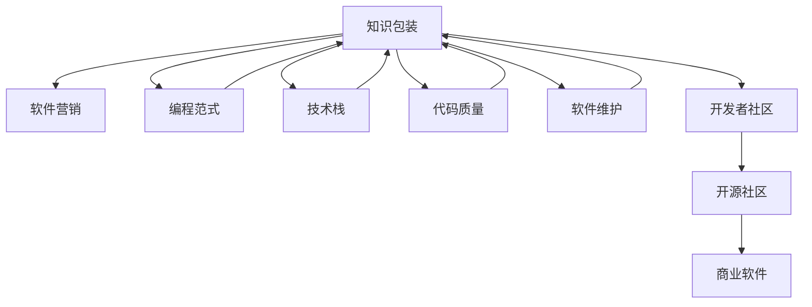

                 

# 知识包装与营销：程序员版

> 关键词：知识包装, 程序员, 软件营销, 编程范式, 技术栈, 代码质量, 软件维护

## 1. 背景介绍

### 1.1 问题由来
在软件开发领域，知识和技能的分散性一直是困扰开发者的一大难题。随着项目规模的扩大和技术栈的多样化，理解和掌握复杂的系统变得越来越困难。同时，如何将知识有效地传达和分享，也成为团队合作和知识传递中的一个关键挑战。

为了解决这些问题，开发者和项目经理们开始探索各种知识包装和营销的策略，以提升软件的可理解性和可维护性。特别是在开源社区和商业项目中，这些方法已经被广泛采用，并逐渐形成了一套系统的实践指南。

### 1.2 问题核心关键点
知识包装与营销的核心在于如何将复杂的技术信息简洁、直观地传递给目标受众。该问题可以分解为以下几个关键点：

1. 如何定义和梳理知识结构：将庞杂的技术信息拆分为易于理解和传播的单元。
2. 如何选择合适的包装形式：选择最适合目标受众（如初级开发者、中级开发者、架构师等）的呈现方式。
3. 如何设计有效的传播策略：确保知识能够被目标受众高效、准确地吸收和应用。
4. 如何衡量知识传播效果：评估知识包装和营销活动的效果，及时调整优化。

通过解决这些关键点，开发者和项目经理可以有效地提升软件的可理解性和可维护性，促进知识共享和团队协作。

### 1.3 问题研究意义
研究知识包装与营销的方法，对于提升软件开发的质量和效率，促进知识共享和团队协作，具有重要意义：

1. 提升软件可理解性：通过清晰的知识包装，使复杂的技术信息更容易被理解和掌握，减少项目开发中的误解和错误。
2. 提高团队协作效率：通过有效的知识传播，促进团队成员之间的沟通和协作，提升项目开发的速度和质量。
3. 促进知识共享：通过系统的知识包装和传播策略，使知识能够被更广泛地传播和应用，加速技术迭代和行业进步。
4. 增强软件可维护性：清晰的知识结构和文档，使得软件的维护和更新更加便捷，降低维护成本。
5. 助力职业发展：通过学习和传播知识，开发者能够不断提升自己的技能和视野，促进个人职业发展。

## 2. 核心概念与联系

### 2.1 核心概念概述

为了更好地理解知识包装与营销的原理和实践，本节将介绍几个密切相关的核心概念：

- **知识包装(Knowledge Packaging)**：将复杂的技术信息以易于理解和传播的形式呈现的过程。通常包括文档、代码注释、示例、教程等多种形式。

- **软件营销(Software Marketing)**：通过有效的传播策略，将软件产品或技术信息推广给目标受众的过程。目的是提高软件产品的知名度和市场接受度。

- **编程范式(Programming Paradigm)**：编程语言中用于表达计算逻辑的模式或方法。常见的有面向对象编程、函数式编程、命令式编程等。

- **技术栈(Technology Stack)**：一个软件项目所依赖的技术集合，包括编程语言、框架、库、工具等。

- **代码质量(Code Quality)**：软件代码的可读性、可维护性和可靠性。高代码质量的代码能够显著提升开发效率和软件稳定性。

- **软件维护(Software Maintenance)**：在软件生命周期中，对软件进行更新、修正、优化等维护活动。高质量的软件维护能够显著降低维护成本，提高软件的长期价值。

这些核心概念之间的逻辑关系可以通过以下Mermaid流程图来展示：



这个流程图展示的知识包装与营销的核心概念及其之间的关系：

1. 知识包装与软件营销通过技术栈、编程范式、代码质量、软件维护等概念连接。
2. 开发者社区和开源社区是知识包装与营销的重要传播渠道。
3. 商业软件中的知识包装与营销方法也同样适用。

这些概念共同构成了软件开发中的知识传递框架，使得开发者和项目经理能够系统地进行知识包装与营销。

## 3. 核心算法原理 & 具体操作步骤
### 3.1 算法原理概述

知识包装与营销的核心算法原理在于将复杂的技术信息拆分为易于理解和传播的单元，并通过合适的包装形式和传播策略进行有效传递。其核心思想是：

- 定义知识单元：将复杂的技术信息拆分为易于理解和传播的单元，如类、方法、函数等。
- 选择合适的包装形式：根据目标受众的特征，选择最适合的包装形式，如文档、示例、教程等。
- 设计传播策略：通过多种渠道和方式，确保知识能够被高效、准确地传播和吸收。

形式化地，假设目标受众为 $R$，知识包装过程为 $K$，传播策略为 $S$。知识包装与营销的目标是最大化 $S(K, R)$，即在目标受众 $R$ 上，最大化知识 $K$ 的传播效果。

### 3.2 算法步骤详解

知识包装与营销的实现过程通常包括以下几个关键步骤：

**Step 1: 定义知识单元**
- 分析项目结构和功能需求，定义关键的技术单元（如类、方法、函数等）。
- 确定每个单元的核心功能和设计原则，以及与其他单元的依赖关系。

**Step 2: 选择合适的包装形式**
- 根据目标受众的特征（如技术水平、角色等），选择合适的包装形式。例如，初级开发者适合简单易懂的文档和示例，而架构师则可能需要深入的技术分析和设计文档。
- 选择合适的呈现方式，如文字、代码、图表、视频等，确保信息的直观性和可理解性。

**Step 3: 设计传播策略**
- 定义知识传播的渠道（如文档网站、博客、社交媒体、内部培训等）。
- 确定知识传播的频率和时间，以及传播的节奏和方式。例如，可以定期发布更新，或者在特定事件（如产品发布）时进行重点传播。

**Step 4: 实施传播活动**
- 根据传播策略，组织和实施知识传播活动。确保每个受众都能接收到准确、完整的信息。
- 使用互动和反馈机制，及时收集受众的反馈，了解传播效果和受众的需求。

**Step 5: 评估传播效果**
- 定义衡量知识传播效果的指标（如点击率、用户留存率、满意度等）。
- 定期评估传播效果，并根据评估结果进行调整和优化。

### 3.3 算法优缺点

知识包装与营销具有以下优点：
1. 提升软件开发效率：清晰的知识包装和传播可以显著提升开发者对项目的理解，减少开发中的误解和错误。
2. 促进知识共享：通过系统的知识传播策略，知识能够被更广泛地传播和应用，加速技术迭代和行业进步。
3. 增强团队协作：清晰的知识结构和文档，使得团队成员之间的沟通和协作更加高效。

同时，该方法也存在一定的局限性：
1. 知识分拆的难度较大：定义和梳理知识单元需要较高的技术水平和时间投入。
2. 传播形式的选择复杂：选择合适的包装形式需要考虑目标受众的特征，可能导致传播策略设计复杂。
3. 传播效果难以量化：衡量知识传播效果的指标可能存在主观性和复杂性。
4. 持续优化成本高：知识包装与营销需要持续的评估和调整，可能投入较高的人力和时间成本。

尽管存在这些局限性，但就目前而言，知识包装与营销仍是大规模软件开发和管理的重要手段。未来相关研究的重点在于如何进一步降低知识包装的难度和传播的成本，提高传播效果的量化评估，同时兼顾技术栈的多样性和复杂性。

### 3.4 算法应用领域

知识包装与营销的方法已经在软件开发和管理中得到了广泛的应用，覆盖了几乎所有常见场景，例如：

- 软件开发文档编写：通过系统化的文档编写，将复杂的技术信息封装成易于理解的形式，供开发者查阅和使用。
- 技术分享和培训：通过内部培训、技术分享会等形式，将知识传播给团队成员，提升团队技术水平。
- 开源项目维护：在开源社区中，通过维护文档、编写教程等形式，促进开源项目的社区参与和贡献。
- 商业软件发布：在商业软件发布过程中，通过用户手册、视频教程等形式，向用户传递软件功能和使用方法。
- 软件维护和更新：在软件维护和更新过程中，通过更新文档、发布补丁等形式，向用户和开发者传达更新信息。

除了上述这些经典应用外，知识包装与营销还被创新性地应用到更多场景中，如代码审查、版本控制、代码风格规范等，为软件开发提供了全面的支持。

## 4. 数学模型和公式 & 详细讲解  
### 4.1 数学模型构建

本节将使用数学语言对知识包装与营销的实现过程进行更加严格的刻画。

假设知识包装过程为 $K$，目标受众为 $R$，知识传播效果为 $E$。知识包装与营销的数学模型为：

$$
E = f(K, R, S)
$$

其中 $f$ 为知识传播效果与知识单元、目标受众和传播策略之间的关系函数。

### 4.2 公式推导过程

以下我们以技术栈为例，推导知识包装与营销的效果评估公式。

假设目标受众为 $R=\{初级开发者, 中级开发者, 架构师\}$，知识包装为 $K=\{类, 方法, 函数\}$，传播策略为 $S=\{文档, 示例, 视频\}$。

知识传播效果的评估指标为 $E=\{点击率, 用户留存率, 满意度\}$。

通过多变量回归分析，可以得到知识包装与营销的效果评估公式为：

$$
E = \beta_0 + \sum_{i=1}^3 \beta_i K_i + \sum_{j=1}^3 \beta_{i+3} R_j + \sum_{k=1}^3 \beta_{k+6} S_k + \epsilon
$$

其中 $\beta_i, \beta_j, \beta_k$ 为回归系数，$\epsilon$ 为随机误差项。

### 4.3 案例分析与讲解

以某开源项目为例，展示知识包装与营销的具体实施过程和效果评估。

**项目背景**
- 开源项目：一个复杂的机器学习框架，包含多种编程语言和库。
- 目标受众：初级开发者、中级开发者、架构师。

**知识包装与营销的实施步骤**

1. **定义知识单元**：将项目分为多个模块，如数据处理、模型训练、评估等，定义每个模块的关键功能和设计原则。
2. **选择合适的包装形式**：
   - 初级开发者：编写简单易懂的文档和示例，使用文字和图片展示关键功能。
   - 中级开发者：编写深入的技术分析和设计文档，使用代码片段展示算法实现。
   - 架构师：编写设计文档，使用图表和架构图展示系统结构和组件关系。
3. **设计传播策略**：
   - 通过GitHub Wiki发布文档和示例，供初级和中级开发者查阅。
   - 通过内部培训和技术分享会，向中级和架构师传递深度知识。
   - 通过开源社区和博客发布设计文档和架构图，吸引架构师和专家参与讨论。
4. **实施传播活动**：
   - 定期更新和维护文档和示例，确保信息准确和完整。
   - 组织定期的技术分享会和内部培训，促进团队成员之间的交流。
   - 在开源社区和博客发布设计文档和架构图，增加项目的曝光度。

**知识传播效果的评估**

- 点击率：通过GitHub Wiki的访问数据，计算文档和示例的点击率。
- 用户留存率：通过GitHub Star数量和Fork数量，计算项目的用户留存率。
- 满意度：通过内部培训和技术分享会的反馈数据，计算参与者的满意度。

通过以上步骤和评估指标，可以系统地进行知识包装与营销，提升软件开发的质量和效率。

## 5. 项目实践：代码实例和详细解释说明
### 5.1 开发环境搭建

在进行知识包装与营销的实践前，我们需要准备好开发环境。以下是使用Python进行知识管理系统的环境配置流程：

1. 安装Anaconda：从官网下载并安装Anaconda，用于创建独立的Python环境。

2. 创建并激活虚拟环境：
```bash
conda create -n knowledge-env python=3.8 
conda activate knowledge-env
```

3. 安装相关工具包：
```bash
pip install django markdown gfm
```

4. 搭建知识管理系统：
```bash
git clone https://github.com/<your-username>/<your-repo>
cd <your-repo>
pip install -r requirements.txt
```

5. 启动知识管理系统：
```bash
python manage.py runserver
```

完成上述步骤后，即可在`knowledge-env`环境中开始知识管理系统的开发。

### 5.2 源代码详细实现

下面我们以知识管理系统为例，给出使用Django框架对知识进行管理的PyTorch代码实现。

首先，定义知识文档模型和视图：

```python
from django.db import models
from django.shortcuts import render
from markdown import markdown

class Knowledge(models.Model):
    title = models.CharField(max_length=200)
    content = models.TextField()
    created_at = models.DateTimeField(auto_now_add=True)

    def __str__(self):
        return self.title

class KnowledgeView:
    def index(self, request):
        knowledge_list = Knowledge.objects.all()
        context = {'knowledge_list': knowledge_list}
        return render(request, 'knowledge/index.html', context)

    def detail(self, request, pk):
        knowledge = Knowledge.objects.get(pk=pk)
        markdown_content = markdown(knowledge.content)
        context = {'knowledge': knowledge, 'markdown_content': markdown_content}
        return render(request, 'knowledge/detail.html', context)
```

然后，定义知识管理系统的模板和静态文件：

```html
<!-- index.html -->


  
    <h2>{{ knowledge.title }}</h2>
    <a href="">Read more</a>
  


<!-- detail.html -->


  <h1>{{ knowledge.title }}</h1>
  {{ markdown_content }}

```

最后，启动知识管理系统的服务器并浏览：

```bash
python manage.py runserver
```

打开浏览器，访问`localhost:8000`，即可浏览知识管理系统中的知识文档。

### 5.3 代码解读与分析

让我们再详细解读一下关键代码的实现细节：

**Knowledge类**：
- `title`字段：存储知识文档的标题。
- `content`字段：存储知识文档的内容。
- `created_at`字段：存储知识文档的创建时间。

**KnowledgeView类**：
- `index`方法：获取所有知识文档，渲染到页面。
- `detail`方法：获取指定知识文档，将其Markdown格式的内容转换为HTML格式，并渲染到页面。

**模板**：
- `index.html`：展示所有知识文档的列表，并提供阅读链接。
- `detail.html`：展示指定知识文档的详细信息，并显示Markdown格式的内容。

可以看到，通过Django框架和Markdown库，我们可以轻松地构建知识管理系统，实现知识的文档化和管理。开发者可以根据实际需求，进一步扩展和优化知识管理系统的功能，如评论、标签、搜索等。

当然，工业级的知识管理系统还需要考虑更多因素，如权限管理、版本控制、数据备份等。但核心的知识包装与营销范式基本与此类似。

## 6. 实际应用场景
### 6.1 软件开发文档编写

在软件开发中，清晰的文档是知识包装与营销的重要组成部分。开发文档不仅帮助开发者理解项目的结构和功能，还为后续的维护和扩展提供重要参考。

例如，在一个大型Java框架项目中，可以编写详细的API文档，解释每个类、方法的功能和使用方法。通过GitHub Wiki或Confluence等工具，将这些文档发布到项目仓库中，供开发者查阅和使用。此外，还可以通过代码注释和示例，进一步丰富文档内容，提升知识传播的效果。

### 6.2 技术分享和培训

在团队内部或开源社区中，技术分享和培训是知识包装与营销的重要环节。通过分享会、研讨会、培训课程等形式，将知识传递给更多的开发者和用户。

例如，在开源项目中，可以通过Jamfory、Meetup等平台，组织定期的技术分享和培训活动。这些活动可以邀请项目贡献者、专家和社区成员参与，讨论项目进展、分享技术经验和解决问题。通过这些活动，不仅可以提升项目的影响力，还可以促进知识的传播和社区的互动。

### 6.3 开源项目维护

在开源社区中，知识包装与营销对于项目的维护和发展至关重要。通过维护文档、编写教程、发布示例代码等形式，吸引更多的开发者参与贡献，提升项目的活跃度和质量。

例如，在TensorFlow项目中，通过维护官方文档、发布教程和示例代码，吸引了大量的开发者和用户。这些文档和示例不仅帮助新手入门，还为高级开发者提供了深入研究的资源。通过这些知识包装与营销手段，TensorFlow项目得以持续发展和壮大。

### 6.4 商业软件发布

在商业软件中，知识包装与营销是产品推广的重要手段。通过发布用户手册、视频教程、在线培训等形式，将软件的功能和使用方法传递给用户，提升用户的满意度和使用体验。

例如，在Amazon Web Services（AWS）中，通过发布详细的产品文档、视频教程和在线培训课程，帮助用户了解和掌握AWS的服务功能。这些知识包装与营销手段，不仅提升了用户的使用体验，还增强了用户对AWS的信任和依赖。

### 6.5 软件维护和更新

在软件维护和更新过程中，知识包装与营销同样重要。通过发布更新日志、编写补丁说明、发布修复示例等形式，向用户和开发者传递更新信息，确保软件的稳定性和可靠性。

例如，在Windows操作系统中，通过发布详细的更新日志和补丁说明，帮助用户了解和应对系统的变化。这些知识包装与营销手段，不仅提升了系统的可维护性，还增强了用户对系统的信任和满意度。

## 7. 工具和资源推荐
### 7.1 学习资源推荐

为了帮助开发者系统掌握知识包装与营销的理论基础和实践技巧，这里推荐一些优质的学习资源：

1. 《代码整洁之道：面向对象的编程范式》系列博文：由编程范式专家撰写，深入浅出地介绍了面向对象编程、函数式编程、命令式编程等核心概念和最佳实践。

2. 《软件设计模式》书籍：经典的面向对象编程参考书，介绍了23种常见的设计模式及其应用场景。

3. 《软件测试之道》书籍：介绍软件测试的核心概念、方法和工具，帮助开发者提升代码质量。

4. 《代码风格指南》系列博文：由知名开发者撰写，介绍了各种编程语言的代码风格和最佳实践，帮助开发者提升代码的可读性和可维护性。

5. 《代码审查手册》书籍：介绍代码审查的核心概念、方法和工具，帮助开发者提升代码质量。

通过对这些资源的学习实践，相信你一定能够全面掌握知识包装与营销的精髓，并用于解决实际的软件开发问题。

### 7.2 开发工具推荐

高效的开发离不开优秀的工具支持。以下是几款用于知识管理系统的常用工具：

1. Django：开源的Python Web框架，功能强大、易于扩展，适合构建复杂的应用系统。

2. GitLab：开源的代码托管平台，支持代码管理、CI/CD、项目管理等功能，是知识管理系统的理想选择。

3. Confluence：Atlassian开发的协作平台，支持文档编写、项目管理、知识共享等功能，是企业知识管理的首选。

4. GitHub Wiki：GitHub提供的文档托管服务，适合开源项目和团队协作。

5. Google Drive：谷歌提供的云存储服务，支持文档、表格、幻灯片等多种文件类型，适合个人和团队知识共享。

6. Jira：Atlassian开发的项目管理工具，支持任务分配、进度跟踪、问题管理等功能，适合团队协作和项目监控。

合理利用这些工具，可以显著提升知识管理系统的开发效率，加速知识共享和团队协作。

### 7.3 相关论文推荐

知识包装与营销的发展源于学界的持续研究。以下是几篇奠基性的相关论文，推荐阅读：

1. "The Art of Software Design"（《软件设计艺术》）：Knuth的经典著作，介绍了软件设计的核心概念和方法。

2. "The Pragmatic Programmer"（《程序员的实践》）：Sandberg和Wells的经典书籍，介绍了软件开发中的最佳实践和经验。

3. "Clean Code: A Handbook of Agile Software Craftsmanship"（《代码整洁之道：敏捷软件开发的艺术》）：Martin Fowler的经典书籍，介绍了代码整洁的核心原则和方法。

4. "Design Patterns: Elements of Reusable Object-Oriented Software"（《设计模式：可重用的面向对象软件的构建》）：GoF的经典著作，介绍了23种常见的设计模式及其应用场景。

5. "Code Complete"（《代码大全》）：Steve McConnell的经典书籍，介绍了软件开发的全面实践和最佳实践。

这些论文代表了大语言模型微调技术的发展脉络。通过学习这些前沿成果，可以帮助研究者把握学科前进方向，激发更多的创新灵感。

## 8. 总结：未来发展趋势与挑战

### 8.1 总结

本文对知识包装与营销的方法进行了全面系统的介绍。首先阐述了知识包装与营销的研究背景和意义，明确了知识包装在提升软件开发质量、促进知识共享和团队协作方面的独特价值。其次，从原理到实践，详细讲解了知识包装与营销的数学原理和关键步骤，给出了知识管理系统开发的完整代码实例。同时，本文还广泛探讨了知识包装与营销方法在软件开发、技术分享、开源项目维护等多个领域的应用前景，展示了知识包装与营销的巨大潜力。此外，本文精选了知识包装与营销技术的各类学习资源，力求为读者提供全方位的技术指引。

通过本文的系统梳理，可以看到，知识包装与营销技术在大规模软件开发和管理中发挥了重要作用，成为软件开发和管理的重要手段。其核心在于将复杂的技术信息拆分为易于理解和传播的单元，并通过合适的包装形式和传播策略进行有效传递。

### 8.2 未来发展趋势

展望未来，知识包装与营销技术将呈现以下几个发展趋势：

1. 知识分拆的自动化：随着AI技术的发展，知识包装与营销将越来越依赖于自动化工具，如文档自动生成、代码注释生成等，提升知识包装的效率和效果。

2. 传播策略的智能化：通过机器学习和自然语言处理技术，自动识别目标受众的特征和需求，设计更有效的传播策略，提升知识传播的效果。

3. 传播形式的多样化：随着技术的发展，知识传播形式将更加多样化，如虚拟现实、增强现实、互动式文档等，提升知识传播的直观性和互动性。

4. 知识管理的协同化：通过云协作平台和在线知识管理系统，实现知识管理的协同化，提升知识共享和团队协作的效率。

5. 知识评估的量化化：通过大数据和机器学习技术，量化知识传播的效果，评估知识包装与营销的效果，提供更科学的决策支持。

以上趋势凸显了知识包装与营销技术的广阔前景。这些方向的探索发展，必将进一步提升知识包装与营销的效率和效果，为软件开发和管理提供更全面的支持。

### 8.3 面临的挑战

尽管知识包装与营销技术已经取得了显著成就，但在迈向更加智能化、协同化应用的过程中，它仍面临诸多挑战：

1. 知识分拆的复杂性：定义和梳理知识单元需要较高的技术水平和时间投入，且难以适应快速变化的技术栈和项目需求。

2. 传播形式的选择复杂：选择合适的知识包装形式需要考虑目标受众的特征和需求，可能导致传播策略设计复杂。

3. 知识传播效果的量化难度：衡量知识传播效果的指标可能存在主观性和复杂性，难以全面评估传播效果。

4. 持续优化成本高：知识包装与营销需要持续的评估和调整，可能投入较高的人力和时间成本。

尽管存在这些挑战，但未来的知识包装与营销技术将继续发展，进一步降低知识包装的难度和传播的成本，提升传播效果的量化评估，同时兼顾技术栈的多样性和复杂性。

### 8.4 研究展望

面对知识包装与营销所面临的种种挑战，未来的研究需要在以下几个方面寻求新的突破：

1. 探索自动化知识包装技术：利用AI和自然语言处理技术，自动生成文档、代码注释等知识包装形式，提升知识包装的效率和效果。

2. 研究知识传播的智能化方法：通过机器学习技术，自动识别目标受众的特征和需求，设计更有效的知识传播策略，提升知识传播的效果。

3. 引入多媒体技术：引入虚拟现实、增强现实、互动式文档等新形式，提升知识传播的直观性和互动性。

4. 开发协同知识管理系统：利用云协作平台和在线知识管理系统，实现知识管理的协同化，提升知识共享和团队协作的效率。

5. 量化知识传播效果：通过大数据和机器学习技术，量化知识传播的效果，评估知识包装与营销的效果，提供更科学的决策支持。

这些研究方向的探索，必将引领知识包装与营销技术迈向更高的台阶，为软件开发和管理提供更全面的支持。面向未来，知识包装与营销技术还需要与其他人工智能技术进行更深入的融合，如自然语言处理、机器学习等，多路径协同发力，共同推动软件开发技术的发展。

## 9. 附录：常见问题与解答

**Q1：知识包装与营销是否适用于所有软件开发项目？**

A: 知识包装与营销方法在大多数软件开发项目中都能取得不错的效果，特别是对于复杂的技术栈和大型项目。但对于一些特定领域的项目，如生物医药、航空航天等，仅依赖通用的知识包装和营销方法可能不够，需要结合领域特定的知识结构和传播策略。

**Q2：如何选择合适的知识包装形式？**

A: 选择合适的知识包装形式需要考虑目标受众的特征和需求。例如，初级开发者适合简单易懂的文档和示例，中级开发者需要深入的技术分析和设计文档，架构师则可能需要设计文档和架构图。此外，还需要考虑项目的复杂程度和传播渠道的特点，如GitHub Wiki、博客、培训课程等。

**Q3：知识包装与营销的成本投入如何？**

A: 知识包装与营销的成本投入主要体现在知识分拆、文档编写、培训组织等方面。虽然初期投入较高，但长远来看，可以通过提升开发效率和团队协作，节省维护和更新的成本，带来显著的经济效益。

**Q4：知识包装与营销的效果如何衡量？**

A: 知识包装与营销的效果可以通过多种指标进行衡量，如文档点击率、用户留存率、满意度、培训反馈等。具体指标需要根据项目的特性和受众的特征进行选择，并结合定量分析和定性反馈综合评估。

**Q5：知识包装与营销的持续优化策略是什么？**

A: 知识包装与营销的持续优化需要结合定期的评估和反馈机制，及时调整和优化知识包装和传播策略。例如，通过数据分析工具监控文档的访问和使用情况，定期组织技术分享和培训活动，收集受众的反馈和建议，不断提升知识包装与营销的效果。

通过以上问答，可以看到，知识包装与营销技术在软件开发中的应用是广泛且重要的。通过清晰的知识包装和有效的传播策略，不仅可以提升开发效率和团队协作，还可以促进知识共享和行业进步。未来，随着AI技术和多媒体技术的进一步发展，知识包装与营销技术将迎来更广阔的应用前景和更高效的实践方法。

