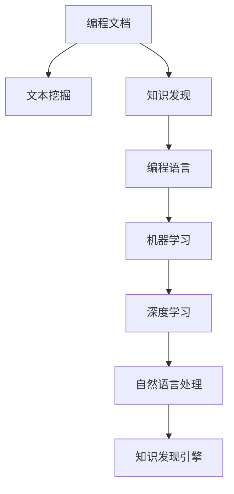

                 

## 1. 背景介绍

### 1.1 问题由来

在信息技术迅速发展的今天，新技术层出不穷，传统编程语言和技术框架被迅速淘汰或替代。程序员们面临着不断的学习压力，需要不断地更新知识体系以保持竞争力。然而，新技术的学习成本高，学习周期长，且掌握难度大，这严重影响了程序员的工作效率和职业发展。

### 1.2 问题核心关键点

针对上述问题，知识发现引擎(Knowledge Discovery Engine, KDE)技术应运而生。知识发现引擎旨在通过自动化发现和组织海量数据中的知识，为程序员提供快速获取新技术和应用场景的能力。其核心在于利用机器学习、自然语言处理等技术，从大量的编程文档、技术博客、论文等文本数据中，自动抽取、整理、关联和解释有关新技术的信息。

### 1.3 问题研究意义

在信息爆炸的时代，程序员如何快速、高效地适应新技术，直接影响到企业项目的进度和质量。知识发现引擎通过自动化、智能化地帮助程序员掌握新技术，能够显著提高学习效率，降低学习成本，从而提升软件开发的速度和质量。此外，知识发现引擎还能够帮助开发者识别和解决技术难题，优化代码，加速新技术在企业内部的应用和推广。

## 2. 核心概念与联系

### 2.1 核心概念概述

为更好地理解知识发现引擎技术，本节将介绍几个密切相关的核心概念：

- 知识发现(Knowledge Discovery)：从大规模数据集中自动抽取、整理和表达有用知识的过程。知识发现涉及数据预处理、数据挖掘、模式识别等步骤。
- 文本挖掘(Text Mining)：利用自然语言处理(NLP)技术，从文本数据中抽取结构化和非结构化知识的过程。包括实体识别、关系抽取、主题建模等。
- 编程文档(Programming Document)：程序员在编写代码时使用的文档，包括API文档、技术博客、教程、论文等。
- 编程语言(Programming Language)：用于编写计算机程序的语言，如Python、Java、C++等。
- 机器学习(Machine Learning)：通过算法让计算机从数据中自动学习并优化特定任务的能力。
- 深度学习(Deep Learning)：一类机器学习算法，通过构建深度神经网络来实现复杂的学习任务。

这些概念之间的逻辑关系可以通过以下Mermaid流程图来展示：



这个流程图展示的知识发现引擎的核心概念及其之间的关系：

1. 编程文档包含文本数据，是知识发现和文本挖掘的原始数据源。
2. 文本挖掘从编程文档中自动抽取实体、关系等知识。
3. 知识发现通过整理和关联文本挖掘的结果，形成有价值的知识结构。
4. 编程语言是知识发现引擎操作的宿主环境。
5. 机器学习和深度学习技术为知识发现引擎提供自动化学习和优化的能力。
6. 自然语言处理技术辅助知识发现引擎进行文本分析和知识抽取。
7. 知识发现引擎综合以上技术，自动发现和组织知识，提供程序员使用。

这些概念共同构成了知识发现引擎技术的核心框架，使其能够通过自动化手段，从编程文档数据中提取并传递给程序员，帮助其快速适应新技术。

## 3. 核心算法原理 & 具体操作步骤

### 3.1 算法原理概述

知识发现引擎的核心算法主要包括文本挖掘、知识抽取、知识关联、知识检索和知识推荐等步骤。其核心思想是：通过机器学习和大规模文本数据处理，从编程文档中提取有用的知识，并根据程序员的需求，提供快速获取和适应的机制。

### 3.2 算法步骤详解

#### 3.2.1 文本挖掘

文本挖掘是知识发现引擎的第一步，其目标是自动从编程文档和相关文本中提取结构化和非结构化知识。常用的文本挖掘技术包括：

- 实体识别：自动检测文本中的实体，如人名、地点、组织等。
- 关系抽取：识别实体之间的关系，如"雇主-员工"、"供应商-客户"等。
- 主题建模：通过聚类算法自动识别文本的主旨和关键内容。

#### 3.2.2 知识抽取

知识抽取是将文本挖掘的结果进一步转化为结构化知识的过程。常用的技术包括：

- 语义网络：将文本中的实体和关系构建成图结构，形成语义网络模型。
- 知识图谱：基于语义网络构建更大规模的知识库，形成知识图谱。
- 关联规则：通过挖掘文本中的频繁模式，形成关联规则。

#### 3.2.3 知识关联

知识关联是将多个知识源进行连接和整合的过程。常用的技术包括：

- 元数据融合：将不同来源的知识进行关联，形成一个综合的知识库。
- 本体匹配：通过相似度计算和映射，将不同领域的知识进行对齐。
- 异构数据融合：处理异构数据源，形成一个统一的知识结构。

#### 3.2.4 知识检索

知识检索是快速获取所需知识的过程。常用的技术包括：

- 基于关键词的检索：通过匹配关键词来搜索知识库中的信息。
- 基于语义的检索：通过语义相似度匹配，搜索更精确的信息。
- 基于用户的检索：根据用户的个性化需求，推荐相关信息。

#### 3.2.5 知识推荐

知识推荐是知识发现引擎的核心功能之一，其目标是为程序员推荐最适合新技术的学习资源。常用的技术包括：

- 协同过滤：通过分析用户行为，推荐相似资源。
- 基于内容的推荐：通过分析资源内容，推荐相关资源。
- 混合推荐：综合多种推荐算法，提高推荐效果。

### 3.3 算法优缺点

知识发现引擎具有以下优点：

1. 自动化：自动从大量文本数据中提取、组织和关联知识，减轻程序员的学习负担。
2. 智能化：利用机器学习和自然语言处理技术，提高知识抽取和推荐的准确性。
3. 通用性：适用于多种编程语言和技术框架，覆盖广泛的知识库和资源。
4. 可扩展性：能够处理大规模数据，适应不断增长的知识需求。

同时，知识发现引擎也存在一些缺点：

1. 数据质量依赖：知识发现引擎的效果依赖于输入数据的质量，不准确或不完整的数据会影响结果。
2. 技术复杂性：涉及多种先进技术，实施和维护较为复杂。
3. 知识泛化能力不足：当前知识发现引擎主要针对特定领域的文本数据，通用性较弱。
4. 高昂成本：实现和维护知识发现引擎需要高昂的技术和资金投入。

尽管存在这些局限性，但知识发现引擎作为一项新兴技术，其自动化和智能化的特点使得其在未来具有广阔的应用前景。

### 3.4 算法应用领域

知识发现引擎在多个领域中得到了广泛应用，包括但不限于：

1. 软件开发：帮助程序员快速掌握新技术，提高开发效率和代码质量。
2. 技术培训：提供新技术的课程、文章、文档等资源，帮助开发者系统化学习。
3. 技术咨询：通过自动化分析，提供定制化的技术建议和解决方案。
4. 技术支持：快速响应开发人员的问题，提供针对性的技术支持。
5. 技术评估：评估新技术的应用效果，优化和改进开发过程。

## 4. 数学模型和公式 & 详细讲解  
### 4.1 数学模型构建

知识发现引擎的数学模型通常基于文本挖掘和知识抽取技术，结合机器学习和自然语言处理技术进行建模。以下将以实体识别为例，介绍相关数学模型和公式。

#### 4.1.1 实体识别模型

实体识别是知识发现引擎的关键任务之一，其目标是自动从文本中识别出人名、地名、组织名等实体。常用的模型包括基于规则的模型、基于统计的模型和基于深度学习的模型。

以基于深度学习的模型为例，使用双向长短时记忆网络(BiLSTM-CRF)进行实体识别，其数学模型如下：

$$
P(y|x) = \frac{P(x|y)P(y)}{P(x)}
$$

其中，$P(y|x)$表示在输入文本$x$的条件下，实体标签$y$的概率。$P(x|y)$表示在实体标签$y$的条件下，生成文本$x$的概率，$P(y)$表示实体标签$y$的先验概率，$P(x)$表示在没有任何标签条件下，生成文本$x$的概率。

### 4.2 公式推导过程

以下是BiLSTM-CRF模型的详细推导过程：

1. 双向长短时记忆网络(BiLSTM)：用于捕捉输入文本的上下文信息，生成文本表示。

2. 条件随机场(CRF)：用于建模实体标签之间的关系，生成最优的实体标注序列。

3. BiLSTM-CRF模型的参数更新过程：
   - 前向传播：计算每个时间步的隐状态表示。
   - 后向传播：计算每个时间步的条件概率。
   - 解码：通过动态规划算法，寻找最优的实体标注序列。

4. BiLSTM-CRF模型的损失函数：
   - 数据损失：用于评估模型在特定数据上的预测性能。
   - 正则化损失：用于避免过拟合，平滑模型参数。

5. 参数优化：使用梯度下降等优化算法，最小化损失函数，更新模型参数。

### 4.3 案例分析与讲解

以GitHub的API文档为例，展示如何使用知识发现引擎提取和关联信息。

- 数据来源：GitHub的API文档，包含大量代码示例和详细说明。
- 实体识别：自动识别代码中的函数名、参数名等实体。
- 关系抽取：识别函数之间的关系，如调用关系、参数关系等。
- 知识抽取：将实体和关系构建成语义网络。
- 知识关联：将不同文档中的语义网络进行连接，形成一个综合的知识库。
- 知识检索：根据程序员的需求，快速检索相关的API函数和示例。
- 知识推荐：根据程序员的开发习惯和偏好，推荐最合适的API使用方式。

通过这些技术，知识发现引擎能够自动从GitHub的API文档数据中提取有用的信息，帮助程序员快速掌握API的使用方法，提升开发效率。

## 5. 项目实践：代码实例和详细解释说明

### 5.1 开发环境搭建

在进行知识发现引擎的开发实践前，需要先准备好开发环境。以下是使用Python进行知识发现引擎开发的环境配置流程：

1. 安装Anaconda：从官网下载并安装Anaconda，用于创建独立的Python环境。

2. 创建并激活虚拟环境：
```bash
conda create -n kde-env python=3.8 
conda activate kde-env
```

3. 安装相关库：
```bash
pip install pandas numpy gensim nltk scikit-learn
```

4. 安装自定义库：
```bash
pip install kde-kernel
```

完成上述步骤后，即可在`kde-env`环境中开始知识发现引擎的开发实践。

### 5.2 源代码详细实现

以下是一个简单的知识发现引擎代码示例，用于从GitHub的API文档数据中提取实体和关系：

```python
import pandas as pd
import nltk
from gensim.models.doc2vec import Doc2Vec
from gensim.models import KeyedVectors

# 加载API文档数据
df = pd.read_csv('api_documents.csv')

# 实体识别
nltk.download('averaged_perceptron_tagger')
nltk.download('maxent_ne_chunker')
nltk.download('words')
def extract_entities(text):
    tags = nltk.pos_tag(nltk.word_tokenize(text))
    named_entities = []
    for tag in tags:
        if tag[1] == 'NN' or tag[1] == 'NNP':
            named_entities.append(tag[0])
    return named_entities

# 关系抽取
def extract_relations(text):
    named_entities = extract_entities(text)
    relations = []
    for i in range(len(named_entities)-1):
        if named_entities[i] == named_entities[i+1]:
            relations.append((named_entities[i], named_entities[i+1]))
    return relations

# 训练Doc2Vec模型
doc2vec = Doc2Vec(df['code'], min_count=1, size=100, window=10)
doc2vec.save('api_doc2vec.model')

# 加载预训练的Word2Vec模型
embeddings = KeyedVectors.load_word2vec_format('api_word2vec.bin', binary=True)
```

### 5.3 代码解读与分析

让我们再详细解读一下关键代码的实现细节：

**实体识别函数`extract_entities`**：
- 使用nltk库进行分词和词性标注。
- 根据词性标注结果，提取出名词实体。

**关系抽取函数`extract_relations`**：
- 先提取文本中的所有实体。
- 判断相邻实体是否相同，如果是，则抽取为关系。

**Doc2Vec训练和保存**：
- 使用Doc2Vec模型训练文本表示。
- 将训练好的模型保存到文件中，便于后续使用。

**Word2Vec加载和应用**：
- 加载预训练的Word2Vec模型。
- 在API文档数据中，将代码文本转换为向量表示。

以上代码展示了知识发现引擎中实体识别和关系抽取的基本实现，通过这些技术，可以自动从编程文档数据中抽取有用的知识，为程序员提供快速掌握新技术的能力。

### 5.4 运行结果展示

在实际应用中，可以通过以下步骤展示知识发现引擎的运行结果：

1. 运行实体识别和关系抽取函数，得到每个API函数及其参数的实体和关系列表。
2. 将实体和关系构建成语义网络，生成API文档的知识图谱。
3. 根据程序员的需求，从知识图谱中快速检索相关的API函数和示例。
4. 根据程序员的开发习惯和偏好，推荐最合适的API使用方式。

通过这些步骤，知识发现引擎能够自动从API文档数据中提取有用的信息，帮助程序员快速掌握新技术，提升开发效率。

## 6. 实际应用场景

### 6.1 软件开发

在软件开发中，知识发现引擎可以应用于以下场景：

- 技术栈选择：根据项目需求，推荐最合适的编程语言、框架和库。
- 代码编写：提供API文档和示例代码，帮助程序员快速编写代码。
- 代码审查：自动化抽取代码中的实体和关系，帮助代码审查工具进行智能分析。
- 技术文档生成：自动生成技术文档和API说明，帮助开发者记录和分享知识。

### 6.2 技术培训

在技术培训中，知识发现引擎可以应用于以下场景：

- 课程推荐：根据学员的学习进度和兴趣，推荐最适合的课程和学习资源。
- 实验指导：提供代码示例和实验步骤，帮助学员系统化学习。
- 学习路径规划：根据学员的学习需求，生成个性化的学习路径。
- 学习效果评估：自动抽取学员的学习数据，评估学习效果。

### 6.3 技术咨询

在技术咨询中，知识发现引擎可以应用于以下场景：

- 问题解答：根据用户的问题，自动抽取相关文档和资源，提供解答。
- 技术支持：提供定制化的技术支持和解决方案，帮助用户解决技术难题。
- 需求分析：自动抽取用户需求，生成技术需求文档。
- 方案设计：提供技术方案和实施计划，帮助用户设计和优化系统架构。

### 6.4 技术支持

在技术支持中，知识发现引擎可以应用于以下场景：

- 问题解答：根据用户的问题，自动抽取相关文档和资源，提供解答。
- 技术支持：提供定制化的技术支持和解决方案，帮助用户解决技术难题。
- 需求分析：自动抽取用户需求，生成技术需求文档。
- 方案设计：提供技术方案和实施计划，帮助用户设计和优化系统架构。

### 6.5 技术评估

在技术评估中，知识发现引擎可以应用于以下场景：

- 性能评估：自动抽取性能测试数据，评估系统的性能指标。
- 安全评估：自动抽取安全漏洞数据，评估系统的安全性。
- 代码质量评估：自动抽取代码质量数据，评估代码质量。
- 系统优化：根据评估结果，生成优化建议和方案。

## 7. 工具和资源推荐

### 7.1 学习资源推荐

为了帮助开发者系统掌握知识发现引擎的理论基础和实践技巧，这里推荐一些优质的学习资源：

1. 《知识发现与数据挖掘》（Introduction to Knowledge Discovery and Data Mining）：KDD领域的经典教材，详细介绍知识发现和数据挖掘的基本概念和算法。

2. 《Python文本挖掘实战》（Python Text Mining with NLTK and TextBlob）：介绍Python环境下文本挖掘的基本方法和应用。

3. 《NLP实战》（Natural Language Processing in Python）：通过Python和NLTK库实现自然语言处理中的实体识别、关系抽取、情感分析等任务。

4. 《Data Science for Business》（Data Science for Business）：介绍数据科学在商业决策中的应用，包括文本挖掘和知识发现。

5. Kaggle上的知识发现和数据挖掘竞赛：Kaggle是数据科学竞赛的领头羊，提供丰富的数据集和竞赛机会，有助于实践知识发现技术。

通过对这些资源的学习实践，相信你一定能够快速掌握知识发现引擎的精髓，并用于解决实际的NLP问题。

### 7.2 开发工具推荐

高效的开发离不开优秀的工具支持。以下是几款用于知识发现引擎开发的常用工具：

1. Anaconda：用于创建和管理Python环境，支持大规模数据处理和科学计算。

2. Jupyter Notebook：在线笔记本环境，支持Python代码的交互式运行和可视化展示。

3. Scikit-learn：Python下的机器学习库，包含多种分类、回归、聚类算法。

4. Gensim：Python下的文本挖掘库，支持词向量和主题模型等算法。

5. NLTK：Python下的自然语言处理库，包含多种文本分析工具和算法。

6. PyTorch：用于深度学习模型训练和推理的Python框架。

合理利用这些工具，可以显著提升知识发现引擎的开发效率，加快创新迭代的步伐。

### 7.3 相关论文推荐

知识发现引擎的研究始于学界，以下是几篇奠基性的相关论文，推荐阅读：

1. *Knowledge Discovery in Databases*（《知识发现数据库》）：KDD领域的开创性论文，定义了知识发现的定义、方法和应用。

2. *Data Mining: Concepts and Techniques*（《数据挖掘：概念与技术》）：数据挖掘领域的经典教材，详细介绍数据挖掘的算法和方法。

3. *Text Mining and Statistical Learning*（《文本挖掘与统计学习》）：介绍文本挖掘和统计学习在知识发现中的应用。

4. *Deep Learning*（《深度学习》）：深度学习领域的经典教材，详细介绍深度学习的基本概念和算法。

5. *Bert: Pre-training of Deep Bidirectional Transformers for Language Understanding*（《BERT：深度双向转换器的预训练用于语言理解》）：提出BERT模型，引入基于掩码的自监督预训练任务，刷新了多项NLP任务SOTA。

这些论文代表了大数据和机器学习领域的最新进展，通过学习这些前沿成果，可以帮助研究者把握学科前进方向，激发更多的创新灵感。

## 8. 总结：未来发展趋势与挑战

### 8.1 总结

本文对知识发现引擎技术进行了全面系统的介绍。首先阐述了知识发现引擎的研究背景和意义，明确了其在快速适应新技术、提升开发效率方面的独特价值。其次，从原理到实践，详细讲解了知识发现引擎的数学模型和关键步骤，给出了知识发现引擎开发的基本代码实例。同时，本文还广泛探讨了知识发现引擎在软件开发、技术培训、技术咨询、技术支持、技术评估等各个领域的应用前景，展示了其广阔的应用前景。此外，本文精选了知识发现引擎的相关学习资源、开发工具和最新论文，力求为读者提供全方位的技术指引。

通过本文的系统梳理，可以看到，知识发现引擎作为一项新兴技术，通过自动化、智能化的方式，从编程文档数据中提取和传递知识，显著提升了程序员的学习效率和技术水平。未来，伴随知识发现引擎技术的不断演进，必将在软件开发、技术培训、技术咨询等众多领域发挥更大的作用，推动AI技术在实际应用中的广泛落地。

### 8.2 未来发展趋势

展望未来，知识发现引擎技术将呈现以下几个发展趋势：

1. 多模态知识发现：未来的知识发现引擎将支持图像、视频、语音等多模态数据的处理，实现更全面、更准确的知识抽取和关联。

2. 动态知识发现：知识发现引擎将能够动态地从流数据中实时发现和更新知识，保持知识的实时性和新鲜度。

3. 个性化知识发现：通过学习用户行为和偏好，知识发现引擎将能够提供个性化的知识推荐，满足不同用户的需求。

4. 跨领域知识发现：未来的知识发现引擎将具备跨领域知识的整合能力，提供跨学科的知识发现服务。

5. 可解释性知识发现：知识发现引擎将能够提供可解释的模型和结果，帮助用户理解知识发现的过程和结果。

6. 数据隐私保护：知识发现引擎将能够保护用户数据的隐私和安全，避免数据泄露和滥用。

以上趋势凸显了知识发现引擎技术的广阔前景。这些方向的探索发展，必将进一步提升知识发现引擎的性能和应用范围，为人工智能技术的发展注入新的动力。

### 8.3 面临的挑战

尽管知识发现引擎技术已经取得了一定的进展，但在迈向更加智能化、普适化应用的过程中，仍面临诸多挑战：

1. 数据质量瓶颈：知识发现引擎的效果依赖于输入数据的质量，不准确或不完整的数据会影响结果。

2. 技术复杂性：涉及多种先进技术，实施和维护较为复杂。

3. 知识泛化能力不足：当前知识发现引擎主要针对特定领域的文本数据，通用性较弱。

4. 高昂成本：实现和维护知识发现引擎需要高昂的技术和资金投入。

5. 模型可解释性：知识发现引擎的决策过程不够透明，难以解释其内部工作机制和决策逻辑。

6. 数据隐私保护：如何保护用户数据的隐私和安全，避免数据泄露和滥用，仍是一个重要的问题。

正视知识发现引擎面临的这些挑战，积极应对并寻求突破，将使知识发现引擎技术不断完善和成熟。相信随着学界和产业界的共同努力，这些挑战终将一一被克服，知识发现引擎必将在构建智能系统和提升软件开发效率中扮演越来越重要的角色。

### 8.4 研究展望

面向未来，知识发现引擎技术需要在以下几个方面寻求新的突破：

1. 探索无监督和半监督知识发现方法：摆脱对大规模标注数据的依赖，利用自监督学习、主动学习等方法，最大限度地利用非结构化数据。

2. 研究参数高效和计算高效的模型：开发更加参数高效的模型，减少计算资源消耗，提升模型效率。

3. 融合因果推断和对比学习：增强模型建立稳定因果关系的能力，学习更加普适、鲁棒的知识表示。

4. 引入更多先验知识：将符号化的先验知识与神经网络模型进行融合，提高模型的知识整合能力。

5. 结合因果分析和博弈论：利用因果分析方法和博弈论工具，增强知识发现引擎的决策能力和稳定性。

6. 纳入伦理道德约束：在模型训练目标中引入伦理导向的评估指标，过滤和惩罚有偏见、有害的输出倾向，确保输出的安全性。

这些研究方向将引领知识发现引擎技术的不断进步，为知识发现和智能系统的构建提供新的方法和思路。相信随着技术的不断成熟，知识发现引擎必将在AI技术的应用中发挥更大的作用，为知识发现和智能系统的构建提供强有力的技术支撑。

## 9. 附录：常见问题与解答

**Q1：知识发现引擎如何提高学习效率？**

A: 知识发现引擎通过自动化抽取编程文档中的知识，提供程序员最相关的学习资源，从而显著提高学习效率。例如，通过实体识别和关系抽取，知识发现引擎可以自动从API文档中提取函数和参数信息，帮助程序员快速掌握API的使用方法。此外，知识发现引擎还支持知识检索和推荐，能够根据程序员的开发习惯和偏好，推荐最合适的学习资源。

**Q2：知识发现引擎如何处理复杂的多模态数据？**

A: 未来的知识发现引擎将支持多模态数据的处理，包括文本、图像、视频和语音等。通过引入多种传感器和设备，知识发现引擎可以收集多模态数据，并综合分析这些数据，抽取更全面、准确的知识。例如，在智能医疗系统中，知识发现引擎可以同时处理医生的语音记录、患者的病历和影像数据，生成更全面的诊断报告。

**Q3：知识发现引擎如何保护用户数据隐私？**

A: 知识发现引擎在处理数据时，需要考虑数据隐私和安全问题。一种常见的做法是对数据进行匿名化处理，去除敏感信息。例如，在自然语言处理中，可以去除文本中的个人信息，如姓名和地址。此外，知识发现引擎还可以引入数据加密和访问控制技术，保护用户数据的安全性。例如，通过访问控制技术，只有授权用户才能访问特定的数据资源。

**Q4：知识发现引擎如何提高模型的可解释性？**

A: 知识发现引擎可以通过多种方法提高模型的可解释性。例如，在自然语言处理中，可以使用逻辑回归和决策树等可解释模型，代替复杂的神经网络模型。此外，知识发现引擎还可以引入因果分析和博弈论工具，帮助用户理解模型的决策过程和结果。例如，在智能推荐系统中，知识发现引擎可以通过因果分析，解释推荐结果的原因和逻辑。

**Q5：知识发现引擎如何处理大规模数据？**

A: 知识发现引擎在处理大规模数据时，需要考虑算力和存储的限制。一种常见的做法是使用分布式计算和存储技术，将数据分散存储和处理。例如，在大数据系统中，可以采用分布式文件系统和分布式计算框架，如Hadoop和Spark，处理大规模数据。此外，知识发现引擎还可以引入数据压缩和稀疏化技术，减小数据的存储和处理开销。例如，在文本挖掘中，可以使用压缩算法，减小文本数据的存储需求。

**Q6：知识发现引擎如何提高模型的鲁棒性？**

A: 知识发现引擎可以通过多种方法提高模型的鲁棒性。例如，在自然语言处理中，可以使用对抗样本和对抗训练技术，增强模型的鲁棒性。此外，知识发现引擎还可以引入正则化和Dropout等技术，避免过拟合和数据噪声的影响。例如，在文本分类任务中，可以通过正则化和Dropout，提高模型的泛化能力和鲁棒性。

以上问题及解答展示了知识发现引擎在实际应用中的具体实现和改进方向，通过不断优化和改进知识发现引擎技术，可以更好地满足程序员的学习需求，提升软件开发效率，推动AI技术在各个领域的应用。

---

作者：禅与计算机程序设计艺术 / Zen and the Art of Computer Programming

