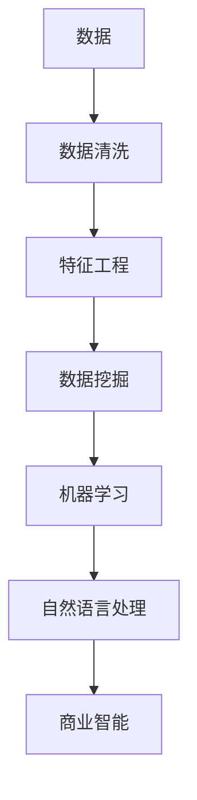

                 

# 知识发现引擎在企业中的应用

> 关键词：知识发现, 数据挖掘, 商业智能, 自然语言处理, 机器学习, 大数据

## 1. 背景介绍

### 1.1 问题由来
在当今数据爆炸的时代，企业面临着海量数据存储与管理的巨大挑战。如何从这些庞杂的数据中提取有价值的信息，并利用这些信息进行决策、优化流程、提升运营效率，成为了各行业企业普遍关注的重点。知识发现引擎（Knowledge Discovery Engine, KDE）以其强大的数据挖掘和分析能力，为这一问题提供了有效解决手段。

### 1.2 问题核心关键点
知识发现引擎旨在从企业运营数据中挖掘出知识，为企业的决策支持、流程优化、个性化推荐等提供依据。其核心技术包括数据挖掘、机器学习、自然语言处理等，帮助企业高效、全面、准确地洞察数据背后的商业价值。

### 1.3 问题研究意义
知识发现引擎的应用对于提高企业的数据驱动决策能力、增强竞争力和市场反应速度具有重要意义：

1. **决策支持**：基于大数据分析，企业可以快速做出更为精准的商业决策，提升决策的科学性和效率。
2. **流程优化**：通过对企业运营数据的深入分析，可以发现流程中的瓶颈和改进点，优化业务流程。
3. **客户洞察**：深入了解客户行为和需求，提供更为个性化的服务和产品，增强客户满意度。
4. **风险管理**：及时发现和预警潜在风险，提前制定应对策略，减少损失。
5. **创新驱动**：基于数据的洞察，企业可以发现新的市场机会，推动产品和服务的创新。

## 2. 核心概念与联系

### 2.1 核心概念概述

为更好地理解知识发现引擎的核心原理和应用场景，本节将介绍几个关键概念：

- **知识发现引擎(KDE)**：一种通过数据挖掘、机器学习等技术，从企业数据中提取知识、洞察模式和规律的系统。

- **数据挖掘**：一种从大规模数据集中提取有价值信息的过程。通过应用统计、机器学习等方法，识别数据中的模式、关联、异常等知识。

- **商业智能(BI)**：利用数据分析、可视化工具，支持企业做出更准确的商业决策。

- **自然语言处理(NLP)**：使计算机能够理解和处理人类语言，支持信息抽取、情感分析、文本分类等应用。

- **机器学习**：让计算机通过数据学习，自动优化模型参数，进行预测、分类、聚类等任务。

这些核心概念之间的逻辑关系可以通过以下Mermaid流程图来展示：



这个流程图展示了一个典型的企业知识发现流程：从原始数据开始，经过清洗和特征提取，通过数据挖掘和机器学习获得知识，最终用于商业智能决策和自然语言处理应用。

## 3. 核心算法原理 & 具体操作步骤

### 3.1 算法原理概述

知识发现引擎的核心原理是基于数据挖掘、机器学习和自然语言处理技术的结合，从企业运营数据中提取有价值的信息和知识。其主要包括：

- **数据预处理**：清洗和整理原始数据，去除噪声和冗余信息。
- **特征工程**：从数据中提取和构建有意义的特征，供后续分析使用。
- **数据挖掘**：利用统计、机器学习等方法，从数据中发现模式、关联和异常。
- **模型训练**：选择合适的算法，训练模型以预测、分类或聚类等任务。
- **自然语言处理**：分析文本数据，提取结构化信息，如情感、主题、关系等。
- **商业智能分析**：结合业务背景，分析挖掘出的知识，转化为商业决策支持。

### 3.2 算法步骤详解

基于知识发现引擎的核心原理，具体的知识发现流程包括以下关键步骤：

**Step 1: 数据准备**
- 收集企业运营相关的各种数据，包括销售数据、客户数据、供应链数据等。
- 清洗数据，去除不完整、错误或无关的信息。

**Step 2: 特征工程**
- 对清洗后的数据进行特征提取和构建，选择合适的特征以供模型训练。
- 例如，时间序列特征、用户行为特征、商品属性特征等。

**Step 3: 数据挖掘**
- 应用数据挖掘算法，如关联规则学习、分类、聚类等，发现数据中的规律和模式。
- 常用的数据挖掘算法包括Apriori算法、K-means聚类、决策树等。

**Step 4: 模型训练**
- 选择合适的机器学习算法，如回归、分类、聚类、神经网络等，训练模型以预测或分类任务。
- 例如，利用神经网络进行客户分群，或利用决策树进行销售预测。

**Step 5: 自然语言处理**
- 对文本数据进行预处理，包括分词、去停用词、词性标注等。
- 利用NLP技术，如信息抽取、情感分析、文本分类等，提取文本中的有用信息。

**Step 6: 商业智能分析**
- 结合业务需求，分析挖掘出的知识，进行报表、仪表盘、数据可视化等商业智能分析。
- 例如，分析销售数据，生成销售趋势图，支持业务决策。

### 3.3 算法优缺点

知识发现引擎具有以下优点：
1. **自动化**：通过算法自动化处理大量数据，减少了人工干预，提高了工作效率。
2. **多角度分析**：结合多种技术，从不同角度深入挖掘数据背后的信息，增强分析的全面性。
3. **灵活性**：支持多种分析任务，如预测、分类、聚类、关联分析等，灵活性高。
4. **可扩展性**：能够处理大规模数据，适应复杂的企业数据环境。

同时，该方法也存在一些局限性：
1. **数据质量要求高**：数据清洗和特征工程对数据质量要求较高，需要高质量、准确的数据源。
2. **模型解释性差**：部分复杂模型如深度学习，结果难以解释，可能存在"黑箱"问题。
3. **计算资源需求大**：处理大规模数据和复杂模型，需要较高的计算资源和存储能力。
4. **算法选择困难**：选择合适的算法和参数，需要丰富的经验，依赖于对领域和数据的深入理解。

尽管存在这些局限性，但知识发现引擎以其强大的数据挖掘和分析能力，在企业中的应用仍广受青睐。

### 3.4 算法应用领域

知识发现引擎在众多领域中都得到了广泛应用，以下是几个典型案例：

- **客户细分与个性化推荐**：通过对客户行为和交易数据进行分析，发现不同客户群体的特征，进行精准的客户细分和个性化推荐。
- **销售预测与库存管理**：利用历史销售数据和市场趋势，建立预测模型，辅助企业进行库存管理和销售计划。
- **供应链优化**：分析供应链中的物流、库存、采购等数据，优化供应链管理，降低成本，提高效率。
- **风险管理**：通过分析财务数据和市场数据，识别潜在的财务风险和市场风险，制定应对策略。
- **产品设计优化**：利用用户反馈和市场数据，改进产品设计和开发流程，提升产品质量。

这些应用场景展示了知识发现引擎在企业运营中的广泛作用，为企业提供了强大的数据洞察和决策支持。

## 4. 数学模型和公式 & 详细讲解 & 举例说明

### 4.1 数学模型构建

在知识发现过程中，常用的数学模型包括回归模型、分类模型、聚类模型等。以回归模型为例，其数学模型可以表示为：

$$
y = \beta_0 + \beta_1x_1 + \beta_2x_2 + ... + \beta_nx_n + \epsilon
$$

其中，$y$ 为预测值，$x_1, x_2, ..., x_n$ 为特征变量，$\beta_0, \beta_1, \beta_2, ..., \beta_n$ 为模型参数，$\epsilon$ 为误差项。

### 4.2 公式推导过程

以线性回归模型为例，推导模型参数的求解过程：

给定一组训练数据 $(x_1, y_1), (x_2, y_2), ..., (x_m, y_m)$，求解线性回归模型参数 $\beta_0, \beta_1, \beta_2, ..., \beta_n$。

设：

$$
\mathbf{X} = \begin{bmatrix}
1 & x_{11} & x_{12} & ... & x_{1n} \\
1 & x_{21} & x_{22} & ... & x_{2n} \\
... & ... & ... & ... & ... \\
1 & x_{m1} & x_{m2} & ... & x_{mn}
\end{bmatrix}
$$

$$
\mathbf{y} = \begin{bmatrix}
y_1 \\
y_2 \\
... \\
y_m
\end{bmatrix}
$$

最小二乘法求解过程如下：

1. 构建误差平方和损失函数：

$$
SSE = \sum_{i=1}^{m}(y_i - \beta_0 - \beta_1x_{i1} - \beta_2x_{i2} - ... - \beta_nx_{in})^2
$$

2. 对每个参数求偏导数：

$$
\frac{\partial SSE}{\partial \beta_0} = -2\sum_{i=1}^{m}(y_i - \beta_0 - \beta_1x_{i1} - \beta_2x_{i2} - ... - \beta_nx_{in})
$$

$$
\frac{\partial SSE}{\partial \beta_j} = -2\sum_{i=1}^{m}(y_i - \beta_0 - \beta_1x_{i1} - \beta_2x_{i2} - ... - \beta_nx_{in})x_{ij}
$$

3. 解方程组求参数：

$$
\mathbf{b} = (\mathbf{X}^T\mathbf{X})^{-1}\mathbf{X}^T\mathbf{y}
$$

其中，$\mathbf{b} = (\beta_0, \beta_1, \beta_2, ..., \beta_n)$，$\mathbf{X} = \begin{bmatrix}
1 & x_{11} & x_{12} & ... & x_{1n} \\
1 & x_{21} & x_{22} & ... & x_{2n} \\
... & ... & ... & ... & ... \\
1 & x_{m1} & x_{m2} & ... & x_{mn}
\end{bmatrix}$，$\mathbf{y} = \begin{bmatrix}
y_1 \\
y_2 \\
... \\
y_m
\end{bmatrix}$。

通过求解上述方程组，即可得到线性回归模型的参数。

### 4.3 案例分析与讲解

以销售预测为例，说明知识发现引擎的应用过程：

假设某电商企业的销售数据如下表所示：

| 时间  | 销售量 | 促销活动 | 广告投入 | 库存量 |
| ----- | ----- | -------- | -------- | ----- |
| 2020-01 | 1000  | 是       | 10000    | 200   |
| 2020-02 | 1200  | 否       | 12000    | 180   |
| 2020-03 | 900   | 是       | 9000     | 180   |
| ...    | ...   | ...      | ...      | ...   |

**Step 1: 数据预处理**
- 清洗数据，去除缺失值和异常值，确保数据质量。
- 将日期转化为时间序列格式，以便进行时间序列分析。

**Step 2: 特征工程**
- 构建时间序列特征、促销活动特征、广告投入特征、库存量特征等。
- 利用滚动平均、滞后项等方法，构造预测变量。

**Step 3: 数据挖掘**
- 应用时间序列分析技术，如ARIMA模型，进行销售预测。
- 利用回归模型，建立促销活动和广告投入对销售量的影响关系。

**Step 4: 模型训练**
- 使用历史数据训练回归模型，预测未来的销售量。
- 设置合理的参数和正则化项，防止过拟合。

**Step 5: 商业智能分析**
- 将预测结果生成可视化报表，展示销售趋势和促销效果。
- 利用仪表盘，实时监控销售数据，提供决策支持。

## 5. 项目实践：代码实例和详细解释说明

### 5.1 开发环境搭建

在进行知识发现引擎的实践前，我们需要准备好开发环境。以下是使用Python进行Pandas和Scikit-learn开发的环境配置流程：

1. 安装Anaconda：从官网下载并安装Anaconda，用于创建独立的Python环境。

2. 创建并激活虚拟环境：
```bash
conda create -n kde-env python=3.8 
conda activate kde-env
```

3. 安装Pandas和Scikit-learn：
```bash
conda install pandas scikit-learn
```

4. 安装TensorFlow和PyTorch（可选）：
```bash
conda install tensorflow pytorch
```

完成上述步骤后，即可在`kde-env`环境中开始知识发现引擎的开发实践。

### 5.2 源代码详细实现

下面我们以销售预测为例，给出使用Pandas和Scikit-learn进行知识发现引擎开发的PyTorch代码实现。

首先，定义数据集：

```python
import pandas as pd

# 读取销售数据
sales_data = pd.read_csv('sales_data.csv')

# 数据预处理
sales_data['date'] = pd.to_datetime(sales_data['date'])
sales_data = sales_data.set_index('date')

# 构建特征
sales_data['weekday'] = sales_data.index.weekday
sales_data['month'] = sales_data.index.month
sales_data['quarter'] = sales_data.index.quarter
sales_data['year'] = sales_data.index.year

# 目标变量
y = sales_data['sales'].copy()
X = sales_data.drop(['date', 'sales'], axis=1)
```

然后，定义模型和训练函数：

```python
from sklearn.linear_model import LinearRegression
from sklearn.metrics import mean_squared_error
from sklearn.model_selection import train_test_split

# 分割数据集
X_train, X_test, y_train, y_test = train_test_split(X, y, test_size=0.2, random_state=42)

# 训练模型
model = LinearRegression()
model.fit(X_train, y_train)

# 预测并评估模型
y_pred = model.predict(X_test)
mse = mean_squared_error(y_test, y_pred)
print(f'MSE: {mse}')
```

接下来，对模型的性能进行可视化：

```python
import matplotlib.pyplot as plt
import seaborn as sns

# 绘制残差图
residuals = y_test - y_pred
sns.distplot(residuals, bins=30)
plt.xlabel('Residuals')
plt.ylabel('Frequency')
plt.title('Residual Plot')
plt.show()
```

### 5.3 代码解读与分析

让我们再详细解读一下关键代码的实现细节：

**数据预处理**：
- `pd.to_datetime`：将日期字符串转换为时间序列格式。
- `set_index`：将日期设置为时间序列索引。

**特征构建**：
- `weekday`、`month`、`quarter`、`year`：根据时间序列，构建出时间特征。

**模型训练**：
- `LinearRegression`：定义线性回归模型。
- `train_test_split`：将数据集分割为训练集和测试集。
- `fit`：训练模型。

**模型评估**：
- `y_pred`：模型预测值。
- `mean_squared_error`：计算预测误差。

**性能可视化**：
- `residuals`：残差，即实际值与预测值之差。
- `sns.distplot`：绘制残差分布图，观察残差的正态性。

这些步骤展示了知识发现引擎在数据预处理、特征工程、模型训练和性能评估中的常见操作。通过Pandas和Scikit-learn，开发者可以高效、便捷地实现知识发现引擎的开发。

## 6. 实际应用场景

### 6.1 智能客服系统

知识发现引擎在智能客服系统中可以发挥重要作用。通过分析历史客服数据，发现常见问题和用户反馈，可以优化客服流程，提升服务效率和质量。

在技术实现上，可以收集企业内部的客服对话记录，将问题和最佳答复构建成监督数据，训练知识发现引擎模型。模型能够自动理解用户意图，匹配最合适的答复。对于新问题，系统还能通过检索和自然语言处理技术，实时搜索相关内容，动态生成回答。

### 6.2 供应链管理

知识发现引擎在供应链管理中也有广泛应用。通过对供应链中的物流、库存、采购等数据进行分析，可以发现供应链中的瓶颈和改进点，优化库存管理和物流效率。

例如，利用时间序列分析技术，预测需求量，优化库存水平，减少过剩和短缺。通过聚类分析，识别不同供应商的性能，优化采购策略。通过关联规则挖掘，发现物品之间的互补和替代关系，优化库存结构。

### 6.3 个性化推荐系统

知识发现引擎在个性化推荐系统中也有重要应用。通过对用户行为和历史数据进行分析，发现用户的兴趣和偏好，进行个性化推荐。

例如，利用协同过滤和内容推荐技术，根据用户的历史行为和兴趣，推荐相关的商品或服务。通过情感分析和文本分类，理解用户对商品或服务的评价和反馈，进一步优化推荐算法。通过关联规则挖掘，发现商品之间的搭配和替代关系，提升推荐效果。

### 6.4 未来应用展望

随着知识发现引擎技术的不断发展，未来其在企业中的应用前景将更加广阔：

1. **智能财务**：通过分析财务数据，发现财务风险和机会，支持财务决策。
2. **健康管理**：通过分析医疗数据，发现疾病趋势和患者需求，支持医疗决策。
3. **市场分析**：通过分析市场数据，发现市场趋势和竞争情况，支持市场决策。
4. **资源优化**：通过分析资源使用数据，发现资源利用率不足和浪费，优化资源配置。
5. **用户洞察**：通过分析用户数据，发现用户行为和需求变化，支持产品和服务创新。

随着大数据和人工智能技术的持续进步，知识发现引擎必将在更多领域发挥其独特的价值，为企业带来更加智能、高效的决策支持。

## 7. 工具和资源推荐

### 7.1 学习资源推荐

为了帮助开发者系统掌握知识发现引擎的理论基础和实践技巧，这里推荐一些优质的学习资源：

1. 《数据挖掘：概念与技术》：由Witten等人合著，全面介绍了数据挖掘的基础概念和常用算法。
2. 《机器学习实战》：Peter Harrington著，通过Python实现常见的机器学习算法，包括回归、分类、聚类等。
3. 《Python数据科学手册》：Jake VanderPlas著，介绍了Python在数据科学和机器学习中的应用。
4. Coursera的《数据科学导论》课程：由Johns Hopkins大学开设，涵盖数据挖掘、统计学习等内容。
5. Kaggle平台：全球最大的数据科学竞赛平台，通过实际项目训练数据挖掘和机器学习技能。

通过对这些资源的学习实践，相信你一定能够快速掌握知识发现引擎的精髓，并用于解决实际的商业问题。

### 7.2 开发工具推荐

高效的开发离不开优秀的工具支持。以下是几款用于知识发现引擎开发的常用工具：

1. Jupyter Notebook：Python的交互式开发环境，支持代码、文本、图像等格式，方便协作和分享。
2. PyTorch：基于Python的深度学习框架，灵活高效，适用于复杂模型的训练和推理。
3. Scikit-learn：Python的机器学习库，包含多种常用算法和工具，适用于数据挖掘和模型训练。
4. TensorFlow：由Google主导的深度学习框架，支持分布式训练，适用于大规模数据处理。
5. RapidMiner：数据科学平台，提供可视化工具和拖拽式操作，简化数据挖掘流程。

合理利用这些工具，可以显著提升知识发现引擎的开发效率，加快创新迭代的步伐。

### 7.3 相关论文推荐

知识发现引擎的发展源于学界的持续研究。以下是几篇奠基性的相关论文，推荐阅读：

1. "Foundations of Statistical Learning" by Trevor Hastie et al.：介绍了统计学习的基础理论和常用算法。
2. "The Elements of Statistical Learning" by Hastie et al.：介绍了统计学习的核心概念和算法。
3. "Data Mining: Concepts and Techniques" by Jiawei Han et al.：全面介绍了数据挖掘的基础概念和常用算法。
4. "Pattern Recognition and Machine Learning" by Christopher Bishop：介绍了模式识别和机器学习的基础理论。
5. "Learning from Data: A Machine Learning Approach" by William Linoff et al.：介绍了数据挖掘和知识发现的实际应用。

这些论文代表了大数据和机器学习领域的研究前沿，为知识发现引擎的发展提供了重要理论支撑。

## 8. 总结：未来发展趋势与挑战

### 8.1 总结

本文对知识发现引擎在企业中的应用进行了全面系统的介绍。首先阐述了知识发现引擎的研究背景和应用意义，明确了其在企业决策支持、流程优化、个性化推荐等领域的独特价值。其次，从原理到实践，详细讲解了知识发现引擎的核心技术，包括数据预处理、特征工程、数据挖掘、模型训练等关键步骤，并给出了销售预测的完整代码实现。同时，本文还广泛探讨了知识发现引擎在多个行业领域的应用场景，展示了其广阔的应用前景。

通过本文的系统梳理，可以看到，知识发现引擎作为数据挖掘和商业智能的重要工具，已经广泛应用于各行各业，成为企业数据驱动决策的重要支撑。未来，随着大数据和人工智能技术的持续发展，知识发现引擎必将在更多领域发挥其独特的价值，为企业的智能化转型提供有力支持。

### 8.2 未来发展趋势

展望未来，知识发现引擎的发展趋势如下：

1. **自动化水平提升**：随着机器学习和自动机器学习(AutoML)技术的发展，知识发现引擎的自动化水平将进一步提升，简化操作流程，降低人工干预。
2. **深度学习应用广泛**：深度学习技术在知识发现中的作用将越来越重要，通过神经网络进行复杂模式的发现和预测。
3. **多模态融合**：知识发现引擎将更多地结合图像、语音、视频等多模态数据，提高对真实世界的理解能力。
4. **实时分析能力增强**：通过流数据处理技术，知识发现引擎将支持实时分析和决策支持，提高企业反应速度。
5. **跨领域应用拓展**：知识发现引擎将更多地应用于跨领域任务，如医疗、金融、教育等领域，拓展应用边界。
6. **可解释性提升**：知识发现引擎的决策过程将更具可解释性，便于业务理解和审计。

这些趋势展示了知识发现引擎未来发展的方向，为企业提供了更多的智能化选择。

### 8.3 面临的挑战

尽管知识发现引擎已经取得了显著的成就，但在迈向更加智能化、普适化应用的过程中，它仍面临着诸多挑战：

1. **数据质量问题**：数据预处理和特征工程对数据质量要求较高，如何保证数据完整性和准确性是一个关键问题。
2. **算法选择困难**：选择合适的算法和参数，需要丰富的经验，依赖于对领域和数据的深入理解。
3. **模型解释性差**：部分复杂模型如深度学习，结果难以解释，可能存在"黑箱"问题。
4. **计算资源需求大**：处理大规模数据和复杂模型，需要较高的计算资源和存储能力。
5. **跨领域应用挑战**：知识发现引擎在不同领域的应用可能需要特定的知识和处理方式，推广难度较大。

尽管存在这些挑战，但知识发现引擎的强大数据挖掘和分析能力，使其在企业中的应用前景依然广阔。

### 8.4 研究展望

未来的研究应在以下几个方面寻求新的突破：

1. **自动化和可解释性**：开发更加自动化的知识发现工具，增强模型的可解释性，便于业务理解和审计。
2. **多模态融合**：结合图像、语音、视频等多模态数据，提高对真实世界的理解能力。
3. **实时分析能力**：支持实时分析和决策支持，提高企业反应速度。
4. **跨领域应用**：拓展知识发现引擎在不同领域的应用，提升其在各行业的影响力。
5. **新兴技术应用**：引入新兴技术如因果推理、强化学习等，提升知识发现的全面性和准确性。

这些研究方向的探索，必将引领知识发现引擎技术迈向更高的台阶，为企业的智能化转型提供更为强大的技术支撑。

## 9. 附录：常见问题与解答

**Q1：知识发现引擎如何应用于销售预测？**

A: 知识发现引擎在销售预测中的应用主要通过数据预处理、特征工程、模型训练和商业智能分析等步骤实现。具体步骤如下：

1. 数据预处理：清洗数据，去除缺失值和异常值，确保数据质量。
2. 特征工程：构建时间序列特征、促销活动特征、广告投入特征、库存量特征等。
3. 模型训练：利用回归模型，建立促销活动和广告投入对销售量的影响关系。
4. 商业智能分析：将预测结果生成可视化报表，展示销售趋势和促销效果。

通过这些步骤，知识发现引擎可以高效地从历史销售数据中提取知识，进行销售预测。

**Q2：知识发现引擎在供应链管理中的应用有哪些？**

A: 知识发现引擎在供应链管理中的应用主要通过数据挖掘和分析，优化供应链流程，提升供应链效率。具体应用包括：

1. 库存优化：利用时间序列分析技术，预测需求量，优化库存水平，减少过剩和短缺。
2. 供应商管理：通过聚类分析，识别不同供应商的性能，优化采购策略。
3. 物流优化：利用关联规则挖掘，发现物品之间的互补和替代关系，优化物流结构。
4. 质量控制：通过异常检测技术，及时发现供应链中的异常情况，防止质量问题。

这些应用展示了知识发现引擎在供应链管理中的强大能力，为企业提供决策支持。

**Q3：知识发现引擎的模型选择应考虑哪些因素？**

A: 知识发现引擎的模型选择应考虑以下因素：

1. 任务类型：根据预测、分类、聚类等不同任务，选择合适的模型。
2. 数据特性：考虑数据的分布、维度、噪声等特性，选择适合的模型。
3. 计算资源：考虑模型复杂度和计算资源，选择高效可行的模型。
4. 业务需求：考虑模型的可解释性和实际应用需求，选择合适的模型。
5. 可扩展性：考虑模型的可扩展性，支持未来数据量和任务量的增加。

通过综合考虑这些因素，可以更科学地选择知识发现引擎的模型，提升分析效果。

---

作者：禅与计算机程序设计艺术 / Zen and the Art of Computer Programming

