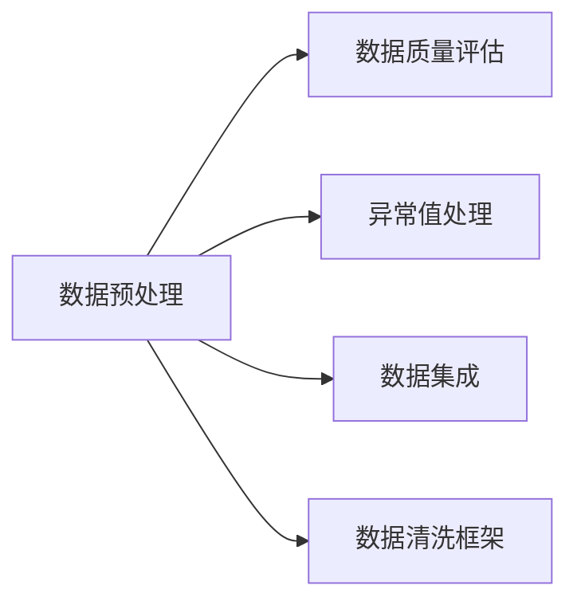

                 

# 知识发现引擎的数据清洗技术

在数据科学和人工智能的世界里，数据清洗是知识发现引擎的重要基础。数据清洗的目的是确保数据的质量和一致性，以便进行后续的数据分析、模型训练和业务决策。本文将全面探讨知识发现引擎中的数据清洗技术，包括其核心概念、关键算法、具体实现、应用场景和未来发展趋势，并配以详细的数学公式和代码实例。

## 1. 背景介绍

### 1.1 问题由来
随着数据量的爆炸性增长和数据来源的多样化，数据清洗在知识发现引擎中变得越来越重要。数据清洗涉及到对原始数据的整理、筛选、转换和纠正，以去除噪声、冗余和不一致性，确保数据能够高效地支持分析和建模。数据清洗不仅仅是数据预处理的前置步骤，更是在整个知识发现过程中起到至关重要的作用。

### 1.2 问题核心关键点
数据清洗的核心在于数据质量管理，其目标是从大量杂乱无章的数据中提取出有用信息。核心关键点包括：
- 数据预处理：包括数据清洗、数据转换和数据规范化。
- 数据质量评估：评估数据是否满足数据质量标准。
- 数据异常处理：识别并处理数据中的异常值和缺失值。
- 数据集成：将来自不同源的数据合并在一起，并确保一致性。

### 1.3 问题研究意义
数据清洗是确保知识发现引擎能够准确、高效、可靠地运行的基础。研究数据清洗技术，可以：
- 减少数据偏差和噪声，提高分析结果的准确性。
- 提升数据模型的泛化能力，增强模型在实际应用中的表现。
- 降低数据分析和建模的成本，加速知识发现和应用的进程。
- 提高数据的可解释性，促进数据驱动决策的科学化。

## 2. 核心概念与联系

### 2.1 核心概念概述

数据清洗涉及多个核心概念，这些概念相互关联，共同构成了数据清洗的完整过程：

- **数据预处理**：通过清洗、转换和规范化等操作，将原始数据转化为可用格式。
- **数据质量评估**：采用各种指标和算法，评估数据质量，确保数据符合标准。
- **异常值处理**：识别并处理数据中的异常点和噪声，保证数据的一致性。
- **数据集成**：将来自不同源的数据合并，消除数据孤岛，实现数据共享。
- **数据清洗框架**：提供数据清洗的标准化流程和工具，支持自动化的数据清洗。

这些概念之间的逻辑关系可以通过以下Mermaid流程图来展示：



这个流程图展示了大数据清洗的核心概念及其之间的关系：

1. 数据预处理是数据清洗的第一步，通过清洗、转换和规范化等操作，将原始数据转化为可用格式。
2. 数据质量评估对数据进行多维度的评估，确保数据符合标准。
3. 异常值处理识别并处理数据中的异常点和噪声，保证数据的一致性。
4. 数据集成将来自不同源的数据合并，消除数据孤岛，实现数据共享。
5. 数据清洗框架提供数据清洗的标准化流程和工具，支持自动化的数据清洗。

## 3. 核心算法原理 & 具体操作步骤

### 3.1 算法原理概述

数据清洗的原理是通过一系列预定义的规则和算法，对原始数据进行整理、筛选、转换和纠正，以去除噪声、冗余和不一致性。

常见的数据清洗算法包括：
- 去重算法：去除数据中的重复记录。
- 缺失值处理算法：填补或删除缺失值。
- 异常值检测算法：识别和处理异常值。
- 数据规范化算法：将数据转化为标准格式。

这些算法通过定量和定性的方法，结合数据本身的特点，实现数据的清洗和处理。

### 3.2 算法步骤详解

数据清洗的一般步骤如下：

1. **数据预处理**：
   - **数据清洗**：去除重复记录、空值、异常值等。
   - **数据转换**：将数据转换为一致的格式，如日期标准化。
   - **数据规范化**：将数据缩放到统一的范围内，如归一化处理。

2. **数据质量评估**：
   - **数据完整性检查**：检查数据是否存在缺失值、重复值等。
   - **数据准确性检查**：验证数据的正确性，如通过规则校验。
   - **数据一致性检查**：确保数据在不同源之间的一致性。

3. **异常值处理**：
   - **异常值识别**：识别数据中的异常点和噪声。
   - **异常值处理**：根据业务逻辑，填补或删除异常值。

4. **数据集成**：
   - **数据对齐**：对齐不同源的数据，如通过主键连接。
   - **数据冲突解决**：处理不同数据源之间的冲突，如通过规则或人工判断。

### 3.3 算法优缺点

数据清洗算法具有以下优点：
- **自动化高效**：许多数据清洗算法可以自动化执行，减少人工干预。
- **可扩展性强**：算法可以应用于各种数据类型和数据规模。
- **通用性高**：适用于多种数据源和业务场景。

同时，数据清洗算法也存在一些局限性：
- **依赖业务理解**：算法效果很大程度上依赖于业务逻辑和数据质量标准。
- **可能引入偏差**：在处理数据时，可能会引入新的偏差和噪声。
- **复杂度高**：对于复杂数据集，清洗过程可能非常耗时和复杂。

### 3.4 算法应用领域

数据清洗算法在多个领域都有广泛应用，包括：
- **金融风控**：清洗用户数据，提高信用评分准确性。
- **医疗健康**：清洗病人数据，确保诊断和治疗的有效性。
- **电商推荐**：清洗用户行为数据，提升推荐系统的效果。
- **物流管理**：清洗订单数据，优化配送路径和资源配置。
- **智能制造**：清洗设备数据，提高生产效率和产品质量。

## 4. 数学模型和公式 & 详细讲解

### 4.1 数学模型构建

假设原始数据集为 $D=\{(x_i,y_i)\}_{i=1}^N$，其中 $x_i \in \mathcal{X}$ 是输入特征，$y_i \in \mathcal{Y}$ 是输出标签。数据清洗的目标是得到干净的数据集 $D'$，使得 $D'$ 中的每个数据点 $(x',y')$ 都满足预设的质量标准。

### 4.2 公式推导过程

以数据去重算法为例，设原始数据集中存在重复记录 $(x_i,y_i)=(x_j,y_j)$，其中 $i \neq j$。去重算法可以通过计算每个记录的哈希值 $h(x_i)$ 来判断其是否重复，具体步骤如下：

1. 对每个记录计算哈希值 $h(x_i)$。
2. 使用哈希表 $H$ 存储所有哈希值和对应的记录索引。
3. 遍历所有记录，如果发现 $h(x_i)$ 已经在哈希表中存在，则认为 $(x_i,y_i)$ 是重复记录，将其从数据集中移除。

通过哈希函数，可以在 $O(N)$ 的时间复杂度内完成数据去重，实现高效的数据清洗。

### 4.3 案例分析与讲解

假设我们有一个电商用户数据集，其中包括用户的购买记录和行为数据。数据集中存在一些重复记录和不一致的数据，需要进行清洗以提高模型的准确性。

首先，对购买记录进行去重，防止同一个用户重复购买相同的商品。可以使用哈希函数计算购买记录的哈希值，并存储在哈希表中，判断是否存在重复记录。

其次，对行为数据进行规范化，将日期格式统一为 "YYYY-MM-DD" 格式，以便进行时间序列分析。同时，使用均值填补或插值方法处理缺失值。

最后，进行异常值检测，识别出购买次数异常多的用户，将其标记为潜在的欺诈用户，进一步进行人工审核。

## 5. 项目实践：代码实例和详细解释说明

### 5.1 开发环境搭建

在进行数据清洗实践前，我们需要准备好开发环境。以下是使用Python进行Pandas开发的环境配置流程：

1. 安装Anaconda：从官网下载并安装Anaconda，用于创建独立的Python环境。

2. 创建并激活虚拟环境：
```bash
conda create -n data-cleaning python=3.8 
conda activate data-cleaning
```

3. 安装Pandas：
```bash
pip install pandas
```

4. 安装NumPy、matplotlib、scikit-learn等工具包：
```bash
pip install numpy matplotlib scikit-learn tqdm jupyter notebook ipython
```

完成上述步骤后，即可在`data-cleaning`环境中开始数据清洗实践。

### 5.2 源代码详细实现

下面以数据去重和缺失值处理为例，给出使用Pandas进行数据清洗的PyTorch代码实现。

首先，导入必要的库：

```python
import pandas as pd
import numpy as np
import matplotlib.pyplot as plt
from sklearn.impute import SimpleImputer
from sklearn.preprocessing import StandardScaler
from sklearn.metrics import mean_squared_error
from sklearn.model_selection import train_test_split
```

然后，定义数据清洗函数：

```python
def clean_data(df):
    # 数据去重
    df = df.drop_duplicates()
    
    # 缺失值处理
    imputer = SimpleImputer(strategy='mean')
    df = pd.DataFrame(imputer.fit_transform(df), columns=df.columns)
    
    # 异常值检测
    z_scores = np.abs((df - df.mean()) / df.std())
    df = df[(z_scores < 3).all(axis=1)]
    
    return df
```

接着，加载数据并调用清洗函数：

```python
# 加载数据
df = pd.read_csv('data.csv')

# 数据清洗
df = clean_data(df)

# 数据预览
print(df.head())
```

最后，进行数据集成：

```python
# 数据集成
df1 = pd.read_csv('data1.csv')
df2 = pd.read_csv('data2.csv')
df = pd.concat([df, df1, df2], ignore_index=True)
df = df.drop_duplicates()
df = df.dropna()
```

以上就是使用Pandas进行数据清洗的完整代码实现。可以看到，Pandas提供了丰富的数据清洗方法，使得数据清洗过程变得简单高效。

### 5.3 代码解读与分析

让我们再详细解读一下关键代码的实现细节：

**clean_data函数**：
- `drop_duplicates`方法：去除数据中的重复记录。
- `SimpleImputer`方法：使用均值填补缺失值。
- `z_scores`变量：计算每个特征的Z分数，识别出异常值。
- `drop`方法：根据Z分数阈值，去除异常值。

**数据加载和集成**：
- `read_csv`方法：加载数据集。
- `concat`方法：将多个数据集合并。
- `drop`方法：去除重复记录和缺失值。

Pandas库提供了丰富的数据清洗工具，可以处理各种复杂的数据清洗任务。开发者可以根据具体任务，灵活组合使用这些工具，实现高效的数据清洗。

## 6. 实际应用场景

### 6.1 金融风控

在金融领域，数据清洗是风险管理的重要环节。金融机构需要清洗大量的客户数据，以提高信用评分和风险评估的准确性。数据清洗可以帮助识别欺诈行为、异常交易等，提升金融机构的风控能力。

### 6.2 医疗健康

医疗健康领域的数据清洗对提高诊断和治疗的效果至关重要。数据清洗可以去除病历数据中的噪声和异常值，确保病人数据的一致性和完整性，提高临床决策的准确性。

### 6.3 电商推荐

在电商领域，数据清洗可以提升推荐系统的精度和效果。通过清洗用户行为数据，去除不相关的记录，填补缺失值，可以提高推荐模型的预测准确性。

### 6.4 物流管理

物流管理中，数据清洗可以提高配送路径和资源配置的优化效果。通过清洗订单数据，去除重复记录和不一致的数据，可以提高物流运营的效率和准确性。

### 6.5 智能制造

在智能制造中，数据清洗可以提高生产效率和产品质量。通过清洗设备数据，去除异常值和不一致的数据，可以提高生产线的稳定性和可靠性。

## 7. 工具和资源推荐

### 7.1 学习资源推荐

为了帮助开发者系统掌握数据清洗的理论基础和实践技巧，这里推荐一些优质的学习资源：

1. 《数据清洗技术与实践》系列博文：由数据清洗技术专家撰写，深入浅出地介绍了数据清洗的基本原理和常用算法。

2. Kaggle数据清洗竞赛：Kaggle社区举办的数据清洗竞赛，涵盖各种实际数据清洗案例，提供丰富的实战经验。

3. 《Python数据清洗与处理》书籍：全面介绍了使用Pandas进行数据清洗的方法和技巧，适合数据清洗新手入门。

4. Udacity《数据清洗与准备》课程：由Udacity开设的在线课程，提供系统化学习数据清洗的资源和指导。

5. DataCamp《数据清洗与处理》课程：提供丰富的数据清洗实战练习，通过实践提高数据清洗技能。

通过这些资源的学习实践，相信你一定能够快速掌握数据清洗的精髓，并用于解决实际的数据处理问题。

### 7.2 开发工具推荐

高效的数据清洗离不开优秀的工具支持。以下是几款用于数据清洗开发的常用工具：

1. Pandas：Python的数据分析库，提供了丰富的数据清洗和处理工具，如drop_duplicates、fillna、dropna等。

2. NumPy：Python的数值计算库，提供高效的数组操作和数学运算，支持数据的快速处理和分析。

3. matplotlib：Python的数据可视化库，用于绘制各种图表，辅助数据分析和决策。

4. Seaborn：基于matplotlib的数据可视化库，提供更高级的数据可视化功能，支持数据探索和分析。

5. Scikit-learn：Python的机器学习库，提供多种数据预处理和清洗算法，如SimpleImputer、StandardScaler等。

6. Apache Spark：大数据处理框架，提供分布式数据清洗和处理能力，适合处理大规模数据集。

合理利用这些工具，可以显著提升数据清洗任务的开发效率，加快创新迭代的步伐。

### 7.3 相关论文推荐

数据清洗技术的发展源于学界的持续研究。以下是几篇奠基性的相关论文，推荐阅读：

1. Data Cleaning in Large Data Sets with Duplicates (1990)：最早提出数据去重算法的经典论文，奠定了数据清洗的基础。

2. FastData: Fast Parallel Data Cleaning and Analysis (2003)：提出并行数据清洗算法，大幅提升了数据处理效率。

3. Mining of Massive Datasets with Missing Values (2011)：提出缺失值处理方法，提高了数据完整性和准确性。

4. Anomaly Detection in Multi-Dimensional Data: A Survey (2015)：综述了异常值检测算法，为数据清洗提供了丰富的工具和方法。

5. Data Cleaning with a Data Cleaning Framework (2019)：提出数据清洗框架的概念，提供标准化的数据清洗流程和工具。

这些论文代表了大数据清洗技术的发展脉络。通过学习这些前沿成果，可以帮助研究者把握学科前进方向，激发更多的创新灵感。

## 8. 总结：未来发展趋势与挑战

### 8.1 总结

本文对数据清洗技术进行了全面系统的介绍。首先阐述了数据清洗在知识发现引擎中的重要性，明确了数据清洗在数据处理、模型训练和业务决策中的独特价值。其次，从原理到实践，详细讲解了数据清洗的核心算法和具体操作步骤，提供了数据清洗的完整代码实例。同时，本文还探讨了数据清洗在多个行业领域的应用前景，展示了数据清洗技术的广泛应用。最后，本文精选了数据清洗技术的各类学习资源，力求为读者提供全方位的技术指引。

通过本文的系统梳理，可以看到，数据清洗技术在大数据时代具有不可替代的地位。数据清洗不仅能提升数据质量，还能提高数据处理效率，是数据驱动决策的重要保障。

### 8.2 未来发展趋势

展望未来，数据清洗技术将呈现以下几个发展趋势：

1. **自动化和智能化**：未来数据清洗将越来越多地采用自动化工具，如机器学习算法，实现智能化的数据清洗。

2. **多源数据整合**：数据清洗将不仅局限于单个数据源，而是能够处理多源数据的整合和清洗，提高数据的综合利用率。

3. **实时数据清洗**：随着实时数据流的出现，数据清洗将向实时化方向发展，实现数据的实时清洗和处理。

4. **云平台支持**：数据清洗将越来越多地依赖云平台和分布式计算技术，实现高效的数据处理和清洗。

5. **跨领域应用**：数据清洗技术将应用于更多领域，如金融、医疗、制造等，推动各行业的智能化升级。

6. **隐私保护**：数据清洗过程中，将更加注重隐私保护，通过数据匿名化和差分隐私等技术，保护用户隐私。

以上趋势凸显了数据清洗技术的广阔前景。这些方向的探索发展，将进一步提升数据处理的质量和效率，推动各行业的数字化转型。

### 8.3 面临的挑战

尽管数据清洗技术已经取得了一定的进展，但在迈向更加智能化、自动化应用的过程中，仍面临诸多挑战：

1. **数据异构性**：不同数据源的数据格式和结构各异，如何统一和整合数据，是一个难题。

2. **数据量庞大**：大数据时代，数据量呈爆炸式增长，如何高效地处理海量数据，是一个重大挑战。

3. **异常值处理**：数据中存在大量异常值和噪声，如何准确地识别和处理异常值，是一个复杂的问题。

4. **实时性要求**：实时数据流的出现，对数据清洗的实时性和效率提出了更高的要求。

5. **隐私保护**：数据清洗过程中，如何保护用户隐私和数据安全，是一个重要的伦理问题。

6. **自动化程度**：数据清洗的自动化程度仍需提高，如何减少人工干预，提升自动化水平，是一个重要的研究方向。

解决这些挑战，需要学界和产业界的共同努力，不断创新和优化数据清洗技术，才能真正实现数据驱动决策的智能化和自动化。

### 8.4 研究展望

未来，数据清洗技术需要在以下几个方面寻求新的突破：

1. **多模态数据清洗**：将文本、图像、语音等多模态数据进行综合清洗，提高数据的融合能力和应用价值。

2. **知识引导的数据清洗**：利用外部知识库和规则库，引导数据清洗过程，提高数据的准确性和一致性。

3. **隐私保护与数据共享**：在保护隐私的前提下，实现数据的共享和利用，推动数据开放和应用。

4. **跨领域数据清洗**：将数据清洗技术应用于更多领域，如金融、医疗、制造等，提升各行业的智能化水平。

5. **自动化和智能化**：开发更加智能化的数据清洗算法，实现自动化和智能化，提高数据处理的效率和精度。

6. **分布式数据清洗**：利用分布式计算和云平台，实现大规模数据的分布式清洗和处理，提升数据处理的可扩展性和实时性。

这些研究方向将推动数据清洗技术的不断进步，为数据驱动决策提供更坚实的基础。

## 9. 附录：常见问题与解答

**Q1：数据清洗是否只包括数据预处理和数据质量评估？**

A: 数据清洗不仅仅是数据预处理和数据质量评估，还包括异常值处理、数据集成等环节。数据清洗是一个系统化的过程，涉及多个步骤，从数据预处理到数据集成，每一个环节都至关重要。

**Q2：数据清洗算法是否只适用于静态数据？**

A: 数据清洗算法不仅适用于静态数据，也适用于动态数据流。例如，实时数据流中的数据可以通过增量数据清洗方法进行清洗，确保数据的时效性和准确性。

**Q3：数据清洗过程中如何平衡数据清洗和数据处理的效率？**

A: 数据清洗和数据处理是一个权衡的过程，需要根据具体业务需求和数据特征，灵活选择清洗方法和处理策略。例如，对于数据量庞大的数据集，可以考虑分布式数据清洗技术，提升处理效率。

**Q4：如何选择合适的数据清洗算法？**

A: 选择合适的数据清洗算法需要考虑多个因素，如数据类型、数据规模、业务需求等。常见的数据清洗算法包括去重、缺失值填补、异常值检测等，需要根据具体场景进行选择。

**Q5：数据清洗过程中如何保证数据的一致性？**

A: 数据一致性是数据清洗的重要目标之一。通过使用标准化数据格式、统一的规则和算法，可以在数据清洗过程中保证数据的一致性。此外，还可以使用数据验证和校验方法，确保数据的准确性和一致性。

这些问题的解答，为数据清洗实践提供了参考和指导，帮助开发者更好地应对数据清洗中的各种挑战。

---

作者：禅与计算机程序设计艺术 / Zen and the Art of Computer Programming

