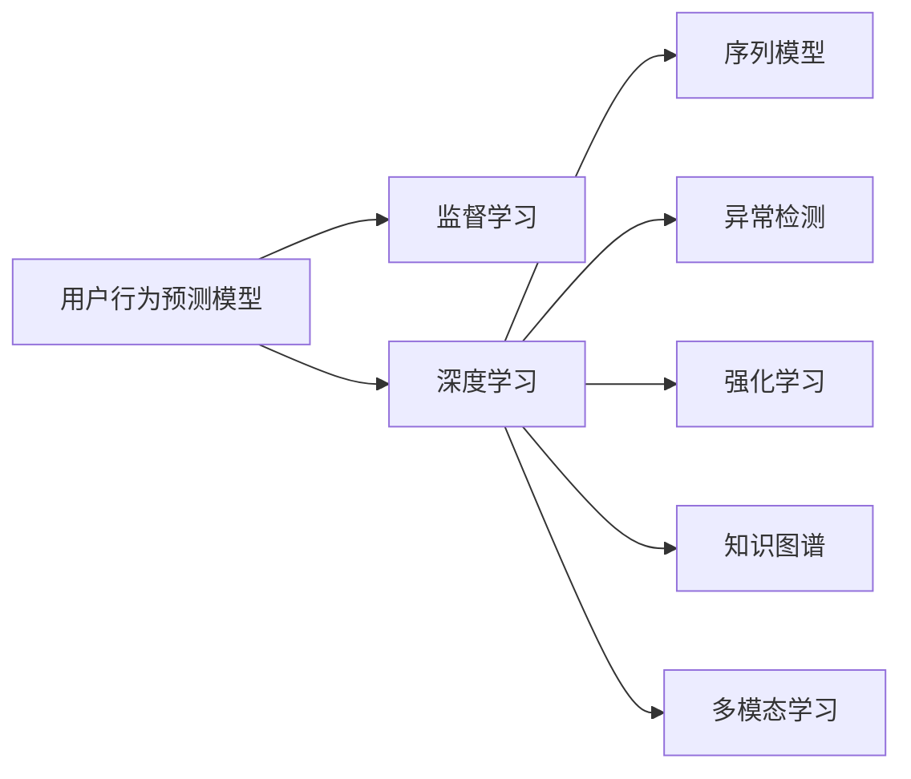

                 

## 1. 背景介绍

在当前信息爆炸的时代，互联网用户的行为预测已成为知识发现引擎的核心任务。通过预测用户的行为，知识发现引擎能够为用户提供个性化推荐、精准广告投放、优化搜索引擎排序等应用场景，极大地提升了用户满意度和平台收益。本文聚焦于基于机器学习的用户行为预测模型，介绍了其主要算法原理、操作步骤以及实际应用场景，期望对相关研究者和工程师提供深入的指导。

## 2. 核心概念与联系

### 2.1 核心概念概述

为更好地理解用户行为预测模型的原理和架构，本节将介绍几个核心概念：

- **用户行为预测模型**：通过分析用户的历史行为数据，预测用户未来的行为，如点击、购买、评分等。

- **监督学习**：利用有标签的训练数据，训练机器学习模型，以实现行为预测。

- **深度学习**：通过多层神经网络结构，从数据中提取复杂特征，实现高精度的行为预测。

- **序列模型**：用于处理时间序列数据，能够捕捉用户行为的时间依赖关系。

- **异常检测**：识别并处理用户行为中的异常值，保证预测模型的鲁棒性。

- **强化学习**：通过模拟用户交互过程，训练智能体做出最优决策，提升预测模型的效果。

- **知识图谱**：将知识表示为图结构，增强模型的语义理解和推理能力。

- **多模态学习**：结合文本、图像、视频等多模态数据，提升模型的泛化能力和预测精度。

这些核心概念之间的逻辑关系可以通过以下Mermaid流程图来展示：



这个流程图展示了用户行为预测模型与监督学习、深度学习等技术之间的紧密联系。深度学习模型通过监督学习、序列模型、异常检测、强化学习、知识图谱和多模态学习等多种技术，构建了强大的用户行为预测能力。

## 3. 核心算法原理 & 具体操作步骤

### 3.1 算法原理概述

用户行为预测模型主要基于监督学习和深度学习技术。其核心思想是通过对用户历史行为数据进行学习，发现行为模式，并用这些模式来预测用户未来的行为。该过程通常包括以下几个步骤：

1. **数据准备**：收集用户的历史行为数据，进行数据清洗和预处理。
2. **特征工程**：从历史数据中提取有用特征，包括用户属性、时间特征、历史行为等。
3. **模型训练**：利用监督学习算法，如线性回归、随机森林、梯度提升机等，对特征进行建模，预测用户行为。
4. **模型评估**：使用交叉验证等方法，评估模型预测的准确性和泛化能力。
5. **模型优化**：根据评估结果，调整模型参数，提升预测效果。
6. **模型部署**：将训练好的模型部署到生产环境，实时预测用户行为。

### 3.2 算法步骤详解

#### 数据准备

数据准备是用户行为预测模型的基础。具体步骤如下：

1. **数据收集**：从平台日志、用户交互记录、社交媒体等渠道，收集用户的历史行为数据。
2. **数据清洗**：处理缺失值、异常值，去除噪声数据，提高数据质量。
3. **特征提取**：从数据中提取有用特征，如用户ID、时间戳、行为类型、用户属性等。

#### 特征工程

特征工程是构建预测模型的关键步骤。常见特征包括：

- **用户属性**：如年龄、性别、职业、兴趣等。
- **行为特征**：如点击次数、停留时间、购买金额等。
- **时间特征**：如星期、月份、小时等。
- **上下文特征**：如广告、商品、位置等。

特征工程的目标是提升模型的预测能力，通常需要使用PCA、特征选择等技术进行处理。

#### 模型训练

模型训练的目的是使用监督学习算法，构建一个能够准确预测用户行为的模型。常见的算法包括：

- **线性回归**：适用于连续型行为预测，如购买金额、评分等。
- **逻辑回归**：适用于二分类行为预测，如是否购买、是否点击等。
- **决策树**：适用于分类和回归问题，具有较好的可解释性。
- **随机森林**：通过集成多个决策树，提升模型的预测精度。
- **梯度提升机**：通过逐层优化模型，提升模型的准确性。

#### 模型评估

模型评估的目的是评估模型预测的准确性和泛化能力。常用的评估指标包括：

- **准确率**：模型预测正确的样本占总样本的比例。
- **召回率**：模型正确预测的正样本占实际正样本的比例。
- **F1值**：综合考虑准确率和召回率，平衡二者的权衡。
- **AUC**：曲线下面积，衡量模型在不同阈值下的预测能力。

#### 模型优化

模型优化是提升预测准确性的关键步骤。常用的优化方法包括：

- **参数调整**：调整模型参数，如学习率、正则化系数等。
- **特征选择**：选择最相关的特征，去除冗余特征。
- **模型集成**：通过集成多个模型，提升预测精度。
- **数据增强**：通过合成数据、回译等方式，丰富训练集。

#### 模型部署

模型部署是将训练好的模型应用到实际场景中，进行实时预测。常用的部署方式包括：

- **API接口**：通过RESTful API接口，接收请求并返回预测结果。
- **事件触发**：通过事件触发机制，实时更新预测结果。
- **流处理**：使用流处理技术，处理实时数据流，实时更新预测结果。

### 3.3 算法优缺点

用户行为预测模型具有以下优点：

1. **高精度**：通过深度学习模型，能够捕捉复杂的行为模式，提升预测准确性。
2. **可扩展性**：支持大规模数据处理，能够处理海量用户行为数据。
3. **实时性**：能够实时更新预测结果，支持动态决策。

但同时也存在一些缺点：

1. **数据依赖**：模型依赖高质量、大规模的数据，获取和处理成本较高。
2. **过拟合风险**：模型容易过拟合历史数据，泛化能力不足。
3. **模型复杂**：深度学习模型结构复杂，训练和推理成本较高。

### 3.4 算法应用领域

用户行为预测模型在多个领域得到了广泛应用，例如：

- **电商推荐系统**：通过预测用户购买行为，提供个性化推荐。
- **广告投放系统**：通过预测用户点击行为，优化广告投放策略。
- **搜索引擎优化**：通过预测用户点击行为，优化搜索引擎排序。
- **金融风控系统**：通过预测用户欺诈行为，防范金融风险。
- **内容推荐系统**：通过预测用户观看行为，提供个性化视频推荐。

除了上述这些应用领域外，用户行为预测模型还被创新性地应用到更多场景中，如智能客服、社交网络分析等，为不同领域提供了新的技术支持。

## 4. 数学模型和公式 & 详细讲解 & 举例说明

### 4.1 数学模型构建

本节将使用数学语言对用户行为预测模型的构建过程进行更加严格的刻画。

记用户行为预测问题为 $y=f(x)$，其中 $y$ 为用户行为，$x$ 为用户历史行为数据。假设 $f$ 为未知的非线性函数。利用监督学习算法，构建一个能够拟合 $f$ 的模型 $h$，使得预测值 $y_h$ 尽量接近真实值 $y$。数学上，可以表示为：

$$
\min_{h} \sum_{i=1}^n (y_i - y_h(x_i))^2
$$

其中 $n$ 为训练样本数，$(x_i,y_i)$ 为第 $i$ 个训练样本。

### 4.2 公式推导过程

以线性回归模型为例，进行详细推导。

假设模型 $h$ 为线性回归模型：

$$
y_h(x) = \theta_0 + \theta_1 x_1 + \cdots + \theta_p x_p
$$

其中 $\theta_0,\theta_1,\cdots,\theta_p$ 为模型参数。将 $y_h(x)$ 代入损失函数，得：

$$
\min_{\theta} \sum_{i=1}^n (y_i - (\theta_0 + \theta_1 x_{i1} + \cdots + \theta_p x_{ip}))^2
$$

对其进行求导，并令导数等于零，得：

$$
\frac{\partial}{\partial \theta} \sum_{i=1}^n (y_i - (\theta_0 + \theta_1 x_{i1} + \cdots + \theta_p x_{ip}))^2 = 0
$$

解得模型参数 $\theta$，即：

$$
\theta = (X^TX)^{-1}X^Ty
$$

其中 $X=[1,x_{i1},\cdots,x_{ip}]$，$y=[y_1,\cdots,y_n]$。

### 4.3 案例分析与讲解

假设我们有一个电商平台，希望通过用户行为预测模型，预测用户是否会购买某件商品。具体步骤如下：

1. **数据准备**：从平台日志中收集用户历史购买行为数据，包括用户ID、商品ID、购买时间等。
2. **特征工程**：提取用户属性（如年龄、性别）、商品属性（如价格、类别）、行为特征（如购买次数、停留时间）等。
3. **模型训练**：使用随机森林算法，对特征进行建模，预测用户是否会购买某件商品。
4. **模型评估**：使用交叉验证等方法，评估模型预测的准确性和泛化能力。
5. **模型优化**：根据评估结果，调整模型参数，提升预测效果。
6. **模型部署**：将训练好的模型部署到生产环境，实时预测用户是否会购买某件商品。

## 5. 项目实践：代码实例和详细解释说明

### 5.1 开发环境搭建

在进行用户行为预测模型的开发时，我们需要准备好开发环境。以下是使用Python进行scikit-learn开发的环境配置流程：

1. 安装Anaconda：从官网下载并安装Anaconda，用于创建独立的Python环境。

2. 创建并激活虚拟环境：
```bash
conda create -n user-behavior python=3.8 
conda activate user-behavior
```

3. 安装scikit-learn：
```bash
pip install scikit-learn
```

4. 安装其他相关库：
```bash
pip install pandas numpy matplotlib seaborn
```

完成上述步骤后，即可在`user-behavior`环境中开始模型开发。

### 5.2 源代码详细实现

下面我们以电商推荐系统为例，给出使用scikit-learn对用户行为进行预测的Python代码实现。

首先，定义数据处理函数：

```python
import pandas as pd
from sklearn.model_selection import train_test_split

def load_data(file_path):
    data = pd.read_csv(file_path)
    X = data.drop(['y'], axis=1)
    y = data['y']
    return X, y

# 加载数据
X, y = load_data('data.csv')

# 数据拆分
X_train, X_test, y_train, y_test = train_test_split(X, y, test_size=0.2, random_state=42)
```

然后，定义模型训练函数：

```python
from sklearn.linear_model import LogisticRegression
from sklearn.metrics import accuracy_score

def train_model(X_train, y_train):
    model = LogisticRegression()
    model.fit(X_train, y_train)
    return model

# 训练模型
model = train_model(X_train, y_train)
```

接着，定义模型评估函数：

```python
from sklearn.metrics import confusion_matrix, classification_report

def evaluate_model(model, X_test, y_test):
    y_pred = model.predict(X_test)
    accuracy = accuracy_score(y_test, y_pred)
    confusion = confusion_matrix(y_test, y_pred)
    report = classification_report(y_test, y_pred)
    return accuracy, confusion, report

# 评估模型
accuracy, confusion, report = evaluate_model(model, X_test, y_test)
print('Accuracy:', accuracy)
print('Confusion Matrix:\n', confusion)
print('Classification Report:\n', report)
```

最后，启动训练流程并在测试集上评估：

```python
# 训练模型
model = train_model(X_train, y_train)

# 评估模型
accuracy, confusion, report = evaluate_model(model, X_test, y_test)
print('Accuracy:', accuracy)
print('Confusion Matrix:\n', confusion)
print('Classification Report:\n', report)
```

以上就是使用scikit-learn对用户行为进行预测的完整代码实现。可以看到，借助scikit-learn，我们可以用相对简洁的代码完成线性回归模型的训练和评估。

### 5.3 代码解读与分析

让我们再详细解读一下关键代码的实现细节：

**load_data函数**：
- 定义数据加载和分割函数，从CSV文件中读取数据，并将其划分为特征和标签。
- 使用train_test_split函数对数据进行训练集和测试集的拆分。

**train_model函数**：
- 定义模型训练函数，选择线性回归模型，并使用训练集进行训练。

**evaluate_model函数**：
- 定义模型评估函数，计算模型的准确率、混淆矩阵和分类报告。

**train_model和evaluate_model函数**：
- 在模型训练函数中，使用train_model函数训练模型。
- 在模型评估函数中，使用evaluate_model函数评估模型性能。

**训练流程**：
- 调用train_model函数训练模型。
- 调用evaluate_model函数评估模型性能。

可以看到，scikit-learn提供了一系列方便易用的工具函数，极大简化了模型开发过程。开发者可以将更多精力放在数据处理、模型选择、特征工程等高级逻辑上，而不必过多关注底层的实现细节。

当然，工业级的系统实现还需考虑更多因素，如模型的保存和部署、超参数的自动搜索、更灵活的任务适配层等。但核心的用户行为预测范式基本与此类似。

## 6. 实际应用场景

### 6.1 电商推荐系统

电商推荐系统是用户行为预测模型的典型应用场景。通过预测用户是否会购买某件商品，推荐系统能够提供个性化推荐，提升用户满意度和平台收益。

在技术实现上，可以收集用户的历史购买行为数据，将商品ID作为预测目标，构建线性回归模型。在生成推荐列表时，先用候选商品的特征作为输入，由模型预测用户购买的概率，再结合其他特征综合排序，便可以得到个性化程度更高的推荐结果。

### 6.2 广告投放系统

广告投放系统通过预测用户是否点击广告，优化广告投放策略，提升广告效果和平台收益。

具体而言，可以收集用户在广告页面上的行为数据，如点击次数、停留时间等，作为模型的输入特征。将点击与否作为预测目标，构建二分类模型。在实际投放广告时，根据用户行为预测模型，动态调整广告投放位置和预算，实现精准投放。

### 6.3 搜索引擎优化

搜索引擎优化通过预测用户是否点击搜索结果，优化搜索引擎排序，提升用户满意度和平台收益。

在实现中，可以收集用户在搜索结果页面上的点击行为数据，将点击与否作为预测目标。通过构建二分类模型，预测用户是否会点击某个搜索结果。在排序算法中，优先展示预测点击概率高的搜索结果，提升用户体验和平台收益。

### 6.4 金融风控系统

金融风控系统通过预测用户是否存在欺诈行为，防范金融风险，保护用户资产安全。

具体而言，可以收集用户在金融交易中的行为数据，如交易金额、交易频率等，作为模型的输入特征。将欺诈与否作为预测目标，构建二分类模型。在实际交易过程中，根据用户行为预测模型，动态调整交易策略，防范欺诈风险。

## 7. 工具和资源推荐

### 7.1 学习资源推荐

为了帮助开发者系统掌握用户行为预测的理论基础和实践技巧，这里推荐一些优质的学习资源：

1. **《Python机器学习》**：这本书介绍了Python在机器学习领域的应用，包括监督学习、深度学习等。

2. **《机器学习实战》**：提供了大量实例和案例，帮助读者理解机器学习算法的实际应用。

3. **Coursera《机器学习》课程**：由斯坦福大学Andrew Ng教授主讲，系统介绍了机器学习的基本概念和算法。

4. **Kaggle**：提供了大量数据集和竞赛平台，帮助开发者实践和优化用户行为预测模型。

5. **Github**：提供了大量开源项目和代码，帮助开发者学习和应用用户行为预测模型。

通过对这些资源的学习实践，相信你一定能够快速掌握用户行为预测的精髓，并用于解决实际的业务问题。

### 7.2 开发工具推荐

高效的开发离不开优秀的工具支持。以下是几款用于用户行为预测开发的常用工具：

1. **Jupyter Notebook**：一个交互式的开发环境，适合进行数据探索和模型调试。

2. **TensorFlow**：一个开源的深度学习框架，支持多种算法和模型，性能优异。

3. **PyTorch**：一个开源的深度学习框架，提供了便捷的GPU加速功能，适合大规模模型训练。

4. **scikit-learn**：一个简单易用的机器学习库，提供了丰富的算法和工具，适合快速开发和评估模型。

5. **Keras**：一个高层次的深度学习框架，适合快速原型开发和模型构建。

合理利用这些工具，可以显著提升用户行为预测任务的开发效率，加快创新迭代的步伐。

### 7.3 相关论文推荐

用户行为预测模型是机器学习和深度学习领域的热点研究课题，以下是几篇奠基性的相关论文，推荐阅读：

1. **《ClickBait: Multinomial Logistic Regression for User Behavior Prediction》**：介绍了使用线性回归模型预测用户点击行为的经典方法。

2. **《Deep Learning for Recommender Systems: A Review》**：综述了深度学习在推荐系统中的应用，包括用户行为预测、物品推荐等。

3. **《A Survey on Deep Learning for Anomaly Detection》**：综述了深度学习在异常检测中的应用，包括用户行为异常检测。

4. **《Recurrent Neural Network Based Approaches for User Behavior Prediction》**：介绍了使用递归神经网络模型进行用户行为预测的方法。

5. **《Adaptive Classifier for Online Prediction of User Behavior》**：介绍了使用自适应分类器进行用户行为预测的方法。

这些论文代表了大模型微调技术的发展脉络。通过学习这些前沿成果，可以帮助研究者把握学科前进方向，激发更多的创新灵感。

## 8. 总结：未来发展趋势与挑战

### 8.1 总结

本文对基于机器学习的用户行为预测模型进行了全面系统的介绍。首先阐述了用户行为预测模型的研究背景和意义，明确了其对电商推荐、广告投放、搜索引擎优化、金融风控等实际应用场景的重要性。其次，从原理到实践，详细讲解了用户行为预测的数学模型和关键步骤，给出了用户行为预测任务开发的完整代码实例。同时，本文还广泛探讨了用户行为预测模型在电商、广告、搜索、金融等领域的实际应用，展示了其巨大的应用潜力。最后，本文精选了用户行为预测模型的各类学习资源，力求为读者提供全方位的技术指引。

通过本文的系统梳理，可以看到，基于机器学习的用户行为预测模型正在成为电商、广告、搜索等领域的核心技术，极大地提升了相关业务的智能水平和用户体验。未来，伴随深度学习技术的不断发展，用户行为预测模型将具备更强大的预测能力和泛化能力，为各行各业带来新的创新动力。

### 8.2 未来发展趋势

展望未来，用户行为预测技术将呈现以下几个发展趋势：

1. **深度学习模型的提升**：深度学习模型的结构和算法将不断优化，提升模型的预测能力和泛化能力。

2. **多模态学习的融合**：结合文本、图像、视频等多模态数据，提升模型的泛化能力和预测精度。

3. **知识图谱的引入**：通过引入知识图谱，增强模型的语义理解和推理能力，提升预测效果。

4. **异常检测的改进**：通过改进异常检测算法，提升模型的鲁棒性和泛化能力。

5. **实时预测的实现**：通过流处理技术，实现实时预测，满足业务需求。

6. **联邦学习的推广**：通过联邦学习技术，实现多方数据协同训练，提升模型的准确性和隐私保护。

这些趋势凸显了用户行为预测技术的广阔前景。这些方向的探索发展，必将进一步提升模型的性能和应用范围，为电商、广告、搜索等领域的智能化应用提供新动力。

### 8.3 面临的挑战

尽管用户行为预测技术已经取得了瞩目成就，但在迈向更加智能化、普适化应用的过程中，它仍面临着诸多挑战：

1. **数据质量问题**：用户行为数据的质量和多样性直接影响模型的预测能力，高质量、大规模的数据获取和处理成本较高。

2. **模型复杂性**：深度学习模型结构复杂，训练和推理成本较高，需要大量的计算资源和数据处理能力。

3. **模型泛化能力**：模型容易过拟合历史数据，泛化能力不足，需要优化模型结构和方法，提升泛化能力。

4. **用户隐私保护**：用户行为数据涉及隐私保护问题，需要在数据收集和使用过程中，严格遵守相关法律法规和隐私保护标准。

5. **业务场景复杂性**：不同业务场景下的用户行为预测问题，具有不同的复杂性和特殊性，需要针对性地设计和优化模型。

6. **模型解释性**：深度学习模型的预测过程缺乏解释性，需要开发更加可解释的模型，增强模型的透明度和可信度。

这些挑战使得用户行为预测技术在实际应用中，需要不断优化和改进，才能真正发挥其潜力。相信随着学界和产业界的共同努力，这些挑战终将一一被克服，用户行为预测技术必将在智能应用中发挥更大的作用。

### 8.4 研究展望

面对用户行为预测技术面临的种种挑战，未来的研究需要在以下几个方面寻求新的突破：

1. **多模态学习和知识图谱的融合**：结合多模态数据和知识图谱，提升模型的泛化能力和预测精度。

2. **联邦学习和差分隐私的引入**：通过联邦学习和差分隐私技术，保护用户隐私，提升模型的鲁棒性和泛化能力。

3. **实时预测和联邦学习的应用**：通过实时预测和联邦学习技术，实现多边协同训练，提升模型的准确性和泛化能力。

4. **可解释模型的开发**：开发更加可解释的模型，增强模型的透明度和可信度，提升模型的解释性和用户信任度。

这些研究方向将引领用户行为预测技术的进一步发展，推动其在电商、广告、搜索等领域的广泛应用，为人类生产生活带来新的变革。总之，用户行为预测技术需要在数据质量、模型结构、隐私保护、业务场景等方面进行全面优化，才能真正实现其价值，为智能应用提供可靠支持。

## 9. 附录：常见问题与解答

**Q1：用户行为预测模型适用于所有电商推荐系统吗？**

A: 用户行为预测模型在大多数电商推荐系统中都能取得不错的效果，但对于某些特殊场景，如个性化推荐、定向广告等，需要结合其他技术手段进行优化。例如，在个性化推荐中，可以使用协同过滤算法，提升推荐效果；在定向广告中，可以使用点击率预估模型，优化广告投放策略。

**Q2：用户行为预测模型的学习率如何选择？**

A: 用户行为预测模型的学习率一般选取在0.001到0.1之间。根据具体任务和模型结构，可能需要调整学习率的大小。通常建议从0.01开始，逐步减小学习率，直至收敛。如果需要快速收敛，可以适当增加学习率，但要避免过拟合。

**Q3：用户行为预测模型在训练过程中如何进行超参数调优？**

A: 超参数调优是提升模型预测能力的关键步骤。常用的方法包括网格搜索、随机搜索、贝叶斯优化等。网格搜索遍历所有可能的超参数组合，随机搜索随机采样超参数组合，贝叶斯优化利用高斯过程模型，快速找到最优的超参数组合。

**Q4：用户行为预测模型在部署过程中需要注意哪些问题？**

A: 模型部署是将训练好的模型应用到实际场景中，进行实时预测。需要注意以下问题：

1. 模型裁剪：去除不必要的层和参数，减小模型尺寸，加快推理速度。
2. 量化加速：将浮点模型转为定点模型，压缩存储空间，提高计算效率。
3. 服务化封装：将模型封装为标准化服务接口，便于集成调用。
4. 弹性伸缩：根据请求流量动态调整资源配置，平衡服务质量和成本。
5. 监控告警：实时采集系统指标，设置异常告警阈值，确保服务稳定性。
6. 安全防护：采用访问鉴权、数据脱敏等措施，保障数据和模型安全。

这些问题是模型部署过程中需要关注的重点，合理应对将有助于提升模型的性能和可靠性。

**Q5：用户行为预测模型在实际应用中需要注意哪些问题？**

A: 用户行为预测模型在实际应用中需要注意以下问题：

1. 数据质量：用户行为数据的质量直接影响模型的预测能力，需要确保数据来源可靠、数据处理规范。
2. 模型泛化能力：模型容易过拟合历史数据，泛化能力不足，需要优化模型结构和方法，提升泛化能力。
3. 用户隐私保护：用户行为数据涉及隐私保护问题，需要在数据收集和使用过程中，严格遵守相关法律法规和隐私保护标准。
4. 业务场景复杂性：不同业务场景下的用户行为预测问题，具有不同的复杂性和特殊性，需要针对性地设计和优化模型。
5. 模型解释性：深度学习模型的预测过程缺乏解释性，需要开发更加可解释的模型，增强模型的透明度和可信度。

这些问题是模型在实际应用中需要关注的重点，合理应对将有助于提升模型的性能和可靠性。

---

作者：禅与计算机程序设计艺术 / Zen and the Art of Computer Programming

