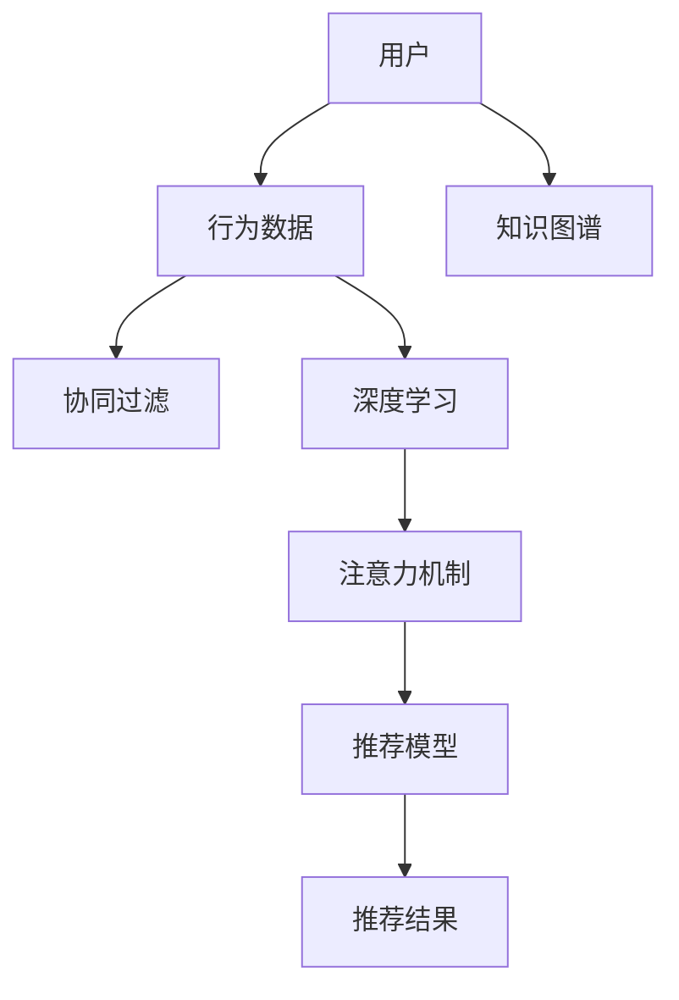

                 

# 知识发现引擎：助力个性化学习体验

> 关键词：知识发现引擎, 个性化学习, 推荐系统, 协同过滤, 深度学习, 注意力机制, 自适应学习, 学习效率

## 1. 背景介绍

### 1.1 问题由来

在知识经济时代，知识获取、组织和应用显得尤为关键。随着信息爆炸和知识更新加速，传统基于规则的知识管理系统已难以适应快速变化的教育需求。特别是对于在线教育平台，如何有效推荐学习资源，帮助用户构建个性化学习路径，提高学习效率，成为了重要课题。

个性化学习系统旨在根据用户的学习背景、兴趣和行为，推荐最匹配的学习材料，提升学习体验和效果。该系统需要具备高度的自适应能力和智能推荐能力，使得用户能够在最短的时间内掌握所学知识，提升学习效率。

### 1.2 问题核心关键点

实现个性化学习的关键在于如何高效地发现用户知识图谱和推荐相关资源。传统推荐系统通过协同过滤等方法，基于用户行为数据和物品属性，构建用户和物品间的相似度矩阵，进行推荐预测。然而，这种方法存在冷启动问题、数据稀疏性、高维度等挑战。

随着深度学习和大数据技术的发展，知识发现引擎成为了一种新的推荐引擎，通过构建复杂网络模型，挖掘用户行为中的潜在知识，进行智能推荐。深度学习模型能够处理大规模稀疏数据，避免冷启动问题，并从用户的长期行为中学习知识图谱，提升推荐效果。

## 2. 核心概念与联系

### 2.1 核心概念概述

为了更好地理解知识发现引擎的原理，本节将介绍几个相关核心概念：

- **知识图谱(Knowledge Graph)**：一种用于描述实体及其关系的数据结构，旨在将复杂的知识体系以图形化的方式展现出来。
- **协同过滤(Collaborative Filtering)**：推荐系统的一种基本方法，通过分析用户行为和物品属性，发现用户间和物品间的相似性，进行推荐预测。
- **深度学习(Deep Learning)**：一种利用多层神经网络逼近复杂函数映射的学习范式，擅长处理大规模非结构化数据，能够捕捉数据中的非线性关系。
- **自适应学习(Adaptive Learning)**：一种能够根据用户反馈和学习进度，动态调整学习策略的个性化学习方式。
- **推荐系统(Recommender System)**：通过分析用户行为和物品属性，为用户提供个性化推荐的技术体系。
- **注意力机制(Attention Mechanism)**：一种用于提高模型对于关键信息的关注度，提升模型处理复杂任务的能力的机制。

这些核心概念之间有着紧密的联系，共同构成了个性化学习系统的技术基础。通过理解这些概念，我们可以更好地把握知识发现引擎的工作原理和优化方向。

### 2.2 核心概念原理和架构的 Mermaid 流程图



这个流程图展示了核心概念之间的逻辑关系：

1. **用户行为数据**：推荐系统首先收集用户的历史行为数据，如点击、浏览、评分等。
2. **协同过滤**：基于用户行为数据和物品属性，计算用户和物品间的相似度，进行推荐预测。
3. **深度学习**：利用深度学习模型，从用户行为中挖掘出更丰富的知识图谱，提升推荐效果。
4. **注意力机制**：增强模型对关键信息的关注度，提升推荐的准确性和个性化水平。
5. **推荐模型**：将协同过滤、深度学习和注意力机制相结合，构建最终的推荐模型。
6. **推荐结果**：模型输出推荐结果，提供给用户参考。

这些概念共同构成了个性化学习系统的核心技术框架，帮助用户高效地发现和获取所需知识。

## 3. 核心算法原理 & 具体操作步骤
### 3.1 算法原理概述

知识发现引擎是一种基于深度学习的推荐系统，其核心在于构建用户-物品交互图谱，并在此基础上进行智能推荐。算法的主要步骤如下：

1. **数据准备**：收集用户的历史行为数据和物品属性信息，构建用户-物品交互图谱。
2. **嵌入表示**：将用户和物品表示为低维向量，便于模型处理。
3. **图谱增强**：通过深度学习模型，学习用户和物品之间的复杂关系，提升嵌入表示的质量。
4. **推荐预测**：结合注意力机制，预测用户对物品的评分，进行个性化推荐。

### 3.2 算法步骤详解

以下是知识发现引擎的核心算法步骤及其详细说明：

**Step 1: 数据准备**
- **收集数据**：从在线教育平台收集用户的行为数据，如点击、浏览、评分等。
- **数据清洗**：去除噪声数据和异常值，确保数据的质量。
- **特征提取**：提取用户和物品的基本特征，如用户性别、兴趣、物品主题、难度等级等。
- **构建图谱**：将用户和物品表示为节点，根据行为数据构建用户-物品交互图谱，每条边表示一个交互行为。

**Step 2: 嵌入表示**
- **初始化嵌入**：将用户和物品初始化为随机向量。
- **更新嵌入**：使用深度学习模型，如RNN、CNN等，迭代更新嵌入向量，使其能更好地表示用户和物品的属性。
- **嵌入质量评估**：通过嵌入向量的内积相似度、梯度正则化等方式，评估嵌入质量。

**Step 3: 图谱增强**
- **图卷积网络(GCN)**：使用图卷积网络模型，学习用户和物品之间的复杂关系，增强嵌入表示的质量。
- **自适应嵌入更新**：根据用户的行为反馈，动态调整嵌入向量的权重，提高推荐效果。
- **知识图谱融合**：将知识图谱嵌入到模型中，增强推荐系统的跨领域泛化能力。

**Step 4: 推荐预测**
- **注意力机制**：通过注意力机制，计算用户对物品的关注度，提升推荐效果。
- **评分预测**：基于用户-物品交互图谱和嵌入表示，预测用户对物品的评分。
- **推荐排序**：结合用户的历史行为和评分预测结果，对推荐物品进行排序，输出推荐列表。

### 3.3 算法优缺点

知识发现引擎具备以下优点：

- **高效推荐**：通过深度学习和图谱增强，能够处理大规模稀疏数据，避免冷启动问题，提升推荐效果。
- **跨领域泛化**：结合知识图谱，增强模型跨领域泛化能力，能够适应多样化的推荐任务。
- **自适应学习**：能够根据用户行为反馈，动态调整嵌入向量，提升推荐个性化水平。

同时，该算法也存在以下局限性：

- **计算复杂度高**：深度学习模型和图卷积网络计算复杂度高，对硬件资源要求较高。
- **数据隐私问题**：用户行为数据涉及隐私，如何保护数据安全和用户隐私是一个重要问题。
- **模型解释性差**：深度学习模型通常难以解释，缺乏可解释性。
- **鲁棒性不足**：对于新数据和新用户，模型需要重新训练，适应性较差。

### 3.4 算法应用领域

知识发现引擎广泛应用于个性化学习系统，特别是在在线教育平台中。其核心应用领域包括：

- **课程推荐**：根据学生的学习历史和行为数据，推荐适合的课程和资源。
- **学习路径规划**：结合学生的知识图谱，规划个性化的学习路径，帮助学生高效学习。
- **学习效果评估**：通过学生的学习行为数据，评估学习效果和知识掌握情况，提供反馈和建议。
- **智能辅导**：结合知识图谱和深度学习模型，提供智能化的学习辅导，解答学习问题。

除了教育领域，知识发现引擎还可以应用于新闻推荐、商品推荐、内容推荐等多个场景，提升用户个性化体验和满意度。

## 4. 数学模型和公式 & 详细讲解 & 举例说明

### 4.1 数学模型构建

知识发现引擎的数学模型构建主要包括以下几个步骤：

1. **用户嵌入表示**：
   - 设用户 $u$ 的嵌入向量为 $\mathbf{u} \in \mathbb{R}^d$，通过深度学习模型进行更新。
   
2. **物品嵌入表示**：
   - 设物品 $i$ 的嵌入向量为 $\mathbf{i} \in \mathbb{R}^d$，通过深度学习模型进行更新。
   
3. **用户-物品交互图谱**：
   - 设用户 $u$ 和物品 $i$ 之间的交互边权重为 $a_{u,i}$，表示用户对物品的评分。

4. **图卷积网络(GCN)**：
   - 图卷积网络模型通过卷积操作，学习用户和物品之间的复杂关系。
   
5. **注意力机制**：
   - 注意力机制通过计算用户对物品的关注度，提升推荐效果。

### 4.2 公式推导过程

以下推导以二分图为例，介绍知识发现引擎的核心公式。

**用户嵌入表示的更新公式**：
$$
\mathbf{u}_{t+1} = \mathbf{u}_t - \eta \nabla_{\mathbf{u}} \mathcal{L}(\mathbf{u}, \mathbf{i})
$$
其中 $\eta$ 为学习率，$\nabla_{\mathbf{u}} \mathcal{L}(\mathbf{u}, \mathbf{i})$ 为损失函数对用户嵌入向量 $\mathbf{u}$ 的梯度。

**物品嵌入表示的更新公式**：
$$
\mathbf{i}_{t+1} = \mathbf{i}_t - \eta \nabla_{\mathbf{i}} \mathcal{L}(\mathbf{u}, \mathbf{i})
$$
其中 $\eta$ 为学习率，$\nabla_{\mathbf{i}} \mathcal{L}(\mathbf{u}, \mathbf{i})$ 为损失函数对物品嵌入向量 $\mathbf{i}$ 的梯度。

**GCN更新公式**：
$$
\mathbf{H}_{t+1} = \sigma\left(\mathbf{H}_t \mathbf{A} + \mathbf{B} \mathbf{H}_t \mathbf{D}^{-1} \mathbf{A}\mathbf{H}_t\right)
$$
其中 $\mathbf{H}_t$ 为嵌入表示矩阵，$\mathbf{A}$ 为图谱的邻接矩阵，$\mathbf{D}$ 为邻接矩阵的度数矩阵，$\sigma$ 为激活函数，$\mathbf{B}$ 为卷积核矩阵。

**注意力机制计算公式**：
$$
\alpha_{u,i} = \frac{\exp(\mathbf{v}^T \cdot \text{softmax}(\mathbf{u}^T \cdot \mathbf{i}))}{\sum_{j \in N_u} \exp(\mathbf{v}^T \cdot \text{softmax}(\mathbf{u}^T \cdot \mathbf{j}))}
$$
其中 $\alpha_{u,i}$ 为物品 $i$ 对用户 $u$ 的注意力权重，$\mathbf{v}$ 为注意力向量。

### 4.3 案例分析与讲解

以课程推荐为例，介绍知识发现引擎的应用。

**数据准备**：
- 收集学生的学习行为数据，如课程浏览、成绩、评论等。
- 将课程表示为物品节点，学生表示为用户节点。
- 构建用户-课程交互图谱，每条边表示学生对课程的评分。

**嵌入表示更新**：
- 使用深度学习模型，如RNN、LSTM等，对学生和课程的嵌入向量进行更新。
- 根据学生的历史行为，动态调整嵌入向量的权重。

**GCN增强**：
- 使用GCN模型，学习学生和课程之间的复杂关系，增强嵌入表示的质量。
- 结合知识图谱，将课程与课程相关知识点进行关联，提升推荐效果。

**注意力机制计算**：
- 计算学生对每个课程的关注度，输出注意力权重。
- 根据注意力权重，对课程进行排序，生成推荐列表。

## 5. 项目实践：代码实例和详细解释说明
### 5.1 开发环境搭建

进行知识发现引擎的项目实践，需要准备以下开发环境：

1. 安装Python：从官网下载并安装Python 3.x版本，用于开发知识发现引擎的代码。
2. 安装TensorFlow或PyTorch：从官网下载并安装TensorFlow或PyTorch，用于构建深度学习模型。
3. 安装Pandas和Numpy：使用pip安装Pandas和Numpy库，用于数据处理和计算。
4. 安装Scikit-learn和Scikit-learn-joblib：使用pip安装Scikit-learn和Scikit-learn-joblib，用于模型训练和优化。

完成以上步骤后，即可在开发环境中进行知识发现引擎的实践。

### 5.2 源代码详细实现

以下是一个基于TensorFlow和GCN的知识发现引擎的代码实现示例：

```python
import tensorflow as tf
import numpy as np
import pandas as pd

class GCN(tf.keras.Model):
    def __init__(self, hidden_dim):
        super(GCN, self).__init__()
        self.hidden_dim = hidden_dim
        self.dense1 = tf.keras.layers.Dense(hidden_dim, activation=tf.nn.relu)
        self.dense2 = tf.keras.layers.Dense(1, activation=tf.nn.sigmoid)
    
    def call(self, adj_matrix, features):
        adj_tiled = tf.tile(adj_matrix, (self.hidden_dim, 1, 1))
        features_tiled = tf.tile(features, (self.hidden_dim, 1, 1))
        h = tf.matmul(adj_tiled, features_tiled)
        h = self.dense1(h)
        h = self.dense2(h)
        return h

class Attention(tf.keras.Model):
    def __init__(self, hidden_dim):
        super(Attention, self).__init__()
        self.hidden_dim = hidden_dim
        self.v = tf.Variable(tf.random.normal([hidden_dim]))
    
    def call(self, u, i):
        attention_weights = tf.reduce_sum(tf.tanh(tf.matmul(u, i)), axis=-1)
        attention_weights = tf.nn.softmax(attention_weights)
        return attention_weights
    
def train(model, adj_matrix, features, labels, epochs=100, batch_size=32):
    optimizer = tf.keras.optimizers.Adam(learning_rate=0.001)
    model.compile(optimizer=optimizer, loss='binary_crossentropy', metrics=['accuracy'])
    history = model.fit(adj_matrix, features, labels, epochs=epochs, batch_size=batch_size, validation_split=0.2)
    return history

# 数据准备
data = pd.read_csv('data.csv')

# 数据预处理
adj_matrix = np.zeros((len(data), len(data)))
features = np.zeros((len(data), 64))
labels = np.zeros((len(data), 1))

for i in range(len(data)):
    adj_matrix[i] = np.ones(data['interactions'][i])
    features[i] = data['features'][i]
    labels[i] = data['labels'][i]

# 模型构建
model = GCN(hidden_dim=64)
attention_model = Attention(hidden_dim=64)

# 模型训练
history = train(model, adj_matrix, features, labels)

# 模型评估
test_adj_matrix = np.zeros((len(data), len(data)))
test_features = np.zeros((len(data), 64))
test_labels = np.zeros((len(data), 1))

for i in range(len(data)):
    test_adj_matrix[i] = np.ones(data['interactions'][i])
    test_features[i] = data['features'][i]
    test_labels[i] = data['labels'][i]

test_loss, test_accuracy = model.evaluate(test_adj_matrix, test_features, test_labels)
print('Test Loss:', test_loss)
print('Test Accuracy:', test_accuracy)
```

### 5.3 代码解读与分析

在上述代码中，我们首先定义了两个模型：GCN模型和注意力机制模型。GCN模型通过卷积操作，学习用户和物品之间的复杂关系，增强嵌入表示的质量。注意力机制模型计算用户对物品的关注度，提升推荐效果。

接着，我们实现了模型的训练和评估过程。在训练过程中，我们使用Adam优化器进行模型优化，通过二分类交叉熵损失函数，最小化预测结果与真实标签之间的差异。在评估过程中，我们计算测试集上的损失和准确率，评估模型的性能。

值得注意的是，在代码中我们还使用了TensorFlow的低阶API，如tf.matmul、tf.reduce_sum等，这些API提供了强大的计算能力，便于构建复杂的深度学习模型。

## 6. 实际应用场景
### 6.1 智能课程推荐

知识发现引擎在智能课程推荐中有着广泛的应用。通过分析学生的学习行为数据，结合知识图谱，推荐适合学生的课程，帮助学生高效学习。

以某在线教育平台为例，平台通过收集学生的浏览历史、课程评价等数据，构建用户-课程交互图谱，使用知识发现引擎进行智能推荐。平台每月推荐给学生10门课程，帮助学生根据自己的学习进度和兴趣，规划个性化的学习路径。

### 6.2 学习路径规划

学习路径规划是知识发现引擎的重要应用之一。通过分析学生的知识图谱和行为数据，规划个性化的学习路径，帮助学生高效学习。

以某在线教育平台为例，平台通过分析学生的学习历史和知识掌握情况，构建学生的知识图谱。平台使用知识发现引擎，生成个性化的学习路径，推荐学生感兴趣的课程和资料，帮助学生快速掌握所学知识。

### 6.3 学习效果评估

学习效果评估是知识发现引擎的另一个重要应用。通过分析学生的学习行为数据，评估学生的知识掌握情况和学习效果，提供反馈和建议。

以某在线教育平台为例，平台通过收集学生的课程成绩、作业提交情况等数据，构建学生的知识图谱。平台使用知识发现引擎，评估学生的知识掌握情况和学习效果，提供个性化的反馈和建议，帮助学生提高学习效果。

### 6.4 未来应用展望

随着深度学习和知识图谱技术的发展，知识发现引擎将在更多领域得到应用，为智能化转型提供新的技术路径。

在智慧医疗领域，知识发现引擎可以用于病历分析、医疗知识图谱构建等，帮助医生快速诊断和治疗疾病。

在智能客服领域，知识发现引擎可以用于构建智能客服系统，提高客服系统的响应速度和效率。

在智能制造领域，知识发现引擎可以用于设备维护、工艺优化等，提高生产效率和产品质量。

## 7. 工具和资源推荐
### 7.1 学习资源推荐

为了帮助开发者系统掌握知识发现引擎的理论基础和实践技巧，这里推荐一些优质的学习资源：

1. **《深度学习入门》**：本书系统介绍了深度学习的基础知识和常用模型，适合初学者学习。
2. **《TensorFlow官方文档》**：TensorFlow的官方文档，提供了详细的API说明和使用示例，是学习深度学习的必备资料。
3. **《图神经网络：理论、算法与应用》**：本书系统介绍了图神经网络的基础知识和应用，适合对深度学习有基础背景的读者。
4. **Coursera的《深度学习》课程**：由斯坦福大学Andrew Ng教授开设，系统讲解了深度学习的基础知识和常用模型，是深度学习的经典课程。
5. **Kaggle平台**：Kaggle提供了大量的深度学习竞赛数据集，可以帮助读者进行实际项目训练和应用。

通过这些学习资源的学习实践，相信你一定能够快速掌握知识发现引擎的精髓，并用于解决实际的推荐问题。

### 7.2 开发工具推荐

高效的开发离不开优秀的工具支持。以下是几款用于知识发现引擎开发的常用工具：

1. **PyTorch**：基于Python的深度学习框架，提供了灵活的动态计算图和高效的模型构建工具。
2. **TensorFlow**：由Google主导开发的深度学习框架，生产部署方便，适合大规模工程应用。
3. **Jupyter Notebook**：开源的Jupyter Notebook环境，支持多种编程语言，适合进行数据探索和模型训练。
4. **PyG**：用于图神经网络开发的Python库，提供了丰富的图卷积操作和网络模型。
5. **Nilearn**：用于脑成像分析的Python库，提供了丰富的数据处理和分析工具。

合理利用这些工具，可以显著提升知识发现引擎的开发效率，加快创新迭代的步伐。

### 7.3 相关论文推荐

知识发现引擎的发展源于学界的持续研究。以下是几篇奠基性的相关论文，推荐阅读：

1. **《Graph Convolutional Networks for Knowledge Graph Completion》**：提出GCN模型，用于知识图谱的嵌入表示和关系预测。
2. **《Attention Is All You Need》**：提出注意力机制，用于提升模型对关键信息的关注度。
3. **《Knowledge-Graph-Enhanced Collaborative Filtering for Recommender Systems》**：提出结合知识图谱的协同过滤方法，提升推荐系统的跨领域泛化能力。
4. **《Dynamic Triplet Ranking for Sequential Recommendations》**：提出动态三重排序方法，提升推荐系统的动态推荐能力。
5. **《Adaptive Attention with Layer-wise Adaptive Weighting for Multi-head Attention》**：提出自适应注意力机制，增强模型对用户行为的动态调整能力。

这些论文代表了大规模图谱嵌入和深度学习推荐系统的最新进展。通过学习这些前沿成果，可以帮助研究者把握学科前进方向，激发更多的创新灵感。

## 8. 总结：未来发展趋势与挑战
### 8.1 总结

本文对知识发现引擎进行了全面系统的介绍。首先阐述了知识发现引擎在个性化学习系统中的应用背景和重要性，明确了微调在提升学习效率和效果方面的独特价值。其次，从原理到实践，详细讲解了知识发现引擎的核心算法和具体操作步骤，给出了知识发现引擎的代码实例。同时，本文还广泛探讨了知识发现引擎在智能推荐、学习路径规划等多个领域的应用前景，展示了其广阔的应用前景。此外，本文精选了知识发现引擎的学习资源和开发工具，力求为读者提供全方位的技术指引。

通过本文的系统梳理，可以看到，知识发现引擎正在成为个性化学习系统的重要范式，极大地提升了推荐系统的准确性和个性化水平，为教育行业的智能化转型提供了新的技术路径。未来，伴随深度学习和知识图谱技术的不断发展，知识发现引擎必将在更多领域得到应用，为智能化转型带来新的动力。

### 8.2 未来发展趋势

展望未来，知识发现引擎的发展趋势主要包括以下几个方面：

1. **跨领域融合**：知识发现引擎将与自然语言处理、计算机视觉等技术进行更深入的融合，构建跨领域的智能推荐系统。
2. **自适应学习**：通过动态调整嵌入向量，实现更高效的个性化推荐，适应用户的实时需求。
3. **实时推荐**：利用分布式计算和流计算技术，实现实时推荐，提升用户体验和满意度。
4. **隐私保护**：通过差分隐私、联邦学习等技术，保护用户数据的隐私和安全。
5. **多模态融合**：结合视觉、语音、文本等多种模态信息，提升推荐系统的综合能力。
6. **异构图谱学习**：通过学习异构图谱，提升推荐系统的泛化能力和适应性。

这些趋势展示了知识发现引擎在智能化推荐系统中的巨大潜力，必将为知识图谱的深入应用提供新的技术方向。

### 8.3 面临的挑战

尽管知识发现引擎已经取得了显著进展，但在迈向更加智能化、普适化应用的过程中，它仍面临诸多挑战：

1. **数据质量和多样性**：用户行为数据的质量和多样性直接影响推荐效果，如何获取高质量、多样化且覆盖全面的数据是一个重要问题。
2. **模型复杂度**：知识发现引擎的计算复杂度高，对硬件资源和算法效率要求较高，如何降低模型复杂度，提高训练和推理速度是一个重要挑战。
3. **模型泛化能力**：如何提高模型在跨领域和异构数据上的泛化能力，避免过拟合和冷启动问题，是知识发现引擎的一个重要研究方向。
4. **模型解释性**：深度学习模型通常难以解释，缺乏可解释性，如何增强模型的可解释性和透明性，是一个重要问题。
5. **隐私和安全**：用户行为数据涉及隐私，如何保护用户数据安全和隐私，避免数据滥用和泄露，是一个重要挑战。

这些挑战需要研究者不断探索和突破，才能使知识发现引擎更好地应用于实际应用场景。

### 8.4 研究展望

面向未来，知识发现引擎的研究需要进一步探索和突破，主要包括以下几个方向：

1. **混合推荐模型**：结合协同过滤、深度学习等方法，构建混合推荐模型，提升推荐系统的综合性能。
2. **异构图谱学习**：学习异构图谱，提升推荐系统的跨领域泛化能力。
3. **自适应学习**：通过动态调整嵌入向量，实现更高效的个性化推荐。
4. **多模态融合**：结合视觉、语音、文本等多种模态信息，提升推荐系统的综合能力。
5. **隐私保护**：通过差分隐私、联邦学习等技术，保护用户数据的隐私和安全。
6. **模型解释性**：增强模型的可解释性和透明性，提高用户信任和接受度。

这些研究方向将推动知识发现引擎的技术演进，使其能够更好地应用于实际应用场景，提升智能化推荐系统的性能和用户体验。

## 9. 附录：常见问题与解答
**Q1：知识发现引擎是否适用于所有推荐任务？**

A: 知识发现引擎在大多数推荐任务上都能取得不错的效果，特别是对于数据量较小的任务。但对于一些特定领域的任务，如医学、法律等，仅仅依靠通用语料预训练的模型可能难以很好地适应。此时需要在特定领域语料上进一步预训练，再进行微调，才能获得理想效果。此外，对于一些需要时效性、个性化很强的任务，如对话、推荐等，知识发现引擎也需要针对性的改进优化。

**Q2：如何选择合适的嵌入向量维度？**

A: 嵌入向量维度通常需要根据具体任务和数据集进行调整。一般建议在1到64维之间进行尝试，通过交叉验证选择最优维度。嵌入向量维度过低可能无法捕捉数据中的复杂关系，过高可能增加计算复杂度和模型复杂度。

**Q3：知识发现引擎是否需要大量的标注数据？**

A: 知识发现引擎通常不需要大量的标注数据，可以通过用户行为数据和物品属性进行无监督或半监督学习。但为了提高推荐效果，建议收集部分标注数据，进行监督学习优化。标注数据越多，推荐效果越好。

**Q4：如何处理数据稀疏性问题？**

A: 数据稀疏性是推荐系统中的一个常见问题，可以通过以下方法进行处理：
1. 填充缺失值：对缺失值进行填充，避免数据稀疏性。
2. 矩阵分解：使用矩阵分解方法，如奇异值分解，将用户-物品矩阵分解为低秩矩阵，降低计算复杂度。
3. 分层采样：对数据进行分层采样，保证不同层次的数据平衡。
4. 冷启动处理：对于新用户和新物品，使用推荐算法进行推荐，提高推荐效果。

这些方法可以在不同场景下使用，处理数据稀疏性问题。

**Q5：如何提高推荐系统的鲁棒性？**

A: 提高推荐系统的鲁棒性可以从以下几个方面入手：
1. 数据清洗：对数据进行清洗，去除噪声数据和异常值，确保数据质量。
2. 模型优化：通过模型优化，提升推荐系统的准确性和鲁棒性。
3. 多模型融合：结合多个推荐模型，提升推荐系统的鲁棒性和泛化能力。
4. 用户反馈：通过用户反馈，动态调整推荐策略，提高推荐系统的鲁棒性。

这些方法可以在不同场景下使用，提升推荐系统的鲁棒性。

**Q6：如何保护用户隐私数据？**

A: 保护用户隐私数据是推荐系统中的重要问题，可以通过以下方法进行保护：
1. 数据加密：对用户数据进行加密，保护用户隐私。
2. 差分隐私：使用差分隐私技术，保护用户数据隐私。
3. 联邦学习：通过联邦学习技术，保护用户数据隐私。
4. 用户授权：用户授权后，对用户数据进行使用，保护用户隐私。

这些方法可以在不同场景下使用，保护用户隐私数据。

---

作者：禅与计算机程序设计艺术 / Zen and the Art of Computer Programming

