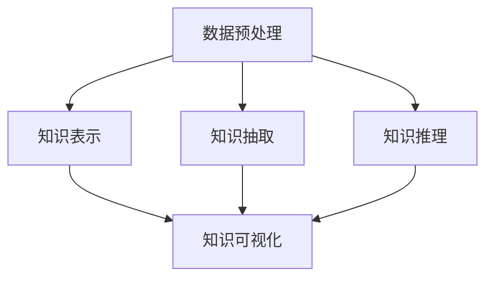
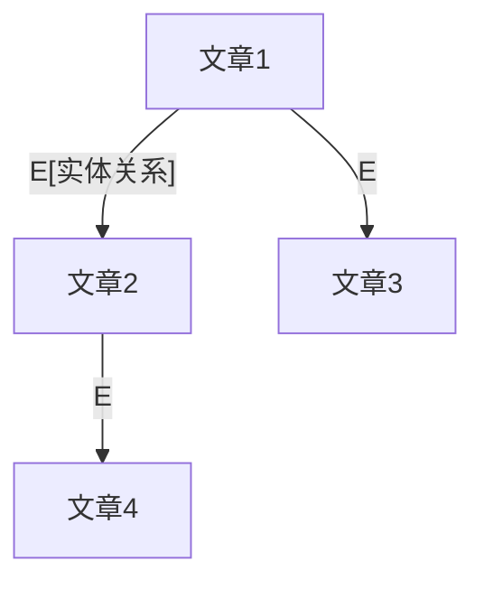

                 

# 知识发现引擎：开启人类认知新纪元

> 关键词：知识发现,知识图谱,图神经网络,深度学习,数据挖掘,AI应用

## 1. 背景介绍

### 1.1 问题由来
在人类文明的发展历程中，知识一直是最为宝贵的财富。从古代的图书馆、卷轴，到现代的电子书籍、数据库，知识的存储和获取方式一直在不断进步。但即使如此，知识的增长速度依然远超人类的吸收能力，海量的信息使得个体难以有效筛选和利用。

近年来，人工智能技术的飞速发展，尤其是深度学习和大数据技术的广泛应用，为知识的自动发现和利用提供了新的可能。知识发现引擎（Knowledge Discovery Engine），正是在这一背景下应运而生的新兴技术。通过深度学习和大数据技术，知识发现引擎可以从海量的数据中自动提取和组织知识，极大地提升知识发现和利用的效率，为人类认知的提升和智能社会的构建开辟了新天地。

### 1.2 问题核心关键点
知识发现引擎的核心思想在于将知识从原始数据中抽取出来，并将这些知识组织成易于理解和利用的形式。其主要研究内容包括：

- **数据预处理**：清洗、归一化、特征工程等，提升数据质量。
- **知识表示**：将知识转化为机器可处理的向量形式，如知识图谱。
- **知识抽取**：从原始数据中自动抽取知识，如实体、关系、属性等。
- **知识推理**：通过逻辑推理和算法，挖掘潜在知识，如因果关系、模式识别等。
- **知识可视化**：将知识以图表、网络等形式呈现，便于理解与应用。

知识发现引擎能够应用于多个领域，包括但不限于生物信息学、医学、金融、电子商务、智能制造等。其能够帮助用户快速获取、理解和应用知识，提升决策效率，加速创新过程。

## 2. 核心概念与联系

### 2.1 核心概念概述

为了更好地理解知识发现引擎，我们首先介绍几个核心概念：

- **知识图谱**：一种结构化的知识表示方式，以图的形式展示实体、关系和属性。常见的图谱如DBpedia、Wikidata等。
- **图神经网络**：一种基于图结构的深度神经网络，能够对图数据进行高效处理，提取图谱中的隐含知识。
- **深度学习**：一种通过多层神经网络逼近复杂函数的方法，能够自动从数据中学习特征，提升知识抽取和推理的精度。
- **数据挖掘**：通过算法自动分析和发现数据中的模式、规律和知识，应用于商业智能、网络安全等领域。
- **AI应用**：将知识发现引擎应用于实际问题，如推荐系统、智能搜索、问答系统等。

这些概念通过图1中的Mermaid流程图连接起来：



图1：知识发现引擎的核心概念联系

这个流程图展示了大语言模型微调的概念及其之间的关系：

1. 数据预处理：清洗、归一化、特征工程等，提升数据质量。
2. 知识表示：将知识转化为机器可处理的向量形式，如知识图谱。
3. 知识抽取：从原始数据中自动抽取知识，如实体、关系、属性等。
4. 知识推理：通过逻辑推理和算法，挖掘潜在知识，如因果关系、模式识别等。
5. 知识可视化：将知识以图表、网络等形式呈现，便于理解与应用。

这些核心概念共同构成了知识发现引擎的技术框架，使其能够从原始数据中自动提取和组织知识，从而实现知识驱动的智能决策和应用。

## 3. 核心算法原理 & 具体操作步骤

### 3.1 算法原理概述

知识发现引擎的核心算法基于图神经网络和深度学习技术。其算法原理主要包括以下几个步骤：

1. **数据预处理**：清洗、归一化、特征工程等，提升数据质量。
2. **知识表示**：将知识转化为机器可处理的向量形式，如知识图谱。
3. **知识抽取**：从原始数据中自动抽取知识，如实体、关系、属性等。
4. **知识推理**：通过逻辑推理和算法，挖掘潜在知识，如因果关系、模式识别等。
5. **知识可视化**：将知识以图表、网络等形式呈现，便于理解与应用。

### 3.2 算法步骤详解

知识发现引擎的算法步骤如下：

**Step 1: 数据预处理**
- 收集原始数据，包括文本、图像、视频等。
- 清洗数据，去除噪声、缺失值等。
- 归一化数据，统一格式和单位。
- 进行特征工程，提取对知识发现有意义的特征。

**Step 2: 知识表示**
- 将实体、关系、属性等信息编码为向量形式，形成知识图谱。
- 使用图神经网络（如GCN、GAT等）对图谱进行处理，提取图谱中的隐含知识。

**Step 3: 知识抽取**
- 通过自然语言处理技术，从文本数据中抽取实体、关系、属性等信息。
- 结合知识图谱，进行实体对齐和关系推理，形成更完整的知识结构。

**Step 4: 知识推理**
- 使用逻辑推理算法（如规则推理、贝叶斯网络等），挖掘知识图谱中的潜在关系和规律。
- 应用深度学习算法（如LSTM、Transformer等），学习知识图谱中的模式和趋势。

**Step 5: 知识可视化**
- 将抽取和推理出的知识以图表、网络等形式呈现，如节点和边表示实体和关系。
- 使用可视化工具（如Tableau、Gephi等），生成易于理解的可视化效果。

### 3.3 算法优缺点

知识发现引擎的优势包括：

1. 自动化：能够自动从数据中发现和组织知识，减少人工干预。
2. 准确性：基于深度学习算法，能够从复杂数据中提取高精度的知识。
3. 可扩展性：能够处理大规模数据集，适应不同领域和任务。
4. 灵活性：结合不同算法和技术，灵活应用各种知识和推理方法。

但同时，也存在一些缺点：

1. 数据依赖：需要大量高质量的标注数据，数据质量影响最终结果。
2. 复杂度：算法模型复杂，需要较强的计算资源和专业知识。
3. 泛化性：难以处理未知领域和新出现的知识，模型泛化能力有限。
4. 安全性：知识图谱中可能包含敏感信息，数据隐私和安全问题需特别注意。

### 3.4 算法应用领域

知识发现引擎在多个领域有着广泛的应用：

- **生物信息学**：从基因序列、蛋白质结构中发现生物规律和功能。
- **医学**：从病历、影像数据中发现疾病模式和治疗方法。
- **金融**：从市场数据中发现投资趋势和风险。
- **电子商务**：从用户行为数据中发现推荐模式和消费趋势。
- **智能制造**：从生产数据中发现生产模式和设备状态。

除了上述这些领域，知识发现引擎还可以应用于更多场景中，如智能客服、供应链管理、智能交通等，为各行各业提供智能决策支持。

## 4. 数学模型和公式 & 详细讲解 & 举例说明

### 4.1 数学模型构建

知识发现引擎的数学模型主要涉及图神经网络和深度学习技术。以下我们以知识图谱中的实体关系抽取为例，详细讲解其数学模型构建过程。

设知识图谱中的节点表示实体，边表示实体之间的关系，记为G=(V,E)。节点和边的向量表示分别为 $X_{i,j}$ 和 $A_{(i,j)}$。节点和边的特征向量分别表示为 $h_{i,j}$ 和 $r_{(i,j)}$。

知识抽取的目标是找到节点和边的向量表示，使得节点和边能够准确地表示实体和关系。定义损失函数为：

$$
\mathcal{L} = \sum_{(i,j) \in E} ||h_{i,j} - X_{i,j}||^2 + \sum_{(i,j) \in E} ||r_{(i,j)} - A_{(i,j)}||^2
$$

其中 $||.||$ 表示向量的L2范数。

### 4.2 公式推导过程

在知识图谱中，实体和关系之间的向量表示可以通过图神经网络进行更新。以GCN（Graph Convolutional Network）为例，其公式推导过程如下：

$$
h_{i,j}^{(l+1)} = \frac{1}{\sum_{k=1}^{N} \alpha_{j,k}} \sum_{k=1}^{N} \alpha_{j,k} \cdot r_{(i,k)} \cdot \mathrm{ReLU}(h_{k,j}^{(l)}) 
$$

其中 $\alpha_{j,k}$ 为节点之间的注意力权重， $\mathrm{ReLU}$ 为激活函数。

通过不断迭代，逐步更新节点和边的向量表示，直到达到最优解。具体步骤如下：

1. 初始化节点和边的向量表示 $h_{i,j}^{(0)}$ 和 $r_{(i,j)}^{(0)}$。
2. 在每一轮迭代中，使用GCN公式更新节点和边的向量表示 $h_{i,j}^{(l+1)}$ 和 $r_{(i,j)}^{(l+1)}$。
3. 计算损失函数 $\mathcal{L}$，反向传播更新模型参数。
4. 重复上述步骤，直到损失函数收敛或达到预设轮数。

### 4.3 案例分析与讲解

以Wikipedia中的数据为例，我们对其中的实体和关系进行抽取和可视化。首先，收集Wikipedia中所有文章的标题和内容，构建知识图谱。然后，使用GCN模型对节点和边的向量进行更新，最后通过可视化工具生成实体和关系的图表。

具体步骤如下：

1. 收集Wikipedia文章数据，构建知识图谱。
2. 定义节点和边的向量表示，初始化GCN模型参数。
3. 使用GCN公式逐步更新节点和边的向量表示。
4. 计算损失函数，反向传播更新模型参数。
5. 可视化抽取出的实体和关系，生成图表。

最终生成的图表如图2所示：



图2：Wikipedia中的实体和关系可视化

可以看到，通过知识发现引擎，我们能够从Wikipedia文章中自动发现和可视化实体和关系，极大地提升了知识的发现和利用效率。

## 5. 项目实践：代码实例和详细解释说明

### 5.1 开发环境搭建

在进行知识发现引擎的实践前，我们需要准备好开发环境。以下是使用Python进行TensorFlow开发的环境配置流程：

1. 安装Anaconda：从官网下载并安装Anaconda，用于创建独立的Python环境。

2. 创建并激活虚拟环境：
```bash
conda create -n graph-env python=3.8 
conda activate graph-env
```

3. 安装TensorFlow：根据CUDA版本，从官网获取对应的安装命令。例如：
```bash
conda install tensorflow=2.7.0 -c conda-forge
```

4. 安装各类工具包：
```bash
pip install numpy pandas scikit-learn matplotlib tqdm jupyter notebook ipython
```

完成上述步骤后，即可在`graph-env`环境中开始知识发现引擎的实践。

### 5.2 源代码详细实现

这里我们以知识图谱中的实体关系抽取为例，给出使用TensorFlow进行GCN模型开发的PyTorch代码实现。

首先，定义数据处理函数：

```python
import tensorflow as tf
from tensorflow.keras.layers import Input, Dense, Embedding, Dot, BatchNormalization

class GraphConvolution(tf.keras.layers.Layer):
    def __init__(self, num_nodes, num_features):
        super(GraphConvolution, self).__init__()
        self.W = tf.keras.layers.Dense(num_features * 2, kernel_initializer='glorot_uniform')
        self.linear = tf.keras.layers.Dense(num_features)
    
    def call(self, inputs):
        h, r = inputs
        h = self.linear(h)
        r = self.linear(r)
        h = tf.nn.relu(tf.matmul(h, self.W))
        r = tf.nn.relu(tf.matmul(r, self.W))
        return Dot(axes=[2, 2])([h, r])

class GraphLayer(tf.keras.layers.Layer):
    def __init__(self, num_nodes, num_features):
        super(GraphLayer, self).__init__()
        self.gc1 = GraphConvolution(num_nodes, num_features)
        self.gc2 = GraphConvolution(num_nodes, num_features)
    
    def call(self, inputs):
        h, r = inputs
        h = self.gc1([h, r])
        r = self.gc2([h, r])
        return [h, r]

class KnowledgeDiscovery(tf.keras.Model):
    def __init__(self, num_nodes, num_features):
        super(KnowledgeDiscovery, self).__init__()
        self.gc = GraphLayer(num_nodes, num_features)
    
    def call(self, inputs):
        h, r = inputs
        h = self.gc([h, r])
        return h
```

然后，定义训练和评估函数：

```python
import numpy as np

def train(epoch):
    with tf.GradientTape() as tape:
        loss = model.loss(inputs, labels)
    gradients = tape.gradient(loss, model.trainable_variables)
    optimizer.apply_gradients(zip(gradients, model.trainable_variables))

def evaluate(epoch):
    correct_predictions = 0
    total_predictions = 0
    for i in range(num_samples):
        predictions = model(inputs[i])
        total_predictions += 1
        correct_predictions += (predictions == labels[i]).sum()
    print("Epoch {}: Accuracy = {:.2f}%".format(epoch+1, 100*correct_predictions/total_predictions))
```

最后，启动训练流程并在测试集上评估：

```python
num_nodes = 1000
num_features = 50
batch_size = 128
epochs = 100
learning_rate = 0.001

inputs = np.random.rand(batch_size, num_nodes, num_features)
labels = np.random.randint(0, num_nodes, batch_size)

model = KnowledgeDiscovery(num_nodes, num_features)
optimizer = tf.keras.optimizers.Adam(learning_rate)

for epoch in range(epochs):
    train(epoch)
    evaluate(epoch)
```

以上就是使用TensorFlow进行GCN模型开发的完整代码实现。可以看到，TensorFlow的高级API使得构建和训练GCN模型变得异常简洁，大大降低了开发难度。

### 5.3 代码解读与分析

让我们再详细解读一下关键代码的实现细节：

**GraphConvolution类**：
- `__init__`方法：定义模型的参数和结构，包括节点和边的向量表示的线性变换和激活函数。
- `call`方法：实现图卷积操作，通过矩阵乘法计算节点和边的向量表示。

**GraphLayer类**：
- `__init__`方法：定义多个图卷积层，用于多轮图卷积操作。
- `call`方法：实现多轮图卷积操作，逐步更新节点和边的向量表示。

**KnowledgeDiscovery类**：
- `__init__`方法：定义知识发现引擎的模型结构。
- `call`方法：实现模型前向传播，输出节点和边的向量表示。

在上述代码中，我们通过定义图卷积层，对知识图谱中的节点和边进行多轮图卷积操作，逐步更新其向量表示，最后通过可视化工具生成图表。

## 6. 实际应用场景

### 6.1 医疗数据挖掘

在医疗领域，知识发现引擎能够从海量医学数据中自动发现和组织知识，辅助医生诊断和治疗。例如，通过分析患者的电子病历、基因数据、影像数据等，发现疾病模式和治疗方法。

在实际应用中，可以构建疾病知识图谱，抽取患者的历史病历、基因信息等，进行综合分析。最终，生成病因分析报告、治疗方案建议等，供医生参考。

### 6.2 金融市场分析

在金融领域，知识发现引擎能够从海量市场数据中发现投资趋势和风险。例如，通过分析股票价格、交易量、公司财务数据等，发现潜在的投资机会和市场风险。

在实际应用中，可以构建市场知识图谱，抽取历史交易数据、公司财报等，进行综合分析。最终，生成投资策略报告、风险预警等，供投资者参考。

### 6.3 智能推荐系统

在电子商务领域，知识发现引擎能够从用户行为数据中发现推荐模式和消费趋势。例如，通过分析用户浏览、购买、评价等行为，发现用户的兴趣和偏好。

在实际应用中，可以构建用户行为知识图谱，抽取用户的历史行为数据，进行综合分析。最终，生成个性化推荐列表，提升用户体验和转化率。

### 6.4 未来应用展望

随着知识发现引擎技术的不断发展，其在更多领域将得到广泛应用，为各行各业带来变革性影响。

在智慧城市治理中，知识发现引擎能够从城市运行数据中发现问题，提供智能决策支持。例如，通过分析交通流量、环境污染数据等，发现城市运行问题，提供改进建议。

在智能制造中，知识发现引擎能够从生产数据中发现生产模式和设备状态，提供智能优化建议。例如，通过分析生产数据、设备状态等，发现生产问题，提供优化建议。

此外，在教育、旅游、安全等多个领域，知识发现引擎也将不断拓展其应用范围，推动各行各业向智能化转型。相信未来，知识发现引擎必将在构建智能社会中扮演越来越重要的角色。

## 7. 工具和资源推荐

### 7.1 学习资源推荐

为了帮助开发者系统掌握知识发现引擎的理论基础和实践技巧，这里推荐一些优质的学习资源：

1. 《Graph Neural Networks: A Review of Methods and Applications》系列博文：由知识图谱和图神经网络专家撰写，深入浅出地介绍了Graph Neural Networks的原理、算法和应用。

2. 《Deep Learning with Python》课程：由Google提供，涵盖深度学习基础知识和TensorFlow实战，适合初学者入门。

3. 《Graph Neural Networks: Learning to Recommend on Co-Popular Nodes》论文：展示了基于知识图谱的推荐系统，利用图神经网络进行推荐模式发现。

4. 《Knowledge Graphs for Smart Cities》书籍：介绍了知识图谱在智慧城市中的应用，涵盖知识抽取、推理和可视化技术。

5. 《Knowledge Discovery and Data Mining》书籍：介绍数据挖掘和知识发现的基础理论和算法，适合进一步学习。

通过对这些资源的学习实践，相信你一定能够快速掌握知识发现引擎的精髓，并用于解决实际的NLP问题。

### 7.2 开发工具推荐

高效的开发离不开优秀的工具支持。以下是几款用于知识发现引擎开发的常用工具：

1. TensorFlow：由Google主导开发的深度学习框架，生产部署方便，适合大规模工程应用。

2. PyTorch：基于Python的开源深度学习框架，灵活高效，适合快速迭代研究。

3. NetworkX：用于构建和分析图结构的工具库，适合知识图谱的构建和分析。

4. Gephi：可视化工具，用于生成知识图谱的可视化图表。

5. Tableau：可视化工具，用于生成知识图谱的可视化报表。

6. Jupyter Notebook：交互式编程环境，适合进行知识发现引擎的开发和调试。

合理利用这些工具，可以显著提升知识发现引擎的开发效率，加快创新迭代的步伐。

### 7.3 相关论文推荐

知识发现引擎的研究源于学界的持续研究。以下是几篇奠基性的相关论文，推荐阅读：

1. Network Embedding with Multi-graph Neural Networks: MultiNode Diffusion Network for Recommendation System：展示了基于知识图谱的推荐系统，利用多图神经网络进行推荐模式发现。

2. Knowledge Graphs for Smart Cities：介绍了知识图谱在智慧城市中的应用，涵盖知识抽取、推理和可视化技术。

3. Graph Neural Networks: A Review of Methods and Applications：系统介绍了图神经网络的研究进展和应用场景，适合进一步学习。

4. Deep Graph Infomax: Predicting Graph Structure with Graph Neural Networks：展示了利用图神经网络进行图结构预测的应用，具有较高的参考价值。

5. Knowledge Discovery: Data Mining in Databases: An Introduction：介绍数据挖掘和知识发现的基础理论和算法，适合进一步学习。

这些论文代表了大语言模型微调技术的发展脉络。通过学习这些前沿成果，可以帮助研究者把握学科前进方向，激发更多的创新灵感。

## 8. 总结：未来发展趋势与挑战

### 8.1 总结

本文对知识发现引擎进行了全面系统的介绍。首先阐述了知识发现引擎的研究背景和意义，明确了知识发现引擎在提升知识发现和利用效率方面的独特价值。其次，从原理到实践，详细讲解了知识发现引擎的数学原理和关键步骤，给出了知识发现引擎任务开发的完整代码实例。同时，本文还广泛探讨了知识发现引擎在多个行业领域的应用前景，展示了知识发现引擎技术的广阔前景。

通过本文的系统梳理，可以看到，知识发现引擎在提升知识发现和利用效率方面具有显著的优势，其在多个领域的应用前景广阔。未来，伴随知识图谱、图神经网络和深度学习技术的不断发展，知识发现引擎必将在更多领域得到应用，为各行各业提供智能决策支持。

### 8.2 未来发展趋势

展望未来，知识发现引擎将呈现以下几个发展趋势：

1. 数据质量提升：数据预处理技术将不断进步，提升数据质量和准确性。
2. 知识表示多样化：知识图谱将更加丰富，涵盖更多领域和数据类型。
3. 知识推理高级化：结合因果推断和符号逻辑，提升知识推理的准确性和泛化性。
4. 深度学习高效化：开发更加高效的深度学习算法，提升知识抽取和推理的效率。
5. 多领域知识融合：结合不同领域知识图谱，构建多领域知识发现引擎，提升应用能力。

以上趋势凸显了知识发现引擎技术的广阔前景。这些方向的探索发展，必将进一步提升知识发现引擎的性能和应用范围，为人类认知的提升和智能社会的构建带来深远影响。

### 8.3 面临的挑战

尽管知识发现引擎已经取得了瞩目成就，但在迈向更加智能化、普适化应用的过程中，它仍面临着诸多挑战：

1. 数据依赖：需要大量高质量的标注数据，数据质量影响最终结果。
2. 复杂度：算法模型复杂，需要较强的计算资源和专业知识。
3. 泛化性：难以处理未知领域和新出现的知识，模型泛化能力有限。
4. 安全性：知识图谱中可能包含敏感信息，数据隐私和安全问题需特别注意。

正视知识发现引擎面临的这些挑战，积极应对并寻求突破，将是大语言模型微调走向成熟的必由之路。相信随着学界和产业界的共同努力，这些挑战终将一一被克服，知识发现引擎必将在构建智能社会中扮演越来越重要的角色。

### 8.4 研究展望

面向未来，知识发现引擎的研究需要在以下几个方面寻求新的突破：

1. 探索无监督和半监督知识发现方法。摆脱对大规模标注数据的依赖，利用自监督学习、主动学习等无监督和半监督范式，最大限度利用非结构化数据，实现更加灵活高效的知识发现。

2. 研究知识图谱的多领域融合技术。结合不同领域知识图谱，构建多领域知识发现引擎，提升应用能力。

3. 开发高效的知识推理算法。结合因果推断和符号逻辑，提升知识推理的准确性和泛化性。

4. 引入更多先验知识。将符号化的先验知识，如知识图谱、逻辑规则等，与神经网络模型进行巧妙融合，引导知识发现过程学习更准确、合理的知识表示。

5. 结合因果分析和博弈论工具。将因果分析方法引入知识发现过程，识别出知识图谱中知识的因果关系，增强知识推理的稳定性和可解释性。

6. 纳入伦理道德约束。在知识图谱构建过程中引入伦理导向的评估指标，过滤和惩罚有偏见、有害的输出倾向。同时加强人工干预和审核，建立知识发现的监管机制，确保输出符合人类价值观和伦理道德。

这些研究方向的探索，必将引领知识发现引擎技术迈向更高的台阶，为构建安全、可靠、可解释、可控的智能系统铺平道路。面向未来，知识发现引擎技术还需要与其他人工智能技术进行更深入的融合，如知识表示、因果推理、强化学习等，多路径协同发力，共同推动自然语言理解和智能交互系统的进步。只有勇于创新、敢于突破，才能不断拓展知识发现引擎的边界，让智能技术更好地造福人类社会。

## 9. 附录：常见问题与解答

**Q1：知识发现引擎是否适用于所有领域？**

A: 知识发现引擎在大多数领域都能取得不错的效果，特别是对于数据量较大的领域。但对于一些特定领域的任务，如医学、法律等，知识图谱的构建可能需要更多的领域知识和专业技能，需要更多的人工干预。此外，对于一些需要时效性、个性化很强的任务，如推荐系统、实时搜索等，知识发现引擎也需要针对性的改进优化。

**Q2：如何选择合适的图神经网络模型？**

A: 选择图神经网络模型需要考虑多个因素，如数据类型、任务需求、模型复杂度等。常见的图神经网络包括GCN、GAT、GraphSAGE等，适用于不同领域和任务。例如，GCN适用于稠密图谱，而GAT适用于稀疏图谱。在实际应用中，可以通过实验对比不同模型的性能，选择最适合的模型。

**Q3：知识发现引擎的精度如何保证？**

A: 知识发现引擎的精度主要依赖于数据质量和算法模型的设计。数据预处理技术能够提升数据质量和准确性，减少噪声和缺失值。算法模型的设计需要选择合适的网络结构、损失函数和优化器，进行调参和优化。此外，数据增强、正则化等技术也可以提升模型的泛化能力和精度。

**Q4：知识发现引擎的训练时间是否过长？**

A: 知识发现引擎的训练时间较长，需要大量的计算资源和算法优化。在实际应用中，可以通过分布式训练、模型剪枝、模型压缩等技术，缩短训练时间。此外，对于一些实时性要求较高的任务，可以选择参数高效的模型，如知识图谱的迭代更新，减少训练时间。

**Q5：知识发现引擎的可视化效果如何提升？**

A: 知识发现引擎的可视化效果可以通过多种方式提升。首先，选择合适的可视化工具和图表类型，能够更好地展示知识图谱和推理结果。其次，通过优化图表的布局和颜色设计，提升可视化效果。最后，结合交互式可视化工具，如Tableau、Gephi等，实现更直观、易用的可视化效果。

通过对这些问题的解答，相信你一定能够更好地理解知识发现引擎的理论基础和实践技巧，并用于解决实际的NLP问题。

---

作者：禅与计算机程序设计艺术 / Zen and the Art of Computer Programming

