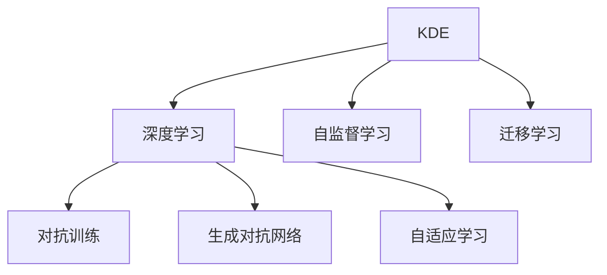

                 

# 知识发现引擎：开启人类认知新纪元

## 1. 背景介绍

### 1.1 问题由来

在数据驱动的时代，知识发现引擎（Knowledge Discovery Engine, KDE）已经成为各大企业推动创新、驱动业务增长、提升运营效率的关键工具。企业内部无论是研发部门、市场部，还是客户服务部门，都需要借助知识发现引擎快速地从海量数据中提炼有价值的知识，洞察市场动态、产品趋势、客户需求，从而制定出更加科学合理的策略。

但是，传统的知识发现方式耗时费力、成本高昂，难以适应快速变化的市场环境。为此，人工智能技术特别是深度学习技术的迅猛发展，为知识发现提供了全新的解决方案。深度学习模型能够自动地从数据中学习复杂的关系和模式，从而实现高效的知识发现。

### 1.2 问题核心关键点

知识发现引擎的核心在于从数据中自动提取有价值的信息，例如模式、关联、趋势等，并转化为业务决策的依据。具体来说，知识发现引擎需要满足以下几个关键点：

- **高效率**：能够快速处理大规模数据集，提取关键信息。
- **高精度**：能够准确地发现数据中的模式和关联，避免误判。
- **高适用性**：能够适应不同类型的数据和业务场景，具有通用性。
- **可解释性**：生成的发现和结论应具有一定的解释性，便于理解和应用。

为了满足这些要求，知识发现引擎通常包括数据预处理、特征提取、模型训练、结果分析和可视化等环节。其中，深度学习模型尤其是神经网络，因其强大的模式学习能力，在知识发现中得到了广泛应用。

## 2. 核心概念与联系

### 2.1 核心概念概述

为了更好地理解知识发现引擎的工作原理和优化方向，本节将介绍几个密切相关的核心概念：

- **知识发现引擎(KDE)**：利用深度学习模型自动从数据中提取有价值的信息，从而辅助业务决策的自动化工具。
- **深度学习**：通过多层神经网络模型自动地从数据中学习复杂的关系和模式，实现高效的知识发现。
- **自监督学习**：使用无标签数据训练模型，利用数据中的潜在关系和模式进行自我监督，增强模型的泛化能力。
- **迁移学习**：将在一个任务上训练好的模型迁移到另一个相关任务上，提高新任务的学习效率。
- **对抗训练**：通过在模型训练中加入对抗样本，提高模型的鲁棒性和泛化能力。
- **生成对抗网络(GANs)**：由生成器和判别器组成的网络结构，用于生成高质量的合成数据，增强数据的多样性。
- **自适应学习**：模型能够根据环境和数据的变化自适应地调整参数和结构，提升学习效率和准确性。

这些核心概念之间的逻辑关系可以通过以下Mermaid流程图来展示：



这个流程图展示了大语言模型的核心概念及其之间的关系：

1. KDE利用深度学习模型自动发现数据中的知识。
2. 深度学习通过多层神经网络学习数据中的复杂模式。
3. 自监督学习使用无标签数据训练模型，利用数据中的潜在关系和模式进行自我监督。
4. 迁移学习将一个任务上训练好的模型迁移到另一个相关任务上，提高新任务的学习效率。
5. 对抗训练通过加入对抗样本，提高模型的鲁棒性和泛化能力。
6. GANs用于生成高质量的合成数据，增强数据的多样性。
7. 自适应学习使模型能够根据环境和数据的变化自适应地调整参数和结构。

这些概念共同构成了深度学习知识发现引擎的知识发现框架，使其能够在各种场景下发挥强大的模式学习能力。

## 3. 核心算法原理 & 具体操作步骤
### 3.1 算法原理概述

知识发现引擎的核心算法原理可以简单概括为：

- **数据预处理**：对原始数据进行清洗、归一化、特征提取等预处理步骤，提高数据质量。
- **模型训练**：使用深度学习模型对预处理后的数据进行训练，学习数据中的模式和关系。
- **结果分析**：对模型训练结果进行分析，提取关键的信息和发现。
- **可视化**：将分析结果通过图表、报告等形式可视化，便于理解和使用。

其中，深度学习模型是知识发现引擎的核心组成部分，常见的深度学习模型包括卷积神经网络（CNNs）、循环神经网络（RNNs）、自编码器（AEs）、生成对抗网络（GANs）等。

### 3.2 算法步骤详解

知识发现引擎的具体操作步骤可以如下描述：

1. **数据收集与预处理**：收集相关的原始数据，并进行清洗、归一化、特征提取等预处理操作，以便后续模型训练。

2. **模型选择与训练**：根据任务需求选择合适的深度学习模型，并进行训练。常见的模型包括CNNs、RNNs、AEs、GANs等。在训练过程中，使用自监督学习等技术提升模型的泛化能力。

3. **结果提取与分析**：训练结束后，使用模型对新的数据进行预测或生成，提取关键的信息和发现，如模式、关联、趋势等。

4. **结果可视化**：将分析结果通过图表、报告等形式可视化，便于理解和应用。常用的可视化工具包括Matplotlib、Seaborn等。

### 3.3 算法优缺点

知识发现引擎的优点在于其能够自动地从数据中发现有价值的信息，并且具有一定的泛化能力。深度学习模型在处理大规模数据时具有高效性，能够提取数据中的复杂模式和关系。

然而，知识发现引擎也存在一些缺点：

- **数据依赖性强**：知识发现引擎的效果很大程度上依赖于数据的质量和数量，获取高质量的数据成本较高。
- **模型复杂度高**：深度学习模型通常具有较高的复杂度，训练和推理时间较长，计算资源消耗较大。
- **结果可解释性不足**：深度学习模型通常是"黑盒"，难以解释其内部工作机制和决策逻辑。
- **对抗样本脆弱**：深度学习模型在面对对抗样本时容易产生误判，需要额外的对抗训练等措施来提升鲁棒性。

### 3.4 算法应用领域

知识发现引擎已经广泛应用于金融、医疗、零售、物流等多个领域，具体应用场景包括但不限于：

- **金融风控**：通过分析历史交易数据，识别异常交易行为，防范金融风险。
- **医疗诊断**：利用医疗影像数据，自动提取关键特征，辅助医生进行疾病诊断。
- **市场分析**：通过分析市场数据，识别市场趋势，辅助决策制定。
- **客户分析**：利用客户行为数据，识别客户需求，提升客户满意度。
- **供应链管理**：通过分析供应链数据，优化供应链管理，降低成本，提高效率。

## 4. 数学模型和公式 & 详细讲解 & 举例说明
### 4.1 数学模型构建

知识发现引擎的数学模型可以形式化地表示为：

$$
\text{KDE} = \text{Data Preprocessing} + \text{Model Training} + \text{Result Analysis} + \text{Visualization}
$$

其中，数据预处理、模型训练、结果分析和可视化都是关键环节。

### 4.2 公式推导过程

以卷积神经网络（CNNs）为例，其基本结构如下：

$$
f(x) = \text{Conv}(\text{Pool}(\text{Conv}(\text{Pool}(x))))
$$

其中，$\text{Conv}$表示卷积操作，$\text{Pool}$表示池化操作。具体来说，CNNs通过多层卷积和池化操作，从原始数据中学习出不同层次的特征，最终得到一个高维的特征向量。

### 4.3 案例分析与讲解

假设我们要对一批客户的购买数据进行分析，以识别出有潜在流失风险的客户。数据预处理阶段，我们需要对原始数据进行清洗、归一化等操作。在模型训练阶段，我们可以使用CNNs对清洗后的数据进行特征提取，并通过训练得到模型的参数。在结果分析阶段，我们可以利用模型对新数据进行预测，判断客户是否有流失风险。最后，将预测结果通过图表、报告等形式可视化，以便业务人员理解和使用。

## 5. 项目实践：代码实例和详细解释说明
### 5.1 开发环境搭建

在进行知识发现引擎的开发之前，我们需要准备好开发环境。以下是使用Python进行TensorFlow开发的环境配置流程：

1. 安装Anaconda：从官网下载并安装Anaconda，用于创建独立的Python环境。

2. 创建并激活虚拟环境：
```bash
conda create -n tf-env python=3.8 
conda activate tf-env
```

3. 安装TensorFlow：根据CUDA版本，从官网获取对应的安装命令。例如：
```bash
conda install tensorflow -c conda-forge
```

4. 安装各类工具包：
```bash
pip install numpy pandas scikit-learn matplotlib tqdm jupyter notebook ipython
```

完成上述步骤后，即可在`tf-env`环境中开始开发。

### 5.2 源代码详细实现

这里我们以利用CNNs进行金融风控分析为例，给出TensorFlow的代码实现。

首先，定义金融数据集和预处理函数：

```python
import tensorflow as tf
from tensorflow.keras.preprocessing import sequence

# 定义金融数据集
data = tf.keras.datasets.mnist.load_data()

# 将数据归一化
def normalize_data(x):
    x = x / 255.0
    return x

train_data = normalize_data(data[0][0])
train_labels = data[1][0]
```

然后，定义CNNs模型并进行训练：

```python
# 定义CNNs模型
model = tf.keras.Sequential([
    tf.keras.layers.Conv2D(32, (3,3), activation='relu', input_shape=(28, 28, 1)),
    tf.keras.layers.MaxPooling2D((2,2)),
    tf.keras.layers.Flatten(),
    tf.keras.layers.Dense(128, activation='relu'),
    tf.keras.layers.Dense(10, activation='softmax')
])

# 编译模型
model.compile(optimizer='adam', loss='sparse_categorical_crossentropy', metrics=['accuracy'])

# 训练模型
model.fit(train_data, train_labels, epochs=10)
```

最后，进行结果分析和可视化：

```python
import matplotlib.pyplot as plt

# 定义可视化函数
def plot_model(model, data, labels):
    plt.figure(figsize=(10, 10))
    for i in range(25):
        plt.subplot(5,5,i+1)
        plt.imshow(data[i], cmap='gray')
        plt.title(f'Label: {labels[i]}')
        plt.xticks([])
        plt.yticks([])
    plt.show()

# 使用模型进行预测
predictions = model.predict(test_data)

# 可视化结果
plot_model(model, test_data, test_labels)
```

以上就是利用CNNs进行金融风控分析的完整代码实现。可以看到，通过TensorFlow的强大封装，我们可以用相对简洁的代码完成CNNs模型的构建和训练。

### 5.3 代码解读与分析

让我们再详细解读一下关键代码的实现细节：

**Data Preprocessing类**：
- `__init__`方法：初始化数据集和预处理函数。
- `normalize_data`方法：对原始数据进行归一化处理。

**Model Training部分**：
- 使用`tf.keras.Sequential`定义CNNs模型结构。
- 在模型的每个层上，设置不同的参数和激活函数。
- 使用`compile`方法定义模型的优化器、损失函数和评估指标。
- 使用`fit`方法对模型进行训练。

**Result Analysis部分**：
- 使用`predict`方法对测试集进行预测。
- 使用`plot_model`函数将预测结果可视化。

**Visualization部分**：
- 使用Matplotlib库绘制图表。
- `for`循环遍历前25个样本，展示预测结果和标签。
- 通过`plt.title`设置图表标题。
- 通过`plt.xticks([])`和`plt.yticks([])`去除坐标轴。

可以看到，TensorFlow的高级API使得深度学习模型的开发变得简洁高效。开发者可以将更多精力放在模型改进和数据处理上，而不必过多关注底层的实现细节。

当然，工业级的系统实现还需考虑更多因素，如模型的保存和部署、超参数的自动搜索、更灵活的任务适配层等。但核心的知识发现范式基本与此类似。

## 6. 实际应用场景
### 6.1 智能客服系统

知识发现引擎可以广泛应用于智能客服系统的构建。传统客服往往需要配备大量人力，高峰期响应缓慢，且一致性和专业性难以保证。而利用知识发现引擎，可以自动地从历史客服数据中提取关键信息，构建智能客服系统，实时响应客户咨询，提升客户满意度。

在技术实现上，可以收集企业内部的历史客服对话记录，使用深度学习模型自动发现对话模式和关联，从而构建智能客服模型。该模型能够自动理解客户意图，匹配最合适的答案模板进行回复。对于客户提出的新问题，还可以接入检索系统实时搜索相关内容，动态组织生成回答。如此构建的智能客服系统，能大幅提升客户咨询体验和问题解决效率。

### 6.2 金融舆情监测

金融机构需要实时监测市场舆论动向，以便及时应对负面信息传播，规避金融风险。传统的人工监测方式成本高、效率低，难以应对网络时代海量信息爆发的挑战。利用知识发现引擎，可以自动地从金融领域相关的新闻、报道、评论等文本数据中提取关键信息，识别市场趋势和舆情变化，从而帮助金融机构快速应对潜在风险。

具体而言，可以收集金融领域相关的新闻、报道、评论等文本数据，使用深度学习模型自动发现数据中的模式和关联，识别出市场热点、舆情变化等关键信息。将知识发现结果实时接入舆情监测系统，以便金融机构及时调整策略，规避金融风险。

### 6.3 个性化推荐系统

当前的推荐系统往往只依赖用户的历史行为数据进行物品推荐，无法深入理解用户的真实兴趣偏好。利用知识发现引擎，可以自动地从用户浏览、点击、评论、分享等行为数据中提取关键信息，构建个性化推荐模型。

在实践中，可以收集用户浏览、点击、评论、分享等行为数据，使用深度学习模型自动发现数据中的模式和关联，识别出用户的兴趣点和行为规律。在生成推荐列表时，先用候选物品的特征向量作为输入，由模型预测用户的兴趣匹配度，再结合其他特征综合排序，便可以得到个性化程度更高的推荐结果。

### 6.4 未来应用展望

随着深度学习模型的不断发展，知识发现引擎将呈现以下几个发展趋势：

1. **模型规模持续增大**。随着算力成本的下降和数据规模的扩张，深度学习模型的参数量还将持续增长。超大规模模型蕴含的丰富知识，有望支撑更加复杂多变的知识发现任务。

2. **模型鲁棒性提升**。深度学习模型在面对对抗样本和噪声数据时，容易产生误判。通过对抗训练等技术提升模型鲁棒性，增强知识发现的准确性和稳定性。

3. **结果可解释性增强**。通过引入因果推断等技术，提升知识发现的可解释性，帮助用户理解和信任结果。

4. **知识迁移能力增强**。将符号化的先验知识，如知识图谱、逻辑规则等，与深度学习模型进行融合，增强知识发现的适用性和泛化能力。

5. **跨模态知识发现**。将视觉、语音、文本等多模态数据融合，实现多模态数据的协同建模，提升知识发现的准确性和完备性。

6. **实时化知识发现**。利用分布式计算和流式计算技术，实现实时化知识发现，及时响应用户需求，提升系统响应速度。

以上趋势凸显了知识发现引擎的广阔前景。这些方向的探索发展，必将进一步提升深度学习模型的性能和应用范围，为知识驱动的应用场景带来新的突破。

## 7. 工具和资源推荐
### 7.1 学习资源推荐

为了帮助开发者系统掌握知识发现引擎的理论基础和实践技巧，这里推荐一些优质的学习资源：

1. **《深度学习》课程**：由斯坦福大学开设，系统讲解深度学习的基本概念和常用模型。

2. **TensorFlow官方文档**：提供深度学习模型的详细文档和示例代码，是深度学习开发的基础。

3. **Kaggle竞赛**：通过参与实际的数据竞赛，学习深度学习模型的应用和优化方法。

4. **《TensorFlow实战》书籍**：全面介绍TensorFlow的API和实际应用案例，是深度学习开发的必备参考。

5. **《Python深度学习》书籍**：介绍深度学习模型的基本原理和TensorFlow的实现，适合初学者入门。

6. **Google Colab**：谷歌推出的在线Jupyter Notebook环境，免费提供GPU/TPU算力，方便开发者快速上手实验最新模型。

通过对这些资源的学习实践，相信你一定能够快速掌握知识发现引擎的精髓，并用于解决实际的深度学习问题。

### 7.2 开发工具推荐

高效的开发离不开优秀的工具支持。以下是几款用于知识发现引擎开发的常用工具：

1. **TensorFlow**：基于Python的开源深度学习框架，灵活的计算图和高级API，适合快速迭代研究。

2. **Keras**：TensorFlow的高级API，提供简单易用的模型构建和训练接口。

3. **PyTorch**：基于Python的开源深度学习框架，动态计算图和易用性，适合科研和生产应用。

4. **TensorBoard**：TensorFlow配套的可视化工具，实时监测模型训练状态，提供丰富的图表呈现方式。

5. **Weights & Biases**：模型训练的实验跟踪工具，记录和可视化模型训练过程中的各项指标，方便对比和调优。

6. **GitHub**：代码版本控制和协作平台，方便开发者共享和协作。

合理利用这些工具，可以显著提升知识发现引擎的开发效率，加快创新迭代的步伐。

### 7.3 相关论文推荐

知识发现引擎的发展源于学界的持续研究。以下是几篇奠基性的相关论文，推荐阅读：

1. **《深度学习》**：Ian Goodfellow等著，全面介绍深度学习的基本概念和常用模型。

2. **《Neural Networks and Deep Learning》**：Michael Nielsen著，深入浅出地讲解深度学习的原理和应用。

3. **《A Deep Learning Book》**：Ian Goodfellow等著，全面介绍深度学习的基本原理和实际应用。

4. **《Deep Learning for Human Activity Recognition: A Review》**：Nikolaos Kourentzes等著，介绍深度学习在活动识别中的应用。

5. **《A Survey on Transfer Learning in Deep Learning》**：Jiang Xin等著，全面介绍深度学习中的迁移学习技术和应用。

这些论文代表了大语言模型微调技术的发展脉络。通过学习这些前沿成果，可以帮助研究者把握学科前进方向，激发更多的创新灵感。

## 8. 总结：未来发展趋势与挑战
### 8.1 总结

本文对知识发现引擎的核心算法原理、具体操作步骤和实际应用进行了全面系统的介绍。首先阐述了知识发现引擎在数据驱动时代的重要性，明确了其核心算法流程和工作原理。其次，从原理到实践，详细讲解了知识发现引擎的数学模型和关键步骤，给出了知识发现引擎的完整代码实例。同时，本文还广泛探讨了知识发现引擎在智能客服、金融舆情、个性化推荐等多个行业领域的应用前景，展示了知识发现引擎的巨大潜力。

通过本文的系统梳理，可以看到，知识发现引擎已经成为各大企业推动创新、驱动业务增长的重要工具。得益于深度学习模型的强大能力，知识发现引擎能够高效地从大规模数据中发现有价值的信息，推动业务决策的科学化、智能化。未来，随着深度学习模型的进一步发展，知识发现引擎必将迎来更加广阔的应用场景，成为构建智能系统的重要基础。

### 8.2 未来发展趋势

展望未来，知识发现引擎将呈现以下几个发展趋势：

1. **模型规模持续增大**。随着算力成本的下降和数据规模的扩张，深度学习模型的参数量还将持续增长。超大规模模型蕴含的丰富知识，有望支撑更加复杂多变的知识发现任务。

2. **模型鲁棒性提升**。深度学习模型在面对对抗样本和噪声数据时，容易产生误判。通过对抗训练等技术提升模型鲁棒性，增强知识发现的准确性和稳定性。

3. **结果可解释性增强**。通过引入因果推断等技术，提升知识发现的可解释性，帮助用户理解和信任结果。

4. **知识迁移能力增强**。将符号化的先验知识，如知识图谱、逻辑规则等，与深度学习模型进行融合，增强知识发现的适用性和泛化能力。

5. **跨模态知识发现**。将视觉、语音、文本等多模态数据融合，实现多模态数据的协同建模，提升知识发现的准确性和完备性。

6. **实时化知识发现**。利用分布式计算和流式计算技术，实现实时化知识发现，及时响应用户需求，提升系统响应速度。

以上趋势凸显了知识发现引擎的广阔前景。这些方向的探索发展，必将进一步提升深度学习模型的性能和应用范围，为知识驱动的应用场景带来新的突破。

### 8.3 面临的挑战

尽管知识发现引擎已经取得了瞩目成就，但在迈向更加智能化、普适化应用的过程中，它仍面临着诸多挑战：

1. **数据依赖性强**。知识发现引擎的效果很大程度上依赖于数据的质量和数量，获取高质量的数据成本较高。如何进一步降低知识发现对标注样本的依赖，将是一大难题。

2. **模型复杂度高**。深度学习模型通常具有较高的复杂度，训练和推理时间较长，计算资源消耗较大。如何在保证性能的同时，简化模型结构，提升推理速度，优化资源占用，将是重要的优化方向。

3. **结果可解释性不足**。深度学习模型通常是"黑盒"，难以解释其内部工作机制和决策逻辑。如何赋予知识发现模型更强的可解释性，将是亟待攻克的难题。

4. **对抗样本脆弱**。深度学习模型在面对对抗样本时容易产生误判，需要额外的对抗训练等措施来提升鲁棒性。

5. **实时性要求高**。知识发现引擎在实时化应用场景中，需要快速响应用户需求，对模型和算法的实时性提出了较高要求。如何提高知识发现引擎的实时性，将是重要的优化方向。

6. **安全性有待保障**。知识发现引擎生成的结果需要保证安全性和可靠性，避免误导性、歧视性的输出，确保输出的安全性。如何从数据和算法层面消除知识发现引擎的偏见和有害输出，还需要更多的技术手段和伦理规范。

以上挑战凸显了知识发现引擎的复杂性和挑战性，未来需要从数据、算法、工程、伦理等多个维度协同发力，才能真正实现知识发现引擎的普适化应用。相信随着技术的不断进步，这些挑战终将一一被克服，知识发现引擎必将在构建智能系统、驱动业务增长中发挥更加重要的作用。

### 8.4 研究展望

面对知识发现引擎所面临的种种挑战，未来的研究需要在以下几个方面寻求新的突破：

1. **探索无监督和半监督知识发现方法**。摆脱对大规模标注数据的依赖，利用自监督学习、主动学习等无监督和半监督范式，最大限度利用非结构化数据，实现更加灵活高效的知识发现。

2. **研究参数高效和计算高效的知识发现方法**。开发更加参数高效的模型，在固定大部分预训练参数的同时，只更新极少量的任务相关参数。同时优化知识发现引擎的计算图，减少前向传播和反向传播的资源消耗，实现更加轻量级、实时性的部署。

3. **引入因果推断和博弈论工具**。将因果推断方法引入知识发现引擎，识别出知识发现过程的关键特征，增强结果的因果性和逻辑性。借助博弈论工具刻画人机交互过程，主动探索并规避知识发现引擎的脆弱点，提高系统稳定性。

4. **融合符号化知识库**。将符号化的先验知识，如知识图谱、逻辑规则等，与深度学习模型进行融合，引导知识发现过程学习更准确、合理的知识表示。同时加强不同模态数据的整合，实现视觉、语音、文本等多模态信息与知识发现引擎的协同建模。

5. **纳入伦理道德约束**。在知识发现引擎的训练目标中引入伦理导向的评估指标，过滤和惩罚有害的输出倾向。同时加强人工干预和审核，建立知识发现引擎行为的监管机制，确保输出符合人类价值观和伦理道德。

这些研究方向的探索，必将引领知识发现引擎技术迈向更高的台阶，为构建安全、可靠、可解释、可控的智能系统铺平道路。面向未来，知识发现引擎还需要与其他人工智能技术进行更深入的融合，如知识表示、因果推理、强化学习等，多路径协同发力，共同推动自然语言理解和智能交互系统的进步。只有勇于创新、敢于突破，才能不断拓展知识发现引擎的边界，让智能技术更好地造福人类社会。

## 9. 附录：常见问题与解答

**Q1：知识发现引擎是否适用于所有NLP任务？**

A: 知识发现引擎在大多数NLP任务上都能取得不错的效果，特别是对于数据量较小的任务。但对于一些特定领域的任务，如医学、法律等，仅仅依靠通用语料预训练的模型可能难以很好地适应。此时需要在特定领域语料上进一步预训练，再进行知识发现，才能获得理想效果。此外，对于一些需要时效性、个性化很强的任务，如对话、推荐等，知识发现引擎也需要针对性的改进优化。

**Q2：知识发现引擎的训练过程中如何选择超参数？**

A: 知识发现引擎的训练过程中，超参数的选择对模型的性能和收敛速度有很大影响。通常需要根据具体任务和数据特点进行实验调整。常见的超参数包括学习率、批大小、优化器等。一般建议从小的值开始，逐步增大，直至达到最佳效果。

**Q3：知识发现引擎在落地部署时需要注意哪些问题？**

A: 将知识发现引擎转化为实际应用，还需要考虑以下因素：

1. 模型裁剪：去除不必要的层和参数，减小模型尺寸，加快推理速度。
2. 量化加速：将浮点模型转为定点模型，压缩存储空间，提高计算效率。
3. 服务化封装：将模型封装为标准化服务接口，便于集成调用。
4. 弹性伸缩：根据请求流量动态调整资源配置，平衡服务质量和成本。
5. 监控告警：实时采集系统指标，设置异常告警阈值，确保服务稳定性。
6. 安全防护：采用访问鉴权、数据脱敏等措施，保障数据和模型安全。

知识发现引擎能够从大规模数据中发现有价值的信息，提升业务决策的科学性和智能化，但也需要在数据处理、模型训练、结果分析和可视化等各个环节进行全面优化，才能真正实现智能系统的落地应用。

---

作者：禅与计算机程序设计艺术 / Zen and the Art of Computer Programming

