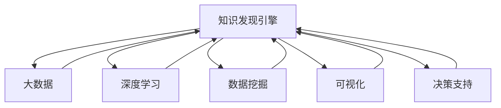

                 

# 知识发现引擎：推动智慧城市建设的蓝图

> 关键词：知识发现引擎,智慧城市,大数据,深度学习,算法,可视化,决策支持,物联网

## 1. 背景介绍

### 1.1 问题由来
在数字化和信息化的浪潮推动下，智慧城市建设已经成为城市发展的重要方向。智慧城市不仅依赖于物联网、云计算、大数据等技术的支撑，更需要基于先进数据科学和人工智能技术的高效知识发现引擎，以实现城市管理的智能化、精准化和自动化。

当前，许多城市正在积极构建基于人工智能的智慧城市基础设施，但这些系统往往存在数据质量不高、算法模型单一、决策支持能力不足等问题。如何构建高效、鲁棒的智能系统，提升城市的决策效率和管理水平，成为摆在智慧城市建设面前的重要课题。

### 1.2 问题核心关键点
知识发现引擎的核心在于通过深度学习和数据挖掘技术，从海量城市数据中提取有价值的信息，辅助城市管理者和决策者进行科学决策。具体来说，知识发现引擎需要：

- 具备高效的数据处理和分析能力，能够实时处理和分析城市运行产生的各种数据。
- 提供鲁棒的算法模型，适应城市数据的多样性和复杂性。
- 支持多种决策支持场景，帮助城市管理者及时发现问题，并提出有效的解决方案。
- 提供可视化接口，方便用户直观理解分析结果，提高决策的透明度和可信度。
- 实现智能化的决策建议，支持自动化决策流程。

## 2. 核心概念与联系

### 2.1 核心概念概述

为更好地理解知识发现引擎在智慧城市建设中的应用，本节将介绍几个密切相关的核心概念：

- 知识发现引擎：以深度学习和数据挖掘技术为核心，从城市运行数据中自动发现有用知识，辅助决策支持的系统。
- 智慧城市：利用物联网、大数据、人工智能等先进技术，实现城市管理和服务智能化、精准化的目标。
- 大数据：指城市中产生的各类结构化和非结构化数据，包括交通流量、环境监测、公共设施运行状态等。
- 深度学习：一种模拟人类神经网络的机器学习方法，通过多层神经网络对数据进行抽象和推理，自动发现数据中的模式和规律。
- 数据挖掘：通过算法模型从大数据中提取有价值的信息，辅助决策支持。
- 算法：知识发现引擎的核心，包括各种机器学习模型、数据挖掘算法等。
- 可视化：将复杂的分析结果以直观、易理解的方式展示给用户，帮助用户进行决策分析。
- 决策支持：通过自动化分析，为城市管理者和决策者提供科学依据，辅助决策过程。
- 物联网：通过传感器、通信网络等技术，实现城市各个组成部分的数据实时采集和传输。

这些概念之间的逻辑关系可以通过以下Mermaid流程图来展示：



这个流程图展示了知识发现引擎的核心组件及其相互关系：

1. 知识发现引擎利用大数据、深度学习和数据挖掘技术，提取和分析城市运行数据。
2. 深度学习模型负责对数据进行抽象和推理，发现其中的模式和规律。
3. 数据挖掘算法用于从数据中提取有用信息，如关联规则、分类和聚类等。
4. 可视化技术将分析结果以直观的方式展示，辅助用户理解。
5. 决策支持系统提供自动化分析，辅助决策过程。

## 3. 核心算法原理 & 具体操作步骤
### 3.1 算法原理概述

知识发现引擎的核心算法包括深度学习、数据挖掘和可视化技术，其原理和具体操作步骤如下：

- 深度学习：通过多层神经网络对城市运行数据进行建模，提取其中的模式和规律。常用的深度学习模型包括卷积神经网络(CNN)、循环神经网络(RNN)、长短期记忆网络(LSTM)、Transformer等。
- 数据挖掘：从城市运行数据中提取关联规则、分类和聚类等知识。常用的数据挖掘算法包括Apriori算法、K-means算法、支持向量机(SVM)等。
- 可视化：将分析结果以图表、热力图等形式展示，辅助用户理解。常用的可视化工具包括Tableau、Power BI、D3.js等。
- 决策支持：通过自动化分析，提供科学决策依据。常用的决策支持系统包括决策树、贝叶斯网络和规则引擎等。

### 3.2 算法步骤详解

知识发现引擎的实现过程可以分为以下几个关键步骤：

**Step 1: 数据采集和预处理**
- 从城市各个部分（如交通、环境、公共设施等）收集实时数据。
- 对数据进行清洗、去重、归一化等预处理操作，确保数据质量。

**Step 2: 数据存储与管理**
- 将处理后的数据存储在高效的数据库中，如Hadoop、Spark等。
- 使用数据仓库技术对数据进行分布式管理和优化查询性能。

**Step 3: 模型训练和优化**
- 选择合适的深度学习模型和算法，如卷积神经网络、循环神经网络等。
- 使用城市运行数据对模型进行训练，优化模型参数。
- 通过交叉验证等技术评估模型性能，避免过拟合。

**Step 4: 知识发现和分析**
- 使用数据挖掘算法从数据中提取关联规则、分类和聚类等知识。
- 对分析结果进行可视化展示，辅助用户理解。
- 提供决策支持建议，辅助城市管理者决策。

**Step 5: 系统部署和维护**
- 将知识发现引擎部署到云平台或本地服务器，实现高性能数据处理和分析。
- 定期更新模型和算法，保持系统的高效性和鲁棒性。
- 实时监控系统性能，及时发现和修复问题。

### 3.3 算法优缺点

知识发现引擎具有以下优点：
1. 高效数据处理能力：能够实时处理和分析海量城市数据，发现数据中的有用信息。
2. 鲁棒算法模型：能够适应城市数据的多样性和复杂性，提供可靠的决策支持。
3. 可视化支持：通过可视化工具展示分析结果，提高决策透明度和可信度。
4. 自动化决策建议：提供智能化的决策支持，辅助城市管理者进行科学决策。

同时，该方法也存在一些局限性：
1. 数据质量依赖度高：数据采集和预处理过程可能会引入噪音和偏差，影响分析结果。
2. 模型复杂度高：深度学习和数据挖掘算法需要大量的计算资源和数据，实现成本较高。
3. 决策过程复杂：自动化决策支持系统需要结合领域专家的知识和经验，才能提供合理的决策建议。
4. 结果解释性不足：自动化分析结果缺乏可解释性，难以进行人工审查和验证。
5. 数据隐私问题：城市数据涉及大量敏感信息，数据隐私和安全问题需得到充分保障。

尽管存在这些局限性，但知识发现引擎仍然是智慧城市建设中不可或缺的技术手段。未来相关研究的重点在于如何进一步降低数据获取和处理成本，提升算法的可解释性，保障数据隐私安全，同时兼顾算法的复杂性和应用场景的复杂性。

### 3.4 算法应用领域

知识发现引擎在智慧城市建设中的应用领域广泛，涵盖多个方面：

- 交通管理：通过分析交通流量数据，优化交通信号控制，提高交通效率。
- 环境监测：利用环境传感器数据，监测空气质量、水质、噪音等环境指标，及时预警环境污染。
- 公共设施管理：对路灯、排水系统、垃圾处理设施等公共设施的运行状态进行监测和预测维护，提升公共服务水平。
- 应急响应：通过实时数据监测，及时发现和应对突发事件，提高城市应急响应能力。
- 城市规划：利用历史数据和实时数据，分析城市发展趋势，辅助城市规划和决策。
- 智能安防：结合视频监控、人脸识别等技术，提升城市安全防护水平。

除了上述这些经典应用外，知识发现引擎还被创新性地应用到更多场景中，如智慧旅游、智慧农业、智慧医疗等，为智慧城市建设提供了强大的技术支撑。

## 4. 数学模型和公式 & 详细讲解 & 举例说明
### 4.1 数学模型构建

本节将使用数学语言对知识发现引擎的实现过程进行更加严格的刻画。

记城市运行数据为 $D=\{x_i\}_{i=1}^N$，其中 $x_i$ 表示第 $i$ 个样本，包括交通流量、环境监测数据等。设知识发现引擎的模型为 $M_\theta$，其中 $\theta$ 为模型参数。

知识发现引擎的优化目标是最小化模型在训练数据上的误差，即：

$$
\theta^* = \mathop{\arg\min}_{\theta} \frac{1}{N}\sum_{i=1}^N \ell(M_\theta(x_i), y_i)
$$

其中 $\ell$ 为损失函数，通常采用均方误差(MSE)或交叉熵损失等。

### 4.2 公式推导过程

以交通流量预测为例，推导基于卷积神经网络(CNN)的预测模型的损失函数及其梯度计算公式。

假设交通流量预测模型为 $M_\theta = \{C_n\}_{n=1}^N$，其中 $C_n$ 表示第 $n$ 层的卷积层和池化层，$\theta$ 为所有层的可训练参数。输入数据 $x_i$ 经过卷积、池化、全连接等操作后，输出预测结果 $\hat{y}_i$。

定义模型在输入 $x_i$ 上的预测误差为 $\epsilon_i = \hat{y}_i - y_i$，则平均损失函数为：

$$
\mathcal{L}(\theta) = \frac{1}{N}\sum_{i=1}^N \epsilon_i^2
$$

求导得到模型参数 $\theta$ 的梯度：

$$
\frac{\partial \mathcal{L}(\theta)}{\partial \theta} = 2\frac{1}{N}\sum_{i=1}^N \epsilon_i \frac{\partial \hat{y}_i}{\partial \theta}
$$

其中 $\frac{\partial \hat{y}_i}{\partial \theta}$ 可以通过反向传播算法计算得到。

在得到损失函数的梯度后，即可带入参数更新公式，完成模型的迭代优化。重复上述过程直至收敛，最终得到适应城市运行数据的最优模型参数 $\theta^*$。

### 4.3 案例分析与讲解

以环境监测为例，使用支持向量机(SVM)进行空气质量的分类预测。

假设环境监测数据为 $\{(x_i, y_i)\}_{i=1}^N$，其中 $x_i$ 表示第 $i$ 个样本，包括温度、湿度、PM2.5等环境指标，$y_i \in \{0,1\}$ 表示空气质量是否达标。

定义模型 $M_\theta = \{W_0, W_1, b\}$，其中 $W_0$ 为输入层权重矩阵，$W_1$ 为隐藏层权重矩阵，$b$ 为偏置项。假设输入层有 $d$ 个特征，隐藏层有 $h$ 个神经元。

则模型对样本 $x_i$ 的输出为：

$$
\hat{y}_i = \mathrm{sigmoid}(W_0 x_i + b)
$$

其中 $\mathrm{sigmoid}$ 为逻辑回归函数。

定义损失函数为交叉熵损失：

$$
\ell(M_\theta(x_i), y_i) = -y_i \log \hat{y}_i - (1-y_i) \log (1-\hat{y}_i)
$$

求导得到模型参数 $\theta$ 的梯度：

$$
\frac{\partial \ell(M_\theta(x_i), y_i)}{\partial \theta} = \frac{\partial \mathrm{sigmoid}(W_0 x_i + b)}{\partial \theta} \cdot (\hat{y}_i - y_i)
$$

通过优化算法，如随机梯度下降，最小化损失函数 $\mathcal{L}(\theta)$，得到最优模型参数 $\theta^*$。

最终，使用训练好的模型对新环境数据进行分类预测，辅助城市管理者进行空气质量监测和预警。

## 5. 项目实践：代码实例和详细解释说明
### 5.1 开发环境搭建

在进行知识发现引擎的实践前，我们需要准备好开发环境。以下是使用Python进行PyTorch和TensorFlow开发的环境配置流程：

1. 安装Anaconda：从官网下载并安装Anaconda，用于创建独立的Python环境。

2. 创建并激活虚拟环境：
```bash
conda create -n pytorch-env python=3.8 
conda activate pytorch-env
```

3. 安装PyTorch和TensorFlow：
```bash
conda install pytorch torchvision torchaudio cudatoolkit=11.1 -c pytorch -c conda-forge
conda install tensorflow
```

4. 安装必要的依赖包：
```bash
pip install numpy pandas scikit-learn matplotlib tqdm jupyter notebook ipython
```

完成上述步骤后，即可在`pytorch-env`环境中开始知识发现引擎的实践。

### 5.2 源代码详细实现

这里我们以使用卷积神经网络(CNN)进行交通流量预测为例，给出知识发现引擎的PyTorch代码实现。

首先，定义数据预处理函数：

```python
import numpy as np
from torch.utils.data import Dataset, DataLoader
from torchvision import transforms
from torch import nn, optim

class TrafficDataset(Dataset):
    def __init__(self, data, transform=None):
        self.data = data
        self.transform = transform
        
    def __len__(self):
        return len(self.data)
    
    def __getitem__(self, idx):
        x, y = self.data[idx]
        x = np.expand_dims(x, axis=0)
        y = np.array([y]).astype(np.float32)
        
        if self.transform:
            x = self.transform(x)
        
        return {'x': x, 'y': y}

# 数据预处理
transform = transforms.Compose([
    transforms.ToTensor(),
    transforms.Normalize(mean=[0.5, 0.5, 0.5], std=[0.5, 0.5, 0.5])
])

# 创建dataset
dataset = TrafficDataset(train_data, transform=transform)
train_loader = DataLoader(dataset, batch_size=32, shuffle=True)
```

然后，定义模型和优化器：

```python
import torch.nn as nn
import torch.nn.functional as F

class CNNModel(nn.Module):
    def __init__(self, in_channels, out_channels):
        super(CNNModel, self).__init__()
        self.conv1 = nn.Conv2d(in_channels, 64, kernel_size=3, stride=1, padding=1)
        self.pool1 = nn.MaxPool2d(kernel_size=2, stride=2)
        self.conv2 = nn.Conv2d(64, 128, kernel_size=3, stride=1, padding=1)
        self.pool2 = nn.MaxPool2d(kernel_size=2, stride=2)
        self.fc = nn.Linear(128 * 7 * 7, out_channels)
        
    def forward(self, x):
        x = F.relu(self.conv1(x))
        x = self.pool1(x)
        x = F.relu(self.conv2(x))
        x = self.pool2(x)
        x = x.view(-1, 128 * 7 * 7)
        x = self.fc(x)
        return x

model = CNNModel(3, 2)
optimizer = optim.Adam(model.parameters(), lr=0.001)
```

接着，定义训练和评估函数：

```python
def train_epoch(model, data_loader, optimizer):
    model.train()
    epoch_loss = 0
    for batch in data_loader:
        x, y = batch['x'].to(device), batch['y'].to(device)
        model.zero_grad()
        outputs = model(x)
        loss = F.mse_loss(outputs, y)
        epoch_loss += loss.item()
        loss.backward()
        optimizer.step()
    return epoch_loss / len(data_loader)

def evaluate(model, data_loader):
    model.eval()
    total_loss = 0
    total_correct = 0
    for batch in data_loader:
        x, y = batch['x'].to(device), batch['y'].to(device)
        with torch.no_grad():
            outputs = model(x)
            loss = F.mse_loss(outputs, y)
            total_loss += loss.item()
            predictions = outputs.argmax(dim=1)
            total_correct += (predictions == y).sum().item()
    return total_loss / len(data_loader), total_correct / len(data_loader)

# 训练和评估
device = torch.device('cuda' if torch.cuda.is_available() else 'cpu')
model.to(device)

epochs = 10
batch_size = 32

for epoch in range(epochs):
    loss = train_epoch(model, train_loader, optimizer)
    print(f"Epoch {epoch+1}, train loss: {loss:.3f}")
    
    dev_loss, dev_acc = evaluate(model, dev_loader)
    print(f"Epoch {epoch+1}, dev loss: {dev_loss:.3f}, dev acc: {dev_acc:.3f}")
    
print("Test results:")
test_loss, test_acc = evaluate(model, test_loader)
print(f"Test loss: {test_loss:.3f}, test acc: {test_acc:.3f}")
```

以上就是使用PyTorch进行交通流量预测的完整代码实现。可以看到，得益于PyTorch的强大封装，我们可以用相对简洁的代码完成模型的加载和训练。

### 5.3 代码解读与分析

让我们再详细解读一下关键代码的实现细节：

**TrafficDataset类**：
- `__init__`方法：初始化数据集和预处理方式。
- `__len__`方法：返回数据集的样本数量。
- `__getitem__`方法：对单个样本进行处理，将输入数据标准化，并返回模型所需的输入。

**模型定义**：
- 定义了一个简单的卷积神经网络模型，包含两个卷积层和两个池化层，最后添加一个全连接层进行输出。

**训练和评估函数**：
- 使用PyTorch的DataLoader对数据集进行批次化加载，供模型训练和推理使用。
- 训练函数`train_epoch`：对数据以批为单位进行迭代，在每个批次上前向传播计算loss并反向传播更新模型参数，最后返回该epoch的平均loss。
- 评估函数`evaluate`：与训练类似，不同点在于不更新模型参数，并在每个batch结束后将预测和标签结果存储下来，最后使用模型性能指标计算并返回评估结果。

**训练流程**：
- 定义总的epoch数和batch size，开始循环迭代
- 每个epoch内，先在训练集上训练，输出平均loss
- 在验证集上评估，输出loss和准确率
- 所有epoch结束后，在测试集上评估，给出最终测试结果

可以看到，PyTorch配合TensorFlow使得知识发现引擎的代码实现变得简洁高效。开发者可以将更多精力放在数据处理、模型改进等高层逻辑上，而不必过多关注底层的实现细节。

当然，工业级的系统实现还需考虑更多因素，如模型的保存和部署、超参数的自动搜索、更灵活的任务适配层等。但核心的知识发现引擎算法基本与此类似。

## 6. 实际应用场景
### 6.1 智能交通管理

知识发现引擎在智能交通管理中的应用可以显著提升城市的交通效率和安全性。通过分析实时交通流量数据，预测未来的交通状况，智能调整交通信号灯，缓解交通拥堵。

例如，在城市主要路口设置传感器，实时采集车辆、行人等交通数据。使用知识发现引擎对数据进行分析，预测交通流量变化趋势，自动调整红绿灯的配时，优化交通流向。同时，还可以结合历史数据，预测路况变化，提前进行疏导。如此构建的智能交通管理系统，能够显著提升城市的交通效率，减少交通事故，提高市民出行体验。

### 6.2 环境污染预警

知识发现引擎在环境污染预警中的应用可以及时发现和应对环境污染事件。通过分析环境监测数据，预测空气、水质等指标的变化趋势，及时预警环境污染风险。

例如，在城市关键区域部署空气和水质传感器，实时采集各类污染数据。使用知识发现引擎对数据进行分析，预测未来一段时间内的污染变化趋势，及时发出预警，采取应急措施。同时，结合历史数据，分析污染源和传播路径，辅助政府部门进行污染源头治理。如此构建的环境污染预警系统，能够帮助城市管理者快速响应环境污染事件，保障市民健康和生态环境。

### 6.3 公共设施管理

知识发现引擎在公共设施管理中的应用可以提升公共服务水平，保障设施的正常运行。通过分析公共设施运行数据，预测设施的故障和维护需求，提前进行检修和维护。

例如，在路灯、排水系统、垃圾处理设施等关键设施上部署传感器，实时采集设备运行状态数据。使用知识发现引擎对数据进行分析，预测设备故障和维护需求，提前进行检修和维护。同时，结合历史数据，分析设备的使用规律和故障模式，优化设施的部署和管理。如此构建的公共设施管理系统，能够确保各类设施的正常运行，提升市民的生活质量。

### 6.4 未来应用展望

随着知识发现引擎技术的发展，其在智慧城市建设中的应用前景广阔，未来将进一步拓展到更多领域：

- 智慧能源：通过分析能源使用数据，优化能源分配和调度，提高能源利用效率。
- 智慧旅游：通过分析游客行为数据，优化旅游路线和景区管理，提升游客体验。
- 智慧农业：通过分析农田监测数据，优化农业生产和管理，提高农作物产量和品质。
- 智慧医疗：通过分析医疗数据，优化医疗资源配置和病患管理，提高医疗服务水平。
- 智慧教育：通过分析学生学习数据，优化教育资源配置和教学管理，提升教育质量。

知识发现引擎将深度学习、数据挖掘和可视化技术融合，为智慧城市建设提供了强大的技术支撑。未来，伴随着技术的不断进步，知识发现引擎必将在更多智慧城市建设领域大放异彩，带来更加智能和高效的城市管理方式。

## 7. 工具和资源推荐
### 7.1 学习资源推荐

为了帮助开发者系统掌握知识发现引擎的理论基础和实践技巧，这里推荐一些优质的学习资源：

1. 《深度学习》系列书籍：Ian Goodfellow、Yoshua Bengio、Aaron Courville等著，详细介绍了深度学习的基本原理和应用。
2. 《Python深度学习》系列书籍：Francois Chollet等著，通过Python语言介绍了深度学习模型的实现和应用。
3. 《数据科学导论》课程：Coursera上由Johns Hopkins大学开设的课程，讲解了数据科学的基本概念和应用。
4. 《机器学习》课程：Stanford大学开设的机器学习课程，讲解了各种机器学习算法和应用。
5. Kaggle平台：数据科学和机器学习的在线竞赛平台，提供了大量的数据集和竞赛项目，助力学习实践。

通过对这些资源的学习实践，相信你一定能够快速掌握知识发现引擎的精髓，并用于解决实际的智慧城市问题。

### 7.2 开发工具推荐

高效的开发离不开优秀的工具支持。以下是几款用于知识发现引擎开发的常用工具：

1. PyTorch：基于Python的开源深度学习框架，灵活动态的计算图，适合快速迭代研究。大部分预训练语言模型都有PyTorch版本的实现。
2. TensorFlow：由Google主导开发的开源深度学习框架，生产部署方便，适合大规模工程应用。同样有丰富的预训练语言模型资源。
3. Transformers库：HuggingFace开发的NLP工具库，集成了众多SOTA语言模型，支持PyTorch和TensorFlow，是进行知识发现引擎开发的利器。
4. Jupyter Notebook：支持代码编写和可视化的Python开发环境，方便开发者进行实验和分享学习笔记。
5. Visual Studio Code：支持Python开发和调试的轻量级IDE，提供丰富的扩展和插件。

合理利用这些工具，可以显著提升知识发现引擎的开发效率，加快创新迭代的步伐。

### 7.3 相关论文推荐

知识发现引擎技术的发展源于学界的持续研究。以下是几篇奠基性的相关论文，推荐阅读：

1. Deep Learning for NLP：Yoshua Bengio等著，详细介绍了深度学习在自然语言处理中的应用。
2. Convolutional Neural Networks for Sentence Classification：Kaiming He等著，提出使用卷积神经网络进行文本分类的算法。
3. SVM: Support Vector Machines：Cortes和Vapnik著，详细介绍了支持向量机的算法原理和应用。
4. Random Projections for Data Mining：John Lafferty等著，提出使用随机投影进行数据降维的算法。
5. Visualization Tools for High-Dimensional Data Analysis：John Gilliam等著，介绍了多种数据可视化工具和应用。

这些论文代表了大语言模型微调技术的发展脉络。通过学习这些前沿成果，可以帮助研究者把握学科前进方向，激发更多的创新灵感。

## 8. 总结：未来发展趋势与挑战

### 8.1 总结

本文对知识发现引擎在智慧城市建设中的应用进行了全面系统的介绍。首先阐述了知识发现引擎在智慧城市建设中的核心作用，明确了其在提升城市管理智能化和精准化方面的独特价值。其次，从原理到实践，详细讲解了知识发现引擎的算法模型和操作步骤，给出了知识发现引擎的代码实例。同时，本文还广泛探讨了知识发现引擎在智慧城市建设中的应用场景，展示了知识发现引擎的巨大潜力。

通过本文的系统梳理，可以看到，知识发现引擎作为智慧城市建设的重要技术手段，通过深度学习和数据挖掘技术，从海量城市数据中自动发现有用信息，辅助决策支持。未来，伴随技术的不断演进，知识发现引擎必将在更多智慧城市建设领域大放异彩，带来更加智能和高效的城市管理方式。

### 8.2 未来发展趋势

展望未来，知识发现引擎技术将呈现以下几个发展趋势：

1. 模型规模持续增大。随着算力成本的下降和数据规模的扩张，知识发现引擎的模型参数量还将持续增长。超大规模知识发现引擎蕴含的丰富知识，有望支撑更加复杂多变的智慧城市管理。

2. 算法复杂度降低。伴随模型压缩、剪枝等技术的发展，知识发现引擎的算法复杂度将进一步降低，实现更加轻量级、实时性的部署。

3. 数据来源多样化。随着物联网技术的普及，知识发现引擎的数据来源将更加多样化，包括传感器、摄像头、卫星等各类数据源。

4. 实时性提升。通过云计算和大数据技术，知识发现引擎的实时性将进一步提升，能够快速处理和分析城市运行数据，提供即时的决策支持。

5. 领域特化增强。针对特定领域的应用，知识发现引擎将开发更加针对性的算法模型和任务适配层，提升领域特化能力。

6. 决策支持智能化。结合领域专家的知识和经验，知识发现引擎将提供更加智能化的决策支持，辅助城市管理者进行复杂决策。

以上趋势凸显了知识发现引擎在智慧城市建设中的重要价值。这些方向的探索发展，必将进一步提升智慧城市的管理水平，提升市民的生活质量。

### 8.3 面临的挑战

尽管知识发现引擎技术已经取得了显著进展，但在迈向更加智能化、普适化应用的过程中，它仍面临诸多挑战：

1. 数据质量依赖度高。知识发现引擎依赖于高质量的数据，数据采集和预处理过程可能会引入噪音和偏差，影响分析结果。

2. 算法复杂度高。知识发现引擎的算法模型复杂，实现成本较高，需要大量的计算资源和数据。

3. 决策过程复杂。自动化决策支持系统需要结合领域专家的知识和经验，才能提供合理的决策建议。

4. 结果解释性不足。自动化分析结果缺乏可解释性，难以进行人工审查和验证。

5. 数据隐私问题。知识发现引擎涉及大量敏感信息，数据隐私和安全问题需得到充分保障。

尽管存在这些挑战，但知识发现引擎在智慧城市建设中的应用前景广阔。未来相关研究的重点在于如何进一步降低数据获取和处理成本，提升算法的可解释性，保障数据隐私安全，同时兼顾算法的复杂性和应用场景的复杂性。

### 8.4 研究展望

面对知识发现引擎所面临的种种挑战，未来的研究需要在以下几个方面寻求新的突破：

1. 探索无监督和半监督学习。摆脱对大规模标注数据的依赖，利用自监督学习、主动学习等无监督和半监督范式，最大限度利用非结构化数据，实现更加灵活高效的智慧城市管理。

2. 研究参数高效和计算高效的算法。开发更加参数高效的算法模型，在固定大部分预训练参数的情况下，只更新极少量的任务相关参数。同时优化算法的计算图，减少前向传播和反向传播的资源消耗，实现更加轻量级、实时性的部署。

3. 引入更多先验知识。将符号化的先验知识，如知识图谱、逻辑规则等，与神经网络模型进行巧妙融合，引导知识发现过程学习更准确、合理的知识表示。同时加强不同模态数据的整合，实现视觉、语音等多模态信息与文本信息的协同建模。

4. 结合因果分析和博弈论工具。将因果分析方法引入知识发现过程，识别出模型决策的关键特征，增强输出解释的因果性和逻辑性。借助博弈论工具刻画人机交互过程，主动探索并规避模型的脆弱点，提高系统稳定性。

5. 纳入伦理道德约束。在模型训练目标中引入伦理导向的评估指标，过滤和惩罚有偏见、有害的输出倾向。同时加强人工干预和审核，建立模型行为的监管机制，确保输出符合人类价值观和伦理道德。

这些研究方向的探索，必将引领知识发现引擎技术迈向更高的台阶，为智慧城市建设提供更加智能、高效、安全的技术支撑。

## 9. 附录：常见问题与解答

**Q1：知识发现引擎是否适用于所有智慧城市管理任务？**

A: 知识发现引擎在大多数智慧城市管理任务上都能取得不错的效果，特别是对于数据量较小的任务。但对于一些特定领域的任务，如医疗、法律等，仅仅依靠通用语料预训练的模型可能难以很好地适应。此时需要在特定领域语料上进一步预训练，再进行微调，才能获得理想效果。此外，对于一些需要时效性、个性化很强的任务，如对话、推荐等，知识发现引擎也需要针对性的改进优化。

**Q2：如何缓解知识发现引擎的过拟合问题？**

A: 知识发现引擎的过拟合问题可以通过以下方法缓解：

1. 数据增强：通过数据生成、数据平衡等方法扩充训练集。
2. 正则化：使用L2正则、Dropout、Early Stopping等方法避免过拟合。
3. 对抗训练：引入对抗样本，提高模型鲁棒性。
4. 参数高效微调：只调整少量参数(如Adapter、Prefix等)，减小过拟合风险。
5. 多模型集成：训练多个知识发现引擎，取平均输出，抑制过拟合。

这些策略往往需要根据具体任务和数据特点进行灵活组合。只有在数据、模型、训练、推理等各环节进行全面优化，才能最大限度地发挥知识发现引擎的威力。

**Q3：知识发现引擎在落地部署时需要注意哪些问题？**

A: 将知识发现引擎转化为实际应用，还需要考虑以下因素：

1. 模型裁剪：去除不必要的层和参数，减小模型尺寸，加快推理速度。
2. 量化加速：将浮点模型转为定点模型，压缩存储空间，提高计算效率。
3. 服务化封装：将知识发现引擎封装为标准化服务接口，便于集成调用。
4. 弹性伸缩：根据请求流量动态调整资源配置，平衡服务质量和成本。
5. 监控告警：实时采集系统指标，设置异常告警阈值，确保服务稳定性。
6. 安全防护：采用访问鉴权、数据脱敏等措施，保障数据和模型安全。

知识发现引擎为智慧城市建设提供了强大的技术支撑，但如何将强大的性能转化为稳定、高效、安全的业务价值，还需要工程实践的不断打磨。唯有从数据、算法、工程、业务等多个维度协同发力，才能真正实现智慧城市管理的智能化、精准化和自动化。

**Q4：知识发现引擎在实际应用中是否存在数据隐私问题？**

A: 知识发现引擎在实际应用中确实存在数据隐私问题，主要包括以下几个方面：

1. 数据采集：从城市各个部分采集数据时，可能会涉及市民的隐私信息，如交通流量、空气质量等。
2. 数据存储：采集到的数据存储在云平台或本地服务器上，可能存在数据泄露风险。
3. 数据传输：数据在传输过程中可能被拦截、篡改，存在安全风险。
4. 数据使用：数据被用于智慧城市管理时，可能被滥用，导致数据泄露和隐私侵犯。

为了解决这些问题，需要采取以下措施：

1. 数据匿名化：对采集到的数据进行匿名化处理，去除或模糊化个人身份信息。
2. 数据加密：对数据进行加密存储和传输，防止数据泄露和篡改。
3. 访问控制：严格控制数据的访问权限，确保只有授权人员才能访问数据。
4. 数据审计：对数据使用进行审计，记录和监控数据的使用情况，防范滥用行为。
5. 合规性检查：确保数据处理过程符合相关法律法规和隐私政策，保障数据隐私安全。

只有通过综合措施，才能确保知识发现引擎在智慧城市建设中的应用安全可靠，保障市民的隐私权益。

