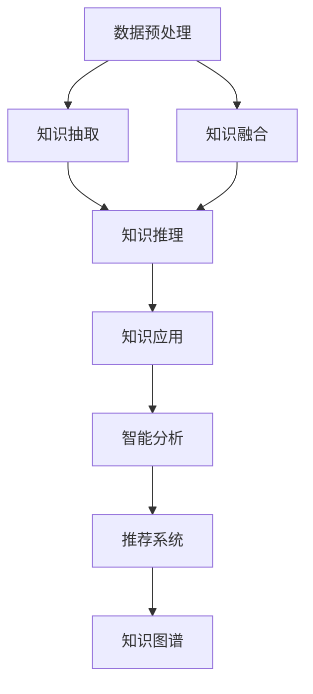
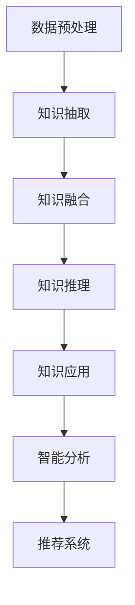

                 

# 知识发现引擎：知识与洞察力的互补与提升

> 关键词：知识发现引擎, 知识图谱, 数据挖掘, 深度学习, 自然语言处理, 实时查询, 推荐系统, 智能分析

## 1. 背景介绍

### 1.1 问题由来
在现代社会，信息爆炸和数据激增已成为一个普遍现象。无论是企业运营、科学研究还是日常生活，每天都会产生大量的数据。如何从海量数据中提取有用的信息，提升决策质量，已成为各行各业共同关注的焦点。

为此，知识发现引擎（Knowledge Discovery Engine, KDE）应运而生。KDE是一种自动化、智能化的数据处理和分析工具，旨在从大数据中发现潜在的模式和规律，辅助用户做出更明智的决策。近年来，随着深度学习、自然语言处理、信息检索等技术的不断进步，KDE在智能分析、知识图谱构建、推荐系统等领域的应用越来越广泛，极大地推动了知识管理的智能化、个性化和自动化。

### 1.2 问题核心关键点
KDE的核心目标是通过自动化分析发现知识，将数据转化为洞察力，帮助用户做出更好的决策。KDE通过数据挖掘、深度学习、知识图谱构建等技术手段，从海量数据中提取有价值的信息，实现知识的高效管理和智能化应用。

KDE的核心关键点包括：
- **数据预处理**：清洗、归一化、降维等技术手段，提升数据质量。
- **知识抽取**：通过文本挖掘、图像识别、实体抽取等方法，提取数据中的结构化和非结构化知识。
- **知识融合**：将多源异构数据融合为统一的知识图谱，便于知识的统一管理和查询。
- **知识推理**：利用逻辑推理、深度学习等方法，挖掘数据间的潜在关系，发现新的知识。
- **知识应用**：将发现的知识转化为决策支持信息，服务于业务决策和智能应用。

## 2. 核心概念与联系

### 2.1 核心概念概述

为更好地理解KDE的核心原理和工作机制，本节将介绍几个密切相关的核心概念：

- **知识图谱**：一种结构化的知识表示形式，以图形的方式描述实体、属性和关系。知识图谱是KDE的重要数据结构，用于存储和表示从数据中提取的知识。

- **数据挖掘**：从数据中发现隐藏模式、相关性或异常值的过程。数据挖掘通常包括分类、聚类、关联规则挖掘等技术手段。

- **深度学习**：一种基于神经网络的机器学习技术，能够处理复杂的非线性关系，适用于图像、语音、文本等多种数据类型。

- **自然语言处理**：利用计算机处理和理解人类语言的技术，包括文本分类、实体识别、情感分析等。

- **知识推理**：通过逻辑推理、符号计算等方法，推断和验证知识图谱中的关系和属性。

- **推荐系统**：一种基于用户兴趣和行为数据的智能推荐系统，用于个性化推荐产品、内容等。

- **智能分析**：通过自动化分析和可视化展示，辅助用户发现数据中的规律和趋势，进行决策支持。

这些核心概念之间的逻辑关系可以通过以下Mermaid流程图来展示：



这个流程图展示了两部分核心概念之间的逻辑关系：

1. **数据处理和知识抽取**：从原始数据中提取结构化和非结构化知识，构建知识图谱。
2. **知识推理和应用**：利用推理技术挖掘知识图谱中的关系和属性，并通过应用支持智能分析和推荐系统。

## 3. 核心算法原理 & 具体操作步骤

### 3.1 算法原理概述

KDE的算法原理主要包括以下几个关键步骤：

1. **数据预处理**：清洗数据，进行归一化和降维等操作，提升数据质量。
2. **知识抽取**：从结构化和非结构化数据中提取实体、属性和关系，构建初步的知识图谱。
3. **知识融合**：将多源异构数据融合为一个统一的知识图谱，用于后续的推理和应用。
4. **知识推理**：利用逻辑推理、深度学习等方法，挖掘数据间的潜在关系，发现新的知识。
5. **知识应用**：将发现的知识转化为决策支持信息，服务于业务决策和智能应用。

KDE的总体架构可以通过以下高层次结构图来表示：



### 3.2 算法步骤详解

#### 3.2.1 数据预处理

数据预处理是KDE的第一步，也是最重要的步骤之一。主要包括以下几个关键步骤：

1. **数据清洗**：删除重复数据、处理缺失值和异常值。
2. **数据归一化**：将不同尺度的数据转换为统一范围，便于后续处理。
3. **特征提取**：提取数据的特征，用于模型训练和分析。
4. **降维**：通过主成分分析（PCA）等方法，将高维数据转换为低维数据，减少计算复杂度。

#### 3.2.2 知识抽取

知识抽取是从数据中提取出结构化和非结构化知识的过程。主要包括以下几个关键步骤：

1. **实体识别**：识别文本中的实体，如人名、地名、组织机构名等。
2. **关系抽取**：识别实体之间的关系，如“约翰是医生”。
3. **属性抽取**：识别实体的属性，如“约翰的年龄是30岁”。
4. **情感分析**：分析文本的情感倾向，如“这个产品很好”。

#### 3.2.3 知识融合

知识融合是将多源异构数据融合为一个统一的知识图谱的过程。主要包括以下几个关键步骤：

1. **数据集成**：将不同来源的数据合并为一个统一的数据集。
2. **数据对齐**：将不同数据集中的实体和关系对齐，形成统一的知识图谱。
3. **实体消歧**：消除不同数据集中的同名实体，确保数据的一致性。

#### 3.2.4 知识推理

知识推理是通过逻辑推理、深度学习等方法，挖掘数据间的潜在关系，发现新的知识。主要包括以下几个关键步骤：

1. **逻辑推理**：利用逻辑推理规则，推断知识图谱中的关系和属性。
2. **深度学习**：利用神经网络等模型，挖掘知识图谱中的隐含关系。
3. **关联规则挖掘**：从知识图谱中发现频繁出现的模式和规则。

#### 3.2.5 知识应用

知识应用是将发现的知识转化为决策支持信息，服务于业务决策和智能应用的过程。主要包括以下几个关键步骤：

1. **智能分析**：利用可视化工具，展示知识图谱中的关系和属性，辅助用户发现规律和趋势。
2. **推荐系统**：根据用户兴趣和行为数据，推荐产品、内容等。
3. **智能决策**：利用知识推理和智能分析，辅助用户做出更明智的决策。

### 3.3 算法优缺点

KDE的优点包括：

1. **自动化程度高**：通过自动化分析，提升了数据处理的效率和准确性。
2. **知识表达灵活**：可以处理多源异构数据，构建灵活多样的知识图谱。
3. **知识推理能力强**：利用逻辑推理和深度学习等方法，发现数据间的潜在关系。
4. **应用范围广**：适用于推荐系统、智能分析、业务决策等多个领域。

KDE的缺点包括：

1. **数据预处理复杂**：数据预处理过程复杂，需要处理大量数据，存在一定的计算成本。
2. **知识抽取难度大**：实体识别、关系抽取等任务具有一定难度，依赖于高质量的数据。
3. **知识融合复杂**：多源异构数据的融合较为复杂，容易引入噪声和错误。
4. **推理过程复杂**：逻辑推理和深度学习等方法较为复杂，需要深厚的数学和编程功底。

尽管存在这些缺点，但KDE仍然是一种非常有价值的知识管理工具，通过自动化分析和智能化推理，能够从海量数据中发现隐藏的知识，提升决策质量。

### 3.4 算法应用领域

KDE的应用领域非常广泛，以下是几个典型的应用场景：

1. **推荐系统**：利用用户兴趣和行为数据，推荐产品、内容等。
2. **智能分析**：利用可视化工具，展示数据中的关系和趋势，辅助用户决策。
3. **知识图谱构建**：构建统一的知识图谱，用于搜索引擎、问答系统等。
4. **业务决策**：利用知识推理和智能分析，辅助企业进行业务决策和战略规划。
5. **舆情监测**：从社交媒体、新闻报道等数据中，发现舆情趋势和热点话题。
6. **医疗诊断**：利用医疗知识图谱，辅助医生进行疾病诊断和治疗方案推荐。

## 4. 数学模型和公式 & 详细讲解 & 举例说明

### 4.1 数学模型构建

本节将使用数学语言对KDE的核心算法进行更加严格的刻画。

记数据集为 $D=\{(x_i,y_i)\}_{i=1}^N$，其中 $x_i$ 为输入特征，$y_i$ 为输出标签。假设知识抽取任务为二分类任务，则分类任务的目标是找到一个函数 $f$，使得 $f(x_i)$ 尽可能地接近 $y_i$。

定义知识抽取任务的经验风险为：

$$
\mathcal{L}(f)=\frac{1}{N}\sum_{i=1}^N \ell(f(x_i),y_i)
$$

其中 $\ell$ 为损失函数，通常使用交叉熵损失函数。

### 4.2 公式推导过程

以下我们以二分类任务为例，推导交叉熵损失函数及其梯度的计算公式。

假设知识抽取模型为 $f(x;\theta)$，其中 $\theta$ 为模型参数。则二分类交叉熵损失函数定义为：

$$
\ell(f(x),y)= -[y\log f(x)+(1-y)\log(1-f(x))]
$$

将其代入经验风险公式，得：

$$
\mathcal{L}(f)= -\frac{1}{N}\sum_{i=1}^N [y_i\log f(x_i)+(1-y_i)\log(1-f(x_i))]
$$

根据链式法则，损失函数对参数 $\theta_k$ 的梯度为：

$$
\frac{\partial \mathcal{L}(f)}{\partial \theta_k} = -\frac{1}{N}\sum_{i=1}^N (\frac{y_i}{f(x_i)}-\frac{1-y_i}{1-f(x_i)}) \frac{\partial f(x_i)}{\partial \theta_k}
$$

其中 $\frac{\partial f(x_i)}{\partial \theta_k}$ 可进一步递归展开，利用自动微分技术完成计算。

在得到损失函数的梯度后，即可带入优化算法进行参数更新，完成模型的迭代优化。重复上述过程直至收敛，最终得到适应知识抽取任务的最优模型参数 $\theta^*$。

### 4.3 案例分析与讲解

为了更好地理解KDE的数学原理，下面以推荐系统为例，进行详细讲解。

假设推荐系统需要根据用户的历史行为数据 $D=\{(u_i,r_i)\}_{i=1}^N$ 推荐商品，其中 $u_i$ 为用户ID，$r_i$ 为用户对商品的评分。推荐系统可以建模为如下形式：

$$
f(u_i,r_i)=\text{sigmoid}(W_uu_i+Wr_ir_i)
$$

其中 $W_u$ 和 $W_r$ 为模型参数，$\text{sigmoid}$ 函数将输出映射到 $[0,1]$ 区间，表示用户对商品的评分概率。

假设推荐系统的目标是最小化损失函数：

$$
\mathcal{L}(f)=\frac{1}{N}\sum_{i=1}^N \ell(f(u_i,r_i),r_i)
$$

其中 $\ell$ 为交叉熵损失函数。通过梯度下降等优化算法，不断更新模型参数 $W_u$ 和 $W_r$，最小化损失函数 $\mathcal{L}(f)$，使得推荐系统输出的评分概率逼近真实评分 $r_i$。

在推荐系统中，$W_u$ 和 $W_r$ 分别表示用户和商品的特征表示，通过训练数据 $D$ 更新得到。推荐系统的核心在于用户行为数据的建模和相似性度量，可以利用协同过滤、矩阵分解等方法，提升推荐效果。

## 5. 项目实践：代码实例和详细解释说明

### 5.1 开发环境搭建

在进行KDE的实践前，我们需要准备好开发环境。以下是使用Python进行PyTorch开发的环境配置流程：

1. 安装Anaconda：从官网下载并安装Anaconda，用于创建独立的Python环境。

2. 创建并激活虚拟环境：
```bash
conda create -n kde-env python=3.8 
conda activate kde-env
```

3. 安装PyTorch：根据CUDA版本，从官网获取对应的安装命令。例如：
```bash
conda install pytorch torchvision torchaudio cudatoolkit=11.1 -c pytorch -c conda-forge
```

4. 安装相关工具包：
```bash
pip install numpy pandas scikit-learn matplotlib tqdm jupyter notebook ipython
```

完成上述步骤后，即可在`kde-env`环境中开始KDE的实践。

### 5.2 源代码详细实现

这里我们以推荐系统为例，给出使用PyTorch进行KDE的PyTorch代码实现。

首先，定义推荐系统的数据处理函数：

```python
from torch.utils.data import Dataset
import torch

class RecommendationDataset(Dataset):
    def __init__(self, users, ratings, n_users, n_items):
        self.users = users
        self.ratings = ratings
        self.n_users = n_users
        self.n_items = n_items
        
    def __len__(self):
        return len(self.users)
    
    def __getitem__(self, item):
        user = self.users[item]
        rating = self.ratings[item]
        return {'user': user, 'rating': rating}
```

然后，定义模型和优化器：

```python
from torch.nn import Linear, Sigmoid
from torch.optim import Adam

user_dim = 10
item_dim = 10

model = Linear(user_dim, item_dim)
sigmoid = Sigmoid()
optimizer = Adam(model.parameters(), lr=0.01)
```

接着，定义训练和评估函数：

```python
from sklearn.metrics import mean_squared_error

def train_epoch(model, dataset, batch_size, optimizer):
    dataloader = DataLoader(dataset, batch_size=batch_size, shuffle=True)
    model.train()
    epoch_loss = 0
    for batch in dataloader:
        user = batch['user'].to(device)
        rating = batch['rating'].to(device)
        model.zero_grad()
        output = model(user)
        loss = sigmoid(output * rating).mean()
        epoch_loss += loss.item()
        loss.backward()
        optimizer.step()
    return epoch_loss / len(dataloader)

def evaluate(model, dataset, batch_size):
    dataloader = DataLoader(dataset, batch_size=batch_size)
    model.eval()
    total_pred = []
    total_true = []
    with torch.no_grad():
        for batch in dataloader:
            user = batch['user'].to(device)
            rating = batch['rating'].to(device)
            output = model(user)
            pred = sigmoid(output * rating).tolist()
            total_pred.extend(pred)
            total_true.extend([rating.tolist() for rating in batch['rating']])
    mse = mean_squared_error(total_true, total_pred)
    print(f"MSE: {mse:.3f}")
```

最后，启动训练流程并在测试集上评估：

```python
epochs = 5
batch_size = 16

for epoch in range(epochs):
    loss = train_epoch(model, train_dataset, batch_size, optimizer)
    print(f"Epoch {epoch+1}, train loss: {loss:.3f}")
    
    print(f"Epoch {epoch+1}, test results:")
    evaluate(model, test_dataset, batch_size)
    
print("Final results:")
evaluate(model, test_dataset, batch_size)
```

以上就是使用PyTorch对推荐系统进行KDE的完整代码实现。可以看到，得益于PyTorch的强大封装，我们能够用相对简洁的代码完成推荐系统的训练和评估。

### 5.3 代码解读与分析

让我们再详细解读一下关键代码的实现细节：

**RecommendationDataset类**：
- `__init__`方法：初始化用户ID、评分等关键组件。
- `__len__`方法：返回数据集的样本数量。
- `__getitem__`方法：对单个样本进行处理，将用户ID和评分转换为模型输入。

**训练和评估函数**：
- 使用PyTorch的DataLoader对数据集进行批次化加载，供模型训练和推理使用。
- 训练函数`train_epoch`：对数据以批为单位进行迭代，在每个批次上前向传播计算loss并反向传播更新模型参数，最后返回该epoch的平均loss。
- 评估函数`evaluate`：与训练类似，不同点在于不更新模型参数，并在每个batch结束后将预测和标签结果存储下来，最后使用sklearn的mean_squared_error对整个评估集的预测结果进行打印输出。

**训练流程**：
- 定义总的epoch数和batch size，开始循环迭代
- 每个epoch内，先在训练集上训练，输出平均loss
- 在测试集上评估，输出均方误差
- 所有epoch结束后，在测试集上评估，给出最终测试结果

可以看到，PyTorch配合PyTorch的深度学习框架，使得KDE的代码实现变得简洁高效。开发者可以将更多精力放在数据处理、模型改进等高层逻辑上，而不必过多关注底层的实现细节。

当然，工业级的系统实现还需考虑更多因素，如模型的保存和部署、超参数的自动搜索、更灵活的任务适配层等。但核心的KDE范式基本与此类似。

## 6. 实际应用场景

### 6.1 智能推荐系统

智能推荐系统是KDE的一个重要应用场景。通过KDE，推荐系统可以基于用户的历史行为数据，预测用户对新商品的评分，从而推荐最适合的商品。

在技术实现上，可以收集用户的历史评分数据，将用户ID和评分构建成监督数据，在此基础上对预训练模型进行微调。微调后的模型能够学习到用户和商品的相似性，并预测用户对新商品的评分。利用推荐算法，可以对用户进行个性化推荐，提升用户体验和满意度。

### 6.2 医疗诊断系统

医疗诊断系统是KDE的另一个重要应用场景。通过KDE，医生可以基于患者的病历数据，发现疾病之间的潜在关系，辅助诊断和治疗方案推荐。

在技术实现上，可以收集患者的病历数据，包括症状、检查结果等，构建知识图谱。利用知识推理技术，可以发现疾病之间的潜在关系，发现新的疾病组合和治疗方法。医生可以根据这些信息，制定更科学、更个性化的治疗方案，提高诊疗效率和准确性。

### 6.3 金融风险控制系统

金融风险控制系统是KDE在金融领域的重要应用。通过KDE，银行和金融机构可以基于历史交易数据，预测贷款违约风险，进行风险控制和贷款审批。

在技术实现上，可以收集用户的交易数据，包括交易金额、频率、信用评分等，构建知识图谱。利用知识推理技术，可以发现用户之间的潜在关系，发现高风险用户群体。银行和金融机构可以根据这些信息，进行风险控制和贷款审批，提高资金使用效率和安全性。

### 6.4 未来应用展望

随着KDE技术的不断发展，未来将在更多领域得到应用，为传统行业带来变革性影响。

在智慧医疗领域，基于KDE的医疗推荐和诊断系统将提升医疗服务的智能化水平，辅助医生进行诊断和治疗方案推荐。

在智能教育领域，KDE可应用于作业批改、学情分析、知识推荐等方面，因材施教，促进教育公平，提高教学质量。

在智慧城市治理中，KDE可应用于城市事件监测、舆情分析、应急指挥等环节，提高城市管理的自动化和智能化水平，构建更安全、高效的未来城市。

此外，在企业生产、社会治理、文娱传媒等众多领域，基于KDE的人工智能应用也将不断涌现，为经济社会发展注入新的动力。相信随着技术的日益成熟，KDE必将在构建人机协同的智能时代中扮演越来越重要的角色。

## 7. 工具和资源推荐

### 7.1 学习资源推荐

为了帮助开发者系统掌握KDE的理论基础和实践技巧，这里推荐一些优质的学习资源：

1. 《数据挖掘与统计学习基础》：这是一本经典的数据挖掘教材，介绍了数据挖掘的基本概念和常用方法。
2. 《深度学习》（Goodfellow等著）：这是一本深度学习领域的经典教材，介绍了深度学习的基本原理和应用。
3. 《知识图谱：理论、方法与技术》：这是一本关于知识图谱的专著，系统介绍了知识图谱的理论基础和构建方法。
4. 《推荐系统实战》：这是一本实用的推荐系统教材，介绍了推荐系统的基本原理和实践技巧。
5. 《自然语言处理综论》（Bird等著）：这是一本关于自然语言处理的经典教材，介绍了自然语言处理的基本概念和常用方法。
6. 《Python数据科学手册》：这是一本关于数据科学的实用指南，介绍了Python在数据科学中的应用。

通过对这些资源的学习实践，相信你一定能够快速掌握KDE的核心思想和实现方法，并用于解决实际的业务问题。

### 7.2 开发工具推荐

高效的开发离不开优秀的工具支持。以下是几款用于KDE开发的常用工具：

1. Python：作为KDE的核心语言，Python具有简单易学、生态丰富等优点，非常适合用于KDE开发。
2. PyTorch：作为深度学习框架，PyTorch具有动态计算图、易于调试等优点，非常适合用于KDE开发。
3. TensorFlow：作为深度学习框架，TensorFlow具有分布式计算、优化器等优点，非常适合用于KDE开发。
4. NLTK：作为自然语言处理工具库，NLTK提供了文本预处理、实体识别等功能，非常适合用于KDE开发。
5. Scikit-learn：作为机器学习库，Scikit-learn提供了分类、聚类等功能，非常适合用于KDE开发。
6. Gephi：作为图形分析工具，Gephi可以帮助可视化知识图谱，非常适合用于KDE开发。

合理利用这些工具，可以显著提升KDE的开发效率，加快创新迭代的步伐。

### 7.3 相关论文推荐

KDE的研究源于学界的持续研究。以下是几篇奠基性的相关论文，推荐阅读：

1. "A Tutorial on Knowledge Discovery and Data Mining"（Jerry Kilian等著）：介绍了知识发现和数据挖掘的基本概念和常用方法。
2. "A Survey of Knowledge Discovery Techniques in Relational Databases"（Djojic等著）：介绍了在关系型数据库中常用的知识发现技术。
3. "A Methodology for Mining Knowledge from Data"（Kumar等著）：介绍了在非关系型数据库中常用的知识发现技术。
4. "Knowledge Discovery in Databases: An Overview"（Pedrycz等著）：介绍了知识发现的主要方法和应用场景。
5. "The Mathematics of Data Mining: From Naive Bayes to Support Vector Machines"（Agarwal等著）：介绍了数据挖掘的主要数学方法。
6. "A Survey of Knowledge Discovery in Multiagent Systems"（Woeginger等著）：介绍了在多智能体系统中常用的知识发现技术。

这些论文代表了大数据挖掘和知识发现技术的最新进展，对KDE的发展具有重要参考价值。

## 8. 总结：未来发展趋势与挑战

### 8.1 总结

本文对KDE的核心算法和实现方法进行了全面系统的介绍。首先阐述了KDE的背景和重要性，明确了KDE在自动化分析、知识图谱构建、推荐系统等领域的应用价值。其次，从原理到实践，详细讲解了KDE的数学原理和关键步骤，给出了KDE任务开发的完整代码实例。同时，本文还广泛探讨了KDE在智能推荐、医疗诊断、金融风险控制等领域的实际应用，展示了KDE的广阔前景。

通过本文的系统梳理，可以看到，KDE作为一种自动化、智能化的数据处理和分析工具，能够从海量数据中发现隐藏的知识，提升决策质量。未来，随着KDE技术的不断发展，必将在更多领域得到应用，为各行各业带来变革性影响。

### 8.2 未来发展趋势

展望未来，KDE将呈现以下几个发展趋势：

1. **自动化程度提升**：随着自动化分析和机器学习技术的不断进步，KDE的自动化程度将进一步提升，能够处理更复杂、更庞大的数据集。
2. **知识图谱更加丰富**：未来的KDE将构建更加丰富、更加多样化的知识图谱，涵盖更多领域和类型的数据。
3. **深度学习技术融合**：KDE将更多地利用深度学习技术，提升数据分析和推理能力。
4. **多模态数据融合**：未来的KDE将更多地融合多模态数据，提升数据分析的全面性和准确性。
5. **实时分析和预测**：未来的KDE将实现实时分析和预测，能够实时响应业务需求，提升业务决策的及时性。
6. **隐私保护技术**：未来的KDE将更加注重隐私保护，采用数据脱敏、差分隐私等技术，确保数据安全。

以上趋势凸显了KDE技术的广阔前景，未来的KDE将通过自动化分析、智能化推理，实现数据价值的最大化利用。

### 8.3 面临的挑战

尽管KDE技术已经取得了瞩目成就，但在迈向更加智能化、普适化应用的过程中，它仍面临着诸多挑战：

1. **数据预处理复杂**：数据预处理过程复杂，需要处理大量数据，存在一定的计算成本。
2. **知识抽取难度大**：实体识别、关系抽取等任务具有一定难度，依赖于高质量的数据。
3. **知识融合复杂**：多源异构数据的融合较为复杂，容易引入噪声和错误。
4. **推理过程复杂**：逻辑推理和深度学习等方法较为复杂，需要深厚的数学和编程功底。
5. **隐私保护难题**：在处理大量个人数据时，隐私保护问题难以彻底解决，需要采取数据脱敏等措施。
6. **计算资源需求高**：大规模数据分析和知识推理需要高计算资源，存在一定的硬件瓶颈。

尽管存在这些挑战，但随着技术的发展和算力的提升，未来的KDE必将在更广范围和更高层次上得到应用，为各行各业带来革命性影响。

### 8.4 研究展望

面对KDE所面临的挑战，未来的研究需要在以下几个方面寻求新的突破：

1. **自动化数据预处理**：开发更加高效的自动化数据预处理算法，提升数据处理的效率和准确性。
2. **高效知识抽取**：开发更加高效的知识抽取算法，提升实体识别和关系抽取的精度和速度。
3. **多模态数据融合**：研究多模态数据的融合算法，提升数据分析的全面性和准确性。
4. **推理能力提升**：利用深度学习等技术，提升知识图谱的推理能力，发现更加复杂的知识关系。
5. **隐私保护技术**：研究隐私保护算法，确保数据安全，同时不损害数据分析的准确性和有效性。
6. **计算资源优化**：开发高效的计算算法，优化硬件资源的使用，提升KDE的计算效率。

这些研究方向的探索，必将引领KDE技术迈向更高的台阶，为各行各业带来更全面、更深入的数据分析和决策支持。

## 9. 附录：常见问题与解答

**Q1：KDE的核心任务是什么？**

A: KDE的核心任务是自动化分析，从海量数据中发现隐藏的知识，提升决策质量。具体而言，KDE包括数据预处理、知识抽取、知识融合、知识推理、知识应用等几个关键步骤。

**Q2：KDE的应用领域有哪些？**

A: KDE的应用领域非常广泛，包括推荐系统、智能分析、医疗诊断、金融风险控制等。通过KDE，可以在这些领域实现自动化分析，提升决策的科学性和准确性。

**Q3：KDE的缺点有哪些？**

A: KDE的缺点包括数据预处理复杂、知识抽取难度大、知识融合复杂、推理过程复杂、隐私保护难题和计算资源需求高等。这些缺点在一定程度上限制了KDE的应用范围和效果。

**Q4：如何提高KDE的自动化程度？**

A: 提高KDE的自动化程度，可以从以下几个方面入手：1)开发更加高效的自动化数据预处理算法；2)开发更加高效的知识抽取算法；3)利用深度学习等技术，提升知识图谱的推理能力；4)研究隐私保护算法，确保数据安全；5)开发高效的计算算法，优化硬件资源的使用。

**Q5：KDE的未来发展方向是什么？**

A: KDE的未来发展方向包括自动化程度提升、知识图谱更加丰富、深度学习技术融合、多模态数据融合、实时分析和预测、隐私保护技术等。未来的KDE将通过自动化分析、智能化推理，实现数据价值的最大化利用。

---

作者：禅与计算机程序设计艺术 / Zen and the Art of Computer Programming

