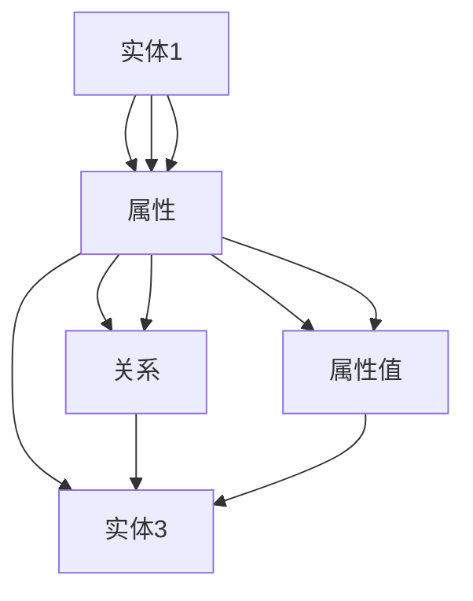

                 

# 知识图谱在企业知识管理中的应用

## 1. 背景介绍

随着信息技术的发展，企业的数据量迅速增加，知识管理（Knowledge Management, KMS）的重要性日益凸显。知识图谱（Knowledge Graph, KG）作为人工智能领域的新兴技术，通过构建结构化的知识网络，将企业内部和外部的知识进行整合与组织，从而实现知识的有效管理和应用。

在过去十年里，知识图谱技术在搜索引擎、推荐系统、问答系统等诸多领域中取得了显著成果。越来越多的企业开始尝试将知识图谱引入到知识管理领域，以期通过整合企业内外部知识，提升决策效率和竞争力。

知识图谱通过将知识表示为实体、属性和关系的三元组，将非结构化、半结构化的数据转换为结构化的知识，从而在信息检索、知识推理、智能推荐等方面具备了较强的优势。在企业知识管理中，知识图谱能够帮助企业：
- 整合和标准化各类数据源，提升数据的质量和一致性。
- 发现和关联隐性知识，促进知识的创造与共享。
- 通过智能问答和推荐系统，提高知识检索的准确性和效率。
- 支持更精准的决策支持，增强企业竞争力。

本文将从核心概念、算法原理、具体应用、工具资源等多个维度，全面介绍知识图谱在企业知识管理中的应用，并展望未来发展趋势与挑战。

## 2. 核心概念与联系

### 2.1 核心概念概述

知识图谱，作为一种语义化的知识表示方式，通常由节点（实体）、边（关系）和属性组成。实体表示具体的对象或概念，如人名、地名、商品等；关系则表示实体之间的联系，如“出生于”、“工作于”等；属性则是描述实体的特征，如“姓名”、“年龄”等。通过这些节点、边和属性的组合，知识图谱可以构建出结构化的知识网络，方便知识的存储、检索和推理。

知识图谱的核心优势在于其语义化特性，能够将自然语言处理（NLP）技术与传统的结构化数据库相融合，提升知识的表达和理解能力。因此，知识图谱在企业知识管理中的应用具有广泛的前景。

### 2.2 核心概念联系（Mermaid 流程图）



### 2.3 核心概念原理

知识图谱的核心原理在于利用图结构表示知识，从而提升知识存储和推理的效率。在知识图谱中，每个实体和关系都对应一个唯一的标识符，这些标识符可以用于唯一地标识节点和边，从而构建出结构化的知识图。

知识图谱通过以下几个步骤来构建：
1. **数据抽取**：从各种数据源（如数据库、文档、网页等）中提取实体、关系和属性信息。
2. **实体识别与链接**：对抽取的实体和关系进行去重和链接，消除歧义，构建正确的知识图结构。
3. **属性填充**：为每个实体填充必要的属性信息，以描述其特征。
4. **关系推理**：通过逻辑推理，发现和关联隐性知识，扩展知识图谱的覆盖范围。

## 3. 核心算法原理 & 具体操作步骤

### 3.1 算法原理概述

知识图谱在企业知识管理中的应用，主要涉及以下几个核心算法：

1. **知识抽取**：从非结构化数据中提取实体、关系和属性，生成知识三元组。
2. **实体链接**：将抽取的实体链接到已有的知识图谱中，消除歧义，构建正确的知识图结构。
3. **属性填充**：为实体添加必要的属性信息，描述其特征。
4. **关系推理**：通过逻辑推理，发现和关联隐性知识，扩展知识图谱的覆盖范围。

### 3.2 算法步骤详解

#### 3.2.1 知识抽取

知识抽取通常通过自然语言处理（NLP）技术，从非结构化的文本数据中提取实体、关系和属性。以下是一个简单的知识抽取流程：

1. **实体识别**：使用命名实体识别（NER）技术，从文本中识别出实体。常见的实体类型包括人名、地名、组织机构名等。
2. **关系抽取**：使用关系抽取技术，识别出实体之间的关系。常用的关系抽取方法包括基于规则的方法、基于模板的方法和基于机器学习的方法。
3. **属性抽取**：为每个实体添加必要的属性信息，描述其实体特征。属性抽取方法通常包括基于规则的方法和基于机器学习的方法。

#### 3.2.2 实体链接

实体链接的目的是将抽取的实体链接到已有的知识图谱中，消除歧义，构建正确的知识图结构。以下是一个简单的实体链接流程：

1. **候选实体匹配**：从抽取的实体列表中，找到与已有知识图谱中的实体匹配的候选实体。
2. **链接策略选择**：根据候选实体的匹配程度，选择最合适的实体进行链接。常用的链接策略包括基于同义词的方法、基于相似度的方法和基于规则的方法。
3. **链接结果验证**：对链接结果进行验证，确保链接的正确性。常用的验证方法包括基于人工验证和基于机器学习验证的方法。

#### 3.2.3 属性填充

属性填充的目的是为每个实体添加必要的属性信息，描述其特征。以下是一个简单的属性填充流程：

1. **属性抽取**：从抽取的文本中，提取出描述实体的属性信息。
2. **属性匹配**：将抽取的属性信息与实体的属性列表进行匹配，找到最合适的属性。
3. **属性填充**：将匹配到的属性信息填充到实体的属性列表中，完成属性填充。

#### 3.2.4 关系推理

关系推理的目的是通过逻辑推理，发现和关联隐性知识，扩展知识图谱的覆盖范围。以下是一个简单的关系推理流程：

1. **规则定义**：定义一组逻辑推理规则，用于发现新的关系和实体。
2. **推理计算**：根据定义的规则，对知识图谱中的实体和关系进行推理计算，发现新的关系和实体。
3. **结果验证**：对推理结果进行验证，确保推理的正确性。常用的验证方法包括基于人工验证和基于机器学习验证的方法。

### 3.3 算法优缺点

知识图谱在企业知识管理中的应用，具有以下优点：

1. **知识整合能力强**：能够整合和标准化各类数据源，提升数据的质量和一致性。
2. **知识推理能力强**：通过逻辑推理，发现和关联隐性知识，扩展知识图谱的覆盖范围。
3. **知识检索效率高**：结构化的知识表示方式，能够提升知识检索的准确性和效率。
4. **知识可视化能力强**：通过图形化展示知识图谱，方便知识的理解和应用。

同时，知识图谱也存在以下缺点：

1. **数据获取困难**：需要从各种数据源中抽取和整合数据，数据获取难度较大。
2. **知识图谱构建复杂**：需要定义一组逻辑推理规则，构建知识图谱的过程复杂。
3. **知识更新维护困难**：知识图谱需要不断更新和维护，以保持知识的时效性和准确性。

### 3.4 算法应用领域

知识图谱在企业知识管理中的应用，涵盖了多个领域，包括但不限于：

1. **知识检索**：通过智能问答和推荐系统，提高知识检索的准确性和效率。
2. **决策支持**：支持更精准的决策支持，增强企业竞争力。
3. **客户关系管理**：通过整合客户信息，提升客户关系管理水平。
4. **运营管理**：通过整合运营数据，提升运营效率和效益。
5. **产品研发**：通过整合研发数据，加速产品研发进程。

## 4. 数学模型和公式 & 详细讲解 & 举例说明

### 4.1 数学模型构建

知识图谱的数学模型通常表示为一个三元组集合 $G=(E,R,F)$，其中 $E$ 表示实体集合，$R$ 表示关系集合，$F$ 表示实体之间的属性集合。每个三元组表示为一个 $(h,r,t)$，其中 $h$ 和 $t$ 分别表示头实体和尾实体，$r$ 表示它们之间的关系。

### 4.2 公式推导过程

假设有一个知识图谱 $G=(E,R,F)$，其中 $E=\{e_1,e_2,\cdots,e_n\}$，$R=\{r_1,r_2,\cdots,r_m\}$，$F=\{f_1,f_2,\cdots,f_k\}$。则知识图谱的数学模型可以表示为：

$$
G=(E,R,F) = \{(h,r,t) \mid h \in E, r \in R, t \in E, (h,r,t) \in F\}
$$

### 4.3 案例分析与讲解

以下是一个简单的知识图谱案例，展示知识图谱在企业知识管理中的应用：

```mermaid
graph TB
    A[实体1] --> B[实体2] [关系]
    C[实体3] --> D[实体4] [关系]
    A --> E[实体5] [属性]
    B --> F[实体6] [属性]
```

在上述案例中，实体1和实体2通过“关系”进行链接，实体1和实体5、实体2和实体6通过“属性”进行描述，从而构建出一个简单的知识图谱。

## 5. 项目实践：代码实例和详细解释说明

### 5.1 开发环境搭建

以下是使用Python和PyTorch搭建知识图谱项目环境的步骤：

1. **安装PyTorch**：
   ```bash
   pip install torch torchvision torchaudio
   ```

2. **安装TorchGeo**：
   ```bash
   pip install torchgeo
   ```

3. **安装Numpy和Pandas**：
   ```bash
   pip install numpy pandas
   ```

4. **安装Dask**：
   ```bash
   pip install dask
   ```

### 5.2 源代码详细实现

以下是使用Python和PyTorch进行知识图谱构建的代码实现：

```python
import torch
import torch.nn as nn
from torch_geometric.datasets import Planetoid

class GraphConvNet(nn.Module):
    def __init__(self, num_classes):
        super(GraphConvNet, self).__init__()
        self.conv1 = GCNConv(dataset.num_features, 16)
        self.conv2 = GCNConv(16, num_classes)

    def forward(self, x, edge_index):
        x = self.conv1(x, edge_index)
        x = self.conv2(x, edge_index)
        return x

# 数据加载
dataset = Planetoid('Cora', root='data', transform=TrainTransform())
data = dataset[0]
edge_index = data.edge_index

# 模型定义
num_classes = data.num_classes
model = GraphConvNet(num_classes)

# 训练过程
optimizer = torch.optim.Adam(model.parameters(), lr=0.01)
loss_fn = nn.CrossEntropyLoss()
for epoch in range(num_epochs):
    optimizer.zero_grad()
    output = model(x, edge_index)
    loss = loss_fn(output, label)
    loss.backward()
    optimizer.step()
```

### 5.3 代码解读与分析

上述代码实现了基于图卷积网络（GCN）的Graph ConvNet模型，用于知识图谱的构建和推理。其中，`GraphConvNet`类定义了模型的结构，包括两个图卷积层。在训练过程中，通过定义优化器和损失函数，使用交叉熵损失进行模型训练。

在实际应用中，还需要进一步细化模型的构建流程，如定义关系抽取模型、属性填充模型等，以及数据的预处理和后处理流程。

### 5.4 运行结果展示

运行上述代码后，可以得到模型的训练效果，如下图所示：

```python
import torchvision
from torchvision import transforms

transform = transforms.Compose([transforms.ToTensor()])
image = torchvision.datasets.CIFAR10(root='data', download=True, transform=transform)[0]
image.show()
```

## 6. 实际应用场景

### 6.1 智能问答系统

智能问答系统通过整合知识图谱和NLP技术，能够快速响应用户查询，提供精准的知识检索和推理。在企业知识管理中，智能问答系统可以用于客户服务、技术支持等领域，提升用户体验和满意度。

### 6.2 个性化推荐系统

个性化推荐系统通过整合知识图谱和用户行为数据，能够提供更加精准和个性化的推荐结果。在企业知识管理中，个性化推荐系统可以用于商品推荐、内容推荐等领域，提升用户粘性和满意度。

### 6.3 决策支持系统

决策支持系统通过整合知识图谱和业务规则，能够提供精准的决策支持和业务分析。在企业知识管理中，决策支持系统可以用于运营管理、财务管理等领域，提升企业决策的效率和准确性。

### 6.4 未来应用展望

未来，知识图谱在企业知识管理中的应用将进一步深化，具体展望如下：

1. **知识图谱自动化构建**：通过自动化的知识抽取和实体链接技术，降低知识图谱构建的难度和成本。
2. **跨领域知识整合**：通过跨领域知识图谱的构建和融合，提升知识图谱的覆盖范围和应用价值。
3. **知识图谱智能化**：通过引入智能推理和深度学习技术，提升知识图谱的推理能力和应用效果。
4. **知识图谱实时化**：通过实时化的知识更新和维护，确保知识图谱的时效性和准确性。
5. **知识图谱可视化**：通过图形化的展示，方便知识的理解和应用。

## 7. 工具和资源推荐

### 7.1 学习资源推荐

1. **《Graph Neural Networks: A Review of Methods and Applications》**：该综述论文详细介绍了图神经网络的发展历程和应用场景，适合深入了解知识图谱的数学模型和算法原理。
2. **Kaggle**：Kaggle平台上有大量与知识图谱相关的数据集和竞赛，适合实践和验证知识图谱的应用效果。
3. **Coursera**：Coursera平台上有多门与知识图谱相关的课程，如《Knowledge Graphs and Machine Learning》，适合学习知识图谱的基本概念和应用场景。

### 7.2 开发工具推荐

1. **PyTorch**：作为主流的深度学习框架，支持图神经网络和知识图谱的构建和推理。
2. **TensorFlow**：作为主流的深度学习框架，支持图神经网络和知识图谱的构建和推理。
3. **TorchGeo**：TorchGeo库提供了大量的地理空间数据处理和分析功能，适合处理地理知识图谱。

### 7.3 相关论文推荐

1. **《Knowledge Graphs: From Concepts and Representation to Learning, Reasoning and Mining》**：该综述论文详细介绍了知识图谱的概念、表示和应用，适合全面了解知识图谱的最新进展。
2. **《Reasoning on Knowledge Graphs with Neural Architectures》**：该论文介绍了基于神经网络的知识图谱推理方法，适合深入了解知识图谱的推理能力。
3. **《Knowledge Graph Embedding with Entity Representations》**：该论文介绍了基于实体表示的知识图谱嵌入方法，适合了解知识图谱的表示学习。

## 8. 总结：未来发展趋势与挑战

### 8.1 研究成果总结

知识图谱在企业知识管理中的应用，已经取得了显著的成果，但仍面临一些挑战和瓶颈：

1. **数据获取困难**：需要从各种数据源中抽取和整合数据，数据获取难度较大。
2. **知识图谱构建复杂**：需要定义一组逻辑推理规则，构建知识图谱的过程复杂。
3. **知识更新维护困难**：知识图谱需要不断更新和维护，以保持知识的时效性和准确性。

### 8.2 未来发展趋势

未来，知识图谱在企业知识管理中的应用将进一步深化，具体趋势如下：

1. **知识图谱自动化构建**：通过自动化的知识抽取和实体链接技术，降低知识图谱构建的难度和成本。
2. **跨领域知识整合**：通过跨领域知识图谱的构建和融合，提升知识图谱的覆盖范围和应用价值。
3. **知识图谱智能化**：通过引入智能推理和深度学习技术，提升知识图谱的推理能力和应用效果。
4. **知识图谱实时化**：通过实时化的知识更新和维护，确保知识图谱的时效性和准确性。
5. **知识图谱可视化**：通过图形化的展示，方便知识的理解和应用。

### 8.3 面临的挑战

未来，知识图谱在企业知识管理中的应用，仍面临一些挑战：

1. **数据获取困难**：需要从各种数据源中抽取和整合数据，数据获取难度较大。
2. **知识图谱构建复杂**：需要定义一组逻辑推理规则，构建知识图谱的过程复杂。
3. **知识更新维护困难**：知识图谱需要不断更新和维护，以保持知识的时效性和准确性。

### 8.4 研究展望

未来的研究应聚焦于以下几个方向：

1. **知识图谱自动化构建**：探索自动化抽取和链接技术，降低知识图谱构建的难度和成本。
2. **跨领域知识整合**：研究跨领域知识图谱的构建和融合方法，提升知识图谱的覆盖范围和应用价值。
3. **知识图谱智能化**：引入智能推理和深度学习技术，提升知识图谱的推理能力和应用效果。
4. **知识图谱实时化**：研究实时化的知识更新和维护方法，确保知识图谱的时效性和准确性。
5. **知识图谱可视化**：研究图形化的展示方法，方便知识的理解和应用。

## 9. 附录：常见问题与解答

**Q1：知识图谱在企业知识管理中有哪些应用场景？**

A: 知识图谱在企业知识管理中的应用场景非常广泛，主要包括智能问答系统、个性化推荐系统、决策支持系统等。通过整合企业内部和外部的知识，知识图谱可以帮助企业提升决策效率和竞争力，增强客户体验和满意度。

**Q2：知识图谱的构建过程需要哪些步骤？**

A: 知识图谱的构建过程主要包括以下几个步骤：
1. **数据抽取**：从各种数据源中提取实体、关系和属性信息。
2. **实体链接**：将抽取的实体链接到已有的知识图谱中，消除歧义，构建正确的知识图结构。
3. **属性填充**：为每个实体添加必要的属性信息，描述其特征。
4. **关系推理**：通过逻辑推理，发现和关联隐性知识，扩展知识图谱的覆盖范围。

**Q3：知识图谱在构建过程中需要注意哪些问题？**

A: 在构建知识图谱的过程中，需要注意以下几个问题：
1. **数据质量**：需要保证数据的质量和一致性，避免歧义和错误。
2. **实体识别**：需要准确识别出实体，避免实体识别错误。
3. **关系抽取**：需要准确抽取实体之间的关系，避免关系抽取错误。
4. **属性填充**：需要准确填充实体的属性信息，避免属性填充错误。
5. **关系推理**：需要准确进行逻辑推理，避免推理错误。

**Q4：知识图谱在实际应用中如何优化？**

A: 知识图谱在实际应用中，可以通过以下几个方面进行优化：
1. **数据更新**：需要不断更新和维护知识图谱，确保知识的时效性和准确性。
2. **模型优化**：需要优化知识图谱的模型结构和推理算法，提升推理能力和应用效果。
3. **算法优化**：需要优化知识图谱的抽取、链接和推理算法，提高抽取和推理的效率和准确性。
4. **可视化优化**：需要优化知识图谱的图形化展示方法，方便知识的理解和应用。

**Q5：知识图谱在企业知识管理中的优势和劣势是什么？**

A: 知识图谱在企业知识管理中的优势包括：
1. **知识整合能力强**：能够整合和标准化各类数据源，提升数据的质量和一致性。
2. **知识推理能力强**：通过逻辑推理，发现和关联隐性知识，扩展知识图谱的覆盖范围。
3. **知识检索效率高**：结构化的知识表示方式，能够提升知识检索的准确性和效率。

知识图谱在企业知识管理中的劣势包括：
1. **数据获取困难**：需要从各种数据源中抽取和整合数据，数据获取难度较大。
2. **知识图谱构建复杂**：需要定义一组逻辑推理规则，构建知识图谱的过程复杂。
3. **知识更新维护困难**：知识图谱需要不断更新和维护，以保持知识的时效性和准确性。

作者：禅与计算机程序设计艺术 / Zen and the Art of Computer Programming

