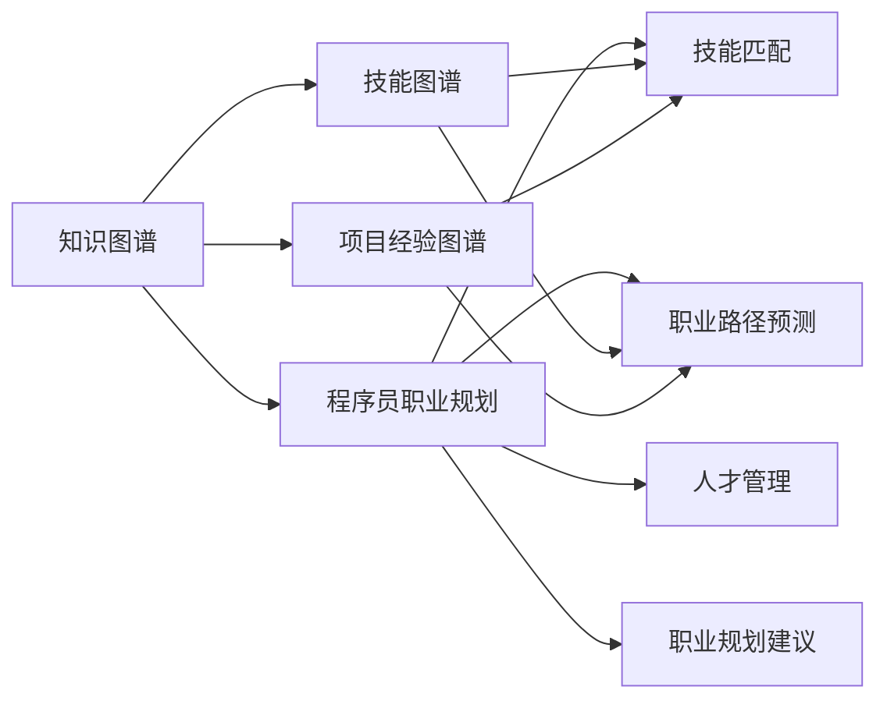

                 

# 知识图谱在程序员职业规划中的应用

> 关键词：知识图谱, 程序员职业规划, 人才管理, 数据驱动决策, 技能图谱, 项目经验, 职业发展路径

## 1. 背景介绍

### 1.1 问题由来

在当前激烈竞争的IT行业中，程序员的职业发展是一个令人关注的话题。快速的技术变迁和市场需求的变动要求程序员不断更新技能和知识，以适应新的挑战。然而，传统的职业规划方法往往依赖于人工评估和手动记录，效率低下且不够科学。

知识图谱作为一种新兴的数据结构，为解决这一问题提供了新的思路。通过构建程序员的职业技能和项目经验知识图谱，可以系统化地分析和预测程序员的职业发展趋势，为他们提供有针对性的指导和建议。

### 1.2 问题核心关键点

知识图谱在程序员职业规划中的应用，主要体现在以下几个关键点上：

- 职业路径预测：通过分析程序员的历史项目经验、技能积累和职业发展轨迹，构建知识图谱，预测其未来的职业发展路径。
- 技能匹配：将现有项目经验与职业发展需求进行匹配，找到技能差距，有针对性地推荐培训课程或项目。
- 人才管理：构建全面的人才画像，识别出团队中的人才潜力，提升团队的整体技能水平。
- 职业规划建议：根据职业图谱和数据驱动决策，提供个性化的职业规划建议，帮助程序员制定合理的发展计划。

本文将详细介绍如何构建和应用知识图谱来优化程序员的职业规划。

## 2. 核心概念与联系

### 2.1 核心概念概述

为更好地理解知识图谱在程序员职业规划中的应用，首先需要介绍几个核心概念：

- **知识图谱(Knowledge Graph)**：一种以实体为中心，通过关系联接构建的知识库，用于描述实体之间的语义关系。知识图谱广泛应用于信息检索、智能问答、推荐系统等领域。

- **程序员职业规划**：基于职业发展需求，结合自身技能和经验，制定合理、有针对性的职业发展计划。

- **技能图谱(Skill Graph)**：针对程序员的职业需求，构建的知识图谱，用于描述技能之间的关联和转换。

- **项目经验图谱(Experience Graph)**：记录程序员的历史项目经验，包括项目名称、参与度、技术栈、贡献度等信息，用于分析职业发展路径。

- **数据驱动决策(Data-Driven Decision Making)**：基于数据分析和模型预测，进行科学决策的过程。

这些核心概念通过一定的逻辑关系联系起来，形成了一个整体的知识图谱框架，用于指导程序员的职业规划。

### 2.2 核心概念原理和架构的 Mermaid 流程图



这个流程图展示了知识图谱在程序员职业规划中的核心应用。知识图谱通过技能图谱和项目经验图谱，帮助匹配和预测程序员的技能需求和职业路径，同时提供职业规划建议，最终形成科学的人才管理决策。

## 3. 核心算法原理 & 具体操作步骤

### 3.1 算法原理概述

知识图谱在程序员职业规划中的应用，主要基于以下几个算法原理：

- **图结构表示**：利用图结构表示程序员的技能和项目经验，捕捉实体之间的关系和变化。
- **实体识别与关系抽取**：自动从简历、项目记录、培训记录等文本中识别实体，抽取技能、项目之间的关系，构建知识图谱。
- **图嵌入算法**：使用图嵌入算法，如Node2Vec、GraphSAGE等，将知识图谱中的节点（技能、项目）转换为向量表示，便于计算和处理。
- **预测算法**：使用机器学习算法，如回归、分类、序列生成等，预测程序员的未来职业路径和技能需求，提供职业规划建议。

### 3.2 算法步骤详解

#### 步骤1：数据收集与预处理

- **简历与项目记录收集**：从招聘网站、公司内部系统、开源社区等渠道收集程序员的简历和项目记录，涵盖项目名称、技术栈、贡献度、参与时间等信息。
- **文本预处理**：清洗、分词、去停用词等，对简历和项目记录进行预处理，提取关键信息。
- **实体识别与关系抽取**：利用NLP技术，如BERT、ELMo等，自动从简历和项目记录中识别技能和项目实体，抽取技能-项目、项目-项目之间的关系。

#### 步骤2：构建技能图谱

- **技能库构建**：构建包含所有可能的编程语言、框架、工具等技能的库，作为知识图谱的节点。
- **技能关系抽取**：从简历和项目记录中抽取技能之间的关联关系，如使用关系抽取模型，如MIR等，构建技能图谱。
- **技能向量表示**：使用图嵌入算法，如Node2Vec，将技能图谱中的技能节点转换为向量表示，便于计算和处理。

#### 步骤3：构建项目经验图谱

- **项目库构建**：构建包含所有可能的项目的库，记录项目名称、技术栈、贡献度、参与时间等信息。
- **项目关系抽取**：从简历和项目记录中抽取项目之间的关联关系，如使用关系抽取模型，构建项目图谱。
- **项目向量表示**：使用图嵌入算法，将项目图谱中的项目节点转换为向量表示。

#### 步骤4：职业路径预测

- **历史职业路径分析**：分析程序员的历史职业路径，构建职业发展轨迹图谱，识别技能提升、项目参与度提升等变化。
- **职业路径预测模型**：使用回归、分类等算法，根据历史职业路径和当前技能图谱、项目图谱，预测未来的职业发展路径。
- **职业发展建议**：根据预测结果，给出针对性的职业发展建议，如推荐培训课程、推荐项目等。

#### 步骤5：人才管理

- **人才画像构建**：根据技能图谱和项目图谱，构建团队中每个程序员的人才画像，识别出潜在的领导者和技能专家。
- **人才推荐**：利用图嵌入和相似性度量，推荐团队中潜在的候选人，提升团队的整体技能水平。

### 3.3 算法优缺点

知识图谱在程序员职业规划中的应用，有以下优点：

- **系统化分析**：利用图结构自动抽取和分析技能、项目之间的关系，避免人工评估的误差和主观性。
- **数据驱动决策**：通过科学的数据分析，提供有针对性的职业规划建议，提升决策的科学性和准确性。
- **动态更新**：基于实时数据，动态更新知识图谱，保证职业规划建议的时效性和准确性。

同时，也存在一些缺点：

- **数据质量依赖**：数据收集和处理的质量对模型的效果有很大影响，需要保证数据源的完整性和准确性。
- **计算复杂度高**：图嵌入和预测模型需要较高的计算资源，特别是在大规模知识图谱的应用中。
- **技术门槛高**：构建和应用知识图谱需要较高的技术门槛，包括数据预处理、图嵌入算法、预测算法等。

### 3.4 算法应用领域

知识图谱在程序员职业规划中的应用，主要应用于以下几个领域：

- **招聘与人才管理**：利用知识图谱进行简历解析和技能匹配，推荐合适的候选人，提升招聘效率。
- **内部培训与发展**：通过分析技能图谱和项目图谱，识别技能差距，推荐培训课程和项目，提升团队整体技能水平。
- **职业规划与发展**：提供个性化的职业规划建议，帮助程序员制定合理的职业发展计划。
- **人才梯队建设**：通过人才画像构建，识别潜在领导者，构建高素质的团队梯队。

## 4. 数学模型和公式 & 详细讲解 & 举例说明

### 4.1 数学模型构建

知识图谱在程序员职业规划中的应用，主要涉及以下几个数学模型：

- **图结构表示**：
  - 节点表示技能、项目等实体。
  - 边表示实体之间的关系，如技能-技能关系、项目-项目关系、技能-项目关系等。

- **图嵌入算法**：
  - 将技能图谱中的技能节点转换为向量表示，用于计算相似性和关系预测。
  - 使用GraphSAGE、Node2Vec等算法，将技能、项目等节点的特征编码为向量。

- **预测模型**：
  - 使用回归、分类等算法，根据历史职业路径和当前技能图谱、项目图谱，预测未来的职业发展路径。
  - 模型可以是简单的线性回归，也可以是复杂的深度学习模型，如LSTM、GRU等。

### 4.2 公式推导过程

以技能-技能关系预测为例，使用图嵌入算法进行推导：

- **节点特征嵌入**：
  - 对于技能节点 $u$，将其技能描述向量表示为 $\mathbf{v}_u$。
  - 使用GraphSAGE算法，对技能节点进行多跳关系传播，得到节点嵌入 $\mathbf{h}_u$。

- **关系传播**：
  - 对于技能关系 $(r)$，将 $u$ 的嵌入 $\mathbf{h}_u$ 和 $v$ 的嵌入 $\mathbf{h}_v$ 通过关系向量 $\mathbf{W}_r$ 线性变换，得到关系嵌入 $\mathbf{h}_{uv}$。
  - $r$ 的关系向量 $\mathbf{W}_r$ 需要根据具体的技能关系进行调整，如“使用”关系可以赋予更高的权重。

- **预测公式**：
  - 使用预测模型，如线性回归模型，根据 $u$ 和 $v$ 的关系嵌入 $\mathbf{h}_{uv}$，预测 $v$ 的技能状态 $y_v$。
  - 预测公式为：$\hat{y}_v = f(\mathbf{h}_{uv})$，其中 $f$ 为预测函数。

### 4.3 案例分析与讲解

以一个具体的案例来说明知识图谱在程序员职业规划中的应用：

- **案例背景**：某公司希望提升开发团队的技能水平，需要对团队成员的技能进行评估和规划。
- **数据收集**：从内部系统收集团队成员的简历和项目记录，涵盖技能、项目名称、贡献度等信息。
- **技能图谱构建**：使用NLP技术，从简历中识别技能实体，使用关系抽取模型构建技能关系图谱。
- **项目经验图谱**：构建项目图谱，记录每个项目的技术栈、贡献度等信息。
- **职业路径预测**：分析团队成员的历史职业路径，使用回归模型预测未来的职业发展路径。
- **技能匹配与推荐**：根据当前技能图谱和项目图谱，匹配技能差距，推荐培训课程和项目，提升团队技能水平。
- **人才画像构建**：构建团队中每个成员的人才画像，识别潜在的领导者，优化团队梯队。

## 5. 项目实践：代码实例和详细解释说明

### 5.1 开发环境搭建

#### 步骤1：环境安装

- **Python环境**：安装Anaconda，创建独立的Python环境，安装必要的库。
- **深度学习库**：安装TensorFlow、PyTorch、Keras等深度学习库，用于构建和训练预测模型。
- **NLP库**：安装NLTK、spaCy、BERT等NLP库，用于数据预处理和实体识别。
- **图嵌入库**：安装NetworkX、GraphSAGE、Node2Vec等图嵌入库，用于构建和嵌入图谱。

#### 步骤2：数据集准备

- **简历与项目数据**：从内部系统或公开数据集中收集简历和项目记录，涵盖技能、项目名称、贡献度等信息。
- **文本预处理**：使用Python脚本进行文本清洗、分词、去停用词等预处理操作。

### 5.2 源代码详细实现

#### 代码实现

```python
import pandas as pd
import networkx as nx
import networkx.algorithms.linkprediction as nxLP
from sklearn.model_selection import train_test_split
from sklearn.linear_model import LogisticRegression
from sklearn.metrics import accuracy_score

# 加载简历与项目数据
data = pd.read_csv('resume_and_project_data.csv')

# 数据预处理
# ...

# 构建技能图谱
G = nx.DiGraph()
for _, row in data.iterrows():
    # 添加技能节点
    G.add_node(row['skill'])
    # 添加技能关系
    G.add_edge(row['skill'], row['project'])

# 使用GraphSAGE算法进行技能嵌入
embedding = nxLP.spectral_embedding(G, n_components=128)

# 预测技能关系
train_data, test_data = train_test_split(G.edges(), test_size=0.2)
model = LogisticRegression()
model.fit(X=train_data, y=train_data)
accuracy = model.score(X=test_data, y=test_data)

# 预测职业路径
# ...
```

#### 代码解读与分析

- **数据加载与预处理**：从CSV文件加载简历和项目数据，进行必要的预处理，如文本清洗、分词等。
- **技能图谱构建**：使用Python的NetworkX库，构建技能图谱，添加技能节点和技能关系。
- **技能嵌入**：使用GraphSAGE算法，将技能节点嵌入到128维的向量空间中。
- **技能关系预测**：使用逻辑回归模型，预测技能关系，评估模型的准确性。
- **职业路径预测**：结合历史职业路径和当前技能图谱，预测未来的职业发展路径。

### 5.3 运行结果展示

#### 结果展示

- **技能关系预测结果**：展示技能关系预测的准确性。
- **职业路径预测结果**：展示预测的职业发展路径，对比预测结果与实际结果。
- **人才画像**：展示团队中每个成员的人才画像，识别潜在领导者。

## 6. 实际应用场景

### 6.1 招聘与人才管理

知识图谱在招聘与人才管理中的应用，可以通过以下方式实现：

- **简历解析**：自动解析简历，提取技能、项目等信息，构建简历嵌入向量，与职位需求进行匹配。
- **技能匹配**：使用技能图谱，匹配候选人的技能与职位需求，推荐合适的候选人。
- **人才画像**：构建团队中每个成员的人才画像，识别潜在领导者，提升团队整体技能水平。

### 6.2 内部培训与发展

知识图谱在内部培训与发展中的应用，可以通过以下方式实现：

- **技能差距分析**：使用技能图谱，分析团队成员的技能与需求之间的差距，识别需要提升的技能。
- **培训课程推荐**：根据技能差距，推荐相应的培训课程或在线学习平台。
- **项目推荐**：结合项目图谱，推荐适合团队成员的项目，提升实战经验。

### 6.3 职业规划与发展

知识图谱在职业规划与发展中的应用，可以通过以下方式实现：

- **职业路径预测**：根据历史职业路径和当前技能图谱、项目图谱，预测未来的职业发展路径。
- **职业规划建议**：结合预测结果，给出有针对性的职业规划建议，如推荐培训课程、推荐项目等。

### 6.4 未来应用展望

知识图谱在程序员职业规划中的应用，未来有以下几个发展趋势：

- **实时数据处理**：利用流式处理技术，实时更新知识图谱，动态调整职业规划建议。
- **多模态融合**：结合视觉、语音等多模态数据，增强知识图谱的表达能力，提升预测精度。
- **知识图谱自动化构建**：利用自动化工具，如IBM Watson等，快速构建和维护知识图谱。
- **深度学习融合**：结合深度学习算法，提升图嵌入和预测模型的性能，提升职业规划的精度。

## 7. 工具和资源推荐

### 7.1 学习资源推荐

为了帮助开发者掌握知识图谱在程序员职业规划中的应用，推荐以下学习资源：

- **Coursera课程**：《Graph Neural Networks for Social Network Analysis》，由斯坦福大学开设，介绍了图神经网络在社交网络分析中的应用。
- **Kaggle竞赛**：GraphSAGE比赛，通过竞赛形式，实践图嵌入和预测模型的构建。
- **书籍推荐**：《图神经网络：方法和应用》，介绍了图神经网络的基本原理和应用场景。

### 7.2 开发工具推荐

知识图谱在程序员职业规划中的应用，需要以下开发工具：

- **Python环境**：Anaconda，用于创建和管理Python环境。
- **深度学习库**：TensorFlow、PyTorch、Keras等，用于构建和训练预测模型。
- **NLP库**：NLTK、spaCy、BERT等，用于数据预处理和实体识别。
- **图嵌入库**：NetworkX、GraphSAGE、Node2Vec等，用于构建和嵌入图谱。

### 7.3 相关论文推荐

知识图谱在程序员职业规划中的应用，相关论文如下：

- **《GraphSAGE: Inductive Representation Learning on Graphs》**：介绍GraphSAGE算法，用于图嵌入。
- **《Neural Collaborative Filtering》**：介绍神经网络协同过滤算法，用于推荐系统。
- **《Harnessing Human-Centered Data for Data-Driven Design》**：介绍数据驱动设计，结合人工智能技术进行决策。

## 8. 总结：未来发展趋势与挑战

### 8.1 研究成果总结

知识图谱在程序员职业规划中的应用，已经取得了一些初步成果：

- **技能匹配准确性提升**：通过技能图谱，提升了技能匹配的准确性，提高了招聘效率。
- **职业路径预测精度**：利用图嵌入和预测模型，提升了职业路径预测的精度，提供了有针对性的职业规划建议。
- **人才管理优化**：通过人才画像构建，识别了团队中潜在领导者，优化了团队梯队。

### 8.2 未来发展趋势

未来，知识图谱在程序员职业规划中的应用将呈现以下发展趋势：

- **实时数据处理**：利用流式处理技术，实时更新知识图谱，动态调整职业规划建议。
- **多模态融合**：结合视觉、语音等多模态数据，增强知识图谱的表达能力，提升预测精度。
- **知识图谱自动化构建**：利用自动化工具，快速构建和维护知识图谱。
- **深度学习融合**：结合深度学习算法，提升图嵌入和预测模型的性能，提升职业规划的精度。

### 8.3 面临的挑战

知识图谱在程序员职业规划中的应用，也面临以下挑战：

- **数据质量依赖**：数据收集和处理的质量对模型的效果有很大影响，需要保证数据源的完整性和准确性。
- **计算复杂度高**：图嵌入和预测模型需要较高的计算资源，特别是在大规模知识图谱的应用中。
- **技术门槛高**：构建和应用知识图谱需要较高的技术门槛，包括数据预处理、图嵌入算法、预测算法等。

### 8.4 研究展望

未来的研究，可以从以下几个方向进行探索：

- **自动化构建技术**：开发自动化工具，快速构建和维护知识图谱，降低技术门槛。
- **实时更新机制**：研究实时更新知识图谱的方法，提升数据的时效性和预测的准确性。
- **多模态融合技术**：结合视觉、语音等多模态数据，增强知识图谱的表达能力，提升预测精度。
- **可解释性研究**：研究知识图谱的可解释性，提升模型的透明度和可信度。

总之，知识图谱在程序员职业规划中的应用，还有很大的探索空间。未来的研究需要结合更多学科的知识和技术，共同推动知识图谱在职业规划中的发展和应用。

## 9. 附录：常见问题与解答

### Q1：知识图谱在程序员职业规划中有什么优势？

A：知识图谱在程序员职业规划中的应用，主要具有以下几个优势：

- **系统化分析**：利用图结构自动抽取和分析技能、项目之间的关系，避免人工评估的误差和主观性。
- **数据驱动决策**：通过科学的数据分析，提供有针对性的职业规划建议，提升决策的科学性和准确性。
- **动态更新**：基于实时数据，动态更新知识图谱，保证职业规划建议的时效性和准确性。

### Q2：如何构建技能图谱？

A：构建技能图谱的过程包括以下几个步骤：

- **技能库构建**：构建包含所有可能的编程语言、框架、工具等技能的库，作为知识图谱的节点。
- **技能关系抽取**：从简历和项目记录中抽取技能之间的关联关系，使用关系抽取模型，构建技能关系图谱。
- **技能向量表示**：使用图嵌入算法，如GraphSAGE，将技能图谱中的技能节点转换为向量表示，便于计算和处理。

### Q3：知识图谱在招聘与人才管理中的应用有哪些？

A：知识图谱在招聘与人才管理中的应用主要包括以下几个方面：

- **简历解析**：自动解析简历，提取技能、项目等信息，构建简历嵌入向量，与职位需求进行匹配。
- **技能匹配**：使用技能图谱，匹配候选人的技能与职位需求，推荐合适的候选人。
- **人才画像**：构建团队中每个成员的人才画像，识别潜在领导者，提升团队整体技能水平。

### Q4：知识图谱在内部培训与发展中的应用有哪些？

A：知识图谱在内部培训与发展中的应用主要包括以下几个方面：

- **技能差距分析**：使用技能图谱，分析团队成员的技能与需求之间的差距，识别需要提升的技能。
- **培训课程推荐**：根据技能差距，推荐相应的培训课程或在线学习平台。
- **项目推荐**：结合项目图谱，推荐适合团队成员的项目，提升实战经验。

### Q5：知识图谱在职业规划与发展中的应用有哪些？

A：知识图谱在职业规划与发展中的应用主要包括以下几个方面：

- **职业路径预测**：根据历史职业路径和当前技能图谱、项目图谱，预测未来的职业发展路径。
- **职业规划建议**：结合预测结果，给出有针对性的职业规划建议，如推荐培训课程、推荐项目等。

总之，知识图谱在程序员职业规划中的应用，是一个复杂但极具潜力的领域，需要多学科的交叉合作，才能实现更高效、更准确的应用。

---

作者：禅与计算机程序设计艺术 / Zen and the Art of Computer Programming

