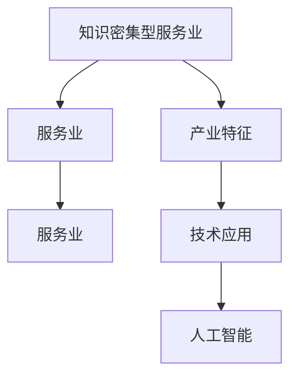
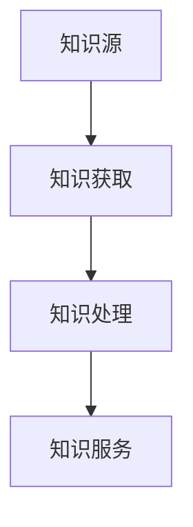

                 

# 知识密集型服务业的特征

> 关键词：知识密集型服务,服务业,产业特征,技术应用,人工智能

## 1. 背景介绍

在当今经济全球化和信息化时代，服务业已成为各国经济增长的重要驱动力。服务业不仅包括传统的零售、餐饮、旅游、金融等行业，也涵盖信息通信、科技研发、教育培训、医疗健康等多个领域。服务业的发展深度和广度，在很大程度上决定了一个国家的经济发展水平和竞争力。

随着技术的不断进步，服务业正从传统的劳动密集型向知识密集型转变。知识密集型服务业，以其高附加值、高技术含量、高产业融合度等特征，正在成为现代服务业的重要组成部分。本文旨在深入分析知识密集型服务业的发展特征，探讨其产业趋势和技术应用，为相关产业从业人员和政策决策者提供参考。

## 2. 核心概念与联系

### 2.1 核心概念概述

在深入探讨知识密集型服务业之前，首先需要理解几个核心概念：

- **知识密集型服务业(Knowledge-Intensive Business Services, KIBS)**：指那些需要大量知识储备和智力投入的服务业。知识密集型服务业包括研发咨询、知识产权、专业培训、市场研究、软件与信息技术服务等多个子领域。
- **服务业(Service Industry)**：指提供服务产品而非实物产品的产业，通常分为生产者服务业(如金融、法律、咨询等)和消费者服务业(如零售、餐饮、旅游等)两大类。
- **产业特征(Industrial Characteristics)**：指决定一个产业在产业链中的位置和竞争力的各种因素，包括技术、规模、成本、创新能力等。
- **技术应用(Technological Application)**：指将先进技术应用于服务业的各个环节，以提高服务效率、降低运营成本、提升服务质量。
- **人工智能(Artificial Intelligence, AI)**：指利用计算机技术和算法，模拟人类智能行为的技术。人工智能在服务业中的应用，涉及自然语言处理、机器学习、大数据分析等多个方面。

这些概念通过以下Mermaid流程图展示了它们之间的联系：



这个流程图清晰地展示了知识密集型服务业如何作为服务业的一个子集，与技术应用和人工智能紧密相连，并通过产业特征体现其特殊性。

### 2.2 核心概念原理和架构

知识密集型服务业的核心在于知识和智力资源的密集使用，其运营和生产过程高度依赖于专业知识和技能。知识密集型服务业的基本架构可以表示为：

- **知识源**：包括学术机构、研究机构、企业研发中心等，是知识密集型服务业的基础。
- **知识获取**：通过文献调研、技术合作、人才招聘等方式，获取和积累相关领域的知识。
- **知识处理**：利用信息技术对知识进行整理、存储、分析，形成可供服务的技术和服务。
- **知识服务**：将处理后的知识转化为具体的服务产品或解决方案，提供给客户。

知识密集型服务业的核心流程如图1所示：



其中，知识源是知识密集型服务业的知识储备库；知识获取和处理是知识的转化过程；知识服务是知识密集型服务业的核心产出。

### 2.3 核心概念联系

知识密集型服务业与传统服务业的主要区别在于其知识导向的特点。传统服务业更多依赖于物质资源和劳动力，而知识密集型服务业则侧重于知识和技能。因此，知识密集型服务业的技术应用更加广泛，人工智能、大数据等现代技术在其中扮演了重要角色。

## 3. 核心算法原理 & 具体操作步骤

### 3.1 算法原理概述

知识密集型服务业的技术应用，核心在于如何将知识转化为具体的服务产品。这一过程中，核心算法包括知识获取、知识处理和知识服务。

- **知识获取算法**：利用自然语言处理(NLP)和机器学习(ML)技术，从文本、图像、语音等多种数据源中提取和识别知识。
- **知识处理算法**：利用数据挖掘和机器学习技术，对获取的知识进行分析和整合，形成可供服务的技术和服务。
- **知识服务算法**：利用人工智能和大数据技术，将处理后的知识转化为具体的服务产品或解决方案。

### 3.2 算法步骤详解

以下是知识密集型服务业的技术应用步骤：

**Step 1: 数据采集与预处理**

1. **数据源选择**：确定所需数据源，包括学术文献、专利、技术报告、用户反馈等。
2. **数据采集**：利用网络爬虫、API接口等方式，自动采集数据。
3. **数据预处理**：对采集到的数据进行清洗、去重、标注等处理，确保数据的质量和格式一致性。

**Step 2: 知识提取与获取**

1. **文本处理**：使用NLP技术，对文本进行分词、词性标注、实体识别等处理，提取出关键信息。
2. **图像处理**：使用计算机视觉技术，对图像进行识别和标注，提取有用的视觉信息。
3. **语音处理**：使用语音识别和处理技术，将语音转化为文本，并提取关键信息。

**Step 3: 知识处理与整合**

1. **数据挖掘**：利用数据挖掘技术，对提取出的知识进行分析和整合，形成有价值的信息。
2. **机器学习**：利用ML算法，对知识进行模型训练和预测，提高知识处理的准确性和效率。
3. **知识库构建**：将处理后的知识存储到知识库中，便于后续服务的使用和调用。

**Step 4: 知识服务与应用**

1. **服务设计**：根据知识库中的信息，设计具体的服务产品或解决方案。
2. **服务实现**：利用API接口、Web服务等方式，将服务产品或解决方案提供给用户。
3. **反馈与优化**：收集用户反馈，对服务进行持续优化和改进。

### 3.3 算法优缺点

知识密集型服务业的技术应用，在提高服务效率和质量的同时，也存在一些缺点：

**优点**：

1. **提升服务效率**：利用自动化技术，大幅提升数据处理和知识提取的效率。
2. **提高服务质量**：通过机器学习和大数据分析，提高服务产品和解决方案的准确性和可靠性。
3. **增强创新能力**：基于大量的知识储备，服务企业能够更好地应对市场需求和技术变化。

**缺点**：

1. **技术门槛高**：需要较高的技术储备和专业知识，对于中小型企业来说，技术应用成本较高。
2. **数据隐私风险**：在数据采集和处理过程中，涉及大量的个人和企业数据，存在隐私泄露的风险。
3. **模型可解释性不足**：利用机器学习算法，模型决策过程缺乏可解释性，难以理解和调试。

### 3.4 算法应用领域

知识密集型服务业的技术应用，广泛应用于以下几个领域：

1. **研发咨询**：通过数据分析和知识处理，为客户提供市场调研、技术评估、项目管理等咨询服务。
2. **知识产权**：利用NLP和ML技术，提供专利搜索、商标监测、侵权分析等服务。
3. **专业培训**：通过在线教育平台，利用AI和大数据分析，提供个性化培训和职业发展规划。
4. **市场研究**：利用大数据分析技术，为客户提供市场趋势分析、消费者行为预测等服务。
5. **软件与信息技术服务**：基于软件工程和信息技术，提供定制化开发、系统集成、IT运维等服务。

## 4. 数学模型和公式 & 详细讲解 & 举例说明

### 4.1 数学模型构建

知识密集型服务业的技术应用，可以通过以下数学模型来描述：

- **输入层**：表示原始数据和知识源，如文本、图像、语音等。
- **隐藏层**：表示知识提取、处理和整合的过程，利用ML和NLP技术进行知识提取和处理。
- **输出层**：表示知识服务的应用，如咨询服务、软件服务、培训服务等。

这一过程可以表示为：

$$
y = f(x; \theta)
$$

其中，$y$ 表示服务产品或解决方案，$x$ 表示原始数据和知识源，$\theta$ 表示模型参数。

### 4.2 公式推导过程

以市场研究为例，利用大数据分析技术，构建市场趋势预测模型：

1. **数据采集**：采集历史销售数据、市场调查数据、社交媒体数据等。
2. **数据预处理**：清洗数据，去除异常值和噪声。
3. **特征提取**：利用NLP技术，提取文本数据中的关键词和实体。
4. **模型训练**：利用机器学习算法，如线性回归、决策树、随机森林等，对数据进行模型训练。
5. **趋势预测**：利用训练好的模型，预测未来市场趋势和消费者行为。

具体推导过程如下：

**Step 1: 数据采集与预处理**

设原始数据为 $x$，包括历史销售数据 $s_t$ 和市场调查数据 $m_t$。

**Step 2: 特征提取**

利用NLP技术，提取关键词和实体，构建特征向量 $f(x)$。

**Step 3: 模型训练**

设 $y$ 为未来市场趋势，构建模型：

$$
y = \hat{\beta}_0 + \hat{\beta}_1 s_t + \hat{\beta}_2 m_t + \hat{\beta}_3 f(x) + \epsilon
$$

其中，$\hat{\beta}_0, \hat{\beta}_1, \hat{\beta}_2, \hat{\beta}_3$ 为模型参数，$\epsilon$ 为误差项。

**Step 4: 趋势预测**

利用训练好的模型，预测未来市场趋势：

$$
\hat{y} = \hat{\beta}_0 + \hat{\beta}_1 s_t + \hat{\beta}_2 m_t + \hat{\beta}_3 f(x)
$$

### 4.3 案例分析与讲解

以专利搜索服务为例，利用自然语言处理技术，构建专利检索系统：

1. **数据采集**：采集专利数据库中的专利文本和元数据。
2. **数据预处理**：清洗数据，去除噪声和错误。
3. **特征提取**：利用NLP技术，提取关键词和实体。
4. **知识库构建**：构建专利知识库，存储提取出的关键词和实体。
5. **专利检索**：利用搜索引擎技术，根据用户输入的关键词和实体，检索相关专利。

具体推导过程如下：

**Step 1: 数据采集与预处理**

设原始数据为 $x$，包括专利文本 $t$ 和元数据 $d$。

**Step 2: 特征提取**

利用NLP技术，提取关键词和实体，构建特征向量 $f(x)$。

**Step 3: 知识库构建**

利用ML技术，对特征向量进行聚类和分类，构建专利知识库 $K$。

**Step 4: 专利检索**

利用搜索引擎技术，根据用户输入的关键词和实体 $q$，检索相关专利 $y$。

$$
y = K \cap q
$$

## 5. 项目实践：代码实例和详细解释说明

### 5.1 开发环境搭建

在项目实践之前，需要搭建开发环境。以下是使用Python进行数据分析和知识处理的开发环境配置流程：

1. 安装Anaconda：从官网下载并安装Anaconda，用于创建独立的Python环境。

2. 创建并激活虚拟环境：
```bash
conda create -n kibs-env python=3.8 
conda activate kibs-env
```

3. 安装相关库：
```bash
conda install pandas numpy scikit-learn nltk tensorflow transformers
```

4. 安装TensorFlow和Keras：
```bash
pip install tensorflow keras
```

5. 安装自然语言处理工具包：
```bash
pip install spaCy gensim
```

完成上述步骤后，即可在`kibs-env`环境中开始项目开发。

### 5.2 源代码详细实现

以下是使用Python和TensorFlow构建市场趋势预测模型的代码实现：

```python
import pandas as pd
import tensorflow as tf
from sklearn.model_selection import train_test_split
from tensorflow.keras.layers import Dense, Dropout
from tensorflow.keras.models import Sequential

# 加载数据
data = pd.read_csv('market_data.csv')
X = data[['sales', 'market_research']]
y = data['trend']

# 数据预处理
X_train, X_test, y_train, y_test = train_test_split(X, y, test_size=0.2)

# 构建模型
model = Sequential()
model.add(Dense(32, input_dim=X_train.shape[1], activation='relu'))
model.add(Dropout(0.5))
model.add(Dense(1, activation='sigmoid'))

# 编译模型
model.compile(loss='binary_crossentropy', optimizer='adam', metrics=['accuracy'])

# 训练模型
model.fit(X_train, y_train, epochs=10, batch_size=32, validation_data=(X_test, y_test))

# 评估模型
model.evaluate(X_test, y_test)
```

### 5.3 代码解读与分析

让我们再详细解读一下关键代码的实现细节：

**数据加载**：
- 使用pandas库加载市场趋势数据，存储在`market_data.csv`文件中。

**数据预处理**：
- 使用sklearn库进行数据分割，将数据分为训练集和测试集。

**模型构建**：
- 使用TensorFlow库，定义一个简单的神经网络模型，包括一个输入层、一个隐藏层和一个输出层。

**模型编译**：
- 使用`compile`方法，指定损失函数、优化器和评估指标。

**模型训练**：
- 使用`fit`方法，对模型进行训练，设置迭代轮数和批量大小。

**模型评估**：
- 使用`evaluate`方法，在测试集上评估模型的性能，返回损失和准确率。

## 6. 实际应用场景

### 6.1 研发咨询

知识密集型服务业在研发咨询中的应用非常广泛。研发咨询企业利用人工智能和大数据分析技术，为客户提供市场调研、技术评估、项目管理等服务。以下是一个研发咨询项目的具体实现：

**项目背景**：
某企业需要进行新产品研发，需要市场调研和需求分析。企业提供了历史销售数据、市场调查数据和专利文献。

**项目目标**：
通过市场调研和需求分析，确定新产品的市场潜力和研发方向。

**项目实现**：

1. **数据采集与预处理**：
   - 采集历史销售数据、市场调查数据和专利文献，存储在本地或云端。
   - 对数据进行清洗和预处理，去除异常值和噪声。

2. **特征提取与分析**：
   - 利用NLP技术，提取关键词和实体，构建特征向量。
   - 利用数据挖掘技术，对特征向量进行聚类和分类，形成市场调研报告。

3. **决策支持**：
   - 根据市场调研报告，进行技术评估和项目规划。
   - 利用机器学习模型，对市场需求进行预测和分析。

4. **成果输出**：
   - 生成市场调研报告和项目规划报告，提供给企业决策者。

### 6.2 知识产权

知识产权服务是知识密集型服务业的重要组成部分。专利搜索、商标监测和侵权分析等服务，对企业的知识产权管理至关重要。以下是一个专利搜索项目的实现：

**项目背景**：
某企业需要查找某一领域的专利信息，以便进行技术评估和侵权分析。企业提供了专利数据库和元数据。

**项目目标**：
通过专利搜索，获取相关的专利信息，支持企业的技术评估和侵权分析。

**项目实现**：

1. **数据采集与预处理**：
   - 采集专利数据库和元数据，存储在本地或云端。
   - 对数据进行清洗和预处理，去除噪声和错误。

2. **特征提取与检索**：
   - 利用NLP技术，提取关键词和实体，构建特征向量。
   - 利用搜索引擎技术，根据用户输入的关键词和实体，检索相关专利。

3. **知识库构建与维护**：
   - 构建专利知识库，存储提取出的关键词和实体。
   - 定期更新和维护知识库，保持专利信息的时效性。

4. **成果输出**：
   - 生成专利检索报告，提供给企业决策者。

### 6.3 专业培训

知识密集型服务业在专业培训中的应用也非常广泛。在线教育平台利用人工智能和大数据分析技术，为客户提供个性化培训和职业发展规划。以下是一个在线教育平台项目的实现：

**项目背景**：
某在线教育平台需要为客户提供个性化培训和职业发展规划。平台提供了大量的学习资源和用户反馈数据。

**项目目标**：
通过数据分析和知识处理，提供个性化培训和职业发展规划，提升用户的学习效果和满意度。

**项目实现**：

1. **数据采集与预处理**：
   - 采集用户的学习记录、反馈数据和评价数据，存储在本地或云端。
   - 对数据进行清洗和预处理，去除噪声和错误。

2. **特征提取与分析**：
   - 利用NLP技术，提取用户的学习行为和评价内容，构建特征向量。
   - 利用数据挖掘技术，对特征向量进行聚类和分类，形成用户画像和行为分析报告。

3. **个性化推荐与培训**：
   - 利用机器学习模型，对用户进行个性化推荐和培训。
   - 利用知识库，提供职业发展规划和职业技能培训。

4. **成果输出**：
   - 生成个性化推荐报告和职业发展规划报告，提供给用户。

## 7. 工具和资源推荐

### 7.1 学习资源推荐

为了帮助开发者系统掌握知识密集型服务业的技术应用，这里推荐一些优质的学习资源：

1. 《Python数据分析与应用》书籍：系统讲解Python在数据分析和处理中的应用，适合初学者入门。
2. 《TensorFlow实战》书籍：讲解TensorFlow的深度学习模型构建与训练，适合有一定基础的开发者。
3. 《自然语言处理入门》课程：介绍NLP的基本概念和经典模型，适合入门学习。
4. 《知识密集型服务业》期刊：涵盖知识密集型服务业的多领域应用，提供最新的研究进展和技术动态。

通过对这些资源的学习实践，相信你一定能够快速掌握知识密集型服务业的技术应用，并用于解决实际的商业问题。

### 7.2 开发工具推荐

高效的开发离不开优秀的工具支持。以下是几款用于知识密集型服务业开发的工具：

1. Anaconda：用于创建和管理Python环境，支持科学计算和数据分析。
2. TensorFlow：谷歌开源的深度学习框架，生产部署方便，适合大规模工程应用。
3. PyTorch：Facebook开源的深度学习框架，灵活高效，适合研究与开发。
4. Scikit-learn：用于机器学习和数据挖掘的Python库，简单易用。
5. Pandas：用于数据处理和分析的Python库，功能强大。

合理利用这些工具，可以显著提升知识密集型服务业开发效率，加快创新迭代的步伐。

### 7.3 相关论文推荐

知识密集型服务业的研究涉及多个学科，涵盖信息技术、数据分析、人工智能等多个领域。以下是几篇奠基性的相关论文，推荐阅读：

1. "Knowledge-Intensive Business Services: A Review and Conceptual Model"（《知识密集型服务业：综述与概念模型》）：提出了知识密集型服务业的概念模型，探讨其特征和应用。
2. "A Survey on Knowledge Intensive Business Services"（《知识密集型服务业的综述》）：系统回顾了知识密集型服务业的发展历程和应用场景。
3. "Towards Knowledge Intensive Business Services"（《知识密集型服务业的未来》）：探讨了知识密集型服务业的发展趋势和未来前景。

这些论文代表了大规模数据分析和知识密集型服务业的最新研究进展，阅读这些论文可以帮助你了解该领域的研究动态和技术前沿。

## 8. 总结：未来发展趋势与挑战

### 8.1 研究成果总结

知识密集型服务业的发展得益于信息技术和大数据分析的进步。利用人工智能和大数据技术，知识密集型服务业在研发咨询、知识产权、专业培训等多个领域取得了显著成果，提升了服务效率和质量，降低了成本。未来，知识密集型服务业将更加依赖于数据驱动和智能决策，推动产业向更高层次发展。

### 8.2 未来发展趋势

展望未来，知识密集型服务业将呈现以下几个发展趋势：

1. **数据驱动**：数据将成为知识密集型服务业的核心驱动力，利用大数据分析和人工智能技术，提升服务效率和质量。
2. **智能决策**：利用机器学习和大数据分析，进行智能决策和预测，支持企业的战略规划和运营管理。
3. **融合创新**：知识密集型服务业将与其他新兴技术，如物联网、区块链等进行深度融合，提升服务创新能力。
4. **个性化服务**：利用个性化推荐和智能分析，提供更加精准、个性化的服务，提升用户满意度。
5. **全球化发展**：知识密集型服务业将更多地拓展全球市场，利用国际化的资源和服务，提升竞争力。

### 8.3 面临的挑战

尽管知识密集型服务业在快速发展，但仍面临一些挑战：

1. **数据隐私和安全**：在数据采集和处理过程中，涉及大量的个人和企业数据，存在隐私泄露和安全风险。
2. **技术门槛高**：知识密集型服务业需要较高的技术储备和专业知识，对于中小型企业来说，技术应用成本较高。
3. **模型可解释性不足**：利用机器学习算法，模型决策过程缺乏可解释性，难以理解和调试。
4. **跨领域整合**：知识密集型服务业涉及多个学科和领域，跨领域的整合和应用存在挑战。

### 8.4 研究展望

面向未来，知识密集型服务业的研究需要在以下几个方面寻求新的突破：

1. **提升模型可解释性**：利用可解释性技术，增强模型的决策过程，提高模型的可信度和可解释性。
2. **降低技术门槛**：开发更加易用的技术工具和平台，降低技术应用门槛，促进中小企业的技术应用。
3. **增强跨领域整合**：推动不同学科和领域的技术融合，提升跨领域整合能力，促进知识密集型服务业的发展。
4. **注重数据隐私和安全**：加强数据隐私保护和安全措施，确保数据安全和用户隐私。

这些研究方向的探索，将引领知识密集型服务业迈向更高的台阶，为构建安全、可靠、可解释、可控的智能系统铺平道路。面向未来，知识密集型服务业需要在数据驱动、智能决策、个性化服务、全球化发展等方面不断创新，推动产业向更高层次发展。

## 9. 附录：常见问题与解答

**Q1：知识密集型服务业的优势和特点是什么？**

A: 知识密集型服务业的优势和特点主要体现在以下几个方面：

1. **高附加值**：知识密集型服务业利用大量的知识储备和智力投入，提供高附加值的服务。
2. **高技术含量**：知识密集型服务业需要较高的技术储备和专业知识，对技术要求较高。
3. **高产业融合度**：知识密集型服务业涉及多个学科和领域，具有较强的产业融合能力。
4. **高效率**：利用自动化技术和大数据分析，提升服务效率和质量。
5. **高创新能力**：知识密集型服务业具有较强的创新能力和适应性，能够快速响应市场变化。

**Q2：知识密集型服务业的技术应用有哪些？**

A: 知识密集型服务业的技术应用涵盖多个领域，包括但不限于：

1. **研发咨询**：利用数据分析和知识处理，为客户提供市场调研、技术评估、项目管理等服务。
2. **知识产权**：利用自然语言处理和机器学习技术，提供专利搜索、商标监测、侵权分析等服务。
3. **专业培训**：利用在线教育平台和大数据分析，提供个性化培训和职业发展规划。
4. **市场研究**：利用大数据分析技术，为客户提供市场趋势分析、消费者行为预测等服务。
5. **软件与信息技术服务**：基于软件工程和信息技术，提供定制化开发、系统集成、IT运维等服务。

**Q3：如何构建知识密集型服务业的运营模型？**

A: 构建知识密集型服务业的运营模型，主要包括以下几个步骤：

1. **知识源选择**：确定所需知识源，包括学术机构、研究机构、企业研发中心等。
2. **知识获取与处理**：利用自然语言处理、机器学习等技术，从文本、图像、语音等多种数据源中提取和处理知识。
3. **知识库构建**：将处理后的知识存储到知识库中，便于后续服务的使用和调用。
4. **服务设计**：根据知识库中的信息，设计具体的服务产品或解决方案。
5. **服务实现**：利用API接口、Web服务等方式，将服务产品或解决方案提供给用户。
6. **反馈与优化**：收集用户反馈，对服务进行持续优化和改进。

**Q4：知识密集型服务业面临的主要挑战有哪些？**

A: 知识密集型服务业面临的主要挑战包括：

1. **数据隐私和安全**：在数据采集和处理过程中，涉及大量的个人和企业数据，存在隐私泄露和安全风险。
2. **技术门槛高**：知识密集型服务业需要较高的技术储备和专业知识，对于中小型企业来说，技术应用成本较高。
3. **模型可解释性不足**：利用机器学习算法，模型决策过程缺乏可解释性，难以理解和调试。
4. **跨领域整合**：知识密集型服务业涉及多个学科和领域，跨领域的整合和应用存在挑战。

通过解决这些挑战，知识密集型服务业可以更好地适应市场需求，提升服务质量和竞争力。

---

作者：禅与计算机程序设计艺术 / Zen and the Art of Computer Programming

