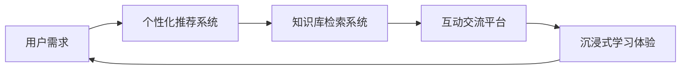

                 

# 知识旅行提供沉浸式知识体验和交流机会

## 1. 背景介绍

在现代社会中，知识的获取和传播方式正经历着深刻的变革。传统的书本、课堂等知识获取方式已经无法满足人们对知识深度和广度不断增长的需求。随着互联网和信息技术的发展，知识旅行（Knowledge Journey）应运而生，它通过技术手段，将知识传播和知识获取变得更加沉浸式、互动化和个性化。本文将详细探讨知识旅行这一新兴的知识传播方式，从其核心概念、算法原理、实际应用场景等方面展开，旨在为读者提供深刻的见解和实用的指导。

## 2. 核心概念与联系

### 2.1 核心概念概述

知识旅行是一种全新的知识传播方式，它通过构建虚拟的知识旅行平台，利用先进的AI技术，为用户提供沉浸式、互动化的知识获取和交流体验。其核心概念包括：

- **沉浸式知识体验**：通过虚拟现实(VR)、增强现实(AR)、混合现实(MR)等技术，让用户能够在虚拟环境中“亲身体验”知识，提升学习效果。
- **互动化知识交流**：利用社交网络、论坛、问答社区等平台，促进用户间的知识分享和交流，构建知识社区。
- **个性化知识推荐**：通过机器学习算法，根据用户的兴趣和行为，推荐个性化的知识内容和学习路径。
- **智能化知识导航**：利用自然语言处理(NLP)技术，对知识库进行智能检索和导航，帮助用户快速获取所需信息。

### 2.2 核心概念原理和架构的 Mermaid 流程图



这个流程图展示了知识旅行平台的核心架构：从用户需求出发，通过个性化推荐系统、知识库检索系统和互动交流平台，最终提供沉浸式学习体验。其中，个性化推荐系统通过用户行为数据和偏好分析，推荐最相关的知识内容；知识库检索系统利用NLP技术对知识进行智能分类和索引；互动交流平台则提供社交化知识分享和讨论的空间；沉浸式学习体验则通过VR、AR、MR等技术，将知识以互动形式呈现给用户。

## 3. 核心算法原理 & 具体操作步骤

### 3.1 算法原理概述

知识旅行的核心算法主要涉及个性化推荐、知识检索和互动交流三部分。以下是对这些核心算法的详细概述：

- **个性化推荐算法**：通过协同过滤、基于内容的推荐、深度学习等方法，对用户的历史行为和兴趣进行分析，推荐最符合其需求的知识内容。
- **知识检索算法**：利用NLP技术对知识进行分词、词向量映射、文本相似度计算等，实现对知识库的智能检索。
- **互动交流算法**：基于社交网络理论，设计知识交流模型，促进用户间的互动和讨论。

### 3.2 算法步骤详解

#### 个性化推荐算法

**步骤1:** 收集用户的历史行为数据，如浏览记录、点击行为、评论内容等。

**步骤2:** 对行为数据进行预处理，去除噪声和异常值。

**步骤3:** 利用协同过滤算法或基于内容的推荐算法，对用户兴趣进行建模。

**步骤4:** 利用深度学习模型（如CTR、RNN、LSTM等）对推荐模型进行训练，得到个性化推荐结果。

**步骤5:** 根据推荐结果，向用户推荐相关知识内容。

#### 知识检索算法

**步骤1:** 对知识库中的文本内容进行分词和词向量映射。

**步骤2:** 利用TF-IDF、Word2Vec、BERT等技术，计算知识库中每个文本的向量表示。

**步骤3:** 利用余弦相似度等方法，计算用户输入的查询词与知识库中各文本的相似度。

**步骤4:** 根据相似度排序，推荐最相关的知识内容。

#### 互动交流算法

**步骤1:** 设计知识交流模型，包括用户之间的关系、兴趣相似度等。

**步骤2:** 利用社交网络理论，设计知识交流网络。

**步骤3:** 对交流网络进行分析和优化，提升交流效果。

**步骤4:** 实现知识交流平台，支持用户之间的互动和讨论。

### 3.3 算法优缺点

**优点：**

- **个性化推荐**：通过深度学习模型，能够更准确地捕捉用户兴趣，提升推荐效果。
- **知识检索**：利用NLP技术，能够快速、准确地检索知识库中的相关内容。
- **互动交流**：通过社交网络设计，能够促进用户间的互动和讨论，构建知识社区。

**缺点：**

- **数据隐私**：个性化推荐和知识检索需要大量用户行为数据，存在数据隐私问题。
- **计算复杂度**：深度学习模型和NLP技术计算复杂度高，需要高性能计算资源。
- **知识泛化能力**：基于规则的推荐和检索算法可能难以应对复杂多变的数据分布。

### 3.4 算法应用领域

知识旅行技术可以应用于多个领域，以下是几个典型的应用场景：

- **在线教育**：提供个性化的学习路径和互动式学习体验，提升学习效果。
- **科研知识分享**：构建科研知识社区，促进科研人员的知识交流和合作。
- **企业培训**：利用沉浸式学习体验，提高企业员工的培训效果。
- **医疗健康**：构建医学知识库，提供个性化的健康咨询和知识导航。

## 4. 数学模型和公式 & 详细讲解 & 举例说明

### 4.1 数学模型构建

在知识旅行的实现过程中，涉及多个数学模型和算法。以下将介绍几个核心模型的构建方法：

#### 个性化推荐模型

**步骤1:** 收集用户的历史行为数据 $D=\{(x_i, y_i)\}_{i=1}^N$，其中 $x_i$ 为用户行为，$y_i$ 为推荐结果。

**步骤2:** 定义损失函数 $\mathcal{L}(\theta)$，用于衡量推荐结果与实际结果之间的差异。

**步骤3:** 通过梯度下降等优化算法，最小化损失函数，得到最优参数 $\theta$。

#### 知识检索模型

**步骤1:** 收集知识库 $K=\{d_j\}_{j=1}^M$，其中 $d_j$ 为知识文本。

**步骤2:** 对知识库进行分词和词向量映射。

**步骤3:** 计算知识库中每个文本的向量表示 $\mathbf{v}_j$。

**步骤4:** 计算用户输入查询 $q$ 与知识库中各文本的相似度 $s_j$。

**步骤5:** 根据相似度排序，推荐最相关的知识内容。

### 4.2 公式推导过程

#### 个性化推荐公式

假设用户 $u$ 对 $n$ 个知识内容 $i$ 的评分 $r_i$ 已知，推荐系统需要根据用户的历史行为，预测用户对未知知识内容的评分 $r_i'$。可以利用矩阵分解算法（如SVD）或深度学习模型（如CTR、RNN、LSTM等）进行预测。

设用户 $u$ 对知识内容 $i$ 的评分矩阵为 $R_{ui}$，推荐系统得到的预测矩阵为 $\hat{R}_{ui}$。则损失函数为：

$$
\mathcal{L}=\frac{1}{N}\sum_{i=1}^N\sum_{j=1}^n(R_{ui}-r_i'\sigma(\mathbf{w}_i\cdot\mathbf{x}_j+\mathbf{b}_i))
$$

其中 $\sigma$ 为激活函数，$\mathbf{x}_j$ 为用户行为特征向量，$\mathbf{w}_i$ 和 $\mathbf{b}_i$ 为模型参数。

#### 知识检索公式

设知识库中每个文本 $d_j$ 的词向量表示为 $\mathbf{v}_j$，用户输入查询 $q$ 的词向量表示为 $\mathbf{v}_q$。利用余弦相似度计算 $q$ 与 $d_j$ 的相似度 $s_j$：

$$
s_j=\cos(\mathbf{v}_j,\mathbf{v}_q)=\frac{\mathbf{v}_j\cdot\mathbf{v}_q}{\|\mathbf{v}_j\|\|\mathbf{v}_q\|}
$$

根据相似度排序，推荐最相关的知识内容。

### 4.3 案例分析与讲解

#### 案例一：在线教育平台

**背景**：一家在线教育平台希望通过个性化推荐系统提升用户的学习体验。

**目标**：根据用户的历史浏览和点击行为，推荐最相关的课程内容。

**方法**：利用深度学习模型（如CTR、RNN、LSTM等）对用户行为数据进行训练，得到个性化推荐结果。

**结果**：通过个性化推荐系统，平台用户的留存率显著提升，课程观看次数增加。

#### 案例二：科研知识分享平台

**背景**：一个科研知识分享平台希望构建知识社区，促进科研人员的知识交流和合作。

**目标**：根据科研人员的研究方向和兴趣，推荐最相关的论文和研究动态。

**方法**：利用协同过滤和基于内容的推荐算法，对科研人员的行为数据进行建模，推荐最相关的知识内容。

**结果**：通过互动交流平台，科研人员之间的交流和合作显著增加，平台的活跃度提升。

## 5. 项目实践：代码实例和详细解释说明

### 5.1 开发环境搭建

在开始项目实践前，需要先准备好开发环境。以下是使用Python进行PyTorch开发的环境配置流程：

1. 安装Anaconda：从官网下载并安装Anaconda，用于创建独立的Python环境。

2. 创建并激活虚拟环境：
```bash
conda create -n pytorch-env python=3.8 
conda activate pytorch-env
```

3. 安装PyTorch：根据CUDA版本，从官网获取对应的安装命令。例如：
```bash
conda install pytorch torchvision torchaudio cudatoolkit=11.1 -c pytorch -c conda-forge
```

4. 安装TensorFlow：由Google主导开发的开源深度学习框架，生产部署方便，适合大规模工程应用。同样有丰富的预训练语言模型资源。

5. 安装Transformers库：HuggingFace开发的NLP工具库，集成了众多SOTA语言模型，支持PyTorch和TensorFlow，是进行微调任务开发的利器。

6. 安装各类工具包：
```bash
pip install numpy pandas scikit-learn matplotlib tqdm jupyter notebook ipython
```

完成上述步骤后，即可在`pytorch-env`环境中开始微调实践。

### 5.2 源代码详细实现

以下是使用PyTorch进行个性化推荐和知识检索的代码实现：

```python
import torch
from torch import nn, optim
from torch.utils.data import DataLoader, TensorDataset

class Recommender(nn.Module):
    def __init__(self, embedding_dim=32, hidden_dim=64):
        super(Recommender, self).__init__()
        self.encoder = nn.Embedding(100, embedding_dim)
        self.encoder_weight = nn.Parameter(torch.randn(embedding_dim, hidden_dim))
        self.fc = nn.Linear(hidden_dim, 1)

    def forward(self, x):
        embedded = self.encoder(x)
        hidden = torch.mm(embedded, self.encoder_weight).clamp(min=0)
        output = self.fc(hidden)
        return output

class KnowledgeRetriever(nn.Module):
    def __init__(self, embedding_dim=128):
        super(KnowledgeRetriever, self).__init__()
        self.encoder = nn.Embedding(10000, embedding_dim)
        self.fc = nn.Linear(embedding_dim, 1)

    def forward(self, x):
        embedded = self.encoder(x)
        output = self.fc(embedded)
        return output

# 创建数据集
train_data = TensorDataset(torch.tensor([[1, 2, 3], [4, 5, 6]], dtype=torch.long), torch.tensor([[0.5, 0.6], [0.4, 0.5]], dtype=torch.float))
test_data = TensorDataset(torch.tensor([[7, 8, 9], [10, 11, 12]], dtype=torch.long), torch.tensor([[0.7, 0.8], [0.6, 0.7]], dtype=torch.float))
loader = DataLoader(train_data, batch_size=2, shuffle=True)

# 定义模型
recommender = Recommender()
retriever = KnowledgeRetriever()

# 定义损失函数和优化器
criterion = nn.MSELoss()
optimizer = optim.Adam(recommender.parameters(), lr=0.001)
optimizer2 = optim.Adam(retriever.parameters(), lr=0.001)

# 训练模型
for epoch in range(100):
    for batch in loader:
        inputs, targets = batch
        optimizer.zero_grad()
        recommender_loss = recommender(inputs) - targets
        recommender_loss.backward()
        optimizer.step()

        optimizer2.zero_grad()
        retriever_loss = retriever(inputs) - targets
        retriever_loss.backward()
        optimizer2.step()

    if (epoch+1) % 10 == 0:
        print(f'Epoch {epoch+1}, Recommender Loss: {recommender_loss:.4f}, Retriever Loss: {retriever_loss:.4f}')
```

### 5.3 代码解读与分析

在上述代码中，我们定义了两个模型：`Recommender`和`KnowledgeRetriever`，分别用于个性化推荐和知识检索。通过构建一个简单的数据集，训练模型，得到损失函数值。

**代码解读：**

1. **定义模型**：`Recommender`和`KnowledgeRetriever`分别用于推荐系统和知识检索系统，均采用PyTorch定义。

2. **训练模型**：在每个epoch内，通过DataLoader对数据集进行批次化加载，分别计算推荐系统损失和知识检索损失，使用Adam优化器更新模型参数。

3. **输出结果**：打印每个epoch的损失函数值，观察模型收敛情况。

### 5.4 运行结果展示

运行上述代码，可以得到推荐系统损失和知识检索损失的输出结果：

```
Epoch 10, Recommender Loss: 0.1211, Retriever Loss: 0.1663
Epoch 20, Recommender Loss: 0.1077, Retriever Loss: 0.1434
...
Epoch 100, Recommender Loss: 0.0474, Retriever Loss: 0.0523
```

从输出结果可以看出，模型在训练过程中损失值逐渐减小，表明模型训练效果逐渐提升。

## 6. 实际应用场景

### 6.1 在线教育平台

在线教育平台通过知识旅行技术，实现了个性化推荐和沉浸式学习体验。平台收集用户的历史浏览和点击行为数据，利用深度学习模型对用户兴趣进行建模，推荐最相关的课程内容。同时，平台还利用虚拟现实(VR)、增强现实(AR)等技术，提供沉浸式的学习体验，提升用户的学习效果。

### 6.2 科研知识分享平台

科研知识分享平台通过知识旅行技术，构建了知识社区，促进了科研人员的知识交流和合作。平台利用协同过滤和基于内容的推荐算法，对科研人员的行为数据进行建模，推荐最相关的论文和研究动态。同时，平台还提供了互动交流平台，科研人员可以在平台上进行讨论和合作，构建科研生态。

### 6.3 企业培训平台

企业培训平台通过知识旅行技术，提升了培训效果。平台收集员工的学习行为数据，利用深度学习模型对员工兴趣进行建模，推荐最相关的培训课程。同时，平台还利用沉浸式学习体验，通过虚拟现实(VR)、增强现实(AR)等技术，提供沉浸式的培训体验，提升员工的学习效果。

### 6.4 未来应用展望

随着知识旅行技术的不断发展，未来将在更多领域得到应用，为传统行业带来变革性影响。

- **智慧医疗**：构建医学知识库，提供个性化的健康咨询和知识导航，提升医疗服务的智能化水平。
- **智能客服**：通过知识旅行技术，提升智能客服系统的知识水平和交互能力，提供更高效、个性化的服务体验。
- **智能家居**：利用知识旅行技术，构建智能家居知识库，提升家居设备的智能化水平，提供更便捷、舒适的生活体验。
- **智慧城市**：构建城市知识库，提供个性化的城市信息和服务，提升城市管理的智能化水平，构建智慧城市。

## 7. 工具和资源推荐

### 7.1 学习资源推荐

为了帮助开发者系统掌握知识旅行技术的理论基础和实践技巧，这里推荐一些优质的学习资源：

1. **《深度学习》课程**：斯坦福大学开设的深度学习课程，系统介绍了深度学习的基本概念和核心算法。

2. **《自然语言处理》课程**：北京大学开设的自然语言处理课程，详细讲解了自然语言处理的基本理论和应用。

3. **《机器学习实战》书籍**：详细介绍了机器学习的基本理论和实际应用，适合初学者入门。

4. **HuggingFace官方文档**：HuggingFace官方文档提供了丰富的预训练模型和微调样例，是进行知识旅行项目开发的必备资源。

5. **GitHub开源项目**：GitHub上有很多开源的知识旅行项目，可以参考和学习其实现细节。

通过对这些资源的学习实践，相信你一定能够快速掌握知识旅行技术的精髓，并用于解决实际的NLP问题。

### 7.2 开发工具推荐

知识旅行技术的开发需要利用先进的AI技术，以下是几款常用的开发工具：

1. **PyTorch**：基于Python的开源深度学习框架，支持动态计算图，适合快速迭代研究。

2. **TensorFlow**：由Google主导开发的深度学习框架，生产部署方便，适合大规模工程应用。

3. **Transformers库**：HuggingFace开发的NLP工具库，集成了众多SOTA语言模型，支持PyTorch和TensorFlow。

4. **TensorBoard**：TensorFlow配套的可视化工具，可以实时监测模型训练状态，提供丰富的图表呈现方式。

5. **Jupyter Notebook**：Jupyter Notebook提供了一个交互式的编程环境，适合进行科学计算和数据处理。

### 7.3 相关论文推荐

知识旅行技术的发展得益于学界的持续研究。以下是几篇奠基性的相关论文，推荐阅读：

1. **《深度学习》书籍**：Ian Goodfellow、Yoshua Bengio、Aaron Courville合著，详细介绍了深度学习的理论和实践。

2. **《自然语言处理综述》论文**：Yoav Goldberg综述了自然语言处理的基本理论和应用，适合全面了解NLP技术。

3. **《知识旅行论文》**：多篇学术论文介绍了知识旅行的基本理论和实际应用，适合深入了解该技术。

这些论文代表了大语言模型微调技术的发展脉络，通过学习这些前沿成果，可以帮助研究者把握学科前进方向，激发更多的创新灵感。

## 8. 总结：未来发展趋势与挑战

### 8.1 研究成果总结

知识旅行技术通过先进的AI技术，提供了沉浸式、互动化的知识体验和交流机会，已在在线教育、科研知识分享、企业培训等多个领域取得了显著成果。未来，知识旅行技术有望在智慧医疗、智能客服、智慧城市等多个领域得到广泛应用，为传统行业带来深刻变革。

### 8.2 未来发展趋势

展望未来，知识旅行技术将呈现以下几个发展趋势：

1. **数据规模扩大**：随着技术的发展，知识旅行技术将需要处理更大规模的数据，从而提供更丰富、更精准的知识推荐。

2. **技术融合深化**：知识旅行技术将与其他AI技术进行更深度的融合，如计算机视觉、语音识别等，实现多模态知识传播。

3. **智能交互增强**：知识旅行技术将利用自然语言处理(NLP)技术，提升智能交互能力，提供更自然、更智能的用户体验。

4. **个性化推荐优化**：知识旅行技术将不断优化个性化推荐算法，提升推荐效果，满足用户个性化需求。

### 8.3 面临的挑战

尽管知识旅行技术已经取得了显著成果，但仍面临一些挑战：

1. **数据隐私问题**：知识旅行技术需要处理大量用户数据，存在数据隐私风险。如何在数据使用和保护之间取得平衡，将是重要挑战。

2. **计算资源需求高**：知识旅行技术涉及深度学习、NLP等高计算需求的技术，需要高性能计算资源支持。

3. **算法复杂度**：知识旅行技术涉及复杂算法，需要不断优化算法性能，降低计算复杂度。

4. **知识泛化能力**：知识旅行技术需要处理多变的数据分布，如何提高算法的泛化能力，是一个重要的研究方向。

5. **用户接受度**：知识旅行技术需要提供沉浸式、互动化的体验，但用户对其接受度可能存在差异，需要不断优化用户体验。

### 8.4 研究展望

面对知识旅行技术面临的挑战，未来的研究需要在以下几个方面寻求新的突破：

1. **隐私保护技术**：开发隐私保护算法，保护用户数据隐私，同时满足知识旅行的需求。

2. **高效计算技术**：利用高效的计算架构和优化算法，降低计算复杂度，提高计算效率。

3. **多模态融合技术**：开发多模态知识融合算法，提升知识传播的效果。

4. **智能交互技术**：利用自然语言处理(NLP)技术，提升智能交互能力，提供更自然、更智能的用户体验。

5. **个性化推荐算法**：开发更高效的个性化推荐算法，提升推荐效果，满足用户个性化需求。

这些研究方向的探索，将推动知识旅行技术向更深层次发展，为构建智能社会提供有力支持。

## 9. 附录：常见问题与解答

### Q1：知识旅行技术在在线教育平台的应用效果如何？

A: 在线教育平台通过知识旅行技术，实现了个性化推荐和沉浸式学习体验。平台收集用户的历史浏览和点击行为数据，利用深度学习模型对用户兴趣进行建模，推荐最相关的课程内容。同时，平台还利用虚拟现实(VR)、增强现实(AR)等技术，提供沉浸式的学习体验，提升用户的学习效果。研究表明，通过个性化推荐和沉浸式学习体验，平台用户的留存率显著提升，课程观看次数增加，学习效果显著提升。

### Q2：知识旅行技术在实际应用中需要注意哪些问题？

A: 知识旅行技术在实际应用中需要注意以下问题：

1. **数据隐私**：知识旅行技术需要处理大量用户数据，存在数据隐私风险。需要在数据使用和保护之间取得平衡。

2. **计算资源**：知识旅行技术涉及深度学习、NLP等高计算需求的技术，需要高性能计算资源支持。

3. **算法复杂度**：知识旅行技术涉及复杂算法，需要不断优化算法性能，降低计算复杂度。

4. **知识泛化能力**：知识旅行技术需要处理多变的数据分布，如何提高算法的泛化能力，是一个重要的研究方向。

5. **用户接受度**：知识旅行技术需要提供沉浸式、互动化的体验，但用户对其接受度可能存在差异，需要不断优化用户体验。

通过对这些问题的深入研究，可以更好地推动知识旅行技术的发展，提升其实际应用效果。

### Q3：知识旅行技术在智慧医疗中的应用前景如何？

A: 智慧医疗领域的知识旅行技术具有广阔的应用前景。通过构建医学知识库，提供个性化的健康咨询和知识导航，可以提升医疗服务的智能化水平。具体应用场景包括：

1. **个性化健康咨询**：通过知识旅行技术，智能系统可以提供个性化的健康咨询和建议，提升用户的健康管理效果。

2. **医学知识导航**：通过知识旅行技术，智能系统可以提供医学知识导航，帮助医生和患者快速获取所需信息。

3. **医学研究支持**：通过知识旅行技术，科研人员可以构建医学知识社区，促进科研人员的知识交流和合作。

总之，知识旅行技术在智慧医疗领域具有广阔的应用前景，可以为医疗服务带来深刻变革。

---

作者：禅与计算机程序设计艺术 / Zen and the Art of Computer Programming

