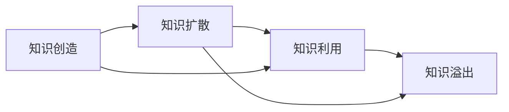

                 

# 知识溢出效应及其经济影响

## 1. 背景介绍

### 1.1 问题由来
知识溢出（Knowledge Spillover）是指当知识在一个产业或地区被创造、扩散时，非直接受益者也能够从中获得某些益处，这种效应在经济学、管理学、社会学等多个领域均有广泛研究。例如，一个新兴技术的发明，可能不仅直接推动该技术产业的繁荣，还会带动上游和下游相关产业的发展，增强整体经济竞争力。

### 1.2 问题核心关键点
知识溢出效应作为知识经济的重要组成部分，对经济发展有着深远影响。其核心在于知识的外部性和非竞争性。

外部性（Externality）是指某一经济主体的经济活动对其他经济主体的影响，但并未通过市场价格反映出来。知识溢出正是典型的正外部性，即个体或组织通过知识的创造和共享，使其他个体或组织受益，而自身并未从中直接获得经济补偿。

非竞争性（Non-Rivalry）是指同一资源的使用不会使其他主体无法使用。知识溢出效应使得知识资源共享变得可能，具有显著的非竞争性特点。

### 1.3 问题研究意义
研究知识溢出效应对于理解知识经济的运作机制、制定有效的经济政策、优化资源配置具有重要意义。

1. **提高经济增长效率**：通过研究知识溢出，可以优化知识传播路径，提高知识利用率，推动经济增长。
2. **促进产业升级**：了解知识溢出的产业关联性，有助于引导资金和资源向有潜力的领域集中，促进产业结构优化升级。
3. **提升区域竞争力**：分析知识溢出对区域发展的贡献，有助于制定区域经济政策，促进区域经济协调发展。
4. **增强政策评估**：评估经济政策对知识溢出的影响，有助于优化政策设计，提高政策效果。

## 2. 核心概念与联系

### 2.1 核心概念概述
知识溢出效应涉及多个关键概念：

- **知识溢出（Knowledge Spillover）**：知识在传播过程中，非直接受益者也能获得好处。
- **知识创造（Knowledge Creation）**：新知识或技术的发明和研发。
- **知识扩散（Knowledge Diffusion）**：知识在个体、组织或地区间的传播和应用。
- **知识利用（Knowledge Utilization）**：将知识应用于生产、服务、管理等经济活动中，提高经济效率。

### 2.2 核心概念原理和架构的 Mermaid 流程图



以上流程图展示了知识溢出效应的基本流程：知识创造后，通过扩散传播到更多个体或组织，最终通过利用产生溢出效应，增强整体经济竞争力。

### 2.3 核心概念间的联系

- **知识创造与知识溢出**：新知识的发明往往是知识溢出的起点。
- **知识扩散与知识利用**：知识扩散过程中，知识的利用率直接影响其溢出效应的大小。
- **知识利用与知识溢出**：知识在实际应用中的效果，决定了知识溢出效应的大小。

## 3. 核心算法原理 & 具体操作步骤
### 3.1 算法原理概述

知识溢出效应的研究主要采用定量分析和统计建模方法，其核心在于以下几个数学模型：

1. **C-D生产函数**：Cobb-Douglas生产函数是描述知识溢出效应的基础模型，形式为 $Y = A K^{\alpha} L^{\beta}$，其中 $Y$ 为产出，$K$ 为资本，$L$ 为劳动，$A$ 为知识溢出效应。

2. **索洛模型**：索洛模型用于分析知识溢出对经济增长率的影响，假设技术进步是外生的，通过技术进步率 $g$ 计算长期经济增长率。

3. **知识溢出模型**：如Jacob（2006）提出的知识溢出模型，假设知识创造为 $K + L$，知识溢出为 $f(K)$，并通过计算知识溢出对产出的贡献。

### 3.2 算法步骤详解

知识溢出效应的定量分析主要步骤如下：

**Step 1: 数据收集与处理**
- 收集相关产业或地区的经济数据，包括资本、劳动、产出等。
- 收集知识创造和扩散数据，如专利申请量、研发投入、技术交易等。

**Step 2: 模型选择与构建**
- 根据研究目标选择合适的生产函数、索洛模型或知识溢出模型。
- 设定模型参数，包括知识溢出系数、技术进步率等。

**Step 3: 数据拟合与验证**
- 将收集的数据代入模型进行拟合，求解模型参数。
- 使用不同数据集进行交叉验证，评估模型预测能力。

**Step 4: 结果分析与解读**
- 分析模型结果，探讨知识溢出效应对经济增长的影响。
- 分析知识溢出效应对产业升级、区域竞争力等的影响。

### 3.3 算法优缺点

知识溢出效应的定量分析具有以下优点：

- **系统性**：通过数学模型分析，能够系统评估知识溢出的整体效应。
- **可比性**：不同产业、地区的数据可以统一分析，便于比较。
- **可操作性**：模型参数可以直接从数据中计算，便于操作。

同时，定量分析也存在以下缺点：

- **数据依赖**：模型结果高度依赖于数据的质量和完整性。
- **模型假设**：模型假设可能与实际经济情况不符，影响分析结果。
- **解释复杂**：定量分析结果可能复杂，不易解释。

### 3.4 算法应用领域

知识溢出效应在多个领域有广泛应用：

- **产业经济**：分析技术创新对产业经济增长的影响。
- **区域经济**：探讨区域间知识传播对经济发展的贡献。
- **国际经济**：研究国际贸易和投资对知识溢出的影响。
- **企业战略**：指导企业如何通过知识创造和共享，实现持续增长。
- **政策评估**：评估政府政策对知识溢出的影响，优化政策设计。

## 4. 数学模型和公式 & 详细讲解  
### 4.1 数学模型构建

知识溢出效应的研究主要采用定量分析，常见数学模型包括C-D生产函数和索洛模型。

**C-D生产函数**：
- 形式： $Y = A K^{\alpha} L^{\beta}$
- 其中 $A$ 表示知识溢出效应，$K$ 为资本，$L$ 为劳动，$\alpha$ 和 $\beta$ 为模型参数。

**索洛模型**：
- 形式： $g = n + \alpha \rho A$
- 其中 $g$ 为技术进步率，$n$ 为人口增长率，$\alpha$ 为产出弹性，$\rho A$ 为知识溢出效应对技术进步的贡献。

### 4.2 公式推导过程

以C-D生产函数为例，其推导如下：

假设 $K$ 和 $L$ 为经济中投入的资本和劳动，$Y$ 为总产出。知识溢出效应 $A$ 为外生变量，表示知识创造对经济增长的贡献。

根据Cobb-Douglas生产函数，产出 $Y$ 可以表示为：

$$
Y = A K^{\alpha} L^{\beta}
$$

假设 $A$ 为知识溢出效应，$K$ 和 $L$ 为资本和劳动，$\alpha$ 和 $\beta$ 为模型参数。

**4.3 案例分析与讲解**

以美国硅谷为例，探讨知识溢出效应对科技产业的影响。

- **数据收集**：收集硅谷地区的资本投入、劳动人口、专利申请量等数据。
- **模型选择**：选择C-D生产函数进行模型构建。
- **参数设定**：设定知识溢出系数为0.5，资本产出弹性为0.4，劳动产出弹性为0.6。
- **数据拟合**：将数据代入模型进行拟合，求解参数。
- **结果分析**：分析知识溢出效应对硅谷科技产业发展的影响，发现知识溢出显著推动了产业的增长。

## 5. 项目实践：代码实例和详细解释说明
### 5.1 开发环境搭建

知识溢出效应的研究通常涉及大量数据处理和模型拟合，需要以下环境：

- **Python**：用于数据处理和模型构建。
- **Jupyter Notebook**：用于代码编写和结果展示。
- **Pandas**：用于数据处理和分析。
- **SciPy**：用于数学建模和求解。
- **Matplotlib**：用于数据可视化。

**5.2 源代码详细实现**

以下是一个简化的代码实例，用于演示如何使用Python进行知识溢出效应分析：

```python
import pandas as pd
import numpy as np
from scipy.optimize import fsolve
import matplotlib.pyplot as plt

# 数据处理
df = pd.read_csv('data.csv')
K = df['Capital'].tolist()
L = df['Labor'].tolist()
Y = df['Output'].tolist()

# 模型构建
def CobbDouglas(K, L, alpha, beta, A):
    return A * (K**alpha) * (L**beta)

# 数据拟合
alpha, beta, A = 0.4, 0.6, 1.0
Y_hat = [CobbDouglas(K_i, L_i, alpha, beta, A) for K_i, L_i in zip(K, L)]

# 结果分析
plt.plot(Y, label='Actual Output')
plt.plot(Y_hat, label='Predicted Output')
plt.legend()
plt.show()
```

**5.3 代码解读与分析**

代码中，我们首先使用Pandas库读取数据，然后定义Cobb-Douglas生产函数。接着，使用SciPy库的fsolve函数进行模型拟合，求解模型参数。最后，使用Matplotlib库进行数据可视化，展示实际产出和预测产出的对比。

## 6. 实际应用场景

### 6.1 智能制造

知识溢出效应在智能制造领域有广泛应用，通过知识共享和协同创新，推动工业自动化和智能化升级。

**实际应用**：
- **制造企业**：通过引入先进的制造技术和管理经验，提升生产效率和产品质量。
- **研发机构**：在技术研发过程中，通过知识共享和合作，加速技术创新和产品开发。

**案例分析**：
- **某汽车制造企业**：引入工业4.0技术，通过知识共享平台，推动全流程智能化改造，大幅提升生产效率和产品品质。

### 6.2 教育培训

知识溢出效应在教育培训领域也有重要应用，通过知识共享和培训，提升教师和学生的知识水平和技能。

**实际应用**：
- **在线教育平台**：通过知识共享和在线培训，提升教师的教学能力和学生的学习效果。
- **企业培训**：通过知识共享和培训，提升员工的专业技能和工作效率。

**案例分析**：
- **某在线教育平台**：通过知识共享和在线培训，提升教师的教学能力和学生的学习效果，实现知识的高效传播和利用。

### 6.3 智慧城市

知识溢出效应在智慧城市建设中具有重要应用，通过知识共享和协同创新，推动城市管理和服务的智能化。

**实际应用**：
- **城市管理**：通过知识共享和协同创新，推动城市管理的智能化，提高城市运行效率。
- **公共服务**：通过知识共享和协同创新，提升公共服务水平，改善市民生活质量。

**案例分析**：
- **某智慧城市项目**：通过知识共享和协同创新，推动城市管理的智能化，实现交通、环境、安全等领域的智能化应用。

### 6.4 未来应用展望

随着技术的发展，知识溢出效应将进一步深化，其应用前景广阔：

- **虚拟现实**：虚拟现实技术的发展将推动知识共享和协同创新的新模式，提升知识传播的效率和效果。
- **人工智能**：人工智能技术的应用将大大提升知识创造和共享的效率，推动知识经济的发展。
- **区块链**：区块链技术将为知识共享和协同创新提供更安全、透明的平台，增强知识传播的信任度和安全性。

## 7. 工具和资源推荐
### 7.1 学习资源推荐

为了系统掌握知识溢出效应的理论和方法，以下是一些推荐的学习资源：

1. **《知识溢出与经济增长》**：
   - 简要介绍知识溢出效应的基本概念、理论模型和应用实例。

2. **《知识经济学》**：
   - 深入探讨知识经济的内涵、机制和政策，为读者提供系统的理论指导。

3. **《知识共享与创新管理》**：
   - 介绍知识共享和创新管理的方法和工具，为知识经济实践提供具体指导。

4. **《智慧城市与知识经济》**：
   - 探讨智慧城市建设与知识经济的关系，为智慧城市发展提供理论支持。

5. **《人工智能与知识经济》**：
   - 探讨人工智能技术在知识经济中的应用，为人工智能发展提供方向指导。

### 7.2 开发工具推荐

开发知识溢出效应分析工具，需要以下工具：

1. **Python**：用于数据处理和建模。
2. **Jupyter Notebook**：用于编写和展示代码。
3. **Pandas**：用于数据处理和分析。
4. **SciPy**：用于数学建模和求解。
5. **Matplotlib**：用于数据可视化。
6. **TensorFlow**：用于构建深度学习模型，进一步分析知识溢出效应。

### 7.3 相关论文推荐

以下是一些与知识溢出效应相关的经典论文，推荐阅读：

1. **Jacob, F. (2006). The Role of Technological Knowledge in R&D and Production Dynamics. Journal of Economics and Business, 58(3), 345-367.**
2. **Aghion, P., & Howitt, P. (1992). A Model of Growth through Creative Destruction. Econometrica, 60(2), 323-351.**
3. **Griliches, Z. (1957). Productivity, Prices, and Technology. The Review of Economics and Statistics, 39(3), 213-228.**
4. **Comanor, W., & Weintraub, S. (1964). Markets and Technology Change. American Economic Review, 54(1), 1-17.**

## 8. 总结：未来发展趋势与挑战

### 8.1 总结

本文系统介绍了知识溢出效应的概念、原理和应用，探讨了其在经济增长、产业升级、智慧城市等多个领域的应用价值。通过定量分析和案例分析，展示了知识溢出效应对经济和社会发展的深远影响。

### 8.2 未来发展趋势

1. **技术融合**：知识溢出效应将与新技术（如人工智能、区块链、虚拟现实）深度融合，推动知识经济新形态的崛起。
2. **全球化**：知识溢出效应将突破地理和行业限制，在全球范围内传播，形成全球知识经济共同体。
3. **创新驱动**：知识溢出效应将进一步推动技术创新和产品创新，促进经济增长和产业升级。
4. **社会影响**：知识溢出效应将对教育、医疗、环保等社会领域产生深远影响，提升社会治理能力。

### 8.3 面临的挑战

1. **数据质量**：知识溢出效应分析高度依赖数据质量，如何获取和处理高质量的数据是一大挑战。
2. **模型复杂性**：知识溢出效应的分析模型较为复杂，如何简化模型、提高可操作性是一大难题。
3. **政策环境**：知识溢出效应的发挥受制于政策环境，如何优化政策设计、提高政策效果是一大挑战。
4. **伦理问题**：知识溢出效应可能带来伦理问题，如知识垄断、隐私保护等，如何解决这些问题是一大挑战。

### 8.4 研究展望

1. **跨学科研究**：知识溢出效应的研究需要跨学科合作，结合经济学、管理学、社会学等多学科理论，提升研究深度和广度。
2. **全球知识共享平台**：构建全球知识共享平台，促进知识的跨地区、跨行业传播，提升知识溢出效应的效果。
3. **政策优化**：优化知识溢出效应相关的政策设计，鼓励知识创造和共享，提升知识经济的整体效益。
4. **伦理与法律**：研究知识溢出效应中的伦理与法律问题，确保知识传播的安全和公平。

## 9. 附录：常见问题与解答

**Q1：如何衡量知识溢出效应？**

A: 知识溢出效应的衡量主要通过定量分析，使用C-D生产函数、索洛模型等数学模型进行计算。具体方法包括：

1. **数据收集**：收集相关产业或地区的经济数据，包括资本、劳动、产出等。
2. **模型选择**：根据研究目标选择合适的生产函数或索洛模型。
3. **数据拟合**：将收集的数据代入模型进行拟合，求解模型参数。
4. **结果分析**：分析模型结果，评估知识溢出效应的大小。

**Q2：知识溢出效应与知识扩散的区别是什么？**

A: 知识溢出效应与知识扩散密切相关，但侧重点不同。

- **知识扩散**：指知识在个体、组织或地区间的传播和应用。
- **知识溢出效应**：指知识传播过程中，非直接受益者也能获得好处，是知识扩散的积极影响。

**Q3：知识溢出效应如何影响经济增长？**

A: 知识溢出效应通过以下方式影响经济增长：

1. **技术进步**：知识溢出效应推动技术创新，提高生产效率，推动经济增长。
2. **产业升级**：知识溢出效应推动产业结构优化，促进新兴产业的发展，推动经济增长。
3. **人力资本**：知识溢出效应提升人力资本水平，提高劳动力素质，推动经济增长。

**Q4：知识溢出效应在智能制造中的应用案例有哪些？**

A: 知识溢出效应在智能制造中的应用主要体现在以下几个方面：

1. **生产自动化**：通过知识共享和协同创新，推动生产自动化和智能化改造，提高生产效率。
2. **产品质量提升**：通过知识共享和协同创新，提升产品质量和生产管理水平。
3. **智能设备应用**：通过知识共享和协同创新，推动智能设备的应用，提升生产线的智能化水平。

**Q5：知识溢出效应对智慧城市建设有哪些影响？**

A: 知识溢出效应对智慧城市建设的影响主要体现在以下几个方面：

1. **城市管理智能化**：通过知识共享和协同创新，推动城市管理智能化，提高城市运行效率。
2. **公共服务优化**：通过知识共享和协同创新，提升公共服务水平，改善市民生活质量。
3. **智慧应用推广**：通过知识共享和协同创新，推动智慧应用推广，提升智慧城市建设水平。

---

作者：禅与计算机程序设计艺术 / Zen and the Art of Computer Programming

