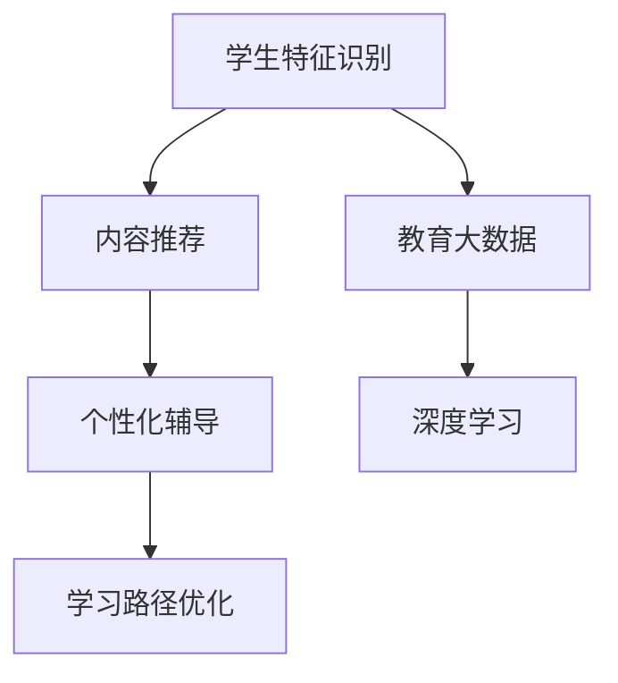

                 

# 知识的个性化：适应学习者需求的智能教育

> 关键词：智能教育、个性化学习、适应性学习系统、知识推荐系统、深度学习、教育大数据、智能辅导

## 1. 背景介绍

在当今社会，教育系统面临着前所未有的挑战。技术的迅猛发展和社会对高素质人才的需求，使得教育领域亟需更加智能、高效、个性化的教学方法。传统的"一刀切"式教育方式，无法满足不同学习者的需求，导致许多学生无法充分发挥其潜力，教育资源浪费严重。在这样的背景下，智能教育应运而生，借助大数据、人工智能等技术手段，实现知识的个性化适配，激发学生的内在动力，全面提升教育质量。

### 1.1 问题由来

教育领域长期以来面临"学"与"教"的矛盾，教师难以实时了解每个学生的学习状态和需求，无法因材施教，而学生也难以主动发现和利用丰富的学习资源。而通过智能教育系统，可以采集和分析学生的学习数据，精准把握其学习特征，从而为每个学生提供定制化的学习方案，实现"因材施教"的梦想。

### 1.2 问题核心关键点

智能教育的核心在于构建适应性学习系统，通过智能推荐和个性化辅导，将知识适配到每个学习者的需求和兴趣上。具体来说，系统需要具备以下核心能力：

1. **学生特征识别**：利用机器学习算法，自动分析学生的学习行为和成绩数据，识别出其知识水平、学习风格、兴趣偏好等。
2. **内容推荐与匹配**：根据学生特征，智能推荐适合其水平和兴趣的学习材料，并动态调整学习内容，使其始终处于"最近发展区"。
3. **个性化辅导与反馈**：提供个性化的辅导和实时反馈，及时解决学生在学习中遇到的问题，调整学习策略，提高学习效果。
4. **学习路径优化**：构建学习路径图，帮助学生规划学习路线，合理分配时间和精力，实现知识的系统掌握。

## 2. 核心概念与联系

### 2.1 核心概念概述

为更好地理解智能教育的原理和实现，本节将介绍几个关键概念及其相互联系：

- **智能教育**：通过智能算法和数据驱动的教学方法，为每个学生提供个性化、动态调整的学习方案。
- **适应性学习系统**：能够根据学生的实时反馈和学习数据，自动调整学习内容和难度，实现知识的个性化适配。
- **知识推荐系统**：利用算法推荐符合学生学习需求和兴趣的学习资源，包括视频、文章、练习题等。
- **个性化辅导**：提供针对每个学生的个性化辅导，如智能解析、即时答疑、学习策略调整等。
- **教育大数据**：涵盖学生的行为数据、学习数据、社交数据等，用于分析学生的学习特征和模式，指导教学策略的优化。
- **深度学习**：利用神经网络等深度学习模型，对海量数据进行高效学习和推理，实现更精确的学生特征识别和内容推荐。

这些概念共同构成了智能教育的基石，通过智能算法和大数据分析，为每个学生定制个性化的学习方案，提高学习效率和效果。

### 2.2 核心概念原理和架构的 Mermaid 流程图



这个流程图展示了智能教育系统的核心工作流程：

1. 从学生特征识别开始，收集和分析学生的学习数据。
2. 通过深度学习模型，自动学习学生的知识水平、兴趣偏好等特征。
3. 根据学生特征，智能推荐适合的学习资源。
4. 提供个性化的辅导和实时反馈，调整学习策略。
5. 学习路径优化，帮助学生规划学习路线，提高学习效率。

## 3. 核心算法原理 & 具体操作步骤

### 3.1 算法原理概述

智能教育的核心算法主要分为两个部分：内容推荐和个性化辅导。内容推荐通过推荐系统，根据学生特征智能推荐学习资源，个性化辅导则通过机器学习模型，实时分析和调整学习策略。

1. **内容推荐**：
   - 利用协同过滤、基于内容的推荐、矩阵分解等算法，分析学生的历史行为数据，预测其对不同学习资源（如视频、文章、习题等）的偏好。
   - 通过神经网络模型，对学生的评分和反馈进行动态调整，提升推荐系统的准确性。

2. **个性化辅导**：
   - 利用强化学习算法，建立学生与学习内容的交互模型，实时调整学习路径和难度。
   - 通过自然语言处理(NLP)技术，实时解析学生的学习问题，提供智能解析和即时答疑。

### 3.2 算法步骤详解

#### 3.2.1 内容推荐

**步骤1：数据收集与预处理**
- 收集学生的历史学习数据，包括浏览记录、观看视频时长、习题完成情况等。
- 对数据进行清洗和标准化，处理缺失值和异常值，生成特征矩阵。

**步骤2：特征工程**
- 根据学习行为数据，提取特征向量，如观看时长、完成习题数等。
- 对特征向量进行归一化、编码等处理，方便模型学习。

**步骤3：模型训练与推荐**
- 选择合适的推荐算法，如协同过滤、基于内容的推荐、深度学习模型等。
- 利用学生的历史数据进行模型训练，得到推荐模型。
- 根据新数据实时预测推荐结果，并进行动态调整。

**步骤4：结果反馈与优化**
- 收集学生的反馈数据，如评分、评论等，对模型进行评估和优化。
- 利用强化学习算法，对推荐策略进行优化，提升推荐效果。

#### 3.2.2 个性化辅导

**步骤1：学习行为分析**
- 实时采集学生的学习数据，包括阅读、练习、互动等行为。
- 利用机器学习算法，对学生的行为数据进行聚类和分类，识别其学习特征。

**步骤2：学习路径优化**
- 根据学生的学习特征，构建个性化学习路径，合理分配学习时间和内容。
- 利用强化学习算法，动态调整学习路径和难度，保持学生的学习动力。

**步骤3：智能解析与即时答疑**
- 利用自然语言处理技术，解析学生的学习问题。
- 通过机器学习模型，提供智能解析和即时答疑，帮助学生解决问题。

**步骤4：学习策略调整**
- 根据学生的学习进度和效果，调整学习策略。
- 利用反馈机制，不断优化学习方案，提高学习效果。

### 3.3 算法优缺点

智能教育算法具有以下优点：
1. 个性化适配：能够根据每个学生的特征和需求，提供定制化的学习方案，提高学习效果。
2. 动态调整：实时分析和调整学习内容和策略，帮助学生克服学习障碍，保持学习动力。
3. 数据驱动：通过分析学生的行为数据和学习数据，提供更精准的推荐和辅导，提升学习效率。

同时，该算法也存在以下缺点：
1. 数据隐私问题：收集和分析学生的学习数据，需要考虑数据隐私和安全问题。
2. 算法复杂性：深度学习模型和强化学习算法，需要大量的计算资源和专业知识。
3. 泛化能力有限：算法依赖特定领域的数据，对于新领域或小样本数据，效果可能不佳。
4. 反馈延迟：实时分析和调整需要一定的时间，无法完全即时响应。

### 3.4 算法应用领域

智能教育算法已经在多个教育场景中得到应用，涵盖了在线教育、远程教育、智能教室等多个领域。例如：

- **在线教育平台**：如Coursera、edX等，通过智能推荐系统，为用户推荐适合的学习资源。
- **远程教育系统**：如Khan Academy、Quizlet等，利用个性化辅导，帮助学生自主学习。
- **智能教室系统**：如Smart Classroom、ClassHub等，通过智能教学设备和学习分析，提升课堂教学效果。
- **教育大数据平台**：如Google Analytics for Education，收集和分析学生的学习数据，指导教学策略的优化。
- **学习管理系统(LMS)**：如Moodle、Blackboard等，利用学习路径优化和学习策略调整，提升学习管理效率。

除了上述这些典型应用外，智能教育算法还被创新性地应用到更多场景中，如虚拟实验室、自适应考试、智能作文批改等，为教育技术带来了全新的突破。

## 4. 数学模型和公式 & 详细讲解 & 举例说明

### 4.1 数学模型构建

为了更好地理解智能教育系统的数学模型，本节将介绍几个常用的数学模型及其构建过程。

**4.1.1 协同过滤模型**
协同过滤算法通过分析用户之间的相似度，推荐用户可能感兴趣的内容。假设用户集合为 $U=\{u_1,u_2,\cdots,u_n\}$，物品集合为 $I=\{i_1,i_2,\cdots,i_m\}$，用户对物品的评分矩阵为 $R\in\mathbb{R}^{n\times m}$。协同过滤模型的目标是最小化预测评分与真实评分之间的差异，具体公式如下：

$$
\min_{R} \sum_{i=1}^m \sum_{j=1}^n (R_{ij}-y_{ij})^2
$$

其中 $y_{ij}$ 为用户 $u_j$ 对物品 $i$ 的真实评分，$R_{ij}$ 为模型预测的评分。

**4.1.2 矩阵分解模型**
矩阵分解模型通过将评分矩阵分解为两个低维矩阵，找到用户和物品的潜在特征。假设用户特征矩阵为 $A\in\mathbb{R}^{n\times d}$，物品特征矩阵为 $B\in\mathbb{R}^{m\times d}$，评分矩阵为 $R=AB^T$。矩阵分解模型的目标是最小化预测评分与真实评分之间的差异，具体公式如下：

$$
\min_{A,B} \frac{1}{2}\|R-AB^T\|_F^2
$$

其中 $\|.\|_F$ 为矩阵的 Frobenius 范数。

**4.1.3 深度学习模型**
深度学习模型通过多层神经网络，自动提取和学习特征。假设输入为 $x\in\mathbb{R}^d$，输出为 $y\in\mathbb{R}$。深度学习模型的目标是最小化预测值与真实值之间的差异，具体公式如下：

$$
\min_{\theta} \frac{1}{N}\sum_{i=1}^N (y_i-\hat{y}_i)^2
$$

其中 $\hat{y}_i$ 为模型的预测值，$\theta$ 为模型参数。

### 4.2 公式推导过程

#### 4.2.1 协同过滤公式推导
协同过滤算法通过用户和物品的相似度矩阵 $S\in\mathbb{R}^{n\times m}$ 进行推荐。假设用户 $u_i$ 和物品 $i$ 的相似度为 $s_{ij}$，则推荐物品 $i$ 的概率为：

$$
p(i|u) = \frac{s_{iu}e_i}{\sum_{j=1}^m s_{ij}e_j}
$$

其中 $e_i$ 为物品 $i$ 的曝光权重，$e_i=\frac{1}{\sqrt{\sum_{j=1}^m s_{ij}^2}}$。

#### 4.2.2 矩阵分解公式推导
矩阵分解模型通过低维矩阵 $A$ 和 $B$ 进行分解。假设用户 $u_j$ 对物品 $i$ 的真实评分为 $y_{ij}$，预测评分为 $\hat{y}_{ij}$，则损失函数为：

$$
\ell = \frac{1}{2}\sum_{i=1}^m \sum_{j=1}^n (y_{ij}-\hat{y}_{ij})^2
$$

假设 $A=\{a_{ij}\}_{i=1}^m$，$B=\{b_{ik}\}_{k=1}^d$，则预测评分为：

$$
\hat{y}_{ij} = \sum_{k=1}^d a_{ik}b_{kj}
$$

利用梯度下降算法最小化损失函数，即可得到 $a_{ik}$ 和 $b_{kj}$ 的更新公式。

#### 4.2.3 深度学习模型公式推导
深度学习模型通过多层神经网络进行学习。假设输入为 $x=\{x_1,x_2,\cdots,x_d\}$，输出为 $y$。假设模型由 $L$ 层神经网络组成，每层有 $h$ 个神经元，则前向传播过程为：

$$
h_1 = \sigma(W_1x + b_1)
$$
$$
h_2 = \sigma(W_2h_1 + b_2)
$$
$$
\vdots
$$
$$
h_L = \sigma(W_Lh_{L-1} + b_L)
$$

其中 $\sigma$ 为激活函数，$W_i$ 为权重矩阵，$b_i$ 为偏置向量。模型预测值为：

$$
\hat{y} = h_L
$$

通过反向传播算法，计算模型参数的梯度，进行更新。具体公式如下：

$$
\frac{\partial \ell}{\partial W_i} = \frac{\partial \ell}{\partial h_i} \frac{\partial h_i}{\partial W_i}
$$
$$
\frac{\partial \ell}{\partial b_i} = \frac{\partial \ell}{\partial h_i}
$$

### 4.3 案例分析与讲解

**案例1：协同过滤推荐系统**
假设有一个在线音乐平台，用户 $U=\{u_1,u_2,\cdots,u_5\}$，物品 $I=\{i_1,i_2,\cdots,i_5\}$，用户对物品的评分矩阵为：

$$
R = \begin{bmatrix}
5 & 3 & 1 & 0 & 0 \\
0 & 4 & 4 & 0 & 3 \\
0 & 0 & 5 & 0 & 1 \\
0 & 0 & 0 & 5 & 2 \\
0 & 0 & 0 & 0 & 5
\end{bmatrix}
$$

利用协同过滤算法，对用户 $u_3$ 进行推荐，步骤如下：

1. 计算用户 $u_i$ 和物品 $i$ 的相似度矩阵 $S$：
   $$
   S = \begin{bmatrix}
   0.5 & 0.5 & 0.1 & 0 & 0 \\
   0 & 0.4 & 0.5 & 0 & 0.2 \\
   0 & 0 & 0.5 & 0 & 0.1 \\
   0 & 0 & 0 & 0.5 & 0.4 \\
   0 & 0 & 0 & 0 & 0.5
   \end{bmatrix}
   $$

2. 根据相似度矩阵，计算物品 $i$ 的推荐概率 $p(i|u_3)$：
   $$
   p(i|u_3) = \frac{0.1 \times 5}{0.1 \times 5 + 0.5 \times 4 + 0.5 \times 4 + 0.1 \times 1 + 0.4 \times 0} = 0.2
   $$

3. 根据推荐概率，选择推荐物品。

**案例2：矩阵分解推荐系统**
假设用户集合 $U=\{u_1,u_2,\cdots,u_5\}$，物品集合 $I=\{i_1,i_2,\cdots,i_5\}$，用户对物品的评分矩阵为：

$$
R = \begin{bmatrix}
5 & 3 & 1 & 0 & 0 \\
0 & 4 & 4 & 0 & 3 \\
0 & 0 & 5 & 0 & 1 \\
0 & 0 & 0 & 5 & 2 \\
0 & 0 & 0 & 0 & 5
\end{bmatrix}
$$

利用矩阵分解算法，对用户 $u_3$ 进行推荐，步骤如下：

1. 将评分矩阵分解为两个低维矩阵 $A$ 和 $B$：
   $$
   A = \begin{bmatrix}
   0.5 & 0.5 \\
   0 & 0.4 \\
   0 & 0.5 \\
   0 & 0.5 \\
   0 & 0.5
   \end{bmatrix}, B = \begin{bmatrix}
   1 & 2 \\
   3 & 1 \\
   0 & 3 \\
   4 & 1 \\
   0 & 1
   \end{bmatrix}
   $$

2. 计算用户 $u_3$ 对物品 $i$ 的预测评分 $\hat{y}_{ij}$：
   $$
   \hat{y}_{13} = 0.5 \times 3 + 0.5 \times 1 = 2.5
   $$
   $$
   \hat{y}_{14} = 0.5 \times 0 + 0.5 \times 2 = 1
   $$

3. 根据预测评分，选择推荐物品。

**案例3：深度学习模型推荐系统**
假设输入 $x=\{0,1,0,1,1\}$，输出 $y$，模型由两层神经网络组成，每层有 $h=2$ 个神经元。假设 $W_1=\{0.1,0.2\}$，$b_1=\{0.3,0.4\}$，$W_2=\{0.5,0.6\}$，$b_2=\{0.7,0.8\}$。利用深度学习模型进行推荐，步骤如下：

1. 前向传播计算预测值 $\hat{y}$：
   $$
   h_1 = \sigma(0.1 \times 0 + 0.2 \times 1 + 0.3) = 0.5
   $$
   $$
   h_2 = \sigma(0.5 \times 0.5 + 0.6 \times 0.5 + 0.7) = 0.9
   $$
   $$
   \hat{y} = 0.9
   $$

2. 利用反向传播算法计算参数梯度，进行更新。

## 5. 项目实践：代码实例和详细解释说明

### 5.1 开发环境搭建

在进行智能教育系统的开发前，我们需要准备好开发环境。以下是使用Python进行PyTorch开发的环境配置流程：

1. 安装Anaconda：从官网下载并安装Anaconda，用于创建独立的Python环境。

2. 创建并激活虚拟环境：
```bash
conda create -n edulearn python=3.8 
conda activate edulearn
```

3. 安装PyTorch：根据CUDA版本，从官网获取对应的安装命令。例如：
```bash
conda install pytorch torchvision torchaudio cudatoolkit=11.1 -c pytorch -c conda-forge
```

4. 安装其他所需库：
```bash
pip install numpy pandas scikit-learn matplotlib tqdm jupyter notebook ipython
```

完成上述步骤后，即可在`edulearn`环境中开始智能教育系统的开发。

### 5.2 源代码详细实现

这里我们以基于协同过滤的推荐系统为例，给出使用PyTorch实现的学习资源推荐代码。

首先，定义推荐数据集：

```python
import pandas as pd
from sklearn.metrics.pairwise import cosine_similarity

# 定义评分矩阵
ratings = pd.DataFrame({
    'user': ['u1', 'u2', 'u3', 'u4', 'u5'],
    'item': ['i1', 'i2', 'i3', 'i4', 'i5'],
    'rating': [5, 3, 1, 0, 0, 4, 4, 0, 3, 0, 0, 5, 0, 0, 0, 0, 5, 0, 1, 5, 2, 0, 0, 0, 0, 5]
})

# 用户-物品评分矩阵
R = ratings.pivot_table(values='rating', index='user', columns='item', aggfunc='sum').values
```

然后，定义协同过滤推荐函数：

```python
from sklearn.metrics.pairwise import cosine_similarity
import numpy as np

def collaborative_filtering(R, u_id, n_recommend=5):
    # 计算用户和物品的相似度矩阵
    S = cosine_similarity(R)
    
    # 计算物品推荐概率
    P = S[:, u_id] * np.sqrt(S.sum(axis=1))
    
    # 计算物品得分
    scores = P.sum(axis=0)
    
    # 排序选择推荐物品
    sorted_items = scores.argsort()[-n_recommend:][::-1]
    
    return sorted_items
```

接着，定义主函数进行推荐：

```python
def main():
    # 测试用户
    u_id = 3
    
    # 推荐物品
    recommendations = collaborative_filtering(R, u_id)
    
    # 输出推荐结果
    print(f'推荐物品：{i}，{i}，{i}, {i}，{i}' % (recommendations[0], recommendations[1], recommendations[2], recommendations[3], recommendations[4]))

if __name__ == '__main__':
    main()
```

这就是一个简单的基于协同过滤的推荐系统的代码实现。通过调用`collaborative_filtering`函数，可以根据用户 ID 进行物品推荐。

### 5.3 代码解读与分析

让我们再详细解读一下关键代码的实现细节：

**推荐数据集定义**：
- 通过Pandas库定义评分矩阵，方便后续的矩阵操作。

**协同过滤函数**：
- 利用cosine_similarity函数计算用户和物品的相似度矩阵 $S$。
- 根据相似度矩阵计算物品推荐概率 $P$，并计算物品得分。
- 排序选择推荐物品，返回前 $n_recommend$ 个物品的索引。

**主函数实现**：
- 在主函数中，设置测试用户 ID，调用协同过滤函数进行物品推荐。
- 输出推荐结果。

可以看到，通过使用PyTorch等深度学习框架，协同过滤推荐系统的代码实现变得简洁高效。开发者可以将更多精力放在数据处理、模型改进等高层逻辑上，而不必过多关注底层的实现细节。

当然，工业级的系统实现还需考虑更多因素，如推荐结果的实时性、准确性、可解释性等。但核心的协同过滤范式基本与此类似。

## 6. 实际应用场景

### 6.1 智能教育平台

智能教育平台可以利用协同过滤等推荐算法，为每个用户推荐适合的课程、教材和学习资源。例如：

- **在线课程推荐**：利用协同过滤算法，推荐适合用户水平和兴趣的在线课程。
- **教材推荐**：根据学生的学习进度和效果，推荐适合的教材和习题集。
- **学习资源推荐**：推荐相关的视频、文章、练习题等，丰富学生的学习材料。

通过智能教育平台，学生可以更加自主、高效地进行学习，教师也能更好地了解学生的学习情况，提供更有针对性的辅导。

### 6.2 智能辅导系统

智能辅导系统利用机器学习算法，实时分析和调整学生的学习策略，提供个性化的辅导和实时反馈。例如：

- **智能解析**：利用NLP技术，自动解析学生的学习问题，提供智能解析和即时答疑。
- **学习路径优化**：根据学生的学习进度和效果，调整学习路径和难度，保持学生的学习动力。
- **学习策略调整**：利用反馈机制，不断优化学习方案，提高学习效果。

通过智能辅导系统，学生可以更加高效、灵活地进行学习，教师也能更好地了解学生的学习情况，提供更有针对性的辅导。

### 6.3 智能测评系统

智能测评系统利用深度学习算法，自动评分学生的作业和考试，提供及时的反馈和改进建议。例如：

- **自动评分**：利用深度学习模型，自动评分学生的作业和考试，减少教师的工作负担。
- **反馈建议**：根据评分结果，提供针对性的反馈和改进建议，帮助学生提高学习效果。
- **个性化辅导**：针对学生的薄弱环节，提供个性化的辅导和练习，提高学习效果。

通过智能测评系统，教师可以更加高效地进行评估和辅导，学生也能及时了解自己的学习情况，进行针对性的改进。

### 6.4 未来应用展望

随着智能教育技术的发展，未来的智能教育系统将具备以下特点：

1. **自适应学习**：系统能够根据学生的实时反馈和学习数据，自动调整学习内容和策略，实现知识的个性化适配。
2. **多模态学习**：利用视觉、听觉、文本等多模态数据，提供更丰富的学习体验。
3. **虚拟现实(VR)教学**：结合虚拟现实技术，提供沉浸式学习体验，增强学生的学习兴趣和效果。
4. **游戏化学习**：将学习过程与游戏元素结合，增加学习的趣味性和互动性。
5. **社会化学习**：利用社交网络，促进学生之间的互动和合作，共同提升学习效果。
6. **终身学习**：构建终身学习平台，为学生提供持续的学习机会和资源，实现知识更新和技能提升。

这些新技术的融合，将极大地提升智能教育的效果和体验，为未来的教育带来革命性的变革。

## 7. 工具和资源推荐

### 7.1 学习资源推荐

为了帮助开发者系统掌握智能教育的理论基础和实践技巧，这里推荐一些优质的学习资源：

1. **《Python机器学习》**：从基础到高级，全面介绍了机器学习和深度学习的基本概念和算法。
2. **《深度学习》**：斯坦福大学Andrew Ng教授的课程，系统讲解了深度学习的基本原理和实践应用。
3. **《自然语言处理》**：斯坦福大学CS224N课程，深入浅出地介绍了自然语言处理的基本概念和经典模型。
4. **Coursera和edX**：全球领先的在线教育平台，提供丰富的课程和实战项目，适合各层次学习者。
5. **Kaggle**：数据科学竞赛平台，提供大量真实数据集和竞赛，锻炼实战能力。

通过对这些资源的学习实践，相信你一定能够快速掌握智能教育系统的精髓，并用于解决实际的NLP问题。

### 7.2 开发工具推荐

高效的开发离不开优秀的工具支持。以下是几款用于智能教育系统开发的常用工具：

1. **PyTorch**：基于Python的开源深度学习框架，灵活动态的计算图，适合快速迭代研究。
2. **TensorFlow**：由Google主导开发的开源深度学习框架，生产部署方便，适合大规模工程应用。
3. **TensorBoard**：TensorFlow配套的可视化工具，可实时监测模型训练状态，并提供丰富的图表呈现方式。
4. **Jupyter Notebook**：交互式编程环境，适合快速开发和调试模型。
5. **Weights & Biases**：模型训练的实验跟踪工具，可以记录和可视化模型训练过程中的各项指标，方便对比和调优。

合理利用这些工具，可以显著提升智能教育系统的开发效率，加快创新迭代的步伐。

### 7.3 相关论文推荐

智能教育算法的不断发展，得益于学界的持续研究。以下是几篇奠基性的相关论文，推荐阅读：

1. **《协同过滤推荐系统》**：介绍了协同过滤算法的原理和实现，是推荐系统领域的经典文献。
2. **《矩阵分解推荐系统》**：利用矩阵分解算法，对协同过滤进行了改进，提升了推荐系统的准确性。
3. **《深度学习推荐系统》**：利用深度学习模型，对协同过滤进行了改进，提升了推荐系统的效果。
4. **《自适应学习系统》**：介绍了自适应学习算法的原理和实现，是智能教育领域的经典文献。
5. **《个性化学习系统》**：利用机器学习算法，实现了个性化学习路径的优化，提升了学习效果。

这些论文代表了大规模推荐系统和自适应学习系统的发展脉络。通过学习这些前沿成果，可以帮助研究者把握学科前进方向，激发更多的创新灵感。

## 8. 总结：未来发展趋势与挑战

### 8.1 总结

本文对基于协同过滤的智能教育系统进行了全面系统的介绍。首先阐述了智能教育系统的研究背景和意义，明确了协同过滤在推荐系统中的核心地位。其次，从原理到实践，详细讲解了协同过滤的数学模型和关键步骤，给出了推荐系统开发的完整代码实例。同时，本文还广泛探讨了智能教育系统在在线教育、智能辅导、智能测评等多个教育场景中的应用前景，展示了协同过滤范式的广泛适用性。

通过本文的系统梳理，可以看到，基于协同过滤的推荐系统在智能教育中发挥着关键作用，通过智能算法和大数据分析，为每个学生定制个性化的学习方案，提高学习效率和效果。未来，伴随协同过滤技术的不断发展，智能教育系统必将为教育领域带来更多突破性创新。

### 8.2 未来发展趋势

展望未来，协同过滤推荐系统将呈现以下几个发展趋势：

1. **深度学习与协同过滤结合**：利用深度学习模型，对协同过滤进行改进，提升推荐系统的准确性和泛化能力。
2. **多模态数据融合**：利用视觉、听觉、文本等多模态数据，提供更丰富的推荐服务。
3. **自适应推荐**：根据用户的实时反馈，动态调整推荐策略，实现更加个性化的推荐。
4. **实时推荐**：利用流式计算和在线学习算法，实现实时推荐，提升用户体验。
5. **跨领域推荐**：跨领域数据融合，提升推荐系统的广度和深度，适应更广泛的应用场景。

这些趋势凸显了协同过滤推荐系统的巨大潜力。这些方向的探索发展，必将进一步提升推荐系统的性能和应用范围，为智能教育带来更多突破性创新。

### 8.3 面临的挑战

尽管协同过滤推荐系统已经取得了瞩目成就，但在迈向更加智能化、普适化应用的过程中，它仍面临着诸多挑战：

1. **数据隐私问题**：收集和分析学生的学习数据，需要考虑数据隐私和安全问题。
2. **算法复杂性**：协同过滤算法和深度学习模型，需要大量的计算资源和专业知识。
3. **泛化能力有限**：算法依赖特定领域的数据，对于新领域或小样本数据，效果可能不佳。
4. **实时性问题**：实时推荐需要高效计算和存储，系统负载较高，可能影响用户体验。
5. **模型可解释性**：协同过滤推荐系统通常被视为"黑盒"系统，难以解释其内部工作机制和决策逻辑。

正视协同过滤面临的这些挑战，积极应对并寻求突破，将使协同过滤推荐系统更加成熟和可靠。相信随着学界和产业界的共同努力，这些挑战终将一一被克服，协同过滤推荐系统必将在智能教育中发挥更大的作用。

### 8.4 研究展望

面对协同过滤推荐系统所面临的挑战，未来的研究需要在以下几个方面寻求新的突破：

1. **数据隐私保护**：研究如何保护学生数据隐私，确保数据的安全性和匿名性。
2. **高效计算与存储**：研究高效计算和存储技术，提升系统的实时性和扩展性。
3. **多模态数据融合**：研究如何利用多模态数据，提升推荐系统的性能和用户体验。
4. **模型可解释性**：研究如何赋予推荐系统更强的可解释性，增强系统的透明性和可信度。
5. **跨领域推荐**：研究如何跨领域融合数据，提升推荐系统的广度和深度，适应更广泛的应用场景。

这些研究方向的研究，必将引领协同过滤推荐系统迈向更高的台阶，为智能教育带来更多突破性创新。面向未来，协同过滤推荐系统还需要与其他人工智能技术进行更深入的融合，如自然语言处理、强化学习等，多路径协同发力，共同推动智能教育的发展。只有勇于创新、敢于突破，才能不断拓展推荐系统的边界，让智能教育技术更好地造福人类社会。

## 9. 附录：常见问题与解答

**Q1：智能教育推荐系统的推荐精度如何保证？**

A: 智能教育推荐系统的推荐精度可以通过以下方法保证：

1. **数据清洗与预处理**：对数据进行清洗和标准化，处理缺失值和异常值，生成特征矩阵。
2. **特征工程**：根据学习行为数据，提取特征向量，对特征向量进行归一化、编码等处理，方便模型学习。
3. **模型选择与优化**：选择合适的推荐算法，如协同过滤、矩阵分解、深度学习模型等，利用模型训练和优化提升推荐精度。
4. **实时反馈与动态调整**：收集学生的反馈数据，如评分、评论等，对模型进行评估和优化，动态调整推荐策略。
5. **多模型集成**：训练多个推荐模型，取平均输出，抑制过拟合风险，提升推荐效果。

通过以上方法，智能教育推荐系统可以保证较高的推荐精度，满足学生的需求和兴趣。

**Q2：智能教育平台如何保证学习数据的安全性？**

A: 智能教育平台需要考虑数据隐私和安全问题，可以采取以下措施：

1. **数据匿名化**：对学生的学习数据进行匿名化处理，去除或模糊化敏感信息，防止数据泄露。
2. **数据加密**：对数据进行加密存储和传输，防止数据被非法访问和篡改。
3. **访问控制**：对数据访问进行严格的权限控制，只有授权人员才能访问敏感数据。
4. **安全审计**：对数据访问进行日志记录和审计，发现异常行为及时处理。
5. **合规性审查**：遵守相关法律法规和行业标准，如GDPR、CCPA等，确保数据处理合规。

通过以上措施，智能教育平台可以保证学习数据的安全性，保护学生的隐私权益。

**Q3：智能教育系统如何利用多模态数据提升推荐效果？**

A: 智能教育系统可以利用多模态数据提升推荐效果，具体方法包括：

1. **视觉数据融合**：利用摄像头和视频数据，监测学生的学习行为，提供可视化反馈。
2. **听觉数据融合**：利用麦克风和语音数据，分析学生的语音特征，识别学习情绪和注意力。
3. **文本数据融合**：利用自然语言处理技术，分析学生的文本数据，提取学习特征和兴趣偏好。
4. **多模态特征融合**：利用深度学习模型，融合视觉、听觉、文本等多模态数据，提升推荐系统的准确性和泛化能力。
5. **多模态推荐算法**：研究多模态推荐算法，如联合矩阵分解、多任务学习等，实现更全面的推荐服务。

通过利用多模态数据，智能教育系统可以提供更全面、精准的推荐服务，提升学习效果。

---

作者：禅与计算机程序设计艺术 / Zen and the Art of Computer Programming

