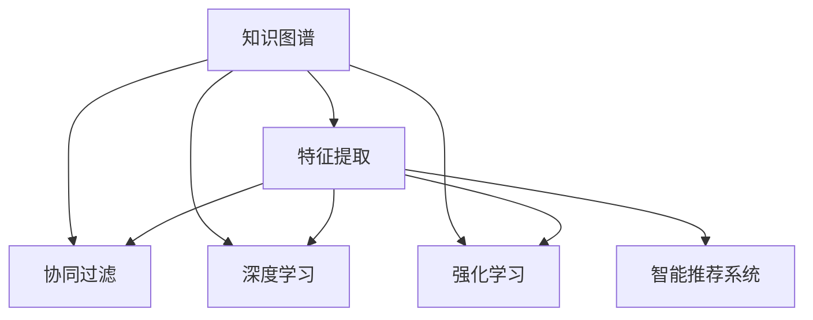

                 

# 知识的价值评估：衡量智力资产

> 关键词：知识图谱、AI智能、人工智能、机器学习、深度学习、智能推荐

## 1. 背景介绍

### 1.1 问题由来
随着人工智能（AI）技术的发展，尤其是深度学习与大数据的结合，智能推荐系统（Intelligent Recommendation Systems, IRS）成为了电子商务、在线视频、社交网络等领域的关键技术。通过推荐系统，用户可以更快、更准确地找到他们感兴趣的内容，从而提升用户体验与满意度。然而，这些系统依赖的推荐算法对数据量的要求极高，如何有效利用海量的用户数据进行知识价值的评估，从而设计出高效、可解释、可控的推荐系统，成为了当前研究的热点问题。

### 1.2 问题核心关键点
评估知识价值的本质在于理解数据中蕴含的潜在信息，并将这些信息转化为推荐决策。这一过程涉及数据挖掘、模式识别、机器学习等多个领域。

1. **知识图谱构建**：构建结构化的知识图谱（Knowledge Graph, KG），可以更好地刻画实体之间的关系，为推荐系统提供丰富的语义信息。
2. **特征提取与选择**：从原始数据中提取特征，并通过选择策略（如权重赋值、特征降维）确定最有用的特征集合。
3. **模型训练与优化**：选择合适的推荐算法（如协同过滤、基于内容的推荐、矩阵分解等），并利用机器学习与深度学习技术进行模型训练与优化。
4. **推荐效果评估**：使用客观指标（如准确率、召回率、F1分数等）与用户满意度（如用户反馈、点击率等）综合评估推荐系统的性能。

### 1.3 问题研究意义
研究知识价值的评估方法，对于推动智能推荐系统的发展，提升用户体验，优化资源配置具有重要意义：

1. **提高推荐精度**：通过有效评估知识价值，推荐系统可以更加精准地识别用户偏好，提高推荐的相关性与准确性。
2. **增强系统可解释性**：利用知识图谱等结构化数据，推荐系统可以提供更具可解释性的推荐理由，增加用户信任。
3. **提升用户体验**：理解并满足用户的真实需求，通过个性化推荐提高用户满意度，增加用户粘性。
4. **优化资源配置**：通过分析用户行为数据，可以更合理地配置资源，提高运营效率。
5. **推动技术创新**：评估知识价值的范式创新，如深度学习、强化学习、因果推断等，为推荐系统带来新的突破。

## 2. 核心概念与联系

### 2.1 核心概念概述

为更好地理解知识价值的评估方法，本节将介绍几个核心概念及其相互关系：

- **知识图谱（Knowledge Graph, KG）**：由节点（Entity）和边（Relationship）构成的图结构，用于描述实体之间的关系。
- **特征提取（Feature Extraction）**：从原始数据中提取有用的特征，以便后续的建模与预测。
- **协同过滤（Collaborative Filtering, CF）**：一种基于用户历史行为的推荐方法，通过相似性度量找到兴趣相似的用户或商品，进行推荐。
- **深度学习（Deep Learning）**：通过多层神经网络对数据进行非线性建模，发现数据中的复杂关系。
- **强化学习（Reinforcement Learning, RL）**：通过试错反馈机制不断优化推荐策略，实现自我学习。
- **智能推荐系统（Intelligent Recommendation Systems, IRS）**：基于用户行为数据、内容信息、知识图谱等构建的推荐系统，能够提供个性化的推荐服务。

这些核心概念之间的逻辑关系可以通过以下Mermaid流程图来展示：



这个流程图展示了知识价值评估的各个步骤及其相互关系：

1. 知识图谱提供了丰富的语义信息。
2. 特征提取将原始数据转化为模型可处理的特征。
3. 协同过滤、深度学习、强化学习等方法对数据进行建模。
4. 智能推荐系统基于模型结果进行推荐决策。

## 3. 核心算法原理 & 具体操作步骤
### 3.1 算法原理概述

知识价值的评估，本质上是利用数据挖掘与机器学习技术，从原始数据中提取有用信息，并利用这些信息进行推荐决策。其核心算法包括协同过滤、深度学习、强化学习等，分别从不同角度提取数据中的潜在价值。

### 3.2 算法步骤详解

#### 3.2.1 协同过滤

协同过滤（CF）是一种基于用户历史行为的推荐方法，通过相似性度量找到兴趣相似的用户或商品，进行推荐。CF分为基于用户的协同过滤和基于物品的协同过滤两种：

1. **基于用户的协同过滤（User-based CF）**：找到与目标用户兴趣相似的用户，推荐这些用户喜欢的商品。
2. **基于物品的协同过滤（Item-based CF）**：找到与目标商品相似的物品，推荐给对这些物品有相似偏好的用户。

协同过滤的步骤包括：

1. **计算相似性**：利用欧几里得距离、皮尔逊相关系数等方法计算用户或物品之间的相似性。
2. **构建相似性矩阵**：根据相似性计算结果构建用户-用户相似性矩阵或物品-物品相似性矩阵。
3. **排序推荐**：根据相似性矩阵进行排序，找到目标用户/物品最相似的邻居，推荐邻居喜欢的商品/物品。

#### 3.2.2 深度学习

深度学习通过多层神经网络对数据进行非线性建模，发现数据中的复杂关系。具体步骤如下：

1. **构建模型**：设计合适的网络结构，如图卷积网络（Graph Convolutional Network, GCN）、图神经网络（Graph Neural Network, GNN）等。
2. **数据预处理**：对数据进行归一化、标准化、降维等预处理，以提高模型的收敛速度和精度。
3. **训练模型**：利用训练数据对模型进行优化，选择合适的损失函数与优化算法（如Adam、SGD等）。
4. **评估模型**：使用测试集对模型进行评估，确定其预测精度与泛化能力。

#### 3.2.3 强化学习

强化学习通过试错反馈机制不断优化推荐策略，实现自我学习。其步骤如下：

1. **定义环境**：明确推荐系统的工作环境，如商品推荐、用户行为等。
2. **选择策略**：设计合适的强化学习策略，如Q-learning、SARSA等。
3. **训练模型**：根据策略与环境交互，不断优化推荐策略。
4. **评估策略**：利用测试集评估策略的有效性，确保其能够最大化用户满意度。

### 3.3 算法优缺点

协同过滤的优点包括：

- **简单高效**：基于用户的CF不需要对商品进行标签化，能够快速构建相似性矩阵。
- **冷启动问题处理**：基于物品的CF可以利用物品属性进行推荐，缓解新用户的冷启动问题。

其缺点包括：

- **数据稀疏性**：用户和物品之间存在大量缺失值，可能导致推荐效果不佳。
- **可扩展性**：大规模数据集下，相似性矩阵的构建与计算复杂度高。

深度学习的优点包括：

- **高泛化能力**：多层网络结构能够捕捉复杂非线性关系。
- **数据适应性强**：适用于多种数据类型，如图像、文本、时间序列等。

其缺点包括：

- **计算资源消耗高**：需要大规模计算资源进行模型训练与优化。
- **模型复杂度高**：深层网络的训练与调试复杂，需要大量实验与调参。

强化学习的优点包括：

- **自我学习**：通过试错反馈不断优化策略，能够适应动态环境。
- **实时性**：能够实时处理用户反馈，快速调整推荐策略。

其缺点包括：

- **探索与利用矛盾**：探索新商品可能导致推荐精度下降，需要设计合理的策略平衡探索与利用。
- **环境模型复杂**：需要构建合理的环境模型，确定合适的奖励函数。

### 3.4 算法应用领域

协同过滤、深度学习、强化学习等方法在知识价值评估中得到了广泛应用，覆盖了以下诸多领域：

- **电子商务推荐**：如亚马逊、淘宝等电商平台，利用用户行为数据进行个性化商品推荐。
- **在线视频推荐**：如Netflix、YouTube等平台，推荐用户感兴趣的视频内容。
- **社交网络推荐**：如Facebook、Twitter等社交媒体，推荐用户感兴趣的朋友或内容。
- **新闻推荐**：如今日头条、网易新闻等，推荐用户感兴趣的新闻文章。
- **音乐推荐**：如Spotify、网易云音乐等，推荐用户喜欢的音乐作品。

除了上述这些经典应用外，知识价值评估方法还被创新性地应用于更多场景中，如医疗推荐、教育推荐、智能家居等，为各行各业带来了新的变革与突破。

## 4. 数学模型和公式 & 详细讲解  
### 4.1 数学模型构建

在知识价值评估中，我们通常使用以下数学模型进行建模与评估：

- **协同过滤模型**：基于用户相似性的推荐公式为：

$$
\hat{r}_{ui} = \alpha \sum_{v \in N(u)} r_{vi} \frac{\alpha_u^v}{\sqrt{k_u k_v}} + (1-\alpha) \sum_{v \in N(i)} r_{vi} \frac{\alpha_i^v}{\sqrt{k_u k_v}}
$$

其中，$N(u)$ 表示用户 $u$ 的邻居集合，$k_u$ 和 $k_v$ 分别表示用户 $u$ 和邻居 $v$ 的邻居数量，$\alpha$ 为平衡因子。

- **深度学习模型**：图神经网络（GNN）的节点表示公式为：

$$
h^{(l+1)}_u = \sigma\left(\mathbf{W}_l h^{(l)}_u + \mathbf{U}_l \sum_{v \in N(u)} h^{(l)}_v \right)
$$

其中，$h^{(l)}_u$ 表示第 $l$ 层节点 $u$ 的表示，$\mathbf{W}_l$ 和 $\mathbf{U}_l$ 分别为层 $l$ 的权重矩阵和邻居聚合权重矩阵。

- **强化学习模型**：Q-learning的更新公式为：

$$
Q'_{s,a} = Q_{s,a} + \alpha(r + \gamma \max_{a'} Q_{s',a'} - Q_{s,a})
$$

其中，$Q_{s,a}$ 表示状态 $s$ 下采取动作 $a$ 的Q值，$Q'_{s,a}$ 表示更新后的Q值，$\alpha$ 为学习率，$\gamma$ 为折扣因子。

### 4.2 公式推导过程

以下是上述模型的详细推导过程：

#### 4.2.1 协同过滤模型

基于用户的协同过滤模型中，相似性矩阵 $A$ 通过欧几里得距离或皮尔逊相关系数计算得到。推荐公式为：

$$
\hat{r}_{ui} = \alpha \sum_{v \in N(u)} r_{vi} \frac{\alpha_u^v}{\sqrt{k_u k_v}} + (1-\alpha) \sum_{v \in N(i)} r_{vi} \frac{\alpha_i^v}{\sqrt{k_u k_v}}
$$

其中，$N(u)$ 表示用户 $u$ 的邻居集合，$k_u$ 和 $k_v$ 分别表示用户 $u$ 和邻居 $v$ 的邻居数量，$\alpha$ 为平衡因子。

推荐公式的推导基于以下假设：
- 用户 $u$ 的邻居 $v$ 喜欢商品 $i$ 的概率为 $r_{vi}$。
- 用户 $u$ 的兴趣与邻居 $v$ 的兴趣相似度为 $\alpha_u^v$，邻居 $v$ 的兴趣与用户 $u$ 的兴趣相似度为 $\alpha_i^v$。

#### 4.2.2 深度学习模型

图神经网络（GNN）通过多层次聚合邻接信息，更新节点表示。公式为：

$$
h^{(l+1)}_u = \sigma\left(\mathbf{W}_l h^{(l)}_u + \mathbf{U}_l \sum_{v \in N(u)} h^{(l)}_v \right)
$$

其中，$h^{(l)}_u$ 表示第 $l$ 层节点 $u$ 的表示，$\mathbf{W}_l$ 和 $\mathbf{U}_l$ 分别为层 $l$ 的权重矩阵和邻居聚合权重矩阵。

该公式的推导基于以下假设：
- 节点 $u$ 的表示为 $h^{(l)}_u$。
- 节点 $u$ 的邻居 $v$ 的表示为 $h^{(l)}_v$。
- 节点 $u$ 和邻居 $v$ 之间的边 $e_{uv}$ 的表示为 $\mathbf{W}_l h^{(l)}_u \odot \mathbf{W}_l h^{(l)}_v$，其中 $\odot$ 表示Hadamard积。

#### 4.2.3 强化学习模型

Q-learning通过状态 $s$ 和动作 $a$ 的奖励 $r$ 和后续状态 $s'$ 的Q值最大化，进行动作选择。更新公式为：

$$
Q'_{s,a} = Q_{s,a} + \alpha(r + \gamma \max_{a'} Q_{s',a'} - Q_{s,a})
$$

其中，$Q_{s,a}$ 表示状态 $s$ 下采取动作 $a$ 的Q值，$Q'_{s,a}$ 表示更新后的Q值，$\alpha$ 为学习率，$\gamma$ 为折扣因子。

该公式的推导基于以下假设：
- 状态 $s$ 下采取动作 $a$ 的奖励为 $r$。
- 后续状态 $s'$ 的Q值最大为 $\max_{a'} Q_{s',a'}$。
- 利用 $\alpha$ 进行Q值更新，平滑收敛。

### 4.3 案例分析与讲解

#### 4.3.1 协同过滤案例

某电商平台的推荐系统，利用基于物品的协同过滤算法进行推荐。具体步骤如下：

1. **数据收集**：收集用户的历史点击记录，以及商品的属性信息。
2. **相似性计算**：基于商品属性计算物品之间的相似性，构建物品-物品相似性矩阵。
3. **推荐生成**：利用物品-物品相似性矩阵计算每个用户对物品的兴趣度，推荐相似物品。

#### 4.3.2 深度学习案例

某社交媒体平台利用图神经网络（GNN）进行用户关系推荐。具体步骤如下：

1. **数据构建**：构建用户关系图，包含用户与用户之间的朋友关系。
2. **网络设计**：设计两层GCN，一层聚合用户特征，一层融合朋友特征。
3. **模型训练**：利用训练数据优化网络参数，提高推荐精度。

#### 4.3.3 强化学习案例

某在线视频平台利用Q-learning进行视频推荐。具体步骤如下：

1. **环境定义**：定义视频推荐环境，包含视频库、用户行为等。
2. **策略设计**：设计Q-learning策略，优化推荐策略。
3. **模型训练**：通过与用户互动，不断更新Q值，优化推荐效果。

## 5. 项目实践：代码实例和详细解释说明
### 5.1 开发环境搭建

在进行知识价值评估的实践前，我们需要准备好开发环境。以下是使用Python进行TensorFlow开发的环境配置流程：

1. 安装Anaconda：从官网下载并安装Anaconda，用于创建独立的Python环境。

2. 创建并激活虚拟环境：
```bash
conda create -n tf-env python=3.8 
conda activate tf-env
```

3. 安装TensorFlow：根据CUDA版本，从官网获取对应的安装命令。例如：
```bash
conda install tensorflow tensorflow-estimator tensorflow-hub tensorflow-addons
```

4. 安装各类工具包：
```bash
pip install numpy pandas scikit-learn matplotlib tqdm jupyter notebook ipython
```

完成上述步骤后，即可在`tf-env`环境中开始知识价值评估的实践。

### 5.2 源代码详细实现

这里我们以社交媒体平台用户关系推荐为例，给出使用TensorFlow对图神经网络（GNN）进行用户关系推荐的代码实现。

首先，定义用户关系图的构建函数：

```python
import networkx as nx
import tensorflow as tf

def build_user_graph(user_ids, num_friends, seed=0):
    graph = nx.erdos_renyi_graph(len(user_ids), num_friends / len(user_ids), seed=seed)
    graph.add_nodes_from(user_ids)
    return graph
```

然后，定义图神经网络模型的构建与训练函数：

```python
import tensorflow_hub as hub

class GNN(tf.keras.Model):
    def __init__(self, num_features):
        super(GNN, self).__init__()
        self.layers = [tf.keras.layers.Dense(32), tf.keras.layers.Dense(32)]
        self.pooling = tf.keras.layers.GlobalAveragePooling1D()

    def call(self, inputs):
        for layer in self.layers:
            inputs = layer(inputs)
        inputs = self.pooling(inputs)
        return inputs

def train_gnn(graph, num_epochs=10, batch_size=32, learning_rate=0.001):
    model = GNN(num_features=32)
    optimizer = tf.keras.optimizers.Adam(learning_rate)

    graph_dict = {}
    for node in graph.nodes():
        graph_dict[node] = tf.sparse.SparseTensor(graph.neighbors(node))

    for epoch in range(num_epochs):
        for batch in range(0, len(graph.nodes()), batch_size):
            user_ids = list(graph.nodes())[batch:batch+batch_size]
            targets = tf.sparse.to_dense(graph_dict[user_ids[0]])
            for user_id in user_ids:
                targets = tf.sparse.set_value(targets, user_id, tf.ones((num_friends,)))
            inputs = tf.sparse.to_dense(graph_dict[user_id])

            with tf.GradientTape() as tape:
                predictions = model(inputs)
                loss = tf.keras.losses.mse(targets, predictions)
            gradients = tape.gradient(loss, model.trainable_variables)
            optimizer.apply_gradients(zip(gradients, model.trainable_variables))

    return model
```

最后，启动训练流程并输出推荐结果：

```python
num_friends = 3
graph = build_user_graph(user_ids, num_friends)
model = train_gnn(graph)

# 测试推荐效果
test_user = 1
test_friends = graph.neighbors(test_user)
recommendations = model(test_friends)
print("Recommended users:", list(nx.neighbors(model(tf.sparse.to_dense(test_friends))))
```

以上就是使用TensorFlow对图神经网络（GNN）进行用户关系推荐的基本代码实现。可以看到，利用TensorFlow的高级API，我们可以快速构建和训练图神经网络模型，进行用户关系的推荐。

### 5.3 代码解读与分析

让我们再详细解读一下关键代码的实现细节：

**build_user_graph函数**：
- 利用网络X库构建用户关系图，通过Erdös-Rényi随机图模型生成用户之间的朋友关系。
- 返回构造好的图对象。

**GNN类**：
- 定义了图神经网络（GNN）的结构，包括两层全连接层和一个池化层。
- `call`方法实现模型前向传播。

**train_gnn函数**：
- 定义了模型训练的过程。
- 创建并初始化GNN模型，选择Adam优化器。
- 构造用户-朋友图，用于训练。
- 循环迭代，每次随机抽样一批用户，构建稀疏矩阵，计算损失并反向传播更新模型参数。
- 最后返回训练好的模型。

**测试推荐效果**：
- 通过测试集用户获取其朋友节点。
- 使用模型预测该用户的朋友推荐。

可以看到，TensorFlow提供了强大的图神经网络（GNN）框架，可以快速实现用户关系推荐的代码实现。开发者可以灵活应用不同层的图神经网络结构，进行多层次的信息聚合与特征学习。

当然，工业级的系统实现还需考虑更多因素，如模型的保存和部署、超参数的自动搜索、更灵活的任务适配层等。但核心的知识价值评估过程基本与此类似。

## 6. 实际应用场景
### 6.1 智能推荐系统

基于知识图谱与深度学习技术，智能推荐系统在电子商务、在线视频、社交网络等领域得到了广泛应用，成为提升用户体验的重要手段。

在技术实现上，可以构建商品-商品、用户-用户、商品-用户等知识图谱，利用深度学习算法提取特征，进行推荐决策。推荐系统通过捕捉用户行为与商品属性的关系，提供个性化推荐，提升用户的点击率、购买率与满意度。

### 6.2 智慧医疗

智慧医疗领域可以利用知识图谱与深度学习技术，进行医疗问答、病历分析、药物推荐等。具体应用包括：

1. **医疗问答**：利用知识图谱构建医学实体关系图，结合深度学习技术，为医生和患者提供医学知识查询与解答。
2. **病历分析**：通过知识图谱与深度学习，从病历数据中提取关键信息，辅助医生诊断。
3. **药物推荐**：结合知识图谱与深度学习，推荐合适的治疗方案与药物，提升治疗效果。

### 6.3 金融风险管理

金融机构可以利用知识图谱与强化学习技术，进行用户行为分析与风险预测。具体应用包括：

1. **用户行为分析**：通过知识图谱与深度学习，分析用户交易行为，构建用户画像。
2. **风险预测**：利用强化学习技术，预测用户潜在的违约风险，优化信贷策略。

### 6.4 未来应用展望

未来，知识价值评估技术将更加广泛地应用于各个领域，推动智能化系统的发展：

1. **自动化推荐**：基于深度学习与强化学习技术，推荐系统将能够更快速、准确地处理大量数据，提供实时推荐。
2. **自适应推荐**：通过动态学习用户行为与环境变化，推荐系统将能够实现自适应推荐，提升用户满意度。
3. **多模态融合**：结合文本、图像、视频等不同模态数据，提升推荐系统的综合能力。
4. **跨领域应用**：推荐系统将逐步应用于更多行业领域，如教育、医疗、工业等，提供个性化服务。

## 7. 工具和资源推荐
### 7.1 学习资源推荐

为了帮助开发者系统掌握知识价值评估的理论基础和实践技巧，这里推荐一些优质的学习资源：

1. **《Recommender Systems》书籍**：由Jude Shavlik和Jian Zhou主编，全面介绍了推荐系统的基础理论与应用实例。
2. **CS223《信息检索与推荐系统》课程**：斯坦福大学开设的推荐系统课程，涵盖数据建模、算法设计与评估等关键内容。
3. **《Introduction to Deep Learning for Recommendation Systems》博文**：详细介绍了深度学习在推荐系统中的应用，包括特征工程、模型设计等。
4. **Kaggle竞赛**：利用Kaggle竞赛平台，练习推荐系统算法，积累实战经验。
5. **arXiv论文**：阅读前沿论文，掌握最新研究进展与技术趋势。

通过对这些资源的学习实践，相信你一定能够快速掌握知识价值评估的精髓，并用于解决实际的推荐问题。

### 7.2 开发工具推荐

高效的开发离不开优秀的工具支持。以下是几款用于知识价值评估开发的常用工具：

1. **TensorFlow**：由Google主导开发的深度学习框架，具有强大的计算图与分布式训练能力。
2. **PyTorch**：由Facebook开发的深度学习框架，支持动态计算图与高效计算。
3. **Jupyter Notebook**：灵活的交互式编程环境，支持多种语言与库的集成。
4. **Netflix Collaborative Filtering**：Netflix公开的推荐系统数据集，用于训练与测试推荐算法。
5. **Amazon Personalize**：亚马逊提供的推荐系统服务，支持多种推荐算法与模型训练。

合理利用这些工具，可以显著提升知识价值评估的开发效率，加快创新迭代的步伐。

### 7.3 相关论文推荐

知识价值评估技术的发展源于学界的持续研究。以下是几篇奠基性的相关论文，推荐阅读：

1. **《A Survey of Collaborative Filtering Techniques》**：详细介绍了协同过滤、深度学习、强化学习等推荐算法的优缺点与应用场景。
2. **《Graph Neural Networks》**：由Google Research团队提出的图神经网络（GNN），为推荐系统提供了一种新的建模方式。
3. **《Deep Collaborative Filtering》**：提出深度学习在推荐系统中的应用，利用深度神经网络提取高阶用户行为信息。
4. **《Graph Convolutional Networks》**：由Facebook AI团队提出的图卷积网络（GCN），利用图结构进行特征提取与建模。
5. **《Multi-task Learning for Recommendation》**：利用多任务学习技术，优化推荐系统的性能。

这些论文代表了大数据与人工智能技术在推荐系统中的应用趋势，值得深入学习与实践。

## 8. 总结：未来发展趋势与挑战
### 8.1 总结

本文对知识价值评估的方法进行了全面系统的介绍。首先阐述了知识图谱、深度学习、协同过滤与强化学习等核心概念及其相互关系。其次，从原理到实践，详细讲解了知识价值评估的数学模型和算法步骤，给出了推荐系统开发的完整代码实例。同时，本文还广泛探讨了推荐系统在智慧医疗、金融风险管理等多个行业领域的应用前景，展示了知识价值评估的广泛应用潜力。最后，本文精选了知识价值评估的各类学习资源，力求为读者提供全方位的技术指引。

通过本文的系统梳理，可以看到，知识价值评估技术正在成为推荐系统的重要范式，极大地拓展了推荐系统的应用边界，提升了用户体验与资源配置效率。未来，伴随大数据与人工智能技术的不断发展，推荐系统必将实现更加个性化、精准化的推荐，为各行各业带来更深远的变革。

### 8.2 未来发展趋势

展望未来，知识价值评估技术将呈现以下几个发展趋势：

1. **推荐系统智能化**：通过深度学习与强化学习技术，推荐系统将更加智能化，能够适应动态环境与用户行为变化。
2. **实时推荐**：基于分布式计算与在线学习，推荐系统将实现实时推荐，提升用户满意度。
3. **多模态融合**：结合文本、图像、视频等多模态数据，提升推荐系统的综合能力。
4. **跨领域应用**：推荐系统将逐步应用于更多行业领域，如教育、医疗、工业等，提供个性化服务。
5. **可解释性与公平性**：推荐系统将更加注重可解释性，提高用户信任。同时，推荐算法也将更加公平，避免歧视与偏见。

### 8.3 面临的挑战

尽管知识价值评估技术已经取得了显著成果，但在迈向更加智能化、普适化应用的过程中，它仍面临着诸多挑战：

1. **数据隐私与安全**：推荐系统需要处理大量用户数据，如何保护用户隐私、确保数据安全是一个重要问题。
2. **数据稀疏性**：用户行为数据往往存在大量缺失值，如何处理数据稀疏性，提高推荐系统性能，仍是一个难点。
3. **算法复杂性**：深度学习与强化学习算法的复杂性较高，如何简化模型结构，提高训练效率，也是一个重要方向。
4. **推荐偏差**：推荐系统容易出现推荐偏差，如何设计合理的评价指标与优化策略，确保推荐公平性，还需要更多研究。

### 8.4 研究展望

面对知识价值评估所面临的挑战，未来的研究需要在以下几个方面寻求新的突破：

1. **数据增强与生成对抗网络（GAN）**：利用数据增强与GAN技术，生成更多的用户行为数据，提高推荐系统性能。
2. **知识图谱与语义搜索**：构建更加全面、准确的知识图谱，利用语义搜索技术，提高推荐系统精度与泛化能力。
3. **强化学习与转移学习**：结合强化学习与转移学习技术，提升推荐系统的自适应能力与泛化能力。
4. **多任务学习与元学习**：利用多任务学习与元学习技术，提升推荐系统的可解释性与公平性。
5. **因果推断与偏置纠正**：结合因果推断与偏置纠正技术，消除推荐系统中的偏见，提高推荐公平性。

这些研究方向的探索发展，必将引领知识价值评估技术迈向更高的台阶，为构建更加智能、普适的推荐系统提供有力支持。面向未来，知识价值评估技术还需要与其他人工智能技术进行更深入的融合，如知识表示、因果推理、强化学习等，共同推动推荐系统技术的发展与进步。

## 9. 附录：常见问题与解答

**Q1：知识价值评估方法是否适用于所有推荐任务？**

A: 知识价值评估方法适用于大多数推荐任务，特别是数据量较大的任务。对于数据量较小、冷启动问题严重或特殊领域的推荐任务，可能需要采用特定的推荐算法，如基于内容的推荐、矩阵分解等。

**Q2：如何评估推荐系统的性能？**

A: 推荐系统的性能评估通常使用以下指标：
- 准确率（Accuracy）：推荐系统预测结果与真实结果的匹配程度。
- 召回率（Recall）：推荐系统预测出的相关商品被用户实际购买的占比。
- 精确率（Precision）：推荐系统预测出的相关商品被用户实际购买的占比。
- F1分数（F1 Score）：精确率和召回率的调和平均，综合评估推荐系统性能。

**Q3：推荐系统中的冷启动问题如何解决？**

A: 冷启动问题可以通过以下方法解决：
- 基于内容的推荐：利用商品的属性信息进行推荐，避免对用户历史数据的依赖。
- 矩阵分解：利用矩阵分解方法，通过协同过滤算法进行推荐。
- 深度学习：利用深度学习技术，通过用户行为数据进行特征提取，进行推荐。

**Q4：推荐系统中的偏差与公平性问题如何解决？**

A: 推荐系统中的偏差与公平性问题可以通过以下方法解决：
- 数据清洗：去除数据中的偏见与噪声，提高数据质量。
- 算法优化：通过优化推荐算法，减少推荐偏差。
- 用户反馈：利用用户反馈，及时调整推荐策略，确保公平性。

**Q5：推荐系统的实时性如何提升？**

A: 推荐系统的实时性可以通过以下方法提升：
- 分布式计算：利用分布式计算技术，提高模型训练与推理速度。
- 在线学习：利用在线学习技术，实时更新推荐模型。
- 轻量级模型：设计轻量级模型结构，减小模型计算量，提升实时性。

通过本文的系统梳理，可以看到，知识价值评估技术正在成为推荐系统的重要范式，极大地拓展了推荐系统的应用边界，提升了用户体验与资源配置效率。未来，伴随大数据与人工智能技术的不断发展，推荐系统必将实现更加个性化、精准化的推荐，为各行各业带来更深远的变革。

