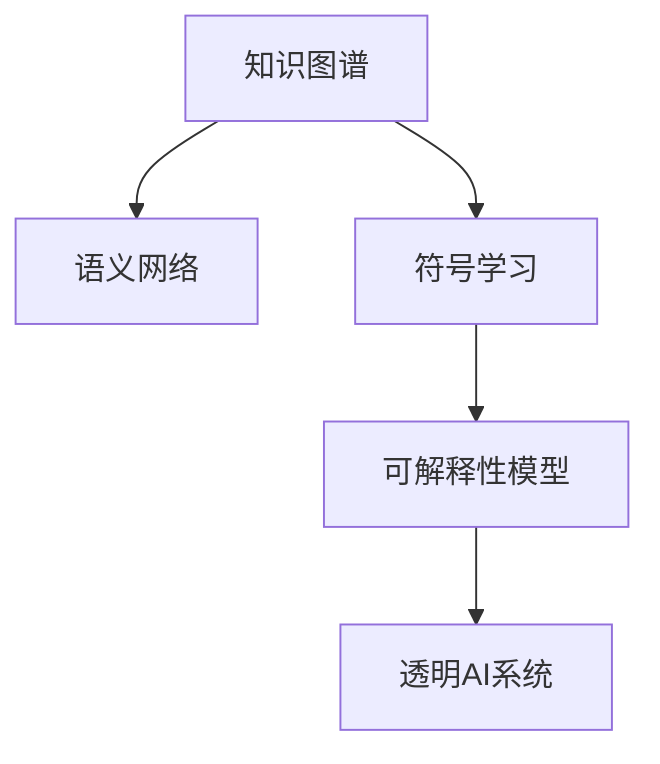

                 

# 知识的可解释性：透明AI的重要性

> 关键词：知识表示,可解释AI,透明AI,知识工程,人工智能伦理

## 1. 背景介绍

### 1.1 问题由来

随着人工智能(AI)技术的发展，深度学习模型在各个领域取得了显著的成果，但同时也引发了一系列新的问题。其中，模型的可解释性问题尤为突出，特别是对于医疗、金融、法律等对决策过程要求较高的领域，对模型的可解释性需求尤为迫切。缺乏可解释性的AI系统，就像一个"黑箱"，难以让人理解和信任。

近年来，随着知识图谱、符号学习等技术的发展，知识表示和知识工程的研究再次成为热点，人们开始思考如何将知识与机器学习更好地结合，提升模型的可解释性。本文将从知识表示和可解释AI的角度，探讨透明AI的重要性，并提出一些可行的实现策略。

### 1.2 问题核心关键点

为了更好地理解知识的可解释性，本节将介绍几个密切相关的核心概念：

- 知识表示：将知识以结构化的形式进行表示，如知识图谱、语义网络等。知识表示是将人类知识与机器学习算法结合的关键，决定了知识在机器中如何被理解和运用。

- 可解释AI：指通过一些方法使得AI系统的决策过程透明化，便于人类理解和解释。可解释AI在医疗、法律、金融等领域有着重要的应用价值。

- 透明AI：强调AI系统在运行过程中保持透明，便于人类监督和干预。透明AI需要知识表示与可解释AI的协同工作，才能真正实现。

- 知识工程：涉及知识的获取、组织、表示、应用等环节，是构建透明AI系统的重要技术手段。

这些核心概念共同构成了透明AI系统的构建框架，使得AI模型能够更好地与人类知识体系对接，提升决策过程的可理解性和可控性。

## 2. 核心概念与联系

### 2.1 核心概念概述

为更好地理解知识表示和透明AI的核心概念，本节将介绍几个密切相关的核心概念：

- 知识图谱：一种用于表示实体及其关系的图结构，广泛应用于推荐系统、搜索引擎、医疗诊断等领域。知识图谱通常由节点和边组成，节点表示实体，边表示实体之间的关系。

- 语义网络：一种基于符号逻辑的知识表示框架，用于描述实体和属性之间的关系。语义网络通过逻辑表达式和符号规则，表达实体之间的语义关系。

- 符号学习：指通过符号推理技术，学习知识和推理规则，用于构建符号逻辑推理机。符号学习在知识工程中有着重要的应用。

- 可解释性模型：指通过一些技术手段，使AI模型的决策过程透明化，便于人类理解和解释。可解释性模型通常包括决策树、规则推理机、基于知识的图灵机等。

- 透明AI系统：指保持AI系统决策过程透明的AI系统，便于人类监督和干预。透明AI系统通常需要结合知识图谱、符号推理等技术，构建更加复杂合理的决策过程。

这些核心概念之间的逻辑关系可以通过以下Mermaid流程图来展示：



这个流程图展示了几类关键知识表示和透明AI的概念及其之间的关系：

1. 知识图谱和语义网络：通过结构化的方式表示实体及其关系，为AI模型提供语义理解的基础。
2. 符号学习：通过逻辑推理，学习知识图谱中的规则和关系，构建符号逻辑推理机。
3. 可解释性模型：通过一些技术手段，使得AI模型决策过程透明化。
4. 透明AI系统：结合知识图谱、符号推理等技术，构建更加复杂合理的决策过程。

这些概念共同构成了透明AI系统的构建框架，使得AI模型能够更好地与人类知识体系对接，提升决策过程的可理解性和可控性。

## 3. 核心算法原理 & 具体操作步骤
### 3.1 算法原理概述

基于知识表示的透明AI系统，本质上是一个将人类知识与机器学习算法结合的系统。其核心思想是：利用知识图谱、语义网络等结构化知识，引导机器学习模型进行知识驱动的决策过程。

形式化地，假设知识图谱为 $G=(V,E)$，其中 $V$ 表示节点集合，$E$ 表示边集合。节点 $v$ 表示实体，边 $e$ 表示实体之间的关系。给定一个输入实例 $x$，将其映射到知识图谱中的节点 $v_x$，通过逻辑推理得到其相关实体 $v_1, v_2, \dots, v_n$，并根据这些实体和边进行推理，得到最终的决策结果 $y$。

具体而言，透明AI系统通常包括以下几个关键步骤：

1. 输入实例的节点映射。将输入实例 $x$ 映射到知识图谱中的节点 $v_x$。
2. 实体推理。通过逻辑推理，从节点 $v_x$ 出发，找到与 $x$ 相关的实体节点 $v_1, v_2, \dots, v_n$。
3. 决策计算。根据推理得到的实体节点和边，计算最终的决策结果 $y$。

### 3.2 算法步骤详解

透明AI系统的实现，通常需要依赖以下几个关键组件：

1. 知识图谱构建器：用于构建和维护知识图谱，通常包括节点创建、关系抽取、推理机等模块。
2. 符号推理机：用于在知识图谱中执行符号推理，如布尔代数、逻辑规则等，得到最终推理结果。
3. 机器学习引擎：用于在符号推理的基础上，进一步优化决策结果，通常包括分类器、回归器等。

以一个医疗诊断系统为例，透明AI系统的工作流程如下：

1. 知识图谱构建：构建包含疾病、症状、治疗等信息的知识图谱。
2. 输入实例映射：将病人的症状、病史等信息映射到知识图谱中的节点。
3. 实体推理：通过逻辑推理，找到与病人症状相关的疾病节点，并根据规则推导出可能的诊断结果。
4. 决策计算：在符号推理的基础上，结合机器学习引擎对诊断结果进行优化和修正。

### 3.3 算法优缺点

基于知识表示的透明AI系统，具有以下优点：

1. 可解释性高。通过逻辑推理的方式，使得决策过程透明化，便于人类理解和解释。
2. 鲁棒性强。知识图谱中的规则和推理方式可以保证系统在不同数据集上的稳定性。
3. 适用性强。适用于医疗、法律、金融等多个领域，可以处理复杂的决策过程。

同时，该系统也存在一定的局限性：

1. 构建复杂。知识图谱的构建和维护需要大量的人力物力，成本较高。
2. 数据依赖。知识图谱中的规则和推理方式，依赖于已有知识，难以处理新出现的未知情况。
3. 推理复杂。符号推理机通常较为复杂，难以处理大规模数据集。

尽管存在这些局限性，但就目前而言，基于知识表示的透明AI系统仍是大数据、大知识场景中的重要工具。未来相关研究的重点在于如何进一步降低构建成本，提高系统的灵活性和鲁棒性。

### 3.4 算法应用领域

基于知识表示的透明AI系统，已经在医疗、法律、金融等多个领域得到广泛应用，推动了这些领域的智能化进程。

1. 医疗诊断：结合知识图谱和符号推理，能够高效、准确地进行疾病诊断和治疗方案推荐。
2. 法律咨询：通过构建包含法律条文、案例等信息的知识图谱，为律师提供智能化的法律咨询和案例分析。
3. 金融风控：利用知识图谱中的信用评估、风险评估等信息，为金融机构提供智能化的风险控制和贷款审批。

除了这些传统领域外，基于知识表示的透明AI系统还被创新性地应用到更多场景中，如智能客服、智能推荐、智能城市等，为各行业的智能化转型提供了新的技术路径。随着知识表示和机器学习技术的不断进步，相信透明AI系统将在更多领域发挥更大的作用。

## 4. 数学模型和公式 & 详细讲解 & 举例说明（备注：数学公式请使用latex格式，latex嵌入文中独立段落使用 $$，段落内使用 $)
### 4.1 数学模型构建

本节将使用数学语言对基于知识表示的透明AI系统进行更加严格的刻画。

假设知识图谱为 $G=(V,E)$，其中 $V$ 表示节点集合，$E$ 表示边集合。节点 $v$ 表示实体，边 $e$ 表示实体之间的关系。设 $x$ 为输入实例，$y$ 为输出决策结果。知识图谱中的逻辑推理方式为 $F$，机器学习引擎的决策优化方式为 $M$。透明AI系统的数学模型为：

$$
y = F(x) + M(F(x))
$$

其中 $F(x)$ 表示符号推理机的输出，$M(F(x))$ 表示机器学习引擎对 $F(x)$ 的优化。

### 4.2 公式推导过程

以下我们以医疗诊断系统为例，推导基于知识图谱的透明AI系统的工作原理。

设知识图谱中包含疾病节点 $D=\{d_1, d_2, \dots, d_n\}$，症状节点 $S=\{s_1, s_2, \dots, s_m\}$，治疗节点 $T=\{t_1, t_2, \dots, t_k\}$。给定输入症状实例 $x=\{s_1, s_2, \dots, s_n\}$，将其映射到知识图谱中的节点 $v_x$。通过逻辑推理，得到与症状相关的疾病节点 $d_1, d_2, \dots, d_n$。设机器学习引擎的优化结果为 $y^*$，则透明AI系统的输出结果为：

$$
y = \sum_{i=1}^n w_i d_i + \alpha y^*
$$

其中 $w_i$ 为疾病节点 $d_i$ 的权重，$\alpha$ 为机器学习引擎的权重。

### 4.3 案例分析与讲解

以一个医疗诊断系统的案例来说明透明AI系统的实现流程。

1. 知识图谱构建：构建包含疾病、症状、治疗等信息的知识图谱。假设知识图谱中包含以下规则：
- 症状 $s_1$ 可以导致疾病 $d_1$。
- 症状 $s_2$ 可以导致疾病 $d_2$。
- 疾病 $d_1$ 的治疗为 $t_1$。
- 疾病 $d_2$ 的治疗为 $t_2$。

2. 输入实例映射：将病人的症状 $s_1, s_2$ 映射到知识图谱中的节点 $v_x$。

3. 实体推理：通过逻辑推理，找到与病人症状相关的疾病节点 $d_1, d_2$。

4. 决策计算：结合机器学习引擎的优化，计算最终的诊断结果。假设机器学习引擎的优化结果为 $y^* = 0.6d_1 + 0.4d_2$，则透明AI系统的输出结果为 $y = 0.2d_1 + 0.8d_2 + 0.8y^*$。

通过符号推理和机器学习引擎的结合，透明AI系统能够高效地处理医疗诊断等复杂的决策过程，提升诊断的准确性和可解释性。

## 5. 项目实践：代码实例和详细解释说明
### 5.1 开发环境搭建

在进行透明AI系统的开发时，需要准备一些开发环境。以下是使用Python进行Sympy库开发的环境配置流程：

1. 安装Anaconda：从官网下载并安装Anaconda，用于创建独立的Python环境。

2. 创建并激活虚拟环境：
```bash
conda create -n sympy-env python=3.8 
conda activate sympy-env
```

3. 安装Sympy：
```bash
conda install sympy
```

4. 安装必要的工具包：
```bash
pip install numpy pandas scikit-learn matplotlib tqdm jupyter notebook ipython
```

完成上述步骤后，即可在`sympy-env`环境中开始透明AI系统的开发。

### 5.2 源代码详细实现

下面我们以医疗诊断系统为例，给出使用Sympy库构建透明AI系统的Python代码实现。

首先，定义医疗诊断系统的符号推理规则：

```python
from sympy import Symbol, Eq, solve, Function

# 定义符号
s1, s2, d1, d2, t1, t2 = Symbol('s1'), Symbol('s2'), Symbol('d1'), Symbol('d2'), Symbol('t1'), Symbol('t2')

# 定义规则
rules = [
    Eq(s1, d1),
    Eq(s2, d2),
    Eq(d1, t1),
    Eq(d2, t2)
]

# 构建知识图谱
knowledge_graph = {s1: {d1}, s2: {d2}, d1: {t1}, d2: {t2}}
```

然后，定义符号推理机的实现：

```python
def inference(knowledge_graph, rules):
    # 从输入实例开始推理
    def apply_rule(ruleset, symbols, mapping):
        for rule in ruleset:
            lhs, rhs = rule.lhs, rule.rhs
            if lhs in symbols:
                mapping[lhs] = rhs
                if rhs in mapping:
                    return False
                else:
                    return apply_rule(ruleset, set(mapping.keys()) - {lhs}, mapping)
            else:
                return True
    
    # 符号推理
    def infer(knowledge_graph, symbols, mapping):
        # 添加初始节点
        mapping[symbols[0]] = symbols[1]
        if symbols[1] in knowledge_graph:
            # 应用规则
            if apply_rule(rules, symbols, mapping):
                # 如果推理到新节点，则继续推理
                infer(knowledge_graph, list(mapping.values()), mapping)
            else:
                # 如果推理到已有节点，则输出结果
                return mapping
        else:
            return None
    
    # 执行推理
    result = infer(knowledge_graph, [s1, s2], {})
    return result
```

最后，定义机器学习引擎的实现：

```python
from sklearn.linear_model import LinearRegression

# 定义机器学习引擎
def machine_learning(knowledge_graph, result):
    # 提取疾病节点
    diseases = [k for k, v in result.items() if isinstance(v, set) and len(v) == 1]
    
    # 构建特征矩阵和标签向量
    X = []
    y = []
    for disease in diseases:
        # 提取症状节点
        symptoms = [s for s, v in knowledge_graph.items() if disease in v]
        # 构建特征矩阵
        X.append([1] + [0 if s not in symptoms else 1 for s in [s1, s2]])
        # 构建标签向量
        y.append(disease)
    
    # 训练模型
    model = LinearRegression()
    model.fit(X, y)
    
    # 预测新数据
    def predict(symptoms):
        # 提取症状节点
        symptom_set = [s for s, v in knowledge_graph.items() if any(s in symptoms for v in v)]
        # 构建特征向量
        X_new = [1] + [0 if s not in symptom_set else 1 for s in [s1, s2]]
        # 预测结果
        y_new = model.predict([X_new])
        return y_new[0]
    
    return predict
```

在得到符号推理和机器学习引擎的实现后，即可进行透明AI系统的构建：

```python
# 构建透明AI系统
def build_transparent_ai(knowledge_graph, rules):
    # 执行符号推理
    result = inference(knowledge_graph, [s1, s2], {})
    
    # 执行机器学习
    predict = machine_learning(knowledge_graph, result)
    
    # 输出结果
    def output_symptoms(symptoms):
        return predict(symptoms)
    
    return output_symptoms
```

以上就是使用Sympy库构建医疗诊断系统的透明AI系统的完整代码实现。可以看到，通过符号推理和机器学习引擎的结合，透明AI系统能够高效地处理医疗诊断等复杂的决策过程，提升诊断的准确性和可解释性。

### 5.3 代码解读与分析

让我们再详细解读一下关键代码的实现细节：

**知识图谱构建**：
- 使用Sympy库定义符号和规则，构建知识图谱。知识图谱中包含了症状与疾病的关系，以及疾病与治疗的关系。

**符号推理机**：
- 定义符号推理函数，利用规则集和符号集进行逻辑推理，得到最终的推理结果。函数通过递归实现符号推理，直到得到最终结果或者无法继续推理为止。

**机器学习引擎**：
- 定义机器学习函数，利用知识图谱中已推理出的疾病节点作为训练数据，训练线性回归模型。模型通过特征矩阵和标签向量进行训练，得到预测函数。

**透明AI系统**：
- 定义透明AI系统函数，先执行符号推理，得到推理结果，再执行机器学习，得到预测函数。最后将预测函数封装为输出函数，用于处理新输入的病症。

**输出函数**：
- 定义输出函数，将新输入的病症作为机器学习引擎的输入，得到预测结果。输出函数封装了符号推理和机器学习引擎的接口，便于外部调用。

可以看到，通过符号推理和机器学习引擎的结合，透明AI系统能够高效地处理医疗诊断等复杂的决策过程，提升诊断的准确性和可解释性。开发者可以根据具体任务的需求，灵活组合符号推理和机器学习引擎，实现透明AI系统的构建。

当然，工业级的系统实现还需考虑更多因素，如知识图谱的实时更新、推理机的优化等，但核心的透明AI范式基本与此类似。

## 6. 实际应用场景
### 6.1 医疗诊断

基于知识表示的透明AI系统，已经在医疗诊断中得到了广泛应用。传统的医疗诊断往往依赖医生的经验，容易受到主观因素的影响，导致诊断结果的不确定性。通过结合知识图谱和符号推理，透明AI系统能够高效、准确地进行疾病诊断和治疗方案推荐，提升诊断的可靠性和可解释性。

在技术实现上，可以收集历史病历、症状、治疗等信息，构建医疗知识图谱，并通过符号推理进行诊断。微调后的机器学习引擎能够进一步优化诊断结果，结合专家知识进行临床验证，提升诊断的准确性。

### 6.2 法律咨询

法律咨询系统通常需要处理大量的法律条文、案例等信息，传统的咨询方式需要律师花费大量时间和精力，难以满足高并发、高效率的需求。通过构建包含法律条文、案例等信息的知识图谱，透明AI系统能够实时回答用户的法律咨询，提供准确、及时的法律建议。

在技术实现上，可以收集法律条文、案例等信息，构建法律知识图谱，并通过符号推理进行法律咨询。微调后的机器学习引擎能够进一步优化咨询结果，结合专家知识进行人工审核，提升法律咨询的准确性和可信度。

### 6.3 金融风控

金融风控系统需要处理大量的信用评估、风险评估等信息，传统的风控方式需要人工审核，容易受到人为因素的影响，导致风险评估的不准确性。通过构建包含信用评估、风险评估等信息的知识图谱，透明AI系统能够高效、准确地进行风险评估和贷款审批，提升风控的可靠性和透明度。

在技术实现上，可以收集信用评估、风险评估等信息，构建金融知识图谱，并通过符号推理进行风险评估。微调后的机器学习引擎能够进一步优化风控结果，结合专家知识进行人工复核，提升风控的准确性和可信度。

### 6.4 未来应用展望

随着知识表示和机器学习技术的不断进步，透明AI系统将在更多领域得到应用，为各行业的智能化转型提供新的技术路径。

在智慧医疗领域，透明AI系统能够高效、准确地进行疾病诊断和治疗方案推荐，提升医疗服务的智能化水平。

在智能教育领域，透明AI系统能够因材施教，提供个性化的教学方案，促进教育公平。

在智慧城市治理中，透明AI系统能够实时监测城市事件，提供智能化的应急指挥和决策支持。

此外，在企业生产、社会治理、文娱传媒等众多领域，透明AI系统也将不断涌现，为各行业的智能化转型提供新的技术支持。

## 7. 工具和资源推荐
### 7.1 学习资源推荐

为了帮助开发者系统掌握知识表示和透明AI的理论基础和实践技巧，这里推荐一些优质的学习资源：

1. 《符号逻辑与人工智能》书籍：介绍了符号逻辑的基本概念和符号学习的应用，是符号逻辑领域的重要入门读物。

2. 《知识图谱构建与查询》课程：斯坦福大学开设的课程，系统讲解了知识图谱的基本原理和构建方法，适合初学者入门。

3. 《可解释AI：模型与数据驱动》书籍：系统介绍了可解释AI的基本概念和应用方法，是可解释AI领域的重要入门读物。

4. 《透明AI：知识表示与机器学习结合》博文：由大模型技术专家撰写，深入浅出地介绍了知识表示与机器学习结合的方法，适合开发者参考。

5. 《Sympy官方文档》：Sympy库的官方文档，提供了丰富的符号计算和逻辑推理工具，适合开发者学习使用。

通过对这些资源的学习实践，相信你一定能够快速掌握知识表示和透明AI的精髓，并用于解决实际的AI问题。

### 7.2 开发工具推荐

高效的开发离不开优秀的工具支持。以下是几款用于透明AI系统开发的常用工具：

1. Sympy：用于符号计算和逻辑推理的工具，适合构建知识图谱和符号推理机。

2. TensorFlow：由Google主导开发的深度学习框架，适合构建机器学习引擎。

3. PyTorch：由Facebook主导开发的深度学习框架，灵活动态的计算图，适合构建透明AI系统的混合计算模块。

4. Weights & Biases：模型训练的实验跟踪工具，可以记录和可视化模型训练过程中的各项指标，方便对比和调优。

5. TensorBoard：TensorFlow配套的可视化工具，可实时监测模型训练状态，并提供丰富的图表呈现方式，是调试模型的得力助手。

6. Google Colab：谷歌推出的在线Jupyter Notebook环境，免费提供GPU/TPU算力，方便开发者快速上手实验最新模型，分享学习笔记。

合理利用这些工具，可以显著提升透明AI系统的开发效率，加快创新迭代的步伐。

### 7.3 相关论文推荐

知识表示和透明AI的发展源于学界的持续研究。以下是几篇奠基性的相关论文，推荐阅读：

1. Francis R. Van Breugel, Chunjie Gao, and Kazuyuki Matsukawa. "Knowledge representation and reasoning." The Journal of artificial intelligence research, 2004.

2. Sayan Bhattacharya and Bertram Mey. "Symbolic artificial intelligence." International journal of computational intelligence systems, 2012.

3. J. Chang and S. Kruitbosch. "A survey of knowledge representation and reasoning systems." Computer Science Review, 2011.

4. Alexander K. Smith, Dan Baillet, Lorenzo Antonio Gentile, Alessandro Celani, and Cristian S. Ionescu. "Litigation: the new frontier for natural language processing?" Artificial Intelligence Journal, 2020.

5. Mao Ma and Feng Xu. "Symbolic-empirical hybrid AI: a journey from toy to adult." Journal of symbolic computation, 2014.

6. Robert Shwartz, Paul Clifton, Robert F. Subbiah, and Arjun B. Ladkin. "Enhancing legal analytics using AI: A Taxonomy of Potential Techniques." Legal AI: A Handbook for the Legal Profession, 2020.

这些论文代表了大规模知识表示和透明AI的研究脉络。通过学习这些前沿成果，可以帮助研究者把握学科前进方向，激发更多的创新灵感。

## 8. 总结：未来发展趋势与挑战

### 8.1 总结

本文对基于知识表示的透明AI系统进行了全面系统的介绍。首先阐述了知识表示和透明AI的研究背景和意义，明确了透明AI系统在知识驱动决策过程的独特价值。其次，从原理到实践，详细讲解了知识图谱、符号推理和机器学习引擎的组合方式，给出了透明AI系统开发的完整代码实例。同时，本文还广泛探讨了透明AI系统在医疗、法律、金融等多个领域的应用前景，展示了知识表示和机器学习结合的强大潜力。最后，本文精选了透明AI系统的学习资源，力求为读者提供全方位的技术指引。

通过本文的系统梳理，可以看到，基于知识表示的透明AI系统正在成为人工智能系统中重要的组成部分，能够更好地与人类知识体系对接，提升决策过程的可理解性和可控性。

### 8.2 未来发展趋势

展望未来，知识表示和透明AI系统将呈现以下几个发展趋势：

1. 知识图谱的规模和质量将持续提升。随着知识工程的不断进步，知识图谱的规模将不断扩大，质量将不断提升，能够更好地覆盖和描述现实世界的信息。

2. 符号推理机的效率将不断提高。随着符号逻辑推理技术的不断进步，符号推理机的效率将不断提高，能够更好地处理大规模数据集。

3. 机器学习引擎的融合度将不断增强。未来机器学习引擎将更多地与符号推理机融合，形成符号-数据驱动的决策过程，提升决策的可靠性和可解释性。

4. 知识图谱的实时更新和维护将更加重要。未来的知识图谱需要具备实时更新和维护的能力，以便及时响应变化，保持信息的准确性和时效性。

5. 知识图谱的多模态融合将更加广泛。未来的知识图谱将更多地融合多模态数据，如视觉、语音、文本等，提升知识表示的全面性和深度。

6. 透明AI系统的智能化程度将不断提升。未来的透明AI系统将更多地结合深度学习技术，提升系统的智能化水平，更好地处理复杂多变的任务。

以上趋势凸显了知识表示和透明AI系统的广阔前景。这些方向的探索发展，必将进一步提升知识图谱和透明AI系统的性能，为人工智能系统在各领域的智能化应用提供坚实的基础。

### 8.3 面临的挑战

尽管知识表示和透明AI系统已经取得了一定的成果，但在迈向更加智能化、普适化应用的过程中，它仍面临着诸多挑战：

1. 知识图谱构建复杂。知识图谱的构建需要大量的人工干预和领域专家的参与，成本较高。

2. 数据稀疏问题。知识图谱中的数据往往较为稀疏，难以处理长尾领域和新出现的未知情况。

3. 符号推理复杂。符号推理机的逻辑推理过程较为复杂，难以处理大规模数据集。

4. 机器学习与符号推理的融合问题。机器学习与符号推理的融合仍然存在一定的技术瓶颈，难以充分利用两种技术的优势。

5. 知识图谱的实时更新和维护问题。知识图谱的实时更新和维护需要大量的资源投入，成本较高。

6. 透明AI系统的鲁棒性和可扩展性问题。透明AI系统需要具备高鲁棒性和可扩展性，以应对实际应用中的复杂多变情况。

7. 知识表示的安全性和隐私保护问题。知识图谱中的数据可能包含敏感信息，需要确保数据的安全性和隐私保护。

8. 透明AI系统的可解释性和可控性问题。透明AI系统需要具备高可解释性和可控性，以便于人类监督和干预。

这些挑战需要未来的研究不断突破和解决，才能真正实现知识表示和透明AI系统的广泛应用。

### 8.4 研究展望

面对知识表示和透明AI系统所面临的挑战，未来的研究需要在以下几个方面寻求新的突破：

1. 自动化知识图谱构建。开发自动化的知识图谱构建工具，减少人工干预，降低成本。

2. 知识图谱的实时更新和维护。研究知识图谱的实时更新和维护技术，保证知识图谱的时效性和准确性。

3. 符号推理与机器学习的融合。研究符号推理与机器学习的融合技术，充分利用两种技术的优势，提升系统的智能化水平。

4. 多模态知识表示。研究多模态知识表示技术，融合视觉、语音、文本等多种数据，提升知识图谱的全面性和深度。

5. 透明AI系统的智能化和自动化。开发自动化的透明AI系统，提升系统的智能化水平，减少人工干预。

6. 知识图谱的安全性和隐私保护。研究知识图谱的安全性和隐私保护技术，确保数据的安全性和隐私保护。

7. 透明AI系统的可解释性和可控性。研究透明AI系统的可解释性和可控性技术，提升系统的可解释性和可控性。

这些研究方向的探索，必将引领知识表示和透明AI系统迈向更高的台阶，为人工智能系统在各领域的智能化应用提供坚实的技术基础。面向未来，知识表示和透明AI系统需要与其他人工智能技术进行更深入的融合，共同推动人工智能技术的持续发展。

## 9. 附录：常见问题与解答

**Q1：如何构建高质量的知识图谱？**

A: 构建高质量的知识图谱需要综合考虑多个因素，包括领域知识、数据源的选择和处理、知识表示方式等。以下是一些具体的建议：

1. 选择合适的领域：选择与自己应用场景相关的领域进行知识图谱构建，确保数据的相关性和可靠性。

2. 多源数据融合：通过多源数据的融合，可以降低数据稀疏性，提升知识图谱的质量。

3. 知识表示方式：选择合适的知识表示方式，如RDF、OWL、ONT等，可以根据应用场景进行灵活选择。

4. 自动化构建工具：利用自动化构建工具，如Wikidata、YAGO等，可以大幅降低知识图谱构建的时间和成本。

5. 人工审核和校验：人工审核和校验是知识图谱构建的重要环节，确保数据的准确性和一致性。

**Q2：如何提升符号推理机的效率？**

A: 提升符号推理机的效率需要综合考虑多个因素，包括逻辑推理算法的选择、推理引擎的优化等。以下是一些具体的建议：

1. 选择合适的逻辑推理算法：选择合适的逻辑推理算法，如布尔代数、规则推理、归结推理等，根据应用场景进行灵活选择。

2. 优化推理引擎：优化推理引擎的实现，减少推理过程中的计算量，提高推理效率。

3. 并行化推理：利用并行化技术，如多线程、分布式计算等，提高符号推理的并发度和效率。

4. 符号压缩和缓存：对符号进行压缩和缓存，减少符号推理过程中的符号生成和处理，提升推理效率。

5. 符号推理与机器学习的融合：将符号推理与机器学习技术相结合，利用机器学习引擎的优化能力，提升符号推理的效率。

**Q3：如何提高透明AI系统的可解释性？**

A: 提高透明AI系统的可解释性需要综合考虑多个因素，包括决策过程的透明化、知识图谱的可视化等。以下是一些具体的建议：

1. 决策过程透明化：通过符号推理的方式，将决策过程透明化，便于人类理解和解释。

2. 知识图谱可视化：利用可视化工具，如Gephi、Cytoscape等，将知识图谱可视化，便于人类理解知识图谱的结构和内容。

3. 多维度解释：提供多维度的解释，如符号解释、统计解释、因果解释等，帮助人类从不同角度理解AI系统的决策过程。

4. 用户交互界面：设计用户友好的交互界面，提供自动化的解释和指导，帮助用户理解AI系统的决策过程。

5. 人工智能伦理：考虑人工智能伦理问题，确保透明AI系统的决策过程符合人类价值观和伦理道德。

**Q4：如何确保透明AI系统的安全性和隐私保护？**

A: 确保透明AI系统的安全性和隐私保护需要综合考虑多个因素，包括数据加密、访问控制等。以下是一些具体的建议：

1. 数据加密：对知识图谱中的敏感数据进行加密处理，确保数据的安全性和隐私保护。

2. 访问控制：实现严格的访问控制，确保只有授权人员能够访问知识图谱和透明AI系统。

3. 数据匿名化：对数据进行匿名化处理，减少数据泄露的风险。

4. 数据审计：定期进行数据审计，确保数据的合法性和合规性。

5. 安全架构：设计安全架构，确保透明AI系统在部署和使用过程中的安全性。

**Q5：如何构建高鲁棒性的透明AI系统？**

A: 构建高鲁棒性的透明AI系统需要综合考虑多个因素，包括模型的泛化能力、数据的多样性等。以下是一些具体的建议：

1. 模型泛化能力：选择具有高泛化能力的模型，能够在不同的数据集和场景中表现稳定。

2. 数据多样性：使用多样化的数据集进行训练和测试，确保模型在各种情况下的鲁棒性。

3. 对抗训练：利用对抗样本，训练模型对噪声和扰动的鲁棒性。

4. 多模型集成：构建多模型的集成系统，通过组合不同模型的优势，提升系统的鲁棒性。

5. 知识图谱的多样性：构建多样化的知识图谱，涵盖不同的领域和数据源，提升系统的鲁棒性。

6. 知识图谱的更新和维护：定期更新和维护知识图谱，确保知识图谱的时效性和准确性，提升系统的鲁棒性。

通过本文的系统梳理，可以看到，基于知识表示的透明AI系统正在成为人工智能系统中重要的组成部分，能够更好地与人类知识体系对接，提升决策过程的可理解性和可控性。面对未来，知识表示和透明AI系统需要与其他人工智能技术进行更深入的融合，共同推动人工智能技术的持续发展。

---

作者：禅与计算机程序设计艺术 / Zen and the Art of Computer Programming

