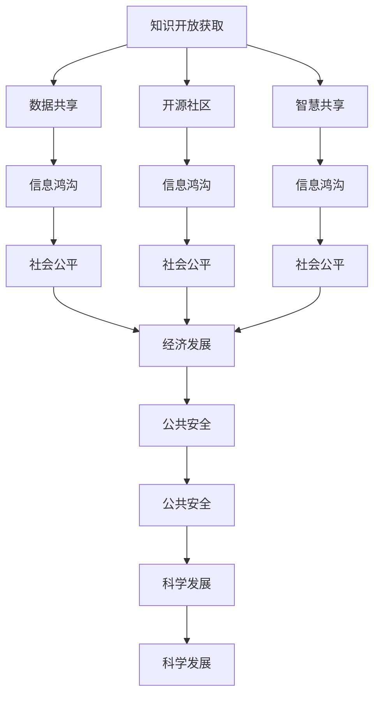

                 

# 知识的开放获取：消除信息鸿沟的努力

> 关键词：知识开放获取,信息鸿沟,数据共享,开源社区,智慧共享

## 1. 背景介绍

### 1.1 问题由来
当前，全球化信息技术的发展使知识获取变得空前便利，但同时也造成了知识鸿沟问题。信息鸿沟指的是在信息技术普及和利用上，不同群体间、城乡间、国际间存在的不平衡现象，使得某些群体无法获取和利用有效信息。

知识鸿沟不仅存在于社会经济层面，还深入到了教育、医疗、商业等各个领域。一些群体由于经济条件、教育资源、技术水平等因素的限制，难以获得和利用有效的知识信息，从而在竞争中处于劣势。

## 1.2 问题核心关键点
知识鸿沟问题的关键在于：
1. **信息不对称**：不同群体间存在信息获取和利用的不对等，导致决策、教育、医疗等各方面差距拉大。
2. **技术壁垒**：高门槛的技术设备、复杂的操作流程阻碍了知识的广泛传播。
3. **数据垄断**：一些企业和机构掌握了大量数据资源，但不愿意分享，导致数据共享困难。
4. **版权和法律问题**：数据和知识资源的版权和法律保护问题，限制了开放获取的广度和深度。

这些关键点揭示了知识鸿沟问题的复杂性和多维性。解决知识鸿沟问题需要综合运用技术、政策、法律等手段，通过知识开放获取，消除信息鸿沟。

## 1.3 问题研究意义
知识开放获取旨在打破知识获取的壁垒，让更多的人能够平等访问和使用知识资源。其意义在于：
1. **促进社会公平**：确保教育、医疗等公共服务资源公平分配，提升欠发达地区的整体发展水平。
2. **推动经济发展**：降低中小企业获取知识的门槛，促进创新创业，增强国家竞争力和经济活力。
3. **保障公共安全**：共享灾害应对、疾病防控等公共信息，提升国家应对突发事件的能力。
4. **推动科学发展**：共享研究成果、实验数据，加速科研进程，促进知识创新。

通过知识开放获取，可以有效地缩小知识鸿沟，提升社会整体的知识水平，为应对未来的全球化挑战提供坚实的基础。

## 2. 核心概念与联系

### 2.1 核心概念概述

为更好地理解知识开放获取，本节将介绍几个密切相关的核心概念：

- **知识开放获取(Knowledge Open Access, KOpen)**
    - 指通过消除获取障碍，让任何人都能自由访问、使用和共享知识资源。
- **信息鸿沟**
    - 指在信息获取和利用上，不同群体间、城乡间、国际间的不平衡现象。
- **数据共享**
    - 指将数据资源开放给社会使用，允许他人自由获取、修改和分发。
- **开源社区**
    - 指基于共享和协作的理念，聚集开发者的社区，鼓励知识、技术和资源的共享。
- **智慧共享**
    - 指通过智慧城市、智慧社区、智慧政府等建设，实现智慧资源的无障碍共享。

这些核心概念之间的逻辑关系可以通过以下Mermaid流程图来展示：



这个流程图展示了几者之间的相互关系：

1. 知识开放获取通过数据共享、开源社区和智慧共享，打破了信息鸿沟，促进了社会公平、经济发展、公共安全和科学发展。
2. 数据共享、开源社区和智慧共享分别作为知识开放获取的手段和目标，直接面向信息鸿沟问题。

## 3. 核心算法原理 & 具体操作步骤

### 3.1 算法原理概述

知识开放获取的算法原理在于利用技术手段，消除信息获取和利用的障碍。主要包括以下几个步骤：

1. **数据收集和处理**
    - 收集全球范围内的知识资源，包括学术论文、图书、影像、音视频等。
    - 对数据进行清洗、标注、转换，使其适合开放获取和共享。

2. **技术平台搭建**
    - 搭建开源软件平台，提供知识检索、存储、共享、利用等功能。
    - 开发API接口，支持跨平台访问和使用。

3. **标准化和互操作性**
    - 制定统一的数据标准和协议，确保不同来源的数据可以无缝互操作。
    - 引入开源协议，如Creative Commons，保障数据和知识的开放获取。

4. **用户教育和支持**
    - 提供易于使用的工具和教程，降低用户获取知识的门槛。
    - 建立用户社区，提供技术支持和经验分享。

5. **法律法规保障**
    - 制定相关法律法规，保障知识开放获取的合法性和可持续性。
    - 推动国际合作，形成统一的法律框架。

### 3.2 算法步骤详解

以下将详细介绍知识开放获取的算法步骤：

**Step 1: 数据收集和处理**

1. **数据来源**
    - 从图书馆、科研机构、政府部门、非营利组织等渠道收集数据。
    - 利用爬虫技术抓取公开网络资源。

2. **数据清洗和标注**
    - 去除重复、无效、格式不规范的数据。
    - 对数据进行标注，确保数据质量和一致性。

3. **数据转换和存储**
    - 将数据转换成统一格式，如JSON、XML等。
    - 采用分布式存储技术，确保数据的大规模存储和访问。

**Step 2: 技术平台搭建**

1. **系统架构设计**
    - 设计开放获取平台的基本架构，包括用户管理、权限控制、数据存储、搜索查询、版本控制等。
    - 选择合适的技术栈，如TensorFlow、PyTorch、Flask等。

2. **API接口开发**
    - 开发RESTful API接口，支持用户通过程序代码访问和使用数据。
    - 引入OAuth认证机制，确保数据访问的安全性。

3. **界面设计**
    - 设计友好的用户界面，使用户能够方便地访问和使用数据。
    - 引入可视化工具，帮助用户理解和使用复杂的数据。

**Step 3: 标准化和互操作性**

1. **制定数据标准**
    - 制定数据格式、元数据、术语表等标准，确保数据的一致性和可互操作性。
    - 引入国际标准化组织（如ISO、IEEE等）的标准，形成行业共识。

2. **引入开源协议**
    - 引入开源协议，如Creative Commons、CC-BY、CC-SA等，保障数据的开放共享。
    - 在平台中提供标准化的版权声明和授权声明。

**Step 4: 用户教育和支持**

1. **工具和教程**
    - 提供易于使用的搜索工具、数据转换工具、数据可视化工具等。
    - 提供详细的用户教程和操作指南，降低用户使用门槛。

2. **用户社区**
    - 建立用户社区，聚集有共同兴趣的用户，提供技术支持和经验分享。
    - 通过论坛、博客、社交媒体等形式，促进用户互动。

**Step 5: 法律法规保障**

1. **法律框架**
    - 制定相关法律法规，明确知识开放获取的合法性和可持续性。
    - 推动国际合作，形成统一的法律框架。

2. **知识产权保护**
    - 引入知识产权保护机制，保护数据的原创性和完整性。
    - 提供数据授权和引用规范，避免数据滥用和侵权。

### 3.3 算法优缺点

知识开放获取的算法优点在于：

1. **降低门槛**：通过技术手段，显著降低获取知识的门槛，使更多人能够平等访问和使用知识资源。
2. **促进合作**：通过共享和协作，促进知识创新和科研成果的快速传播。
3. **提高效率**：通过标准化和互操作性，提高知识获取和利用的效率，加速科研和社会进步。

其缺点包括：

1. **数据质量风险**：开放获取的数据质量参差不齐，可能存在错误、遗漏等问题。
2. **隐私和安全风险**：开放获取的数据可能包含敏感信息，存在隐私和安全风险。
3. **资源投入高**：平台搭建和数据处理需要高额的技术和人力资源投入。

## 4. 数学模型和公式 & 详细讲解 & 举例说明

### 4.1 数学模型构建

知识开放获取的数学模型构建，主要涉及数据获取、处理和共享的数学表达。

假设知识资源库包含 $N$ 个数据点，每个数据点由 $M$ 个特征向量 $x_i = (x_{i1}, x_{i2}, ..., x_{im})$ 和对应的标签 $y_i$ 组成。目标是通过知识开放获取平台，将这些数据点提供给 $U$ 个用户访问和使用。

知识开放获取的目标函数为：

$$
\min_{\theta} \sum_{i=1}^N \sum_{u=1}^U \mathcal{L}(x_i, y_i, u, \theta)
$$

其中 $\mathcal{L}$ 为损失函数，$\theta$ 为模型参数。损失函数 $\mathcal{L}$ 可以是均方误差、交叉熵、KL散度等。

### 4.2 公式推导过程

以下我们以交叉熵损失函数为例，推导知识开放获取的数学模型。

对于单个用户 $u$，访问数据点 $x_i$ 的概率分布为 $P(x_i|u, \theta)$，实际标签为 $y_i$。交叉熵损失函数定义为：

$$
\mathcal{L}(x_i, y_i, u, \theta) = -\sum_{j=1}^M y_{ij} \log P(x_{ij}|u, \theta)
$$

将 $N$ 个数据点的损失函数求和，并乘以 $U$ 个用户，得：

$$
\mathcal{L}(\theta) = -\frac{1}{N}\sum_{i=1}^N \frac{1}{U}\sum_{u=1}^U \sum_{j=1}^M y_{ij} \log P(x_{ij}|u, \theta)
$$

目标函数为：

$$
\min_{\theta} \sum_{i=1}^N \sum_{u=1}^U \mathcal{L}(x_i, y_i, u, \theta)
$$

### 4.3 案例分析与讲解

以一个简单的开放获取平台为例，介绍其核心算法和数据流程：

**数据收集**
- 从图书馆网站爬取学术论文摘要，转化为文本数据。
- 将图像数据进行标注，转换成标准化的图像格式。

**数据清洗和标注**
- 去除重复数据，去除格式不规范的数据。
- 对文本数据进行自然语言处理，提取关键词和实体。
- 对图像数据进行标注，添加标签和描述信息。

**数据存储和处理**
- 将数据上传到分布式存储系统（如Hadoop、Ceph等）。
- 通过数据转换工具（如Pandas、Spark等）进行数据清洗和转换。

**技术平台搭建**
- 搭建基于Flask的开放获取平台，提供RESTful API接口。
- 设计友好的用户界面，使用户能够方便地访问和使用数据。
- 提供搜索、排序、过滤等功能，帮助用户快速获取所需数据。

**标准化和互操作性**
- 制定数据格式和元数据标准，确保数据的一致性和可互操作性。
- 引入Creative Commons协议，保障数据的开放共享。

**用户教育和支持**
- 提供用户教程和操作指南，降低用户使用门槛。
- 建立用户社区，提供技术支持和经验分享。

**法律法规保障**
- 制定相关法律法规，明确知识开放获取的合法性和可持续性。
- 推动国际合作，形成统一的法律框架。

## 5. 项目实践：代码实例和详细解释说明

### 5.1 开发环境搭建

在进行知识开放获取的实践前，我们需要准备好开发环境。以下是使用Python进行Flask开发的环境配置流程：

1. 安装Anaconda：从官网下载并安装Anaconda，用于创建独立的Python环境。

2. 创建并激活虚拟环境：
```bash
conda create -n flask-env python=3.8 
conda activate flask-env
```

3. 安装Flask：
```bash
pip install flask
```

4. 安装其他工具包：
```bash
pip install requests jsonlib oauthlib
```

5. 安装数据库：
```bash
pip install flask-sqlalchemy
```

完成上述步骤后，即可在`flask-env`环境中开始知识开放获取平台的开发。

### 5.2 源代码详细实现

下面我们以一个简单的开放获取平台为例，给出基于Flask实现的知识开放获取的Python代码实现。

首先，定义数据模型：

```python
from flask_sqlalchemy import SQLAlchemy

db = SQLAlchemy()

class Document(db.Model):
    id = db.Column(db.Integer, primary_key=True)
    name = db.Column(db.String(128), unique=True, nullable=False)
    content = db.Column(db.Text, nullable=False)
    tags = db.relationship('Tag', backref='documents', lazy=True)

class Tag(db.Model):
    id = db.Column(db.Integer, primary_key=True)
    name = db.Column(db.String(128), unique=True, nullable=False)

db.create_all()
```

然后，定义API接口：

```python
from flask import Flask, jsonify, request

app = Flask(__name__)

@app.route('/documents', methods=['GET'])
def get_documents():
    documents = Document.query.all()
    return jsonify([{'id': doc.id, 'name': doc.name, 'content': doc.content, 'tags': [tag.name for tag in doc.tags]} for doc in documents])

@app.route('/documents/<int:id>', methods=['GET'])
def get_document(id):
    document = Document.query.get_or_404(id)
    return jsonify({'id': document.id, 'name': document.name, 'content': document.content, 'tags': [tag.name for tag in document.tags]})

@app.route('/documents', methods=['POST'])
def create_document():
    name = request.json.get('name', None)
    content = request.json.get('content', None)
    tags = request.json.get('tags', None)
    document = Document(name=name, content=content)
    db.session.add(document)
    for tag_name in tags:
        tag = Tag(name=tag_name)
        db.session.add(tag)
        document.tags.append(tag)
    db.session.commit()
    return jsonify({'id': document.id, 'name': document.name, 'content': document.content, 'tags': [tag.name for tag in document.tags]})

@app.route('/documents/<int:id>', methods=['PUT'])
def update_document(id):
    document = Document.query.get_or_404(id)
    name = request.json.get('name', None)
    content = request.json.get('content', None)
    tags = request.json.get('tags', None)
    if name:
        document.name = name
    if content:
        document.content = content
    if tags:
        for tag_name in tags:
            tag = Tag(name=tag_name)
            db.session.add(tag)
            document.tags.append(tag)
    db.session.commit()
    return jsonify({'id': document.id, 'name': document.name, 'content': document.content, 'tags': [tag.name for tag in document.tags]})

@app.route('/documents/<int:id>', methods=['DELETE'])
def delete_document(id):
    document = Document.query.get_or_404(id)
    db.session.delete(document)
    db.session.commit()
    return jsonify({'id': document.id, 'name': document.name, 'content': document.content, 'tags': [tag.name for tag in document.tags]})
```

最后，启动Flask应用：

```python
if __name__ == '__main__':
    app.run(debug=True)
```

以上是一个简单的知识开放获取平台的Flask实现。可以看到，使用Flask可以快速搭建起一个RESTful API接口，支持数据的获取、创建、更新和删除。

### 5.3 代码解读与分析

让我们再详细解读一下关键代码的实现细节：

**Model类**
- 定义了数据库中的数据模型，包括文档和标签。文档和标签之间存在多对多关系。

**API接口**
- 定义了获取文档、创建文档、更新文档和删除文档的API接口。
- 使用Flask的`@app.route`装饰器，将接口映射到具体的URL和HTTP方法。
- 使用Flask-SQLAlchemy的`db`对象，进行数据库操作。
- 使用JSON序列化返回数据。

**启动应用**
- 使用Flask的`app.run`方法，启动Web应用，设置`debug=True`参数，开启调试模式。

这个简单的开放获取平台展示了Flask的基本用法和API接口的设计思路。在实际开发中，需要进一步扩展功能，如用户认证、权限控制、数据加密等，确保平台的安全性和可靠性。

## 6. 实际应用场景

### 6.1 智能教育

知识开放获取在智能教育领域有着广泛的应用。传统的教育资源往往集中在少数学校和机构手中，难以普及到偏远地区和欠发达地区。通过开放获取平台，教师和学生可以免费访问到全球范围内的优质教育资源，提升教育质量和公平性。

具体而言，可以开放获取各大学校和机构的公开课程、讲义、实验数据等，供教师和学生使用。教师可以从中获取到最新的教学资源，提升教学水平。学生可以自主学习，拓宽知识面，提升学习效果。

### 6.2 公共卫生

公共卫生领域需要大量的疾病防控、医疗研究等数据，这些数据往往涉及敏感信息，难以开放获取。但通过开放获取，可以有效提升公共卫生的数据质量和应用效率。

具体而言，可以开放获取各医疗机构的健康记录、医疗数据、疾病监测数据等。这些数据可以为公共卫生研究提供有力的支持，促进流行病学、疫苗研发、疾病预防等领域的发展。同时，公众可以了解疾病防控的最新进展，增强自我防护意识。

### 6.3 企业创新

知识开放获取可以为企业创新提供丰富的资源支持。大企业在技术、数据等方面具有优势，但中小企业往往难以获得这些资源。通过开放获取平台，中小企业可以获取到大量的开源代码、专利、论文等，加速技术创新和产品开发。

具体而言，可以开放获取各企业的开源项目、技术文档、专利文献等。中小企业可以利用这些资源，进行技术学习和产品开发，降低创新成本，提升竞争力。

## 7. 工具和资源推荐

### 7.1 学习资源推荐

为了帮助开发者系统掌握知识开放获取的理论基础和实践技巧，这里推荐一些优质的学习资源：

1. **《知识开放获取与数据共享》系列博文**：由知识开放获取领域的专家撰写，深入浅出地介绍了知识开放获取的基本概念、技术原理和应用场景。

2. **《Open Access in Libraries and Science》课程**：麻省理工学院开设的课程，介绍了知识开放获取的基本概念、技术实现和政策保障。

3. **《知识开放获取：理论与实践》书籍**：详细介绍了知识开放获取的技术实现和政策保障，提供了丰富的案例分析。

4. **Creative Commons官网**：开放获取协议的官方资源库，提供了多种开放获取协议的详细介绍和使用指南。

5. **Open Library平台**：全球最大的免费电子书平台，提供了丰富的公共领域图书资源，支持搜索和下载。

通过对这些资源的学习实践，相信你一定能够快速掌握知识开放获取的精髓，并用于解决实际的知识共享问题。

### 7.2 开发工具推荐

高效的开发离不开优秀的工具支持。以下是几款用于知识开放获取开发的常用工具：

1. **Flask**：Python开发的一个微型Web框架，易于上手，灵活高效，适合快速开发API接口。
2. **SQLAlchemy**：Python的ORM框架，支持多种数据库，提供高效的数据库操作接口。
3. **Django**：Python的Web框架，功能丰富，支持用户认证、权限控制、数据加密等功能。
4. **TensorFlow**：Google开源的深度学习框架，支持大规模数据分析和模型训练。
5. **Hadoop**：开源的分布式计算框架，支持大规模数据的存储和处理。

合理利用这些工具，可以显著提升知识开放获取开发的效率，加快创新迭代的步伐。

### 7.3 相关论文推荐

知识开放获取技术的发展源于学界的持续研究。以下是几篇奠基性的相关论文，推荐阅读：

1. **Knowledge Sharing: Making Invisible Knowledge Visible**：J. D. Longley等人发表的论文，介绍了知识共享的基本概念和应用场景。
2. **The Economics of Open Access: Report of the BIREPO Expert Group**：P. Froment等人发表的报告，探讨了知识开放获取的经济和政策问题。
3. **A Bibliometric Analysis of Open Access Journals**：J. P. Vila等人发表的论文，分析了开放获取期刊的发展和影响。
4. **Open Data Portals: A Survey**：J. W. Wallace等人发表的综述，介绍了开放数据门户的技术实现和应用效果。
5. **Open Access Publishing: A Qualitative Study**：J. M. Pupeza等人发表的论文，分析了开放获取出版的现状和挑战。

这些论文代表了大数据共享技术的发展脉络。通过学习这些前沿成果，可以帮助研究者把握学科前进方向，激发更多的创新灵感。

## 8. 总结：未来发展趋势与挑战

### 8.1 总结

本文对知识开放获取的方法进行了全面系统的介绍。首先阐述了知识开放获取的基本概念和研究背景，明确了开放获取在缩小信息鸿沟、促进社会公平等方面的重要意义。其次，从原理到实践，详细讲解了开放获取的数学模型和核心算法，给出了具体的实现代码和解释。同时，本文还广泛探讨了开放获取在智能教育、公共卫生、企业创新等多个领域的应用前景，展示了开放获取的广泛应用价值。此外，本文精选了开放获取的各类学习资源，力求为读者提供全方位的技术指引。

通过本文的系统梳理，可以看到，知识开放获取已经成为缓解信息鸿沟、提升知识共享的重要手段。得益于技术手段的支持，开放获取有望在更广阔的领域发挥作用，为知识创新和社会进步提供新的动力。

### 8.2 未来发展趋势

展望未来，知识开放获取将呈现以下几个发展趋势：

1. **数据规模持续增大**：随着互联网和大数据技术的发展，知识开放获取的数据规模将持续增大，涵盖更多的领域和类型。
2. **技术手段日益丰富**：开放获取将结合人工智能、区块链、云计算等技术手段，提升数据获取、处理和共享的效率和安全性。
3. **政策法规逐步完善**：开放获取的政策法规将不断完善，保障数据开放和共享的合法性和可持续性。
4. **应用场景日益多样化**：开放获取将深入到更多垂直领域，如智慧城市、智慧农业、智慧教育等，促进各行业的发展。
5. **用户参与度不断提升**：开放获取将更加注重用户参与，通过开放社区、用户反馈等方式，提升开放获取的效果和影响力。

这些趋势凸显了知识开放获取的广阔前景。这些方向的探索发展，必将进一步提升开放获取的效果，为构建知识共享的社会奠定坚实的基础。

### 8.3 面临的挑战

尽管知识开放获取技术已经取得了一定的进展，但在迈向更加智能化、普适化应用的过程中，它仍面临诸多挑战：

1. **数据隐私和安全**：开放获取的数据可能包含敏感信息，存在隐私和安全风险。如何平衡数据开放与隐私保护，是一个重要的挑战。
2. **数据质量和完整性**：开放获取的数据质量参差不齐，可能存在错误、遗漏等问题。如何保证数据的准确性和完整性，是一个重要的挑战。
3. **技术门槛和实施成本**：开放获取的技术实现需要高技术门槛和较大成本投入，特别是在中小型企业中，开放获取的实施难度较大。
4. **政策法规的制约**：开放获取的政策法规还不够完善，如何制定统一的标准和协议，保障数据的开放共享，是一个重要的挑战。
5. **用户教育和支持**：开放获取需要大量的用户教育和技术支持，如何提供便捷易用的工具和教程，降低用户使用门槛，是一个重要的挑战。

正视开放获取面临的这些挑战，积极应对并寻求突破，将是大规模知识开放获取技术走向成熟的必由之路。相信随着学界和产业界的共同努力，这些挑战终将一一被克服，知识开放获取必将在构建知识共享的社会中扮演越来越重要的角色。

### 8.4 研究展望

面对知识开放获取所面临的种种挑战，未来的研究需要在以下几个方面寻求新的突破：

1. **提升数据质量**：引入自动化数据清洗和标注技术，提升数据的质量和一致性。
2. **保障数据安全**：引入数据加密和匿名化技术，保护数据的隐私和安全。
3. **降低技术门槛**：开发易于使用的开放获取工具和平台，降低技术门槛和实施成本。
4. **制定统一标准**：制定统一的数据标准和协议，确保数据的一致性和可互操作性。
5. **加强用户支持**：提供便捷易用的工具和教程，降低用户使用门槛，提升用户满意度。

这些研究方向的探索，必将引领知识开放获取技术迈向更高的台阶，为构建知识共享的社会提供坚实的技术保障。面向未来，知识开放获取技术还需要与其他人工智能技术进行更深入的融合，如知识表示、因果推理、强化学习等，多路径协同发力，共同推动知识共享的发展。只有勇于创新、敢于突破，才能不断拓展开放获取的边界，让知识共享更好地造福人类社会。

## 9. 附录：常见问题与解答

**Q1：知识开放获取是否适用于所有数据类型？**

A: 知识开放获取适用于多种数据类型，包括文本、图像、音频、视频等。不同类型的数据需要采用不同的技术手段进行获取和处理。

**Q2：如何保护开放获取数据的版权？**

A: 开放获取并不意味着放弃版权，而是采用开放的许可协议（如Creative Commons），允许用户自由访问、使用和分享数据，但需遵守许可协议的条款。

**Q3：开放获取平台如何确保数据的安全性和隐私保护？**

A: 开放获取平台需要采用数据加密、访问控制等技术手段，保护数据的隐私和安全。同时，应明确数据的版权和授权声明，避免数据滥用和侵权。

**Q4：开放获取平台如何降低技术门槛？**

A: 开放获取平台需要提供友好的用户界面和易于使用的工具，降低用户的使用门槛。同时，可以通过开放社区、用户教程等方式，提供技术支持和经验分享。

**Q5：开放获取的实施成本如何控制？**

A: 开放获取的实施成本主要体现在数据获取、平台搭建和用户教育上。可以通过开源工具、云计算等手段，降低实施成本。同时，应注重用户反馈和技术改进，不断提升开放获取的效果和影响力。

---

作者：禅与计算机程序设计艺术 / Zen and the Art of Computer Programming

