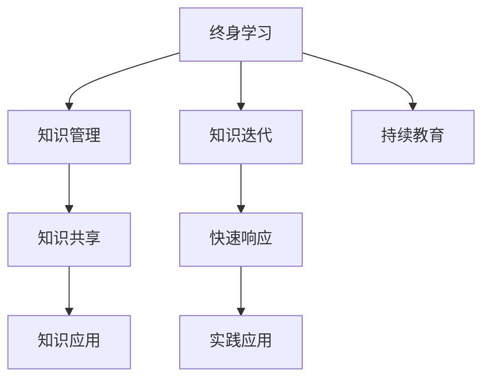

                 

# 知识的快速迭代：终身学习的必要性

> 关键词：终身学习,知识迭代,快速响应,技术更新,持续教育,知识管理

## 1. 背景介绍

### 1.1 问题由来
随着科技的快速发展，知识更新速度不断加快，终身学习已成为当今社会每个从业者的必备技能。终身学习指的是个体在整个职业生涯中持续不断地学习新知识和技能，以适应职业和个人生活的变化。终身学习的重要性体现在其能够帮助个人保持竞争力，适应新的工作环境和挑战。然而，知识的快速迭代也带来了新的挑战，如何高效、有效地学习和掌握新知识，成为现代职场人士必须面对的问题。

### 1.2 问题核心关键点
本文将深入探讨终身学习的核心问题，包括：

1. **知识更新速度**：科技日新月异，新知识、新技术层出不穷。
2. **学习效率**：如何高效地获取和掌握新知识。
3. **技能转化**：将新知识应用于实际工作中的能力。
4. **知识管理**：如何组织和应用已有知识。
5. **持续改进**：如何在实践中进行反馈和改进。

这些问题不仅影响个人的职业发展，也对企业的组织文化和人才培养机制提出新的要求。

## 2. 核心概念与联系

### 2.1 核心概念概述

为更好地理解终身学习的必要性，我们首先介绍几个核心概念：

- **终身学习（Lifelong Learning）**：指个体在职业生涯中持续不断地获取新知识和技能，以适应不断变化的环境和需求。
- **知识管理（Knowledge Management）**：通过有效的方法和技术，识别、创造、获取、传播和利用知识的过程，以实现知识共享和知识转化。
- **知识迭代（Knowledge Iteration）**：指在实践过程中，通过反馈和改进，不断优化和更新知识的持续过程。
- **快速响应（Agile Response）**：指组织和个人能够快速适应环境变化，及时响应新知识和新技术的能力。
- **持续教育（Continuous Education）**：指通过不断的学习和培训，保持知识和技能的更新，适应职业发展的需要。

这些概念之间的逻辑关系可以通过以下Mermaid流程图来展示：



这个流程图展示了这个系统的关键组成部分：

1. 个体通过终身学习获取新知识。
2. 知识管理帮助个体有效地组织和使用知识。
3. 知识迭代确保知识在实践中不断更新和优化。
4. 快速响应帮助个体和企业迅速适应新变化。
5. 持续教育保证知识获取的持续性和系统性。
6. 实践应用将知识转化为实际的解决方案。
7. 知识共享促进知识的传播和应用。

## 3. 核心算法原理 & 具体操作步骤
### 3.1 算法原理概述

终身学习的核心在于知识的快速迭代。知识的迭代过程可以通过反馈和改进机制来实现，使得个体和企业能够不断优化其知识库，提升适应性和竞争力。这一过程可以通过以下几个关键步骤实现：

1. **知识获取**：通过阅读、培训、项目经验等方式获取新知识。
2. **知识存储**：使用知识管理系统存储和组织新知识。
3. **知识应用**：将新知识应用于实际工作，通过实践验证其有效性。
4. **知识反馈**：通过评估和反思，收集反馈信息，识别知识应用中的问题和改进点。
5. **知识更新**：根据反馈信息，调整和优化知识库，进行迭代更新。

这一过程可以形成一个循环，确保知识和技能的持续改进和提升。

### 3.2 算法步骤详解

基于上述原理，下面详细介绍实现知识快速迭代的详细步骤：

**Step 1: 知识获取**
- **阅读**：定期阅读专业书籍、论文、行业报告等，保持对最新知识的了解。
- **培训**：参加各类在线课程、工作坊、研讨会，提升专业技能。
- **实践**：参与项目、实验、研究，通过实际应用获取新知识。

**Step 2: 知识存储**
- **文档管理系统**：使用专业的文档管理系统，如Confluence、SharePoint等，存储和组织知识文档。
- **知识库**：建立企业级的知识库，如Wikibase、IBM Knowledge Center等，集成和共享知识。

**Step 3: 知识应用**
- **项目实践**：将新知识应用于项目中，验证其有效性和实用性。
- **创新实验**：进行创新实验，探索新知识的应用场景和潜力。

**Step 4: 知识反馈**
- **评估与反思**：定期进行项目评估和反思，记录知识应用的效果和问题。
- **反馈收集**：通过调查问卷、用户反馈等方式，收集知识应用过程中的反馈信息。

**Step 5: 知识更新**
- **调整和优化**：根据反馈信息，调整和优化知识库，删除过时或错误的信息。
- **迭代更新**：通过不断的调整和优化，确保知识库的最新性和有效性。

### 3.3 算法优缺点

终身学习的知识迭代方法具有以下优点：

1. **灵活性高**：可以快速适应新知识，适应各种变化。
2. **持续改进**：通过不断的反馈和优化，确保知识的准确性和实用性。
3. **提升竞争力**：不断获取新知识和技能，保持竞争优势。
4. **促进创新**：通过知识的应用和反馈，激发创新思维和实践。

同时，这种方法也存在一些局限性：

1. **时间和精力投入**：需要持续的学习和实践，对时间和精力要求较高。
2. **资源成本**：需要投入相应的工具和资源，如培训、文档管理系统的维护等。
3. **知识管理难度**：有效管理和应用知识库，需要一定的专业技能和经验。
4. **反馈信息质量**：反馈信息的准确性和完整性，直接影响到知识迭代的有效性。

尽管存在这些局限性，但通过合理的策略和工具，这些挑战是可以被克服的。

### 3.4 算法应用领域

终身学习的知识迭代方法在多个领域都得到了广泛应用，例如：

- **企业培训**：通过持续的员工培训和知识更新，提升企业整体的知识水平和竞争力。
- **医疗健康**：通过持续的医学研究和新知识的获取，提高医疗服务的质量和效果。
- **教育**：通过不断更新教育内容和方法，培养具备终身学习能力的未来人才。
- **科研**：通过持续的科研活动和知识应用，推动科学技术的进步和发展。
- **金融**：通过不断学习和应用金融新知识，提升金融产品的创新能力和风险管理能力。

## 4. 数学模型和公式 & 详细讲解 & 举例说明

### 4.1 数学模型构建

在知识迭代过程中，可以通过数学模型来量化和优化这一过程。假设个体掌握的知识库为 $K$，每次迭代增加的知识量为 $D$，则迭代后的知识库 $K'$ 可以表示为：

$$
K' = K + D
$$

其中，$K$ 为当前知识库，$D$ 为新增知识量。每次迭代后，知识库 $K'$ 的准确性和实用性得到提升。

### 4.2 公式推导过程

根据上述模型，我们可以进一步推导出知识迭代的效率和效果。设每次迭代的平均新增知识量为 $d$，每次迭代的时间为 $t$，则知识迭代周期 $T$ 为：

$$
T = \frac{K}{d}
$$

其中，$K$ 为当前知识库的大小，$d$ 为每次迭代增加的知识量。通过优化 $d$ 和 $t$，可以提升知识迭代的效率。

### 4.3 案例分析与讲解

假设一个企业需要提升其在人工智能领域的专业能力。企业可以通过以下步骤实现知识迭代：

1. **知识获取**：通过招聘高水平AI人才、参加AI相关的研讨会、订阅AI领域的学术期刊等，获取最新的AI知识和技能。
2. **知识存储**：将获取的知识整理成文档、代码、模型等形式，存储在企业内部的知识库中。
3. **知识应用**：将新知识应用到实际项目中，如使用新算法优化产品功能，提升用户体验。
4. **知识反馈**：通过项目评估和用户反馈，收集知识应用的效果和问题。
5. **知识更新**：根据反馈信息，调整和优化知识库，删除过时的算法和模型。

通过这一过程，企业能够持续提升其AI技术水平，保持市场竞争力。

## 5. 项目实践：代码实例和详细解释说明

### 5.1 开发环境搭建

为了实现知识迭代的自动化和系统化，我们需要搭建一个项目开发环境。以下是使用Python和Jupyter Notebook进行知识管理系统的开发环境配置流程：

1. 安装Python：确保系统已经安装Python 3.x版本。
2. 安装Jupyter Notebook：使用pip安装jupyter notebook，创建一个开发环境。
3. 安装必要的库：安装pandas、numpy、matplotlib等库，用于数据处理和可视化。
4. 配置文档管理系统：可以使用Confluence、SharePoint等工具，创建知识库和文档管理系统。

完成上述步骤后，就可以开始构建知识迭代系统。

### 5.2 源代码详细实现

下面以一个简单的知识管理系统为例，展示如何使用Python实现知识迭代。

首先，定义知识库的类：

```python
class KnowledgeBase:
    def __init__(self):
        self.knowledge = {}
        
    def add_knowledge(self, topic, content):
        self.knowledge[topic] = content
        
    def get_knowledge(self, topic):
        return self.knowledge.get(topic, "Topic not found")
```

然后，实现知识迭代的过程：

```python
kb = KnowledgeBase()

# 添加新知识
kb.add_knowledge("Python", "Python is a popular programming language.")
kb.add_knowledge("Machine Learning", "Machine learning is a subset of artificial intelligence.")

# 获取知识
print(kb.get_knowledge("Python"))
print(kb.get_knowledge("JavaScript"))

# 更新知识
kb.add_knowledge("Python", "Python 3.8 has new features.")
kb.add_knowledge("Machine Learning", "Deep learning is a subset of machine learning.")

# 输出更新后的知识
print(kb.get_knowledge("Python"))
print(kb.get_knowledge("Machine Learning"))
```

### 5.3 代码解读与分析

代码中定义了一个简单的知识库类 `KnowledgeBase`，具有添加知识和获取知识的功能。通过添加新知识，知识库得到了更新和扩展。通过获取知识，可以验证知识库的正确性。在实际应用中，可以通过API、Web服务等方式，实现知识库的访问和管理。

## 6. 实际应用场景

### 6.1 企业培训系统

在企业培训系统中，知识迭代方法可以用于设计灵活的培训课程和内容。通过持续收集培训反馈，及时调整和优化培训内容，确保培训效果和员工的知识更新。

### 6.2 医疗健康系统

在医疗健康领域，知识迭代方法可以帮助医疗机构及时获取和应用最新的医学研究成果。通过持续的医学研究和新知识的获取，提升医疗服务的质量和效果。

### 6.3 教育系统

在教育系统中，知识迭代方法可以用于开发持续更新的课程和教材。通过不断更新教学内容和教学方法，培养具备终身学习能力的未来人才。

### 6.4 金融系统

在金融系统中，知识迭代方法可以帮助金融机构及时获取和应用最新的金融知识。通过持续的学习和应用，提升金融产品的创新能力和风险管理能力。

### 6.5 科研系统

在科研系统中，知识迭代方法可以帮助科研机构及时获取和应用最新的科研成果。通过持续的科研活动和知识应用，推动科学技术的进步和发展。

## 7. 工具和资源推荐

### 7.1 学习资源推荐

为了帮助开发者系统掌握终身学习的理论基础和实践技巧，这里推荐一些优质的学习资源：

1. **《Lifelong Learning》系列博文**：由终身学习专家撰写，深入浅出地介绍了终身学习的概念、方法和案例。
2. **Coursera《Lifelong Learning》课程**：由多所大学和机构提供的在线课程，涵盖终身学习的各个方面，包括知识管理、技能转化等。
3. **Udemy《Learning for a Lifetime》课程**：提供实用的终身学习技巧和方法，涵盖多种学习工具和资源。
4. **TED Talks《The Power of Lifelong Learning》**：通过TED Talks演讲，了解终身学习的重要性和实践方法。
5. **edX《Lifelong Learning》课程**：提供系统的终身学习课程，涵盖知识管理、学习策略、学习工具等。

通过对这些资源的学习实践，相信你一定能够系统地掌握终身学习的核心知识和技能，更好地应对未来的挑战。

### 7.2 开发工具推荐

高效的开发离不开优秀的工具支持。以下是几款用于知识管理系统的常用工具：

1. **Confluence**：协作文档管理系统，支持团队协作和知识共享。
2. **SharePoint**：企业级知识库管理系统，集成文档、任务、工作流等功能。
3. **Trello**：项目管理工具，支持任务分配、进度跟踪、文档共享等功能。
4. **Google Workspace**：基于云的协作平台，支持文档、表格、幻灯片等工具，方便团队协作和知识共享。
5. **Notion**：综合型笔记和知识管理系统，支持文档、任务、数据库等多种功能。

合理利用这些工具，可以显著提升知识管理系统的开发效率，实现知识的系统化和自动化。

### 7.3 相关论文推荐

终身学习的发展得益于学界的持续研究。以下是几篇奠基性的相关论文，推荐阅读：

1. **《Lifelong Learning》论文**：介绍了终身学习的概念、理论和实践方法。
2. **《Knowledge Management and Lifelong Learning》论文**：探讨了知识管理和终身学习的关系，提出了系统化的知识管理策略。
3. **《Agile Learning and Lifelong Learning》论文**：研究了敏捷学习和终身学习的结合，提出了快速响应的知识管理方法。
4. **《Continuous Education and Lifelong Learning》论文**：探讨了持续教育与终身学习的融合，提出了系统化的教育策略。
5. **《Lifelong Learning and Adaptation》论文**：研究了终身学习在适应环境变化中的作用，提出了面向未来的学习策略。

这些论文代表了大终身学习的核心发展方向，通过学习这些前沿成果，可以帮助研究者更好地把握学科前进方向，激发更多的创新灵感。

## 8. 总结：未来发展趋势与挑战

### 8.1 总结

本文对终身学习的核心问题进行了全面系统的介绍。首先阐述了终身学习的必要性，明确了知识更新速度、学习效率、技能转化、知识管理和持续改进等方面的核心问题。其次，从原理到实践，详细讲解了知识迭代的基本流程，给出了知识管理系统的完整代码实例。同时，本文还探讨了知识迭代在多个行业领域的应用前景，展示了知识迭代范式的广阔前景。

通过本文的系统梳理，可以看到，知识迭代方法在终身学习中的重要性。这一方法不仅能够帮助个体和企业提升竞争力和适应性，还能够推动技术和社会的发展，具有深远的社会意义。

### 8.2 未来发展趋势

展望未来，终身学习的知识迭代技术将呈现以下几个发展趋势：

1. **人工智能辅助**：利用人工智能技术，自动收集和分析知识更新，提供个性化的学习推荐。
2. **数据驱动**：通过大数据分析，优化学习路径和内容，提升学习效率和效果。
3. **跨领域应用**：将知识迭代方法应用于更多领域，如教育、医疗、金融等，推动各行业的持续创新和发展。
4. **个性化定制**：根据个体的学习习惯和兴趣，定制个性化的学习计划和内容，提高学习效果。
5. **系统化管理**：通过知识管理系统和平台，实现知识收集、存储、共享和应用的系统化管理。

这些趋势凸显了知识迭代技术的广阔前景。这些方向的探索发展，必将进一步提升终身学习的效率和效果，促进个体和社会的持续进步。

### 8.3 面临的挑战

尽管知识迭代方法已经取得了显著成效，但在迈向更加智能化、普适化应用的过程中，它仍面临诸多挑战：

1. **时间和精力投入**：终身学习需要持续的学习和实践，对时间和精力要求较高。
2. **资源成本**：需要投入相应的工具和资源，如培训、文档管理系统的维护等。
3. **知识管理难度**：有效管理和应用知识库，需要一定的专业技能和经验。
4. **反馈信息质量**：反馈信息的准确性和完整性，直接影响到知识迭代的有效性。
5. **个性化需求**：如何根据个体的需求和兴趣，定制个性化的学习计划和内容。

尽管存在这些挑战，但通过合理的策略和工具，这些挑战是可以被克服的。

### 8.4 研究展望

面对知识迭代面临的挑战，未来的研究需要在以下几个方面寻求新的突破：

1. **自动化和智能化**：开发自动化的知识收集和分析工具，提高知识更新的效率和准确性。
2. **数据驱动的个性化学习**：利用大数据和机器学习技术，实现个性化学习路径和内容推荐。
3. **跨领域知识整合**：探索如何将不同领域和模态的知识进行整合，形成更加全面和丰富的知识库。
4. **知识管理工具的创新**：开发更加智能和易用的知识管理工具，提高知识应用的便捷性和效果。
5. **伦理和社会影响**：研究知识迭代对社会和个人的影响，确保知识管理的公平性和伦理性。

这些研究方向的探索，必将引领知识迭代技术迈向更高的台阶，为构建学习型社会和智能型组织提供新的思路和工具。

## 9. 附录：常见问题与解答

**Q1：终身学习是否只适用于专业人士？**

A: 终身学习适用于各个行业和领域，不仅限于专业人士。无论是学生、教师、家长，还是企业管理者，都可以通过终身学习不断提升自身素质和能力。

**Q2：如何平衡学习和工作？**

A: 可以通过时间管理、任务分配等方法，合理规划学习和工作时间，提高效率。同时，可以利用在线课程、自学材料等灵活的学习方式，减少对时间和精力的占用。

**Q3：终身学习是否需要不断更新学习工具？**

A: 随着技术的不断进步，确实需要不断更新和升级学习工具，以适应新的学习需求。但工具的选择和使用应该根据个人需求和实际情况，不必盲目跟风。

**Q4：如何评估知识迭代的效果？**

A: 可以通过项目评估、用户反馈、绩效考核等方式，评估知识迭代的效果。同时，也可以通过知识库的更新频率和质量，衡量知识迭代的效率和效果。

**Q5：终身学习是否需要付费？**

A: 终身学习可以选择多种方式进行，如自学、在线课程、书籍、讲座等。付费课程和资源可以提供更加系统化和专业的学习路径，但自学和免费资源也完全可以满足需求。

总之，终身学习是一个持续不断的过程，需要通过不断学习和实践，提升知识和技能，保持竞争力。通过合理的策略和工具，克服学习中的挑战，实现个人和社会的持续进步。

