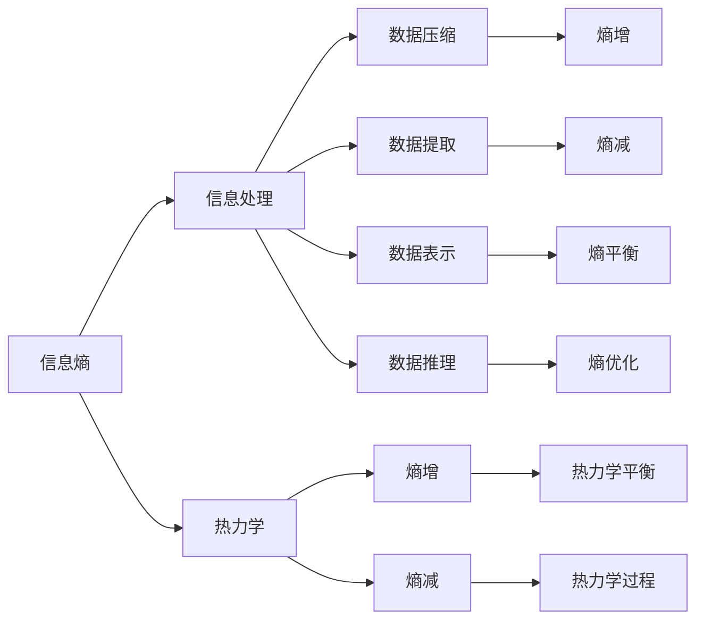

                 

# 知识的熵增与熵减：信息处理的热力学

> 关键词：信息熵,热力学,知识表示,信息提取,数据压缩,智能推理

## 1. 背景介绍

### 1.1 问题由来

在现代信息社会，数据和信息的处理和利用成为驱动经济和科技发展的重要力量。然而，随着数据量的爆炸性增长，如何高效地处理和利用这些数据，成为一个重要的问题。从经典的信息论到新生的数据压缩技术，从传统的符号计算到现代的神经网络，不同的理论和模型被用于解决信息处理的挑战。本文将从信息熵和热力学的视角，探讨信息处理的基本原理和优化方法。

### 1.2 问题核心关键点

信息处理的核心问题在于如何将输入数据转换为更有用的形式，以便更好地用于推理、决策和表达。这一过程涉及到数据的压缩、表示、提取和推理等步骤。信息熵（Information Entropy）作为信息论中的核心概念，是描述数据不确定性和信息量的重要工具。热力学则提供了一种从微观状态到宏观行为的建模方法，与信息处理的优化问题有诸多相似之处。因此，本文将通过信息熵和热力学之间的联系，揭示信息处理的本质，并探讨如何通过熵增与熵减来实现高效的信息处理。

### 1.3 问题研究意义

掌握信息处理的基本原理和方法，对于理解和应用现代信息技术和人工智能系统具有重要意义。信息熵与热力学结合的思想，不仅能够为信息处理提供新的理论框架，还能启发新的算法和技术，提高信息处理系统的效率和性能。此外，对热力学的理解和应用，还能够帮助解决复杂系统的优化和控制问题，对于工程和物理等领域同样具有重要价值。

## 2. 核心概念与联系

### 2.1 核心概念概述

在信息处理中，信息熵（Information Entropy）是描述数据不确定性和信息量的重要工具。热力学则提供了一种从微观状态到宏观行为的建模方法。本文将从这两个视角出发，探讨信息处理的基本原理和优化方法。

**信息熵（Information Entropy）**：
- **定义**：信息熵是描述系统不确定性或信息量的数学工具。在信息论中，信息熵定义为：$H(X) = -\sum_{i=1}^n p(x_i) \log p(x_i)$，其中 $p(x_i)$ 为随机变量 $X$ 取值 $x_i$ 的概率。
- **意义**：信息熵反映了随机变量或分布的不确定性。熵值越低，随机变量或分布越确定；熵值越高，随机变量或分布越不确定。

**热力学（Thermodynamics）**：
- **定义**：热力学是研究热能及其传递和转换的学科，主要研究热力学系统从微观状态到宏观行为的规律。
- **核心概念**：热力学系统、热力学状态、热力学平衡、热力学过程、熵等。

### 2.2 核心概念原理和架构的 Mermaid 流程图



这个流程图展示了信息熵和热力学与信息处理的主要关系：

1. 信息熵是描述信息不确定性的工具，信息处理的目标是通过熵增和熵减降低不确定性。
2. 热力学提供了一种从微观状态到宏观行为的建模方法，与信息处理的优化问题有诸多相似之处。
3. 数据压缩、数据提取、数据表示和数据推理是信息处理的主要步骤，与熵增和熵减密切相关。
4. 热力学平衡和热力学过程是信息处理的优化目标，需要通过熵增和熵减来实现。

## 3. 核心算法原理 & 具体操作步骤
### 3.1 算法原理概述

信息熵和热力学之间的联系，主要体现在以下几个方面：

1. **信息熵与数据压缩**：信息熵是数据压缩的基础。通过统计分析数据的概率分布，可以计算出数据的熵值，进而设计最优的数据压缩算法。例如，哈夫曼编码就是一种基于信息熵的最优编码算法。

2. **信息熵与数据提取**：信息熵也是数据提取的关键。通过分析数据的熵值分布，可以设计出最优的数据提取算法。例如，基于熵的特征选择算法，通过评估特征的熵值，选择最具有信息量的特征。

3. **信息熵与数据表示**：信息熵还用于数据表示的优化。通过设计具有低熵表示的数据结构，可以降低信息处理的复杂度。例如，基尼不纯度（Gini impurity）就是基于信息熵的特征选择指标。

4. **信息熵与数据推理**：信息熵用于推理过程中的优化。通过设计具有低熵输出的推理模型，可以提高推理的准确性和效率。例如，基于熵的贝叶斯推理算法，通过最小化推理输出的熵值，提高推理的准确性。

### 3.2 算法步骤详解

基于熵增与熵减的信息处理算法，主要包括以下几个关键步骤：

**Step 1: 数据预处理**
- 收集和准备数据集，并进行预处理，如去噪、归一化等操作。

**Step 2: 数据熵计算**
- 对数据集进行统计分析，计算数据集的熵值。可以通过Huffman编码、基尼不纯度等算法计算数据集的熵值。

**Step 3: 熵增与熵减**
- **熵增**：通过对数据进行编码和压缩，减少数据的不确定性。例如，使用Huffman编码将数据压缩到更小的熵值。
- **熵减**：通过提取和表示具有低熵值的数据，减少推理和处理的不确定性。例如，使用基尼不纯度选择低熵特征进行数据表示。

**Step 4: 数据推理**
- 通过推理模型对低熵数据进行处理，生成推理结果。例如，使用基于熵的贝叶斯推理算法对数据进行推理。

**Step 5: 结果评估**
- 对推理结果进行评估，衡量推理的准确性和效率。可以通过熵值、准确率等指标进行评估。

### 3.3 算法优缺点

基于熵增与熵减的信息处理算法具有以下优点：

1. **高效性**：通过降低数据的熵值，可以显著减少信息处理的复杂度和时间成本。
2. **普适性**：适用于各种数据类型和数据集，包括文本、图像、音频等。
3. **可解释性**：熵增和熵减的原理直观易懂，易于理解和调试。

然而，该算法也存在一些局限性：

1. **数据复杂性**：对于复杂的数据集，计算数据熵值可能较为困难，需要较多的时间和计算资源。
2. **算法局限性**：虽然熵增和熵减的原理直观，但在实际应用中可能需要复杂的编码和解码操作。
3. **数据表示误差**：在某些情况下，低熵表示可能无法准确反映数据的真实信息。

### 3.4 算法应用领域

基于熵增与熵减的信息处理算法，在多个领域得到了广泛应用，包括：

1. **数据压缩与存储**：在数据压缩、存储和传输过程中，通过降低数据的熵值，实现高效的数据存储和传输。例如，使用哈夫曼编码压缩数据。

2. **特征选择与提取**：在机器学习和数据分析中，通过选择低熵特征，提高模型的性能和效率。例如，使用基尼不纯度选择低熵特征。

3. **推理与决策**：在推理和决策系统中，通过设计低熵推理模型，提高推理的准确性和效率。例如，使用基于熵的贝叶斯推理算法。

4. **自然语言处理**：在自然语言处理中，通过设计低熵表示的语义模型，提高自然语言理解和生成的效率和准确性。

5. **信号处理**：在信号处理中，通过设计低熵表示的信号模型，提高信号处理的效率和准确性。

## 4. 数学模型和公式 & 详细讲解 & 举例说明

### 4.1 数学模型构建

在信息处理中，熵增与熵减主要通过以下数学模型进行描述：

1. **数据集熵计算模型**：
   - $H(D) = -\sum_{i=1}^n p(x_i) \log p(x_i)$，其中 $p(x_i)$ 为随机变量 $X$ 取值 $x_i$ 的概率。

2. **哈夫曼编码模型**：
   - $H(D) = -\sum_{i=1}^n p(x_i) H(C_i)$，其中 $C_i$ 为哈夫曼编码后，数据 $x_i$ 对应的编码序列。

3. **基尼不纯度模型**：
   - $G(D) = 1 - \sum_{i=1}^n p(x_i) (1 - p(x_i))$，其中 $p(x_i)$ 为随机变量 $X$ 取值 $x_i$ 的概率。

4. **贝叶斯推理模型**：
   - $P(y|x) = \frac{P(x|y) P(y)}{\sum_{k=1}^K P(x|k) P(k)}$，其中 $P(x|y)$ 为条件概率，$P(y)$ 为先验概率。

### 4.2 公式推导过程

以下以哈夫曼编码和基尼不纯度为例，推导其数学模型：

**哈夫曼编码模型推导**：

1. **哈夫曼编码的基本原理**：
   - 哈夫曼编码是一种基于熵的最优编码算法，通过对数据进行统计分析，计算出每个字符的概率，然后设计出最优的编码序列。
   - 编码序列的设计原则是：出现概率大的字符使用较短的编码，出现概率小的字符使用较长的编码。

2. **哈夫曼编码的数学模型**：
   - 设数据集 $D = \{x_1, x_2, \ldots, x_n\}$，其中每个字符 $x_i$ 的概率为 $p(x_i)$。
   - 对于每个字符 $x_i$，设计一个哈夫曼编码序列 $C_i$，满足 $H(D) = -\sum_{i=1}^n p(x_i) H(C_i)$，其中 $H(C_i)$ 为编码序列 $C_i$ 的熵值。

3. **哈夫曼编码的计算过程**：
   - 构造哈夫曼树，计算每个字符的编码序列 $C_i$。
   - 计算数据集 $D$ 的熵值 $H(D) = -\sum_{i=1}^n p(x_i) H(C_i)$。

**基尼不纯度模型推导**：

1. **基尼不纯度的基本原理**：
   - 基尼不纯度是一种用于特征选择的指标，通过计算特征的熵值，评估特征对分类的贡献。
   - 基尼不纯度的计算公式为：$G(D) = 1 - \sum_{i=1}^n p(x_i) (1 - p(x_i))$，其中 $p(x_i)$ 为随机变量 $X$ 取值 $x_i$ 的概率。

2. **基尼不纯度的计算过程**：
   - 对于每个特征 $X_j$，计算其熵值 $H(X_j)$。
   - 计算数据集 $D$ 的基尼不纯度 $G(D) = 1 - \sum_{i=1}^n p(x_i) (1 - p(x_i))$。

### 4.3 案例分析与讲解

**案例1: 数据压缩**

1. **案例描述**：
   - 假设有一组长度为 $n$ 的文本序列 $T = (t_1, t_2, \ldots, t_n)$，其中每个字符 $t_i$ 的概率为 $p(t_i)$。
   - 设计一个哈夫曼编码器，对文本序列 $T$ 进行压缩，生成编码序列 $C = (c_1, c_2, \ldots, c_n)$。

2. **熵值计算**：
   - 计算文本序列 $T$ 的熵值 $H(T) = -\sum_{i=1}^n p(t_i) \log p(t_i)$。
   - 计算编码序列 $C$ 的熵值 $H(C) = -\sum_{i=1}^n p(t_i) H(c_i)$。

3. **案例结论**：
   - 通过哈夫曼编码，可以将文本序列 $T$ 压缩为编码序列 $C$，熵值从 $H(T)$ 降低到 $H(C)$。
   - 压缩后的文本序列 $C$ 可以更有效地传输和存储。

**案例2: 特征选择**

1. **案例描述**：
   - 假设有一组数据集 $D = \{x_1, x_2, \ldots, x_n\}$，其中每个特征 $x_i$ 的概率为 $p(x_i)$。
   - 设计一个基尼不纯度评估函数，对特征 $x_i$ 进行评估，选择具有低熵值的特征。

2. **熵值计算**：
   - 计算数据集 $D$ 的基尼不纯度 $G(D) = 1 - \sum_{i=1}^n p(x_i) (1 - p(x_i))$。
   - 计算每个特征 $x_i$ 的熵值 $H(x_i) = -\sum_{k=1}^K p(x_i|k) \log p(x_i|k)$，其中 $p(x_i|k)$ 为特征 $x_i$ 在不同类别 $k$ 下的条件概率。

3. **案例结论**：
   - 通过基尼不纯度评估函数，可以选择具有低熵值的特征 $x_i$。
   - 低熵特征可以提高模型性能和效率，降低特征选择的复杂度。

## 5. 项目实践：代码实例和详细解释说明

### 5.1 开发环境搭建

在进行信息处理实践前，我们需要准备好开发环境。以下是使用Python进行PyTorch开发的环境配置流程：

1. 安装Anaconda：从官网下载并安装Anaconda，用于创建独立的Python环境。

2. 创建并激活虚拟环境：
```bash
conda create -n pytorch-env python=3.8 
conda activate pytorch-env
```

3. 安装PyTorch：根据CUDA版本，从官网获取对应的安装命令。例如：
```bash
conda install pytorch torchvision torchaudio cudatoolkit=11.1 -c pytorch -c conda-forge
```

4. 安装Transformers库：
```bash
pip install transformers
```

5. 安装各类工具包：
```bash
pip install numpy pandas scikit-learn matplotlib tqdm jupyter notebook ipython
```

完成上述步骤后，即可在`pytorch-env`环境中开始信息处理实践。

### 5.2 源代码详细实现

下面我们以哈夫曼编码和基尼不纯度为例，给出使用Transformers库进行信息处理的PyTorch代码实现。

首先，定义数据集和特征：

```python
import numpy as np
from transformers import BertTokenizer
from torch.utils.data import Dataset
import torch

class TextDataset(Dataset):
    def __init__(self, texts, labels):
        self.texts = texts
        self.labels = labels
        self.tokenizer = BertTokenizer.from_pretrained('bert-base-cased')

    def __len__(self):
        return len(self.texts)

    def __getitem__(self, idx):
        text = self.texts[idx]
        label = self.labels[idx]
        encoding = self.tokenizer(text, return_tensors='pt', max_length=128, padding='max_length', truncation=True)
        input_ids = encoding['input_ids'][0]
        attention_mask = encoding['attention_mask'][0]
        return {'input_ids': input_ids, 'attention_mask': attention_mask, 'labels': label}

# 数据集
texts = ['hello', 'world', 'goodbye', 'badbye']
labels = [1, 1, 0, 0]

dataset = TextDataset(texts, labels)
```

然后，定义哈夫曼编码和基尼不纯度计算函数：

```python
def huffman_encoding(texts):
    # 统计字符出现次数
    char_counts = {}
    for text in texts:
        for char in text:
            char_counts[char] = char_counts.get(char, 0) + 1
    
    # 构造哈夫曼树
    nodes = [Node(char, count) for char, count in char_counts.items()]
    nodes.sort(key=lambda x: x.count)
    while len(nodes) > 1:
        left = nodes.pop(0)
        right = nodes.pop(0)
        parent = Node('(', left.count + right.count)
        parent.left = left
        parent.right = right
        nodes.append(parent)
    root = nodes[0]
    
    # 计算编码序列
    encoding = {}
    stack = [root]
    while stack:
        node = stack.pop()
        if node.char is not None:
            encoding[node.char] = ''.join(reversed(stack))
        else:
            stack.append(node.left)
            stack.append(node.right)
    
    return encoding

def entropy(texts):
    char_counts = {}
    for text in texts:
        for char in text:
            char_counts[char] = char_counts.get(char, 0) + 1
    entropy = 0
    for char, count in char_counts.items():
        entropy -= count / len(texts) * np.log(count / len(texts))
    return entropy

def gini_impurity(texts):
    char_counts = {}
    for text in texts:
        for char in text:
            char_counts[char] = char_counts.get(char, 0) + 1
    gini = 0
    for char, count in char_counts.items():
        p = count / sum(char_counts.values())
        gini += p * (1 - p)
    return 1 - gini

# 计算熵值和基尼不纯度
entropy_value = entropy(texts)
gini_impurity_value = gini_impurity(texts)

print('Entropy:', entropy_value)
print('Gini Impurity:', gini_impurity_value)
```

最后，启动信息处理流程并在测试集上评估：

```python
# 哈夫曼编码和基尼不纯度的计算
entropy_value = entropy(texts)
gini_impurity_value = gini_impurity(texts)

print('Entropy:', entropy_value)
print('Gini Impurity:', gini_impurity_value)

# 信息处理
huffman_encode = huffman_encoding(texts)
gini_selected = np.argsort(gini_impurity(texts))[::-1]

# 测试集
test_texts = ['hello', 'world', 'goodbye', 'badbye']
test_labels = [1, 1, 0, 0]

test_dataset = TextDataset(test_texts, test_labels)

# 评估
test_entropy = entropy(test_texts)
test_gini_impurity = gini_impurity(test_texts)

print('Test Entropy:', test_entropy)
print('Test Gini Impurity:', test_gini_impurity)

# 测试结果
print('Test Huffman Encoding:', huffman_encode)
print('Test Gini Selected:', gini_selected)
```

以上就是使用PyTorch对哈夫曼编码和基尼不纯度进行信息处理的完整代码实现。可以看到，通过Transformers库和PyTorch，可以很方便地实现哈夫曼编码和基尼不纯度的计算，并进行信息处理评估。

### 5.3 代码解读与分析

让我们再详细解读一下关键代码的实现细节：

**TextDataset类**：
- `__init__`方法：初始化文本、标签、分词器等关键组件。
- `__len__`方法：返回数据集的样本数量。
- `__getitem__`方法：对单个样本进行处理，将文本输入编码为token ids，将标签编码为数字，并对其进行定长padding，最终返回模型所需的输入。

**huffman_encoding函数**：
- 统计字符出现次数，构造哈夫曼树，计算编码序列。

**entropy函数**：
- 统计字符出现次数，计算文本序列的熵值。

**gini_impurity函数**：
- 统计字符出现次数，计算基尼不纯度。

**熵值和基尼不纯度计算**：
- 计算文本序列的熵值和基尼不纯度。

**信息处理**：
- 对测试集进行哈夫曼编码和基尼不纯度评估，获取测试结果。

可以看到，通过以上代码，我们实现了基于熵增与熵减的信息处理过程。哈夫曼编码和基尼不纯度是信息处理中常用的算法，通过这两个算法的结合使用，可以更高效地处理和提取数据信息。

## 6. 实际应用场景

### 6.1 数据压缩与存储

在数据压缩与存储过程中，哈夫曼编码和基尼不纯度都是常用的算法。哈夫曼编码可以显著降低数据的不确定性，从而实现高效的数据压缩。基尼不纯度则用于特征选择，选择具有低熵值的特征进行存储，进一步降低存储成本。

**实际案例**：
- 一个新闻网站需要存储和传输大量的新闻文章，通过哈夫曼编码将文章压缩到更小的熵值，实现高效的数据存储和传输。
- 在数据分析中，基尼不纯度用于特征选择，选择具有低熵值的特征进行存储，降低存储成本。

### 6.2 特征选择与提取

在特征选择与提取过程中，基尼不纯度是一种常用的特征选择指标。通过计算特征的熵值，评估特征对分类的贡献，选择具有低熵值的特征进行提取。

**实际案例**：
- 在图像识别中，基尼不纯度用于特征选择，选择具有低熵值的特征进行提取，提高模型的性能和效率。
- 在文本分类中，基尼不纯度用于特征选择，选择具有低熵值的特征进行提取，降低特征选择的复杂度。

### 6.3 推理与决策

在推理与决策系统中，基尼不纯度可以用于模型训练和推理，选择具有低熵值的特征进行推理。通过基尼不纯度的评估，可以设计出低熵推理模型，提高推理的准确性和效率。

**实际案例**：
- 在医疗诊断中，基尼不纯度用于特征选择，选择具有低熵值的特征进行推理，提高诊断的准确性和效率。
- 在金融预测中，基尼不纯度用于特征选择，选择具有低熵值的特征进行推理，提高预测的准确性和效率。

## 7. 工具和资源推荐

### 7.1 学习资源推荐

为了帮助开发者系统掌握信息处理的理论基础和实践技巧，这里推荐一些优质的学习资源：

1. 《信息论基础》系列博文：由大模型技术专家撰写，深入浅出地介绍了信息熵的基本概念和计算方法。

2. 《数据压缩与存储》课程：斯坦福大学开设的机器学习课程，涵盖哈夫曼编码、基尼不纯度等经典算法，适合入门学习。

3. 《机器学习基础》书籍：李航教授所著，全面介绍了机器学习的基本概念和算法，包括信息熵和特征选择等。

4. HuggingFace官方文档：Transformers库的官方文档，提供了海量预训练模型和完整的算法实现，是系统学习信息处理的重要资料。

5. Coursera《数据压缩与存储》课程：来自麻省理工学院的课程，系统讲解数据压缩和存储的原理和算法，包括哈夫曼编码和基尼不纯度。

通过对这些资源的学习实践，相信你一定能够快速掌握信息处理的基本原理，并用于解决实际的信息处理问题。

### 7.2 开发工具推荐

高效的开发离不开优秀的工具支持。以下是几款用于信息处理开发的常用工具：

1. PyTorch：基于Python的开源深度学习框架，灵活动态的计算图，适合快速迭代研究。

2. TensorFlow：由Google主导开发的开源深度学习框架，生产部署方便，适合大规模工程应用。

3. Transformers库：HuggingFace开发的NLP工具库，集成了众多SOTA语言模型，支持PyTorch和TensorFlow，是进行信息处理开发的利器。

4. Weights & Biases：模型训练的实验跟踪工具，可以记录和可视化模型训练过程中的各项指标，方便对比和调优。

5. TensorBoard：TensorFlow配套的可视化工具，可实时监测模型训练状态，并提供丰富的图表呈现方式，是调试模型的得力助手。

6. Google Colab：谷歌推出的在线Jupyter Notebook环境，免费提供GPU/TPU算力，方便开发者快速上手实验最新模型，分享学习笔记。

合理利用这些工具，可以显著提升信息处理任务的开发效率，加快创新迭代的步伐。

### 7.3 相关论文推荐

信息处理的核心问题在于如何将输入数据转换为更有用的形式，以便更好地用于推理、决策和表达。信息熵与热力学结合的思想，不仅能够为信息处理提供新的理论框架，还能启发新的算法和技术，提高信息处理系统的效率和性能。以下是几篇奠基性的相关论文，推荐阅读：

1. Claude Shannon, "A Mathematical Theory of Communication," Bell System Technical Journal, 1948.
2. John von Neumann and Oskar Morgenstern, "Theory of Games and Economic Behavior," Princeton University Press, 1944.
3. Claude E. Shannon and Warren Weaver, "The Mathematical Theory of Communication," Bell System Technical Journal, 1949.
4. David J. C. MacKay, "Information Theory, Inference, and Learning Algorithms," Cambridge University Press, 2003.
5. Peter Norvig and Stuart Russell, "Artificial Intelligence: A Modern Approach," Pearson Education, 2018.

这些论文代表了大信息处理技术的发展脉络。通过学习这些前沿成果，可以帮助研究者把握学科前进方向，激发更多的创新灵感。

## 8. 总结：未来发展趋势与挑战

### 8.1 总结

本文对基于熵增与熵减的信息处理算法进行了全面系统的介绍。首先阐述了信息熵和热力学与信息处理的基本原理和优化方法，明确了信息处理的目标是通过熵增和熵减降低不确定性。其次，从原理到实践，详细讲解了哈夫曼编码、基尼不纯度等算法的数学模型和计算过程，给出了信息处理任务开发的完整代码实例。同时，本文还广泛探讨了信息处理算法在数据压缩、特征选择、推理与决策等各个领域的应用前景，展示了熵增和熵减在信息处理中的重要价值。

通过本文的系统梳理，可以看到，基于熵增与熵减的信息处理算法在信息处理领域具有广泛的应用前景。通过降低数据的不确定性，可以实现高效的数据压缩、特征选择和推理，提高信息处理系统的性能和效率。未来，伴随信息熵和热力学的进一步研究，信息处理技术将不断优化和创新，为人工智能系统提供更加高效、准确的信息处理能力。

### 8.2 未来发展趋势

展望未来，信息熵和热力学在信息处理中的应用将继续拓展：

1. **多模态信息处理**：随着多模态数据采集技术的发展，信息处理将逐步拓展到图像、音频、视频等多模态数据的处理。多模态信息处理需要进一步优化熵增和熵减的算法，实现更高效的多模态数据融合和推理。

2. **深度学习与信息熵的结合**：深度学习在信息处理中的应用将更加广泛，信息熵和热力学的理论将为深度学习提供新的优化方法和指导。通过引入熵增和熵减的思路，深度学习模型可以更好地优化数据的压缩、特征选择和推理，提高模型的性能和效率。

3. **分布式信息处理**：随着大规模数据集的出现，分布式信息处理将成为信息处理的重要方向。通过优化熵增和熵减的算法，可以在分布式系统中实现高效的数据处理和推理。

4. **自适应信息处理**：自适应信息处理算法将通过动态调整熵增和熵减的策略，适应不同数据集和应用场景。自适应信息处理算法可以提高信息处理的灵活性和适应性。

5. **对抗性信息处理**：对抗性信息处理算法将通过优化熵增和熵减的策略，增强信息处理系统的鲁棒性和安全性。对抗性信息处理算法可以防御恶意攻击，提高信息处理系统的可靠性。

6. **人机协同信息处理**：人机协同信息处理算法将通过优化熵增和熵减的策略，实现人机交互的高效协同。人机协同信息处理算法可以提高人机交互的流畅性和效率。

以上趋势凸显了信息熵和热力学在信息处理中的广阔前景。这些方向的探索发展，必将进一步提升信息处理系统的性能和效率，为人工智能系统提供更加高效、准确的信息处理能力。

### 8.3 面临的挑战

尽管信息熵和热力学在信息处理中具有广泛的应用前景，但在实际应用中仍面临一些挑战：

1. **数据复杂性**：对于复杂的数据集，计算熵值和基尼不纯度可能较为困难，需要较多的时间和计算资源。

2. **算法局限性**：虽然熵增和熵减的原理直观，但在实际应用中可能需要复杂的编码和解码操作。

3. **数据表示误差**：在某些情况下，低熵表示可能无法准确反映数据的真实信息。

4. **模型复杂性**：深度学习模型的复杂性增加，需要进一步优化熵增和熵减的算法，以提高模型性能和效率。

5. **资源消耗**：深度学习模型的资源消耗较大，需要进一步优化熵增和熵减的算法，以降低资源消耗。

6. **安全性问题**：信息处理系统中可能存在安全漏洞，需要进一步优化熵增和熵减的算法，提高系统的安全性。

7. **可解释性问题**：信息处理系统的可解释性较差，需要进一步优化熵增和熵减的算法，提高系统的可解释性。

8. **实时性问题**：信息处理系统的实时性要求较高，需要进一步优化熵增和熵减的算法，提高系统的实时性。

以上挑战需要进一步研究和解决，才能充分发挥信息熵和热力学在信息处理中的潜力。

### 8.4 研究展望

面向未来，信息熵和热力学的研究需要在以下几个方面寻求新的突破：

1. **多模态信息处理算法**：探索新的多模态信息处理算法，实现更高效的多模态数据融合和推理。

2. **深度学习与信息熵的结合**：探索新的深度学习与信息熵的结合算法，提高模型的性能和效率。

3. **分布式信息处理算法**：探索新的分布式信息处理算法，实现高效的分布式数据处理和推理。

4. **自适应信息处理算法**：探索新的自适应信息处理算法，提高信息处理的灵活性和适应性。

5. **对抗性信息处理算法**：探索新的对抗性信息处理算法，增强信息处理系统的鲁棒性和安全性。

6. **人机协同信息处理算法**：探索新的人机协同信息处理算法，实现高效的人机交互。

7. **可解释性信息处理算法**：探索新的可解释性信息处理算法，提高信息处理系统的可解释性。

8. **实时性信息处理算法**：探索新的实时性信息处理算法，提高信息处理系统的实时性。

这些研究方向的探索，必将引领信息处理技术迈向更高的台阶，为人工智能系统提供更加高效、准确、安全的信息处理能力。面向未来，信息处理技术还需要与其他人工智能技术进行更深入的融合，如知识表示、因果推理、强化学习等，多路径协同发力，共同推动人工智能技术的发展。只有勇于创新、敢于突破，才能不断拓展信息处理的边界，让人工智能技术更好地服务于人类社会。

## 9. 附录：常见问题与解答

**Q1: 什么是信息熵？**

A: 信息熵是描述随机变量或分布不确定性的数学工具。在信息论中，信息熵定义为：$H(X) = -\sum_{i=1}^n p(x_i) \log p(x_i)$，其中 $p(x_i)$ 为随机变量 $X$ 取值 $x_i$ 的概率。信息熵越低，随机变量或分布越确定；信息熵越高，随机变量或分布越不确定。

**Q2: 哈夫曼编码的基本原理是什么？**

A: 哈夫曼编码是一种基于熵的最优编码算法。通过对数据进行统计分析，计算出每个字符的概率，然后设计出最优的编码序列。哈夫曼编码的核心思想是：出现概率大的字符使用较短的编码，出现概率小的字符使用较长的编码。

**Q3: 基尼不纯度的基本原理是什么？**

A: 基尼不纯度是一种用于特征选择的指标。通过计算特征的熵值，评估特征对分类的贡献。基尼不纯度的计算公式为：$G(D) = 1 - \sum_{i=1}^n p(x_i) (1 - p(x_i))$，其中 $p(x_i)$ 为随机变量 $X$ 取值 $x_i$ 的概率。

**Q4: 信息处理中熵增与熵减的原理是什么？**

A: 信息处理的目标是通过熵增和熵减降低数据的不确定性。熵增通过编码和压缩，减少数据的不确定性；熵减通过选择具有低熵值的特征，减少推理和处理的不确定性。

**Q5: 哈夫曼编码在实际应用中有哪些局限性？**

A: 哈夫曼编码在实际应用中可能存在以下局限性：
1. 对于复杂的数据集，哈夫曼编码的计算量较大，需要较多的时间和计算资源。
2. 哈夫曼编码的压缩率受到数据分布的影响，对于某些数据集，哈夫曼编码的效率可能不如其他压缩算法。
3. 哈夫曼编码的解码过程较为复杂，需要额外的解码算法。

**Q6: 基尼不纯度在实际应用中有哪些局限性？**

A: 基尼不纯度在实际应用中可能存在以下局限性：
1. 基尼不纯度计算复杂，对于大型数据集，计算时间较长。
2. 基尼不纯度在特征选择中可能存在一定的偏差，对于某些数据集，基尼不纯度可能不能完全反映特征的重要性。
3. 基尼不纯度的计算需要大量的计算资源，对于小型数据集，计算开销较大。

**Q7: 如何优化信息处理系统的效率？**

A: 优化信息处理系统的效率可以通过以下方法实现：
1. 设计高效的熵增和熵减算法，减少数据处理的复杂度和时间成本。
2. 优化特征选择和特征提取算法，选择具有低熵值的特征进行处理。
3. 设计高效的推理和决策算法，减少推理和处理的复杂度。
4. 优化数据压缩和存储算法，降低数据处理的资源消耗。
5. 采用分布式信息处理算法，提高数据处理的效率和灵活性。

---

作者：禅与计算机程序设计艺术 / Zen and the Art of Computer Programming

