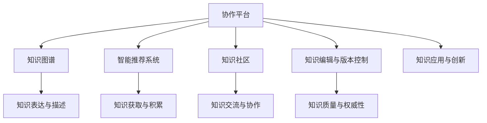

                 

# 知识的社交化学习：协作平台的兴起

## 1. 背景介绍

### 1.1 问题由来

随着知识爆炸和技术迭代，信息量呈几何级数增长，学习新知识变得越来越困难。单打独斗式的学习模式，已经无法满足现代知识管理的需求。人们迫切需要一个更高效、更具协作性的知识管理平台，来激发智慧潜力、提升学习效率。

当前，互联网、云计算、大数据等技术高速发展，为知识社交化提供了强有力的技术支撑。社交网络、知识图谱、协同编辑、在线协作等技术，使得知识分享和协作成为可能。在这个背景下，协作平台的兴起，成为了知识管理的一大新趋势。

### 1.2 问题核心关键点

协作平台的核心在于知识共享与协作，其成功与否的关键在于以下几个方面：

1. **知识表达与描述**：平台如何有效地描述和组织知识，使其易于检索和理解。
2. **知识获取与积累**：用户如何方便地获取所需知识，并积累自己的知识。
3. **知识交流与协作**：平台如何促进用户之间的知识交流与合作，促进知识的迭代和共享。
4. **知识质量与权威性**：平台如何保证知识的质量和权威性，避免假信息和误导性内容。
5. **知识应用与创新**：知识如何被实际应用于解决问题，并激发创新。

### 1.3 问题研究意义

开发协作平台，对于激发人类智慧、推动知识创新具有重要意义：

1. **提升学习效率**：通过协作平台，用户可以获取更多高质量的知识，减少学习成本，提升学习效果。
2. **加速知识传播**：协作平台将学习者、专家、开发者聚集起来，形成知识社群，加速知识的广泛传播。
3. **促进知识创新**：知识交流和协作有助于激发创新思维，产生更多原创成果，推动技术进步。
4. **支持行业发展**：协作平台可以为各行各业提供知识服务，支持行业数字化转型和升级。
5. **构建智慧社会**：知识共享和协作有助于建立知识型社会，提升全民智慧水平，推动社会进步。

## 2. 核心概念与联系

### 2.1 核心概念概述

为更好地理解协作平台的工作原理和优化方向，本节将介绍几个关键概念：

1. **协作平台**：一个支持知识表达、获取、交流、积累、应用与创新的在线系统。其核心功能包括内容管理、搜索、讨论、协作、反馈等。
2. **知识图谱**：通过语义关系将知识节点连接起来，形成一个结构化的知识网络，方便知识检索和推理。
3. **智能推荐系统**：通过分析用户行为和兴趣，动态推荐相关的知识内容，提高知识获取效率。
4. **知识社区**：围绕特定主题或领域构建的知识社群，促进知识交流和协作。
5. **知识编辑与版本控制**：支持多人协作编辑，同时进行知识版本控制，确保知识准确性和完整性。

这些核心概念之间通过知识流、用户交互、系统功能等环节构成一个协作平台的基本框架。

### 2.2 核心概念原理和架构的 Mermaid 流程图



### 2.3 核心概念联系

- **知识图谱**和**协作平台**是协作平台的基础，知识图谱提供了结构化的知识组织方式，协作平台提供知识共享和协作的空间。
- **智能推荐系统**和**知识社区**通过智能分析和社交互动，提升知识获取和交流的效率。
- **知识编辑与版本控制**保障了知识的质量和权威性，确保知识的准确性和完整性。
- **知识应用与创新**是协作平台的最终目标，通过知识的应用，促进创新和技术进步。

## 3. 核心算法原理 & 具体操作步骤
### 3.1 算法原理概述

协作平台的核心算法主要围绕知识表达、获取、交流、积累和应用展开。这些算法通常包括但不限于：

- **知识表达算法**：用于描述和组织知识，使其易于检索和理解。
- **知识获取算法**：用于帮助用户高效地获取所需知识。
- **知识推荐算法**：用于动态推荐相关知识内容，提升知识获取效率。
- **知识交流算法**：用于促进用户之间的知识交流和协作。
- **知识迭代算法**：用于维护和更新知识，保持知识的时效性和权威性。

### 3.2 算法步骤详解

#### 3.2.1 知识表达算法

知识表达算法的主要目标是创建结构化的知识图谱，用于知识的管理和查询。常用的知识表达算法包括：

1. **RDF模型**：使用资源描述框架（RDF）描述知识节点之间的语义关系，构建知识图谱。
2. **本体论**：使用本体语言（如OWL）定义知识的概念和关系，提供更严格的语义描述。
3. **语义网**：结合RDF和本体论，构建大范围的知识网络，支持大规模知识管理和查询。

#### 3.2.2 知识获取算法

知识获取算法的主要目标是帮助用户高效地检索和获取所需知识。常用的知识获取算法包括：

1. **信息检索（IR）**：使用文本检索、向量空间模型等技术，匹配用户查询和知识文档，返回相关结果。
2. **问答系统（QA）**：结合自然语言处理和知识图谱，回答用户提出的具体问题，提供精确的信息。
3. **推荐系统**：分析用户行为和兴趣，动态推荐相关知识内容，提升知识获取效率。

#### 3.2.3 知识推荐算法

知识推荐算法的主要目标是提高知识获取的效率和质量。常用的知识推荐算法包括：

1. **协同过滤（CF）**：根据用户的历史行为和兴趣，推荐相似的知识内容。
2. **基于内容的推荐**：分析知识内容本身的特点，推荐相关的知识内容。
3. **混合推荐**：结合多种推荐方法，综合考虑用户和知识的特点，提升推荐效果。

#### 3.2.4 知识交流算法

知识交流算法的主要目标是促进用户之间的知识交流和协作。常用的知识交流算法包括：

1. **讨论论坛**：提供用户讨论和交流的空间，支持多人协作编辑和讨论。
2. **协作文档**：支持多人协作编辑文档，实时更新和同步，确保知识的准确性和完整性。
3. **评论系统**：对知识内容进行评论和反馈，提升知识质量和权威性。

#### 3.2.5 知识迭代算法

知识迭代算法的主要目标是维护和更新知识，保持知识的时效性和权威性。常用的知识迭代算法包括：

1. **知识更新**：定期收集和更新知识内容，确保知识的及时性和准确性。
2. **知识版本控制**：支持多人协作编辑，同时进行知识版本控制，确保知识的准确性和完整性。
3. **知识评估**：对知识内容进行评估和审核，过滤和修正有误导性的信息，保持知识的质量和权威性。

### 3.3 算法优缺点

协作平台的核心算法具有以下优点：

1. **高效的知识管理**：通过结构化的知识表达和推荐系统，提高了知识获取的效率和质量。
2. **促进知识交流**：通过讨论论坛、协作文档等工具，促进了用户之间的知识交流和协作。
3. **提升知识质量**：通过知识版本控制、知识评估等机制，确保了知识的质量和权威性。

但同时也存在以下缺点：

1. **技术复杂度高**：知识表达、知识获取、知识推荐等算法需要较强的技术支撑，开发难度大。
2. **数据质量依赖高**：知识表达和推荐系统的效果很大程度上依赖于数据的质量和完整性。
3. **知识噪音多**：用户上传的知识内容往往存在误导性、噪声性信息，需要额外处理。
4. **用户参与度低**：平台的用户参与度和贡献度不足，可能影响平台的知识积累和质量。

### 3.4 算法应用领域

协作平台的核心算法已经在多个领域得到了广泛应用：

1. **教育培训**：通过知识共享和协作，提升教育培训的效率和质量。例如，MOOC平台、在线图书馆等。
2. **企业知识管理**：帮助企业更好地管理知识，支持企业知识创新和技术研发。例如，企业内部知识库、研发协作平台等。
3. **科研合作**：通过知识共享和协作，促进科研合作和创新。例如，开放获取期刊、科研协作平台等。
4. **在线学习社区**：提供用户学习和交流的空间，促进知识的广泛传播和创新。例如，知乎、GitHub等。
5. **知识驱动的决策支持**：支持企业、政府等机构基于知识进行决策支持，提升决策水平。例如，数据驱动的政府决策支持系统等。

## 4. 数学模型和公式 & 详细讲解 & 举例说明

### 4.1 数学模型构建

协作平台的核心算法可以抽象为以下几个数学模型：

1. **知识图谱模型**：通过语义关系将知识节点连接起来，形成一个结构化的知识网络。
2. **信息检索模型**：使用向量空间模型、文本检索等技术，匹配用户查询和知识文档。
3. **知识推荐模型**：结合协同过滤、基于内容的推荐等算法，动态推荐相关知识内容。
4. **讨论论坛模型**：通过多层次的话题分类和讨论管理，支持用户讨论和交流。
5. **协作文档模型**：支持多人协作编辑文档，实时更新和同步，确保知识的准确性和完整性。

### 4.2 公式推导过程

以信息检索模型为例，其核心公式为向量空间模型（VSM）：

$$
similarity(q, d) = \frac{\sum_{i=1}^n q_i d_i}{\sqrt{\sum_{i=1}^n q_i^2} \sqrt{\sum_{i=1}^n d_i^2}}
$$

其中，$q$ 为查询向量，$d$ 为文档向量，$similarity$ 为相似度，$n$ 为特征数量。

向量空间模型通过计算查询向量和文档向量之间的余弦相似度，匹配用户查询和知识文档，返回相关结果。

### 4.3 案例分析与讲解

以知乎平台为例，分析其知识表达、获取、交流、积累和应用的全过程：

1. **知识表达**：知乎通过语义化的标签系统，将问题和答案组织成结构化的知识图谱。用户可以自由添加标签，方便知识的检索和分类。
2. **知识获取**：用户可以通过搜索框输入关键词，匹配相关问题和答案，获取所需知识。知乎还提供相关推荐，帮助用户发现高质量的知识内容。
3. **知识交流**：知乎通过问答系统、评论系统、讨论论坛等工具，促进用户之间的知识交流和协作。用户可以自由提问、回答、评论，分享自己的知识和见解。
4. **知识积累**：知乎通过版本控制和编辑历史，确保知识内容的准确性和完整性。用户可以自由编辑、修改、删除问题，记录编辑历史，支持多人协作编辑。
5. **知识应用**：知乎通过知识共享和协作，支持用户解决实际问题，促进知识应用和创新。用户可以基于问题集和答案集，提出新的解决方案和应用场景。

## 5. 项目实践：代码实例和详细解释说明

### 5.1 开发环境搭建

在进行协作平台开发前，我们需要准备好开发环境。以下是使用Python进行Django开发的环境配置流程：

1. 安装Anaconda：从官网下载并安装Anaconda，用于创建独立的Python环境。

2. 创建并激活虚拟环境：
```bash
conda create -n pytorch-env python=3.8 
conda activate pytorch-env
```

3. 安装Django：根据CUDA版本，从官网获取对应的安装命令。例如：
```bash
pip install django==3.2
```

4. 安装Django-realtime：
```bash
pip install django-realtime==3.2
```

5. 安装各类工具包：
```bash
pip install numpy pandas scikit-learn matplotlib tqdm jupyter notebook ipython
```

完成上述步骤后，即可在`pytorch-env`环境中开始协作平台的开发。

### 5.2 源代码详细实现

我们先定义一个简单的知识库模型，用于存储和管理知识内容。

```python
from django.db import models

class Knowledge(models.Model):
    title = models.CharField(max_length=255)
    content = models.TextField()
    labels = models.ManyToManyField('Label')
    author = models.ForeignKey('User', on_delete=models.CASCADE)
    created_at = models.DateTimeField(auto_now_add=True)
    updated_at = models.DateTimeField(auto_now=True)

class Label(models.Model):
    name = models.CharField(max_length=255)
```

然后，我们定义用户模型，用于管理用户和权限。

```python
from django.contrib.auth.models import AbstractUser

class User(AbstractUser):
    pass
```

接下来，我们定义知识库的视图和控制器，用于展示和操作知识内容。

```python
from django.shortcuts import render, redirect
from .models import Knowledge

def knowledge_list(request):
    knowledges = Knowledge.objects.all()
    return render(request, 'knowledge_list.html', {'knowledges': knowledges})

def knowledge_detail(request, pk):
    knowledge = Knowledge.objects.get(pk=pk)
    return render(request, 'knowledge_detail.html', {'knowledge': knowledge})

def add_knowledge(request):
    if request.method == 'POST':
        title = request.POST.get('title')
        content = request.POST.get('content')
        labels = request.POST.getlist('labels')
        author = request.user
        knowledge = Knowledge.objects.create(title=title, content=content, labels=labels, author=author)
        return redirect('knowledge_list')
    else:
        return render(request, 'add_knowledge.html')
```

最后，我们定义知识库的模板，用于展示和操作知识内容。

```html
<!-- knowledge_list.html -->


    <h1>知识库列表</h1>
    
        <a href="">{{ knowledge.title }}</a>
    
    <a href="">添加新知识</a>


<!-- knowledge_detail.html -->


    <h1>{{ knowledge.title }}</h1>
    {{ knowledge.content }}

```

这样，我们就完成了一个简单的知识库模型的开发。接下来，我们可以在此基础上添加更多功能，如知识推荐、讨论论坛、协作编辑等，构建完整的协作平台。

### 5.3 代码解读与分析

让我们再详细解读一下关键代码的实现细节：

**知识库模型**：
- `title` 字段用于存储知识的标题。
- `content` 字段用于存储知识的内容。
- `labels` 字段用于存储知识的标签，支持多选。
- `author` 字段用于存储知识的所有者。
- `created_at` 字段用于存储知识的创建时间。
- `updated_at` 字段用于存储知识的更新时间。

**用户模型**：
- 继承自Django内置的`AbstractUser`模型，包含用户名、密码等基本用户信息。

**知识库视图**：
- `knowledge_list` 视图用于展示所有知识内容。
- `knowledge_detail` 视图用于展示单个知识内容的详细信息。
- `add_knowledge` 视图用于添加新知识。

**知识库模板**：
- `knowledge_list.html` 模板用于展示知识库列表。
- `knowledge_detail.html` 模板用于展示单个知识内容的详细信息。

可以看到，协作平台的开发需要考虑多个方面，如模型设计、视图控制器、模板渲染等，开发者需要具备较强的系统设计和编程能力。

## 6. 实际应用场景

### 6.1 教育培训

协作平台在教育培训领域的应用，可以帮助教师和学生更好地共享和学习知识。例如，在MOOC平台中，学生可以随时访问课程内容和作业，参与在线讨论和协作，提升学习效果。教师也可以发布新的课程内容和讨论话题，推动知识创新和传播。

### 6.2 企业知识管理

企业知识管理平台可以帮助企业更好地管理知识，提升知识管理效率和质量。例如，企业可以通过知识库、讨论论坛、协作文档等功能，促进知识共享和协作，支持企业知识创新和技术研发。同时，企业还可以利用智能推荐系统，为用户推荐相关知识内容，提升知识获取效率。

### 6.3 科研合作

科研合作平台可以帮助科研人员更好地共享和协作知识。例如，开放获取期刊平台提供了大量的研究成果和论文，科研人员可以自由访问、下载和引用，推动科学研究的创新和发展。同时，科研人员还可以通过讨论论坛、协作文档等功能，交流和分享研究成果，促进科研合作和创新。

### 6.4 在线学习社区

在线学习社区可以帮助用户更好地学习和交流知识。例如，知乎、Stack Overflow等平台提供了大量的知识内容，用户可以自由提问、回答和讨论，获取所需知识。同时，平台还可以通过智能推荐系统，为用户推荐相关知识内容，提升知识获取效率。

### 6.5 数据驱动的决策支持

数据驱动的决策支持平台可以帮助企业、政府等机构基于知识进行决策支持。例如，政府可以通过知识库、讨论论坛等功能，获取和分析社会舆情和公众意见，做出更科学合理的决策。企业也可以通过知识库、讨论论坛等功能，获取和分析市场数据和行业趋势，制定更有效的经营策略。

## 7. 工具和资源推荐

### 7.1 学习资源推荐

为了帮助开发者系统掌握协作平台的技术基础和实践技巧，这里推荐一些优质的学习资源：

1. **《Python Web开发实战》**：介绍Django等Python Web框架的开发实践，适合初学者入门。
2. **《Django REST Framework实战》**：讲解Django REST Framework的使用方法和最佳实践，适合开发API和Web服务。
3. **《协作平台设计与实现》**：介绍协作平台的设计和实现方法，涵盖知识管理、搜索、讨论、协作等多个方面。
4. **《知识图谱与语义网》**：讲解知识图谱和语义网的基本概念和构建方法，适合深入学习知识表达和推理技术。
5. **《深度学习与自然语言处理》**：介绍深度学习在NLP领域的应用，适合学习知识推荐和问答系统等算法。

通过这些资源的学习实践，相信你一定能够快速掌握协作平台的核心技术和实践方法，并用于解决实际的业务问题。

### 7.2 开发工具推荐

高效的开发离不开优秀的工具支持。以下是几款用于协作平台开发的常用工具：

1. **Django**：一个功能强大的Python Web框架，适合快速开发协作平台。
2. **React**：一个流行的JavaScript前端框架，适合开发协作平台的前端界面。
3. **GraphQL**：一个灵活的API查询语言，适合开发知识库和讨论论坛等功能。
4. **Elasticsearch**：一个高性能的搜索和分析引擎，适合构建知识图谱和智能推荐系统。
5. **Git**：一个版本控制系统，适合协作编辑和版本控制。

合理利用这些工具，可以显著提升协作平台的开发效率，加快创新迭代的步伐。

### 7.3 相关论文推荐

协作平台的研究源于学界的持续研究。以下是几篇奠基性的相关论文，推荐阅读：

1. **《知识图谱构建与查询》**：介绍知识图谱的构建方法和查询算法，适合了解知识表达和推理的基本概念。
2. **《语义搜索引擎》**：讲解语义搜索和信息检索的基本方法，适合学习知识检索和推荐技术。
3. **《协同过滤算法》**：介绍协同过滤算法的原理和应用，适合学习知识推荐和用户行为分析。
4. **《讨论论坛系统设计》**：介绍讨论论坛的设计和实现方法，适合学习协作和交流功能。
5. **《版本控制与协作编辑》**：介绍版本控制和协作编辑的基本方法，适合学习协作文档和知识版本控制。

这些论文代表了大协作平台技术的发展脉络。通过学习这些前沿成果，可以帮助研究者把握学科前进方向，激发更多的创新灵感。

## 8. 总结：未来发展趋势与挑战

### 8.1 总结

本文对协作平台的原理和实践进行了全面系统的介绍。首先阐述了协作平台的背景和核心概念，明确了协作平台在知识管理中的独特价值。其次，从算法原理到具体实现，详细讲解了协作平台的核心算法和技术实现，提供了完整的代码实例。同时，本文还广泛探讨了协作平台在教育培训、企业知识管理、科研合作等多个领域的应用前景，展示了协作平台的前景和潜力。最后，本文精选了协作平台的各类学习资源，力求为读者提供全方位的技术指引。

通过本文的系统梳理，可以看到，协作平台在知识管理领域具有广阔的应用前景，将极大地提升知识共享和协作的效率和质量，推动社会进步和经济发展。

### 8.2 未来发展趋势

展望未来，协作平台将呈现以下几个发展趋势：

1. **智能化的知识管理**：通过AI技术和机器学习算法，提升知识管理和推荐的智能化水平，提高知识获取效率。
2. **个性化推荐**：通过分析用户行为和兴趣，实现更加精准的知识推荐，提升用户的学习和研究体验。
3. **多模态协作**：结合文本、图像、视频等多种模态的信息，支持更加丰富和全面的知识表达和交流。
4. **跨平台协作**：支持不同平台和设备之间的协作，提升知识管理的灵活性和便捷性。
5. **安全性和隐私保护**：通过数据加密、访问控制等手段，确保知识管理的隐私和安全。

以上趋势凸显了协作平台技术的前景和潜力。这些方向的探索发展，必将进一步提升协作平台的智能化水平，为知识管理的未来发展提供新的动力。

### 8.3 面临的挑战

尽管协作平台已经取得了瞩目成就，但在迈向更加智能化、普适化应用的过程中，它仍面临着诸多挑战：

1. **数据质量瓶颈**：知识图谱和推荐系统的效果很大程度上依赖于数据的质量和完整性，获取高质量的数据是协作平台的核心挑战之一。
2. **技术复杂度高**：协作平台需要综合运用多种技术和算法，开发难度较大，需要跨学科的协同合作。
3. **用户参与度低**：平台的用户参与度和贡献度不足，可能影响平台的知识积累和质量。
4. **知识噪音多**：用户上传的知识内容往往存在误导性、噪声性信息，需要额外处理。
5. **知识更新难度大**：知识内容的快速更新和维护是协作平台的关键挑战，需要高效的知识迭代机制。

### 8.4 研究展望

面对协作平台面临的种种挑战，未来的研究需要在以下几个方面寻求新的突破：

1. **自动化知识管理**：通过自动化技术，提升知识管理和推荐的智能化水平，减少人工干预。
2. **多模态知识融合**：结合文本、图像、视频等多种模态的信息，支持更加丰富和全面的知识表达和交流。
3. **用户参与度提升**：通过社交网络和激励机制，提升用户参与度和贡献度，推动知识积累和质量提升。
4. **知识噪音过滤**：通过智能分析和数据清洗，过滤和修正有误导性的信息，保持知识的质量和权威性。
5. **知识更新机制**：引入自动化和协同编辑机制，提升知识内容的快速更新和维护，保持知识的时效性和权威性。

这些研究方向的探索，必将引领协作平台技术迈向更高的台阶，为知识管理的未来发展提供新的动力。面向未来，协作平台需要与其他人工智能技术进行更深入的融合，如知识表示、因果推理、强化学习等，多路径协同发力，共同推动知识管理的进步。只有勇于创新、敢于突破，才能不断拓展协作平台的边界，让知识管理更好地服务于社会和经济发展。

## 9. 附录：常见问题与解答

**Q1：协作平台的主要功能有哪些？**

A: 协作平台的主要功能包括知识表达、知识获取、知识交流、知识积累和知识应用等。具体功能包括：

- **知识图谱**：通过语义化的标签系统，将知识和文档组织成结构化的知识图谱，方便知识检索和分类。
- **信息检索**：使用向量空间模型、文本检索等技术，匹配用户查询和知识文档，返回相关结果。
- **知识推荐**：结合协同过滤、基于内容的推荐等算法，动态推荐相关知识内容，提升知识获取效率。
- **讨论论坛**：提供用户讨论和交流的空间，支持多人协作编辑和讨论。
- **协作文档**：支持多人协作编辑文档，实时更新和同步，确保知识的准确性和完整性。
- **版本控制**：支持多人协作编辑，同时进行知识版本控制，确保知识的准确性和完整性。

**Q2：协作平台如何保证知识的质量和权威性？**

A: 协作平台通过以下几个机制保障知识的质量和权威性：

1. **版本控制**：支持多人协作编辑，同时进行知识版本控制，确保知识的准确性和完整性。
2. **知识评估**：对知识内容进行评估和审核，过滤和修正有误导性的信息，保持知识的质量和权威性。
3. **智能推荐**：结合用户行为和兴趣，动态推荐相关知识内容，提升知识获取效率。
4. **讨论和评论**：通过讨论和评论系统，促进用户之间的交流和协作，提升知识质量和权威性。
5. **自动化维护**：引入自动化技术，提升知识管理和推荐的智能化水平，减少人工干预。

**Q3：协作平台的用户参与度如何提升？**

A: 协作平台可以通过以下几个方面提升用户参与度和贡献度：

1. **社交网络**：通过社交网络和推荐系统，将用户连接到知识社区，促进知识交流和协作。
2. **激励机制**：引入积分、勋章、奖励等激励机制，提升用户参与度和贡献度。
3. **用户贡献**：通过用户编辑、审核、标注等操作，鼓励用户参与知识管理和维护。
4. **平台体验**：提升平台的用户体验，使用户更易于使用和参与协作平台。
5. **知识质量**：通过知识评估和审核机制，提升知识的质量和权威性，吸引更多高质量的用户参与。

**Q4：协作平台的数据质量如何保证？**

A: 协作平台通过以下几个方法保证数据质量：

1. **数据清洗**：使用数据清洗和预处理技术，过滤和修正有误导性的信息，确保数据的质量和完整性。
2. **数据标注**：通过人工标注和审核，确保标注数据的准确性和一致性。
3. **数据采集**：通过爬虫和API等手段，从可靠的数据源获取高质量的数据。
4. **数据验证**：引入数据验证和评估机制，定期检查和更新数据，确保数据的时效性和权威性。
5. **数据融合**：通过数据融合和集成，提升数据的质量和全面性。

**Q5：协作平台如何实现跨平台协作？**

A: 协作平台可以通过以下几个方法实现跨平台协作：

1. **API接口**：通过API接口，支持不同平台之间的数据交互和协作。
2. **云平台**：通过云平台，实现跨设备、跨平台的数据共享和协作。
3. **移动端支持**：支持移动端应用，方便用户随时随地访问和使用协作平台。
4. **数据同步**：使用数据同步技术，确保不同平台之间的数据一致性和实时性。
5. **跨平台集成**：通过跨平台集成和API调用，实现不同平台之间的协作和数据共享。

---

作者：禅与计算机程序设计艺术 / Zen and the Art of Computer Programming

