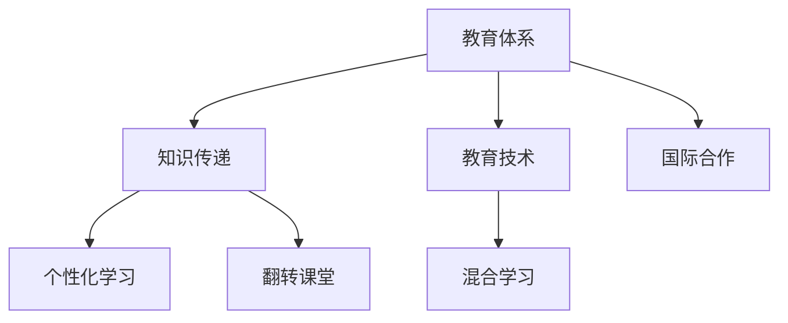

                 

# 知识的跨代传递：教育体系的演进

## 1. 背景介绍

### 1.1 问题由来
随着科技的迅猛发展和信息时代的到来，教育体系正面临前所未有的挑战和机遇。如何有效地传递知识，培养适应未来社会需求的人才，成为教育界和科技界共同关注的课题。知识传递不仅仅是信息传输的过程，更是价值观念、思维方式、创新能力的传递。教育体系的演进，本质上是对知识传递机制的不断优化，以适应技术进步和社会变迁的需要。

### 1.2 问题核心关键点
教育体系演进的核心在于知识传递方式的创新和教育资源的优化。知识传递方式包括线上与线下融合、个性化学习、翻转课堂等新型教学模式。教育资源的优化则涉及到教师队伍建设、教学内容更新、教育技术的广泛应用等。当前，数字化转型已成为教育体系演进的强大驱动力，未来教育将更加注重学生的批判性思维、创造力和合作能力。

### 1.3 问题研究意义
研究教育体系的演进，对于提升教育质量、培养创新人才、推动社会进步具有重要意义：

1. 提升教育质量。通过优化教育资源配置，采用先进的教学方法和工具，能够显著提高教学效果和学习体验。
2. 培养创新人才。以科技为支撑的教育体系，能够激发学生的创新潜能，培养适应未来社会需求的创新型人才。
3. 推动社会进步。教育体系是社会进步的重要基石，对知识、文化、价值观的传承和创新具有不可替代的作用。
4. 促进国际合作。教育体系的多样化和国际化，能够促进全球知识交流和合作，推动各国共同发展。

## 2. 核心概念与联系

### 2.1 核心概念概述

为更好地理解教育体系演进的本质，本节将介绍几个密切相关的核心概念：

- 教育体系(Education System)：指由各级各类教育机构及其相互关系组成的教育结构体系，包括基础教育、职业教育、高等教育等层次。
- 知识传递(Knowledge Transmission)：指教师向学生传授知识和技能的过程，包括教学方法、教学内容、教学环境等关键因素。
- 教育技术(Educational Technology)：指应用于教育领域的现代信息技术，如多媒体教学、在线教育、智能学习平台等。
- 个性化学习(Personalized Learning)：指根据学生个体差异，提供量身定制的学习方案和资源，促进学生的全面发展。
- 翻转课堂(Flipped Classroom)：指在课堂上讲授新知识，课后通过在线平台进行作业练习和反馈的创新教学模式。
- 混合学习(Mixed Learning)：指结合线上和线下教学资源，优化教学过程和效果的教学模式。

这些核心概念之间的逻辑关系可以通过以下Mermaid流程图来展示：



这个流程图展示了几大核心概念及其之间的关系：

1. 教育体系通过知识传递和学习技术，为学生提供系统的知识和技能。
2. 教育技术是知识传递的重要工具，提供多样化的教学手段。
3. 个性化学习和翻转课堂是知识传递的具体方式，以适应学生的不同需求。
4. 混合学习融合线上线下资源，提升教学效果。
5. 国际合作促进知识跨国传递，提升教育国际化水平。

这些概念共同构成了教育体系演进的框架，推动了教育模式的不断创新和优化。

## 3. 核心算法原理 & 具体操作步骤
### 3.1 算法原理概述

教育体系演进的核心算法原理主要包括：

1. 数据驱动的教育决策：通过收集和分析教育数据，优化资源配置和教学策略。
2. 学习分析与智能推荐：利用大数据和机器学习技术，实现个性化学习和智能推荐。
3. 教育技术的集成与应用：将最新的教育技术如AI、VR、AR等集成到教学中，提升教学效果。

### 3.2 算法步骤详解

基于数据驱动和智能推荐的教育体系演进，一般包括以下几个关键步骤：

**Step 1: 数据收集与预处理**
- 收集教育数据，包括学生成绩、学习行为、教师教学评价等。
- 对数据进行清洗和标准化处理，去除噪声和异常值。
- 利用数据挖掘技术，提取特征并进行统计分析。

**Step 2: 模型构建与训练**
- 构建机器学习模型，如分类、回归、聚类等。
- 利用收集的教育数据，对模型进行训练和优化。
- 引入迁移学习、半监督学习等技术，提升模型泛化能力。

**Step 3: 智能推荐与个性化学习**
- 根据学生的学习行为和成绩，预测其学习兴趣和能力。
- 设计推荐算法，推荐合适的学习资源和课程。
- 结合翻转课堂、混合学习等新型教学模式，实施个性化教学。

**Step 4: 教学效果评估与反馈**
- 利用教学效果评估模型，定期评估教学质量和学生学习成果。
- 通过在线平台收集学生反馈，进行教学改进。
- 结合评估和反馈，调整教学策略和资源配置。

### 3.3 算法优缺点

基于数据驱动和智能推荐的教育体系演进方法具有以下优点：

1. 数据驱动决策：通过大数据分析，可以更加客观地评估教育效果，优化资源配置。
2. 智能推荐优化：个性化学习方案和资源推荐，能够有效提升学生的学习效果和体验。
3. 技术集成应用：教育技术的广泛应用，提升了教学手段和效果。
4. 反馈循环改进：通过教学评估和学生反馈，不断优化教学策略。

同时，该方法也存在一定的局限性：

1. 数据隐私和安全：教育数据的收集和使用涉及学生隐私，需要严格保护。
2. 模型偏差：模型训练中的偏差可能导致不公平的教学资源分配。
3. 技术依赖：对教育技术的依赖可能导致技术设备不足的问题。
4. 教师负担：智能推荐系统需要教师的持续维护和调整，增加教师工作负担。
5. 学生自主性：过度依赖推荐可能导致学生自主性和创造性的减弱。

尽管存在这些局限性，但就目前而言，基于数据驱动和智能推荐的教育体系演进方法仍是最主流范式。未来相关研究的重点在于如何进一步优化模型，保护数据隐私，降低技术依赖，同时兼顾教师和学生的角色，实现更加全面、均衡的教育体系。

### 3.4 算法应用领域

基于数据驱动和智能推荐的教育体系演进方法，在教育领域已经得到了广泛的应用，覆盖了从基础教育到高等教育等多个层次，例如：

- 基础教育：利用智能推荐系统为学生提供个性化的学习方案和资源，提升学习效果。
- 高等教育：结合翻转课堂和混合学习模式，优化教学过程和效果。
- 职业教育：根据学生的工作需求和职业规划，提供定制化的课程和培训。
- 继续教育：为在职人员提供灵活的学习机会和资源，支持终身学习。

除了传统教育领域，智能推荐技术也被创新性地应用到更多场景中，如远程教育、在线培训、智能辅导等，为教育体系带来了新的突破。随着教育技术的持续演进，相信智能推荐方法将在更广阔的教育领域发挥更大的作用。

## 4. 数学模型和公式 & 详细讲解  
### 4.1 数学模型构建

本节将使用数学语言对基于数据驱动和智能推荐的教育体系演进过程进行更加严格的刻画。

记教育数据集为 $D=\{(x_i,y_i)\}_{i=1}^N$，其中 $x_i$ 为学生 $i$ 的特征向量，$y_i$ 为其对应的学习成果。定义学习分析模型为 $M$，其预测函数为 $f(x)$，则教育体系演进过程的数学模型为：

$$
y_i = f(x_i)
$$

在实际应用中，通常使用机器学习模型进行训练和预测。以回归模型为例，目标是最小化预测值与真实值之间的平方误差：

$$
\min_{f} \sum_{i=1}^N (y_i - f(x_i))^2
$$

通过梯度下降等优化算法，模型不断更新参数，最小化误差。在模型训练完成后，对新学生的数据 $x_{new}$ 进行预测，即可得到其对应的学习成果 $y_{new}$。

### 4.2 公式推导过程

以下我们以线性回归模型为例，推导学习分析模型的预测公式和梯度计算公式。

假设回归模型为线性形式 $f(x) = w^T x + b$，其中 $w$ 为权重向量，$b$ 为偏置项。根据最小二乘法的原理，目标是最小化预测值与真实值之间的平方误差：

$$
\min_{w,b} \sum_{i=1}^N (y_i - w^T x_i - b)^2
$$

利用求导和正则化技术，可以得到权重向量 $w$ 和偏置项 $b$ 的更新公式：

$$
w \leftarrow w - \eta \frac{1}{N}\sum_{i=1}^N 2(y_i - w^T x_i - b)x_i
$$

$$
b \leftarrow b - \eta \frac{1}{N}\sum_{i=1}^N 2(y_i - w^T x_i - b)
$$

其中 $\eta$ 为学习率，可以通过实验调优得到最优值。

### 4.3 案例分析与讲解

以下我们以在线教育平台为例，说明基于数据驱动和智能推荐的教育体系演进过程。

假设某在线教育平台收集了学生 $i$ 的学习行为数据 $x_i$，包括学习时间、题目正确率、学习视频观看次数等。利用机器学习模型 $M$，对每个学生进行学习效果预测 $y_i$，从而生成推荐方案。

具体步骤如下：

1. **数据收集与预处理**：平台收集大量学生的学习行为数据，并对其进行标准化处理，去除异常值。
2. **模型训练与优化**：利用收集到的学习行为数据，训练一个回归模型 $M$，最小化预测值与真实值之间的误差。引入正则化技术，防止模型过拟合。
3. **智能推荐**：根据每个学生的学习行为数据 $x_i$，通过模型 $M$ 预测其学习效果 $y_i$。结合学生的历史成绩和兴趣，生成推荐方案。
4. **教学效果评估与反馈**：利用平台反馈机制，收集学生对推荐方案的反馈。结合教学效果评估模型，优化推荐算法和模型参数。
5. **教学改进**：根据反馈和评估结果，调整教学策略和资源配置，不断提升教学效果。

## 5. 项目实践：代码实例和详细解释说明
### 5.1 开发环境搭建

在进行教育体系演进实践前，我们需要准备好开发环境。以下是使用Python进行TensorFlow开发的环境配置流程：

1. 安装Anaconda：从官网下载并安装Anaconda，用于创建独立的Python环境。

2. 创建并激活虚拟环境：
```bash
conda create -n tf-env python=3.8 
conda activate tf-env
```

3. 安装TensorFlow：根据CUDA版本，从官网获取对应的安装命令。例如：
```bash
conda install tensorflow -c pytorch -c conda-forge
```

4. 安装各类工具包：
```bash
pip install numpy pandas scikit-learn matplotlib tqdm jupyter notebook ipython
```

完成上述步骤后，即可在`tf-env`环境中开始教育体系演进实践。

### 5.2 源代码详细实现

下面我们以基于机器学习的推荐系统为例，给出使用TensorFlow进行教育体系演进的PyTorch代码实现。

首先，定义推荐系统的数据处理函数：

```python
import tensorflow as tf
import numpy as np
import pandas as pd

# 定义数据处理函数
def process_data(data_path):
    data = pd.read_csv(data_path)
    features = data[['time_spent', 'correct_answers', 'video_watches']]
    labels = data['final_score']
    return features, labels
```

然后，定义模型和优化器：

```python
# 定义线性回归模型
def build_model(features, labels):
    w = tf.Variable(tf.zeros(features.shape[1]))
    b = tf.Variable(tf.zeros(1))
    return tf.matmul(features, w) + b

# 定义损失函数和优化器
def train_model(features, labels):
    model = build_model(features, labels)
    loss = tf.reduce_mean(tf.square(model - labels))
    optimizer = tf.optimizers.SGD(learning_rate=0.01)
    return loss, optimizer
```

接着，定义训练和评估函数：

```python
# 定义训练函数
def trainEpoch(features, labels, loss, optimizer):
    with tf.GradientTape() as tape:
        y_pred = model(features)
        loss_value = loss(y_pred, labels)
    gradients = tape.gradient(loss_value, model.trainable_variables)
    optimizer.apply_gradients(zip(gradients, model.trainable_variables))
    return loss_value

# 定义评估函数
def evaluateEpoch(features, labels, loss):
    y_pred = model(features)
    mse = loss(y_pred, labels)
    return mse
```

最后，启动训练流程并在测试集上评估：

```python
# 加载数据
features, labels = process_data('data.csv')

# 定义模型和优化器
model = build_model(features, labels)
loss, optimizer = train_model(features, labels)

# 定义训练和评估函数
trainEpoch(features, labels, loss, optimizer)

# 在测试集上评估模型
test_features, test_labels = process_data('test.csv')
mse = evaluateEpoch(test_features, test_labels, loss)
print('Test MSE:', mse)
```

以上就是使用TensorFlow进行教育体系演进的完整代码实现。可以看到，TensorFlow提供了丰富的工具和库，使得模型训练和评估变得相对简单。

### 5.3 代码解读与分析

让我们再详细解读一下关键代码的实现细节：

**process_data函数**：
- 读取数据文件，提取特征和标签。
- 对特征进行标准化处理，去除异常值。

**build_model函数**：
- 定义线性回归模型，计算预测值。
- 返回模型的权重向量 $w$ 和偏置项 $b$。

**train_model函数**：
- 构建损失函数和优化器。
- 返回损失函数和优化器。

**trainEpoch函数**：
- 定义训练过程。
- 使用梯度下降算法更新模型参数。
- 返回训练损失值。

**evaluateEpoch函数**：
- 定义评估过程。
- 计算评估集上的均方误差（MSE）。
- 返回评估损失值。

**训练流程**：
- 加载数据集。
- 构建模型和优化器。
- 在训练集上训练模型，输出训练损失值。
- 在测试集上评估模型，输出测试损失值。

可以看到，TensorFlow为模型训练和评估提供了强大的工具支持，使得教育体系演进任务的开发变得更加高效和可靠。

当然，工业级的系统实现还需考虑更多因素，如模型的保存和部署、超参数的自动搜索、更灵活的数据处理等。但核心的教育体系演进范式基本与此类似。

## 6. 实际应用场景
### 6.1 智能辅导系统

基于数据驱动和智能推荐的教育体系演进，可以广泛应用于智能辅导系统的构建。传统辅导往往依赖于人工教师，难以覆盖大量学生，且难以做到个性化辅导。智能辅导系统通过收集学生的学习数据，利用机器学习算法，实现个性化推荐和智能反馈。

在技术实现上，可以设计推荐算法，根据学生的学习行为和成绩，推荐适合的练习题和学习资源。结合在线辅导系统，实时解答学生的疑问，进行个性化辅导。智能辅导系统可以全天候为学生提供辅导服务，提升学习效果，降低辅导成本。

### 6.2 在线学习平台

在线学习平台是教育体系演进的重要载体。通过在线平台，学生可以在任何时间和地点进行学习，获取丰富的学习资源和互动体验。利用数据驱动和智能推荐技术，平台可以提供个性化的学习方案，推荐适合的学习资源和课程。

在平台设计上，可以引入AI导师、虚拟助教等功能，提升学习体验。平台可以自动采集学生的学习数据，通过机器学习模型，分析学生的学习行为和效果，提供实时反馈和个性化建议。平台还可以进行学习效果评估，优化推荐算法和教学内容。

### 6.3 职业培训平台

职业教育是教育体系演进的重要组成部分。随着技术进步，职业教育也面临着前所未有的挑战。利用数据驱动和智能推荐技术，职业培训平台可以提供高质量、个性化的培训课程和资源。

在平台设计上，可以引入虚拟实验室、在线实操等功能，提升培训效果。平台可以自动采集学生的培训数据，通过机器学习模型，分析学生的学习行为和效果，提供个性化建议。平台还可以进行培训效果评估，优化课程和资源配置。

### 6.4 未来应用展望

随着数据驱动和智能推荐技术的不断发展，基于教育体系演进的方法将在更多领域得到应用，为教育领域带来变革性影响。

在智慧教育领域，基于智能推荐的学习系统可以个性化地为每个学生提供学习方案，提升学习效果。同时，智能辅导系统和虚拟助教功能可以大大降低教师的工作负担，实现高效教学。

在智慧职业教育领域，基于数据驱动的培训平台可以提供高质量、个性化的培训资源，提升职业培训的效果和质量。结合在线实操和虚拟实验室，平台可以提供沉浸式的学习体验。

在智慧继续教育领域，基于数据驱动的学习系统可以灵活调整学习方案，满足不同学生的需求。结合在线平台和智能反馈，系统可以为在职人员提供灵活的学习机会和资源。

此外，在智慧社会治理中，基于数据驱动的教育体系可以培养公民的科学素养和信息技术素养，提升社会整体的知识水平。利用教育体系演进技术，可以为未来社会培养出更多创新型人才，推动社会进步和经济发展。

## 7. 工具和资源推荐
### 7.1 学习资源推荐

为了帮助开发者系统掌握教育体系演进的理论基础和实践技巧，这里推荐一些优质的学习资源：

1. 《数据科学导论》系列博文：由数据科学专家撰写，深入浅出地介绍了数据科学的基本概念和核心技术，包括机器学习、数据挖掘等。

2. 《深度学习》课程：斯坦福大学开设的深度学习课程，有Lecture视频和配套作业，带你入门深度学习的基本原理和算法。

3. 《机器学习实战》书籍：实战类书籍，涵盖机器学习算法和模型的实现和应用，适合入门学习。

4. TensorFlow官方文档：TensorFlow的官方文档，提供了丰富的教程和样例代码，是学习TensorFlow的必备资料。

5. Coursera和edX等在线平台：提供系统化的课程和证书，涵盖数据科学、机器学习、深度学习等多个方向，适合进阶学习。

通过对这些资源的学习实践，相信你一定能够快速掌握教育体系演进的核心思想和实践技巧，并用于解决实际的教育问题。

### 7.2 开发工具推荐

高效的开发离不开优秀的工具支持。以下是几款用于教育体系演进开发的常用工具：

1. TensorFlow：由Google主导开发的开源深度学习框架，生产部署方便，适合大规模工程应用。
2. PyTorch：基于Python的开源深度学习框架，灵活动态的计算图，适合快速迭代研究。
3. Jupyter Notebook：开源的交互式编程环境，支持Python、R等多种编程语言，方便代码编写和共享。
4. Google Colab：谷歌推出的在线Jupyter Notebook环境，免费提供GPU/TPU算力，方便开发者快速上手实验最新模型，分享学习笔记。

合理利用这些工具，可以显著提升教育体系演进任务的开发效率，加快创新迭代的步伐。

### 7.3 相关论文推荐

教育体系演进源于学界的持续研究。以下是几篇奠基性的相关论文，推荐阅读：

1. 《数据驱动的教育决策》（Data-Driven Educational Decision-Making）：探讨了数据驱动教育决策的理论框架和方法。
2. 《个性化学习与智能推荐系统》（Personalized Learning and Recommendation Systems）：介绍了基于推荐系统的个性化学习方案和算法。
3. 《学习分析与教学改进》（Learning Analytics and Instructional Improvement）：研究了利用学习分析数据进行教学改进的方法和工具。
4. 《教育技术的未来发展》（The Future of Educational Technology）：展望了教育技术的未来趋势和应用方向。
5. 《智能辅导系统的设计与实现》（Design and Implementation of Intelligent Tutoring Systems）：介绍了智能辅导系统的关键技术和实现方法。

这些论文代表了大数据驱动和智能推荐技术的发展脉络。通过学习这些前沿成果，可以帮助研究者把握学科前进方向，激发更多的创新灵感。

## 8. 总结：未来发展趋势与挑战
### 8.1 总结

本文对基于数据驱动和智能推荐的教育体系演进方法进行了全面系统的介绍。首先阐述了教育体系演进的背景和意义，明确了数据驱动和智能推荐在优化教育资源、提升教学效果方面的重要价值。其次，从原理到实践，详细讲解了教育体系演进过程的数学模型和关键步骤，给出了教育体系演进的完整代码实例。同时，本文还广泛探讨了教育体系演进在智能辅导、在线学习、职业教育等多个领域的应用前景，展示了教育体系演进的广阔应用空间。此外，本文精选了教育体系演进相关的学习资源，力求为读者提供全方位的技术指引。

通过本文的系统梳理，可以看到，基于数据驱动和智能推荐的教育体系演进方法，正在成为教育领域的重要范式，极大地提升了教学效果和学习体验。未来，伴随数据科学、人工智能等技术的不断进步，教育体系演进必将在更多领域得到应用，为教育事业的发展注入新的动力。

### 8.2 未来发展趋势

展望未来，教育体系演进技术将呈现以下几个发展趋势：

1. 数据驱动决策：通过大数据分析，可以更加客观地评估教育效果，优化资源配置。
2. 个性化学习：利用机器学习算法，为每个学生提供量身定制的学习方案和资源。
3. 智能推荐优化：个性化推荐算法和技术，能够有效提升学生的学习效果和体验。
4. 技术集成应用：教育技术的广泛应用，提升了教学手段和效果。
5. 反馈循环改进：通过学习分析和学生反馈，不断优化教学策略和模型参数。

以上趋势凸显了教育体系演进的巨大潜力。这些方向的探索发展，必将进一步提升教育质量，培养创新人才，推动社会进步。

### 8.3 面临的挑战

尽管教育体系演进技术已经取得了显著成就，但在迈向更加智能化、普适化应用的过程中，它仍面临着诸多挑战：

1. 数据隐私和安全：教育数据的收集和使用涉及学生隐私，需要严格保护。
2. 模型偏差：模型训练中的偏差可能导致不公平的教学资源分配。
3. 技术依赖：对教育技术的依赖可能导致技术设备不足的问题。
4. 教师负担：智能推荐系统需要教师的持续维护和调整，增加教师工作负担。
5. 学生自主性：过度依赖推荐可能导致学生自主性和创造性的减弱。

尽管存在这些挑战，但就目前而言，基于数据驱动和智能推荐的教育体系演进方法仍是最主流范式。未来相关研究的重点在于如何进一步优化模型，保护数据隐私，降低技术依赖，同时兼顾教师和学生的角色，实现更加全面、均衡的教育体系。

### 8.4 研究展望

面对教育体系演进面临的种种挑战，未来的研究需要在以下几个方面寻求新的突破：

1. 探索无监督和半监督教育方法。摆脱对大规模标注数据的依赖，利用自监督学习、主动学习等无监督和半监督范式，最大限度利用非结构化数据，实现更加灵活高效的教

