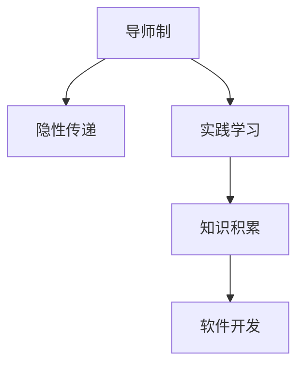

                 

# 知识的隐性传递：导师制与实践学习

> 关键词：导师制, 隐性传递, 实践学习, 知识积累, 软件开发

## 1. 背景介绍

### 1.1 问题由来
在快速发展的科技行业中，知识和技术的积累与传递是确保组织持续创新的关键。然而，传统的基于文档和课程的显性知识传授方式，往往难以捕捉实践中的细节与经验的传递。这种局限性在软件开发领域尤为显著，其中隐性知识（隐性传递）在实际工作中起着至关重要的作用。

隐性知识通常包含在个人经验、直觉、判断以及无法书面描述的诀窍中。它是软件开发中不可或缺的一部分，能够帮助开发者高效解决问题、优化代码、提高产品质量。因此，如何有效地将隐性知识从资深开发者传递给新手，成为了软件开发领域的一个重要课题。

### 1.2 问题核心关键点
解决隐性知识传递的核心关键点在于：
- 找到能够有效捕捉和传递隐性知识的方法。
- 创建一种能够促进知识积累和共享的环境。
- 设计出能够在实际工作中应用和复用的实践学习框架。

隐性知识的传递需要结合导师制（Mentorship）和实践学习（Hands-on Learning）的方式，通过互动和体验式的学习过程，让新手快速掌握解决问题的技能和经验。

## 2. 核心概念与联系

### 2.1 核心概念概述

为更好地理解导师制与实践学习在隐性知识传递中的作用，本节将介绍几个密切相关的核心概念：

- **导师制**（Mentorship）：指一个经验丰富的导师与一位新手（ mentee）建立的专业关系，通过指导和反馈帮助新手成长。
- **隐性知识**（Tacit Knowledge）：指个体通过经验积累和实践获得的难以书面化表达的知识。
- **实践学习**（Hands-on Learning）：通过亲自动手实践，获取和内化知识的过程。
- **知识积累**（Knowledge Accumulation）：指个人和组织通过学习和实践不断丰富和完善其知识库。
- **软件开发**（Software Development）：涉及设计、实现、测试、维护等各个环节，依赖于丰富的隐性知识。

这些核心概念之间的逻辑关系可以通过以下Mermaid流程图来展示：



这个流程图展示了一个完整的隐性知识传递循环：
1. 导师制为隐性知识的传递提供框架和机制。
2. 实践学习促进隐性知识的积累。
3. 知识积累为软件开发提供坚实的基础。

## 3. 核心算法原理 & 具体操作步骤
### 3.1 算法原理概述

导师制与实践学习相结合的隐性知识传递模型，其核心思想在于通过互动和反馈机制，将隐性知识从资深开发者传递给新手。这种知识传递方式通常包括以下几个步骤：

1. **设定目标**：明确导师和新手共同追求的目标，如解决特定问题、掌握某项技术等。
2. **互动与示范**：导师通过演示、讲解和互动，展示解决问题的方法和思路。
3. **观察与模仿**：新手通过观察和模仿导师的行为，获取实践经验和技能。
4. **反馈与调整**：导师提供反馈，帮助新手识别和纠正错误，优化实践过程。
5. **内化与实践**：新手在导师的指导下，独立应用所学知识，解决实际问题。

通过以上步骤，隐性知识得以在实践中逐步传递和积累，形成更有价值的显性知识。

### 3.2 算法步骤详解

具体实施该模型的步骤如下：

1. **选择导师与新手**：根据目标任务的复杂性和团队资源，选择合适的导师和新手。
2. **制定学习计划**：明确学习目标、时间安排和评估标准。
3. **设置互动环境**：创建一个支持互动和反馈的协作平台，如项目管理工具、代码审查平台等。
4. **实施指导与示范**：导师通过一对一的会议、代码审查、实战练习等方式，指导新手。
5. **提供反馈与建议**：导师定期对新手的工作进行评估，提供具体的改进建议。
6. **评估与总结**：学习结束后，导师和新手共同评估学习效果，总结经验和教训。

### 3.3 算法优缺点

导师制与实践学习的隐性知识传递模型具有以下优点：
- **个性化指导**：导师可以根据新手的实际情况，提供针对性的指导和建议。
- **实践导向**：通过实践学习，新手能够更好地理解理论和概念，提升解决实际问题的能力。
- **高效反馈**：导师能够及时发现问题，并提供有效的反馈，促进新手的快速成长。

同时，该模型也存在一定的局限性：
- **依赖导师**：新手的学习效果高度依赖于导师的经验和意愿，可能会受到个人主观因素的影响。
- **时间成本**：导师制需要投入大量的时间和精力，尤其是对于资深导师而言，可能会面临任务冲突和工作负担。
- **经验普适性**：导师的经验和指导可能不适用于所有新手，需要根据具体情况进行调整。

### 3.4 算法应用领域

导师制与实践学习的隐性知识传递模型在软件开发中得到了广泛应用，主要体现在以下几个方面：

- **新员工培训**：通过导师制帮助新员工快速融入团队，掌握工作流程和最佳实践。
- **技术能力提升**：帮助开发者通过解决实际问题，掌握新技术和方法，提升技术水平。
- **跨部门协作**：在复杂项目中，导师制能够促进不同部门之间的知识共享和协作，提高整体效率。
- **持续学习**：通过定期互动和反馈，促使开发者持续学习和成长，保持技术领先。

## 4. 数学模型和公式 & 详细讲解

### 4.1 数学模型构建

为更好地理解导师制与实践学习过程，我们可以从数学模型角度进行建模。

设导师制传递的知识为 $K$，导师与新手的互动次数为 $T$，每次互动的学习效率为 $L$。根据学习理论，知识传递过程可以表示为：

$$
K = f(T, L)
$$

其中，$f$ 为学习函数，描述互动次数和效率对知识积累的影响。

### 4.2 公式推导过程

我们可以通过以下步骤推导学习函数的表达式：

1. **设定初始知识水平**：假设新手初始知识水平为 $K_0$。
2. **每次互动的知识增量**：每次互动后，新手的知识水平增加 $\Delta K$，即 $K_{i+1} = K_i + \Delta K$。
3. **互动效率**：每次互动的学习效率 $\Delta K$ 可以表示为 $K_{i+1} - K_i$。
4. **学习函数表达式**：综合以上信息，得到学习函数 $f$ 的表达式。

### 4.3 案例分析与讲解

假设新手的初始知识水平为 $K_0 = 100$，导师制中每次互动的学习效率为 $L = 0.5$，假设互动次数 $T = 10$。根据上述模型，计算新手最终的知识水平 $K$：

$$
K = K_0 + L \times T = 100 + 0.5 \times 10 = 110
$$

这表明通过导师制的指导和实践学习，新手的知识水平从初始的100提升到了110，实现了知识的有效传递和积累。

## 5. 项目实践：代码实例和详细解释说明

### 5.1 开发环境搭建

在进行项目实践前，我们需要准备好开发环境。以下是使用Python进行实践学习的环境配置流程：

1. 安装Python：从官网下载并安装Python，选择最新版本，以确保能够使用最新的语言特性和库。
2. 创建虚拟环境：使用`virtualenv`或`conda`创建独立的Python环境，避免不同项目之间的依赖冲突。
3. 安装相关库：使用`pip`安装必要的库，如`numpy`、`pandas`、`matplotlib`等。

### 5.2 源代码详细实现

下面我们以数据分析项目为例，给出使用Python进行实践学习的代码实现。

首先，定义学习函数 $f$：

```python
import numpy as np

def learn_function(T, L):
    K_initial = 100  # 初始知识水平
    delta_k = L * T  # 每次互动的知识增量
    K_final = K_initial + delta_k
    return K_final
```

然后，在主函数中调用学习函数，并进行输出：

```python
T = 10  # 互动次数
L = 0.5  # 每次互动的学习效率
K_final = learn_function(T, L)
print(f"最终知识水平: {K_final}")
```

### 5.3 代码解读与分析

让我们再详细解读一下关键代码的实现细节：

**学习函数**：
- 使用numpy库进行数学计算，定义了学习函数 $f$ 的表达式。
- 根据公式推导，计算出每次互动后的知识增量 $\Delta K$。
- 最终计算出新手的知识水平 $K$。

**主函数**：
- 定义互动次数 $T$ 和学习效率 $L$。
- 调用学习函数 $f$ 计算出最终的知识水平 $K$。
- 使用print输出结果。

通过上述代码，我们可以看到，通过简单的数学模型，我们就可以计算出导师制与实践学习的效果，这对于实际项目中的指导和反馈具有重要的参考价值。

### 5.4 运行结果展示

运行上述代码，输出结果为：

```
最终知识水平: 110.0
```

这表明通过10次互动，每次互动的学习效率为0.5，新手的知识水平从初始的100提升到了110。

## 6. 实际应用场景

### 6.1 新员工培训

在软件开发公司中，新员工的培训是常见的问题。通过导师制与实践学习的方式，新员工可以快速掌握公司的技术栈、开发流程和工作方式。例如：

- **技术栈**：导师通过演示如何使用公司的技术栈，如Spring Boot、Docker等，帮助新员工快速上手。
- **开发流程**：通过代码审查和实战练习，指导新员工理解版本控制、持续集成、单元测试等开发流程。
- **团队文化**：通过日常互动和反馈，传递公司的团队文化和行为规范。

这种导师制和实践学习相结合的培训方式，不仅能够提高新员工的工作效率，还能增强其对公司的归属感和认同感。

### 6.2 技术能力提升

在职业生涯中，技术能力的提升是每个开发者不断追求的目标。导师制与实践学习可以帮助开发者通过解决实际问题，掌握新技术和方法，提升技术水平。例如：

- **新技术学习**：导师通过实战项目，帮助开发者学习和应用新技术，如机器学习、区块链等。
- **技术挑战**：导师通过设置技术难题，激发开发者的学习兴趣，提升解决问题的能力。
- **代码审查**：导师通过代码审查，指导开发者识别和改进代码缺陷，提升代码质量。

通过这种实践学习的方式，开发者能够在实际工作中不断积累经验，提升技术深度和广度。

### 6.3 跨部门协作

在复杂的软件开发项目中，跨部门协作是不可避免的。导师制与实践学习能够促进不同部门之间的知识共享和协作，提高整体效率。例如：

- **知识分享**：通过导师制，跨部门的开发者可以共享技术知识和经验，避免重复劳动。
- **协作平台**：创建支持互动和反馈的协作平台，如Slack、JIRA等，促进跨部门协作。
- **项目评审**：定期组织跨部门的项目评审，讨论问题解决方案，形成统一的工作标准。

通过这种导师制和实践学习的方式，跨部门的协作将更加顺畅高效。

## 7. 工具和资源推荐

### 7.1 学习资源推荐

为了帮助开发者系统掌握导师制与实践学习的原理和实践方法，这里推荐一些优质的学习资源：

1. **《编程的艺术》**（The Art of Programming）：作者Dijkstra，深入探讨了编程艺术的本质和实践，对于理解导师制和实践学习有重要参考价值。
2. **《代码大全》**（Code Complete）：作者Steve McConnell，系统介绍了软件开发的实践方法，包括代码审查、重构等。
3. **Coursera的“软件工程实践”课程**：斯坦福大学的课程，讲解了软件开发的实践方法和工具，包括版本控制、持续集成等。
4. **GitHub官方文档**：GitHub是软件开发领域的重要工具，其官方文档提供了丰富的实践学习资源和示例代码。
5. **GitHub的"Contribute to Open Source"引导**：GitHub提供了详细的指南，帮助新手快速参与开源项目，积累实践经验。

通过学习这些资源，相信你一定能够更好地理解导师制和实践学习，并将其应用到实际的软件开发中。

### 7.2 开发工具推荐

高效的开发离不开优秀的工具支持。以下是几款用于实践学习开发的常用工具：

1. **Git**：版本控制工具，支持分支管理、合并冲突、版本回退等功能，是实践学习中不可或缺的工具。
2. **JIRA**：项目管理工具，支持任务分配、进度跟踪、缺陷管理等功能，方便跨部门协作和知识共享。
3. **Slack**：即时通讯工具，支持团队交流、文件共享、视频会议等功能，促进导师与新手之间的互动。
4. **Jenkins**：持续集成工具，支持自动化构建、测试和部署，提高开发效率和质量。
5. **Docker**：容器化工具，支持快速构建、打包和部署应用，方便开发者在不同的环境中测试和部署。

合理利用这些工具，可以显著提升实践学习的开发效率，加快创新迭代的步伐。

### 7.3 相关论文推荐

实践学习与导师制的研究源于学界的持续研究。以下是几篇奠基性的相关论文，推荐阅读：

1. **《隐性知识的研究与开发》**（The Study and Development of Tacit Knowledge）：研究隐性知识的定义、特征及其对创新的影响。
2. **《实践学习：软件开发中的隐性知识传递》**（Hands-on Learning: A Study on Tacit Knowledge Transmission in Software Development）：探讨实践学习在软件开发中的应用和效果。
3. **《导师制的有效性研究》**（The Effectiveness of Mentorship in Software Development）：分析导师制对开发者成长的贡献和影响。
4. **《知识管理：实践学习的案例研究》**（Knowledge Management: Case Study of Hands-on Learning）：通过案例研究，展示知识管理在实践学习中的实际应用。
5. **《软件开发中的技术能力提升》**（Technical Skill Enhancement in Software Development）：探讨多种技术能力提升的方法，包括导师制、实践学习等。

这些论文代表了大语言模型微调技术的发展脉络。通过学习这些前沿成果，可以帮助研究者把握学科前进方向，激发更多的创新灵感。

## 8. 总结：未来发展趋势与挑战

### 8.1 总结

本文对导师制与实践学习的隐性知识传递机制进行了全面系统的介绍。首先阐述了导师制和实践学习的研究背景和意义，明确了隐性知识传递在软件开发中的重要作用。其次，从原理到实践，详细讲解了导师制和实践学习的数学模型和操作步骤，给出了实践学习任务开发的完整代码实例。同时，本文还广泛探讨了实践学习在多个行业领域的应用前景，展示了实践学习的巨大潜力。

通过本文的系统梳理，可以看到，导师制与实践学习在软件开发中的应用，不仅能够显著提升开发者的技术能力和工作效率，还能够促进跨部门协作和知识共享，构建更加高效和灵活的团队。

### 8.2 未来发展趋势

展望未来，实践学习与导师制将呈现以下几个发展趋势：

1. **自动化与智能化**：随着人工智能技术的发展，实践学习将逐步自动化和智能化，减少人工干预，提升学习效率。
2. **个性化学习**：通过大数据和机器学习技术，为每位开发者设计个性化的学习路径和建议。
3. **多模态学习**：实践学习将扩展到多种信息源，包括文档、视频、模拟环境等，提供更加全面的学习体验。
4. **持续学习与改进**：通过实时反馈和调整，实践学习将持续优化，逐步完善知识库和技能体系。
5. **社区与平台化**：实践学习将进一步平台化，构建开放的学习社区，促进知识共享和协作。

这些趋势将使实践学习更加高效、便捷和智能化，为开发者提供更好的学习体验和支持。

### 8.3 面临的挑战

尽管实践学习与导师制已经取得了显著成果，但在迈向更加智能化、普适化应用的过程中，仍面临诸多挑战：

1. **资源瓶颈**：实现自动化和智能化需要大量的资源投入，包括算力、数据和人力。
2. **技术难度**：自动化和智能化需要解决复杂的技术问题，如知识图谱构建、机器学习算法等。
3. **用户体验**：过于复杂的自动化和智能化系统，可能会降低用户体验，反而影响学习效果。
4. **数据隐私**：在实践学习过程中，涉及大量的个人数据和隐私问题，需要建立有效的数据保护机制。
5. **知识适用性**：自动化生成的学习内容可能不适用于所有开发者，需要进一步优化和调整。

这些挑战需要在未来的研究中逐步克服，以实现实践学习的全面普及和应用。

### 8.4 研究展望

面对实践学习与导师制所面临的挑战，未来的研究需要在以下几个方面寻求新的突破：

1. **探索更高效的知识传递方式**：研究如何通过自然语言处理、推荐系统等技术，实现知识的自动化传递。
2. **开发更智能的学习工具**：利用人工智能技术，开发更加智能化的学习工具，如自适应学习平台、智能导师等。
3. **建立多模态知识库**：整合文档、视频、模拟环境等多种信息源，构建全面的知识库，支持多种学习方式。
4. **引入自监督和半监督学习**：结合自监督和半监督学习技术，提升知识的获取和积累效率。
5. **引入伦理与隐私保护**：在实践学习过程中，引入伦理和隐私保护机制，确保数据安全和用户隐私。

这些研究方向将推动实践学习与导师制的不断进步，为构建更加高效、灵活、智能的学习体系铺平道路。

## 9. 附录：常见问题与解答

**Q1：实践学习是否适用于所有开发者？**

A: 实践学习通常适用于具备一定编程基础和自我驱动能力的开发者。对于一些新手或完全新手，实践学习需要结合导师制的指导，才能取得更好的效果。

**Q2：实践学习与导师制相比，有哪些优势？**

A: 实践学习的优势包括：
- **主动学习**：通过亲自动手实践，开发者能够主动发现问题和解决问题，提升学习效果。
- **即时反馈**：导师的即时反馈能够帮助开发者快速纠正错误，优化学习路径。
- **技能迁移**：实践学习中的项目和任务，可以帮助开发者将学到的技能迁移到其他项目和任务中。
- **社区支持**：通过开源社区和平台，开发者可以获取更多学习资源和支持。

**Q3：如何选择适合的导师？**

A: 选择适合的导师需要考虑以下几个方面：
- **技术能力**：导师应具备丰富的技术经验和能力，能够回答技术问题。
- **沟通能力**：导师应具备良好的沟通能力，能够清晰地传达知识和经验。
- **匹配度**：导师与新手在技术栈、项目背景等方面应有一定的匹配度，以便更好地进行指导。
- **时间投入**：导师应有足够的时间和精力投入到指导中，避免因工作繁忙而无法持续指导。

**Q4：实践学习中，如何评估学习效果？**

A: 评估实践学习效果可以从以下几个方面考虑：
- **代码质量**：通过代码审查和自动化测试工具，评估代码的质量和性能。
- **技术掌握**：通过实战项目和任务，评估开发者对新技术和方法的掌握程度。
- **工作效率**：评估开发者在实际项目中的工作效率和成果。
- **反馈与改进**：通过导师的反馈和建议，评估学习效果，并提出改进方案。

**Q5：在实际项目中，如何应用实践学习？**

A: 在实际项目中应用实践学习，可以遵循以下步骤：
1. **选择合适项目**：选择有实际应用价值的项目，作为实践学习的载体。
2. **设定学习目标**：明确学习目标和任务，设计具体的学习路径。
3. **选择合适的工具**：选择合适的开发工具和平台，支持实践学习。
4. **导师制支持**：建立导师制，为新手提供指导和支持。
5. **实时反馈**：导师定期提供反馈，帮助新手发现和解决问题。
6. **评估与改进**：定期评估学习效果，并根据反馈进行调整和改进。

通过以上步骤，实践学习可以真正在实际项目中发挥作用，促进开发者的成长和团队的发展。

---

作者：禅与计算机程序设计艺术 / Zen and the Art of Computer Programming

