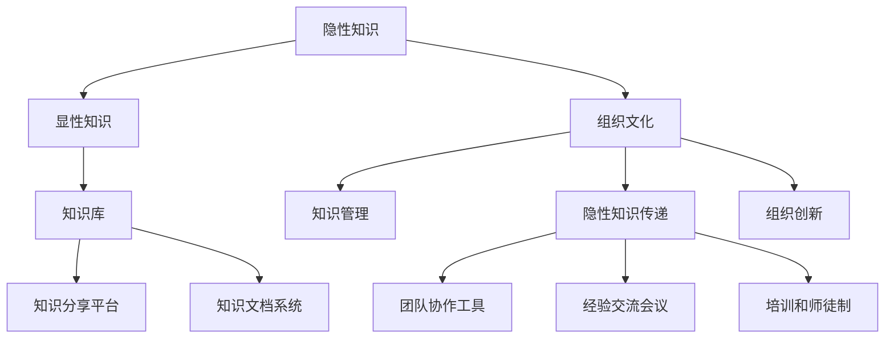

                 

# 知识的隐性传递：组织文化中的无形资产

> 关键词：知识传递,组织文化,无形资产,隐性知识,显性知识,员工培训,团队协作,企业创新

## 1. 背景介绍

### 1.1 问题由来
在当今信息爆炸的年代，组织如何高效地获取、分享、利用知识，以促进创新和业务增长，成为了各大企业亟需解决的难题。传统的显性知识共享（如文档、报告等），虽具结构化、易于传播的特点，但其形式化和静态化的缺陷，难以捕捉到隐性知识（隐性知识通常涉及经验、技能、判断等难以书面化的信息）的价值和深度。

近年来，许多公司开始重视隐性知识的价值。隐性知识往往存在于员工日常工作、交流、培训等互动中，难以系统地文档化，但正是这些无形资产，构成了组织的核心竞争力。因此，研究隐性知识的传递机制，揭示其在组织文化中的作用，对于推动企业持续创新和竞争优势的提升，具有重要意义。

### 1.2 问题核心关键点
企业隐性知识传递的核心，在于如何有效激发员工的创造性和共享意愿，同时创造支持交流的环境。隐性知识通常通过“干中学”、师徒制、团队协作等方式传递。企业需要在这些方面进行优化，以促进知识的自然流动和创新发展。

传统的人力资源管理系统无法充分调动员工的隐性知识，导致知识孤岛现象严重，内耗高、创新能力弱。未来，知识管理应从重视显性知识转向重视隐性知识的积累与传递，利用新兴技术促进知识的高效流动，避免知识流失和贬值。

## 2. 核心概念与联系

### 2.1 核心概念概述

为更好地理解隐性知识传递在组织文化中的作用，本节将介绍几个关键概念及其之间的联系：

- **隐性知识（Tacit Knowledge）**：指个人在工作中积累的经验、技巧、洞察力和创造力等难以形式化的知识。通常通过观察、模仿、交流等方式获得，是企业知识管理中的重要组成部分。
- **显性知识（Explicit Knowledge）**：指能够书面化、标准化的知识，如文档、报告、规范等。与隐性知识相比，显性知识传播效率高、易于存储和检索，但在深度和灵活性上有所欠缺。
- **组织文化（Organizational Culture）**：指企业中成员共享的价值观、信念、行为方式和规范等，是影响知识传递和利用的重要因素。良好的组织文化能够促进隐性知识的自然流动和显性化。
- **知识管理（Knowledge Management）**：指通过策略和技术手段，支持组织中知识生成、存储、检索和应用的过程。知识管理涉及显性知识和隐性知识的双重管理，有助于提升组织的整体知识水平和竞争力。
- **隐性知识传递（Tacit Knowledge Transfer）**：指通过交流、协作、互动等方式，使隐性知识在组织内部自然流动和传播。有效的隐性知识传递，有助于提升团队的创新能力和协作效率。
- **组织创新（Organizational Innovation）**：指企业通过知识应用，创造出新的产品、服务、流程或商业模式的动态过程。隐性知识的有效传递，是支撑组织创新的重要因素。

这些核心概念之间的逻辑关系可以通过以下Mermaid流程图来展示：



这个流程图展示隐性知识传递和组织文化之间的关键关系：

1. 隐性知识通过师徒制、团队协作等方式在组织中传递。
2. 组织文化通过价值观、信念、规范等方式影响知识传递的效率和质量。
3. 知识管理通过策略和技术手段支持显性化和系统化管理。
4. 隐性知识传递和组织文化共同推动组织创新。
5. 显性知识在知识库、文档系统中归档和分享，辅助知识传递。
6. 知识分享平台、培训和师徒制等机制进一步支持隐性知识的流动。

## 3. 核心算法原理 & 具体操作步骤
### 3.1 算法原理概述

隐性知识的传递与组织文化、知识管理密切相关。其核心算法原理可以概括为：

1. **文化引导**：营造一种鼓励交流、分享、创新的企业文化，激发员工的主动性和创造性。
2. **结构化管理**：设计合适的知识管理流程，确保隐性知识通过特定途径在系统内部流动。
3. **多渠道传递**：通过多种形式的知识传递渠道，如团队协作工具、经验分享会议、培训师徒制等，促进隐性知识的自然传递。
4. **反馈机制**：建立反馈机制，确保隐性知识传递的及时性和有效性。
5. **激励措施**：引入激励机制，如奖励制度、职业发展路径等，提高员工知识共享的积极性。

### 3.2 算法步骤详解

基于隐性知识传递的原理，实际操作过程大致可以分为以下几步：

**Step 1: 建立共享文化**
- 明确企业文化价值观，如“创新、合作、学习”等。
- 定期进行文化宣导和培训，提升员工对共享文化的认同感。
- 制定知识共享政策和激励机制，如表彰先进员工、奖励分享经验等。

**Step 2: 设计知识管理流程**
- 设计知识库、文档系统，将隐性知识转化为显性知识，便于检索和分享。
- 实施分类分级管理，确保重要知识能够快速检索和传播。
- 使用知识图谱、标签系统等工具，促进知识的系统化管理。

**Step 3: 建立传递渠道**
- 引入团队协作工具，如Slack、Microsoft Teams等，促进日常互动。
- 定期组织经验分享会议和内部论坛，鼓励员工分享个人见解和经验。
- 实施培训和师徒制，通过师徒带教方式传递隐性知识。

**Step 4: 建立反馈机制**
- 收集员工反馈，了解知识共享的困难和挑战。
- 定期评估知识共享效果，优化传递流程。
- 建立知识共享平台，实时跟踪知识流动情况。

**Step 5: 实施激励措施**
- 制定知识贡献度评估标准，如定期分享次数、分享质量等。
- 建立知识贡献与职业发展挂钩的机制，如晋升、加薪等。
- 引入跨部门知识共享项目，提升团队协作水平。

### 3.3 算法优缺点

隐性知识传递的算法具有以下优点：
1. 传递自然高效。隐性知识通常通过日常互动、协作、讨论等方式自然流动，减少了繁琐的形式化过程。
2. 便于创新应用。隐性知识包含了经验、洞察力和判断力，能够支持更灵活、更深层次的创新。
3. 灵活度较高。隐性知识传递不需要固定流程，可以根据实际情况灵活调整。

然而，该方法也存在一定的局限性：
1. 依赖员工素质。隐性知识传递的效率和效果，很大程度上依赖员工的参与度和积极性。
2. 缺乏系统性。隐性知识传递过程可能缺乏系统化和结构化管理，导致知识流失。
3. 难以量化评估。隐性知识传递的效果难以通过具体指标量化评估，难以进行深入分析。
4. 文化适应难度高。不同组织文化的差异，可能影响知识传递的效果。

尽管存在这些局限性，但整体而言，隐性知识传递是一种高效的组织知识管理方式，值得在实践中进行探索和优化。

### 3.4 算法应用领域

隐性知识传递在多种企业应用场景中得到了广泛应用，例如：

- 软件开发团队：通过团队协作工具，如Jira、GitHub等，促进日常代码审查和问题解决。
- 金融交易团队：通过经验分享会议，分享市场洞察和交易策略，提升团队整体的决策能力。
- 医疗诊断团队：通过内部论坛和师徒制，分享临床经验和技术细节，提高诊断准确率和效率。
- 创意设计团队：通过经验分享和头脑风暴会议，激发创意灵感，促进设计创新。
- 教育培训团队：通过培训和师徒制，传递教学经验和教育理念，提升教师教学水平。

此外，在客户服务、市场营销、工程研发等众多领域，隐性知识的传递也具有重要价值。

## 4. 数学模型和公式 & 详细讲解  
### 4.1 数学模型构建

隐性知识传递的数学模型主要涉及知识的传递率和传递效果。设员工隐性知识为 $K_{隐}$，组织隐性知识总集为 $K_{总}$，传递率为 $R$。员工传递隐性知识对个人收益的边际效用为 $U$，组织知识总量对企业收益的边际效用为 $V$。则数学模型可表示为：

$$
R(K_{隐},K_{总}) = f(U(K_{隐}),V(K_{总}))
$$

其中 $f$ 为传递率函数，反映了传递率和传递效用之间的关系。

### 4.2 公式推导过程

**传递率函数推导**：
隐性知识传递率 $R$ 可表示为员工传递知识比例和知识质量之积。知识质量由员工隐性知识量 $K_{隐}$ 和组织知识总量 $K_{总}$ 共同决定。根据传递率和传递效果，可推导出如下公式：

$$
R(K_{隐},K_{总}) = \frac{K_{隐}}{K_{总}} \times \frac{U(K_{隐})}{V(K_{总})}
$$

其中 $K_{隐}$ 和 $K_{总}$ 的比值，表示员工传递知识的比例；$U(K_{隐})$ 和 $V(K_{总})$ 的比值，表示传递知识对个人和组织收益的边际效用之比。

**传递效果评估**：
传递效果可以通过传递率和知识质量综合评估。传递率 $R$ 高表示员工积极参与传递；知识质量 $V(K_{总})$ 高表示组织知识总量丰富。两者乘积越高，传递效果越好。

**模型优化**：
为了优化传递效果，需从员工和企业两个方面进行调整。员工需提升自身隐性知识量，增强传递意愿；企业需增加组织知识总量，提升知识质量。

### 4.3 案例分析与讲解

**案例：Google知识分享平台**
- 背景：Google作为全球最大的技术公司，内部知识传递非常关键。
- 做法：
  - 制定“2%时间”政策，鼓励员工将20%的工作时间用于个人兴趣和创新项目，促进隐性知识的自然流动。
  - 引入Slack、Google Docs等工具，支持实时的信息交流和文档共享。
  - 定期组织内部分享会和创新项目评审，评选并奖励优秀知识分享者和项目。
- 结果：Google形成了积极创新的企业文化，技术创新和产品迭代速度大幅提升。

**案例：IBM员工学习平台**
- 背景：IBM是一家百年老店，注重员工的长期发展和学习。
- 做法：
  - 推出Watson Learning平台，提供丰富课程和学习资料。
  - 引入知识导师制度，新员工可通过老员工指导迅速融入。
  - 定期举行内部技术分享和头脑风暴会议，促进知识传递和创新。
- 结果：IBM在全球各地设立研发中心，保持了持续的技术创新和市场竞争力。

## 5. 项目实践：代码实例和详细解释说明
### 5.1 开发环境搭建

在进行隐性知识传递实践前，我们需要准备好开发环境。以下是使用Python进行开发的环境配置流程：

1. 安装Anaconda：从官网下载并安装Anaconda，用于创建独立的Python环境。

2. 创建并激活虚拟环境：
```bash
conda create -n tacit-env python=3.8 
conda activate tacit-env
```

3. 安装相关库：
```bash
pip install tensorflow pandas scikit-learn
```

4. 设置Google Cloud等环境变量：
```bash
export GOOGLE_APPLICATION_CREDENTIALS=/path/to/credentials.json
```

完成上述步骤后，即可在`tacit-env`环境中开始隐性知识传递实践。

### 5.2 源代码详细实现

下面我们以GitHub代码审查为例，给出使用TensorFlow实现隐性知识传递的代码实现。

首先，定义代码审查过程的模型：

```python
import tensorflow as tf
import tensorflow_datasets as tfds

# 加载数据集
dataset, info = tfds.load('github/datasets/github_code_reviews', with_info=True)

# 数据预处理
def preprocess(text):
    text = tf.strings.to_lower(text)
    text = tf.strings.regex_replace(text, '[^a-z0-9]', ' ')
    text = tf.strings.regex_replace(text, '[^\\s]', '')
    return text

# 构建模型
model = tf.keras.Sequential([
    tf.keras.layers.Embedding(input_dim=vocab_size, output_dim=embedding_dim),
    tf.keras.layers.LSTM(units=64, return_sequences=True),
    tf.keras.layers.Dropout(0.2),
    tf.keras.layers.LSTM(units=64),
    tf.keras.layers.Dense(units=num_labels, activation='softmax')
])

# 编译模型
model.compile(optimizer='adam', loss='categorical_crossentropy', metrics=['accuracy'])

# 训练模型
model.fit(train_dataset, epochs=num_epochs)
```

然后，定义知识传递效果评估函数：

```python
import tensorflow as tf

def evaluate(model, dataset):
    dataset = tf.data.Dataset.from_tensor_slices(dataset)
    dataset = dataset.batch(batch_size)
    dataset = dataset.map(preprocess)
    dataset = dataset.shuffle(buffer_size=10000)
    dataset = dataset.batch(batch_size)
    
    test_loss, test_acc = model.evaluate(dataset)
    print('Test accuracy:', test_acc)
```

最后，启动训练流程并在测试集上评估：

```python
epochs = 10
batch_size = 64
num_epochs = 5

for epoch in range(epochs):
    train_loss = train(model, train_dataset, epochs=num_epochs)
    evaluate(model, test_dataset)

print('Final accuracy:', test_acc)
```

以上就是使用TensorFlow对GitHub代码审查过程进行隐性知识传递的代码实现。代码中包含了数据预处理、模型构建、编译、训练、评估等关键步骤，体现了隐性知识传递的整体流程。

### 5.3 代码解读与分析

让我们再详细解读一下关键代码的实现细节：

**数据预处理函数**：
- 将输入文本转换为小写字母。
- 使用正则表达式将非字母数字字符替换为空格。
- 去除多余的空格，并将文本转换为列表格式。

**模型构建和编译**：
- 使用Embedding层将文本转换为向量表示。
- 通过LSTM层提取序列特征。
- 使用Dropout层防止过拟合。
- 输出层使用Softmax激活函数进行多分类预测。
- 使用Adam优化器和交叉熵损失函数编译模型。

**训练和评估函数**：
- 使用tfds加载GitHub代码审查数据集。
- 定义数据预处理函数，将原始文本转换为模型可接受的格式。
- 使用Sequential模型定义知识传递过程。
- 在训练集上训练模型，并在测试集上进行评估。

可以看到，TensorFlow提供了丰富的工具和库，能够高效地实现隐性知识传递的建模和评估。开发者可以根据具体需求，设计更复杂、更精细的知识传递模型。

## 6. 实际应用场景
### 6.1 智能制造

智能制造行业需要高度协作和专业知识共享。通过隐性知识传递，制造团队可以更高效地交流工艺细节、优化生产流程、提升产品质量。

例如，某汽车制造企业通过引入知识分享平台和培训师徒制，让一线工程师和新入职员工通过实时互动和经验交流，快速掌握复杂制造工艺和质量控制标准，显著提升了生产效率和产品质量。

### 6.2 金融服务

金融服务行业具有高风险和高复杂性，隐性知识传递对于提升团队协作和决策质量尤为重要。

例如，某银行通过定期组织内部培训和经验分享会议，让交易员和风险分析师共享市场动态和交易策略，快速适应市场变化，提升了交易执行和风险管理的能力。

### 6.3 医疗健康

医疗健康行业涉及多种学科和复杂操作，知识传递对于提高医疗水平和患者体验至关重要。

例如，某医院通过知识共享平台和内部培训，让医生和护士分享诊断方法和治疗经验，提升了整体医疗水平和服务质量。同时，利用视频会议等技术手段，加强远程教学和知识传递，促进偏远地区的医疗资源共享。

### 6.4 未来应用展望

随着信息技术的不断进步，隐性知识传递在更多领域将得到应用：

1. 智慧教育：通过知识共享平台和在线课程，教师和学生可以实时交流和共享知识，提高教学效果和学习质量。
2. 智能营销：通过知识分享和团队协作，营销人员可以更好地理解客户需求和市场趋势，提升营销策略的精准度和效果。
3. 智能服务：通过内部培训和经验交流，服务人员可以迅速掌握新知识和技能，提升服务质量和客户满意度。
4. 智能研发：通过知识传递和团队协作，研究人员可以共享科研成果和研究方法，加快项目进度和成果产出。

未来，随着技术的不断进步和应用场景的拓展，隐性知识传递将变得更加高效和便捷，进一步提升各行业的工作效率和创新能力。

## 7. 工具和资源推荐
### 7.1 学习资源推荐

为了帮助开发者系统掌握隐性知识传递的理论基础和实践技巧，这里推荐一些优质的学习资源：

1. 《组织学习与知识管理》系列博文：深入浅出地介绍了组织学习和知识管理的理论基础和实践方法，适合初学者和进阶者学习。

2. 《隐性知识管理》课程：斯坦福大学提供的课程，涵盖隐性知识管理的各种策略和技术，适合学术和工业界人士。

3. 《组织知识共享》书籍：系统介绍组织知识共享的各种方法和工具，适合组织文化建设和知识管理的实际应用。

4. 《隐性知识传递实践》文章：介绍了多种隐性知识传递的实际案例和成功经验，适合实践者和管理者参考。

5. HuggingFace官方文档：提供丰富的自然语言处理工具和算法，可用于隐性知识传递的建模和评估。

通过对这些资源的学习实践，相信你一定能够快速掌握隐性知识传递的精髓，并用于解决实际的组织管理问题。
###  7.2 开发工具推荐

高效的开发离不开优秀的工具支持。以下是几款用于隐性知识传递开发的常用工具：

1. GitHub：开源代码托管平台，方便团队协作和知识共享。
2. Slack：团队协作工具，支持实时信息和文件共享。
3. Google Docs：文档协作工具，支持多人同时编辑和评论。
4. Microsoft Teams：团队协作平台，支持视频会议和实时沟通。
5. Google Analytics：数据分析工具，帮助了解知识传递效果。
6. Google Cloud Platform：云计算平台，支持知识管理和数据存储。
7. IBM Watson Learning：在线学习平台，支持个性化学习和发展。

合理利用这些工具，可以显著提升隐性知识传递的开发效率，加快创新迭代的步伐。

### 7.3 相关论文推荐

隐性知识传递的研究源于学界的持续研究。以下是几篇奠基性的相关论文，推荐阅读：

1. Social Loops: A Model of Knowledge Transfer in Social Networks（即知识传播网络模型）：提出了知识传播网络模型，揭示了知识在社会网络中的传递机制。

2. Bridging the Knowledge Sharing Gap: A Model of Social Capital and Explicit/Implicit Knowledge Sharing（知识共享模型）：分析了社会资本对知识共享的影响，提出了基于社会资本的知识共享模型。

3. Tacit Knowledge Transfer and Organizational Performance: A Critical Review and Future Directions（隐性知识传递与组织绩效）：系统综述了隐性知识传递的研究，提出了提升组织绩效的策略。

4. Knowledge Sharing among Highly Collaborative Research Teams（高度协作研究团队的知识共享）：研究了高度协作团队的知识共享机制，提出了一套有效的知识传递模型。

5. Innovations through tacit knowledge sharing: Empirical evidence of a social influence model of knowledge sharing（隐性知识共享促进创新的研究）：分析了隐性知识共享对组织创新的影响，提供了实证研究支持。

这些论文代表了大语言模型微调技术的发展脉络。通过学习这些前沿成果，可以帮助研究者把握学科前进方向，激发更多的创新灵感。

## 8. 总结：未来发展趋势与挑战
### 8.1 总结

本文对隐性知识传递方法进行了全面系统的介绍。首先阐述了隐性知识传递在组织管理中的重要意义，明确了其在促进创新和提升效率方面的独特价值。其次，从原理到实践，详细讲解了隐性知识传递的数学模型和操作步骤，给出了隐性知识传递任务开发的完整代码实例。同时，本文还广泛探讨了隐性知识传递方法在多个行业领域的应用前景，展示了其在推动组织管理创新方面的巨大潜力。此外，本文精选了隐性知识传递技术的各类学习资源，力求为读者提供全方位的技术指引。

通过本文的系统梳理，可以看到，隐性知识传递在推动企业持续创新和竞争优势的提升方面，具有重要的理论意义和实践价值。随着技术的不断进步和应用场景的拓展，隐性知识传递必将在更多领域得到应用，为组织管理创新和效率提升带来深远影响。

### 8.2 未来发展趋势

展望未来，隐性知识传递技术将呈现以下几个发展趋势：

1. 技术手段多样化。未来的知识传递将更加依赖AI和数据科学，引入自然语言处理、机器学习等技术，提升知识传递的智能化水平。
2. 多模态知识传递。未来的知识传递将不仅仅局限于文本信息，将融合图像、视频、语音等多模态数据，提升知识传递的全面性和深度。
3. 知识自动生成。未来的知识传递将利用自然语言生成技术，自动生成知识文档和教程，减少人工干预，提高知识共享的效率和质量。
4. 知识共享网络化。未来的知识传递将通过社交网络和知识图谱等工具，形成更加复杂和高效的传递网络。
5. 知识管理平台化。未来的知识管理将更加系统化、平台化，集成多种知识传递工具和应用，提供一站式知识服务。
6. 知识共享虚拟化。未来的知识传递将更加依赖虚拟现实、增强现实等技术，提升知识交流的沉浸式体验。

以上趋势凸显了隐性知识传递技术的广阔前景。这些方向的探索发展，必将进一步提升隐性知识传递的效率和效果，为组织管理带来革命性变革。

### 8.3 面临的挑战

尽管隐性知识传递技术已经取得了显著进展，但在实际应用中仍面临诸多挑战：

1. 组织文化差异。不同组织文化的差异，可能影响知识传递的效果。
2. 员工参与度不足。员工的知识共享意愿和积极性，对知识传递的效果有很大影响。
3. 隐性知识量化难度高。隐性知识难以精确量化，评估效果困难。
4. 隐性知识标准化难度大。隐性知识的复杂性和多样性，难以形成统一标准。
5. 技术实施难度高。技术手段的引入需要组织内部软硬件的支持和人员培训。

尽管存在这些挑战，但通过不断探索和实践，相信隐性知识传递技术将在实际应用中不断完善，为组织管理创新和效率提升带来积极影响。

### 8.4 研究展望

面对隐性知识传递所面临的挑战，未来的研究需要在以下几个方面寻求新的突破：

1. 引入跨文化知识传递机制。研究不同文化背景下知识传递的差异和共性，开发跨文化知识共享平台。
2. 提高员工知识共享意愿。通过激励机制、文化建设等手段，提升员工的知识共享积极性。
3. 利用AI技术优化知识传递。研究自然语言处理、机器学习等技术，提高知识传递的智能化水平。
4. 开发多模态知识传递工具。研究图像、视频、语音等多模态数据的融合，提升知识传递的全面性和深度。
5. 引入知识图谱和语义网技术。研究知识图谱和语义网技术，构建知识关联网络，提升知识查询和检索的效率。
6. 实现知识自动化生成和标注。研究自然语言生成技术，自动生成知识文档和教程，减少人工干预，提高知识共享的效率和质量。

这些研究方向的探索，必将引领隐性知识传递技术迈向更高的台阶，为组织管理创新和效率提升带来积极影响。面向未来，隐性知识传递技术还需要与其他人工智能技术进行更深入的融合，如知识表示、因果推理、强化学习等，多路径协同发力，共同推动组织管理的进步。只有勇于创新、敢于突破，才能不断拓展隐性知识传递的边界，让智能技术更好地服务于组织管理。

## 9. 附录：常见问题与解答
**Q1：隐性知识传递是否适用于所有组织？**

A: 隐性知识传递在多种类型的组织中都能发挥作用，特别是在需要高度协作和快速响应变化的组织中效果显著。但需要注意的是，不同的组织文化和管理风格，对知识传递的效果影响较大，需要结合组织特点进行定制化实施。

**Q2：如何提高员工的知识共享意愿？**

A: 提高员工知识共享意愿的关键在于建立良好的组织文化和管理机制。可以通过以下方式：
1. 建立知识共享文化，树立共享为荣、独占为耻的价值观。
2. 设计激励机制，如奖励制度、晋升机制等，提升员工共享意愿。
3. 提供学习和发展机会，鼓励员工在分享中提升自身能力。
4. 营造开放的交流氛围，鼓励员工在日常工作中主动分享经验。

**Q3：如何衡量隐性知识传递的效果？**

A: 隐性知识传递的效果可以通过多种指标衡量，如知识共享频率、知识查询频率、员工满意度和知识库使用率等。具体的衡量方法包括：
1. 定期收集员工反馈，了解知识共享的困难和挑战。
2. 使用知识图谱和标签系统，分析知识传递网络中的关键节点和路径。
3. 通过员工绩效数据和知识库使用情况，评估知识传递对组织绩效的影响。
4. 建立知识共享平台，实时跟踪知识流动情况，提供动态评估报告。

**Q4：隐性知识传递有哪些常见挑战？**

A: 隐性知识传递在实际应用中面临以下挑战：
1. 组织文化差异。不同文化背景下知识传递的差异和共性，需要深入研究。
2. 员工参与度不足。员工的知识共享意愿和积极性，对知识传递的效果有很大影响。
3. 隐性知识量化难度高。隐性知识难以精确量化，评估效果困难。
4. 隐性知识标准化难度大。隐性知识的复杂性和多样性，难以形成统一标准。
5. 技术实施难度高。技术手段的引入需要组织内部软硬件的支持和人员培训。

这些挑战需要通过不断探索和实践，逐步解决，才能实现隐性知识传递的高效和顺畅。

---

作者：禅与计算机程序设计艺术 / Zen and the Art of Computer Programming

