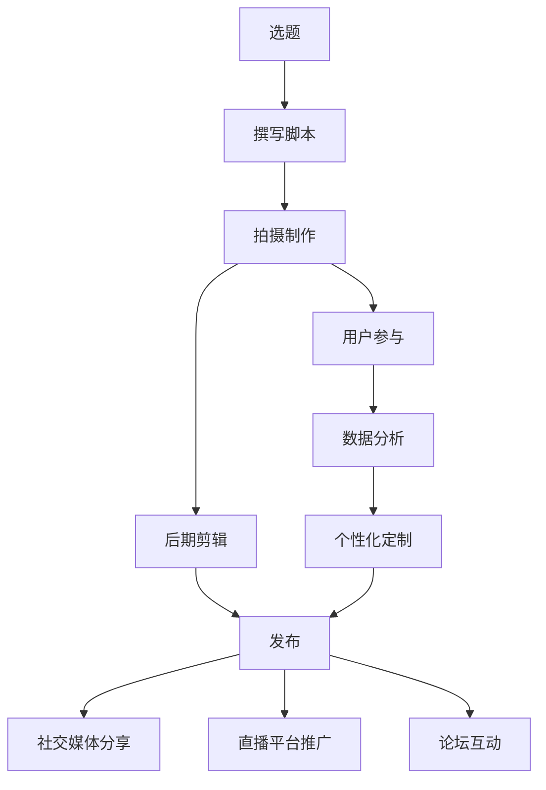

                 

# 知识短视频要把握分享和互动的新形式

在信息技术迅猛发展的当下，短视频正成为传播知识、分享信息的重要载体。从教育到娱乐，从技术科普到商业推广，视频形式以其生动、直观、易于传播的特点，吸引了大量用户和内容创作者。然而，短视频的火爆也带来了一系列挑战：如何在传播知识的同时，确保内容的质量和互动性，以及如何与用户进行有效的交流与反馈，都成为视频内容创作者需要面对的难题。本文将深入探讨知识短视频的分享和互动新形式，力求为视频内容创作者提供系统的策略和方法，以期在传播知识的广度和深度上达到新的高度。

## 1. 背景介绍

### 1.1 问题由来

随着移动设备和网络带宽的提升，短视频迅速成为用户获取信息和知识的主要渠道之一。特别是在教育、科技、艺术等领域，短视频因其高效、生动、易于吸收的特点，受到广泛关注和推崇。然而，随着内容创作者越来越多，内容同质化问题也逐渐凸显。如何在短视频中传达知识，同时保持其独特性、互动性和吸引力，成为摆在新一代内容创作者面前的重要课题。

### 1.2 问题核心关键点

在探索知识短视频的分享和互动新形式时，我们需关注以下几个核心关键点：
- **内容质量与创意**：短视频必须兼具高质量的内容和创意性，才能吸引用户并确保信息的准确传递。
- **互动性与参与感**：通过互动手段，如评论、点赞、分享、提问等，增强用户的参与感和体验感。
- **多渠道融合**：结合社交媒体、直播、论坛等渠道，形成内容传播的多样性和连贯性。
- **个性化与定制化**：根据用户兴趣和需求，提供个性化的内容推荐和定制化的服务体验。

## 2. 核心概念与联系

### 2.1 核心概念概述

为了更好地理解知识短视频的分享和互动新形式，本节将介绍几个关键概念：

- **知识短视频(Knowledge Videos)**：指利用短视频形式传递知识的传播媒介，包括教学视频、科普视频、技术分享等。

- **内容创作(Content Creation)**：创作视频内容的过程，涉及选题、撰写脚本、拍摄制作、后期剪辑等多个环节。

- **用户参与(Interactive Engagement)**：指用户在观看视频过程中，通过评论、点赞、分享、提问等方式与内容创作者互动的过程。

- **多渠道融合(Multichannel Integration)**：将视频内容在多个社交平台、直播平台和论坛上发布和推广，形成更广泛的传播效果。

- **个性化定制(Personalization)**：根据用户兴趣和行为数据，定制个性化的视频内容和推荐，提升用户满意度。

这些核心概念之间通过互动和反馈，形成了知识短视频从创作到传播再到互动的闭环。只有理解并掌握这些关键点，才能创作出高质量、具有吸引力的短视频内容。

### 2.2 核心概念原理和架构的 Mermaid 流程图



这个流程图展示了知识短视频从创作到传播再到互动的完整流程：

1. 从选题开始，进行视频创作。
2. 在拍摄制作完成后，进行后期剪辑，形成最终视频。
3. 视频在多个平台发布，包括社交媒体、直播平台、论坛等。
4. 用户通过多种方式与视频内容互动。
5. 利用数据分析，对用户行为进行深度理解，进行个性化定制。
6. 最后，通过个性化定制，提升视频内容的吸引力和用户参与度，形成良性循环。

## 3. 核心算法原理 & 具体操作步骤

### 3.1 算法原理概述

知识短视频的分享和互动新形式，涉及内容创作、用户参与、数据分析等多个环节。本文将分别从内容创作、用户参与和数据分析三个方面，介绍相关的算法原理和操作步骤。

### 3.2 算法步骤详解

#### 3.2.1 内容创作算法

内容创作是知识短视频的起点，其关键在于确保内容的创意性和教育性。以下是创作知识短视频的详细步骤：

1. **选题与定位**：根据目标受众的兴趣和需求，选择合适的主题和内容形式。利用关键词搜索和数据分析工具，确定热门话题和趋势。

2. **脚本撰写**：围绕主题，撰写详细的脚本，包括开场白、主体内容、结尾总结等。确保逻辑清晰、结构紧凑，能够有效传达信息。

3. **拍摄与制作**：选择合适的拍摄场地和设备，进行视频拍摄。利用后期剪辑软件，对视频进行剪辑、调色、配音等处理，确保视觉效果和声音效果。

#### 3.2.2 用户参与算法

用户参与是知识短视频互动的重要组成部分，其核心在于激发用户的兴趣和积极性。以下是实现用户参与的详细步骤：

1. **互动设计**：在视频中设计互动环节，如提问、投票、小游戏等，鼓励用户参与。利用评论区功能，收集用户反馈和问题，形成互动的闭环。

2. **社群构建**：在视频发布平台上建立社群，吸引相同兴趣的用户，形成社区互动。利用直播功能，进行实时互动，增强用户粘性。

3. **用户反馈**：收集和分析用户评论、点赞、分享等数据，了解用户需求和偏好，不断改进和优化视频内容。

#### 3.2.3 数据分析算法

数据分析是知识短视频创作的辅助手段，其目标在于理解用户行为，实现个性化定制。以下是利用数据分析的详细步骤：

1. **数据采集**：通过视频平台的数据接口，收集用户观看、互动等行为数据。包括观看时长、点赞数、评论数、分享数等。

2. **数据分析**：利用统计学和机器学习算法，对数据进行分析和挖掘。识别热门话题、用户兴趣等关键信息，为内容创作提供依据。

3. **个性化推荐**：根据用户行为数据，生成个性化的视频推荐列表，提升用户满意度。

### 3.3 算法优缺点

知识短视频的分享和互动新形式，具有以下优点：

- **高效传播**：短视频形式生动直观，易于理解和传播，能够迅速吸引大量用户关注。
- **互动性强**：通过评论、点赞、分享等多种互动方式，增强用户参与感和体验感。
- **数据驱动**：通过数据分析，实现内容优化和个性化推荐，提升用户满意度。

同时，这些方法也存在一些局限性：

- **内容质量难以保证**：快速创作视频可能导致内容质量参差不齐，影响用户体验。
- **用户参与度受限**：部分用户可能对互动形式不感兴趣，影响互动效果。
- **数据隐私问题**：用户行为数据的收集和分析可能涉及隐私问题，需要合理合规使用。

### 3.4 算法应用领域

知识短视频的分享和互动新形式，广泛应用于教育、科技、商业等多个领域：

- **在线教育**：利用短视频进行知识普及和课程讲解，提高教学效果。通过互动和反馈，增强学生的学习体验。
- **科技科普**：通过短视频普及最新科技成果，解释复杂的技术原理。利用互动和社群，提高科普效果。
- **商业推广**：利用短视频展示产品和服务，吸引客户关注。通过互动和社群，提升品牌知名度和用户粘性。
- **文化传承**：通过短视频记录和传播文化活动，提升文化影响力和传播效果。利用互动和反馈，增强文化体验。

## 4. 数学模型和公式 & 详细讲解 & 举例说明

### 4.1 数学模型构建

本节将使用数学语言对知识短视频的分享和互动新形式进行更加严格的刻画。

假设一个知识短视频的内容为 $X$，用户互动度为 $Y$，数据分析结果为 $Z$。其中 $X$ 可以表示为文本、图像、视频等多种形式。$Y$ 包括用户的评论、点赞、分享等行为，可以表示为向量形式。$Z$ 包括用户行为数据，可以表示为矩阵形式。

定义模型 $M$ 在输入 $X$ 上的输出为 $Y$，在输入 $Z$ 上的输出为 $Z'$，则知识短视频的数学模型可以表示为：

$$
Y = M(X)
$$
$$
Z' = M(Z)
$$

其中 $M$ 为模型函数，包括内容创作、用户参与、数据分析等多个模块。

### 4.2 公式推导过程

以下我们以知识短视频的用户参与度为例，推导用户互动度的计算公式及其梯度计算过程。

假设用户观看视频后，对视频内容进行评论、点赞、分享等行为。设用户行为向量为 $\vec{y} = [y_1, y_2, ..., y_n]$，其中 $y_i$ 表示用户对第 $i$ 个视频的互动行为，如评论数、点赞数、分享数等。

则用户互动度可以表示为：

$$
Y = \sum_{i=1}^n \alpha_i y_i
$$

其中 $\alpha_i$ 为行为权重，根据不同行为对用户互动度的影响程度进行设置。假设用户评论数对互动度的影响最大，则 $\alpha_1$ 设置较大。

利用梯度下降等优化算法，计算用户互动度的梯度，最小化互动度误差 $\Delta Y$：

$$
\Delta Y = Y - Y^* = \sum_{i=1}^n (\alpha_i y_i - \alpha_i y_i^*)
$$

其中 $Y^*$ 为目标互动度。根据梯度公式：

$$
\nabla_{\vec{y}} \Delta Y = [\alpha_1 - \alpha_1 y_1^*, \alpha_2 - \alpha_2 y_2^*, ..., \alpha_n - \alpha_n y_n^*]
$$

利用上述梯度信息，更新用户行为向量 $\vec{y}$，最小化互动度误差 $\Delta Y$。

### 4.3 案例分析与讲解

以在线教育平台为例，利用短视频进行知识传播和互动。

**案例背景**：某在线教育平台希望通过短视频提升课程学习效果，增强学生互动。平台初期选择多门热门课程，邀请知名教师录制讲解视频。视频内容包括概念讲解、习题解析、实验演示等。

**分析与实施**：

1. **内容创作**：教师团队根据课程大纲和学生需求，选择合适的知识点，撰写详细脚本，并进行视频拍摄和制作。视频内容包括概念讲解、习题解析、实验演示等。

2. **用户参与**：平台在视频发布页面设计评论区、问答区等功能，鼓励学生观看后留言提问。通过直播功能，进行实时互动，解答学生问题。平台定期举办线上答疑活动，增强学生参与感。

3. **数据分析**：平台利用数据分析工具，收集学生观看时长、评论数、点赞数、分享数等数据。利用统计学和机器学习算法，识别热门知识点、高互动视频等关键信息。根据数据分析结果，调整课程内容，提升学生学习效果。

## 5. 项目实践：代码实例和详细解释说明

### 5.1 开发环境搭建

在进行知识短视频的开发实践前，我们需要准备好开发环境。以下是使用Python进行Pandas开发的环境配置流程：

1. 安装Anaconda：从官网下载并安装Anaconda，用于创建独立的Python环境。

2. 创建并激活虚拟环境：
```bash
conda create -n pandas-env python=3.8 
conda activate pandas-env
```

3. 安装Pandas：从官网获取对应的安装命令。例如：
```bash
conda install pandas
```

4. 安装其他工具包：
```bash
pip install numpy matplotlib scikit-learn tqdm jupyter notebook ipython
```

完成上述步骤后，即可在`pandas-env`环境中开始项目实践。

### 5.2 源代码详细实现

下面我们以教育平台的数据分析为例，给出使用Pandas进行数据分析的Python代码实现。

首先，定义数据分析函数：

```python
import pandas as pd

def analyze_data(data):
    # 数据预处理
    data['watch_time'] = data['watch_time'].fillna(0)
    data['comment_count'] = data['comment_count'].fillna(0)
    data['share_count'] = data['share_count'].fillna(0)
    
    # 计算用户互动度
    data['user_interaction'] = data['watch_time'] + 2*data['comment_count'] + data['share_count']
    
    # 计算热门视频
    data['high_interaction'] = data['user_interaction'] > data['user_interaction'].median()
    
    return data
```

然后，定义数据分析流程：

```python
# 数据读取
data = pd.read_csv('video_data.csv')

# 数据分析
data = analyze_data(data)

# 结果输出
print(data.head())
print(data.describe())
```

### 5.3 代码解读与分析

让我们再详细解读一下关键代码的实现细节：

**analyze_data函数**：
- `data['watch_time'] = data['watch_time'].fillna(0)`：处理缺失值，将缺失的观看时长置为0。
- `data['comment_count'] = data['comment_count'].fillna(0)`：处理缺失值，将缺失的评论数置为0。
- `data['share_count'] = data['share_count'].fillna(0)`：处理缺失值，将缺失的分享数置为0。
- `data['user_interaction'] = data['watch_time'] + 2*data['comment_count'] + data['share_count']`：计算用户互动度，观看时长的权重设为1，评论数的权重设为2，分享数的权重设为1。
- `data['high_interaction'] = data['user_interaction'] > data['user_interaction'].median()`：根据用户互动度，判断是否为热门视频。

**数据分析流程**：
- `data = pd.read_csv('video_data.csv')`：从CSV文件中读取数据。
- `data = analyze_data(data)`：调用数据分析函数，处理数据并计算用户互动度和热门视频。
- `print(data.head())`：输出前5行数据，查看数据处理结果。
- `print(data.describe())`：输出数据统计信息，了解数据分布和特点。

可以看到，Pandas库使得数据分析变得简洁高效，开发者可以快速进行数据处理和统计计算，辅助决策和优化。

当然，实际应用中还需要根据具体需求，设计更加复杂的数据分析流程和算法，以实现更精准的用户互动分析和个性化推荐。

## 6. 实际应用场景

### 6.1 在线教育平台

知识短视频在在线教育平台上的应用，极大地提升了教学效果和学生互动。平台通过短视频进行知识普及和课程讲解，利用评论、直播等互动方式，增强学生参与感。通过数据分析，平台能够识别热门知识点和课程，进行内容优化和个性化推荐，提升学生学习效果。

### 6.2 科普知识传播

知识短视频在科普领域也有广泛应用。科普机构通过短视频普及最新科技成果，解释复杂的技术原理。利用互动和社群，增强科普效果，提升公众的科学素养。

### 6.3 商业品牌推广

知识短视频在商业品牌推广中也有着重要作用。品牌通过短视频展示产品和服务，吸引客户关注。利用互动和社群，提升品牌知名度和用户粘性，实现商业价值最大化。

### 6.4 未来应用展望

随着知识短视频的普及和应用，未来将出现更多的创新应用场景：

1. **虚拟现实(VR)和增强现实(AR)**：结合VR和AR技术，打造沉浸式知识体验。用户可以在虚拟环境中进行互动和探索，增强学习效果。
2. **人工智能(AI)辅助创作**：利用AI技术，辅助视频创作和内容生成，提升创作效率和质量。
3. **跨平台数据共享**：通过数据共享和协同合作，形成知识传播和互动的生态系统，提升资源利用效率。
4. **个性化智能推荐**：结合个性化推荐算法，提供精准的内容推荐，提升用户满意度。
5. **用户生成内容(UGC)**：鼓励用户生成内容，增强平台活跃度和用户参与感。

这些趋势展示了知识短视频在未来应用的广阔前景，也为内容创作者提供了新的灵感和方向。

## 7. 工具和资源推荐

### 7.1 学习资源推荐

为了帮助开发者系统掌握知识短视频的分享和互动新形式，这里推荐一些优质的学习资源：

1. **《知识短视频创作与传播》**：全面介绍知识短视频的创作流程、互动策略和数据分析方法，是知识视频创作者的重要参考资料。

2. **《短视频内容创意与设计》**：涵盖短视频的选题、撰写脚本、拍摄制作、后期剪辑等多个环节，提供丰富的案例和实用技巧。

3. **《在线教育平台数据分析》**：通过实例讲解在线教育平台的数据分析方法和应用，帮助教育机构提升教学效果和学生互动。

4. **《AI与短视频互动》**：介绍AI技术在知识短视频创作和互动中的应用，包括自然语言处理、计算机视觉、推荐系统等。

5. **《大数据与知识传播》**：利用大数据和机器学习技术，进行知识传播效果和用户行为分析，优化内容策略和互动方式。

通过对这些资源的学习实践，相信你一定能够快速掌握知识短视频的创作技巧和互动策略，打造高质量的内容作品。

### 7.2 开发工具推荐

高效的开发离不开优秀的工具支持。以下是几款用于知识短视频创作的常用工具：

1. **Adobe Premiere Pro**：专业的视频编辑软件，支持多轨编辑、特效处理、音频剪辑等功能，适用于高质量视频创作。

2. **Adobe After Effects**：专业的后期特效处理软件，支持复杂的视觉效果和动画效果，适用于创意视频制作。

3. **Final Cut Pro X**：Mac平台的视频编辑软件，支持高效剪辑、精细调整和快速输出，适用于移动视频创作。

4. **DaVinci Resolve**：免费的非线性编辑软件，支持硬件加速和实时渲染，适用于视频制作和后期处理。

5. **Blender**：开源的三维动画软件，支持复杂场景和特效制作，适用于虚拟现实和增强现实内容创作。

合理利用这些工具，可以显著提升知识短视频的创作效率和质量，加速内容创作和传播。

### 7.3 相关论文推荐

知识短视频的分享和互动新形式，涉及内容创作、用户参与、数据分析等多个方面。以下是几篇奠基性的相关论文，推荐阅读：

1. **《用户参与驱动的短视频内容推荐系统》**：提出基于用户参与度的短视频内容推荐算法，提升用户满意度。

2. **《基于深度学习的知识短视频创作》**：利用深度学习技术，自动生成高质量的短视频内容，提升创作效率。

3. **《短视频内容的多模态融合》**：通过图像、音频、文本等多模态信息的融合，增强视频内容的丰富性和互动性。

4. **《知识短视频的情感分析与推荐》**：利用情感分析技术，进行视频内容的情感识别和推荐，提升用户互动和参与感。

5. **《知识短视频的多平台传播与优化》**：分析不同平台的用户行为特点，优化内容策略和传播效果，提升平台影响力。

这些论文代表了大语言模型微调技术的发展脉络。通过学习这些前沿成果，可以帮助研究者把握学科前进方向，激发更多的创新灵感。

## 8. 总结：未来发展趋势与挑战

### 8.1 总结

本文对知识短视频的分享和互动新形式进行了全面系统的介绍。首先阐述了知识短视频创作和互动的核心关键点，明确了内容质量、用户参与和数据分析的紧密联系。其次，从原理到实践，详细讲解了知识短视频的创作算法、用户参与算法和数据分析算法，给出了详细的操作步骤和代码实现。同时，本文还广泛探讨了知识短视频在教育、科普、商业等多个领域的应用前景，展示了知识短视频的巨大潜力。

通过本文的系统梳理，可以看到，知识短视频在传播知识、提升互动和个性化推荐方面具有广阔的前景。受启发于视频内容创作的互动和反馈，未来的知识传播将更加高效和精准，为社会知识普及和终身学习带来新的契机。

### 8.2 未来发展趋势

展望未来，知识短视频的分享和互动新形式将呈现以下几个发展趋势：

1. **多模态融合**：结合图像、音频、文本等多种形式，提升视频内容的丰富性和互动性。

2. **AI辅助创作**：利用AI技术，辅助视频创作和内容生成，提升创作效率和质量。

3. **跨平台数据共享**：通过数据共享和协同合作，形成知识传播和互动的生态系统，提升资源利用效率。

4. **个性化智能推荐**：结合个性化推荐算法，提供精准的内容推荐，提升用户满意度。

5. **虚拟现实(VR)和增强现实(AR)**：结合VR和AR技术，打造沉浸式知识体验。

6. **用户生成内容(UGC)**：鼓励用户生成内容，增强平台活跃度和用户参与感。

以上趋势展示了知识短视频在未来应用的广阔前景，也为内容创作者提供了新的灵感和方向。

### 8.3 面临的挑战

尽管知识短视频的分享和互动新形式已经取得了瞩目成就，但在迈向更加智能化、普适化应用的过程中，它仍面临着诸多挑战：

1. **内容质量难以保证**：快速创作视频可能导致内容质量参差不齐，影响用户体验。
2. **用户参与度受限**：部分用户可能对互动形式不感兴趣，影响互动效果。
3. **数据隐私问题**：用户行为数据的收集和分析可能涉及隐私问题，需要合理合规使用。

### 8.4 研究展望

面对知识短视频面临的挑战，未来的研究需要在以下几个方面寻求新的突破：

1. **内容质量提升**：开发高效的内容创作工具和平台，提升视频创作效率和质量。

2. **用户参与优化**：设计更加多样化和个性化的互动形式，激发用户兴趣和参与感。

3. **隐私保护机制**：建立合理合规的隐私保护机制，确保用户数据安全。

4. **AI技术融合**：将AI技术融入视频创作和互动过程中，提升创作效率和互动效果。

5. **跨平台数据共享**：构建跨平台的知识传播和互动生态系统，实现资源共享和协同创新。

这些研究方向的探索发展，必将引领知识短视频技术迈向更高的台阶，为知识传播和互动带来新的契机。面向未来，知识短视频需要从内容创作、用户参与、数据分析等多个维度协同发力，共同推动知识传播技术的进步。

## 9. 附录：常见问题与解答

**Q1：知识短视频应该如何选择主题和内容形式？**

A: 选择主题和内容形式，需考虑以下因素：

1. **受众需求**：了解目标受众的兴趣和需求，选择热门话题和相关内容。
2. **平台特性**：结合平台的特性和算法推荐，选择适合的内容形式，如短视频、直播等。
3. **内容创意**：根据主题创意，选择合适的拍摄场景和设备，进行创意性拍摄和制作。
4. **数据反馈**：根据平台数据反馈，调整内容策略和形式，优化创作效果。

**Q2：知识短视频的用户参与度如何提升？**

A: 提升用户参与度，可以从以下方面着手：

1. **互动设计**：设计多样化的互动形式，如提问、投票、小游戏等，鼓励用户参与。
2. **社区构建**：在平台建立社群，吸引相同兴趣的用户，形成社区互动。
3. **实时互动**：利用直播功能，进行实时互动，解答用户问题，增强用户粘性。
4. **个性化推荐**：根据用户行为数据，进行个性化内容推荐，提升用户满意度。

**Q3：知识短视频的数据分析如何实现？**

A: 实现知识短视频的数据分析，需以下步骤：

1. **数据采集**：通过平台接口，收集用户观看、互动等行为数据。
2. **数据处理**：利用数据清洗和处理工具，处理缺失值和异常值，确保数据质量。
3. **数据分析**：利用统计学和机器学习算法，进行数据分析和挖掘，识别热门视频和用户兴趣。
4. **结果应用**：根据数据分析结果，优化内容创作和互动策略，提升用户满意度和平台影响力。

**Q4：知识短视频的跨平台数据共享如何实现？**

A: 实现知识短视频的跨平台数据共享，需以下步骤：

1. **数据格式统一**：在不同平台采用统一的数据格式和存储方式，便于数据共享和整合。
2. **接口标准化**：制定数据接口标准，确保平台之间数据交换的顺利进行。
3. **数据同步机制**：建立数据同步机制，实时更新和同步用户数据，提升数据准确性和实时性。
4. **安全保障**：建立数据安全保障机制，确保数据传输和存储的安全性。

通过这些步骤，可以构建跨平台的知识传播和互动生态系统，实现资源共享和协同创新，提升知识传播效果和用户满意度。

---

作者：禅与计算机程序设计艺术 / Zen and the Art of Computer Programming

